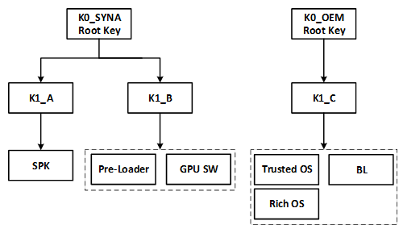
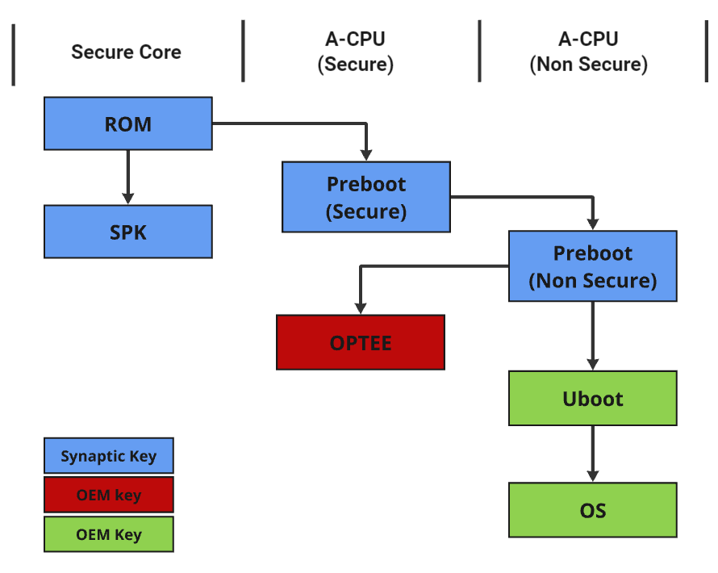
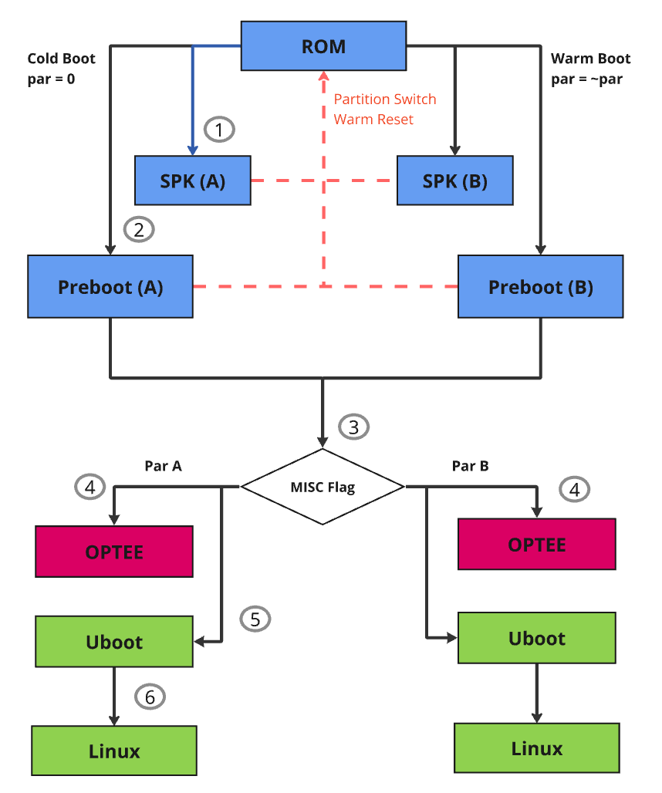
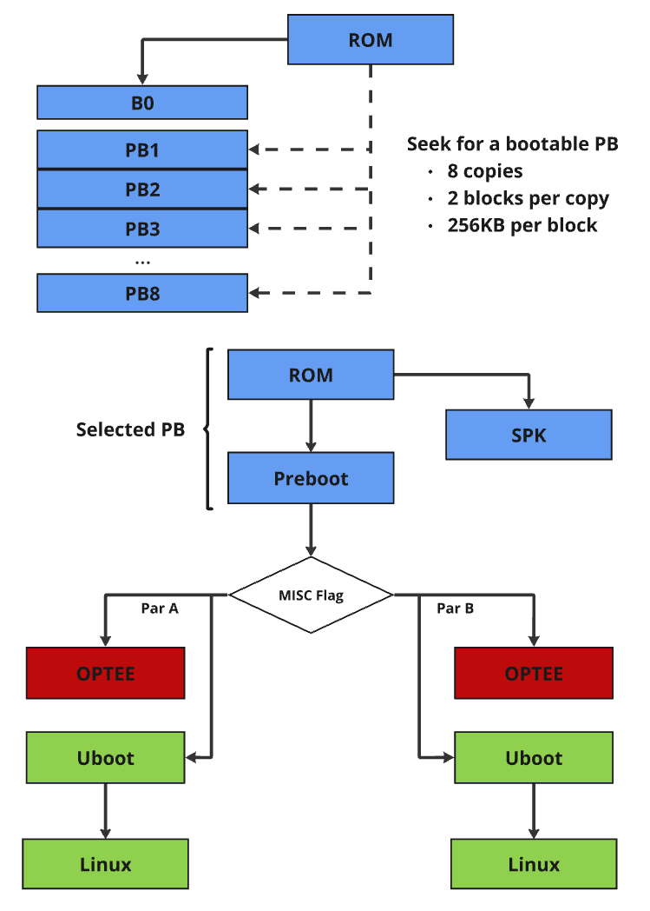
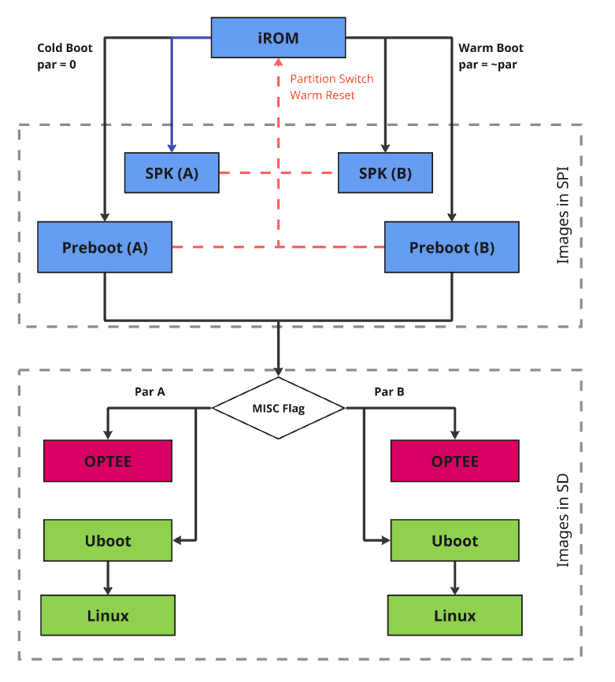
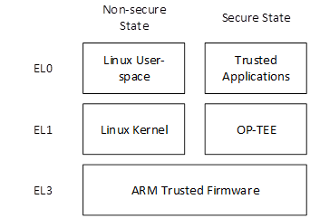

===============
Astra Security
===============

Introduction
============

The **Astra SL16xx Secure Boot** process is a multi-stage boot mechanism
designed to ensure the integrity and authenticity of the firmware
executed on the **Astra Machina** platform. It consists of the following
main stages:

1. **ROM Boot & SPK** – The initial boot stage that establishes a root
   of trust

2. **Pre-boot** – The second stage that performs further system
   initialization and establish secure and nonsecure execution
   environment on ACPU

3. **OS Bootloader** – Customer Bootloader, such as u-boot, that runs in
   non-secure

4. **Kernel and OS** – Loads of the Linux Kernel and file system

Boot ROM & SPK
--------------

Astra Machina platform uses an ARM Cortex-M3 process as a dedicated
security island. The boot process starts with ROM on this security
island while all other CPUs remain in a reset state. The ROM code is
embedded in the chip and cannot be modified. Key functions of ROM
include:

-  Initializes the crypto engine, DMA, and other essential hardware.

-  Loads and authenticates RSA signing keys from the boot device

-  Enforces OTP-based checks and hardware-enforced protections

-  Loads the SPK (Secure Processor Kernel) from flash, decrypts, and
   verifies it.

SPK provides cryptographic services for the system, functions supported
are shown in the table below.

.. table:: Crypto algorithms supported by crypto engines

   +-----------+---------+---------+------------------+------------------+
   | Algorithm | Encrypt | Decrypt | Key Length       | Mode             |
   +===========+=========+=========+==================+==================+
   | AES       | Yes     | Yes     | 128/192/256      | ECB              |
   |           |         |         |                  | /CBC/CTR/XTS/GCM |
   +-----------+---------+---------+------------------+------------------+
   | TDES      | Yes     | Yes     | 56/168           | ECB/CBC          |
   +-----------+---------+---------+------------------+------------------+
   | RC4       | Yes     | Yes     | 256              |                  |
   +-----------+---------+---------+------------------+------------------+
   | ECC       | Yes     | Yes     | 224/256/384/521  |                  |
   +-----------+---------+---------+------------------+------------------+
   | RSA       | Yes     | Yes     | 102              |                  |
   |           |         |         | 4/2048/4096/8192 |                  |
   +-----------+---------+---------+------------------+------------------+
   | SHA       |         |         |                  | SHA-1            |
   |           |         |         |                  | /SHA-224/SHA-256 |
   |           |         |         |                  | /SHA-384/SHA-512 |
   +-----------+---------+---------+------------------+------------------+

Astra Pre-boot
--------------

Pre-boot will initialize the basic services in secure world, performs
necessary system and DDR initialization, validates the OS Bootloader
image and prepare its running environment. Astra Pre-boot image is
signed and encrypted using Synaptics key.

U-Boot (OS Bootloader)
----------------------

Astra SDK uses U-Boot, a popular open-source bootloader, which

-  Loads and executes the OS kernel (Linux, RTOS, etc.) based on A/B
   partition selection

-  Handles boot sources (eMMC, SPI, NAND, SD card, USB, etc.)

-  Supports debugging and firmware recovery

-  Supports OTP programming and reading

-  Supports on-board image updates

In Astra SDK, U-Boot image is provided in clear mode, it is protected by
ODM/OEM key after MP flow.

Linux Kernel (OS)
-----------------

Once U-Boot hands over control to the Linux kernel (OS), the system goes
through several critical steps to initialize hardware, set up the OS,
and start user applications

-  Kernel Initialization

-  Start system services

-  Start user applications

In Astra SDK, Kernel image is provided in clear mode. It can be signed
and encrypted by ODM/OEM key after MP flow, OPTEE can be used for
decryption and authentication before Kernel loading.

Astra Security Features
-----------------------

-  SPK (Secure Processor Kernel)

   -  A dedicated security enclave with cryptographic acceleration.

   -  Implements runtime integrity checks to prevent code tampering.

-  Key Management

   -  Uses a hierarchical key structure with root RSA keys (K0_BOOT,
      K0_TEE, K0_REE).

   -  RSA keys are stored in external flash but are hash-locked in OTP
      to prevent unauthorized changes.

-  Boot Device and Failover

   -  Supports booting from eMMC, SPI, NAND, SD, and USB.

   -  Redundant boot partitions ensure failsafe in case of image
      corruption.

-  Security separation

   -  ARM TrustZone – secure and non-secure worlds separation

   -  Trusted OS – Secure world operating system

   -  Secure Zone Controller to protect memory and peripherals
      configurable for per-master, secure/non-secure, read/write
      attributes.

-  True Random Number Generator (TRNG)

-  DDR scrambler

   -  Keys are managed and provisioned by SPK

-  Debug security

   -  JTAG protection is configurable via OTP with three levels

      -  Open

      -  Password protected

      -  Close

Astra secure boot mechanism ensures that only verified and authorized
firmware runs on the device, protecting it from unauthorized
modifications and ensuring device integrity throughout its lifecycle.

Key Management
==============

The SL16xx Secure Boot implements a **hierarchical key management
system** to ensure firmware authenticity, integrity, and
confidentiality. It utilizes **RSA keys for authentication** and **AES
keys for encryption**. Through defined key management scheme, we ensure:

-  Device security and trusted boot based on Hardware Root of Trust

-  Only authenticated firmware runs via RSA signature verification

-  Firmware confidentiality is maintained through AES encryption

-  Security is reinforced with segmentation, version control, and OEM
   Signing & MP flow

RSA Key Management
------------------

Synaptics devices implement a hierarchy of signing keys that are used
for authenticating all software images involved in the secure boot
chain.

At the root of the hierarchy there are independent root keys which are
stored in the external flash and hash-locked to their SHA-256 hash value
in the OTP to make them immutable. The root keys are verified by the ROM
code which establishes independent root of trust.

The root keys are not used directly; they are used to sign “level one”
keys which are then used to sign the different software images.

   The key hierarchy

AES Key Management
------------------

Four symmetric key slots are allocated in OTP.

.. table:: AES root keys summary

   +--------+--------------+--------------+--------------+--------------+
   | Key ID | Description  | Key size     | Owner /      | Scope        |
   |        |              | (bit)        | provisioned  |              |
   |        |              |              | by           |              |
   +========+==============+==============+==============+==============+
   | MDK    | Master       | 128          | Synaptics    | Common to    |
   |        | Distribution |              |              | all chips    |
   |        | Key          |              |              |              |
   +--------+--------------+--------------+--------------+--------------+
   | CUK    | Chip Unique  | 128          | Synaptics    | Unique for   |
   |        | Key          |              |              | each chip    |
   +--------+--------------+--------------+--------------+--------------+
   | AESK0  | AES key 0    | 128          | OEM          | Common for   |
   |        |              |              |              | all chips    |
   +--------+--------------+--------------+--------------+--------------+
   | RKEK   | Root Key     | 128          | OEM          | Unique for   |
   |        | Encryption   |              |              | each device  |
   |        | Key          |              |              |              |
   +--------+--------------+--------------+--------------+--------------+

The root keys are generated from a qualified HSM offline before being
programmed into OTP.

MDK is typically used as the root key for deriving image-specific
encryption key.

CUK is used as the root key for deriving chip-unique key for encrypting
secure data.

AESK0 and RKEK are the counterparts of MDK and CUK and managed by OEM.

Secure Boot
===========

The generic secure boot flow is consistent across all Astra Machina
platforms, with some differences based on the booting media. Astra
supports A/B boot mechanisms for failover at multiple stages, including
pre-boot, U-Boot, and the operating system. The pre-boot A/B
functionality is provided by Synaptics, while the A/B boot process for
U-Boot and the kernel can be customized by OEMs to suit their specific
needs.

Generic Boot Flow
-----------------

   Astra Generic Boot Flow

A/B Boot Flow (boot failover)
-----------------------------

A/B boot is a fault-tolerant boot mechanism designed to ensure system
reliability during software updates. It maintains two sets of images,
referred as slot A and slot B, or partition A and partition B. This
allows the device to fall back to the inactive slot if the active one
fails to boot. This approach also helps prevent bricking and supports
seamless over-the-air (OTA) updates.

Pre-boot A/B Boot Flow
~~~~~~~~~~~~~~~~~~~~~~

Astra Machina ROM can select the correct pre-boot image to boot based on
image verification result. When active partition boot fails, device can
boot from the alternative partition if contained images pass integrity
checks.

User Space A/B Boot Flow
~~~~~~~~~~~~~~~~~~~~~~~~

A partition flag in the boot control block in misc partition is used by
pre-boot image to decide which U-boot copy to use. Similarly, U-boot
checks the same boot control block to decide which Kernel image to load.

EMMC Boot
---------

   Astra eMMC Boot Flow

**Boot Flow Explanation:**

1. Upon a cold boot, ROM first verifies and sets up SPK: 

   -  SPK provides crypto functionalities to the system at later stage

   -  SPK runs in a dedicated security domain, where only authorized
      security entity (such as TA) can request security services via a
      mailbox call

2. After the SPK is loaded, Pre-boot images are loaded and verified by
   SPK:

   -  SPK loads and verifies the Pre-boot images which are responsible
      for setting up the system and environment for Secure OS and Rich
      OS

   -  Any failure will trigger failsafe mechanism leading to boot
      attempt from other partition

3. The last preboot image (1\ :sup:`st` stage loader) is responsible for
   loading the U-Boot (2\ :sup:`nd` stage loader)

   -  1st stage loader checks the OS-boot partition flag within the boot
      control block.  This boot control block is located in a misc
      partition on the flash.

   -  To ensure failsafe, 1st stage loader has a factory copy of the
      boot control block, this ensures device can continue to boot when
      the active boot control block is corrupted (See misc partition
      selection handling for details in subsection 5.2)

4. The 1\ :sup:`st` stage loader loads and verifies the OPTEE according
   to the OS boot partition flag.

   -  With Astra SDK, OPTEE and U-Boot are in clear by default, they are
      only signed and encrypted if OEM security is enabled via MP flow

   -  OPTEE lives in the secure domain of the A-CPU, often referred to
      as trusted execution environment (TEE).

   -  Applications in rich execution environment (REE) can communicate
      with TEE through trusted application (TA)

5. The 1st stage loader loads and verifies U-Boot according to the OS
   boot partition flag.

   -  If OEM security is enabled, U-Boot is signed and encrypted by
      using the OEM key

   -  Once U-Boot is running, the trusted secure boot chain
      responsibility is in OEM’s hand.  

6. The U-Boot loads and verifies kernel Image.

   -  The kernel Image is signed and encrypted by using the OEM key,
      OPTEE is used to verify the image

   -  For failsafe, OEM can use its own A/B logic or use the same
      OS-Boot partition flag.

   -  If OS-Boot partition flag is used, U-Boot and kernel are always
      coming from the same partition because the same flag is used

SPI Boot
--------

Astra SPI booting sequence is same as Astra eMMC Boot, please refer to
Figure 3: Astra eMMC Boot Flow for details.

NAND Boot
---------

NAND flash could have bad blocks due to manufacturing defects and wear
over time. To ensure reliable booting, most NAND flash vendors guarantee
that the initial few blocks are error-free.

For NAND boot, ROM reads essential information for boundary scan from
block 0. In Synaptics Astra SDK, up to 8 copies of preboot images are
stored starting from NAND flash block 1, by default, each copy occupies
2 flash blocks and each block is 256 Bytes (block number and block size
are configurable). ROM loads SPK and preboot images based on boundary
scan result and executes.

**Note:** Astra Machina board does not have NAND interface support; as a
result, NAND boot can only be done on vendor HW device.

   Astra NAND Boot Flow

SD Card Boot
------------

Astra SDK SD Card boot flow is similar to Astra SPI boot. It relies on
Astra Machina onboard SPI NOR to complete the Pre-boot and uses inserted
SD card to complete the remaining boot process, U-boot and OS.

   Astra SD Card Boot

USB Host Boot
-------------

Astra USB Host Boot uses the same boot flow without A/B. Please see
Figure 2: Astra Generic Boot Flow for details.

Software Image Verification
---------------------------

SPK is responsible for image verification. It uses the hardware crypto
engine to accelerate operations.

All software images are signed and encrypted. The image signature scheme
is SHA256-RSA2048. Images are encrypted with image-specific keys derived
from root symmetric key. AES-CBC is the algorithm for encryption, and
the key size is 128-bit. The key derivation function (KDF) is compliant
with NIST SP800-108 standard.

OEM Secure Boot Enabling 
------------------------

Both Synaptics image and OEM image can boot in 2 different modes, secure 
or non-secure.  This section describes what these 2 modes are and how 
OEM secure boot can be enabled. 

Non-Secure Boot
~~~~~~~~~~~~~~~

Non-secure boots often are used during development phase to allow unsigned 
code to boot. Astra SDK’s secure boot is controlled by two OTP fuses:

-  SYNA_secure_boot_enable → for Synaptics-owned images

-  OEM_secure_boot_enable → for OEM (your) images

For each Astra SDK release, Synaptics enables both fuses to test the full 
secure boot chain.  In the released Astra SDK, Synaptics enables only the 
SYNA_secure_boot_enable fuse.  This means that preboot images (owned by 
Synaptics) are always securely booted, U-boot, kernel, and TEE images 
(owned by OEM) are non-securely booted. Because OEM_secure_boot_enable 
fuse is NOT set in the release SDK, OEM can decide when to enable secure 
boot of OEM images.

Enabling OEM Secure Boot
~~~~~~~~~~~~~~~~~~~~~~~~

For production, Synaptics images are signed with Synaptics private key and 
OEM images are initially not signed.  During the OEM mass production (MP) 
flow, OEM can burn the OEM_secure_boot_enable OTP fuse to enable OEM secure 
boot. After the fuse is set:  

-  OEM images must be signed with OEM keys

-  The flash is then updated with OEM signed images

After OEM secure boot is enabled, the device won’t boot unsigned image again, 
OEM must use signed image even for your development purpose.

How keys are used in Secure Boot
~~~~~~~~~~~~~~~~~~~~~~~~~~~~~~~~

The secure boot chain is based on RSA + AES and key hierarchies.  Each image 
consists of:

-  Image header: metadata, signature, hash, version, etc.

-  Image body: the encrypted code

To establish a trusted boot chain, we have 2 levels of key hierarchy for **RSA 
signing** keys:  

-  K0 (root key): the ultimate trust anchor.  RSA K0 key pair is generated by 
   OEM. OEM keeps the private key, public key is stored on flash and its hash 
   value is burned into OTP for integrity check

-  K1 (intermediate key): used to sign the actual images. RSA K1 key pair is 
   also generated by OEM. IEM keeps the K1 private key, K1 public key is signed 
   by K0 private key.  And the signed K1 public key is stored in flash

During device boot up, K0 public key’s integrity is checked by ROM code by 
comparing it hash value against what’s stored in OTP.  When authenticating an 
image’s integrity, K0 public key is used to verify K1 public key, and K1 
public key is used to verify the image. 

The image body is encrypted with **AES encryption** keys for confidentiality. 
The secure processor derives the AES key on the fly using a NIST standard KDF 
(SP800-108).  Inputs to KDF function include Image ID and other metadata. 

Authentication flow in Secure Boot
~~~~~~~~~~~~~~~~~~~~~~~~~~~~~~~~~~

Crypto APIs used for image authentications are executed in the secure processor 
only, only images satisfying the following are allowed to boot: 

-  Signed by a trusted key (via RSA)

-  Encrypted with the correct key (via AES)

-  Matched to expected IDs, flags, and versions

The trusted boot flow is established with the following key steps: 

1.	**Hash-locking**: Confirm K0 in the flash and the K0 hash in the OTP matches

2.	**Verify K1**: Ensure K1 was signed by K0

3.	**Verify image header** signature with K1

4.	**Sanity checks**:

   -  Is Image ID correct?

   -  Does segment ID match OTP lock?

   -  Is image version ≥ version in OTP? (Anti-rollback)

   -  Are production flags consistent?

5.	**Key derivation**: Use KDF to derive AES key specific to the image

6.	**Decrypt image** body using AES-CBC

7.	**Hash value of the decrypted image** is compared with the checksum in the header

Trusted Execution Environment (TEE)
===================================

Architecture
------------

The figure below depicts an example system architecture from a SoC,
indicating the components that make up the Rich Execution Environment
(REE) vs the components that make up the Trusted Execution Environment
(TEE).

.. figure:: media/tee-architecture-diagram.png

   TEE architecture diagram

In this figure, the system is shown to consist of non-secure software
running in the REE; secure software running in the TEE; non-secure
hardware controlled by the REE; and secure hardware controlled by the
TEE.

Additionally, there is some hardware which is consider both part of the
REE and the TEE. The application CPU (Cortex-A class) has the capability
to execute secure or non-secure workloads by means of time sharing. The
Dynamic RAM is partitioned into an area which is accessible by the REE,
and another area which is only accessible by the TEE.

The system can be further subdivided into different security domains
based on use-cases, for example TA executes its own isolated space,
which is managed by OP-TEE.

TEE Software
------------

The software architecture of the software running on the Host CPU is
depicted in the figure below, indicating the secure vs. non-secure state and
exception level.

The open-source OP-TEE is integrated and serves as the Trusted-OS.

   Cortex-A (ACPU) TEE software architecture

Communication from Linux User Space to a Trusted Application follows
these steps:

1. The user-space application calls a client API, which packs the
   parameters into a message buffer

2. The user space application issues a system call to the Linux
   TrustZone Driver (TZD) to pass the message to the TEE

3. The TZD uses the SMC instruction to trap into EL3

4. ARM Trusted Firmware (ATF) switches the CPU to secure state and
   resumes TZ Kernel in Secure EL1 with the message being passed

5. OP-TEE locates the target Trusted Application, and switches the
   secure execution context to Secure EL0 in the target TA

6. The target TA processes the command

Trusted Application Partitioning
--------------------------------

Each trusted application is isolated from other trusted applications and
has access to its own memory space. This isolation is done using the
ACPU MMU. The MMU is under the control of the OP-TEE executing in Secure
EL1 and cannot be modified by trusted applications executing in Secure
EL0.

TA Development
--------------

TA development follows OP-TEE specification. In Astra SDK, TA encryption
is not enabled. OEM can enable it by setting ``CFG_ENCRYPT_TA=y`` before
building OPTEE OS. For TA development and encryption, please refer to
OP-TEE document `Trusted
Applications <https://optee.readthedocs.io/en/latest/building/trusted_applications.html>`__
for details.
