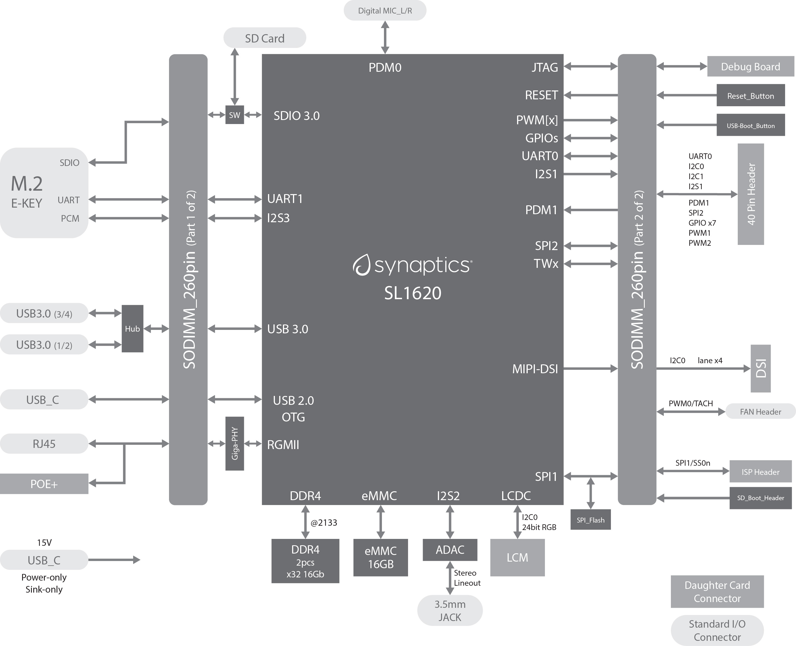
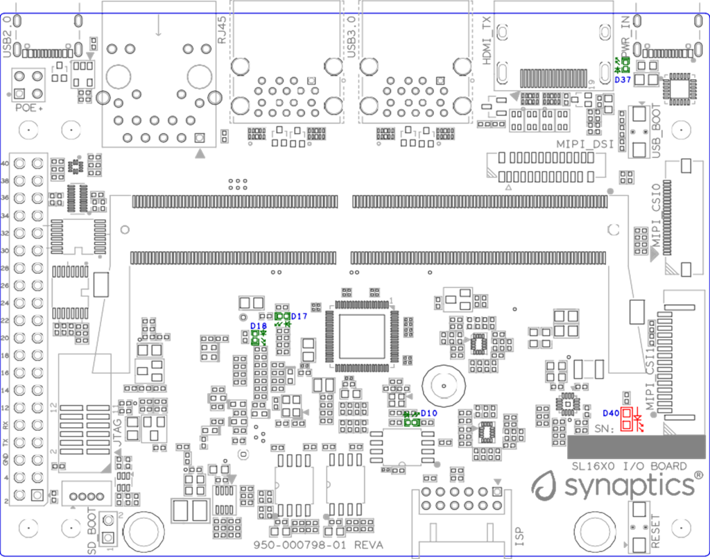
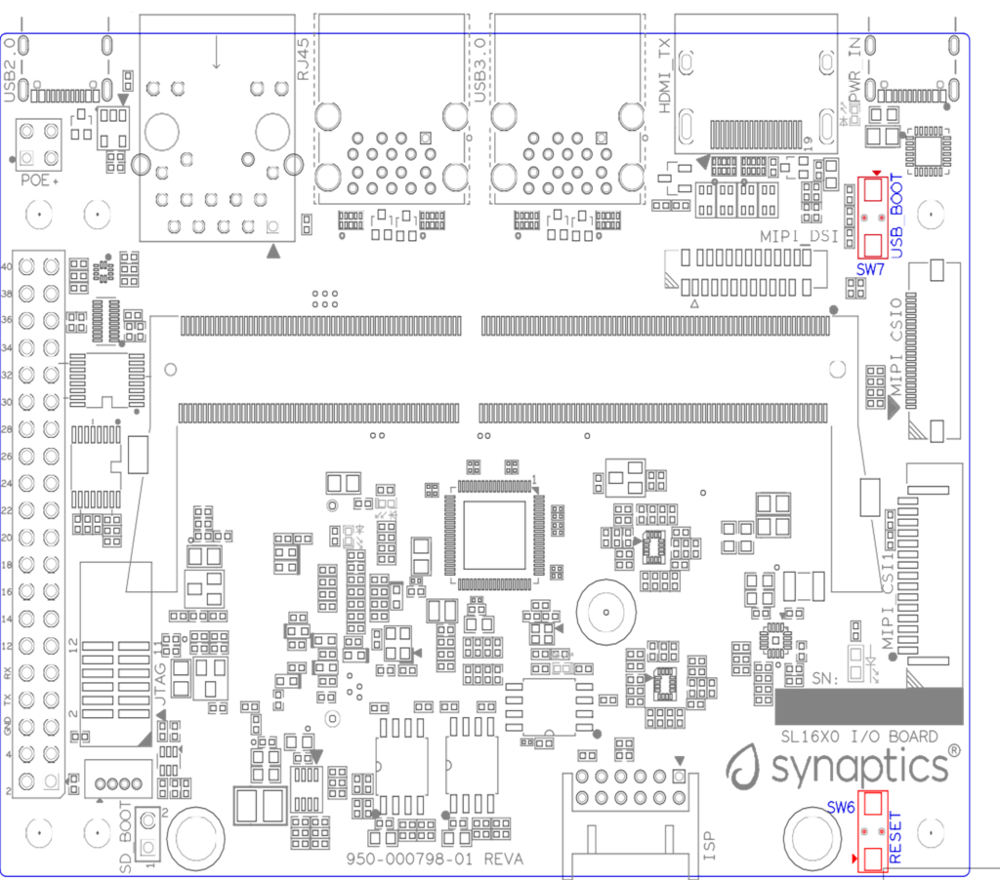
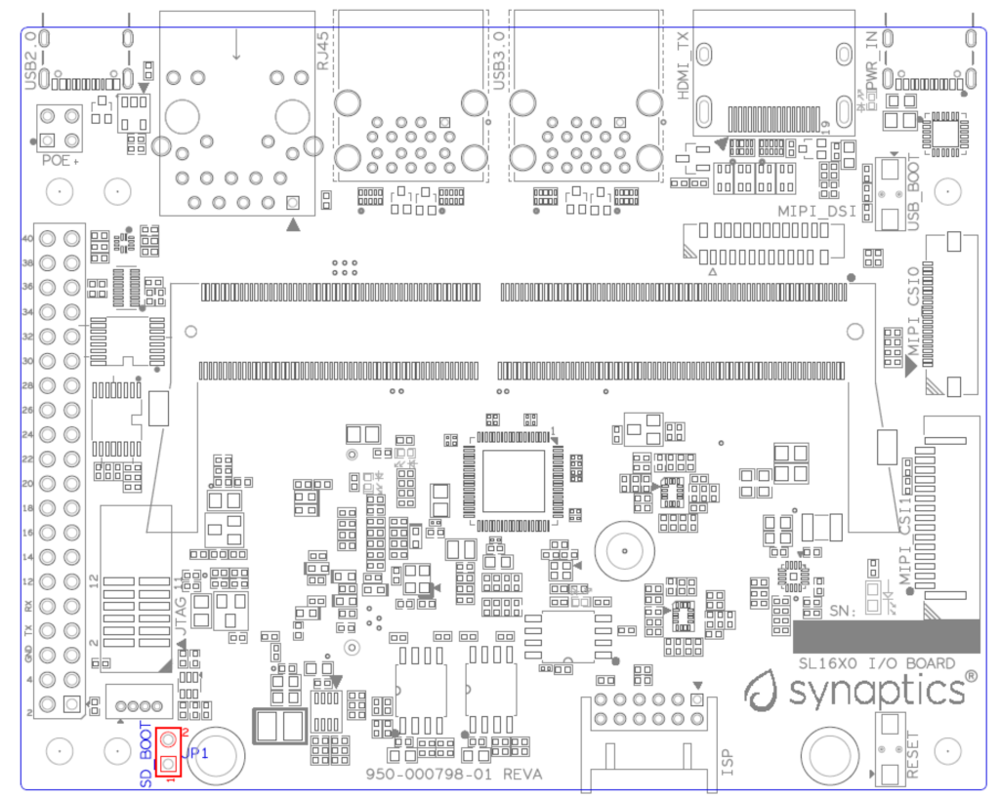
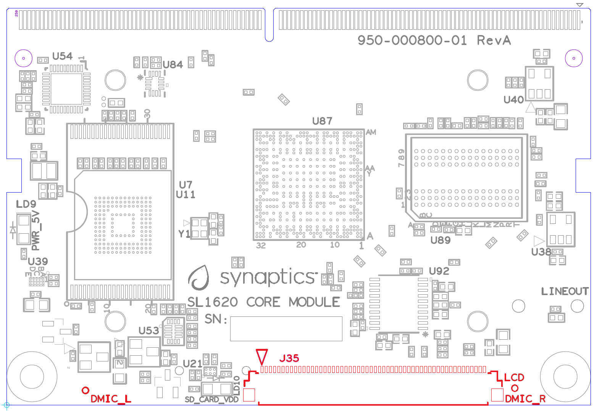
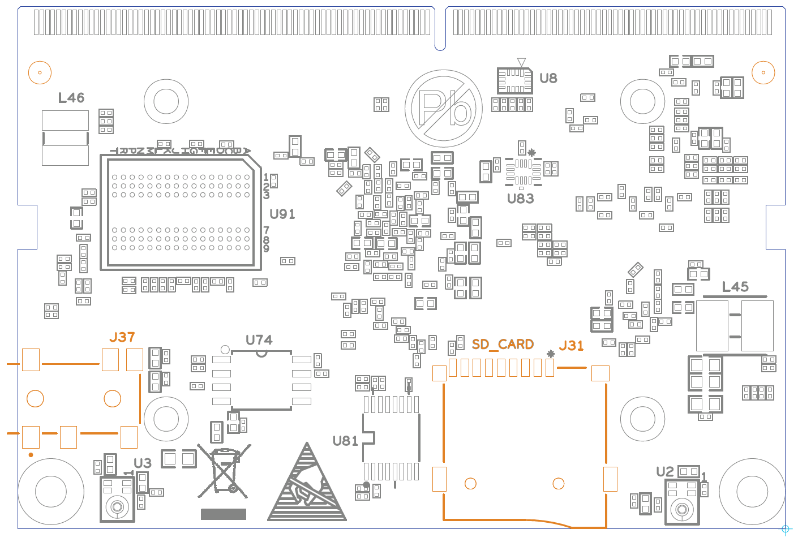
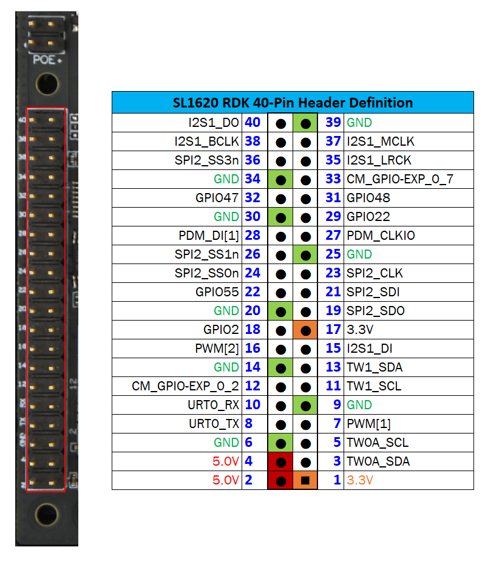
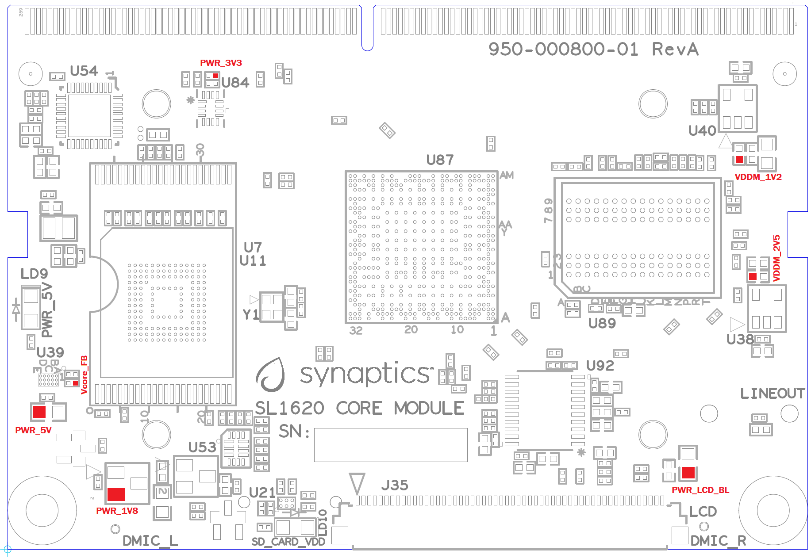

=================
SL1620 User Guide
=================

Introduction
============

The Astra Machina Foundation Series of evaluation-ready kits
enable easy and rapid prototyping for the Synaptics SL series of
multi-modal embedded processors. A modular design incorporates swappable
core compute modules, a common I/O board, and daughter cards for
connectivity, debug, and flexible I/O options.

The Synaptics Astra SL-Series is a family of highly integrated AI-native
Linux and Android SoCs optimized for multi-modal
consumer, enterprise, and industrial IoT workloads with hardware
accelerators for edge inferencing, security, graphics, vision, and
audio. The SL1620 is designed and optimized for embedded applications
that require powerful processing, advanced AI capability, and 3D
graphics. This chip comes with Linux® OS, superior audio algorithms, a
variety of peripherals, dual displays, companion Synaptics SoC for
connectivity and audio front end.

Scope
-----

This user guide describes the hardware configuration and functional
details for the Astra Machina SL1620 core module, I/O card, and
supported daughter cards, in addition to the bring-up sequence for the
evaluation kit.

Definition of Board Components
------------------------------

-  **Astra Machina:** Combined system with core module, I/O board, and
   supported daughter cards.

-  **Core module:** Processor subsystem module with key components
   including SL1620, eMMC, and DDR4.

-  **I/O board:** Common base board that includes various standard
   hardware interfaces, buttons, headers, and power-in.

-  **Daughter card:** Add-on boards for supporting various features such
   as connectivity, debug, and other flexible I/O options.

Astra Machina System Overview
-----------------------------

This section covers system features, block diagrams and top views of the
Astra Machina evaluation kit.

   SL1620 core module (Dimensions: WxH = 69.6 x 47.38mm)

.. figure:: ./media/sl1620/image6.png
   :width: 3.97674in
   :height: 3.05988in

   I/O board

Features
~~~~~~~~

The SL1620 evaluation system includes the following components:

-  Main components on the core-module:

-  Synaptics SL1620 Quad-Core Arm Cortex-A55
      Embedded IoT Processor, up to 1.9 GHz

-  Storage: eMMC5.1 (16 GByte)

-  DRAM: x32 2GB system memory by 2pcs x16, 8-Gbit, DDR4-2133

-  PMIC: support DVFS in Vcore supply rail

-  SD Card Receptacle

-  Line-out: direct Line Level 2.1-VRMS stereo output

-  DMIC: 2 digital microphones – 1 PDM stereo audio input

-  LCDC(RGB): on 54-pins FPC connector to support RGB 16bpp, 18bpp and
   24bpp output formats; up to 1080p30 screen resolution

-  Main components on I/O board:

-  M.2 E-key 2230 Receptacle: It supports SDIO, UART for WiFi/BT modules

-  USB 3.0 Type-A: 4 ports to supports host mode at SuperSpeed

-  USB 2.0 Type-C: supports OTG host or peripheral mode at Hi-Speed

-  Push buttons: used for USB-BOOT selection and system RESET

-  2pin Header: used for SD-BOOT selection

-  Off-board daughter card interface options:

-  MIPI DSI on 22-pin FPC interface to support 4-lane DPHY plus I2C and
   GPIOs for up to 1080p60 display panel

-  ISP 12-pin daughter card to support offline program SPI NOR flash on
   Core-Module

-  JTAG daughter card for debug

-  40-pin header for additional functions

-  4-pin PoE+ connector, with a PoE hat board (purchased separately), it offers an 
   add-on voltage regulator module for PoE+ Type2 (802.3at) power device.  Available 
   power shall be 25.5W (Class 4) at 5Vpins of 40-pin header to I/O board.

-  4-pin connector for active Fan with PWM

-  Type-C power supply with 15V @ 1.8A

SL1620 system block diagram
~~~~~~~~~~~~~~~~~~~~~~~~~~~

   SL1620 system block diagram

Top view of SL1620 Astra Machina Evaluation System
~~~~~~~~~~~~~~~~~~~~~~~~~~~~~~~~~~~~~~~~~~~~~~~~~~

.. figure:: ./media/sl1620/image8.png
   :width: 5in
   :height: 3.16079in

   Top view of SL1620 evaluation system

System connectors
~~~~~~~~~~~~~~~~~

.. figure:: ./media/sl1620/image9.png
   :width: 5in
   :height: 2.43483in

   Front view

.. figure:: ./media/sl1620/image10.png
   :width: 5in
   :height: 2.54647in

   Rear view

Astra Machina Board Control/Status & System I/O
===============================================

This section covers booting up, LEDs status indicators, buttons,
connectors, and pin-strap settings.

Booting up
----------

There are three types of booting up, select one bootup before powering
on the Astra Machina.

-  **eMMC boot:** Default booting up.

-  **SD boot:** Short SD_Boot header by 2.54mm jumper-cap before
   power-up, see SD_Boot header in :ref:`sl1620_jumpers`. Ensure SD-Card with
   firmware is plugged into SD-slot on Core Module in :ref:`sl1620_core_bottom`.

-  **USB boot:** Connect USB-C usb2.0 port to the host PC, then follow
   the procedure in the :ref:`hardware_manual_button_settings_sl1620` section.

LEDs
----

LED locations
~~~~~~~~~~~~~

:ref:`sl1620_leds` shows the LED locations on the I/O board.

.. _sl1620_leds:

   LED locations on I/O board

LED definitions
~~~~~~~~~~~~~~~

.. _sl1620_leds_table:

.. table:: LED definitions on I/O board

    === ===== =======================================================================
    LED Color LEDs Function
    === ===== =======================================================================
    D10 Green LED indicator for USB3.0 Hub is working in normal mode or suspend mode.
    D17 Green LED indicator1 for M.2 device general purpose.
    D18 Green LED indicator2 for M.2 device general purpose.
    D37 Green LED indicator for USB-C PD power source status.
    D40 RED   LED indicator for Stand-by status.
    === ===== =======================================================================

SoC Pinstrap and Bootup Settings
--------------------------------

.. table:: SoC pinstrap and bootup settings on core module

    ============ ================= ============= ================= =============================================================================
    Pad Name     Strap Name        Setting Value Resistor Stuffing Description

                                   Default\*     + stuffed         Rpu = OnChip Pull-up

                                                 - removed         Rpd = OnChip Pull-down
    ============ ================= ============= ================= =============================================================================
    TEST_EN      TEST_EN           —             —                 SM TEST Enable (Rpd)
    \                              0\*           -R120             0: Enable ARM ICE JTAG connections (CoreSight)
    \                              1             +R120             1: Enable SCAN or BSCAN tests
    JTAG_SEL     JTAG_SEL          —             —                 SM JTAG Port Selection (Rpd)
    \                              0\*           -R121             0: ARM ICE JTAG connections
    \                              1             +R121             1: Reserved for factory use
    POR_EN       POR_EN            —             —                 Power-on reset (POR) bypass (Rpu)
    \                              0             +R4               0: Bypass on-chip POR generator
    \                              1\*           -R4               1: Enable on-chip POR generator
    PWM[0]       cpuRstByps        —             —                 CPU reset bypass strap (Rpd)
    \                              0\*           -R116             0: Enable reset logic inside CPU partition
    \                              1             +R116             1: Bypass reset logic inside CPU partition
    SPI2_SCLK    pllPwrDown        —             —                 SYS/MEM/CPU PLL Power Down;

                                                                   Note: pllPwrDown should be set to 1 only when pllByps is also set to 1. (Rpd)
    \                              0\*           -R123             0: Power up
    \                              1             +R123             1: Power down
    USB2_DRV\_   pllByps           —             —                 SYS/MEM/CPU PLL bypass indicator

    VBUS
    \                              0\*           -R124             0: No bypass
    \                              1             +R124             1: All PLL bypassed
    SPI2_SS0n    software_strap[1] —             —                 Straps for software usage (Rpd)
    \                              0\*           -R117             —
    \                              1             +R117             —
    SPI1_SDO[0]  software_strap[2] —             —                 Straps for software usage (Rpd)
    \                              0\*           -R118             —
    \                              1             +R118             —
    SPI1_SCLK[1] software_strap[3] —             —                 Straps for software usage (Rpd)
    \                              0\*           -R119             —
    \                              1             +R119             —
    I2S1_DO      boot_src[0]       —             —                 CPU Boot Source bit [0] (Rpu). See boot_src[1:0].

                                                                   2’b00: SPI-Secure Boot

                                                                   2’b01: ROM boot from NAND

                                                                   2’b10: ROM boot from eMMC

                                                                   2’b11: SPI-Clear boot
    \                              0\*           R105              ROM boot from SPI.
    \                              1             R107              ROM boot from NAND.
    I2S2_DO      boot_src[1]       —             —                 CPU Boot Source bit [1] (Rpd). See boot_src[1:0].

                                                                   2’b00: SPI-Secure Boot

                                                                   2’b01: ROM boot from NAND

                                                                   2’b10: ROM boot from eMMC

                                                                   2’b11: SPI-Clear boot
    \                              0             R108              ROM boot from SPI.
    \                              1\*           R106              ROM boot from eMMC.
    I2S3_DO      Legacy_boot       —             —                 Strap to reduce reset wait time (Rpd)
    \                              0\*           -R122             0: 2 ms
    \                              1             +R122             1: 20 ms
    ============ ================= ============= ================= =============================================================================

.. table:: Bootup settings on I/O board

    =========================== ========== ============= ================= =================================================================================
    Net Name                    Strap Name Setting Value Resistor Stuffing Description

                                           Default\*     + stuffed         Rpu = OnChip Pull-up

                                                         - removed         Rpd = OnChip Pull-down
    =========================== ========== ============= ================= =================================================================================
    USB_BOOTn                   USB-Boot   —             —                 ROM code uses this strap to determine if booting from USB or not (Rpu)
    \                                      0             —                 0: Boot from USB when USB-BOOT button is pressed while system reset de-assertion.
    \                                      1\*           —                 1: Boot from the device select by boot_src[1]
    CONN-SPI.VDDIO1P8.BOOT_SRC1 SD-Boot    —             —                 ROM code uses this strap to determine if booting from SD_Card or not (Rpu)
    \                                      0             —                 0: Boot from SD_Card when SD_Boot header is on while system reset de-assertion.
    \                                      1\*           —                 1: Boot from the device select by boot_src[1] when SD_Boot Header is off.
    =========================== ========== ============= ================= =================================================================================

.. _hardware_manual_button_settings_sl1620:

Hardware Manual Button Settings
-------------------------------

.. table:: Hardware manual button settings definitions on I/O board

    ============= ==================== ======= ================================================================================================
    Switch Block  Type                 Setting Function
    ============= ==================== ======= ================================================================================================
    SW6 (RESET)   Momentary Pushbutton Push    SL1620 Reset Key asserted
    \                                  Release Key de-asserted
    SW7(USB_BOOT) Momentary Pushbutton Push    USB boot Key asserted. Needs combo RESET button. Read below steps on how to enter USB-Boot mode.
    \                                  Release Key de-asserted
    ============= ==================== ======= ================================================================================================

To enter USB-Boot mode, follow these steps:

.. note::

    Prior to these steps, make sure the USB driver is installed
    successfully on PC host side. For details, please reference :doc:`/linux/index`

1. Push RESET button to assert system reset to SL1620.

2. Keep pushing RESET button and push USB_BOOT button at the same time
   for 1-2 seconds.

3. Release RESET button while holding USB_BOOT button, so SL1620 enters
   USB-Boot mode.

4. Check and wait for the console print… messages.

   Once the console print is returned and entered USB boot successfully,
   release USB_BOOT button.

   Locations of manual buttons on I/O board

Hardware Jumper Settings
------------------------

.. table:: Hardware jumper settings definitions on I/O board

    ======= ================= ========== =======================================================================
    Ref Des Type              Pin        Description

                              Connection
    ======= ================= ========== =======================================================================
    JP1     2x1 2.54mm header 1-2        SD_Boot selection
    \                                    -  Open: Boot from the device select by boot_src[1]
    \                                    -  Short: Boot from SD_Card while power-up or system reset de-assertion
    ======= ================= ========== =======================================================================

To enter SD-Boot mode, follow these steps.

2. Prior to these steps, make sure SD-Card with firmware is plugged into
   SD-slot on core module.

1. Short SD_Boot header by 2.54mm jumper-cap before power-up.

5. Power-up system, then boot-up from SD_Card.

:ref:`sl1620_jumpers` shows the Header locations on the I/O board.

.. _sl1620_jumpers:

   Locations of jumper on I/O board

SL1620 Evaluation System Connectors
-----------------------------------

Locations of core module connectors on top side
~~~~~~~~~~~~~~~~~~~~~~~~~~~~~~~~~~~~~~~~~~~~~~~

   Locations on core module top side

Locations of core module connectors on bottom side
~~~~~~~~~~~~~~~~~~~~~~~~~~~~~~~~~~~~~~~~~~~~~~~~~~

.. _sl1620_core_bottom:

   Locations on core module bottom side

Core module connector definitions
~~~~~~~~~~~~~~~~~~~~~~~~~~~~~~~~~

.. table:: Core module connector definitions

    ======= ========================= ================ ==========================================================
    Main    Connecting Boards/Devices Functions        Remarks
            (Ref Des if any)
    Ref Des
    ======= ========================= ================ ==========================================================
    J31     MicroSD Card              SDIO card        For micro-SD type of memory card extension.
    J35     LCD                       LCD              Connects LCD panel daughter card through 54-pin FPC cable.
    J37     Line out                  Analog audio L/R Audio L/R output to 3.5mm Jack.
    U2, U3  DMIC_L/R                  PDM              Digital MIC_L/R input.
    ======= ========================= ================ ==========================================================

Locations of I/O board connectors on top side
~~~~~~~~~~~~~~~~~~~~~~~~~~~~~~~~~~~~~~~~~~~~~

.. figure:: ./media/sl1620/image16.png
   :width: 6.5in
   :height: 5.15694in

   Locations on I/O board top side

Locations of I/O board connectors on bottom side
~~~~~~~~~~~~~~~~~~~~~~~~~~~~~~~~~~~~~~~~~~~~~~~~

   Locations on I/O board bottom side

I/O board connector definitions
~~~~~~~~~~~~~~~~~~~~~~~~~~~~~~~

.. table:: I/O board connector definitions

    ======= ========================= =================================================== ==============================================================================
    Main    Connecting Boards/Devices Functions                                           Remarks
            (Ref Des if any)
    Ref Des
    ======= ========================= =================================================== ==============================================================================
    J1      ISP D/C                   SPI                                                 12-pin daughter card to support offline program SPI NOR flash on core-module
    J2      RJ45 cable                Giga Ethernet                                       For Wired Ethernet connection
    J12     HDMI Sink                 HDMI TX                                             Not applicable for SL1620.
    J13     FAN                       Heat Dissipation w/ FAN                             Active FAN with PWM
    J17     M.2 2230 D/C              SDIO and PCIe                                       1x1/2x2 WiFi/Bluetooth card via SDIO

                                                                                          PCIe is not applicable for SL1620.
    J22     Debug Board               JTAG                                                XDB debugger for debugging
    J32     40-pins Header            UART, I2C, SPI, PDM, I2SI/O, GPIOs, STS1, PWMs, ADC Flexible for support various D/C
    J34     PoE+ D/C                  PoE+                                                4-pin PoE+ daughter card with supporting an add-on 5V voltage to 40pin Header.
    J206    MIPI-CSI0 adaptor         MIPI-CSI                                            Not Applicable for SL1620
    J207    MIPI-CSI1 adaptor         MIPI-CSI                                            Not Applicable for SL1620
    J208    MIPI-DSI adaptor          MIPI-DSI                                            For MIPI-DSI x4 lane extension, like panel
    J210    USB Device                USB 3.0 x2                                          For USB3.0 extension in Device mode only
    J213    TypeC power source        Power Supply                                        Power for Astra Machina rated at 15V/1.8A
    J215    USB Device                USB2.0 OTG                                          For USB2.0 extension, in either Host or Device mode
    J216    USB Device                USB 3.0 x2                                          For USB3.0 extension in Device mode only
    ======= ========================= =================================================== ==============================================================================

Daughter Cards
==============

A set of daughter cards supplements the Astra Machina system with a
variety of I/O peripheral functionalities. Perspective devices offered
by different manufacturers for each of such I/O may be implemented using
respective daughter card.

Debug Board 
------------

Debug board (Rev5) allows users to communicate with the SL1620 system
over JTAG through a debugger on a PC host. While connecting the
evaluation system and debug board with a 20-pin flat cable, align pin-1
of the 2x10 cable socket at debug board side with pin-1 of 2x6 header
J22 on the evaluation system.

.. note::

  Users may communicate with SL1620 over UART on a PC host by using a
  low-cost UART to USB cable commonly available. See Astra Machina
  webpage for a qualified list. As an option, the debug board also
  provides such bridging function based on the Silicon Labs CP2102. A
  virtual COM port driver is required, and can be downloaded from the
  `vendor website <https://www.silabs.com/products/development-tools/software/usb-to-uart-bridge-vcp-drivers>`__
  and installed in the PC host

UART on the evaluation system and the PC host USB are digitally
isolated, with no direct conductive path, eliminating ground loop and
back-drive issues when either is powered down.

:ref:`sl1620_debug` shows debug board connectivity facilitating UART and JTAG
communications.

.. _sl1620_debug:

   Debug board connectivity for UART and JTAG

M.2 Card
--------

An M.2 E-Key socket J17, is provided for a variety of modules in the M.2
form factor. Typical applicable modules support WiFi/BT devices with
SDIO or PCIE signal interfaces.

Available modules:

-  Ampak AP12611_M2 with SYN43711 WiFi6E/BT5.3 1x1 over SDIO on M.2
   adaptor

260-Pins SODIMM definition
--------------------------

A 260-Pins SODIMM connector (PN: TE_2309413-1) joins the core module and
the I/O board. :ref:`sl1640_sodimm` shows the assignment for the 260-Pins.

.. _sl1640_sodimm:

.. table:: 260-pins SODIMM definition

    ============================= ==== =============== ==== ==========================
    Assignment                    Pin# 260-Pins SODIMM Pin# Assignment
    ============================= ==== =============== ==== ==========================
    GePHY_RSTn (From IO_Exp)      2                    1    n/a
    SPI1_SDO && STRP[SS2]         4                    3    n/a
    SPI1_SCLK && STRP[SS3]        6                    5    n/a
    LCD_RSTn (From IO_EXP)        8                    7    n/a
    n/a                           10                   9    n/a
    SPI1_SDI                      12                   11   n/a
    SPI1_SS0n                     14                   13   n/a
    External_Boot_SRC0            16                   15   n/a
    USB-C_Logic_INTn              18                   17   n/a
    SD-CARD_PPWR_EN               20                   19   n/a
    SD-CARD_VIO_SEL               22                   21   n/a
    LCD_TP_IRQ                    24                   23   n/a
    GND                           26                   25   n/a
    n/a                           28                   27   n/a
    n/a                           30                   29   n/a
    GND                           32                   31   n/a
    n/a                           34                   33   n/a
    n/a                           36                   35   n/a
    GND                           38                   37   n/a
    n/a                           40                   39   n/a
    n/a                           42                   41   n/a
    GND                           44                   43   n/a
    USB2_Dn                       46                   45   n/a
    USB2_Dp                       48                   47   n/a
    GND                           50                   49   n/a
    USB3_RXp                      52                   51   n/a
    USB3_RXn                      54                   53   GND
    GND                           56                   55   n/a
    USB3_TXp                      58                   57   n/a
    USB3_TXn                      60                   59   GND
    GND                           62                   61   n/a
    USB3_USB20.Dp                 64                   63   n/a
    USB3_USB20.Dn                 66                   65   GND
    GND                           68                   67   n/a
    USB2_IDPIN                    70                   69   n/a
    PWR_OTG_VBUS                  72                   71   GND
    PWR_USB3_VBUS                 74                   73   n/a
    I2S3_BCLK                     76                   75   n/a
    I2S3_DI                       78                   77   GND
    I2S3_DO                       80                   79   n/a
    2S3_LRCK                      82                   81   n/a
    I2S1_DI                       84                   83   GND
    GPIO[22]                      86                   85   n/a
    PDM_DI[1]                     88                   87   n/a
    PDM_CLKIO                     90                   89   GND
    TW1_SCL                       92                   91   n/a
    TW1_SDA                       94                   93   n/a
    GPIO-EXP_0_2                  96                   95   GND
    FAN_TACH_Control              98                   97   n/a
    n/a                           100                  99   n/a
    FAN_PWM                       102                  101  GND
    I2S1_BCLK                     104                  103  n/a
    EXPANDER_INT-REQn             106                  105  n/a
    BOOT_SRC1                     108                  107  GND
    I2S1_DO0                      110                  109  n/a
    I2S1_MCLK                     112                  111  n/a
    I2S1_LRCK                     114                  113  GND
    PWM2                          116                  115  MIPI_DSI_TD0n
    GPIO[2]                       118                  117  MIPI_DSI_TD0p
    URT0_TXD                      120                  119  GND
    URT0_RXD                      122                  121  MIPI_DSI_TD1n
    SPI2_SDI                      124                  123  MIPI_DSI_TD1p
    SPI2_SCLK                     126                  125  GND
    SPI2_SDO                      128                  127  MIPI_DSI_TCKp
    SPI2_SS3n                     130                  129  MIPI_DSI_TCKn
    USB2_OCn                      132                  131  GND
    SPI2_SS1n                     134                  133  MIPI_DSI_TD3n
    SPI2_SS0n                     136                  135  MIPI_DSI_TD3p
    TW1_SDA                       138                  137  GND
    TW1_SCL                       140                  139  MIPI_DSI_TD2p
    n/a                           142                  141  MIPI_DSI_TD2n
    n/a                           144                  143  GND
    SPI2_SDO_3V3                  146                  145  GND
    SPI2_SDI_3V3                  148                  147  n/a
    SPI2_CLK_3V3                  150                  149  n/a
    n/a                           152                  151  GND
    USB-C_Logic_INTn              154                  153  n/a
    n/a                           156                  155  n/a
    n/a                           158                  157  GND
    Levershift_EN# for 40P header 160                  159  n/a
    n/a                           162                  161  n/a
    RSTIn\@PU                     164                  163  GND
    JTAG_TDO                      166                  165  n/a
    JTAG_TDI.SoC_WakeUp#          168                  167  n/a
    JTAG_TMS                      170                  169  GND
    n/a                           172                  171  n/a
    n/a                           174                  173  n/a
    GPIO[48]                      176                  175  GND
    TW2_SDA                       178                  177  n/a
    TW2_SCL                       180                  179  JTAG_TCK
    TW0_SDA                       182                  181  GPIO[47]
    TW0_SCL                       184                  183  JTAG_TRSTn
    URT1A_CTSn for M.2            186                  185  GPIO-EXP_0_7
    URT1A_RTSn for M.2            188                  187  URT1A_RXD for M.2
    PWM1                          190                  189  GPIO[55]
    GND                           192                  191  URT1A_TXD for M.2
    PWR_1V8                       194                  193  n/a
    PWR_1V8                       196                  195  n/a
    PWR_1V8_CTL                   198                  197  n/a
    PWR_1V8_CTL                   200                  199  n/a
    PWR_3V3_CTL                   202                  201  n/a
    PWR_3V3_CTL                   204                  203  n/a
    GND                           206                  205  USB_BOOTn
    M.2_WIFI_SDIO_CLK             208                  207  SDIO_MUX_SEL (From IO_EXP)
    GND                           210                  209  ETHERNET_LINK_LED
    M.2_WIFI_SDIO_CMD             212                  211  ETHERNET_DUPLX_LED
    GND                           214                  213  GND
    M.2_WIFI_SDIO_D0              216                  215  RJ45_MDIP0
    GND                           218                  217  RJ45_MDIN0
    M.2_WIFI_SDIO_D1              220                  219  GND
    GND                           222                  221  RJ45_MDIP1
    M.2_WIFI_SDIO_D2              224                  223  RJ45_MDIN1
    GND                           226                  225  GND
    M.2_WIFI_SDIO_D3              228                  227  RJ45_MDIP2
    GND                           230                  229  RJ45_MDIN2
    PWR_3V3                       232                  231  GND
    PWR_3V3                       234                  233  RJ45_MDIP3
    PWR_3V3                       236                  235  RJ45_MDIN3
    PWR_3V3                       238                  237  GND
    PWR_3V3                       240                  239  PWR_BL for LCD backlight
    PWR_3V3                       242                  241  PWR_BL for LCD backlight
    GND                           244                  243  GND
    GND                           246                  245  GND
    GND                           248                  247  GND
    GND                           250                  249  GND
    PWR_5V                        252                  251  PWR_5V
    PWR_5V                        254                  253  PWR_5V
    PWR_5V                        256                  255  PWR_5V
    PWR_5V                        258                  257  PWR_5V
    PWR_5V                        260                  259  PWR_5V
    ============================= ==== =============== ==== ==========================

40-Pins Header
--------------

A 40-pin GPIO header with 0.1-inch (2.54mm) pin pitch is on the top edge
of the I/O board. Any of the general-purpose 3.3V pins can be configured
in software with a variety of alternative functions. For more
information, please refer to the *SL1620 Datasheet*.

   40-pin header definition

Pin-demuxing for Standard Interface Configuration
-------------------------------------------------

This section covers pin-demuxing configuration for the SL1620 evaluation
system. For System on Chip (SoC), see :ref:`sl1620_socdemux`.

.. _sl1620_socdemux:

.. table:: SoC pin-demuxing usage

    ================================== ============= ============== ============ ======
    SL1620 System-on-chip (SoC) Domain
    ================================== ============= ============== ============ ======
    Pad/Pin Name                       Default Usage Direction      Mode Setting
    SDIO                               SDIO_CDn      I:SDIOA_CDn    IN           MODE_1
    \                                  SDIO_WP       IO:GPIO[55]    IN/OUT       MODE_0
    SPI1                               SPI1_SS0n     O:SPI1_SS0n    OUT          MODE_0
    \                                  SPI1_SS1n     IO:GPIO[4]     IN           MODE_2
    \                                  SPI1_SS2n     I:URT0A_RXD    IN           MODE_0
    \                                  SPI1_SS3n     O:URT0A_TXD    OUT          MODE_0
    \                                  SPI1_SDO      O:SPI1_SDO     OUT          MODE_0
    \                                  SPI1_SDI      I:SPI1_SDI     IN           MODE_0
    \                                  SPI1_SCLK     O:SPI1_SCLK    OUT          MODE_0
    SPI2                               SPI2_SS0n     O:SPI2_SS0n    OUT          MODE_1
    \                                  SPI2_SS1n     O:SPI2_SS1n    OUT          MODE_1
    \                                  SPI2_SS2n     O:SPI2_SS2n    OUT          MODE_2
    \                                  SPI2_SS3n     O:SPI2_SS3n    OUT          MODE_2
    \                                  SPI2_SDO      O:SPI2_SDO     OUT          MODE_1
    \                                  SPI2_SDI      I:SPI2_SDI     IN           MODE_1
    \                                  SPI2_SCLK     O:SPI2_SCLK    OUT          MODE_1
    UART                               URT1_RXD      I:URT1A_RXD    IN           MODE_2
    \                                  URT1_TXD      O:URT1A_TXD    OUT          MODE_2
    TWSI                               TW0_SCL       IO:TW0A_SCL    OUT          MODE_0
    \                                  TW0_SDA       IO:TW0A_SDA    IN/OUT       MODE_0
    \                                  TW1_SCL       IO:TW1_SCL     OUT          MODE_0
    \                                  TW1_SDA       IO:TW1_SDA     IN/OUT       MODE_0
    \                                  TW2_SCL       IO:TW2_SCL     OUT          MODE_1
    \                                  TW2_SDA       IO:TW2_SDA     IN/OUT       MODE_1
    \                                  TW3_SCL       O:URT1A_RTSn   OUT          MODE_2
    \                                  TW3_SDA       I:URT1A_CTSn   IN           MODE_2
    USB2                               USB2_DRV_VBUS O:GPIO[51]     OUT          MODE_1
    PWM                                PWM[0]        O:PWM[0]       OUT          MODE_1
    \                                  PWM[1]        O:PWM[1]       OUT          MODE_1
    \                                  PWM[2]        O:PWM[2]       OUT          MODE_1
    \                                  PWM[3]        O:PWM[3]       OUT          MODE_1
    RGMII                              RGMII_TXC     O:RGMII_TXC    OUT          MODE_1
    \                                  RGMII_TXD[0]  O:RGMII_TXD[0] OUT          MODE_1
    \                                  RGMII_TXD[1]  O:RGMII_TXD[1] OUT          MODE_1
    \                                  RGMII_TXD[2]  O:RGMII_TXD[2] OUT          MODE_1
    \                                  RGMII_TXD[3]  O:RGMII_TXD[3] OUT          MODE_1
    \                                  RGMII_TXCTL   O:RGMII_TXCTL  OUT          MODE_1
    \                                  RGMII_RXC     I:RGMII_RXC    IN           MODE_1
    \                                  RGMII_RXD[0]  I:RGMII_RXD[0] IN           MODE_1
    \                                  RGMII_RXD[1]  I:RGMII_RXD[1] IN           MODE_1
    \                                  RGMII_RXD[2]  I:RGMII_RXD[2] IN           MODE_1
    \                                  RGMII_RXD[3]  I:RGMII_RXD[3] IN           MODE_1
    \                                  RGMII_RXCTL   I:RGMII_RXCTL  IN           MODE_1
    I2S1                               I2S1_DO       O:I2S1_DO      OUT          MODE_1
    \                                  I2S1_DI       I:I2S1_DI      IN           MODE_1
    \                                  I2S1_LRCK     IO:I2S1_LRCK   IN/OUT       MODE_1
    \                                  I2S1_BCLK     IO:I2S1_BCLK   IN/OUT       MODE_1
    \                                  I2S1_MCLK     IO:I2S1_MCLK   OUT          MODE_1
    I2S2                               I2S2_DO       O:I2S2_DO      OUT          MODE_1
    \                                  I2S2_DI       IO:GPIO[22]    IN/OUT       MODE_0
    \                                  I2S2_LRCK     IO:I2S2_LRCK   IN/OUT       MODE_1
    \                                  I2S2_BCLK     IO:I2S2_BCLK   IN/OUT       MODE_1
    I2S3                               I2S3_DO       O:I2S3_DO      OUT          MODE_1
    \                                  I2S3_DI       I:I2S3_DI      IN           MODE_1
    \                                  I2S3_LRCK     IO:I2S3_LRCK   IN/OUT       MODE_1
    \                                  I2S3_BCLK     IO:I2S3_BCLK   IN/OUT       MODE_1
    PDM                                PDM_CLKIO     IO:PDM_CLKIO   OUT          MODE_1
    \                                  PDM_DI[0]     I:PDM_DI[0]    IN           MODE_1
    \                                  PDM_DI[1]     I:PDM_DI[1]    IN           MODE_1
    JTAG                               TMS           IO:GPIO[0]     IN           MODE_1
    \                                  TDI           IO:GPIO[1]     IN           MODE_1
    \                                  TDO           IO:GPIO[2]     IN/OUT       MODE_1
    GPIO_A                             GPIO_A[0]     IO:RGMIIA_MDIO IN/OUT       MODE_1
    \                                  GPIO_A[1]     O:RGMIIA_MDC   OUT          MODE_1
    \                                  GPIO_A[2]     IO:GPIO[48]    IN/OUT       MODE_0
    \                                  GPIO_A[3]     IO:GPIO[47]    IN/OUT       MODE_0
    NAND                               NFALE         O:NFALE        OUT          MODE_1
    \                                  NFLCS         O:NFLCS        OUT          MODE_1
    LCDC                               LCDD0         IO:LCDD0       IN/OUT       MODE_1
    \                                  LCDD1         IO:LCDD1       IN/OUT       MODE_1
    \                                  LCDD2         IO:LCDD2       IN/OUT       MODE_1
    \                                  LCDD3         IO:LCDD3       IN/OUT       MODE_1
    \                                  LCDD4         IO:LCDD4       IN/OUT       MODE_1
    \                                  LCDD5         IO:LCDD5       IN/OUT       MODE_1
    \                                  LCDD6         IO:LCDD6       IN/OUT       MODE_1
    \                                  LCDD7         IO:LCDD7       IN/OUT       MODE_1
    \                                  LCDD8         IO:LCDD8       IN/OUT       MODE_1
    \                                  LCDD9         IO:LCDD9       IN/OUT       MODE_1
    \                                  LCDD10        IO:LCDD10      IN/OUT       MODE_1
    \                                  LCDD11        IO:LCDD11      IN/OUT       MODE_1
    \                                  LCDD12        IO:LCDD12      IN/OUT       MODE_1
    \                                  LCDD13        IO:LCDD13      IN/OUT       MODE_1
    \                                  LCDD14        IO:LCDD14      IN/OUT       MODE_1
    \                                  LCDD15        IO:LCDD15      IN/OUT       MODE_1
    \                                  LCDD16        IO:LCDD16      IN/OUT       MODE_1
    \                                  LCDD17        IO:LCDD17      IN/OUT       MODE_1
    \                                  LCDD18        IO:LCDD18      IN/OUT       MODE_1
    \                                  LCDD19        IO:LCDD19      IN/OUT       MODE_1
    \                                  LCDD20        IO:LCDD20      IN/OUT       MODE_1
    \                                  LCDD21        IO:LCDD21      IN/OUT       MODE_1
    \                                  LCDD22        IO:LCDD22      IN/OUT       MODE_1
    \                                  LCDD23        IO:LCDD23      IN/OUT       MODE_1
    \                                  LPCLK         O:LPCLK        OUT          MODE_1
    \                                  LCDGPIO0      O:LCDGPIO0     OUT          MODE_1
    \                                  LCDGPIO1      O:LCDGPIO1     OUT          MODE_1
    \                                  LCDGPIO2      O:LCDGPIO2     OUT          MODE_1
    \                                  LCDGPIO3      O:LCDGPIO3     OUT          MODE_1
    ================================== ============= ============== ============ ======

Pin-demuxing for GPIO/GPO Configuration
---------------------------------------

This section covers pin-demuxed GPIO/GPO usage of SoC domains.

.. table:: SoC GPIO/GPO usage

    ========== ============= ========= ================== =================================================
    SL1620 SoC Availability  Direction Default Function   GPIO Signaling
    ========== ============= ========= ================== =================================================
    GPIO/GPO
    GPIO[0]    MODE_1        IN        GPIO_EXP_INTn (CM) 0: GPIO Expander triggers interrupt (Core Module)
    \                                                     1: No interrupt
    GPIO_X[0]  Not Available IN/OUT    IO:LCDD8           —
    GPIO[1]    MODE_1        IN        WiFi_WAKE_UP#      0: Wake up triggered by WiFi
    \                                                     1: No wake up trigger
    GPIO_X[1]  Not Available IN/OUT    IO:LCDD9           —
    GPIO[2]    MODE_1        IN/OUT    IO:LCDD16          To 40-Pin header
    GPIO_X[2]  Not Available IN/OUT    O:SM_FE_LED[0]     —
    GPIO[3]    Not Available OUT       O:SPI1_SS0n        —
    GPIO[4]    MODE_2        IN        GPIO_EXP_INTn      0: GPIO Expander triggers interrupt (I/O Board)

                                       (I/O Board)
    \                                                     1: No interrupt
    GPIO[5]    MODE_0        IN        I:URT0A_RXD        To 40-Pin header
    GPIO[6]    MODE_0        OUT       O:URT0A_TXD        To 40-Pin header
    GPO[7]     Not Available OUT       O:SPI1_SDO         —
    GPO[8]     Not Available OUT       O:SPI1_SCLK        —
    GPIO[9]    Not Available IN        I:SPI1_SDI         —
    GPIO[10]   MODE_0        OUT       IO:TW0A_SCL        To 40-Pin Header/ Display IF/ GPIO_EXP_CM
    GPIO_X[10] Not Available IN/OUT    O:LCDGPIO3         —
    GPIO[11]   MODE 0        IN/OUT    IO:TW0A_SDA        To 40-Pin Header/ Display IF/ GPIO_EXP_CM
    GPIO_X[11] MODE 0        IN        GePHY_INTB         0: Interrupt is triggered by GePHY
    \                                                     1: No interrupt
    GPIO[12]   MODE_0        OUT       IO:TW1_SCL         To 40-Pin Header/ M.2/ GPIO_EXP_IO
    GPIO_X[12] Not Available IN/OUT    IO:LCDD0           —
    GPIO[13]   MODE_0        IN/OUT    IO:TW1_SDA         To 40-Pin Header/ M.2/ GPIO_EXP_IO
    GPIO_X[13] Not Available IN/OUT    IO:LCDD1           —
    GPIO[14]   MODE_1        OUT       IO:I2S1_LRCK       To 40-Pin Header
    GPIO_X[14] Not Available IN/OUT    IO:LCDD23          —
    GPIO[15]   MODE_1        OUT       IO:I2S1_BCLK       To 40-Pin Header
    GPIO_X[15] Not Available OUT       O:LPCLK            —
    GPO[16]    MODE_1        OUT       O:I2S1_DO          To 40-Pin Header
    GPIO_X[16] Not Available OUT       O:LCDGPIO0         —
    GPIO[17]   MODE_1        OUT       IO:I2S1_MCLK       To 40-Pin Header
    GPIO_X[17] Not Available OUT       O:LCDGPIO1         —
    GPIO[18]   MODE_1        IN        I:I2S1_DI          To 40-Pin Header
    GPIO_X[18] Not Available OUT       O:LCDGPIO2         —
    GPIO[19]   Not Available OUT       IO:I2S2_LRCK       —
    GPIO_X[19] Not Available OUT       O:RGMII_TXD[0]     —
    GPIO[20]   Not Available OUT       IO:I2S2_BCLK       —
    GPIO_X[20] Not Available OUT       O:RGMII_TXD[1]     —
    GPO[21]    Not Available OUT       O:I2S2_DO          —
    GPIO_X[21] Not Available OUT       O:RGMII_TXD[2]     —
    GPIO[22]   MODE_0        IN/OUT    IO:GPIO[22]        To 40-Pin Header
    GPIO_X[22] Not Available OUT       O:RGMII_TXD[3]     —
    GPIO[23]   MODE_1        IN        I:PDM_DI[1]        To 40-Pin Header
    GPIO[24]   Not Available IN        I:PDM_DI[0]        —
    GPIO[25]   MODE_1        OUT       IO:PDM_CLKIO       To 40-Pin Header/ DMIC on Board
    GPIO[26]   Not Available OUT       IO:I2S3_LRCK       —
    GPIO[27]   Not Available OUT       IO:I2S3_BCLK       —
    GPO[28]    Not Available OUT       O:I2S3_DO          —
    GPIO[29]   Not Available IN        I:I2S3_DI          —
    GPO[30]    MODE_1        OUT       O:SPI2_SS0n        To 40-Pin Header
    GPIO[31]   MODE_1        OUT       O:SPI2_SS1n        To 40-Pin Header
    GPIO_X[31] Not Available IN        I:RGMII_RXD[0]     —
    GPIO[32]   Not Available OUT       O:SPI2_SS2n        —
    GPIO_X[32] Not Available IN        I:RGMII_RXD[1]     —
    GPIO[33]   MODE_2        OUT       O:SPI2_SS3n        To 40-Pin Header
    GPIO_X[33] Not Available IN        I:RGMII_RXD[2]     —
    GPO[34]    MODE_1        OUT       O:SPI2_SDO         To 40-Pin Header/ LCDC
    GPO[35]    MODE_1        OUT       O:SPI2_SCLK        To 40-Pin Header/ LCDC
    GPIO[36]   MODE_1        IN        I:SPI2_SDI         To 40-Pin Header/ LCDC
    GPIO[37]   Not Available OUT       IO:TW2_SCL         —
    GPIO[38]   Not Available IN/OUT    IO:TW2_SDA         —
    GPIO[39]   Not Available IN        I:URT1A_RXD        —
    GPIO_X[39] Not Available IN/OUT    IO:LCDD17          —
    GPIO[40]   Not Available OUT       O:URT1A_TXD        —
    GPIO_X[40] Not Available IN/OUT    IO:LCDD22          —
    GPIO[41]   Not Available OUT       O:URT1A_RTSn       —
    GPIO_X[41] Not Available IN        I:RGMII_RXD[3]     —
    GPIO[42]   Not Available IN        I:URT1A_CTSn       —
    GPIO_X[42] Not Available IN        I:RGMII_RXC        —
    GPIO[43]   Not Available OUT       O:PWM[3]           —
    GPIO_X[43] Not Available OUT       O:RGMII_TXC        —
    GPIO[44]   MODE_1        OUT       O:PWM[2]           To 40-Pin Header
    GPIO[45]   MODE_1        OUT       O:PWM[1]           To 40-Pin Header
    GPO[46]    Not Available OUT       O:PWM[0]           —
    GPIO[47]   MODE_0        IN/OUT    IO:GPIO[47]        To 40-Pin Header
    GPIO[48]   MODE_0        IN/OUT    IO:GPIO[48]        To 40-Pin Header
    GPIO[49]   Not Available OUT       O:RGMIIA_MDC       —
    GPIO[50]   Not Available IN/OUT    IO:RGMIIA_MDIO     —
    GPIO[51]   MODE_1        OUT       Audio_Mute         0: Mute
    \                                                     1: un-Mute
    GPIO_X[51] Not Available OUT       O:RGMII_TXCTL      —
    GPIO[52]   Not Available OUT       O:NFALE            —
    GPIO_X[52] Not Available IN        I:RGMII_RXCTL      —
    GPIO[53]   Not Available OUT       O:NFLCS            —
    GPIO_X[53] Not Available IN        O:RGMII_CLK_OUT    —
    GPO[54]    Not Available IN        I:SDIOA_CDn        —
    GPIO[55]   MODE_0        IN/OUT    IO:GPIO[55]        To 40-Pin Header
    GPIO[56]   Not Available IN/OUT    IO:LCDD2           —
    GPIO[57]   Not Available IN/OUT    IO:LCDD3           —
    GPIO[58]   Not Available IN/OUT    IO:LCDD4           —
    GPIO[59]   Not Available IN/OUT    IO:LCDD5           —
    GPIO[60]   Not Available IN/OUT    IO:LCDD6           —
    GPIO[61]   Not Available IN/OUT    IO:LCDD7           —
    GPIO[62]   Not Available IN/OUT    IO:LCDD10          —
    GPIO[63]   Not Available IN/OUT    IO:LCDD11          —
    GPIO[64]   Not Available IN/OUT    IO:LCDD12          —
    GPIO[65]   Not Available IN/OUT    IO:LCDD13          —
    GPIO[66]   Not Available IN/OUT    IO:LCDD14          —
    GPIO[67]   Not Available IN/OUT    IO:LCDD15          —
    GPIO[68]   Not Available IN/OUT    IO:LCDD18          —
    GPIO[69]   Not Available IN/OUT    IO:LCDD19          —
    GPIO[70]   Not Available IN/OUT    IO:LCDD20          —
    GPIO[71]   Not Available IN/OUT    IO:LCDD21          —
    ========== ============= ========= ================== =================================================

GPIO Expanders Over I2C
-----------------------

Due to the considerable number of functionalities covered by the SL1620
evaluation system, most of the SL1620 digital pins that have GPIO/GPO
pin-demux options are used for other functions. As such, GPIO expanders
are used extensively to supplement system control purposes.

.. table:: GPIO expanders usage

    ======== ========== ====== ======= ========= =================== =========================================================
    Expander I2C#       Domain Voltage Direction Function            GPIO Signaling

    GPIO/GPO
    ======== ========== ====== ======= ========= =================== =========================================================
    GPIO0_0  TW1 (0x43) SoC    3.3V    OUT       SDIO-MUX_SEL        0: Switch SDIO to M.2 WiFi
    \                                                                1: Switch SDIO to SD Card Slot
    GPIO0_1  TW1 (0x43) SoC    3.3V    OUT       PWR_ON_DSI          0: Power OFF DSI panel
    \                                                                1: Power ON DSI panel
    GPIO0_2  TW1 (0x43) SoC    3.3V    OUT       LCD_RST#            0: Reset LCD
    \                                                                1: De-assert Reset
    GPIO0_3  TW1 (0x43) SoC    3.3V    OUT       GePHY_RST#          0: Reset
    \                                                                1: De-assert Reset
    GPIO0_4  TW1 (0x43) SoC    3.3V    OUT       STAND-BY_EN         0: Normal playback
    \                                                                1: Entry to Stand-By status with peripherals Powered down
    GPIO0_5  TW1 (0x43) SoC    3.3V    IN        USB2.0_PWR_EN       0: Power OFF
    \                                                                1: Power ON
    GPIO0_6  TW1 (0x43) SoC    3.3V    IN        Not used             --
    \                                                                 --
    GPIO0_7  TW1 (0x43) SoC    3.3V    IN/OUT    GPIO_DSI            In reserved
    \                                                                In reserved
    GPIO1_0  TW1 (0x44) SoC    3.3V    IN        USB-C_Logic_INT#     0: Status changed
    \                                                                1: Status not changed
    GPIO1_1  TW1 (0x44) SoC    3.3V    OUT       Not used             --
    \                                                                 --
    GPIO1_2  TW1 (0x44) SoC    3.3V    OUT       M2-W_DISABLE1#      0: Disable M.2 module by DISABLE1#
    \                                                                1: De-assertion
    GPIO1_3  TW1 (0x44) SoC    3.3V    OUT       M2-W_HOST-WAKE#     0: Assertion Wake-up event from Host to M.2 module
    \                                                                1: De-assertion
    GPIO1_4  TW1 (0x44) SoC    3.3V    OUT       SD-CARD_PWR_EN      0: Power OFF SD card slot
    \                                                                1: Power ON SD card slot
    GPIO1_5  TW1 (0x44) SoC    3.3V    OUT       M2-W_DISABLE2#      0: Disable M.2 module by DISABLE2#
    \                                                                1: De-assertion
    GPIO1_6  TW1 (0x44) SoC    3.3V    OUT       SD-CARD_VIO_SEL     0: 1.8V
    \                                                                1: 3.3V
    GPIO1_7  TW1 (0x44) SoC    3.3V    OUT       LCD_TP_IRQ#          0: Interrupt is triggered
    \                                                                1: No interrupt
    GPIO0_0  TW0 (0x43) SoC    1.8V    IN        FAN_TECH_CON         0: Fan gets Error
    \                                                                1: No interrupt
    GPIO0_1  TW0 (0x43) SoC    1.8V    IN        AUD_JACK_DET         0: Audio Jack exist
    \                                                                1: No Audio Jack
    GPIO0_2  TW0 (0x43) SoC    1.8V    IN/OUT    GPIO_0_2             0: Depends on user definition

                                                 (40-Pin Header)
    \                                                                1: Depends on user definition
    GPIO0_3  TW0 (0x43) SoC    1.8V    OUT       NAND_WP#             0: Write protection
    \                                                                1: Write accessible
    GPIO0_4  TW0 (0x43) SoC    1.8V    OUT       DMIC_MUTE#           0: Mute DMIC
    \                                                                1: De-Mute DMIC
    GPIO0_5  TW0 (0x43) SoC    1.8V    OUT       LevelTranslator_EN#  0: Enable Level translator
    \                                                                1: Disable Level translator
    GPIO0_6  TW0 (0x43) SoC    1.8V    IN        USB2_CONN_OC#        0: Detect USB2 Over-Current
    \                                                                1: Normal status
    GPIO0_7  TW0 (0x43) SoC    1.8V    IN/OUT    GPIO_0_7             0: Depends on user definition

                                                 (40-Pin Header)
    \                                                                1: Depends on user definition
    ======== ========== ====== ======= ========= =================== =========================================================

I2C Bus
-------

This section describes the Astra Machina’s usage of the I\ :sup:`2`\ C
bus, the equivalence of SL1620’s Two Wire Serial Interface (TWSI) bus.

.. table:: I2C bus descriptions

    ======================= ============================================================================================= ============== ======= =============== ==================
    I\ :sup:`2`\ C/TWSI Bus Device                                                                                        Part Number    Ref Des Target Address  Location

                                                                                                                                                 (7-bit)
    ======================= ============================================================================================= ============== ======= =============== ==================
    TW0                     External device connects to MIPI_DSI connector                                                Not applicable J208    0xXX            SL16x0 I/O board
    \                       External device connects to 40-pin Header                                                     Not applicable J32     0xXX            SL16x0 I/O board
    \                       External device connects to LCD connector                                                     Not applicable J35     0xXX            SL1620

                                                                                                                                                                 core module
    \                       IC GPIO Expander                                                                              FXL6408UMX     U8      0x43            SL1620

                                                                                                                                                                 core module
    TW1                     IC GPIO Expander                                                                              FXL6408UMX     U12     0x43            SL16x0 I/O board
    \                       IC GPIO Expander                                                                              FXL6408UMX     U13     0x44            SL16x0 I/O board
    \                       External device connects to 40-pin Header                                                     Not applicable J32     0xXX            SL16x0 I/O board
    TW2                     IC REG, default 0.8V Vout /5mV Step, 6A rating, Input 5.5V\@Max, Step-Down Convertor with I2C TPS628660AYCG  U39     0x49            SL1620 core module
    ======================= ============================================================================================= ============== ======= =============== ==================

Bringing Up the SL1620 Astra Machina System 
============================================

Connecting External Components and Performing Hardware Testing
--------------------------------------------------------------

Perform the following steps to connect the external components to SL1620
evaluation system:

1. Connect a TypeC power supply to J213 (PWR_IN).

2. Connect MIPI_DSI daughter board with Panel through FPC cable to J208.

6. Connect Network to J2 (RJ45) with an Ethernet cable.

7. Insert USB3.0 flash disk to J216 /J210 (USB3.0).

8. Insert USB2.0 flash disk to J215 (USB2.0) over TypeC/TypeA dongle.

If there are no short issues, power up the system and check voltages as
shown in :ref:`sl1620_voltages` with the LED status shown in :ref:`sl1620_leds_table`.

   Short and voltage check points

.. _sl1620_voltages:

.. table:: Short and voltage check points using any test point for ground

    ======= ===== ============ ===============
    Ref Des Form  Signal       Voltage
    ======= ===== ============ ===============
    C123    Pad 2 PWR_LCD_BL   15V +/- 2%

                               [14.7,15.3]
    C414    Pad 1 PWR_5V       5.2V +/- 2%

                               [5.096,5.304]
    C6      Pad 1 PWR_3V3      3.3V +/- 1%

                               [3.267,3.333]
    Q3      Pad 2 PWR_1V8      1.8V +/- 2%

                               [1.764,1.836]
    C452    Pad 1 PWR_VDDM_1V2 1.2V +/- 2%

                               [1.176,1.224]
    C441    Pad 1 PWR_VDDM_2V5 2.5V +/- 2%

                               [2.45,2.55]
    R554    Pad 2 PWR_VCORE_FB Vcore_FB +/- 2%
    ======= ===== ============ ===============

References
==========

The following documents are applicable to the SL1620 evaluation system:

-  *SL1620 Datasheet* (PN: 505-001428-01)
