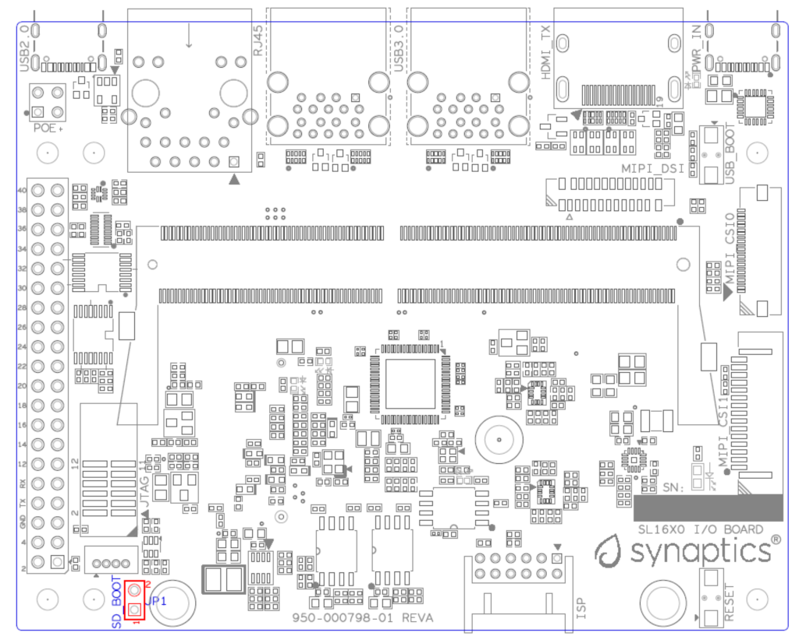
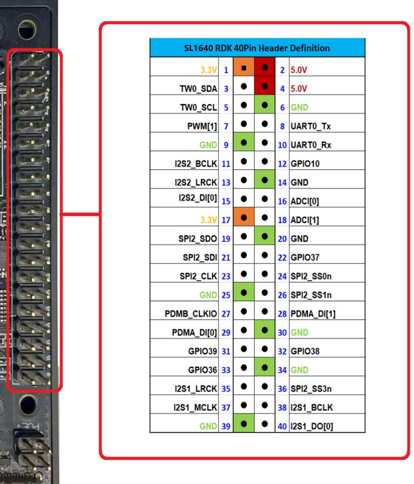

SL1640 User Guide
*****************

Introduction
============

The Astra Machina Foundation Series of evaluation-ready kits
enable easy and rapid prototyping for the Synaptics SL-Series of
multi-modal embedded processors. A modular design incorporates swappable
core compute modules, a common I/O board, and daughter cards for
connectivity, debug, and flexible I/O options.

The Synaptics Astra SL-Series is a family of highly integrated AI-native
Linux and Android SoCs optimized for multi-modal
consumer, enterprise, and industrial IoT workloads with hardware
accelerators for edge inferencing, security, graphics, vision, and
audio. The SL1640 is a cost and power optimized secure embedded SoC with
high-performance compute engines including a quad-core Arm® Cortex®-A55,
1.6+ TOPS NPU, Imagination GE9920 GPU with 90 GFLOPS 16-bit operations,
Ultra HD video encode and decode pipelines, and audio DSP. The SL1640
SoC brings a combination of performance and feature integration to
device manufacturers, enabling multi-modal applications that can meet
price points across various IoT market segments.

Scope
-----

This user guide describes the hardware configuration and functional
details for the Astra Machina SL1640 core module, I/O card, and
supported daughter cards, in addition to the bring-up sequence for the
evaluation kit.

Definition of Board Components
------------------------------

-  **Astra Machina:** Combined system with core module, I/O board, and
   supported daughter cards.

-  **Core module:** Processor subsystem module with key components
   including SL1640, eMMC, and LPDDR4x.

-  **I/O board:** Common base board that includes various standard
   hardware interfaces, buttons, headers, and power-in.

-  **Daughter card:** Add-on boards for supporting various features such
   as connectivity, debug, and other flexible I/O options.

Astra Machina System Overview
-----------------------------

This section covers system features, block diagrams and top views of the
Astra Machina evaluation kit.

   SL1640 core module (Dimensions: WxH = 69.6 x 47.38mm)

.. figure:: ./media/sl1640/image6.png
   :width: 4.63291in
   :height: 3.56477in

   I/O board

Features
~~~~~~~~

The SL1640-based evaluation system includes the following components:

-  Main components on the core module:

-  Synaptics SL1640 Quad-Core Arm Cortex-A55
      Embedded IoT Processor, up to 2.0 GHz

-  Storage: eMMC 5.1 (16 GB)

-  DRAM: DRAM: Up to x32 2GB system memory by 1pcs x32 16 Gbit
      LPDDR4x-3733

-  PMIC: two support DVFS in Vcore and Vcpu supply rails

-  SD Card Receptacle

-  Main components on the I/O board:

-  HDMI Type-A Tx interface: V2.1 with HDCP 2.2 sources up to 4K60p
   video and advanced audio

-  M.2 E-key 2230 Receptacle: It supports SDIO, PCIe, UART for Wi-Fi/BT
   modules

-  USB 3.0 Type-A: 4 ports to supports host mode at SuperSpeed.

-  USB 2.0 Type-C: supports OTG host or peripheral mode at Hi-Speed.

-  Push buttons: used for USB-BOOT selection and system RESET.

-  2pin Header: used for SD-BOOT selection.

-  Daughter card interface options:

-  MIPI DSI on 22-pin FPC interface to support 4-lane DSI plus I2C and
   GPIOs for up to 4K30p/2K60p display panel.

-  ISP 12-pin daughter card to support offline program SPI NOR flash on
   Core-Module.

-  JTAG daughter card for debug.

-  40-pin header for additional functions.

-  4-pin PoE+ connector, with a PoE hat board (purchased separately), it offers an 
   add-on voltage regulator module for PoE+ Type2 (802.3at) power device.  Available 
   power shall be 25.5W (Class 4) at 5Vpins of 40-pin header to I/O board.

-  4-pin connector for active Fan with PWM.

-  Type-C power supply with 15V\@1.8A.

SL1640 system block diagram
~~~~~~~~~~~~~~~~~~~~~~~~~~~

.. figure:: ./media/sl1640/image7.jpg
   :width: 6.5in
   :height: 4.57292in

   SL1640 system block diagram

Top view of SL1640 Astra Machina Evaluation System
~~~~~~~~~~~~~~~~~~~~~~~~~~~~~~~~~~~~~~~~~~~~~~~~~~

.. figure:: ./media/sl1640/image8.png
   :width: 5in
   :height: 4.31303in

   Top view of SL1640 evaluation system

System connectors
~~~~~~~~~~~~~~~~~

.. figure:: ./media/sl1640/image9.png
   :width: 5in
   :height: 3.02379in

   Front view

.. figure:: ./media/sl1640/image10.png
   :width: 5in
   :height: 2.97645in

   Rear view

Astra Machina Board Control/Status & System I/O
===============================================

This section covers boot-up, LEDs status indicators, buttons,
connectors, and pin-strap settings.

Booting up
----------

The Astra Machina supports booting from three interfaces. Users can
select a boot interface before powering up, as follows:

-  **eMMC boot:** Default boot interface.

-  **SD boot:** Short SD_Boot header by 2.54mm jumper-cap before
   power-up, see SD_Boot header in :ref:`sl1640_headers`. Ensure SD-Card with
   firmware is plugged into SD-slot on core module in :ref:`sl1640_core_bottom`.

-  **USB boot:** Connect USB-C usb2.0 port to the host PC, then follow
   the procedure in :ref:`hardware_manual_button_settings`.

LEDs
----

LED locations
~~~~~~~~~~~~~

:ref:`sl1640_leds` shows the LED locations on the I/O board.

.. _sl1640_leds:

   LED locations on I/O board

LED definitions
~~~~~~~~~~~~~~~

.. _sl1640_leds_table:

.. table:: LED definitions on I/O board

    === ===== =======================================================================
    LED Color LEDs Function
    === ===== =======================================================================
    D10 Green LED indicator for USB3.0 Hub is working in normal mode or suspend mode.
    D17 Green LED indicator1 for M.2 device general purpose.
    D18 Green LED indicator2 for M.2 device general purpose.
    D37 Green LED indicator for USB-C PD power source status.
    D40 RED   LED indicator for Stand-by status.
    === ===== =======================================================================

SM (System Manager) Pinstrap and Bootup Settings
------------------------------------------------

.. table:: SM pinstrap and bootup settings on core module

    ============ =========== ============= ================= ==============================================================================================================================================================
    Pad Name     Strap Name  Setting Value Resistor Stuffing Description

                             Default\*     + stuffed         Rpu = OnChip Pull-up

                                           - removed         Rpd = OnChip Pull-down
    ============ =========== ============= ================= ==============================================================================================================================================================
    SM_URT0_TXD  SM_STRP[0]  —             —                 SM to SoC RSTn mode select (Rpd)
    \                        0\*           - R134            0: socRstN releasing waits for SoCRstCnt but does not wait for SM_PWR_OK (mode_0 of SM_URT0_TXD, system will assert this signal when SoC core power is ready).
    \                        1             +R134             1: socRstN releasing waits for both SoCRstCnt and SM_PWR_OK.
    SM_SPI2_SDO  SM_STRP[1]  —             —                 Straps for software usage (Rpd)
    \                        0\*           -R136             —
    \                        1             +R136             —
    SM_SPI2_SS0n SM_STRP[2]  —             —                 (Rpd) Used with SM_STRP[3], SM_STRP[3:2] straps for software detection of LPDDR4 type and configuration.

                                                             00: MT53E512M32D2NP-053 RS WT
    \                        0\*           -R138             —
    \                        1             +R138             —
    SM_SPI2_SS1n SM_STRP[3]  —             —                 (Rpd) See SM_STRP[2].
    \                        0\*           -R140             —
    \                        1             +R140             —
    SM_TEST_EN   SM_TEST_EN  —             —                 SM TEST Enable (Rpd)
    \                        0\*           -R130             0: Enable ARM ICE JTAG connections (CoreSight)
    \                        1             +R130             1: Enable SCAN or BSCAN tests
    SM_JTAG_SEL  SM_JTAG_SEL —             —                 SM JTAG Port Selection (Rpd)
    \                        0\*           -R132             0: ARM ICE JTAG connections
    \                        1             +R132             1: Reserved for factory use
    SM_POR_EN    SM_POR_EN   —             —                 Power-on reset (POR) bypass (Rpu)
    \                        0             +R3               0: Bypass on-chip POR generator
    \                        1\*           -R3               1: Enable on-chip POR generator
    ============ =========== ============= ================= ==============================================================================================================================================================

SoC PinStrap and Bootup Settings
--------------------------------

.. table:: SoC pinstrap and bootup settings on core module

    ========== ============== ============= ================= ============================================================================================
    Pad Name   Strap Name     Setting Value Resistor Stuffing Description

                              Default\*     + stuffed         Rpu = OnChip Pull-up

                                            - removed         Rpd = OnChip Pull-down
    ========== ============== ============= ================= ============================================================================================
    GPIO_A[2]  cpuRstByps     —             —                 CPU reset bypass strap (Rpd)
    \                         0\*           -R124             0: Enable reset logic inside CPU partition
    \                         1             +R124             1: Bypass reset logic inside CPU partition
    GPIO_A[1]  pllPwrDown     —             —                 SYS/MEM/CPU PLL Power Down

                                                              Note: pllPwrDown should be set to 1 only when pllByps is also set to 1. (Rpd)
    \                         0\*           -R126             0: Power up
    \                         1             +R126             1: Power down
    GPIO_A[0]  pllByps        —             —                 SYS/MEM/CPU PLL bypass indicator
    \                         0\*           -R128             0: No bypass
    \                         1             +R128             1: All PLL bypassed
    SPI1_SDO   software_strap —             —                 ROM code uses this SS[0] to determine if booting from USB or not (Rpu)
               [0](USB_BOOTn)
    \                         0             —                 0: Boot from USB when USB_Boot button is pressed while power-up or system reset de-assertion
    \                         1\*           —                 1: Boot from the device select by boot_src
    SPDIFO     boot_src[1]    —             —                 CPU Boot Source bit [1] (Rpu)

                                                              See boot_src [1:0]
    \                         0             —                 ROM boot from SPI.
    \                         1\*           —                 ROM boot from eMMC.
    I2S1_DO[0] Legacy_boot    —             —                 Strap to reduce reset wait time
    \                         0             -R122             0: 2 ms
    \                         1             +R122             1: 20 ms
    ========== ============== ============= ================= ============================================================================================

.. table:: Bootup settings on I/O board

    =========================== ========== ============= ================= =================================================================================
    Net Name                    Strap Name Setting Value Resistor Stuffing Description

                                           Default\*     + stuffed         Rpu = OnChip Pull-up

                                                         - removed         Rpd = OnChip Pull-down
    =========================== ========== ============= ================= =================================================================================
    USB_BOOTn                   USB-Boot   —             —                 ROM code uses this strap to determine if booting from USB or not (Rpu)
    \                                      0             —                 0: Boot from USB when USB-BOOT button is pressed while system reset de-assertion.
    \                                      1\*           —                 1: Boot from the device select by boot_src[1]
    CONN-SPI.VDDIO1P8.BOOT_SRC1 SD-Boot    —             —                 ROM code uses this strap to determine if booting from SD_Card or not (Rpu)
    \                                      0             —                 0: Boot from SD_Card when SD_Boot header is on while system reset de-assertion.
    \                                      1\*           —                 1: Boot from the device select by boot_src[1] when SD_Boot Header is off.
    =========================== ========== ============= ================= =================================================================================

.. _hardware_manual_button_settings:

Hardware Manual Button Settings
-------------------------------

.. table:: Hardware manual button settings definitions on I/O board

    ============= ==================== ======= ================================================================================================
    Switch Block  Type                 Setting Function
    ============= ==================== ======= ================================================================================================
    SW6 (RESET)   Momentary Pushbutton Push    SL1640 Reset Key asserted
    \                                  Release Key de-asserted
    SW7(USB_BOOT) Momentary Pushbutton Push    USB boot Key asserted. Needs combo RESET button. Read below steps on how to enter USB-Boot mode.
    \                                  Release Key de-asserted
    ============= ==================== ======= ================================================================================================

To enter USB-Boot mode, follow these steps:

.. note::
    Prior to these steps, make sure the USB driver is installed successfully on PC host side.
    For details, please reference :doc:`/linux/index`.

1. Push RESET button to assert system reset to SL1640.

2. Keep pushing RESET button and push USB_BOOT button at the same time
   for 1-2 seconds.

3. Release RESET button while holding USB_BOOT button, so SL1640 enters
   USB-Boot mode.

4. Check and wait for the console print… messages.

   Once the console print is returned and entered USB boot successfully,
   release USB_BOOT button.

.. figure:: ./media/sl1640/image12.png
   :width: 6.0386in
   :height: 5.31538in

   Locations of manual buttons on I/O board

Hardware Jumper Settings
------------------------

.. table:: Hardware jumper settings definitions on I/O board

    ======= ================= ========== =======================================================================
    Ref Des Type              Pin        Description

                              Connection
    ======= ================= ========== =======================================================================
    JP1     2x1 2.54mm header 1-2        SD_Boot selection
    \                                    -  Open: Boot from the device select by boot_src[1]
    \                                    -  Short: Boot from SD_Card while power-up or system reset de-assertion
    ======= ================= ========== =======================================================================

To enter SD-Boot mode, follow these steps:

.. note::

    Prior to these steps, make sure SD-Card with firmware is plugged into
    SD-slot on core module.

1. Short SD_Boot header by 2.54mm jumper-cap before power-up.

2. Power-up system, then boot-up from SD_Card.

:ref:`sl1640_headers` shows the Header locations on the I/O board.

.. _sl1640_headers:

   Locations of jumper on I/O board

SL1640 Evaluation System Connectors
-----------------------------------

Locations of core module connectors on bottom side
~~~~~~~~~~~~~~~~~~~~~~~~~~~~~~~~~~~~~~~~~~~~~~~~~~

.. _sl1640_core_bottom:

.. figure:: ./media/sl1640/image14.png
   :width: 6.3508in
   :height: 4.34028in

   Locations on core module bottom side

Core module connector definitions
~~~~~~~~~~~~~~~~~~~~~~~~~~~~~~~~~

.. table:: Core module connector definitions

    ======= ========================= ========= ==========================================
    Main    Connecting Boards/Devices Functions Remarks
            (Ref Des if any)
    Ref Des
    ======= ========================= ========= ==========================================
    J16     MicroSD Card              SDIO card For micro-SD type of memory card extension
    ======= ========================= ========= ==========================================

Locations of I/O board connectors on top side
~~~~~~~~~~~~~~~~~~~~~~~~~~~~~~~~~~~~~~~~~~~~~

.. figure:: ./media/sl1640/image15.png
   :width: 6.5in
   :height: 5.15694in

   Locations on I/O board top side

Locations of I/O board connectors on bottom side
~~~~~~~~~~~~~~~~~~~~~~~~~~~~~~~~~~~~~~~~~~~~~~~~

.. figure:: ./media/sl1640/image14.png
   :width: 6.5in
   :height: 5.15694in

   Locations on I/O board bottom side

I/O board connector definitions
~~~~~~~~~~~~~~~~~~~~~~~~~~~~~~~

.. table:: I/O board connector definitions

    ======= ========================= =========================================== ==============================================================================
    Main    Connecting Boards/Devices Functions                                   Remarks
            (Ref Des if any)
    Ref Des
    ======= ========================= =========================================== ==============================================================================
    J1      ISP D/C                   SPI                                         12-pin daughter card to support offline program SPI NOR flash on Core-Module
    J2      RJ45 cable                Giga Ethernet                               For Wired Ethernet connection
    J12     HDMI Sink                 HDMI TX                                     For off-board HDMI Sink device connection
    J13     FAN                       Heat Dissipation w/ FAN                     Active FAN with PWM
    J17     M.2 2230 D/C              SDIO and PCIe                               1x1/2x2 Wi-Fi/Bluetooth card via SDIO or PCIe
    J22     Debug Board               JTAG                                        XDB debugger for debugging
    J32     40-pins Header            Uart,I2C,SPI,PDM,I2SI/O, GPIOs,STS1,PWM,ADC Flexible for support various D/C
    J34     PoE+ D/C                  PoE+                                        4-pin PoE+ daughter card with supporting an add-on 5V voltage to 40pin Header.
    J206    MIPI-CSI0 adaptor         MIPI-CSI                                    Not Applicable for SL1640
    J207    MIPI-CSI1 adaptor         MIPI-CSI                                    Not Applicable for SL1640
    J208    MIPI-DSI adaptor          MIPI-DSI                                    For MIPI-DSI x4 lane extension, like panel
    J210    USB Device                USB 3.0 x2                                  For USB3.0 extension in Device mode only
    J213    TypeC power source        Power Supply                                Power for Astra Machina rated at 15V/1.8A
    J215    USB Device                USB2.0 OTG                                  For USB2.0 extension, in either Host or Device mode
    J216    USB Device                USB 3.0 x2                                  For USB3.0 extension in Device mode only
    ======= ========================= =========================================== ==============================================================================

Daughter Cards
==============

A set of daughter cards supplements the Astra Machina system with a range
of extensible and configurable functionalities including Wi-Fi and
Bluetooth connectivity, debug options and general purpose I/O. Details
of currently supported daughter cards are described in this section.

Debug Board
-----------

Debug board (Rev5) allows users to communicate with the SL1640 system
over JTAG through a Debugger on a PC host. While connecting the Astra
Machina and debug board with a 20-pin flat cable, align pin-1 of the
2x10 cable socket at the debug board side with pin-1 of 2x6 header J22
on the evaluation system.

.. note::

  Users may communicate with SL1640 over UART on a PC host by using a
  UART to USB cable commonly available. See the Astra Machina webpage
  for a list of qualified parts. As an option, the debug board also
  provides such bridging function based on the Silicon Labs CP2102. A
  virtual COM port driver is required, and can be downloaded from the
  `vendor website <https://www.silabs.com/products/development-tools/software/usb-to-uart-bridge-vcp-drivers>`_
  and installed on the host PC.

UART on the evaluation system and the PC host USB are digitally
isolated, with no direct conductive path, eliminating ground loop and
back-drive issues when either is powered down.

:ref:`sl1640_debug` shows debug board connectivity facilitating UART and JTAG
communications.

.. _sl1640_debug:

.. figure:: ./media/sl1640/image17.png
   :width: 6.48644in
   :height: 2.31262in

   Debug board connectivity for UART and JTAG

M.2 Card
--------

An M.2 E-Key socket J17 is provided for a variety of modules in the M.2
form factor. Typical applicable modules support Wi-Fi/BT devices with
SDIO or PCIE signal interfaces.

Available modules:

-  Ampak AP12275_M2P with SYN43752 2x2 Wi-Fi6/BT5.3 2x2 over PCIE on M.2
   adaptor

-  Ampak AP12276_M2P with SYN43756 2x2 Wi-Fi6E/BT5.3 2x2 over PCIE on
   M.2 adaptor

260-Pins SODIMM definition
--------------------------

A 260-Pins SODIMM connector (PN: TE_2309413-1) joins the core module and
the I/O board. :ref:`sl1640_so_dimm` shows the assignment for the 260-Pins.

.. _sl1640_so_dimm:

.. table:: 260-pins SODIMM definition

    ============================== ==== =============== ==== ================================
    Assignment                     Pin# 260-Pins SODIMM Pin# Assignment
    ============================== ==== =============== ==== ================================
    VDDM_LPQ_control (From IO_Exp) 2                    1    GPO34
    SPI1_SDO (USB_BOOTn)           4                    3    GPO33
    SPI1_SCLK                      6                    5    N.A
    VDDM_control (From IO_Exp)     8                    7    N.A
    N.A                            10                   9    N.A
    SPI1_SDI                       12                   11   N.A
    SPI1_SS0n                      14                   13   N.A
    External_Boot_SRC0             16                   15   N.A
    N.A                            18                   17   N.A
    N.A                            20                   19   N.A
    N.A                            22                   21   N.A
    N.A                            24                   23   N.A
    GND                            26                   25   N.A
    N.A                            28                   27   N.A
    N.A                            30                   29   N.A
    GND                            32                   31   N.A
    N.A                            34                   33   N.A
    N.A                            36                   35   N.A
    GND                            38                   37   N.A
    N.A                            40                   39   N.A
    N.A                            42                   41   N.A
    GND                            44                   43   N.A
    USB2_Dn                        46                   45   N.A
    USB2_Dp                        48                   47   N.A
    GND                            50                   49   N.A
    USB3_RXp                       52                   51   N.A
    USB3_RXn                       54                   53   GND
    GND                            56                   55   N.A
    USB3_TXp                       58                   57   N.A
    USB3_TXn                       60                   59   GND
    GND                            62                   61   N.A
    USB3_USB20.Dp                  64                   63   N.A
    USB3_USB20.Dn                  66                   65   GND
    GND                            68                   67   N.A
    USB2_IDPIN                     70                   69   N.A
    PWR_OTG_VBUS                   72                   71   GND
    PWR_USB3_VBUS                  74                   73   N.A
    I2S3_BCLK                      76                   75   N.A
    I2S3_DI                        78                   77   GND
    I2S3_DO                        80                   79   N.A
    2S3_LRCK                       82                   81   N.A
    I2S2_DI[0]                     84                   83   GND
    PDMA_DI0                       86                   85   N.A
    PDMA_DI1                       88                   87   N.A
    PDM_CLKO                       90                   89   GND
    I2S2_BCLK                      92                   91   N.A
    I2S2_LRCK                      94                   93   N.A
    GPIO10                         96                   95   GND
    FAN_TACH_Control               98                   97   PCIe_RX0p
    SPDIFO                         100                  99   PCIe_RX0n
    FAN_PWM                        102                  101  GND
    I2S1_BCLK                      104                  103  PCIe_TX0n
    EXPANDER_INT-REQn              106                  105  PCIe_TX0p
    BOOT_SRC1                      108                  107  GND
    I2S1_DO0                       110                  109  PCIe_CLKp
    I2S1_MCLK                      112                  111  PCIe_CLKn
    I2S1_LRCK                      114                  113  GND
    ADCI[0]                        116                  115  MIPI_DSI_TD0n
    ADCI[1]                        118                  117  MIPI_DSI_TD0p
    URT0_TXD                       120                  119  GND
    URT0_RXD                       122                  121  MIPI_DSI_TD1n
    SPI2_SDI                       124                  123  MIPI_DSI_TD1p
    SPI2_SCLK                      126                  125  GND
    SPI2_SDO                       128                  127  MIPI_DSI_TCKp
    SPI2_SS3n                      130                  129  MIPI_DSI_TCKn
    USB2_OCn                       132                  131  GND
    SPI2_SS1n                      134                  133  MIPI_DSI_TD3n
    SPI2_SS0n                      136                  135  MIPI_DSI_TD3p
    SM_TW3_SDA                     138                  137  GND
    SM_TW3_SCL                     140                  139  MIPI_DSI_TD2p
    SM_URT1_TXD                    142                  141  MIPI_DSI_TD2n
    SM_URT1_RXD                    144                  143  GND
    N.A                            146                  145  GND
    N.A                            148                  147  HDMI_TX_TCKn
    N.A                            150                  149  HDMI_TX_TCKp
    HDMITX_HPD                     152                  151  GND
    USB-C_Logic_INTn               154                  153  HDMI_TX_TD0n
    HDMI_TX_EDDC_SDA               156                  155  HDMI_TX_TD0p
    HDMI_TX_EDDC_SCL               158                  157  GND
    Levershift_EN# for 40P header  160                  159  HDMI_TX_TD1n
    SM_HDMI_CEC                    162                  161  HDMI_TX_TD1p
    RSTIn\@PU                      164                  163  GND
    JTAG_TDO                       166                  165  HDMI_TX_TD2n
    JTAG_TDI.SoC_WakeUp#           168                  167  HDMI_TX_TD2p
    JTAG_TMS                       170                  169  GND
    N.A                            172                  171  N.A
    N.A                            174                  173  N.A
    GPIO39                         176                  175  GND
    TW2_SDA                        178                  177  HDMI_TX_PWR_EN
    TW2_SCL                        180                  179  JTAG_TCK
    TW0_SDA                        182                  181  GPIO38
    TW0_SCL                        184                  183  JTAG_TRSTn
    URT2B_CTSn for M.2             186                  185  GPIO36
    URT2B_RTSn for M.2             188                  187  URT2B_RXD for M.2
    PWM1                           190                  189  GPIO37
    GND                            192                  191  URT2B_TXD for M.2
    PWR_1V8                        194                  193  GPO47
    PWR_1V8                        196                  195  GPO46
    PWR_1V8_CTL                    198                  197  GPIO45
    PWR_1V8_CTL                    200                  199  GPIO44
    PWR_3V3_CTL                    202                  201  TW1B_SCL
    PWR_3V3_CTL                    204                  203  TW1B_SDA
    GND                            206                  205  USB_BOOTn
    M.2_WIFI_SDIO_CLK              208                  207  Vcore/Vcpu control (From IO_Exp)
    GND                            210                  209  ETHERNET_LINK_LED
    M.2_WIFI_SDIO_CMD              212                  211  ETHERNET_DUPLX_LED
    GND                            214                  213  GND
    M.2_WIFI_SDIO_D0               216                  215  FE_TXp
    GND                            218                  217  FE_TXn
    M.2_WIFI_SDIO_D1               220                  219  GND
    GND                            222                  221  FE_RXp
    M.2_WIFI_SDIO_D2               224                  223  FE_RXn
    GND                            226                  225  GND
    M.2_WIFI_SDIO_D3               228                  227  N.A
    GND                            230                  229  N.A
    PWR_3V3                        232                  231  GND
    PWR_3V3                        234                  233  N.A
    PWR_3V3                        236                  235  N.A
    PWR_3V3                        238                  237  GND
    PWR_3V3                        240                  239  N.A
    PWR_3V3                        242                  241  N.A
    GND                            244                  243  GND
    GND                            246                  245  GND
    GND                            248                  247  GND
    GND                            250                  249  GND
    PWR_5V                         252                  251  PWR_5V
    PWR_5V                         254                  253  PWR_5V
    PWR_5V                         256                  255  PWR_5V
    PWR_5V                         258                  257  PWR_5V
    PWR_5V                         260                  259  PWR_5V
    ============================== ==== =============== ==== ================================

40-Pins Header
--------------

A 40-pins GPIO header with 0.1-inch (2.54mm) pin pitch is on the top
edge of the I/O board. Any of the general-purpose 3.3V pins can be
configured in software with a variety of alternative functions. For
additional information, please refer to the *SL1640 Datasheet*.

.. note::

  Pin16/Pin18 are ADCI[0]/[1], the full-scale voltage is 1.2V @ max.

   40-pins header definition

Pin-demuxing for Standard Interface Configuration
-------------------------------------------------

This section covers pin-demuxing configuration for the SL1640 evaluation
system.

For System Manager (SM), see :ref:`sl1640_sm_demux`.

For System on Chip (SoC), see :ref:`sl1640_soc_demux`.

.. _sl1640_sm_demux:

.. table:: SM pin-demuxing usage

    ================================= ============== =============== ============ ======
    SL1640 System Manager (SM) Domain
    ================================= ============== =============== ============ ======
    Pad/Pin Name                      Default Usage  Direction       Mode Setting
    SM_TWSI                           SM_TW2_SCL     IO:SM_TW2_SCL   OUT          MODE_0
    \                                 SM_TW2_SDA     IO:SM_TW2_SDA   IN/OUT       MODE_0
    \                                 SM_TW3_SCL     IO:SM_TW3_SCL   OUT          MODE_1
    \                                 SM_TW3_SDA     IO:SM_TW3_SDA   IN/OUT       MODE_1
    SM_JTAG                           SM_TMS         O:SM_FE_LED[2]  OUT          MODE_3
    \                                 SM_TDI         IO:SM_GPIO[7]   IN           MODE_1
    \                                 SM_TDO         O:SM_FE_LED[0]] OUT          MODE_3
    SM_UART0/1                        SM_URT0_TXD    O:SM_URT0_TXD   OUT          MODE_0
    \                                 SM_URT0_RXD    I:SM_URT0_RXD   IN           MODE_0
    \                                 SM_URT1_TXD    O:SM_URT1_TXD   OUT          MODE_1
    \                                 SM_URT1_RXD    I:SM_URT1_RXD   IN           MODE_1
    SM_SPI2                           SM_SPI2_SS0n   O:SM_SPI2_SS0n  OUT          MODE_0
    \                                 SM_SPI2_SS1n   O:SM_SPI2_SS1n  OUT          MODE_1
    \                                 SM_SPI2_SS2n   IO:SM_GPIO[15]  IN           MODE_2
    \                                 SM_SPI2_SS3n   O:SM_SPI2_SS3n  OUT          MODE_1
    \                                 SM_SPI2_SDO    O:SM_SPI2_SDO   OUT          MODE_0
    \                                 SM_SPI2_SDI    I:SM_SPI2_SDI   IN           MODE_0
    \                                 SM_SPI2_SCLK   O:SM_SPI2_SCLK  OUT          MODE_0
    SM_HDMI_TX                        SM_HDMI_TX_HPD IO:SM_GPIO[3]   OUT          MODE_0
    \                                 SM_HDMI_CEC    IO:SM_HDMI_CEC  IN/OUT       MODE_1
    ================================= ============== =============== ============ ======

.. _sl1640_soc_demux:

.. table:: SoC pin-demuxing usage

    ================================== ================ ======================== ============ ======
    SL1640 System-on-chip (SoC) Domain
    ================================== ================ ======================== ============ ======
    Pad/Pin Name                       Default Usage    Direction                Mode Setting
    SDIO                               SDIO_CDn         I:SDIO0_CDn              IN           MODE_0
    \                                  SDIO_WP          IO:GPIO[48]              OUT          MODE_1
    SPI1                               SPI1_SS3n        IO:TW1B_SDA              IN/OUT       MODE_3
    \                                  SPI1_SS2n        IO:TW1B_SCL              OUT          MODE_3
    \                                  SPI1_SS1n        O:PWM[1]                 OUT          MODE_4
    \                                  SPI1_SS0n        O:SPI1_SS0n              OUT          MODE_0
    \                                  SPI1_SDO         O:SPI1_SDO               OUT          MODE_0
    \                                  SPI1_SCLK        O:SPI1_SCLK              OUT          MODE_0
    \                                  SPI1_SDI         I:SPI1_SDI               IN           MODE_0
    TW0                                TW0_SCL          IO:TW0_SCL               OUT          MODE_1
    \                                  TW0_SDA          IO:TW0_SDA               IN/OUT       MODE_1
    STS0/1                             STS0_CLK         I:URT2B_RXD              IN           MODE_4
    \                                  STS0_SOP         O:URT2B_TXD              OUT          MODE_4
    \                                  STS0_SD          I:URT2B_CTSn             IN           MODE_4
    \                                  STS0_VALD        O:URT2B_RTSn             OUT          MODE_4
    \                                  STS1_CLK         IO:GPIO[39]              IN/OUT       MODE_0
    \                                  STS1_SOP         IO:GPIO[38]              IN/OUT       MODE_0
    \                                  STS1_SD          IO:GPIO[37]              IN/OUT       MODE_0
    \                                  STS1_VALD        IO:GPIO[36]              IN/OUT       MODE_0
    USB2                               USB2_DRV_VBUS    IO:GPIO[59]              IN           MODE_1
    SCRD                               SCRD0_CRD_PRES   I:SCRD0_CRD_PRES         IN           MODE_0
    \                                  SCRD0_RST        O:SCRD0_RST              OUT          MODE_0
    \                                  SCRD0_DCLK       O:SCRD0_DCLK             OUT          MODE_0
    \                                  SCRD0_DIO        IO:SCRD0_DIO             IN/OUT       MODE_0
    I2S1                               I2S1_MCLK        IO:I2S1_MCLK             OUT          MODE_1
    \                                  I2S1_LRCK        IO:I2S1_LRCKIO           IN/OUT       MODE_1
    \                                  I2S1_BCLK        IO:I2S1_BCLKIO           IN/OUT       MODE_1
    \                                  I2S1_DO[0]       O:I2S1_DO[0]             OUT          MODE_1
    \                                  I2S1_DO[1]       IO:GPIO[17]              OUT          MODE_0
    \                                  I2S1_DO[2]       O:PWM[2]                 OUT          MODE_2
    \                                  I2S1_DO[3]       IO:GPIO[15]              IN           MODE_0
    I2S2                               I2S2_MCLK        IO:PDMB_CLKIO            OUT          MODE_2
    \                                  I2S2_LRCK        IO:I2S2_LRCKIO           IN/OUT       MODE_1
    \                                  I2S2_BCLK        IO:I2S2_BCLKIO           IN/OUT       MODE_1
    \                                  I2S2_DI[0]       I:I2S2_DI[0]             IN           MODE_1
    \                                  I2S2_DI[1]       IO:GPIO[10]              IN/OUT       MODE_0
    \                                  I2S2_DI[2]       I:PDMA_DI[1]             IN           MODE_2
    \                                  I2S2_DI[3]       I:PDMA_DI[0]             IN           MODE_2
    I2S3                               I2S3_LRCK        IO:I2S3_LRCKIO           IN/OUT       MODE_1
    \                                  I2S3_BCLK        IO:I2S3_BCLKIO           IN/OUT       MODE_1
    \                                  I2S3_DI          I:I2S3_DI                IN           MODE_1
    \                                  I2S3_DO          O:I2S3_DO                OUT          MODE_1
    SPDIF                              SPDIFO           O:SPDIFO                 OUT          MODE_1
    \                                  SPDIFI           IO:GPIO[4]               IN           MODE_0
    HDMI_TX_EDDC                       HDMI_TX_EDDC_SCL IO:TX_EDDC_SCL           OUT          MODE_0
    \                                  HDMI_TX_EDDC_SDA IO:TX_EDDC_SDA           IN/OUT       MODE_0
    GPIO_A[2:0]                        GPIO_A[2]        IO:GPIO[33](output only) OUT          MODE_0
    \                                  GPIO_A[1]        IO:GPIO[34](output only) OUT          MODE_0
    \                                  GPIO_A[0]        IO:GPIO[35](output only) OUT          MODE_0
    ================================== ================ ======================== ============ ======

Pin-demuxing for GPIO/GPO Configuration
---------------------------------------

This section covers pin-demuxed GPIO/GPO usage of the SM (:ref:`sl1640_sm_gpio`) and
SoC (:ref:`sl1640_soc_gpio`) domains.

.. _sl1640_sm_gpio:

.. table:: SM GPIO/GPO usage

    =========== ============= ========= ===================================== =====================================
    SL1640 SM   Availability  Direction Default Function                      GPIO Signaling
    =========== ============= ========= ===================================== =====================================
    GPIO/GPO
    SM_GPIO[0]  Not Available OUT       IO:SM_TW2_SCL                         For VCORE DVFS
    SM_GPIO[1]  Not Available IN/OUT    IO:SM_TW2_SDA                         For VCORE DVFS
    SM_GPIO[2]  Not Available IN/OUT    IO:SM_HDMI_TX_CEC                     —
    SM_GPIO[3]  MODE_0        IN        Level shifter enable for 40pin Header 0: Enable
    \                                                                         1: Disable
    SM_GPIO[4]  Not Available IN        I:SM_URT1_RXD                         —
    SM_GPIO[5]  Not Available IN        O:SM_URT1_TXD                         —
    SM_GPIO[6]  Not Available OUT       O:SM_FE_LED[0]                        —
    SM_GPIO[7]  MODE_1        IN        M2-UART_WAKE#                         0: Triggered Wake-Up from M.2 module.
    \                                                                         1: Idle
    SM_GPIO[8]  Not Available OUT       O:SM_FE_LED[2]                        —
    SM_GPIO[9]  Not Available OUT       IO:SM_TW3_SCL                         —
    SM_GPIO[10] Not Available IN/OUT    IO:SM_TW3_SDA                         —
    SM_GPIO[11] MODE 0        OUT       O:SM_SPI2_SCLK                        To 40Pin Header
    SM_GPIO[12] MODE 0        IN        I:SM_SPI2_SDI                         To 40Pin Header
    SM_GPO[13]  MODE 0        OUT       O:SM_SPI2_SDO                         To 40Pin Header
    SM_GPIO[14] MODE 1        OUT       O:SM_SPI2_SS3n                        To 40Pin Header
    SM_GPO[15]  MODE 2        IN        USB2_Ocn                              0: Over-current from USB2.0 port
    \                                                                         1: Idle
    SM_GPO[16]  MODE 1        OUT       O:SM_SPI2_SS1n                        To 40Pin Header
    SM_GPO[17]  MODE 0        OUT       O:SM_SPI2_SS0n                        To 40Pin Header
    SM_GPIO[18] MODE 0        IN        I:SM_URT0_RXD                         To 40Pin Header
    SM_GPO[19]  MODE 0        OUT       O:SM_URT0_TXD                         To 40Pin Header
    =========== ============= ========= ===================================== =====================================

.. _sl1640_soc_gpio:

.. table:: SoC GPIO/GPO usage

    ============ ============= ========= ======================== =========================================
    SL1640 SoC   Availability  Direction Default Function         GPIO Signaling
    ============ ============= ========= ======================== =========================================
    GPIO/GPO
    SOC_GPIO[0]  Not Available IN        I:I2S3_DI                M.2 I2S_DI
    SOC_GPIO[1]  Not Available OUT       O:I2S3_DO                M.2 I2S_DO
    SOC_GPIO[2]  Not Available IN/OUT    IO:I2S3_BCLKIO           M.2 I2S_BCLK
    SOC_GPIO[3]  Not Available IN/OUT    IO:I2S3_LRCKIO           M.2 I2S_LRCLK
    SOC_GPIO[4]  MODE_1        IN        FAN_TACH_CON             0: Error
    \                                                             1: Normal
    SOC_GPIO[5]  Not Available IN/OUT    IO:TX_EDDC_SDA           —
    SOC_GPIO[6]  Not Available OUT       IO:TX_EDDC_SCL           —
    SOC_GPO[7]   MODE_2        OUT       IO:PDMB_CLKIO            To 40Pin Header
    SOC_GPIO[8]  MODE_2        IN        I:PDMA_DI[0]             To 40Pin Header
    SOC_GPIO[9]  MODE_2        IN        I:PDMA_DI[1]             To 40Pin Header
    SOC_GPIO[10] MODE_0        IN/OUT    IO:GPIO[10]              To 40Pin Header
    SOC_GPIO[11] MODE_1        IN        I:I2S2_DI[0]             To 40Pin Header
    SOC_GPIO[12] MODE_1        IN/OUT    IO:I2S2_BCLKIO           To 40Pin Header
    SOC_GPIO[13] MODE_1        IN/OUT    IO:I2S2_LRCKIO           To 40Pin Header
    SOC_GPO[14]  Not Available OUT       O:SPDIFO                 In reserved
    SOC_GPIO[15] MODE_0        IN        USB-C-Logic \_INTn       0: USB2.0 host mode
    \                                                             1: USB2.0 device mode
    SOC_GPIO[16] MODE_2        OUT       O:PWM[2]                 PWM for FAN
    SOC_GPIO[17] MODE_0        OUT       MicroSD_VOL-SEL          0: 1V8
    \                                                             1: 3V3 (Default)
    SOC_GPIO[18] MODE_1        OUT       IO:I2S1_MCLK             To 40Pin Header
    SOC_GPO[19]  MODE_1        OUT       O:I2S1_DO[0]             To 40Pin Header
    SOC_GPIO[20] MODE_1        IN/OUT    IO:I2S1_BCLKIO           To 40Pin Header
    SOC_GPIO[21] MODE_1        IN/OUT    IO:I2S1_LRCKIO           To 40Pin Header
    SOC_GPO[22]  Not Available —         —                        —
    SOC_GPO[23]  Not Available —         —                        —
    SOC_GPO[24]  Not Available —         —                        —
    SOC_GPO[25]  Not Available —         —                        —
    SOC_GPO[26]  Not Available —         —                        —
    SOC_GPO[27]  Not Available —         —                        —
    SOC_GPIO[28] Not Available —         —                        —
    SOC_GPIO[29] Not Available —         —                        —
    SOC_GPIO[30] Not Available —         —                        —
    SOC_GPIO[31] Not Available —         —                        —
    SOC_GPIO[32] Not Available —         —                        —
    SOC_GPO[33]  Not Available OUT       IO:GPIO[33](output only) In reserved
    SOC_GPO[34]  Not Available OUT       IO:GPIO[34](output only) In reserved
    SOC_GPO[35]  MODE_0        OUT       HDMI-TX_PWR_ON           0: Power Down HDMI-TX 5V
    \                                                             1: Power Up
    SOC_GPIO[36] MODE_0        IN/OUT    IO:GPIO[36]              To 40Pin Header
    SOC_GPIO[37] MODE_0        IN/OUT    IO:GPIO[37]              To 40Pin Header
    SOC_GPIO[38] MODE_0        IN/OUT    IO:GPIO[38]              To 40Pin Header
    SOC_GPIO[39] MODE_0        IN/OUT    IO:GPIO[39]              To 40Pin Header
    SOC_GPIO[40] Not Available OUT       O:URT2B_RTSn             For M.2 URT2B_RTSn
    SOC_GPIO[41] Not Available IN        I:URT2B_CTSn             For M.2 URT2B_CTSn
    SOC_GPIO[42] Not Available OUT       O:URT2B_TXD              For M.2 URT2B_TXD
    SOC_GPIO[43] Not Available IN        I:URT2B_RXD              For M.2 URT2B_RXD
    SOC_GPIO[44] Not Available IN        I:SCRD0_CRD_PRES         In reserved
    SOC_GPIO[45] Not Available IN/OUT    IO:SCRD0_DIO             In reserved
    SOC_GPO[46]  Not Available OUT       O:SCRD0_DCLK             In reserved
    SOC_GPO[47]  Not Available OUT       O:SCRD0_RST              In reserved
    SOC_GPIO[48] MODE_1        OUT       MicroSD_PWR_ON           0: Power Down
    \                                                             1: Power Up
    SOC_GPIO[49] Not Available IN        I:SDIO0_CDn              —
    SOC_GPO[50]  MODE_0        IN/OUT    IO:TW0_SDA               To 40Pin Header
    SOC_GPIO[51] MODE_0        OUT       IO:TW0_SCL               To 40Pin Header
    SOC_GPIO[52] Not Available IN        I:SPI1_SDI               —
    SOC_GPIO[53] Not Available OUT       O:SPI1_SCLK              —
    SOC_GPO[54]  Not Available OUT       O:SPI1_SDO               —
    SOC_GPIO[55] MODE_3        IN        IO:TW1B_SDA              For VCPU DVFS
    SOC_GPIO[56] MODE_3        IN        IO:TW1B_SCL              For VCPU DVFS
    SOC_GPIO[57] MODE_4        OUT       O:PWM[1]                 To 40Pin Header
    SOC_GPO[58]  Not Available OUT       O:SPI1_SS0n              —
    SOC_GPIO[59] MODE_1        IN        EXT-GPIO_INTR#           0: Triggered interrupt from GPIO Expander
    \                                                             1: Idle
    ============ ============= ========= ======================== =========================================

GPIO Expanders Over I2C
-----------------------

Due to the considerable number of functionalities covered by the SL1640
evaluation system, most of the SL1640 digital pins that have GPIO/GPO
pin-demux options are used for other functions. As such, GPIO expanders
are used extensively to supplement system control purposes.

.. table:: GPIO expanders usage

    ======== ============== ====== ======= ========= =============== =====================================================
    Expander I2C#           Domain Voltage Direction Function        GPIO Signaling

    GPIO/GPO
    ======== ============== ====== ======= ========= =============== =====================================================
    GPIO0_0  SM_TW3 (0x43)  SM     3.3V    OUT       VCPU/VCORE_ON#  0: Power ON VCPU/VCORE PMIC
    \                                                                1: Power OFF
    GPIO0_1  SM_TW3 (0x43)  SM     3.3V    OUT       PWR_ON_DSI      0: Power OFF
    \                                                                1: Power ON
    GPIO0_2  SM_TW3 (0x43)  SM     3.3V    OUT       VDDM_ON#        0: Power ON all VDDM PMICs (1V8/1V1/0V6)
    \                                                                1: Power OFF
    GPIO0_3  SM_TW3 (0x43)  SM     3.3V    OUT       VDDM-LPQ_OFF#   0: Power ON VDDM-LP PMICs (0V6)
    \                                                                1: Power OFF
    GPIO0_4  SM_TW3 (0x43)  SM     3.3V    OUT       STAND-BY_EN     0: Normal status
    \                                                                1: Entry to Stand-By status with devices Powered down
    GPIO0_5  SM_TW3 (0x43)  SM     3.3V    IN        USB2.0_PWR_EN   0: Power OFF
    \                                                                1: Power ON
    GPIO0_6  SM_TW3 (0x43)  SM     3.3V    IN        M2-PCIe_CLKREQ# 0: Triggered for M.2 PCIe Clock Request
    \                                                                1: Idle
    GPIO0_7  SM_TW3 (0x43)  SM     3.3V    IN/OUT    GPIO_DSI        In reserved
    \                                                                In reserved
    GPIO1_0  SM_TW3 (0x44)) SM     3.3V    OUT       Not used         --
    \                                                                 --
    GPIO1_1  SM_TW3 (0x44)  SM     3.3V    OUT       M2-PCIe_RST#    0: Assertion Reset for M.2 PCIe Module
    \                                                                1: De-assertion
    GPIO1_2  SM_TW3 (0x44)  SM     3.3V    OUT       M2-W_DISABLE1#  0: Assertion Disable to M.2 module by DISABLE1#
    \                                                                1: De-assertion
    GPIO1_3  SM_TW3 (0x44)  SM     3.3V    OUT       M2-W_HOST-WAKE# 0: Assertion Wake from Host to M.2 module
    \                                                                1: De-assertion
    GPIO1_4  SM_TW3 (0x44)  SM     3.3V    OUT       Not used         --
    \                                                                 --
    GPIO1_5  SM_TW3 (0x44)  SM     3.3V    OUT       M2-W_DISABLE2#  0: Assertion Disable to M.2 module by DISABLE2#
    \                                                                1: De-assertion
    GPIO1_6  SM_TW3 (0x44)  SM     3.3V    OUT       Not used         --
    \                                                                 --
    GPIO1_7  SM_TW3 (0x44)  SM     3.3V    OUT       Not used         --
    \                                                                 --
    ======== ============== ====== ======= ========= =============== =====================================================

I2C Bus
-------

This section describes the Astra Machina’s usage of the I\ :sup:`2`\ C
bus, the equivalence of SL1640’s Two Wire Serial Interface (TWSI) bus.

.. table:: I2C bus descriptions

    ======================= =========================================================================================== ================== ======= ============== ==================
    I\ :sup:`2`\ C/TWSI Bus Device                                                                                      Part Number        Ref Des Target Address Location

                                                                                                                                                   (7-bit)
    ======================= =========================================================================================== ================== ======= ============== ==================
    SOC_TW0                 External device connects to MIPI_DSI connector                                              Not applicable     J208    0xXX           SL16x0 I/O board
    \                       External device connects to 40pin Header                                                    Not applicable     J32     0xXX           SL16x0 I/O board
    SOC_TW1B                IC REG, default 0.8V Vout /5mV Step, 6A rating, Input 6V\@Max, Step-Down Convertor with I2C TPS62870Y1QWRXSRQ1 U2      0x40           SL1640 core module
    SM_TW2                  IC REG, default 0.8V Vout /5mV Step, 6A rating, Input 6V\@Max, Step-Down Convertor with I2C TPS62870Y1QWRXSRQ1 U3      0x40           SL1640 core module
    SM_TW3                  IC GPIO EXPANDER I2C 8Bit                                                                   FXL6408UMX         U12     0x43           SL16x0 I/O board
    \                       IC GPIO EXPANDER I2C 8Bit                                                                   FXL6408UMX         U12     0x43           SL16x0 I/O board
    ======================= =========================================================================================== ================== ======= ============== ==================

Bringing Up the SL1640 Astra Machina System 
============================================

Connecting External Components and Performing Hardware Testing
--------------------------------------------------------------

Perform the following steps to connect the external components to the
SL1640 evaluation system:

1. Connect a TypeC power supply to J213 (PWR_IN).

2. Connect TV to J12 (HDMI_Tx) with a HDMI cable.

6. Connect Network to J2 (RJ45) with an Ethernet cable.

7. Insert USB3.0 flash disk to J216 /J210 (USB3.0).

8. Insert USB2.0 flash disk to J215 (USB2.0) over TypeC/TypeA dongle.

If there are no short issues, power up the system and check voltages as
shown in :ref:`sl1640_short` with the LED status shown in :ref:`sl1640_leds_table`.

.. figure:: ./media/sl1640/image17.png

   Short and voltage check points

.. _sl1640_short:

.. table:: Short and voltage check points using any test point for ground

    ======= ========= ============= ==============
    Ref Des Form      Signal        Voltage
    ======= ========= ============= ==============
    C1274   Upper pad PWR_5V        5.2V +/- 2%

                                    [5.096,5.304]
    TP188   SMD pad   PWR_3V3       3.3V +/- 1%

                                    [3.267,3.333]
    TP187   SMD pad   PWR_1V8       1.8V +/- 2%

                                    [1.764,1.836]
    TP184   SMD pad   PWR_VDDM_1V8  1.8V +/- 2%

                                    [1.764,1.836]
    TP186   SMD pad   PWR_VDDM_1V1  1.1V +/- 2%

                                    [1.078,1.122]
    TP183   SMD pad   PWR_VDDM_0V6  0.6V +/- 2%

                                    [0.588,0.612]
    TP181   SMD pad   PWR_SoC_VCORE 0.8V +/- 2%

                                    [0.784,0.816]
    TP182   SMD pad   PWR_SoC_VCPU  0.8V +/- 2%

                                    [0.784,0.816]
    TP185   SMD pad   PWR_VDD_SM    0.8V +/- 2%

                                    [0.784,0.816]]
    ======= ========= ============= ==============

References
==========

The following documents are applicable to the SL1640 evaluation system:

-  *SL1640 Datasheet* (PN: 505-001415-01)
