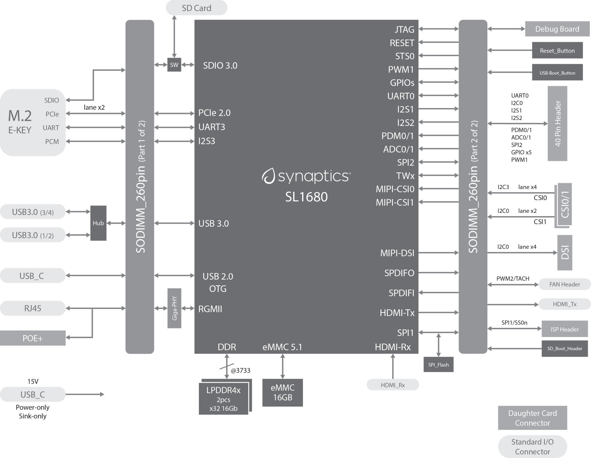
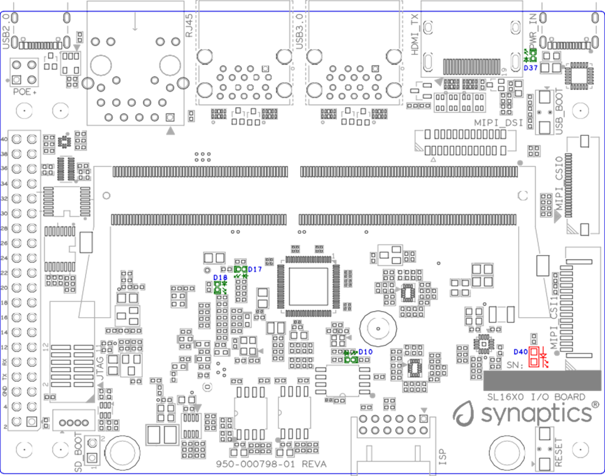
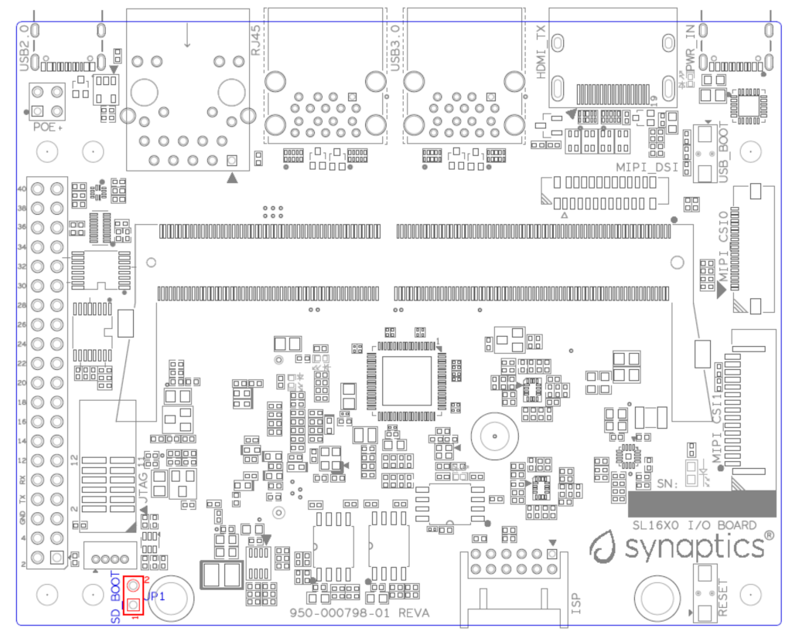
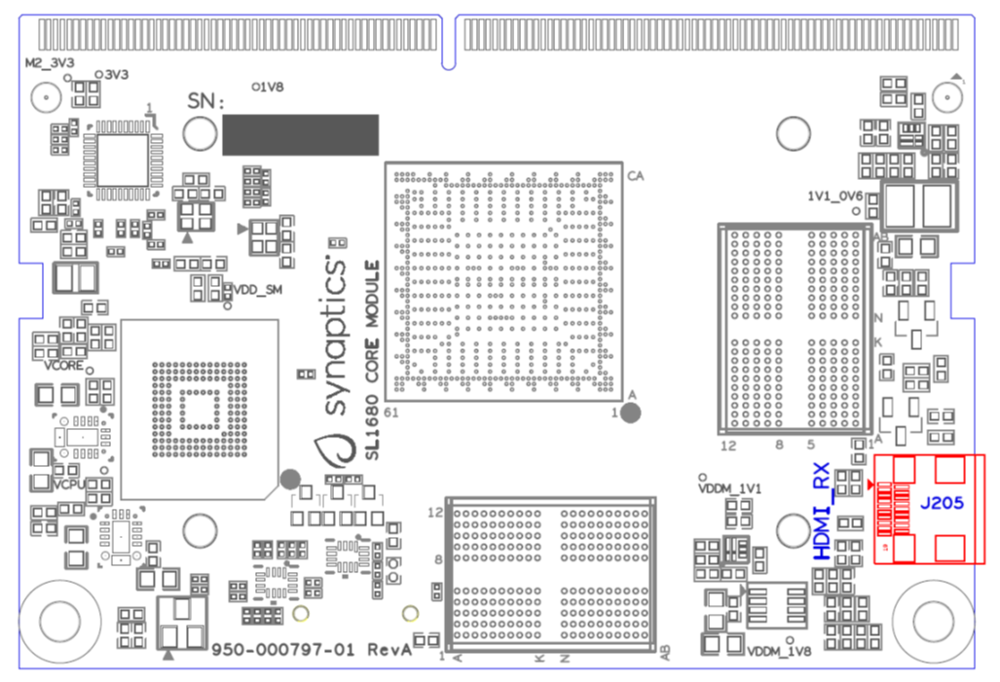
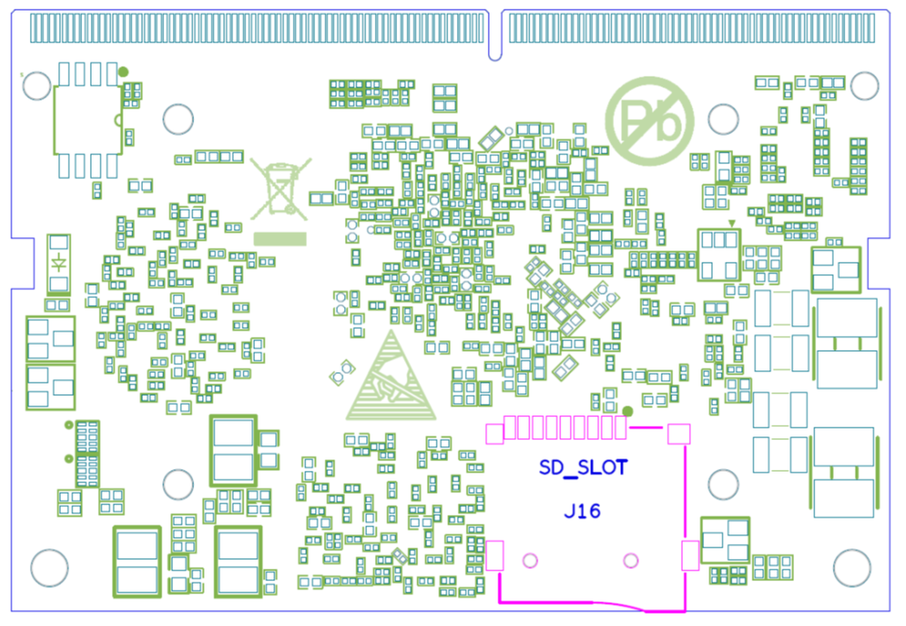
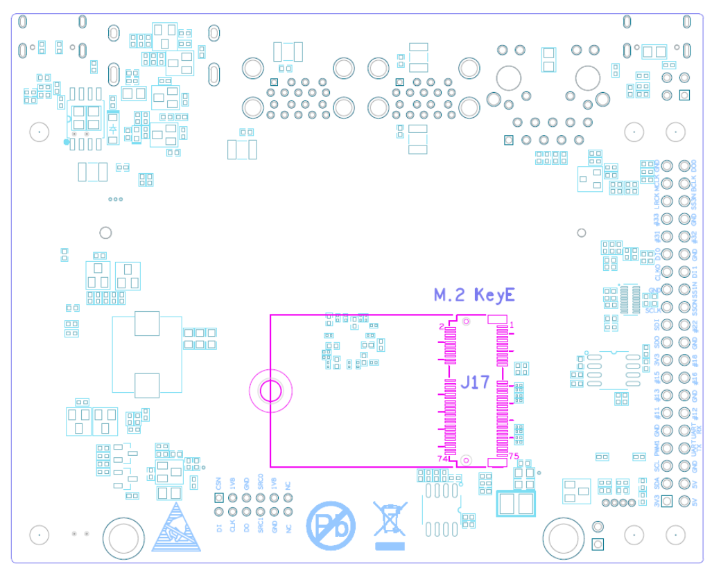
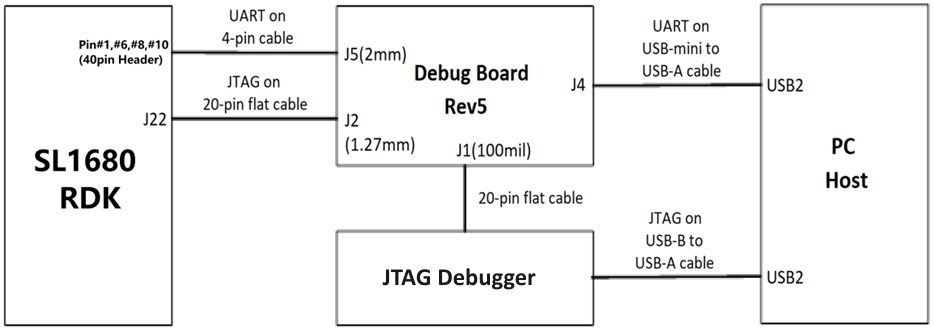
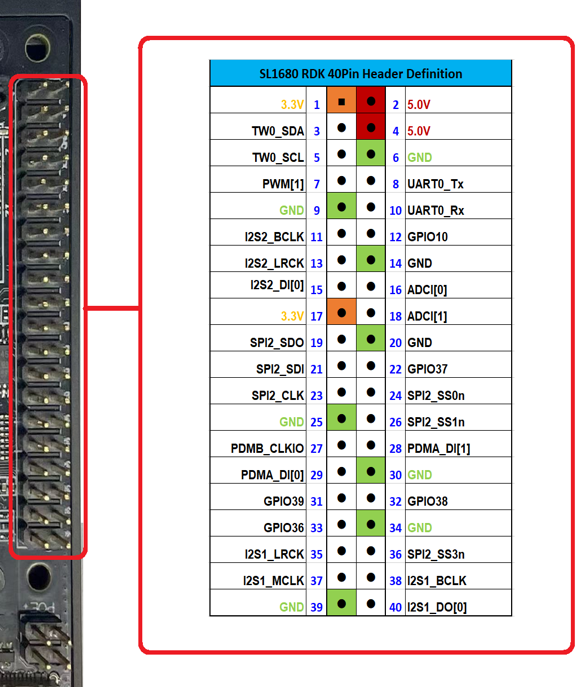
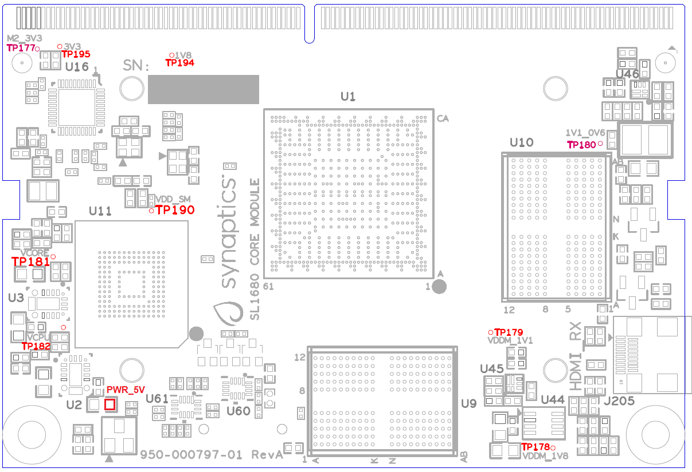

SL1680 User Guide
*****************

Introduction
============

The Astra Machina Foundation Series of evaluation-ready kits
enable easy and rapid prototyping for the Synaptics SL-Series of
multi-modal embedded processors. A modular design incorporates swappable
core compute modules, a common I/O board, and daughter cards for
connectivity, debug, and flexible I/O options.

The Synaptics Astra SL-Series is a family of highly integrated AI-native
Linux and Android SoCs optimized for multi-modal
consumer, enterprise, and industrial IoT workloads with hardware
accelerators for edge inferencing, security, graphics, vision, and
audio. The SL1680 incorporates high-performance compute engines,
including a quad-core Arm® Cortex®-A73 64-bit CPU subsystem, a
multi-TOPS NPU, a high-efficiency, feature-rich GPU for advanced
graphics and AI acceleration, and multimedia accelerators for image
signal processing (ISP), 4K video encode/decode, and audio. The SL1680
SoC brings a combination of performance and feature integration to
device manufacturers, enabling multi-modal applications that can meet
price points across various IoT market segments.

Scope
-----

This user guide describes the hardware configuration and functional
details for the Astra Machina SL1680 core module, I/O card, and
supported daughter cards, in addition to the bring-up sequence for the
evaluation kit.

Definition of Board Components
------------------------------

-  **Astra Machina**: Combined system with core module, I/O board, and
   supported daughter cards

-  **Core module**: Processor subsystem module with key components
   including SL1680, eMMC, and LPDDR4x.

-  **I/O board**: Common base board that includes various standard
   hardware interfaces, buttons, headers, and power-in.

-  **Daughter card**: Add-on boards for supporting various features such
   as connectivity, debug, and other flexible I/O options.

Astra Machina System Overview
-----------------------------

This section covers system features, block diagrams and top views of the
Astra Machina evaluation kit.

   SL1680 core module (Dimensions: WxH = 69.6 x 47.38mm)

.. figure:: ./media/sl1680/image6.png
   :width: 4.27729in
   :height: 3.29114in

   I/O board

Features
~~~~~~~~

The SL1680-based evaluation system includes the following components:

-  Main components on the core module:

-  Synaptics SL1680 Quad-Core Arm Cortex-A73
   embedded IoT processor, up to 2.1 GHz

-  Storage: eMMC 5.1 (16 GB)

-  DRAM: up to x64 4 GB system memory by 2pcs x32 16 Gbit LPDDR4x

-  PMIC: two support DVFS in Vcore and Vcpu supply rails

-  HDMI Micro Rx interface: V2.1 with HDCP 2.2 sinks up to 4K60p video
   and advanced audio

-  SD Card Receptacle

-  Main components on the I/O board:

-  HDMI Type-A Tx interface: V2.1 with HDCP 2.2 sources up to 4K60p
   video and advanced audio

-  M.2 E-key 2230 Receptacle: It supports SDIO, PCIe, UART for Wi-Fi/BT
   modules

-  USB 3.0 Type-A: 4 ports to supports host mode at SuperSpeed.

-  USB 2.0 Type-C: supports OTG host or peripheral mode at Hi-Speed.

-  Push buttons: used for USB-BOOT selection and system RESET.

-  2pin Header: used for SD-BOOT selection.

-  Daughter card interface options:

-  MIPI DSI on 22-pin FPC interface to support 4-lane DSI plus I2C and
   GPIOs for up to 4K30p/2K60p display panel.

-  MIPI CSI-2 on two FPC interfaces. 22-pin at CSI0 for 4-lane, 15pin at
   CSI1 for 2-lane. Each plus I2C and GPIOs, for up to 4K60p (one
   camera) or 4K30p (two cameras)

-  JTAG daughter card for debug.

-  40-pin header for additional functions

-  4-pin PoE+ connector, with a PoE hat board (purchased separately), it offers an 
   add-on voltage regulator module for PoE+ Type2 (802.3at) power device.  Available 
   power shall be 25.5W (Class 4) at 5Vpins of 40-pin header to I/O board.

-  4-pin connector for active Fan with PWM.

-  Type-C power supply with 15V @ 1.8A.

SL1680 system block diagram
~~~~~~~~~~~~~~~~~~~~~~~~~~~

   SL1680 system block diagram

Top view of SL1680 Astra Machina Evaluation System
~~~~~~~~~~~~~~~~~~~~~~~~~~~~~~~~~~~~~~~~~~~~~~~~~~

.. figure:: ./media/sl1680/image8.png
   :width: 5in
   :height: 3.46688in

   Top view of SL1680 evaluation system

System connectors 
~~~~~~~~~~~~~~~~~~

.. figure:: ./media/sl1680/image9.png
   :width: 5in
   :height: 2.53052in

   Front view

.. figure:: ./media/sl1680/image10.png
   :width: 5in
   :height: 2.59591in

   Rear view

Astra Machina Board Control/Status & System I/O
===============================================

This section covers boot-up, LEDs status indicators, buttons,
connectors, and pin-strap settings.

Booting Up
----------

The Astra Machina supports booting from three interfaces. Users can
select a boot interface before powering up, as follows: -

-  **eMMC boot:** Default boot interface

-  **SD boot:** Short SD_Boot header by 2.54mm jumper-cap before
   power-up, see SD_Boot header in :ref:`sl1680_jumper_location`. Ensure SD-Card with
   firmware is plugged into SD-slot on core module in :ref:`sl1680_core_bottom_side`.

-  **USB boot:** Connect USB-C usb2.0 port to the host PC, then follow
   the procedure in the :ref:`hardware_manual_button_settings` section.

LEDs
----

LED locations
~~~~~~~~~~~~~

:ref:`sl1680_led_location` shows the LED locations on the I/O board.

.. _sl1680_led_location:

   LED locations on I/O board

LED definitions
~~~~~~~~~~~~~~~

.. table:: LED definitions on I/O board

    === ===== =======================================================================
    LED Color LEDs Function
    === ===== =======================================================================
    D10 Green LED indicator for USB3.0 Hub is working in normal mode or suspend mode.
    D17 Green LED indicator1 for M.2 device general purpose.
    D18 Green LED indicator2 for M.2 device general purpose.
    D37 Green LED indicator for USB-C PD power source status.
    D40 RED   LED indicator for Stand-By Status.
    === ===== =======================================================================

SM PinStrap and Boot-up Settings
--------------------------------

.. table:: SM pinstrap and boot-up settings on core module

    ============ =========== ============= ================= ==============================================================================================================================================================
    Pad Name     Strap Name  Setting Value Resistor Stuffing Description

                             Default\*     + stuffed         Rpu = OnChip Pull-up

                                           - removed         Rpd = OnChip Pull-down
    ============ =========== ============= ================= ==============================================================================================================================================================
    SM_URT0_TXD  SM_STRP[0]  —             —                 SM to SoC RSTn mode select (Rpd)
    \                        0\*           -R188             0: socRstN releasing waits for SoCRstCnt but does not wait for SM_PWR_OK (mode_0 of SM_URT0_TXD, system will assert this signal when SoC core power is ready).
    \                        1             +R188             1: socRstN releasing waits for both SoCRstCnt and SM_PWR_OK.
    SM_SPI2_SDO  SM_STRP[1]  —             —                 Straps for software usage (Rpd)
    \                        0\*           -R190             —
    \                        1             +R190             —
    SM_SPI2_SS0n SM_STRP[2]  —             —                 Straps for software usage (Rpd)
    \                        0\*           -R192             —
    \                        1             +R192             —
    SM_SPI2_SS1n SM_STRP[3]  —             —                 Straps for software usage (Rpd)
    \                        0\*           -R194             —
    \                        1             +R194             —
    SM_TEST_EN   SM_TEST_EN  —             —                 SM TEST Enable (Rpd)
    \                        0\*           -R184             0: Enable ARM ICE JTAG connections (CoreSight)
    \                        1             +R184             1: Enable SCAN or BSCAN tests
    SM_JTAG_SEL  SM_JTAG_SEL —             —                 SM JTAG Port Selection (Rpd)
    \                        0\*           -R186             0: ARM ICE JTAG connections
    \                        1             +R186             1: Reserved for factory use
    SM_POR_EN    SM_POR_EN   —             —                 Power-on reset (POR) bypass (Rpu)
    \                        0             +R3               0: Bypass on-chip POR generator
    \                        1\*           -R3               1: Enable on-chip POR generator
    ============ =========== ============= ================= ==============================================================================================================================================================

SoC PinStrap and Boot-up Settings
---------------------------------

.. table:: SoC pinstrap and boot-up settings on core module

    ============ ================= ============= ================= =============================================================================
    Pad Name     Strap Name        Setting Value Resistor Stuffing Description

                                   Default\*     + stuffed         Rpu = OnChip Pull-up

                                                 - removed         Rpd = OnChip Pull-down
    ============ ================= ============= ================= =============================================================================
    RGMII_TXD[2] cpuRstByps        —             —                 CPU reset bypass strap (Rpd)
    \                              0\*           -R178             0: Enable reset logic inside CPU partition
    \                              1             +R178             1: Bypass reset logic inside CPU partition
    RGMII_TXD[3] pllPwrDown        —             —                 SYS/MEM/CPU PLL Power Down;

                                                                   Note: pllPwrDown should be set to 1 only when pllByps is also set to 1. (Rpd)
    \                              0\*           -R180             0: Power up
    \                              1             +R180             1: Power down
    RGMII_TXCTL  pllByps           —             —                 SYS/MEM/CPU PLL bypass indicator
    \                              0\*           -R182             0: No bypass
    \                              1             +R182             1: All PLL bypassed
    SPI1_SS0n    software_strap[1] —             —                 Straps for software usage (Rpd)
    \                              0\*           -R174             —
    \                              1             +R174             —
    RGMII_TXD[0] software_strap[2] —             —                 Straps for software usage (Rpd)
    \                              0\*           -R172             —
    \                              1             +R172             —
    RGMII_TXD[1] software_strap[3] —             —                 Straps for software usage (Rpd)
    \                              0\*           -R170             —
    \                              1             +R170             —
    SPDIFO       boot_src[1]       —             —                 CPU Boot Source bit [1] (Rpu)

                                                                   See boot_src [1:0]
    \                              0             —                 ROM boot from SPI.
    \                              1\*           —                 ROM boot from eMMC.
    RGMII_TXC    Legacy_boot       —             —                 Strap to reduce reset wait time (Rpd)
    \                              0\*           -R176             0: 2 ms
    \                              1             +R176             1: 20 ms
    ============ ================= ============= ================= =============================================================================

.. table:: Boot-up settings on I/O board

    =========================== ========== ============= ================= =================================================================================
    Net Name                    Strap Name Setting Value Resistor Stuffing Description

                                           Default\*     + stuffed         Rpu = OnChip Pull-up

                                                         - removed         Rpd = OnChip Pull-down
    =========================== ========== ============= ================= =================================================================================
    USB_BOOTn                   USB-Boot   —             —                 ROM code uses this strap to determine if booting from USB or not (Rpu)
    \                                      0             —                 0: Boot from USB when USB-BOOT button is pressed while system reset de-assertion.
    \                                      1\*           —                 1: Boot from the device select by boot_src[1]
    CONN-SPI.VDDIO1P8.BOOT_SRC1 SD-Boot    —             —                 ROM code uses this strap to determine if booting from SD_Card or not (Rpu)
    \                                      0             —                 0: Boot from SD_Card when SD_Boot header is on while system reset de-assertion.
    \                                      1\*           —                 1: Boot from the device select by boot_src[1] when SD_Boot Header is off.
    =========================== ========== ============= ================= =================================================================================

.. _hardware_manual_button_settings:

Hardware Manual Button Settings
-------------------------------

.. table:: Hardware manual button settings definitions on I/O board

    ============= ==================== ======= ================================================================================================
    Switch Block  Type                 Setting Function
    ============= ==================== ======= ================================================================================================
    SW6 (RESET)   Momentary Pushbutton Push    SL1680 Reset Key asserted
    \                                  Release Key de-asserted
    SW7(USB_BOOT) Momentary Pushbutton Push    USB boot Key asserted. Needs combo RESET button. Read below steps on how to enter USB-Boot mode.
    \                                  Release Key de-asserted
    ============= ==================== ======= ================================================================================================

To enter USB-Boot mode, follow these steps:

.. note::

    Prior to these steps, make sure the USB driver is installed successfully on the PC host side. For details, please
    reference :doc:`/linux/index`.

1. Push RESET button to assert system reset to SL1680.

2. Keep pushing RESET button and push USB_BOOT button at the same time
   for 1-2 seconds.

3. Release RESET button while holding USB_BOOT button, so SL1680 enters
   USB-Boot mode.

4. Check and wait for the console print… messages.

   Once the console print is returned and entered USB boot successfully,
   release USB_BOOT button.

.. figure:: ./media/sl1680/image12.png

   Locations of manual buttons on I/O board

Hardware Jumper Settings
------------------------

.. table:: Hardware jumper settings definitions on I/O board

    ======= ================= ========== =======================================================================
    Ref Des Type              Pin        Description

                              Connection
    ======= ================= ========== =======================================================================
    JP1     2x1 2.54mm header 1-2        SD_Boot selection
    \                                    -  Open: Boot from the device select by boot_src[1]
    \                                    -  Short: Boot from SD_Card while power-up or system reset de-assertion
    ======= ================= ========== =======================================================================

To enter SD-Boot mode, follow these steps:

.. note::

   Prior to these steps, make sure SD-Card with firmware is plugged into
   SD-slot on the core module.

1. Short SD_Boot header by 2.54mm jumper-cap before power-up.

2. Power-up system, then boot-up from SD_Card.

:ref:`sl1680_jumper_location` shows the Header locations on the I/O board.

.. _sl1680_jumper_location:

   Locations of jumper on I/O board

SL1680 Evaluation System Connectors
-----------------------------------

Locations of core module connectors on top side
~~~~~~~~~~~~~~~~~~~~~~~~~~~~~~~~~~~~~~~~~~~~~~~

   Locations on core module top side

Locations of core module connectors on bottom side
~~~~~~~~~~~~~~~~~~~~~~~~~~~~~~~~~~~~~~~~~~~~~~~~~~

.. _sl1680_core_bottom_side:

   Locations on core module bottom side

Core module connector definitions
~~~~~~~~~~~~~~~~~~~~~~~~~~~~~~~~~

.. table:: Core module connector definitions

    ======= ========================= ========= ===========================================
    Main    Connecting Boards/Devices Functions Remarks
            (Ref Des if any)
    Ref Des
    ======= ========================= ========= ===========================================
    J205    HDMI Sink                 HDMI_Rx   For off-board HDMI source host connection.
    J16     MicroSD Card              SDIO card For micro-SD type of memory card extension.
    ======= ========================= ========= ===========================================

Locations of I/O board connectors on top side
~~~~~~~~~~~~~~~~~~~~~~~~~~~~~~~~~~~~~~~~~~~~~

.. figure:: ./media/sl1680/image16.png

   Locations on I/O board top side

Locations of I/O board connectors on bottom side
~~~~~~~~~~~~~~~~~~~~~~~~~~~~~~~~~~~~~~~~~~~~~~~~

   Locations on I/O board bottom side

I/O board connector definitions
~~~~~~~~~~~~~~~~~~~~~~~~~~~~~~~

.. table:: I/O board connector definitions

    ======= ========================= =========================================== ==============================================================================
    Main    Connecting Boards/Devices Functions                                   Remarks
            (Ref Des if any)
    Ref Des
    ======= ========================= =========================================== ==============================================================================
    J1      ISP D/C                   SPI                                         12-pin daughter card to support offline program SPI NOR flash on core module
    J2      RJ45 cable                Giga Ethernet                               For Wired Ethernet connection
    J12     HDMI Sink                 HDMI TX                                     For off-board HDMI Sink device connection
    J13     FAN                       Heat Dissipation w/ FAN                     Active FAN with PWM
    J17     M.2 2230 D/C              SDIO and PCIe                               1x1/2x2 WiFi/Bluetooth card via SDIO or PCIe
    J22     Debug Board               JTAG                                        XDB debugger for debugging
    J32     40-pins Header            Uart,I2C,SPI,PDM,I2SI/O, GPIOs,STS1,PWM,ADC Flexible for support various D/C
    J34     PoE+ D/C                  PoE+                                        4-pin PoE+ daughter card with supporting an add-on 5V voltage to 40pin Header.
    J206    MIPI-CSI0 adaptor         MIPI-CSI                                    For MIPI-CSI x4 lane extension, like camera
    J207    MIPI-CSI1 adaptor         MIPI-CSI                                    For MIPI-CSI x2 lane extension, like camera
    J208    MIPI-DSI adaptor          MIPI-DSI                                    For MIPI-DSI x4 lane extension, like panel
    J210    USB Device                USB 3.0 x2                                  For USB3.0 extension in Device mode only
    J213    TypeC power source        Power Supply                                Power for Astra Machina rated at 15V/1.8A
    J215    USB Device                USB2.0 OTG                                  For USB2.0 extension, in either Host or Device mode
    J216    USB Device                USB 3.0 x2                                  For USB3.0 extension in Device mode only
    ======= ========================= =========================================== ==============================================================================

Daughter Cards
==============

A set of daughter cards supplements the Astra Machina system with a
range of extensible and configurable functionalities including Wi-Fi and
Bluetooth connectivity, debug options and general purpose I/O. Details
of currently supported daughter cards are described in this section.

Debug Board 
------------

Debug Board (Rev5) allows users to communicate with the SL1680 system
over JTAG through a Debugger on a PC host. While connecting the Astra
Machina and debug board with a 20-pin flat cable, align pin-1 of the
2x10 cable socket at the debug board side with pin-1 of 2x6 header J22
on the evaluation system.

Users may communicate with SL1680 over UART on a PC host by using a
UART to USB cable commonly available. See the Astra Machina webpage
for a list of qualified parts. As an option, the debug board also
provides such bridging function based on the Silicon Labs CP2102. A
virtual COM port driver is required, and can be downloaded from the
`vendor website <https://www.silabs.com/products/development-tools/software/usb-to-uart-bridge-vcp-drivers>`__
and installed on the host PC.

UART on the evaluation system and the PC host USB are digitally
isolated, with no direct conductive path, eliminating ground loop and
back-drive issues when either is powered down.

:ref:`sl1680_uart` shows debug board connectivity facilitating UART and JTAG
communications.

.. _sl1680_uart:

   Debug board connectivity for UART and JTAG

M.2 Card
--------

An M.2 E-Key socket J17 is provided for a variety of modules in the M.2
form factor. Typical applicable modules support Wi-Fi/BT devices with
SDIO or PCIE signal interfaces.

Available modules:

-  Ampak AP12275_M2P with SYN43752 2x2 WiFi6/BT5.3 2x2 over PCIE on M.2
   adaptor

-  Ampak AP12276_M2P with SYN43756 2x2 WiFi6E/BT5.3 2x2 over PCIE on M.2
   adaptor

260-Pins SODIMM Definition
--------------------------

A 260-Pins SODIMM connector (PN: TE_2309413-1) joins the core module and
the I/O board. Table 9 shows the assignment for the 260-Pins.

.. table:: 260-Pins SODIMM definition

    ============================== ==== =============== ==== ================================
    Assignment                     Pin# 260-Pins SODIMM Pin# Assignment
    ============================== ==== =============== ==== ================================
    VDDM_LPQ_control (From IO_Exp) 2                    1    N.A
    SPI1_SDO (USB_BOOTn)           4                    3    N.A
    SPI1_SCLK                      6                    5    N.A
    VDDM_control (From IO_Exp)     8                    7    N.A
    HDMI_RX.V3P3.CEC               10                   9    N.A
    SPI1_SDI                       12                   11   N.A
    SPI1_SS0n                      14                   13   N.A
    External_Boot_SRC0             16                   15   N.A
    N.A                            18                   17   N.A
    N.A                            20                   19   N.A
    N.A                            22                   21   N.A
    N.A                            24                   23   N.A
    GND                            26                   25   N.A
    MIPI_CSI1_RD0p                 28                   27   N.A
    MIPI_CSI1_RD0n                 30                   29   N.A
    GND                            32                   31   N.A
    MIPI_CSI1_RD1n                 34                   33   N.A
    MIPI_CSI1_RD1p                 36                   35   N.A
    GND                            38                   37   N.A
    MIPI_CSI1_RCKp                 40                   39   N.A
    MIPI_CSI1_RCKn                 42                   41   N.A
    GND                            44                   43   N.A
    USB2_Dn                        46                   45   N.A
    USB2_Dp                        48                   47   N.A
    GND                            50                   49   N.A
    USB3_RXp                       52                   51   N.A
    USB3_RXn                       54                   53   GND
    GND                            56                   55   MIPI_CSI0_RD2n
    USB3_TXp                       58                   57   MIPI_CSI0_RD2p
    USB3_TXn                       60                   59   GND
    GND                            62                   61   MIPI_CSI0_RD3n
    USB3_USB20.Dp                  64                   63   MIPI_CSI0_RD3p
    USB3_USB20.Dn                  66                   65   GND
    GND                            68                   67   MIPI_CSI0_RD1p
    USB2_IDPIN                     70                   69   MIPI_CSI0_RD1n
    PWR_OTG_VBUS                   72                   71   GND
    PWR_USB3_VBUS                  74                   73   MIPI_CSI0_RD0n
    I2S3_BCLK                      76                   75   MIPI_CSI0_RD0p
    I2S3_DI                        78                   77   GND
    I2S3_DO                        80                   79   MIPI_CSI0_RCKp
    2S3_LRCK                       82                   81   MIPI_CSI0_RCKn
    I2S2_DI[0]                     84                   83   GND
    PDM_DI0                        86                   85   PCIe_RX1p
    PDM_DI1                        88                   87   PCIe_RX1n
    PDM_CLKO                       90                   89   GND
    I2S2_BCLK                      92                   91   PCIe_TX1n
    I2S2_LRCK                      94                   93   PCIe_TX1p
    GPIO10                         96                   95   GND
    FAN_TACH_Control               98                   97   PCIe_RX0p
    SPDIFO                         100                  99   PCIe_RX0n
    FAN_PWM                        102                  101  GND
    I2S1_BCLK                      104                  103  PCIe_TX0n
    EXPANDER_INT-REQn              106                  105  PCIe_TX0p
    BOOT_SRC1                      108                  107  GND
    I2S1_DO0                       110                  109  PCIe_CLKp
    I2S1_MCLK                      112                  111  PCIe_CLKn
    I2S1_LRCK                      114                  113  GND
    ADCI[0]                        116                  115  MIPI_DSI_TD0n
    ADCI[1]                        118                  117  MIPI_DSI_TD0p
    URT0_TXD                       120                  119  GND
    URT0_RXD                       122                  121  MIPI_DSI_TD1n
    SPI2_SDI                       124                  123  MIPI_DSI_TD1p
    SPI2_SCLK                      126                  125  GND
    SPI2_SDO                       128                  127  MIPI_DSI_TCKp
    SPI2_SS3n                      130                  129  MIPI_DSI_TCKn
    USB2_OCn                       132                  131  GND
    SPI2_SS1n                      134                  133  MIPI_DSI_TD3n
    SPI2_SS0n                      136                  135  MIPI_DSI_TD3p
    SM_TW3_SDA                     138                  137  GND
    SM_TW3_SCL                     140                  139  MIPI_DSI_TD2p
    N.A                            142                  141  MIPI_DSI_TD2n
    N.A                            144                  143  GND
    N.A                            146                  145  GND
    N.A                            148                  147  HDMI_TX_TCKn
    N.A                            150                  149  HDMI_TX_TCKp
    HDMITX_HPD                     152                  151  GND
    USB-C_Logic_INTn               154                  153  HDMI_TX_TD0n
    HDMI_TX_EDDC_SDA               156                  155  HDMI_TX_TD0p
    HDMI_TX_EDDC_SCL               158                  157  GND
    Levershift_EN# for 40P header  160                  159  HDMI_TX_TD1n
    SM_HDMI_CEC                    162                  161  HDMI_TX_TD1p
    RSTIn\@PU                      164                  163  GND
    JTAG_TDO                       166                  165  HDMI_TX_TD2n
    JTAG_TDI.SoC_WakeUp#           168                  167  HDMI_TX_TD2p
    JTAG_TMS                       170                  169  GND
    N.A                            172                  171  HDMITX-eARC_RXn
    N.A                            174                  173  HDMITX-eARC_RXp
    GPIO39                         176                  175  GND
    TW2B_SDA                       178                  177  HDMI_TX_PWR_EN
    TW2B_SCL                       180                  179  JTAG_TCK
    TW0_SDA                        182                  181  GPIO38
    TW0_SCL                        184                  183  JTAG_TRSTn
    URT3_CTSn for M.2              186                  185  GPIO36
    URT3_RTSn for M.2              188                  187  URT3_RXD for M.2
    PWM1                           190                  189  GPIO37
    GND                            192                  191  URT3_TXD for M.2
    PWR_1V8                        194                  193  N.A
    PWR_1V8                        196                  195  N.A
    PWR_1V8_CTL                    198                  197  N.A
    PWR_1V8_CTL                    200                  199  N.A
    PWR_3V3_CTL                    202                  201  TW1B_SCL
    PWR_3V3_CTL                    204                  203  TW1B_SDA
    GND                            206                  205  USB_BOOTn
    M.2_WIFI_SDIO_CLK              208                  207  Vcore/Vcpu control (From IO_Exp)
    GND                            210                  209  GePHY_LED1&&STRP[CFG_LDO0]
    M.2_WIFI_SDIO_CMD              212                  211  GePHY_LED2&&STRP[CFG_LDO1]
    GND                            214                  213  GND
    M.2_WIFI_SDIO_D0               216                  215  RJ45_MDIP0
    GND                            218                  217  RJ45_MDIN0
    M.2_WIFI_SDIO_D1               220                  219  GND
    GND                            222                  221  RJ45_MDIP1
    M.2_WIFI_SDIO_D2               224                  223  RJ45_MDIN1
    GND                            226                  225  GND
    M.2_WIFI_SDIO_D3               228                  227  RJ45_MDIP2
    GND                            230                  229  RJ45_MDIN2
    PWR_3V3-M.2                    232                  231  GND
    PWR_3V3-M.2                    234                  233  RJ45_MDIP3
    PWR_3V3-M.2                    236                  235  RJ45_MDIN3
    PWR_3V3                        238                  237  GND
    PWR_3V3                        240                  239  N.A
    PWR_3V3                        242                  241  N.A
    GND                            244                  243  GND
    GND                            246                  245  GND
    GND                            248                  247  GND
    GND                            250                  249  GND
    PWR_5V                         252                  251  PWR_5V
    PWR_5V                         254                  253  PWR_5V
    PWR_5V                         256                  255  PWR_5V
    PWR_5V                         258                  257  PWR_5V
    PWR_5V                         260                  259  PWR_5V
    ============================== ==== =============== ==== ================================

40-Pin Header
-------------

A 40-pin GPIO header with 0.1-inch (2.54mm) pin pitch is on the top edge
of the I/O board. Any of the general-purpose 3.3V pins can be configured
in software with a variety of alternative functions. For more
information, please refer to the *SL1680 Datasheet*.

.. note::
    Pin16/Pin18 are ADCI[0]/[1], the full-scale voltage is 1.2V @ max.

   40-Pins header definition

Pin-demuxing for Standard Interface Configuration
-------------------------------------------------

This section covers pin-demuxing configuration for the SL1680 evaluation
system .

For System Manager (SM), see :ref:`sl1680_sm_pindemux`.

For System on Chip (SoC), see :ref:`sl1680_soc_pindemux`.

.. _sl1680_sm_pindemux:

.. table:: SM Pin-demuxing usage

    ================================= ================ ================= ============ ======
    SL1680 System Manager (SM) Domain
    ================================= ================ ================= ============ ======
    Pad/Pin Name                      Default Usage    Direction         Mode Setting
    **SM_TWSI**                       SM_TW2_SCL       IO:RX_EDID_SCL    OUT          MODE_0
    \                                 SM_TW2_SDA       IO:RX_EDID_SDA    IN/OUT       MODE_0
    \                                 SM_TW3_SCL       IO:SM_TW3_SCL     OUT          MODE_1
    \                                 SM_TW3_SDA       IO:SM_TW3_SDA     IN/OUT       MODE_1
    **SM_JTAG**                       SM_TMS           IO:SM_GPIO[6]     IN/OUT       MODE_1
    \                                 SM_TDI           IO:SM_GPIO[7]     IN           MODE_1
    \                                 SM_TDO           IO:SM_GPO[8]      OUT          MODE_1
    **SM_UART0/1**                    SM_URT0_TXD      O:SM_URT0_TXD     OUT          MODE_0
    \                                 SM_URT0_RXD      I:SM_URT0_RXD     IN           MODE_0
    \                                 SM_URT1_TXD      IO:SM_TW2B_SCL    OUT          MODE_6
    \                                 SM_URT1_RXD      IO:SM_TW2B_SDA    IN/OUT       MODE_6
    **SM_SPI2**                       SM_SPI2_SS0n     O:SM_SPI2_SS0n    OUT          MODE_0
    \                                 SM_SPI2_SS1n     O:SM_SPI2_SS1n    OUT          MODE_1
    \                                 SM_SPI2_SS2n     IO:SM_GPIO[15]    IN           MODE_2
    \                                 SM_SPI2_SS3n     O:SM_SPI2_SS3n    OUT          MODE_1
    \                                 SM_SPI2_SDO      O:SM_SPI2_SDO     OUT          MODE_0
    \                                 SM_SPI2_SDI      I:SM_SPI2_SDI     IN           MODE_0
    \                                 SM_SPI2_SCLK     O:SM_SPI2_SCLK    OUT          MODE_0
    **SM_HDMI**                       SM_HDMI_TX_HPD   IO:SM_GPIO[2]     OUT          MODE_0
    \                                 SM_HDMI_CEC      IO:SM_HDMI_CEC    IN/OUT       MODE_1
    \                                 SM_HDMI_RX_HPD   IO:SM_GPIO[20]    OUT          MODE_1
    \                                 SM_HDMI_RX_PWR5V I:SM_HDMIRX_PWR5V IN           MODE_0
    ================================= ================ ================= ============ ======

.. _sl1680_soc_pindemux:

.. table:: SoC Pin-demuxing usage

    ================================== ================ ============== ============ ======
    SL1680 System-on-chip (SoC) Domain
    ================================== ================ ============== ============ ======
    Pad/Pin Name                       Default Usage    Direction      Mode Setting
    **SDIO**                           SDIO_CDn         IO:SDIO_CDn    IN           MODE_0
    \                                  SDIO_WP          IO:GPIO[44]    OUT          MODE_1
    **SPI1**                           SPI1_SS3n        IO:TW1B_SDA    IN/OUT       MODE_3
    \                                  SPI1_SS2n        IO:TW1B_SCL    OUT          MODE_3
    \                                  SPI1_SS1n        O:PWM[1]       OUT          MODE_4
    \                                  SPI1_SS0n        O:SPI1_SS0n    OUT          MODE_0
    \                                  SPI1_SDO         O:SPI1_SDO     OUT          MODE_0
    \                                  SPI1_SCLK        O:SPI1_SCLK    OUT          MODE_0
    \                                  SPI1_SDI         I:SPI1_SDI     IN           MODE_0
    **TW0**                            TW0_SCL          IO:TW0_SCL     OUT          MODE_1
    \                                  TW0_SDA          IO:TW0_SDA     IN/OUT       MODE_1
    **STS0/1**                         STS0_CLK         I:URT3_RXD     IN           MODE_4
    \                                  STS0_SOP         O:URT3_TXD     OUT          MODE_4
    \                                  STS0_SD          I:URT3_CTSn    IN           MODE_4
    \                                  STS0_VALD        O:URT3_RTSn    OUT          MODE_4
    \                                  STS1_CLK         IO:GPIO[39]    IN/OUT       MODE_0
    \                                  STS1_SOP         IO:GPIO[38]    IN/OUT       MODE_0
    \                                  STS1_SD          IO:GPIO[37]    IN/OUT       MODE_0
    \                                  STS1_VALD        IO:GPIO[36]    IN/OUT       MODE_0
    **USB2**                           USB2_DRV_VBUS    IO:GPIO[55]    OUT          MODE_1
    **RGMII**                          RGMII_MDC        O:RGMII_MDC    OUT          MODE_0
    \                                  RGMII_MDIO       IO:RGMII_MDIO  IN/OUT       MODE_0
    \                                  RGMII_TXC        O:RGMII_TXC    OUT          MODE_0
    \                                  RGMII_TXD[0]     O:RGMII_TXD[0] OUT          MODE_0
    \                                  RGMII_TXD[1]     O:RGMII_TXD[1] OUT          MODE_0
    \                                  RGMII_TXD[2]     O:RGMII_TXD[2] OUT          MODE_0
    \                                  RGMII_TXD[3]     O:RGMII_TXD[3] OUT          MODE_0
    \                                  RGMII_TXCTL      O:RGMII_TXCTL  OUT          MODE_0
    \                                  RGMII_RXC        I:RGMII_RXC    IN           MODE_0
    \                                  RGMII_RXD[0]     I:RGMII_RXD[0] IN           MODE_0
    \                                  RGMII_RXD[1]     I:RGMII_RXD[1] IN           MODE_0
    \                                  RGMII_RXD[2]     I:RGMII_RXD[2] IN           MODE_0
    \                                  RGMII_RXD[3]     I:RGMII_RXD[3] IN           MODE_0
    \                                  RGMII_RXCTL      I:RGMII_RXCTL  IN           MODE_0
    **I2S1**                           I2S1_MCLK        IO:I2S1_MCLK   OUT          MODE_1
    \                                  I2S1_LRCK        IO:I2S1_LRCKIO IN/OUT       MODE_1
    \                                  I2S1_BCLK        IO:I2S1_BCLKIO IN/OUT       MODE_1
    \                                  I2S1_DO[0]       O:I2S1_DO[0]   OUT          MODE_1
    \                                  I2S1_DO[1]       IO:GPIO[17]    IN           MODE_0
    \                                  I2S1_DO[2]       O:PWM[2]       OUT          MODE_2
    \                                  I2S1_DO[3]       IO:GPIO[15]    IN           MODE_0
    **I2S2**                           I2S2_MCLK        IO:PDMB_CLKIO  OUT          MODE_2
    \                                  I2S2_LRCK        IO:I2S2_LRCKIO IN/OUT       MODE_1
    \                                  I2S2_BCLK        IO:I2S2_BCLKIO IN/OUT       MODE_1
    \                                  I2S2_DI[0]       I:I2S2_DI[0]   IN           MODE_1
    \                                  I2S2_DI[1]       IO:GPIO[10]    IN/OUT       MODE_0
    \                                  I2S2_DI[2]       I:PDMA_DI[1]   IN           MODE_2
    \                                  I2S2_DI[3]       I:PDMA_DI[0]   IN           MODE_2
    **I2S3**                           I2S3_LRCK        IO:I2S3_LRCKIO IN/OUT       MODE_1
    \                                  I2S3_BCLK        IO:I2S3_BCLKIO IN/OUT       MODE_1
    \                                  I2S3_DI          I:I2S3_DI      IN           MODE_1
    \                                  I2S3_DO          O:I2S3_DO      OUT          MODE_1
    **SPDIF**                          SPDIFO           O:SPDIFO       OUT          MODE_1
    \                                  SPDIFI           IO:GPIO[4]     IN           MODE_0
    **HDMI_TX_EDDC**                   HDMI_TX_EDDC_SCL IO:TX_EDDC_SCL OUT          MODE_0
    \                                  HDMI_TX_EDDC_SDA IO:TX_EDDC_SDA IN/OUT       MODE_0
    ================================== ================ ============== ============ ======

Pin-demuxing for GPIO/GPO Configuration
---------------------------------------

This section covers pin-demuxed GPIO/GPO usage of SM (:ref:`sl1680_sm_gpio`) and SoC (:ref:`sl1680_soc_gpio`) domains.

.. _sl1680_sm_gpio:

.. table:: SM GPIO/GPO usage

    ============ ============= ========= ===================================== =================================================
    SL1680 SM    Availability  Direction Default Function                      GPIO Signaling
    GPIO/GPO
    ============ ============= ========= ===================================== =================================================
    SM_GPIO [0]  Not Available OUT       IO:RX_EDID_SCL                        —
    SM_GPIO [1]  Not Available IN/OUT    IO:RX_EDID_SDA                        —
    SM_GPIO [2]  MODE_0        OUT       HDMI-RX_HPD_MUTEn                     0: Assertion MUTE for HDMI-RX HPD
    \                                                                          1: De-assertion to align PWR_5V status
    SM_GPIO [3]  Not Available IN/OUT    SM_HDMI_CEC                           —
    SM_GPIO [4]  Not Available OUT       IO:SM_TW2B_SCL                        —
    SM_GPIO [5]  Not Available IN/OUT    IO:SM_TW2B_SDA                        —
    SM_GPIO [6]  MODE_1        IN/OUT    Not Assigned                          —
    SM_GPIO [7]  MODE_1        IN        GePHY_WAKE\#                          0: Triggered Wakeup from M.2 and GE
    \                                                                          1: Idle
    SM_GPO [8]   MODE_1        OUT       GePHY_RST\#                           0: De-assertion
    \                                                                          1: Assertion Reset for GE PHY IC
    SM_GPIO [9]  Not Available OUT       IO:SM_TW3_SCL                         —
    SM_GPIO [10] Not Available IN/OUT    IO:SM_TW3_SDA                         —
    SM_GPIO [11] MODE_0        OUT       O:SM_SPI2_SCLK                        —
    SM_GPIO [12] MODE_0        IN        I:SM_SPI2_SDI                         —
    SM_GPO [13]  MODE_0        OUT       O:SM_SPI2_SDO                         —
    SM_GPIO [14] MODE_1        OUT       O:SM_SPI2_SS3n                        —
    SM_GPO [15]  MODE_2        IN        USB2_Ocn                              0: Assertion for Over-Current on USB2.0 Connector
    \                                                                          1: Idle
    SM_GPO [16]  MODE_1        OUT       O:SM_SPI2_SS1n                        —
    SM_GPO [17]  MODE_0        OUT       O:SM_SPI2_SS0n                        —
    SM_GPIO [18] Not Available IN        I:SM_URT0_RXD                         —
    SM_GPO [19]  Not Available OUT       O:SM_URT0_TXD                         —
    SM_GPIO [20] MODE_1        OUT       Level shifter enable for 40pin Header 0: Enable
    \                                                                          1: Disable
    SM_GPIO [21] Not Available IN        I:SM_HDMIRX_PWR5V                     —
    ============ ============= ========= ===================================== =================================================

.. _sl1680_soc_gpio:

.. table:: SoC GPIO/GPO Usage

    ============ ================ ============= ==================== =========================================
    SL1680 SoC   Availability     Direction     Default Function     GPIO Signaling
    GPIO/GPO
    ============ ================ ============= ==================== =========================================
    SOC_GPIO[0]  Not Available    IN            I:I2S3_DI            M.2 I2S_DI
    SOC_GPIO[1]  Not Available    OUT           O:I2S3_DO            M.2 I2S_DO
    SOC_GPIO[2]  Not Available    IN/OUT        IO:I2S3_BCLKIO       M.2 I2S_BCLK
    SOC_GPIO[3]  Not Available    IN/OUT        IO:I2S3_LRCKIO       M.2 I2S_LRCLK
    SOC_GPIO[4]  MODE_0           IN            FAN_TACH_CON         0: Error
    \                                                                1: Normal
    SOC_GPIO[5]  Not Available    IN/OUT        IO:TX_EDDC_SDA       —
    SOC_GPIO[6]  Not Available    OUT           IO:TX_EDDC_SCL       —
    SOC_GPO[7]   MODE_2           OUT           IO:PDMB_CLKIO        To 40Pin Header
    SOC_GPIO[8]  MODE_2           IN            I:PDMA_DI[0]         To 40Pin Header
    SOC_GPIO[9]  MODE_2           IN            I:PDMA_DI[1]         To 40Pin Header
    SOC_GPIO[10] MODE_0           IN/OUT        IO:GPIO[10]          To 40Pin Header
    SOC_GPIO[11] MODE_1           IN            I:I2S2_DI[0]         To 40Pin Header
    SOC_GPIO[12] MODE_1           IN/OUT        IO:I2S2_BCLKIO       To 40Pin Header
    SOC_GPIO[13] MODE_1           IN/OUT        IO:I2S2_LRCKIO       To 40Pin Header
    SOC_GPIO[14] Not Available    OUT           O:SPDIFO             In reserved
    SOC_GPIO[15] MODE_0           IN            USB-C-Logic \_INTn   0: USB2.0 host mode
    \                                                                1: USB2.0 device mode
    SOC_GPIO[16] MODE_2           OUT           O:PWM[2]             PWM for FAN
    SOC_GPIO[17] MODE_0           IN            EXT-GPIO_INTR#       0: Triggered interrupt from GPIO Expander
    \                                                                1: Idle
    SOC_GPIO[18] MODE_1           OUT           IO:I2S1_MCLK         To 40Pin Header
    SOC_GPO[19]  MODE_1           OUT           O:I2S1_DO[0]         To 40Pin Header
    SOC_GPIO[20] MODE_1           IN/OUT        IO:I2S1_BCLKIO       To 40Pin Header
    SOC_GPIO[21] MODE_1           IN/OUT        IO:I2S1_LRCKIO       To 40Pin Header
    SOC_GPO[22]  Not Available    OUT           O:RGMII_TXCTL        —
    SOC_GPO[23]  Not Available    OUT           O:RGMII_TXC          —
    SOC_GPO[24]  Not Available    OUT           O:RGMII_TXD[3]       —
    SOC_GPO[25]  Not Available    OUT           O:RGMII_TXD[2]       —
    SOC_GPO[26]  Not Available    OUT           O:RGMII_TXD[1]       —
    SOC_GPO[27]  Not Available    OUT           O:RGMII_TXD[0]       —
    SOC_GPIO[28] Not Available    IN/OUT        IO:RGMII_MDIO        —
    SOC_GPIO[29] Not Available    OUT           O:RGMII_MDC          —
    SOC_GPIO[30] Not Available    IN            I:RGMII_RXCTL        —
    SOC_GPIO[31] Not Available    IN            I:RGMII_RXC          —
    SOC_GPIO[32] Not Available    IN            I:RGMII_RXD[3]       —
    SOC_GPIO[33] Not Available    IN            I:RGMII_RXD[2]       —
    SOC_GPIO[34] Not Available    IN            I:RGMII_RXD[1]       —
    SOC_GPIO[35] Not Available    IN            I:RGMII_RXD[0]       —
    SOC_GPIO[36] MODE_0           IN/OUT        IO:GPIO[36]          To 40Pin Header
    SOC_GPIO[37] MODE_0           IN/OUT        IO:GPIO[37]          To 40Pin Header
    SOC_GPIO[38] MODE_0           IN/OUT        IO:GPIO[38]          To 40Pin Header
    SOC_GPIO[39] MODE_0           IN/OUT        IO:GPIO[39]          To 40Pin Header
    SOC_GPIO[40] *Not Available*  OUT           O:URT3_RTSn          For M.2 URT3_RTSn
    SOC_GPIO[41] *Not Available*  IN            I:URT3_CTSn          For M.2 URT3_CTSn
    SOC_GPIO[42] *Not Available*  OUT           O:URT3_TXD           For M.2 URT3_TXD
    SOC_GPIO[43] *Not Available*  IN            I:URT3_RXD           For M.2 URT3_RXD
    SOC_GPIO[44] MODE_1           OUT           MicroSD_PWR_ON       0: Power Down
    \                                                                1: Power Up
    SOC_GPIO[45] Not Available    IN            IO:SDIO_CDn          —
    SOC_GPIO[46] Not Available    IN/OUT        IO:TW0_SDA           —
    SOC_GPIO[47] Not Available    OUT           IO:TW0_SCL           —
    SOC_GPIO[48] Not Available    IN            I:SPI1_SDI           —
    SOC_GPIO[49] Not Available    OUT           O:SPI1_SCLK          —
    SOC_GPO[50]  Not Available    OUT           O:SPI1_SDO           —
    SOC_GPIO[51] Not Available    IN/OUT        IO:TW1B_SDA          —
    SOC_GPIO[52] Not Available    OUT           IO:TW1B_SCL          —
    SOC_GPIO[53] MODE_4           OUT           O:PWM[1]             To 40Pin Header
    SOC_GPO[54]  Not Available    OUT           O:SPI1_SS0n          —
    SOC_GPIO[55] MODE_1           OUT           HDMI-TX_PWR_ON       0: Power Down HDMI-TX 5V
    \                                                                1: Power Up
    ============ ================ ============= ==================== =========================================

GPIO Expanders Over I2C
-----------------------

Due to the considerable number of functionalities covered by the SL1680
evaluation system, most of the SL1680 digital pins that have GPIO/GPO
pin-demux options are used for other functions. As such, GPIO expanders
are used extensively to supplement system control purposes.

.. table:: GPIO expanders usage

    ======== ============== ====== ======= ========= =============== =====================================================
    Expander I2C#           Domain Voltage Direction Function        GPIO Signaling

    GPIO/GPO
    ======== ============== ====== ======= ========= =============== =====================================================
    GPIO0_0  SM_TW3 (0x43)  SM     3.3     OUT       VCPU/VCORE_ON#  0: Power ON VCPU/VCORE PMIC
    \                                                                1: Power OFF
    GPIO0_1  SM_TW3 (0x43)  SM     3.3     OUT       PWR_ON_DSI      0: Power OFF
    \                                                                1: Power ON
    GPIO0_2  SM_TW3 (0x43)  SM     3.3     OUT       VDDM_ON#        0: Power ON all VDDM PMICs (1V8/1V1/0V6)
    \                                                                1: Power OFF
    GPIO0_3  SM_TW3 (0x43)  SM     3.3     OUT       VDDM-LPQ_OFF#   0: Power ON VDDM-LP PMICs (0V6)
    \                                                                1: Power OFF
    GPIO0_4  SM_TW3 (0x43)  SM     3.3     OUT       STAND-BY_EN     0: Normal status
    \                                                                1: Entry to Stand-By status with devices Powered down
    GPIO0_5  SM_TW3 (0x43)  SM     3.3     OUT       USB2.0_PWR_EN   0: Power OFF
    \                                                                1: Power ON
    GPIO0_6  SM_TW3 (0x43)  SM     3.3     IN        M2-PCIe_CLKREQ# 0: Triggered for M.2 PCIe Clock Request
    \                                                                1: Idle
    GPIO0_7  SM_TW3 (0x43)  SM     3.3     IN/OUT    GPIO_DSI        In reserved
    \                                                                In reserved
    GPIO1_0  SM_TW3 (0x44)) SM     3.3V    IN/OUT    GPIO_CSI0       In reserved
    \                                                                In reserved
    GPIO1_1  SM_TW3 (0x44)  SM     3.3V    OUT       M2-PCIe_RST#    0: Assertion Reset for M.2 PCIe Module
    \                                                                1: De-assertion
    GPIO1_2  SM_TW3 (0x44)  SM     3.3V    OUT       M2-W_DISABLE1#  0: Assertion Disable to M.2 module by DISABLE1#
    \                                                                1: De-assertion
    GPIO1_3  SM_TW3 (0x44)  SM     3.3V    OUT       M2-W_HOST-WAKE# 0: Assertion Wake from Host to M.2 module
    \                                                                1: De-assertion
    GPIO1_4  SM_TW3 (0x44)  SM     3.3V    OUT       PWR_ON_CSI0     0: Power OFF
    \                                                                1: Power ON
    GPIO1_5  SM_TW3 (0x44)  SM     3.3V    OUT       M2-W_DISABLE2#  0: Assertion Disable to M.2 module by DISABLE2#
    \                                                                1: De-assertion
    GPIO1_6  SM_TW3 (0x44)  SM     3.3V    IN/OUT    GPIO_CSI1       In reserved
    \                                                                In reserved
    GPIO1_7  SM_TW3 (0x44)  SM     3.3V    OUT       PWR_ON_CSI1     0: Power OFF
    \                                                                1: Power ON
    ======== ============== ====== ======= ========= =============== =====================================================

I2C Bus
-------

This section describes the Astra Machina’s usage of the I\ :sup:`2`\ C
bus, the equivalence of SL1680’s Two Wire Serial Interface (TWSI) bus.

.. table:: I2C bus descriptions

    ============ ============================================================================================ ================== ======= ============== ==================
    I2C/TWSI Bus Device                                                                                       Part Number        Ref Des Target Address Location

                                                                                                                                         (7-bit)
    ============ ============================================================================================ ================== ======= ============== ==================
    SM_TW3       IC GPIO EXPANDER I2C 8Bit                                                                    FXL6408UMX         U12     0x43           SL16x0 I/O board
    \            IC GPIO EXPANDER I2C 8Bit                                                                    FXL6408UMX         U13     0x44           SL16x0 I/O board
    \            External device connects to MIPI_CSI0 connector                                              Not applicable     J206    0xXX           SL16x0 I/O board
    SM_TW2B      IC REG, default 0.8V Vout /5mV Step, 6A rating, Input 6V\@Max, Step-Down Convertor with I2C  TPS62870Y1QWRXSRQ1 U3      0x40           SL1680 core module
    SOC_TW1B     IC REG, default 0.8V Vout /5mV Step, 6A rating, Input 6V\@Max, Step-Down Convertor with I2C  TPS62870Y1QWRXSRQ1 U2      0x40           SL1680 core module
    SOC_TW0      External device connects to MIPI_CSI1 connector                                              Not applicable     J207    0xXX           SL16x0 I/O board
    \            External device connects to MIPI_DSI connector                                               Not applicable     J208    0xXX           SL16x0 I/O board
    \            External device connects to 40pin Header                                                     Not applicable     J32     0xXX           SL16x0 I/O board
    ============ ============================================================================================ ================== ======= ============== ==================

Bringing Up the SL1680 Astra Machina System 
============================================

Connecting External Components and Performing Hardware Testing
--------------------------------------------------------------

Perform the following steps to connect the external components to the
SL1680 evaluation system:

1. Connect a TypeC power supply to J213 (PWR_IN).

2. Connect TV to J12 (HDMI_Tx) with a HDMI cable.

6. Connect Network to J2 (RJ45) with an Ethernet cable.

7. Insert USB3.0 flash disk to J216 /J210 (USB3.0).

8. Insert USB2.0 flash disk to J215 (USB2.0) over TypeC/TypeA dongle.

If there are no short issues, power up the system and check voltages as
shown in Table 16, the LED status is shown in Table 1.

   Short and voltage check points

.. table:: Short and voltage check points using any test point for ground

    ======= ========= ================ ==============
    Ref Des Form      Signal           Voltage
    ======= ========= ================ ==============
    C1274   Right pad PWR_5V           5.2V +/- 2%

                                       [5.096,5.304]
    TP195   SMD pad   PWR_3V3          3.3V +/- 1%

                                       [3.267,3.333]
    TP194   SMD pad   PWR_1V8          1.8V +/- 2%

                                       [1.764,1.836]
    TP177   SMD pad   PWR_3V3-M2       3.3V +/- 1%

                                       [3.267,3.333]
    TP178   SMD pad   PWR_VDDM_1V8     1.8V +/- 2%

                                       [1.764,1.836]
    TP179   SMD pad   PWR_VDDM_1V1     1.1V +/- 2%

                                       [1.078,1.122]
    TP180   SMD pad   PWR_VDDM_1V1&0V6 0.6V +/- 2%

                                       [0.588,0.612]
    TP181   SMD pad   PWR_SoC_VCORE    0.8V +/- 2%

                                       [0.784,0.816]
    TP182   SMD pad   PWR_SoC_VCPU     0.8V +/- 2%

                                       [0.784,0.816]
    TP190   SMD pad   PWR_VDD_SM       0.8V +/- 2%

                                       [0.784,0.816]]
    ======= ========= ================ ==============

References
==========

The following document is applicable to the SL1680 evaluation system:

-  *SL1680 Datasheet* (PN: 505-001413-01)
