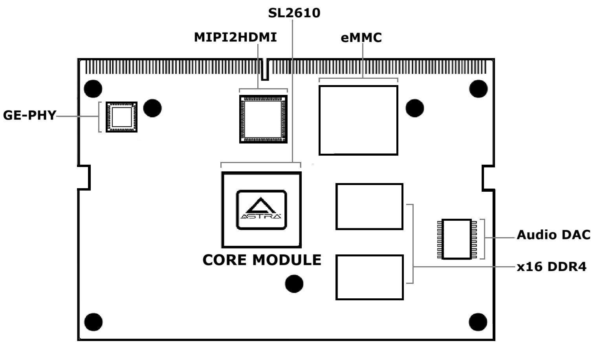
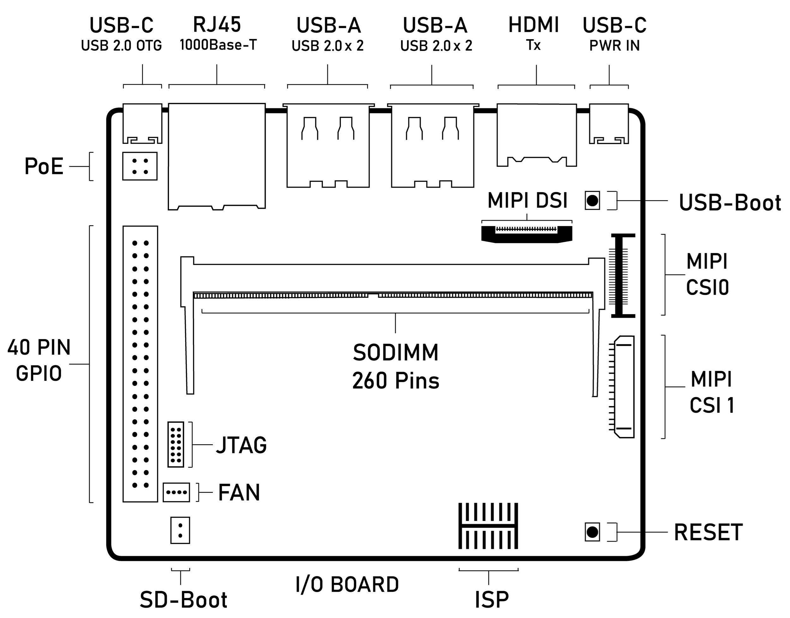
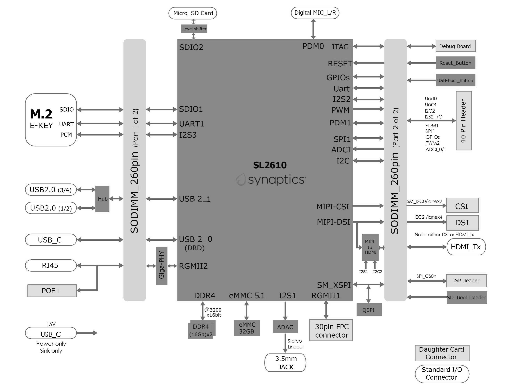
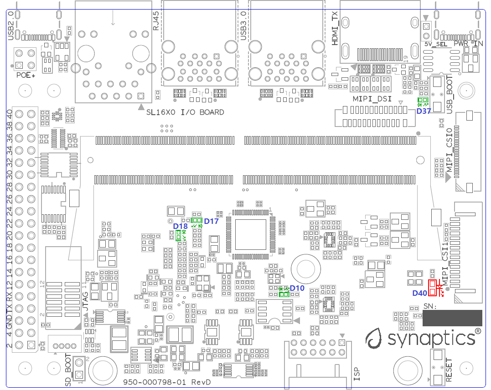
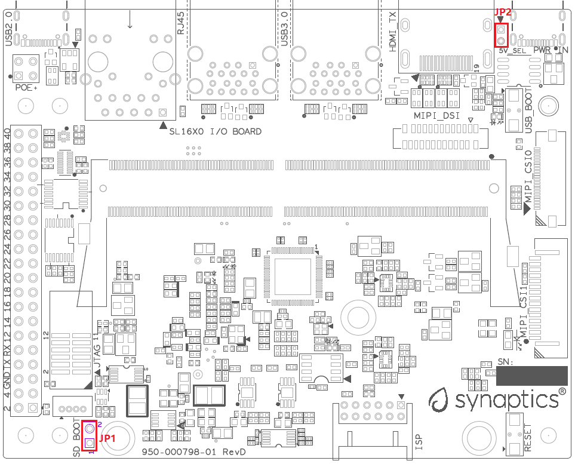
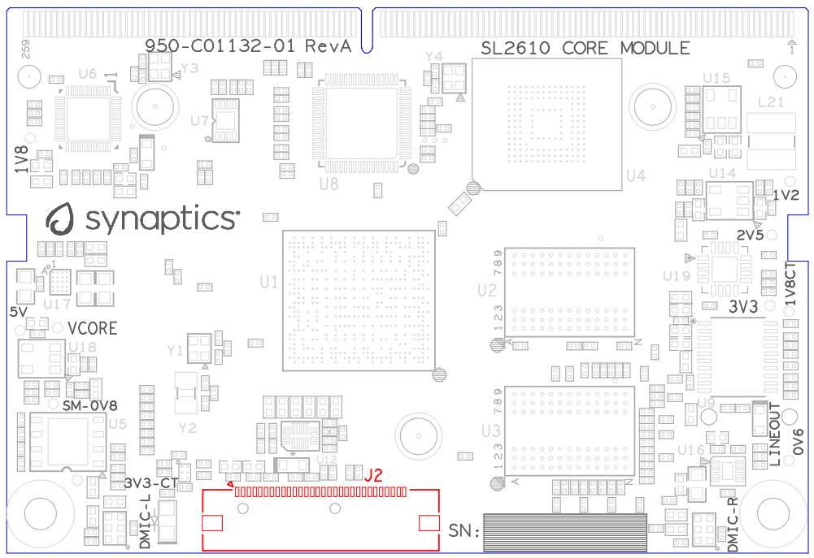
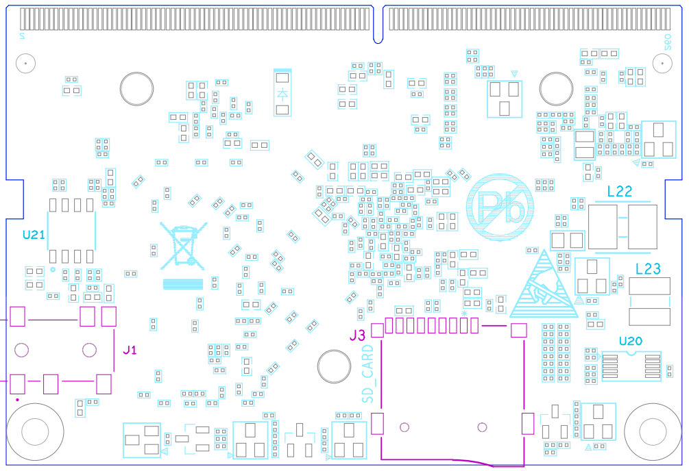
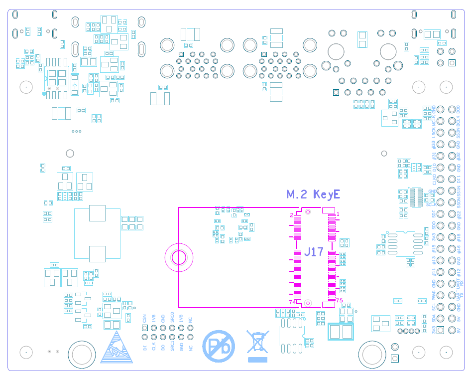
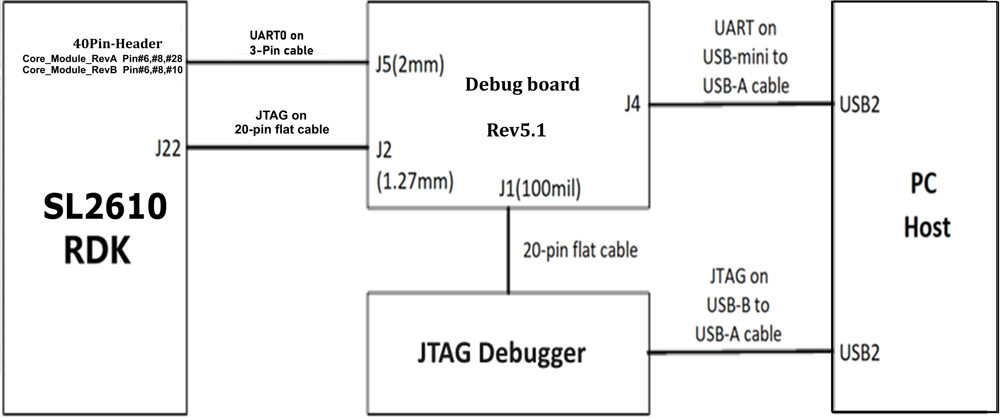
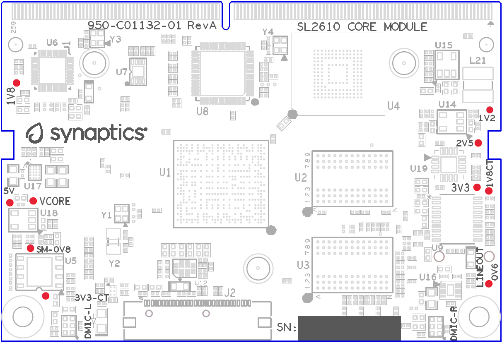

=================
SL2600 User Guide
=================

Introduction
============

The Synaptics Astra™ Machina SL2600 Series Developer Kit enables easy
and rapid prototyping of multimodal AI-native IoT applications. A
flexible design approach supports a core compute module, an I/O base
board, daughter cards for integrated Wi-Fi / Bluetooth connectivity,
debug, and programmable I/O. The evaluation system supports the
Synaptics SL2619 SoC family that delivers unprecedented levels of price
performance for the IoT, and enabled via an open, unified software
experience built on Yocto Linux. The Machina SL2600 Series is powered by
the open-source Synaptics Torq™ Edge AI platform, leveraging the Torq T1
and the Coral NPU subsystems.

Scope
-----

This user guide describes the hardware configuration and functional
details for the Astra Machina SL2610 core module, I/O board, and
supported daughter cards, in addition to the bring-up sequence for the
developer kit.

Definition of Board Components
------------------------------

-  **Astra Machina**: Combined system with core module, I/O board, and
   supported daughter cards.

-  **Core module**: Processor subsystem module with key components
   including SL2610, eMMC, and DDR4.

-  **I/O board**: Common base board that includes various standard
   hardware interfaces, buttons, headers, and power-in.

-  **Daughter card**: Add-on boards for supporting various features such
   as connectivity, debug, and other flexible I/O options.

Astra Machina System Overview
-----------------------------

This section covers system features, block diagrams and top views of the
Astra Machina developer kit.

   SL2610 Core Module (Dimensions: W x H = 69.6 mm x 47.38 mm)

   I/O Board

Features
~~~~~~~~

The SL2610-based developer kit includes the following components:

-  Main components on the core module:

-  Synaptics SL2610 Dual-Core Arm\ :sup:`®` Cortex\ :sup:`®`-A55
   embedded IoT processor, up to 2.0 GHz

-  Storage: eMMC 5.1 (32 GB \[1\]_)

-  DRAM: 2GB system memory — 2pcs of 1GB DDR4-3200, x8 devices

-  PMIC: support DVFS in Vcore supply rail

-  MIPI DSI to HDMI 1.4 output

-  SD Card Receptacle

-  Line-out: direct Line Level 2.1-VRMS stereo output

-  DMIC: 2 digital microphones – 1 PDM stereo audio input

-  Main components on the I/O board:

-  M.2 E-key 2230 Receptacle: It supports SDIO, UART for Wi-Fi/BT
   modules

-  USB 2.0 Type-A: 4 ports to support host mode at Hi-Speed.

-  USB 2.0 Type-C: supports OTG host or peripheral mode at Hi-Speed.

-  Push buttons: used for USB-BOOT selection and system RESET.

-  2pin Header: used for SD-BOOT selection.

-  Daughter card interface options:

-  MIPI DSI on 22-pin FPC interface to support 4-lane DSI plus I2C and
   GPIOs for up to 1080p60 display panel.

-  MIPI CSI on 22-pin at CSI0 for 2-lane plus I2C and GPIOs, for up to
   2160p30 resolution.

-  JTAG daughter card for debug.

-  40-pin header for additional functions

-  4-pin PoE+ connector, with a PoE hat board (purchased separately), it
   offers an add-on voltage regulator module for PoE+ Type2 (802.3at)
   power device. Available power shall be 25.5W (Class 4) at 5V pins of
   40-pin header to I/O board.

-  Type-C power supply with 15V @ 1.8A.

SL2610 System Block Diagram
~~~~~~~~~~~~~~~~~~~~~~~~~~~

   SL2610 System Block Diagram

Top view of SL2610 Astra Machina developer kit
~~~~~~~~~~~~~~~~~~~~~~~~~~~~~~~~~~~~~~~~~~~~~~

.. figure:: media/sl2600/image7.png
   :width: 6.49583in
   :height: 4.61597in

   Top view of SL2610 Developer Kit

System connectors 
~~~~~~~~~~~~~~~~~~

.. figure:: media/sl2600/image8.png
   :width: 6.37306in
   :height: 3.44186in

   Front View

.. figure:: media/sl2600/image9.png
   :width: 6.41445in
   :height: 3.9434in

   Rear View

Astra Machina Board Control/Status & System I/O
===============================================

This section covers boot-up, LEDs status indicators, buttons,
connectors, and pin-strap settings.

Booting Up
----------

The Astra Machina supports booting from three interfaces. Users can
select a boot interface before powering up, as follows:

-  **eMMC boot:** Default boot interface.

-  **SD boot:** Short SD_Boot header by 2.54mm jumper-cap before
   power-up, see SD_Boot header in :ref:`sl2600_jumper_location`. Ensure SD-Card with
   firmware is plugged into SD-slot on core module in :ref:`core_module_connectors`.

-  **USB boot:** Connect USB-C USB2.0 port to the host PC, then follow
   the procedure in :ref:`hardware_manual_button_settings`.

LEDs
----

LED locations
~~~~~~~~~~~~~

:ref:`sl2600_led_location` shows the LED locations on the I/O board.

.. _sl2600_led_location:

   LED locations on I/O board

LED definitions
~~~~~~~~~~~~~~~

.. table:: LED definitions on I/O board

   +---------+--------------+--------------------------------------------+
   | LED     | Color        | LEDs Function                              |
   +=========+==============+============================================+
   | D10     | Green        | LED indicator for USB3.0 Hub is working in |
   |         |              | normal mode or suspend mode.               |
   +---------+--------------+--------------------------------------------+
   | D17     | Green        | LED indicator1 for M.2 device general      |
   |         |              | purpose.                                   |
   +---------+--------------+--------------------------------------------+
   | D18     | Green        | LED indicator2 for M.2 device general      |
   |         |              | purpose.                                   |
   +---------+--------------+--------------------------------------------+
   | D37     | Green        | LED indicator for Power-on status.         |
   +---------+--------------+--------------------------------------------+
   | D40     | RED          | LED indicator for Stand-By Status.         |
   +---------+--------------+--------------------------------------------+

SM PinStrap and Boot-up Settings
--------------------------------

.. table:: SM pinstrap and boot-up settings on core module

   +------+----------------+--------------+------------------+------------------------------------------------------------+
   | Pin# | Pin Mux Name   | Setting      | Resistor         | Description                                                |
   |      |                | Value        | Stuffing         |                                                            |
   |      |                | Default\*    |                  |                                                            |
   |      |                |              | + stuffed        | Rpu = OnChip Pull-up                                       |
   |      |                |              |                  |                                                            |
   |      |                |              | - removed        | Rpd = OnChip Pull-down                                     |
   |      |                |              |                  |                                                            |
   +======+================+==============+==================+============================================================+
   | N30  | PLLBYPS        | —            | —                | Straps for CPU reset bypass                                |
   +------+----------------+--------------+------------------+------------------------------------------------------------+
   |      |                | 0*           | -R190            | 0: Enable reset logic inside CPU partition                 |
   +------+----------------+--------------+------------------+------------------------------------------------------------+
   |      |                | 1            | +R190            | 1: Bypass reset logic inside CPU partition                 |
   +------+----------------+--------------+------------------+------------------------------------------------------------+
   | B24  | dft_jtag_sel   | —            | —                | Straps for JTAG_SEL                                        |
   +------+----------------+--------------+------------------+------------------------------------------------------------+
   |      |                | 0*           | -R31             | 0: ATE/RMA mode — Functional JTAG is selected              |
   +------+----------------+--------------+------------------+------------------------------------------------------------+
   |      |                | 1            | +R31             | 1: ATE/RMA mode — DFT JTAG is selected                     |
   +------+----------------+--------------+------------------+------------------------------------------------------------+

SoC PinStrap and Boot-up Settings
---------------------------------

.. table:: SoC pinstrap and boot-up settings on core module

   +------+---------------------+-----------+---------------+------------------------------------------------------------+
   | Pin# | Pin Mux Name        | Setting   | Resistor      | Description                                                |
   |      |                     | Value     | Stuffing      |                                                            |
   |      |                     | Default\* |               |                                                            |
   |      |                     |           | + stuffed     | Rpu = OnChip Pull-up                                       |
   |      |                     |           |               |                                                            |
   |      |                     |           | - removed     | Rpd = OnChip Pull-down                                     |
   |      |                     |           |               |                                                            |
   +======+=====================+===========+===============+============================================================+
   | C5   | CPURSTBYPS          | —         | —             | Straps for CPU reset bypass                                |
   +------+---------------------+-----------+---------------+------------------------------------------------------------+
   |      |                     | 0*        | —             | 0: Enable reset logic inside CPU partition                 |
   +------+---------------------+-----------+---------------+------------------------------------------------------------+
   |      |                     | 1         | —             | 1: Bypass reset logic inside CPU partition                 |
   +------+---------------------+-----------+---------------+------------------------------------------------------------+
   | B13  | SOFTWARE_STRAP[0]   | —         | —             | Straps for software usage (Rpu)                            |
   +------+---------------------+-----------+---------------+------------------------------------------------------------+
   |      |                     | 0         | +R34          | Version control for Core-Module Rev B                      |
   +------+---------------------+-----------+---------------+------------------------------------------------------------+
   |      |                     | 1*        | -R34          | Version control for Core-Module Rev A                      |
   +------+---------------------+-----------+---------------+------------------------------------------------------------+
   | AF27 | SOFTWARE_STRAP[1]   | —         | —             | Straps for software usage (Rpd)                            |
   +------+---------------------+-----------+---------------+------------------------------------------------------------+
   |      |                     | 0*        | -R35          | Default setting                                            |
   +------+---------------------+-----------+---------------+------------------------------------------------------------+
   |      |                     | 1         | +R35          | Alternate setting                                          |
   +------+---------------------+-----------+---------------+------------------------------------------------------------+
   | C8   | SOFTWARE_STRAP[2]   | —         | —             | Straps for software usage (Rpd)                            |
   +------+---------------------+-----------+---------------+------------------------------------------------------------+
   |      |                     | 0*        | -R36          | Default setting                                            |
   +------+---------------------+-----------+---------------+------------------------------------------------------------+
   |      |                     | 1         | +R36          | Alternate setting                                          |
   +------+---------------------+-----------+---------------+------------------------------------------------------------+
   | B9   | SOFTWARE_STRAP[3]   | —         | —             | Straps for software usage (Rpd)                            |
   +------+---------------------+-----------+---------------+------------------------------------------------------------+
   |      |                     | 0*        | -R37          | Default setting                                            |
   +------+---------------------+-----------+---------------+------------------------------------------------------------+
   |      |                     | 1         | +R37          | Alternate setting                                          |
   +------+---------------------+-----------+---------------+------------------------------------------------------------+

.. table:: Boot-up settings on I/O board

   +-------------------+----------------+-----------+---------------+------------------------------------------------------------+
   | Net Name          | Strap Name     | Setting   | Resistor      | Description                                                |
   |                   |                | Value     | Stuffing      |                                                            |
   |                   |                | Default*  |               |                                                            |
   |                   |                |           | + stuffed     | Rpu = On-Chip Pull-up                                      |
   |                   |                |           |               |                                                            |
   |                   |                |           | - removed     | Rpd = On-Chip Pull-down                                    |
   |                   |                |           |               |                                                            |
   +===================+================+===========+===============+============================================================+
   | USB_BOOTn         | USB-Boot       | —         | —             | ROM code uses this strap to determine if booting from USB  |
   |                   |                |           |               | or not (Rpu).                                              |
   +-------------------+----------------+-----------+---------------+------------------------------------------------------------+
   |                   |                | 0         | —             | 0: Boot from USB when the USB-BOOT button is pressed while |
   |                   |                |           |               | system reset is de-asserted.                               |
   +-------------------+----------------+-----------+---------------+------------------------------------------------------------+
   |                   |                | 1*        | —             | 1: Boot from the device selected by boot_src[1].           |
   +-------------------+----------------+-----------+---------------+------------------------------------------------------------+
   | CONN-SPI.VDIO1P8. | SD-Boot        | —         | —             | ROM code uses this strap to determine if booting from      |
   | BOOT_SRC1         |                |           |               | SD Card or not (Rpu).                                      |
   +-------------------+----------------+-----------+---------------+------------------------------------------------------------+
   |                   |                | 0         | —             | 0: Boot from SD Card when SD_Boot header is ON while       |
   |                   |                |           |               | system reset is de-asserted.                               |
   +-------------------+----------------+-----------+---------------+------------------------------------------------------------+
   |                   |                | 1*        | —             | 1: Boot from the device selected by boot_src[1] when       |
   |                   |                |           |               | SD_Boot header is OFF.                                     |
   +-------------------+----------------+-----------+---------------+------------------------------------------------------------+

.. _hardware_manual_button_settings:

Hardware Manual Button Settings
-------------------------------

.. table:: Hardware manual button settings definitions on I/O board

   +--------------+---------------+----------+---------------------------+
   | Switch Block | Type          | Setting  | Function                  |
   +==============+===============+==========+===========================+
   | SW6 (RESET)  | Momentary     | Push     | SL2610 Reset Key asserted |
   |              | Pushbutton    |          |                           |
   +--------------+---------------+----------+---------------------------+
   |              |               | Release  | Key de-asserted           |
   +--------------+---------------+----------+---------------------------+
   | SW7          | Momentary     | Push     | USB boot Key asserted.    |
   | (USB_BOOT)   | Pushbutton    |          | USB-Boot mode requires a  |
   |              |               |          | combination of the        |
   |              |               |          | USB_BOOT key and the      |
   |              |               |          | RESET button. Refer to    |
   |              |               |          | the steps below for the   |
   |              |               |          | detailed entry procedure. |
   +--------------+---------------+----------+---------------------------+
   |              |               | Release  | Key de-asserted           |
   +--------------+---------------+----------+---------------------------+

To enter USB-Boot mode, follow these steps:

.. note::

 Prior to these steps, make sure the USB driver is installed successfully on the PC host side. For details, please
 reference :doc:`/linux/index`.

1. Push RESET button to assert system reset to SL2610.

2. Keep pushing RESET button and push USB_BOOT button at the same time
   for 1-2 seconds.

3. Release RESET button while holding USB_BOOT button, so SL2610 enters
   USB-Boot mode.

4. Check and wait for the console print… messages.

   Once the console print is returned and entered USB boot successfully,
   release USB_BOOT button.

.. figure:: media/sl2600/image11.png
   :width: 4.98101in
   :height: 4.38446in

   Locations of manual buttons on I/O board

Hardware Jumper Settings
------------------------

.. table:: Hardware jumper settings definitions on I/O board

   +-----+-----------+--------------+-------------------------------------------+
   | Ref | Type      | Pin          | Description                               |
   | Des |           |              |                                           |
   |     |           | Connection   |                                           |
   |     |           |              |                                           |
   +=====+===========+==============+===========================================+
   | JP1 | 2x1       | 1-2          | SD_Boot selection                         |
   |     | 2.54mm    |              |                                           |
   |     | header    |              |                                           |
   +-----+-----------+--------------+-------------------------------------------+
   |     |           |              | -  Open: Boot from the device select by   |
   |     |           |              |    boot_src[1]                            |
   +-----+-----------+--------------+-------------------------------------------+
   |     |           |              | -  Short: Boot from SD_Card while         |
   |     |           |              |    power-up or system reset de-assertion  |
   +-----+-----------+--------------+-------------------------------------------+
   | JP2 | 2x1 2mm   | 1-2          | 5V_SEL selection                          |
   |     | header    |              |                                           |
   +-----+-----------+--------------+-------------------------------------------+
   |     |           |              | -  Open: 15V from USB-C adapter Power-In  |
   +-----+-----------+--------------+-------------------------------------------+
   |     |           |              | -  Short: 5V from USB-C adapter Power-In  |
   +-----+-----------+--------------+-------------------------------------------+

To enter SD-Boot mode, follow these steps:

.. note::

   Prior to these steps, make sure SD-Card with firmware is plugged into
   SD-slot on the core module.

1. Short SD_Boot header by 2.54mm jumper-cap before power-up.

2. Power-up system, then boot-up from SD_Card.

   :ref:`sl2600_jumper_location` shows the Header locations on the I/O board.

.. _sl2600_jumper_location:

   Locations of jumper on I/O board

SL2610 Developer Kit Connectors
-------------------------------

Locations of core module connectors on top side
~~~~~~~~~~~~~~~~~~~~~~~~~~~~~~~~~~~~~~~~~~~~~~~

   Locations on core module top side

Locations of core module connectors on bottom side
~~~~~~~~~~~~~~~~~~~~~~~~~~~~~~~~~~~~~~~~~~~~~~~~~~

.. _core_module_connectors:

   Locations on core module bottom side

Core module connector definitions
~~~~~~~~~~~~~~~~~~~~~~~~~~~~~~~~~

.. table:: Core module connector definitions

   +-----+------------+-----------+--------------------------------------+
   | Main| Connecting | Functions | Remarks                              |
   |     | Boards /   |           |                                      |
   |     | Devices    |           |                                      |
   | Ref | (Ref Des   |           |                                      |
   | Des | if any)    |           |                                      |
   +=====+============+===========+======================================+
   | J1  | Stereo     | Analog    | Audio L/R output to 3.5mm Jack.      |
   |     | Line out   | audio     |                                      |
   |     |            | L/R       |                                      |
   +-----+------------+-----------+--------------------------------------+
   | J2  | RGMII1     | RGMII1    | Connector for RGMII1 signals through |
   |     |            |           | 30-pin FPC cable.                    |
   +-----+------------+-----------+--------------------------------------+
   | J3  | MicroSD    | SDIO      | For microSD type of memory card      |
   |     | Card       | card      | extension.                           |
   +-----+------------+-----------+--------------------------------------+

Locations of I/O board connectors on top side
~~~~~~~~~~~~~~~~~~~~~~~~~~~~~~~~~~~~~~~~~~~~~

.. figure:: media/sl2600/image15.png
   :width: 6.5in
   :height: 5.15694in

   Locations on I/O board top side

Locations of I/O board connectors on bottom side
~~~~~~~~~~~~~~~~~~~~~~~~~~~~~~~~~~~~~~~~~~~~~~~~

   Locations on I/O board bottom side

I/O board connector definitions
~~~~~~~~~~~~~~~~~~~~~~~~~~~~~~~

.. table:: I/O board connector definitions

   +------+----------------+---------------+--------------------------------+
   | Main | Connecting     | Functions     | Remarks                        |
   | Ref  | Boards/Devices |               |                                |
   | Des  | (Ref Des if    |               |                                |
   |      | any)           |               |                                |
   +======+================+===============+================================+
   | J1   | ISP D/C        | SPI           | 12-pin daughter card to        |
   |      |                |               | support offline program SPI    |
   |      |                |               | NOR flash on core module       |
   +------+----------------+---------------+--------------------------------+
   | J2   | RJ45 cable     | Giga Ethernet | For Wired Ethernet connection  |
   +------+----------------+---------------+--------------------------------+
   | J12  | HDMI Sink      | HDMI TX       | For off-board HDMI Sink device |
   |      |                |               | connection                     |
   +------+----------------+---------------+--------------------------------+
   | J13  | FAN            | Heat          | Not Applicable for SL2610      |
   |      |                | Dissipation   |                                |
   |      |                | w/ FAN        |                                |
   +------+----------------+---------------+--------------------------------+
   | J17  | M.2 2230 D/C   | SDIO and PCIe | 1x1/2x2 WiFi/Bluetooth card    |
   |      |                |               | via SDIO                       |
   |      |                |               |                                |
   |      |                |               | PCIe is not applicable for     |
   |      |                |               | SL2610.                        |
   +------+----------------+---------------+--------------------------------+
   | J22  | Debug Board    | JTAG          | XDB debugger for debugging     |
   +------+----------------+---------------+--------------------------------+
   | J32  | 40-pins Header | UART, I2C,    | Flexible for support various   |
   |      |                | SPI, PDM,     | D/C                            |
   |      |                | I2SI, GPIOs,  |                                |
   |      |                | STS1, PWM,    |                                |
   |      |                | ADC           |                                |
   +------+----------------+---------------+--------------------------------+
   | J34  | PoE+ D/C       | PoE+          | 4-pin PoE+ daughter card with  |
   |      |                |               | supporting an add-on 5V        |
   |      |                |               | voltage to 40pin Header.       |
   +------+----------------+---------------+--------------------------------+
   | J206 | MIPI-CSI0      | MIPI-CSI      | For MIPI-CSI x2 lane           |
   |      | adaptor        |               | extension, like camera         |
   +------+----------------+---------------+--------------------------------+
   | J207 | MIPI-CSI1      | MIPI-CSI      | Not Applicable for SL2610      |
   |      | adaptor        |               |                                |
   +------+----------------+---------------+--------------------------------+
   | J208 | MIPI-DSI       | MIPI-DSI      | For MIPI-DSI x4 lane           |
   |      | adaptor        |               | extension, like panel          |
   +------+----------------+---------------+--------------------------------+
   | J210 | USB Device     | USB2.0 x2     | For USB2.0 extension in Device |
   |      |                |               | mode only                      |
   +------+----------------+---------------+--------------------------------+
   | J213 | Type C power   | Power Supply  | Power for Astra Machina rated  |
   |      | source         |               | at 15V/1.8A                    |
   +------+----------------+---------------+--------------------------------+
   | J215 | Dual-Role USB  | USB2.0 OTG    | For USB2.0 extension, in       |
   |      |                |               | either Host or Device mode     |
   +------+----------------+---------------+--------------------------------+
   | J216 | USB Device     | USB2.0 x2     | For USB2.0 extension in Device |
   |      |                |               | mode only                      |
   +------+----------------+---------------+--------------------------------+

Daughter Cards
==============

A set of daughter cards supplements the Astra Machina system with a
range of extensible and configurable functionalities including Wi-Fi and
Bluetooth connectivity, debug options and general purpose I/O. Details
of currently supported daughter cards are described in this section.

Debug Board 
------------

Debug Board (Rev5) allows users to communicate with the SL2610 system
over JTAG through a Debugger on a PC host. While connecting the Astra
Machina and debug board with a 20-pin flat cable, align pin-1 of the
2x10 cable socket at the debug board side with pin-1 of 2x6 header J22
on the developer kit.

| Users may communicate with SL2610 over UART on a PC host by using a
  UART to USB cable commonly available. See the Astra Machina webpage
  for a list of qualified parts. As an option, the debug board also
  provides such bridging function based on the Silicon Labs CP2102. A
  virtual COM port driver is required, and can be downloaded from the
  following link and installed on the host PC:
| https://www.silabs.com/products/development-tools/software/usb-to-uart-bridge-vcp-drivers

UART on the developer kit and the PC host USB are digitally isolated,
with no direct conductive path, eliminating ground loop and back-drive
issues when either is powered down.

:ref:`sl2600_uart` shows debug board connectivity facilitating UART and JTAG
communications.

.. _sl2600_uart:

   Debug board connectivity for UART and JTAG

M.2 Card
--------

An M.2 E-Key socket J17 is provided for a variety of modules in the M.2
form factor. Typical applicable modules support Wi-Fi/BT devices with
SDIO

Available modules:

-  Ampak AP12611_M2 with SYN43711 WiFi6E/BT5.3 1x1 over SDIO on M.2
   adaptor

260-Pins SODIMM Definition
--------------------------

A 260-Pins SODIMM connector (PN: TE_2309413-1) joins the core module and
the I/O board. Table 9 shows the assignment for the 260-Pins.

.. table:: 260-Pins SODIMM definition

   +----------------------------------+------+------------------+------+------------------------------+
   | Assignment                       | Pin# | 260-Pins SODIMM  | Pin# | Assignment                   |
   +==================================+======+==================+======+==============================+
   | VDDM_0V6_VTT_CTL (From IO_Exp)   | 2    |                  | 1    | N/A                          |
   +----------------------------------+------+------------------+------+------------------------------+
   | XSPI_SDO                         | 4    |                  | 3    | SM_CLKOUT                    |
   +----------------------------------+------+------------------+------+------------------------------+
   | XSPI_SCLK                        | 6    |                  | 5    | XSPI_CLKn                    |
   +----------------------------------+------+------------------+------+------------------------------+
   | VDDM_control (From IO_Exp)       | 8    |                  | 7    | N/A                          |
   +----------------------------------+------+------------------+------+------------------------------+
   | N/A                              | 10   |                  | 9    | N/A                          |
   +----------------------------------+------+------------------+------+------------------------------+
   | XSPI_SDI                         | 12   |                  | 11   | N/A                          |
   +----------------------------------+------+------------------+------+------------------------------+
   | XSPI_SS0n                        | 14   |                  | 13   | N/A                          |
   +----------------------------------+------+------------------+------+------------------------------+
   | External_Boot_SRC0               | 16   |                  | 15   | N/A                          |
   +----------------------------------+------+------------------+------+------------------------------+
   | N/A                              | 18   |                  | 17   | N/A                          |
   +----------------------------------+------+------------------+------+------------------------------+
   | N/A                              | 20   |                  | 19   | N/A                          |
   +----------------------------------+------+------------------+------+------------------------------+
   | ETH1_RST (From IO_Exp)           | 22   |                  | 21   | N/A                          |
   +----------------------------------+------+------------------+------+------------------------------+
   | SD-CARD_PWR_EN (From IO_Exp)     | 24   |                  | 23   | N/A                          |
   +----------------------------------+------+------------------+------+------------------------------+
   | GND                              | 26   |                  | 25   | N/A                          |
   +----------------------------------+------+------------------+------+------------------------------+
   | N/A                              | 28   |                  | 27   | N/A                          |
   +----------------------------------+------+------------------+------+------------------------------+
   | N/A                              | 30   |                  | 29   | N/A                          |
   +----------------------------------+------+------------------+------+------------------------------+
   | GND                              | 32   |                  | 31   | N/A                          |
   +----------------------------------+------+------------------+------+------------------------------+
   | N/A                              | 34   |                  | 33   | N/A                          |
   +----------------------------------+------+------------------+------+------------------------------+
   | N/A                              | 36   |                  | 35   | N/A                          |
   +----------------------------------+------+------------------+------+------------------------------+
   | GND                              | 38   |                  | 37   | N/A                          |
   +----------------------------------+------+------------------+------+------------------------------+
   | N/A                              | 40   |                  | 39   | N/A                          |
   +----------------------------------+------+------------------+------+------------------------------+
   | N/A                              | 42   |                  | 41   | N/A                          |
   +----------------------------------+------+------------------+------+------------------------------+
   | GND                              | 44   |                  | 43   | N/A                          |
   +----------------------------------+------+------------------+------+------------------------------+
   | USB2_0_Dn                        | 46   |                  | 45   | N/A                          |
   +----------------------------------+------+------------------+------+------------------------------+
   | USB2_0_Dp                        | 48   |                  | 47   | N/A                          |
   +----------------------------------+------+------------------+------+------------------------------+
   | GND                              | 50   |                  | 49   | N/A                          |
   +----------------------------------+------+------------------+------+------------------------------+
   | N/A                              | 52   |                  | 51   | N/A                          |
   +----------------------------------+------+------------------+------+------------------------------+
   | N/A                              | 54   |                  | 53   | GND                          |
   +----------------------------------+------+------------------+------+------------------------------+
   | GND                              | 56   |                  | 55   | N/A                          |
   +----------------------------------+------+------------------+------+------------------------------+
   | N/A                              | 58   |                  | 57   | N/A                          |
   +----------------------------------+------+------------------+------+------------------------------+
   | N/A                              | 60   |                  | 59   | GND                          |
   +----------------------------------+------+------------------+------+------------------------------+
   | GND                              | 62   |                  | 61   | N/A                          |
   +----------------------------------+------+------------------+------+------------------------------+
   | USB2_1_Dp                        | 64   |                  | 63   | N/A                          |
   +----------------------------------+------+------------------+------+------------------------------+
   | USB2_1_Dn                        | 66   |                  | 65   | GND                          |
   +----------------------------------+------+------------------+------+------------------------------+
   | GND                              | 68   |                  | 67   | MIPI_CSI_RD1p                |
   +----------------------------------+------+------------------+------+------------------------------+
   | USB2_0_ID                        | 70   |                  | 69   | MIPI_CSI_RD1n                |
   +----------------------------------+------+------------------+------+------------------------------+
   | USB-C_VBUS                       | 72   |                  | 71   | GND                          |
   +----------------------------------+------+------------------+------+------------------------------+
   | USB-A_VBUS                       | 74   |                  | 73   | MIPI_CSI_RD0n                |
   +----------------------------------+------+------------------+------+------------------------------+
   | I2S3_BCLK                        | 76   |                  | 75   | MIPI_CSI_RD0p                |
   +----------------------------------+------+------------------+------+------------------------------+
   | I2S3_DI                          | 78   |                  | 77   | GND                          |
   +----------------------------------+------+------------------+------+------------------------------+
   | I2S3_DO                          | 80   |                  | 79   | MIPI_CSI_RCKp                |
   +----------------------------------+------+------------------+------+------------------------------+
   | 2S3_LRCK                         | 82   |                  | 81   | MIPI_CSI_RCKn                |
   +----------------------------------+------+------------------+------+------------------------------+
   | I2S2_DI                          | 84   |                  | 83   | GND                          |
   +----------------------------------+------+------------------+------+------------------------------+
   | URT4_RXD                         | 86   |                  | 85   | N/A                          |
   +----------------------------------+------+------------------+------+------------------------------+
   | PDM_DI1                          | 88   |                  | 87   | N/A                          |
   +----------------------------------+------+------------------+------+------------------------------+
   | GPIO_11                          | 90   |                  | 89   | GND                          |
   +----------------------------------+------+------------------+------+------------------------------+
   | SM_GPIO27                        | 92   |                  | 91   | N/A                          |
   +----------------------------------+------+------------------+------+------------------------------+
   | SM_GPIO26                        | 94   |                  | 93   | N/A                          |
   +----------------------------------+------+------------------+------+------------------------------+
   | SM_GPIO34                        | 96   |                  | 95   | GND                          |
   +----------------------------------+------+------------------+------+------------------------------+
   | N/A                              | 98   |                  | 97   | N/A                          |
   +----------------------------------+------+------------------+------+------------------------------+
   | N/A                              | 100  |                  | 99   | N/A                          |
   +----------------------------------+------+------------------+------+------------------------------+
   | N/A                              | 102  |                  | 101  | GND                          |
   +----------------------------------+------+------------------+------+------------------------------+
   | I2S2_BCLK                        | 104  |                  | 103  | N/A                          |
   +----------------------------------+------+------------------+------+------------------------------+
   | EXPANDER_INT_REQn                | 106  |                  | 105  | N/A                          |
   +----------------------------------+------+------------------+------+------------------------------+
   | BOOT_SRC1                        | 108  |                  | 107  | GND                          |
   +----------------------------------+------+------------------+------+------------------------------+
   | I2S2_DO                          | 110  |                  | 109  | N/A                          |
   +----------------------------------+------+------------------+------+------------------------------+
   | I2S2_MCLK                        | 112  |                  | 111  | N/A                          |
   +----------------------------------+------+------------------+------+------------------------------+
   | I2S2_LRCK                        | 114  |                  | 113  | GND                          |
   +----------------------------------+------+------------------+------+------------------------------+
   | SM_ADCI[0]                       | 116  |                  | 115  | MIPI_DSI_TD0n                |
   +----------------------------------+------+------------------+------+------------------------------+
   | SM_ADCI[1]                       | 118  |                  | 117  | MIPI_DSI_TD0p                |
   +----------------------------------+------+------------------+------+------------------------------+
   | SM_URT0_TXD                      | 120  |                  | 119  | GND                          |
   +----------------------------------+------+------------------+------+------------------------------+
   | SM_URT0_RXD                      | 122  |                  | 121  | MIPI_DSI_TD1n                |
   +----------------------------------+------+------------------+------+------------------------------+
   | SPI1_SDI                         | 124  |                  | 123  | MIPI_DSI_TD1p                |
   +----------------------------------+------+------------------+------+------------------------------+
   | SPI1_SCLK                        | 126  |                  | 125  | GND                          |
   +----------------------------------+------+------------------+------+------------------------------+
   | SPI1_SDO                         | 128  |                  | 127  | MIPI_DSI_TCKp                |
   +----------------------------------+------+------------------+------+------------------------------+
   | SM_GPIO28                        | 130  |                  | 129  | MIPI_DSI_TCKn                |
   +----------------------------------+------+------------------+------+------------------------------+
   | USB2_OCn                         | 132  |                  | 131  | GND                          |
   +----------------------------------+------+------------------+------+------------------------------+
   | SPI1_SS3n                        | 134  |                  | 133  | MIPI_DSI_TD3n                |
   +----------------------------------+------+------------------+------+------------------------------+
   | SM_GPIO25                        | 136  |                  | 135  | MIPI_DSI_TD3p                |
   +----------------------------------+------+------------------+------+------------------------------+
   | SM_TW0_SDA                       | 138  |                  | 137  | GND                          |
   +----------------------------------+------+------------------+------+------------------------------+
   | SM_TW0_SCL                       | 140  |                  | 139  | MIPI_DSI_TD2p                |
   +----------------------------------+------+------------------+------+------------------------------+
   | SM_AUDIO_MUTE\@PD                | 142  |                  | 141  | MIPI_DSI_TD2n                |
   +----------------------------------+------+------------------+------+------------------------------+
   | CAMERA_MUTE\@PD                  | 144  |                  | 143  | GND                          |
   +----------------------------------+------+------------------+------+------------------------------+
   | N/A                              | 146  |                  | 145  | GND                          |
   +----------------------------------+------+------------------+------+------------------------------+
   | N/A                              | 148  |                  | 147  | HDMI_TX_TCKn                 |
   +----------------------------------+------+------------------+------+------------------------------+
   | N/A                              | 150  |                  | 149  | HDMI_TX_TCKp                 |
   +----------------------------------+------+------------------+------+------------------------------+
   | HDMITX_HPD                       | 152  |                  | 151  | GND                          |
   +----------------------------------+------+------------------+------+------------------------------+
   | N/A                              | 154  |                  | 153  | HDMI_TX_TD0n                 |
   +----------------------------------+------+------------------+------+------------------------------+
   | HDMI_TX_EDDC_SDA                 | 156  |                  | 155  | HDMI_TX_TD0p                 |
   +----------------------------------+------+------------------+------+------------------------------+
   | HDMI_TX_EDDC_SCL                 | 158  |                  | 157  | GND                          |
   +----------------------------------+------+------------------+------+------------------------------+
   | LevelTranslator_ENn              | 160  |                  | 159  | HDMI_TX_TD1n                 |
   +----------------------------------+------+------------------+------+------------------------------+
   | LT9611-CEC                       | 162  |                  | 161  | HDMI_TX_TD1p                 |
   +----------------------------------+------+------------------+------+------------------------------+
   | SM_RSTIn\@PU                     | 164  |                  | 163  | GND                          |
   +----------------------------------+------+------------------+------+------------------------------+
   | JTAG_TDO                         | 166  |                  | 165  | HDMI_TX_TD2n                 |
   +----------------------------------+------+------------------+------+------------------------------+
   | JTAG_TDI & BT-WIFI_wake-up       | 168  |                  | 167  | HDMI_TX_TD2p                 |
   +----------------------------------+------+------------------+------+------------------------------+
   | JTAG_TMS & ETH1/2_INT            | 170  |                  | 169  | GND                          |
   +----------------------------------+------+------------------+------+------------------------------+
   | N/A                              | 172  |                  | 171  | N/A                          |
   +----------------------------------+------+------------------+------+------------------------------+
   | N/A                              | 174  |                  | 173  | N/A                          |
   +----------------------------------+------+------------------+------+------------------------------+
   | URT4_TXD                         | 176  |                  | 175  | GND                          |
   +----------------------------------+------+------------------+------+------------------------------+
   | SM_TW1_SDA                       | 178  |                  | 177  | HDMI_TX_PWR_EN               |
   +----------------------------------+------+------------------+------+------------------------------+
   | SM_TW1_SCL                       | 180  |                  | 179  | JTAG_TCK                     |
   +----------------------------------+------+------------------+------+------------------------------+
   | TW2_SDA                          | 182  |                  | 181  | SM_GPIO29                    |
   +----------------------------------+------+------------------+------+------------------------------+
   | TW2_SCL                          | 184  |                  | 183  | JTAG_TRSTn                   |
   +----------------------------------+------+------------------+------+------------------------------+
   | SM_URT1_CTSn for M.2             | 186  |                  | 185  | GPIO30                       |
   +----------------------------------+------+------------------+------+------------------------------+
   | SM_URT1_RTSn for M.2             | 188  |                  | 187  | SM_URT1_RXD for M.2          |
   +----------------------------------+------+------------------+------+------------------------------+
   | PWM2                             | 190  |                  | 189  | GPIO29                       |
   +----------------------------------+------+------------------+------+------------------------------+
   | GND                              | 192  |                  | 191  | SM_URT1_TXD for M.2          |
   +----------------------------------+------+------------------+------+------------------------------+
   | PWR_1V8                          | 194  |                  | 193  | N/A                          |
   +----------------------------------+------+------------------+------+------------------------------+
   | PWR_1V8                          | 196  |                  | 195  | SM_ADCI3                     |
   +----------------------------------+------+------------------+------+------------------------------+
   | PWR_1V8_CTL                      | 198  |                  | 197  | SM_ADCI4                     |
   +----------------------------------+------+------------------+------+------------------------------+
   | PWR_1V8_CTL                      | 200  |                  | 199  | SM_ADCI5                     |
   +----------------------------------+------+------------------+------+------------------------------+
   | PWR_3V3_CTL                      | 202  |                  | 201  | SM_ADCI6                     |
   +----------------------------------+------+------------------+------+------------------------------+
   | PWR_3V3_CTL                      | 204  |                  | 203  | SM_ADCI7                     |
   +----------------------------------+------+------------------+------+------------------------------+
   | GND                              | 206  |                  | 205  | USB_BOOTn                    |
   +----------------------------------+------+------------------+------+------------------------------+
   | SDIO1_CLK                        | 208  |                  | 207  | MicroSD-CONN_VOL-SEL         |
   +----------------------------------+------+------------------+------+------------------------------+
   | GND                              | 210  |                  | 209  | GePH Y_LED1&&STRP[CFG_LDO0]  |
   +----------------------------------+------+------------------+------+------------------------------+
   | SDIO1_CMD                        | 212  |                  | 211  | GePH Y_LED2&&STRP[CFG_LDO1]  |
   +----------------------------------+------+------------------+------+------------------------------+
   | GND                              | 214  |                  | 213  | GND                          |
   +----------------------------------+------+------------------+------+------------------------------+
   | SDIO1_D0                         | 216  |                  | 215  | RJ45_MDIP0                   |
   +----------------------------------+------+------------------+------+------------------------------+
   | GND                              | 218  |                  | 217  | RJ45_MDIN0                   |
   +----------------------------------+------+------------------+------+------------------------------+
   | SDIO1_D1                         | 220  |                  | 219  | GND                          |
   +----------------------------------+------+------------------+------+------------------------------+
   | GND                              | 222  |                  | 221  | RJ45_MDIP1                   |
   +----------------------------------+------+------------------+------+------------------------------+
   | SDIO1_D2                         | 224  |                  | 223  | RJ45_MDIN1                   |
   +----------------------------------+------+------------------+------+------------------------------+
   | GND                              | 226  |                  | 225  | GND                          |
   +----------------------------------+------+------------------+------+------------------------------+
   | SDIO1_D3                         | 228  |                  | 227  | RJ45_MDIP2                   |
   +----------------------------------+------+------------------+------+------------------------------+
   | GND                              | 230  |                  | 229  | RJ45_MDIN2                   |
   +----------------------------------+------+------------------+------+------------------------------+
   | PWR_3V3                          | 232  |                  | 231  | GND                          |
   +----------------------------------+------+------------------+------+------------------------------+
   | PWR_3V3                          | 234  |                  | 233  | RJ45_MDIP3                   |
   +----------------------------------+------+------------------+------+------------------------------+
   | PWR_3V3                          | 236  |                  | 235  | RJ45_MDIN3                   |
   +----------------------------------+------+------------------+------+------------------------------+
   | PWR_3V3                          | 238  |                  | 237  | GND                          |
   +----------------------------------+------+------------------+------+------------------------------+
   | PWR_3V3                          | 240  |                  | 239  | PWR_BL_5V                    |
   +----------------------------------+------+------------------+------+------------------------------+
   | PWR_3V3                          | 242  |                  | 241  | PWR_BL_5V                    |
   +----------------------------------+------+------------------+------+------------------------------+
   | GND                              | 244  |                  | 243  | GND                          |
   +----------------------------------+------+------------------+------+------------------------------+
   | GND                              | 246  |                  | 245  | GND                          |
   +----------------------------------+------+------------------+------+------------------------------+
   | GND                              | 248  |                  | 247  | GND                          |
   +----------------------------------+------+------------------+------+------------------------------+
   | GND                              | 250  |                  | 249  | GND                          |
   +----------------------------------+------+------------------+------+------------------------------+
   | PWR_5V                           | 252  |                  | 251  | PWR_5V                       |
   +----------------------------------+------+------------------+------+------------------------------+
   | PWR_5V                           | 254  |                  | 253  | PWR_5V                       |
   +----------------------------------+------+------------------+------+------------------------------+
   | PWR_5V                           | 256  |                  | 255  | PWR_5V                       |
   +----------------------------------+------+------------------+------+------------------------------+
   | PWR_5V                           | 258  |                  | 257  | PWR_5V                       |
   +----------------------------------+------+------------------+------+------------------------------+
   | PWR_5V                           | 260  |                  | 259  | PWR_5V                       |
   +----------------------------------+------+------------------+------+------------------------------+

40-Pin Header
-------------

A 40-pin GPIO header with 0.1-inch (2.54mm) pin pitch is on the top edge
of the I/O board. Any of the general-purpose 3.3V pins can be configured
in software with a variety of alternative functions. For more
information, please refer to the *SL2610 Datasheet*.

.. note::

   Pin16/Pin18 are ADCI[0]/[1], the full-scale voltage is 1.8V @ max.

.. figure:: media/sl2600/image20.png
   :width: 6.49583in
   :height: 6.79097in

   40-Pins header definition

Pin-demuxing for Standard Interface Configuration
-------------------------------------------------

This section covers pin-demuxing configuration for the SL2610 developer
kit.

For System Manager (SM), see :ref:`sl2600_sm_pindemux`.

For System on Chip (SoC), see :ref:`sl2600_soc_pindemux`.

.. _sl2600_sm_pindemux:

.. table:: SM Pin-demuxing usage

   +-----------+-----------+---------------+-------------------------------+
   | SL2610    |           |               |                               |
   | System    |           |               |                               |
   | Manger    |           |               |                               |
   | (SM)      |           |               |                               |
   | Domain    |           |               |                               |
   +===========+===========+===============+===============================+
   | PAD NAME  | Mode      | Default Usage | Default Function description  |
   |           | Setting   |               |                               |
   +-----------+-----------+---------------+-------------------------------+
   | SM_GPIO0  | OPT2      | SM_GPIO0      | ETH_1_INT&ETH2_INT            |
   +-----------+-----------+---------------+-------------------------------+
   | SM_GPIO1  | OPT2      | SM_GPIO1      | BT_Host_Wake & WiFi_Host_Wake |
   +-----------+-----------+---------------+-------------------------------+
   | SM_GPIO2  | OPT4      | I2S2_MCLK     | I2S2_MCLK to 40-PIN           |
   +-----------+-----------+---------------+-------------------------------+
   | SM_GPIO3  | OPT5      | SM_I3C_MS_SCL | I2C For PMIC-Vcore DVFS       |
   +-----------+-----------+---------------+-------------------------------+
   | SM_GPIO4  | OPT5      | SM_I3C_MS_SDA | I2C For PMIC-Vcore DVFS       |
   +-----------+-----------+---------------+-------------------------------+
   | SM_GPIO5  | OPT1      | SM_GPIO5      | VCPU/VCORE_ON#                |
   +-----------+-----------+---------------+-------------------------------+
   | SM_GPIO6  | OPT2      | SM_SPI1_SS3n  | SM_SPI1_SS3n to 40-PIN        |
   +-----------+-----------+---------------+-------------------------------+
   | SM_GPIO7  | OPT2      | SM_URT0_RXD   | SM_URT0_RXD to 40-PIN         |
   |           |           |               |                               |
   +-----------+-----------+---------------+-------------------------------+
   | SM_GPIO8  | OPT2      | SM_URT0_TXD   | SM_URT0_TXD to 40-PIN         |
   |           |           |               |                               |
   +-----------+-----------+---------------+-------------------------------+
   | SM_GPIO9  | OPT3      | SM_SPI1S_SDO  | SM_SPI1_SDO to 40-PIN         |
   +-----------+-----------+---------------+-------------------------------+
   | SM_GPIO10 | OPT3      | SM_SPI1S_SCLK | SM_SPI1_SCLK to 40-PIN        |
   |           |           |               |                               |
   +-----------+-----------+---------------+-------------------------------+
   | SM_GPIO11 | OPT3      | SM_SPI1S_SDI  | SM_SPI1_SDI to 40-PIN         |
   |           |           |               |                               |
   +-----------+-----------+---------------+-------------------------------+
   | SM_GPIO12 | OPT2      | SM_TW0_SCL    | Power Sensor + IO exp +       |
   |           |           |               | MIPI_CSI0                     |
   +-----------+-----------+---------------+-------------------------------+
   | SM_GPIO13 | OPT2      | SM_TW0_SDA    | Power Sensor + IO exp +       |
   |           |           |               | MIPI_CSI0                     |
   +-----------+-----------+---------------+-------------------------------+
   | SM_GPIO14 | OPT7      | SM_URT1_CTSn  | SM_UART1 to WIFI/BT Module    |
   |           |           |               |                               |
   +-----------+-----------+---------------+-------------------------------+
   | SM_GPIO15 | OPT7      | SM_URT1_RTSn  | SM_UART1 to WIFI/BT Module    |
   |           |           |               |                               |
   +-----------+-----------+---------------+-------------------------------+
   | SM_GPIO16 | OPT2      | SM_URT1_RXD   | SM_UART1_RXD to WIFI/BT       |
   |           |           |               | Module                        |
   +-----------+-----------+---------------+-------------------------------+
   | SM_GPIO17 | OPT2      | SM_URT1_TXD   | SM_UART1_TXD to WIFI/BT       |
   |           |           |               | Module                        |
   +-----------+-----------+---------------+-------------------------------+
   | SM_GPIO18 | OPT2      | SM_XSPI_CS0n  | XSPI 4BIT BOOT for DIAG/UBOOT |
   |           |           |               |                               |
   +-----------+-----------+---------------+-------------------------------+
   | SM_GPIO19 | OPT2      | SM_XSPI_DATA0 | XSPI 4BIT BOOT for DIAG/UBOOT |
   |           |           |               |                               |
   +-----------+-----------+---------------+-------------------------------+
   | SM_GPIO20 | OPT2      | SM_XSPI_DATA1 | XSPI 4BIT BOOT for DIAG/UBOOT |
   |           |           |               |                               |
   +-----------+-----------+---------------+-------------------------------+
   | SM_GPIO21 | OPT2      | SM_XSPI_DATA2 | XSPI 4BIT BOOT for DIAG/UBOOT |
   |           |           |               |                               |
   +-----------+-----------+---------------+-------------------------------+
   | SM_GPIO22 | OPT2      | SM_XSPI_DATA3 | XSPI 4BIT BOOT for DIAG/UBOOT |
   |           |           |               |                               |
   +-----------+-----------+---------------+-------------------------------+
   | SM_GPIO23 | OPT2      | SM_XSPI_CLK   | XSPI 4BIT BOOT for DIAG/UBOOT |
   |           |           |               |                               |
   +-----------+-----------+---------------+-------------------------------+
   | SM_GPIO24 | OPT2      | SM_XSPI_CLKn  | Reserved to SODIMM            |
   |           |           |               |                               |
   +-----------+-----------+---------------+-------------------------------+
   | SM_GPIO25 | OPT1      | SM_GPIO25     | SM_GPIO25 to 40-PIN           |
   |           |           |               |                               |
   +-----------+-----------+---------------+-------------------------------+
   | SM_GPIO26 | OPT1      | SM_GPIO26     | SM_GPIO26 to 40-PIN           |
   |           |           |               |                               |
   +-----------+-----------+---------------+-------------------------------+
   | SM_GPIO27 | OPT1      | SM_GPIO27     | SM_GPIO27 to 40-PIN           |
   |           |           |               |                               |
   +-----------+-----------+---------------+-------------------------------+
   | SM_GPIO28 | OPT1      | SM_GPIO28     | SM_GPIO28 to 40-PIN           |
   |           |           |               |                               |
   +-----------+-----------+---------------+-------------------------------+
   | SM_GPIO29 | OPT1      | SM_GPIO29     | SM_GPIO29 to 40-PIN           |
   |           |           |               |                               |
   +-----------+-----------+---------------+-------------------------------+
   | SM_GPIO30 | OPT8      | SM_CLKOUT     | 32.768KHz CLOCK (Reserved for |
   |           |           |               | SODIMM)                       |
   +-----------+-----------+---------------+-------------------------------+
   | SM_GPIO31 | OPT6      | SM_URT0_RXD   | SM_URT0_RXD to 40-PIN         |
   |           |           |               |                               |
   +-----------+-----------+---------------+-------------------------------+
   | SM_GPIO32 | OPT5      | SM_PDM_CLKIO  | SM_PDM_CLKIO                  |
   |           |           |               |                               |
   +-----------+-----------+---------------+-------------------------------+
   | SM_GPIO33 | OPT2      | SM_PWM2       | SM_PWM2 to 40-PIN             |
   |           |           |               |                               |
   +-----------+-----------+---------------+-------------------------------+
   | SM_GPIO34 | OPT1      | SM_GPIO34     | SM_GPIO34 to 40-PIN           |
   |           |           |               |                               |
   +-----------+-----------+---------------+-------------------------------+
   | SM_GPIO35 | OPT1      | SM_GPIO35     | ETH2 PHY Reset                |
   |           |           |               |                               |
   +-----------+-----------+---------------+-------------------------------+
   | SM_GPIO36 | OPT1      | SM_GPIO36     | LT9611-RSTn (default PU)      |
   |           |           |               |                               |
   +-----------+-----------+---------------+-------------------------------+
   | SM_GPIO37 | OPT1      | SM_GPIO37     | DMIC_MUTEn (default PU)       |
   |           |           |               |                               |
   +-----------+-----------+---------------+-------------------------------+
   | SM_GPIO38 | OPT1      | SM_GPIO38     | HDMI_PWR_EN for LT9611        |
   |           |           |               |                               |
   +-----------+-----------+---------------+-------------------------------+

.. _sl2600_soc_pindemux:

.. table:: SoC Pin-demuxing usage

   +------------------+------------+----------------+----------------------------------------+
   | SL2610           |            |                |                                        |
   | System-on-chip   |            |                |                                        |
   | (SoC) Domain     |            |                |                                        |
   +==================+============+================+========================================+
   | PAD NAME         | Mode       | Default Usage  | Default Function description           |
   |                  | Setting    |                |                                        |
   +------------------+------------+----------------+----------------------------------------+
   | GPIO0            | OPT2       | I2S1_LRCK      | I2S1_LRCK to Audio DAC                 |
   +------------------+------------+----------------+----------------------------------------+
   | GPIO1            | OPT2       | I2S1_BCLK      | I2S1_BCK to Audio DAC                  |
   +------------------+------------+----------------+----------------------------------------+
   | GPIO2            | OPT2       | I2S1_DO        | I2S1_DO to Audio DAC                   |
   +------------------+------------+----------------+----------------------------------------+
   | GPIO3            | OPT2       | I2S1_MCLK      | I2S1_MCLK to Audio DAC                 |
   +------------------+------------+----------------+----------------------------------------+
   | GPIO4            | OPT1       | GPIO4          | PIO.EXP_INT                            |
   +------------------+------------+----------------+----------------------------------------+
   | GPIO5            | OPT2       | I2S2_LRCK      | I2S2_LRCK to 40-PIN                    |
   +------------------+------------+----------------+----------------------------------------+
   | GPIO6            | OPT2       | I2S2_BCLK      | I2S2\_ BCLK to 40-PIN                  |
   +------------------+------------+----------------+----------------------------------------+
   | GPIO7            | OPT2       | I2S2_DO        | I2S2\_ DO to 40-PIN                    |
   +------------------+------------+----------------+----------------------------------------+
   | GPIO8            | OPT2       | I2S2_DI        | I2S2\_ DI to 40-PIN                    |
   +------------------+------------+----------------+----------------------------------------+
   | GPIO9            | OPT5       | PDM_DI1        | PDM_DI1                                |
   +------------------+------------+----------------+----------------------------------------+
   | GPIO10           | OPT1       | GPIO10         | LT9611-INTn                            |
   +------------------+------------+----------------+----------------------------------------+
   | GPIO11           | OPT1       | GPIO11         | GPIO11 to 40-PIN                       |
   +------------------+------------+----------------+----------------------------------------+
   | GPIO12           | OPT2       | I2S3_LRCK      | I2S3_LRCK to WIFI/BT Module            |
   +------------------+------------+----------------+----------------------------------------+
   | GPIO13           | OPT2       | I2S3_BCLK      | I2S3_BCLK to WIFI/BT Module            |
   +------------------+------------+----------------+----------------------------------------+
   | GPIO14           | OPT2       | I2S3_DO        | I2S3_DO to WIFI/BT Module              |
   +------------------+------------+----------------+----------------------------------------+
   | GPIO15           | OPT2       | I2S3_DI        | I2S3_DI to WIFI/BT Module              |
   +------------------+------------+----------------+----------------------------------------+
   | GPIO16           | OPT4       | SDIO2_DAT3     | SDIO2_DAT3 to SD Card                  |
   +------------------+------------+----------------+----------------------------------------+
   | GPIO17           | OPT4       | SDIO2_DAT2     | SDIO2_DAT2 to SD Card                  |
   +------------------+------------+----------------+----------------------------------------+
   | GPIO18           | OPT4       | SDIO2_DAT1     | SDIO2_DAT1 to SD Card                  |
   +------------------+------------+----------------+----------------------------------------+
   | GPIO19           | OPT4       | SDIO2_DAT0     | SDIO2_DAT0 to SD Card                  |
   +------------------+------------+----------------+----------------------------------------+
   | GPIO20           | OPT4       | SDIO2_CMD      | SDIO2_CMD to SD Card                   |
   +------------------+------------+----------------+----------------------------------------+
   | GPIO21           | OPT4       | SDIO2_CLK      | SDIO2_CLK to SD Card                   |
   +------------------+------------+----------------+----------------------------------------+
   | GPIO22           | OPT4       | SDIO2_CDn      | SDIO2_CDn to SD Card                   |
   +------------------+------------+----------------+----------------------------------------+
   | GPIO23           | OPT2       | TW2_SCL        | TW2_SCL to MIPI_DSI +LT9611 + 40-PIN   |
   +------------------+------------+----------------+----------------------------------------+
   | GPIO24           | OPT2       | TW2_SDA        | TW2_SDA to MIPI_DSI +LT9611 + 40-PIN   |
   +------------------+------------+----------------+----------------------------------------+
   | GPIO25           | OPT1       | GPIO25         | LT9611_HPD                             |
   +------------------+------------+----------------+----------------------------------------+
   | GPIO26           | OPT1       | GPIO26         | AUD_MUTEn                              |
   +------------------+------------+----------------+----------------------------------------+
   | GPIO27           | OPT3       | URT4_TXD       | URT4_TXD to 40-PIN                     |
   +------------------+------------+----------------+----------------------------------------+
   | GPIO28           | OPT3       | URT4_RXD       | URT4_RXD to 40-PIN                     |
   +------------------+------------+----------------+----------------------------------------+
   | GPIO29           | OPT1       | GPIO29         | GPIO29 to 40-PIN                       |
   +------------------+------------+----------------+----------------------------------------+
   | GPIO30           | OPT1       | GPIO30         | GPIO30 to 40-PIN                       |
   +------------------+------------+----------------+----------------------------------------+
   | GPIO31           | OPT3       | RGMII_MDC      | RGMII_MDC                              |
   +------------------+------------+----------------+----------------------------------------+
   | GPIO32           | OPT3       | RGMII_MDIO     | RGMII_MDIO                             |
   +------------------+------------+----------------+----------------------------------------+
   | GPIO33           | OPT2       | RGMII1_TD0     | RGMII1_TD0 (30-PIN Connector on Core   |
   |                  |            |                | Module)                                |
   +------------------+------------+----------------+----------------------------------------+
   | GPIO34           | OPT2       | RGMII1_TD1     | RGMII1_TD1 (30-PIN Connector on Core   |
   |                  |            |                | Module)                                |
   +------------------+------------+----------------+----------------------------------------+
   | GPIO35           | OPT2       | RGMII1_TD2     | RGMII1_TD2 (30-PIN Connector on Core   |
   |                  |            |                | Module)                                |
   +------------------+------------+----------------+----------------------------------------+
   | GPIO36           | OPT2       | RGMII1_TD3     | RGMII1_TD3 (30-PIN Connector on Core   |
   |                  |            |                | Module)                                |
   +------------------+------------+----------------+----------------------------------------+
   | GPIO37           | OPT2       | RGMII1_RD0     | RGMII1_RD0 (30-PIN Connector on Core   |
   |                  |            |                | Module)                                |
   +------------------+------------+----------------+----------------------------------------+
   | GPIO38           | OPT2       | RGMII1_RD1     | RGMII1_RD1 (30-PIN Connector on Core   |
   |                  |            |                | Module)                                |
   +------------------+------------+----------------+----------------------------------------+
   | GPIO39           | OPT2       | RGMII1_RD2     | RGMII1_RD2 (30-PIN Connector on Core   |
   |                  |            |                | Module)                                |
   +------------------+------------+----------------+----------------------------------------+
   | GPIO40           | OPT2       | RGMII1_RD3     | RGMII1_RD3 (30-PIN Connector on Core   |
   |                  |            |                | Module)                                |
   +------------------+------------+----------------+----------------------------------------+
   | GPIO41           | OPT2       | RGMII1_RXC     | RGMII1_RXC (30-PIN Connector on Core   |
   |                  |            |                | Module)                                |
   +------------------+------------+----------------+----------------------------------------+
   | GPIO42           | OPT2       | RGMII1_TXC     | RGMII1_TXC (30-PIN Connector on Core   |
   |                  |            |                | Module)                                |
   +------------------+------------+----------------+----------------------------------------+
   | GPIO43           | OPT2       | RGMII1_TXCTL   | RGMII1_TXCTL (30-PIN Connector on Core |
   |                  |            |                | Module)                                |
   +------------------+------------+----------------+----------------------------------------+
   | GPIO44           | OPT2       | RGMII1_RXCTL   | RGMII1_RXCTL (30-PIN Connector on Core |
   |                  |            |                | Module)                                |
   +------------------+------------+----------------+----------------------------------------+
   | GPIO45           | OPT2       | RGMII1_CLKOUT  | RGMII1_CLKOUT (30-PIN Connector on     |
   |                  |            |                | Core Module)                           |
   +------------------+------------+----------------+----------------------------------------+
   | GPIO46           | OPT1       | GPIO46         | USB2_Ocn                               |
   +------------------+------------+----------------+----------------------------------------+
   | GPIO47           | OPT5       | RMII2_REFCLK   | RMII2_REFCLK (30-PIN Connector on Core |
   |                  |            |                | Module)                                |
   +------------------+------------+----------------+----------------------------------------+
   | GPIO48           | OPT2       | RGMII2_TD0     | RGMII2_TD0                             |
   +------------------+------------+----------------+----------------------------------------+
   | GPIO49           | OPT2       | RGMII2_TD1     | RGMII2_TD1                             |
   +------------------+------------+----------------+----------------------------------------+
   | GPIO50           | OPT2       | RGMII2_TD2     | RGMII2_TD2                             |
   +------------------+------------+----------------+----------------------------------------+
   | GPIO51           | OPT2       | RGMII2_TD3     | RGMII2_TD3                             |
   +------------------+------------+----------------+----------------------------------------+
   | GPIO52           | OPT2       | RGMII2_RD0     | RGMII2_RD0                             |
   +------------------+------------+----------------+----------------------------------------+
   | GPIO53           | OPT2       | RGMII2_RD1     | RGMII2_RD1                             |
   +------------------+------------+----------------+----------------------------------------+
   | GPIO54           | OPT2       | RGMII2_RD2     | RGMII2_RD2                             |
   +------------------+------------+----------------+----------------------------------------+
   | GPIO55           | OPT2       | RGMII2_RD3     | RGMII2_RD3                             |
   +------------------+------------+----------------+----------------------------------------+
   | GPIO56           | OPT2       | RGMII2_RXC     | RGMII2_RXC                             |
   +------------------+------------+----------------+----------------------------------------+
   | GPIO57           | OPT2       | RGMII2_TXC     | RGMII2_TXC                             |
   +------------------+------------+----------------+----------------------------------------+
   | GPIO58           | OPT2       | RGMII2_TXCTL   | RGMII2_TXCTL                           |
   +------------------+------------+----------------+----------------------------------------+
   | GPIO59           | OPT2       | RGMII2_RXCTL   | RGMII2_RXCTL                           |
   +------------------+------------+----------------+----------------------------------------+

GPIO Expanders Over I2C
-----------------------

Due to the considerable number of functionalities covered by the SL2610
developer kit, most of the SL2610 digital pins that have GPIO/GPO
pin-demux options are used for other functions. As such, GPIO expanders
are used extensively to supplement system control purposes.

.. table:: GPIO expanders usage

   +----------------+----------------+----------+----------+----------+------------------------+------------------------------------------+
   | Expander       | I2C#           | Domain   | Voltage  | Direction| Function               | GPIO Signaling                           |
   | GPIO/GPO       |                |          |          |          |                        |                                          |
   +================+================+==========+==========+==========+========================+==========================================+
   |                |                |          |          |          |                        |                                          |
   +----------------+----------------+----------+----------+----------+------------------------+------------------------------------------+
   | GPIO0_0        | SM_TW0 (0x43)  | SM       | 3.3V     | OUT      | SDIO_VOL_SEL           | 0: 3.3V (default)                        |
   +----------------+----------------+----------+----------+----------+------------------------+------------------------------------------+
   |                |                |          |          |          |                        | 1: 1.8V                                  |
   +----------------+----------------+----------+----------+----------+------------------------+------------------------------------------+
   | GPIO0_1        | SM_TW0 (0x43)  | SM       | 3.3V     | OUT      | PWR_ON_DSI             | 0: Power OFF                             |
   +----------------+----------------+----------+----------+----------+------------------------+------------------------------------------+
   |                |                |          |          |          |                        | 1: Power ON                              |
   +----------------+----------------+----------+----------+----------+------------------------+------------------------------------------+
   | GPIO0_2        | SM_TW0 (0x43)  | SM       | 3.3V     | OUT      | VDDM_ON#               | 0: Power ON VDDM PMICs (2V5/1V2)         |
   +----------------+----------------+----------+----------+----------+------------------------+------------------------------------------+
   |                |                |          |          |          |                        | 1: Power OFF                             |
   +----------------+----------------+----------+----------+----------+------------------------+------------------------------------------+
   | GPIO0_3        | SM_TW0 (0x43)  | SM       | 3.3V     | OUT      | VDDM-LPQ_OFF#          | 0: Power ON VDDM-LP PMIC (0V6)           |
   +----------------+----------------+----------+----------+----------+------------------------+------------------------------------------+
   |                |                |          |          |          |                        | 1: Power OFF                             |
   +----------------+----------------+----------+----------+----------+------------------------+------------------------------------------+
   | GPIO0_4        | SM_TW0 (0x43)  | SM       | 3.3V     | OUT      | STAND-BY_EN            | 0: Normal status                         |
   +----------------+----------------+----------+----------+----------+------------------------+------------------------------------------+
   |                |                |          |          |          |                        | 1: Entry standby status and devices      |
   |                |                |          |          |          |                        | powered down                             |
   +----------------+----------------+----------+----------+----------+------------------------+------------------------------------------+
   | GPIO0_5        | SM_TW0 (0x43)  | SM       | 3.3V     | OUT      | USB2.0_PWR_EN          | 0: Power OFF                             |
   +----------------+----------------+----------+----------+----------+------------------------+------------------------------------------+
   |                |                |          |          |          |                        | 1: Power ON                              |
   +----------------+----------------+----------+----------+----------+------------------------+------------------------------------------+
   | GPIO0_6        | SM_TW0 (0x43)  | SM       | 3.3      | IN       | M2-PCIe_CLKREQ#        | 0: Triggered for M.2 PCIe Clock Request  |
   +----------------+----------------+----------+----------+----------+------------------------+------------------------------------------+
   |                |                |          |          |          |                        | 1: Idle                                  |
   +----------------+----------------+----------+----------+----------+------------------------+------------------------------------------+
   | GPIO0_7        | SM_TW0 (0x43)  | SM       | 3.3      | IN/OUT   | GPIO_DSI               | In reserved                              |
   +----------------+----------------+----------+----------+----------+------------------------+------------------------------------------+
   |                |                |          |          |          |                        | In reserved                              |
   +----------------+----------------+----------+----------+----------+------------------------+------------------------------------------+
   | GPIO1_0        | SM_TW0 (0x44)  | SM       | 3.3V     | IN/OUT   | GPIO_CSI0              | In reserved                              |
   +----------------+----------------+----------+----------+----------+------------------------+------------------------------------------+
   |                |                |          |          |          |                        | In reserved                              |
   +----------------+----------------+----------+----------+----------+------------------------+------------------------------------------+
   | GPIO1_1        | SM_TW0 (0x44)  | SM       | 3.3V     | OUT      | M2-PCIe_RST#           | 0: Assertion Reset for M.2 PCIe Module   |
   +----------------+----------------+----------+----------+----------+------------------------+------------------------------------------+
   |                |                |          |          |          |                        | 1: De-assertion                          |
   +----------------+----------------+----------+----------+----------+------------------------+------------------------------------------+
   | GPIO1_2        | SM_TW0 (0x44)  | SM       | 3.3V     | OUT      | M2-W_DISABLE1#         | 0: Assertion Disable to M.2 module by    |
   |                |                |          |          |          |                        | DISABLE1#                                |
   +----------------+----------------+----------+----------+----------+------------------------+------------------------------------------+
   |                |                |          |          |          |                        | 1: De-assertion                          |
   +----------------+----------------+----------+----------+----------+------------------------+------------------------------------------+
   | GPIO1_3        | SM_TW0 (0x44)  | SM       | 3.3V     | OUT      | M2-W_HOST-WAKE#        | 0: Assertion Wake from Host to M.2       |
   |                |                |          |          |          |                        | module                                   |
   +----------------+----------------+----------+----------+----------+------------------------+------------------------------------------+
   |                |                |          |          |          |                        | 1: De-assertion                          |
   +----------------+----------------+----------+----------+----------+------------------------+------------------------------------------+
   | GPIO1_4        | SM_TW0 (0x44)  | SM       | 3.3V     | OUT      | PWR_ON_CSI0            | 0: Power OFF                             |
   +----------------+----------------+----------+----------+----------+------------------------+------------------------------------------+
   |                |                |          |          |          |                        | 1: Power ON                              |
   +----------------+----------------+----------+----------+----------+------------------------+------------------------------------------+
   | GPIO1_5        | SM_TW0 (0x44)  | SM       | 3.3V     | OUT      | M2-W_DISABLE2#         | 0: Assertion Disable to M.2 module by    |
   |                |                |          |          |          |                        | DISABLE2#                                |
   +----------------+----------------+----------+----------+----------+------------------------+------------------------------------------+
   |                |                |          |          |          |                        | 1: De-assertion                          |
   +----------------+----------------+----------+----------+----------+------------------------+------------------------------------------+
   | GPIO1_6        | SM_TW0 (0x44)  | SM       | 3.3V     | OUT      | ETH1_RST#              | 0: Assertion Reset for ETH1              |
   +----------------+----------------+----------+----------+----------+------------------------+------------------------------------------+
   |                |                |          |          |          |                        | 1: De-assertion                          |
   +----------------+----------------+----------+----------+----------+------------------------+------------------------------------------+
   | GPIO1_7        | SM_TW0 (0x44)  | SM       | 3.3V     | OUT      | SD_CARD_PWR_EN         | 0: Power OFF                             |
   +----------------+----------------+----------+----------+----------+------------------------+------------------------------------------+
   |                |                |          |          |          |                        | 1: Power ON                              |
   +----------------+----------------+----------+----------+----------+------------------------+------------------------------------------+

This section describes the Astra Machina’s usage of the I\ :sup:`2`\ C
bus, the equivalence of SL2610’s Two Wire Serial Interface (TWSI) bus.

.. table:: I2C bus descriptions

   +----------------+----------------------------------+--------------------+--------+------------------+----------------------+
   | I2C/TWSI Bus   | Device                           | Part Number        | Ref    | Target Address   | Location             |
   |                |                                  |                    | Des    | (7-bit)          |                      |
   +================+==================================+====================+========+==================+======================+
   | SM_TW0         | Current monitor for PWR_3V3      | SGM 832AXMS10G     | U76    | 0x40             | SL2610 I/O board     |
   +----------------+----------------------------------+--------------------+--------+------------------+----------------------+
   |                | Current monitor for PWR_1V8      | SGM 832AXMS10G     | U77    | 0x41             | SL2610 I/O board     |
   +----------------+----------------------------------+--------------------+--------+------------------+----------------------+
   |                | Current monitor for Vcore,       | INA3221            | U19    | 0x42             | SL2610 Core-Module   |
   |                | VDDM_2V5, VDDM_1V2               |                    |        |                  |                      |
   +----------------+----------------------------------+--------------------+--------+------------------+----------------------+
   |                | IC GPIO EXPANDER                 | FXL6408UMX         | U12    | 0x43             | SL2610 I/O board     |
   +----------------+----------------------------------+--------------------+--------+------------------+----------------------+
   |                | IC GPIO EXPANDER                 | FXL6408UMX         | U13    | 0x44             | SL2610 I/O board     |
   +----------------+----------------------------------+--------------------+--------+------------------+----------------------+
   |                | Current monitor for VDD_SM       | SGM 832AXMS10G     | U20    | 0x45             | SL2610 Core-Module   |
   +----------------+----------------------------------+--------------------+--------+------------------+----------------------+
   |                | External device connects to      | N/A                | J206   | 0xXX             | SL2610 I/O board     |
   |                | MIPI_CSI0 connector              |                    |        |                  |                      |
   +----------------+----------------------------------+--------------------+--------+------------------+----------------------+
   | SM_TW1         | PMIC for Vcore                   | SY8827NPKC         | U3     | 0x60             | SL2610 core module   |
   +----------------+----------------------------------+--------------------+--------+------------------+----------------------+
   | SOC_TW2        | External device connects to      | N/A                | J208   | 0xXX             | SL2610 I/O board     |
   |                | MIPI_DSI connector               |                    |        |                  |                      |
   +----------------+----------------------------------+--------------------+--------+------------------+----------------------+
   |                | External device connects to      | N/A                | J32    | 0xXX             | SL2610 I/O board     |
   |                | 40pin Header                     |                    |        |                  |                      |
   +----------------+----------------------------------+--------------------+--------+------------------+----------------------+
   |                | MIPI_DSI to HDMI-Tx converter    | LT9611             | U8     | 0x3B             | SL2610 Core-Module   |
   +----------------+----------------------------------+--------------------+--------+------------------+----------------------+
   | SOC_TW3        | Not used                         | N/A                | N/A    | N/A              | SL2610 I/O board     |
   +----------------+----------------------------------+--------------------+--------+------------------+----------------------+

Bringing Up the SL2610 Astra Machina System 
============================================

Connecting External Components and Performing Hardware Testing
--------------------------------------------------------------

Perform the following steps to connect the external components to the
SL2610 developer kit:

1. Connect a Type-C power supply to J213 (PWR_IN).

2. Connect TV to J12 (HDMI_Tx) with a HDMI cable.

3. Connect Network to J2 (RJ45) with an Ethernet cable.

4. Insert USB2.0 flash disk to J216 /J210.

5. Insert USB2.0 flash disk to J215 over Type-C/Type-A dongle.

If there are no short issues, power up the system and check voltages as
shown in Table 14, the LED status is shown in Table 1.

   Short and voltage check points

.. table:: Short and voltage check points using any test point for ground

   +------------+------------+------------------+--------------------------+
   | Ref Des    | Form       | Signal           | Voltage                  |
   +============+============+==================+==========================+
   | TP16       | SMD pad    | PWR_5V           | 5.2V +/- 2%              |
   |            |            |                  |                          |
   |            |            |                  | [5.096,5.304]            |
   +------------+------------+------------------+--------------------------+
   | TP15       | SMD pad    | PWR_3V3          | 3.3V +/- 1%              |
   |            |            |                  |                          |
   |            |            |                  | [3.267,3.333]            |
   +------------+------------+------------------+--------------------------+
   | TP12       | SMD pad    | PWR_1V8          | 1.8V +/- 2%              |
   |            |            |                  |                          |
   |            |            |                  | [1.764,1.836]            |
   +------------+------------+------------------+--------------------------+
   | TP14       | SMD pad    | PWR_3V3_CTL      | 3.3V +/- 1%              |
   |            |            |                  |                          |
   |            |            |                  | [3.267,3.333]            |
   +------------+------------+------------------+--------------------------+
   | TP13       | SMD pad    | PWR_1V8_CTL      | 1.8V +/- 2%              |
   |            |            |                  |                          |
   |            |            |                  | [1.764,1.836]            |
   +------------+------------+------------------+--------------------------+
   | TP7        | SMD pad    | PWR_VDDM_2V5     | 2.5V +/- 2%              |
   |            |            |                  |                          |
   |            |            |                  | [2.45,2.55]              |
   +------------+------------+------------------+--------------------------+
   | TP8        | SMD pad    | PWR_VDDM_1V2     | 1.2V +/- 2%              |
   |            |            |                  |                          |
   |            |            |                  | [1.176,1.224]            |
   +------------+------------+------------------+--------------------------+
   | TP9        | SMD pad    | PWR_VDDM_0V6_VTT | 0.6V +/- 2%              |
   |            |            |                  |                          |
   |            |            |                  | [0.588,0.612]            |
   +------------+------------+------------------+--------------------------+
   | TP10       | SMD pad    | PWR_SoC_VDD_CORE | 0.8V +/- 2%              |
   |            |            |                  |                          |
   |            |            |                  | [0.784,0.816]            |
   +------------+------------+------------------+--------------------------+
   | TP11       | SMD pad    | PWR_VDD_SM       | 0.8V +/- 2%              |
   |            |            |                  |                          |
   |            |            |                  | [0.784,0.816]]           |
   +------------+------------+------------------+--------------------------+

References
==========

The following document is applicable to the SL2610 developer kit:

-  *SL2610 Product Line of Embedded Processors Datasheet* (PN:
   505-001501-01)
