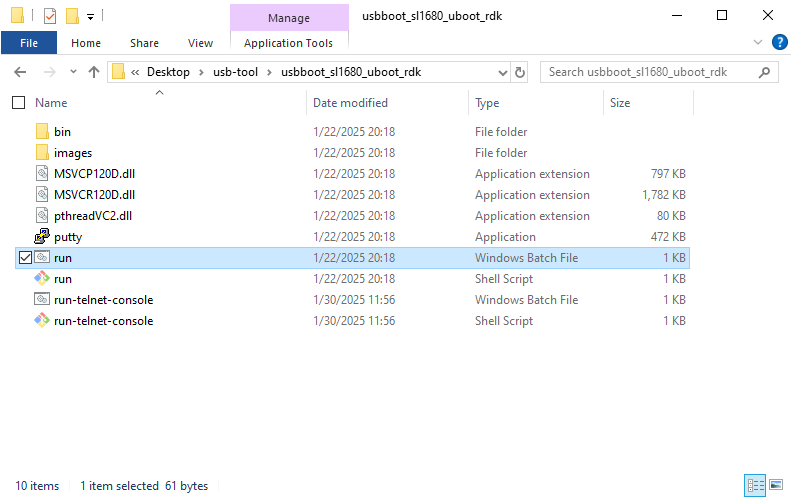
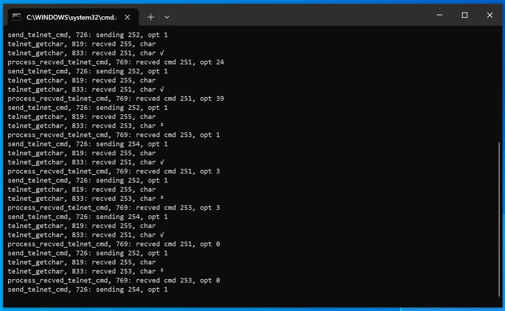
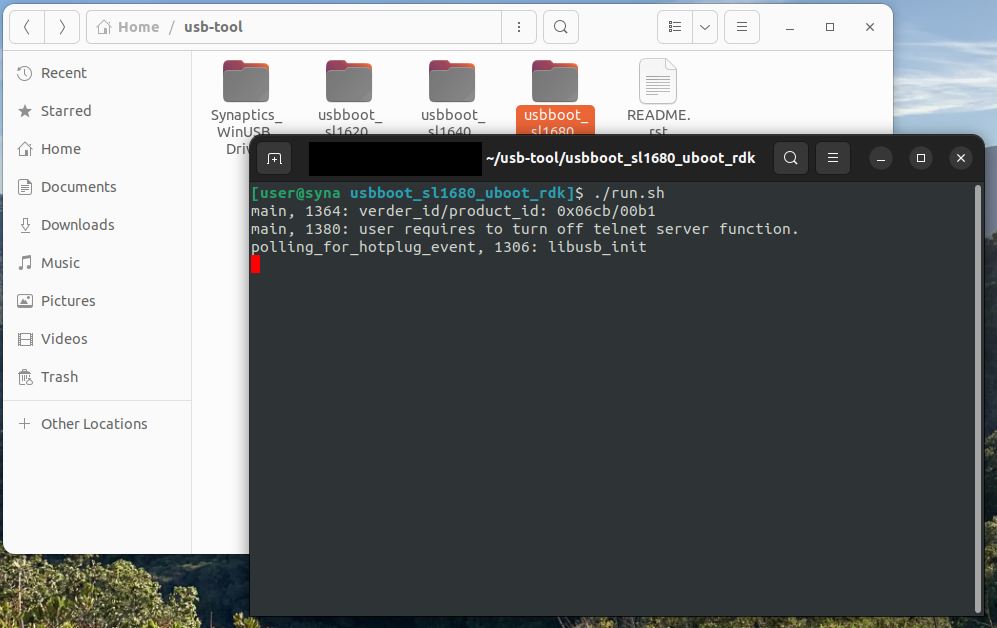
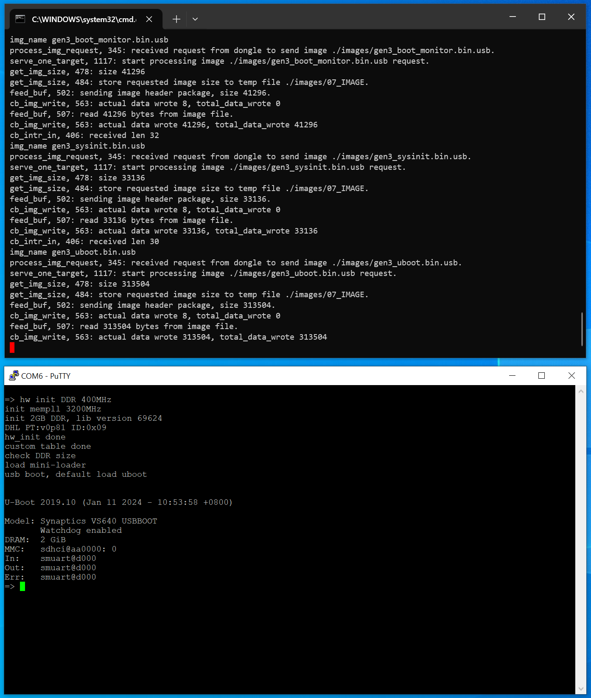
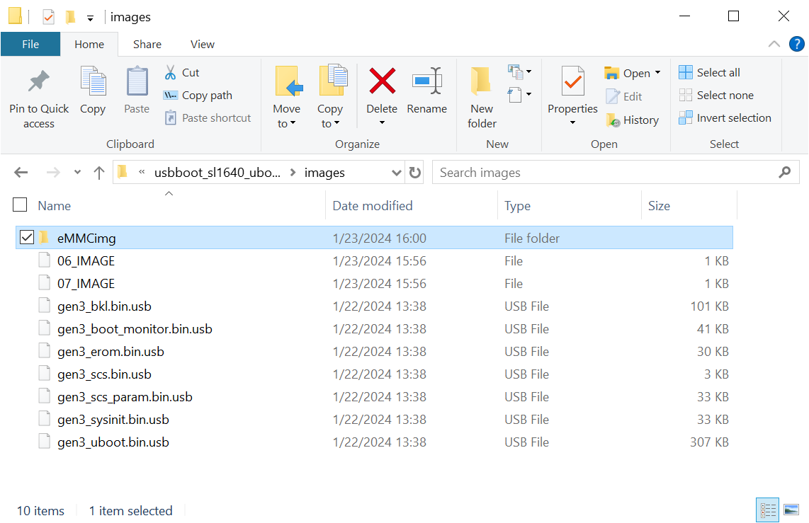
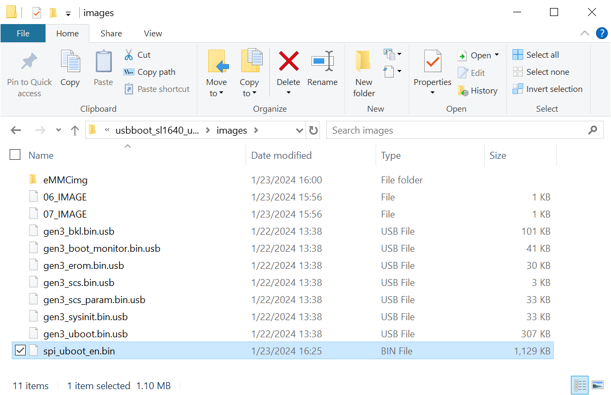

****************************
Astra Yocto Linux User Guide
****************************

Overview
========

This document describes the Synaptics Astra Linux OS environment and
Board Support Package (BSP). It provides information on the components
which make up the BSP and how to interface with them.

Supported Hardware
------------------

The following Reference Kits and platforms are covered by this guide:

-  Astra Machina (Foundation) SL1620

-  Astra Machina (Foundation) SL1640

-  Astra Machina (Foundation) SL1680

References
----------

-  `SyNAP User Guide <https://synaptics-synap.github.io/doc/v/3.0.0/>`__

Introduction
============

The Synaptics Linux Board Support Package (BSP) contains the software
and firmware required to operate Astra Machina. It contains the
components needed to boot OSes and interface with the hardware. This
guide provides a description of these software components and information
on how to interface with them. This document is useful for users who
want to evaluate Astra Machina and build products using these processors.

This document covers the components which are used by the Linux OS. For
instructions on setting up the build environment and creating a Yocto-based
image for Astra Machina, please see the :doc:`/yocto`.

Specific information about the Astra Machina hardware can be found on the :doc:`/hw/index` page.

Interfacing with Astra Machina
==============================

Several methods exist for interfacing with Astra Machina, including using a graphical desktop
on an external display. Additionally, Shell access is available through SSH, ADB, and the serial console.

The Graphical Desktop
---------------------

Astra Machina's graphical desktop is enabled be default. It can be displayed on an external display connected
to the HDMI port or a MIPI display. Input can be provided by connecting a standard HID USB keyboard and mouse. 

.. figure:: media/wayland-desktop.jpg

    The Wayland Desktop on Astra Machina

Clicking on the icon in the top left corner will open a terminal.

.. figure:: media/wayland-terminal.jpg

    The Wayland Desktop with a terminal open

.. note::

    HDMI is not currently supported on SL1620

The Shell with SSH
------------------

Astra Machina has ssh enabled by default. It will accept connections from ssh
clients over the network. Login with the username ``root``. No password is required::

    ssh root@10.10.10.100

.. note::

    In the examples above the Astra Machina's address is
    10.10.10.100. Please replace this IP with the IP address of your device.

The Shell with ADB
------------------

Astra Machina supports Android Debug Bridge (ADB) over USB. ADB is used on Android devices and has been
ported to Astra Machina. Google provides extensive documentation on ADB `here <https://developer.android.com/tools/adb>`__.

To use ADB connect a USB cable from the host system to the USB Type-C USB 2.0 port on Astra Machina (next to the ethernet port).

.. figure:: media/usb-c.png

    Astra Machina Component Diagram with USB Type-C USB 2.0 port highlighted

Google provides versions of ADB for Mac, Linux, and Windows. Once ADB is installed run ``adb devices`` to see all ADB devices
connected to the host. Then run::

    adb shell

Or if there is more then one ADB device::

    adb -s SL16x0 shell

.. figure:: media/powershell-adb.png

    Using ADB with Windows Powershell

The Serial Console
------------------

Astra Machina provides a serial console which displays bootloader
and OS messages to a terminal emulator running on the host system. These messages are
useful for determining the status of Astra Machina early in the boot process
or when a display is not connected. It can also provides useful information
during operation. The serial console is also needed during the firmware update process.

.. _setup_serial_console:

Setting up the Serial Console
^^^^^^^^^^^^^^^^^^^^^^^^^^^^^

The Astra Machina (Foundation) SL16xx Developer Kits come with a USB-TTL board and a flying-wire style cable.
Use the cable to connect the USB-TTL board to Astra Machina's 40 pin GPIO header.

=======    =============
USB TTL    Astra Machina
=======    =============
GND        6
RXD        8
TXD        10
=======    =============

.. figure:: media/usb-ttl-board.png

    USB TTL board provided in Developer Kit

.. figure:: media/board-ports.png

    Astra Machina with 40 GPIO Header labeled

.. figure:: media/40-pin-connector.png

    Astra Machina's 40 Pin GPIO Header pinout

Windows and Mac hosts will require an additional driver to interface with the
USB to UART chip on the USB-TTL board. Please download the appropriate driver for your
host from `Silicon Labs CP210x USB to UART Bridge VCP
Drivers <https://www.silabs.com/developers/usb-to-uart-bridge-vcp-drivers?tab=downloads>`__
page. Linux hosts generally have support for this chip enabled by
default.

Once the driver is installed the serial console can be
accessed using a terminal emulator program such as Putty, HyperTerminal,
Tera Term, Screen, or Minicom.

.. figure:: media/putty.png

    Putty terminal emulator on Windows

.. figure:: media/configure-minicom.png

    Minicon terminal emulator on Mac OS

.. _linux_login:

Linux OS Login
^^^^^^^^^^^^^^

After Linux successfully boots, a login prompt will be displayed in the
serial console. To login use the username ``root``. No password is required.

.. figure:: media/login-prompt.png

    Successful boot seen in Minicom

.. _multimedia:

Multimedia
==========

The Astra Machina contains hardware and software components which accelerate
the processing of multimedia workloads. The Linux BSP provides Gstreamer
plugins which allow users to develop programs which utilize these
multimedia components to improve multimedia performance. This section
provides an overview on how to use the Gstreamer command line interface
to build pipelines using these plugins. Information on the Gstreamer framework
can be found at https://gstreamer.freedesktop.org/.

Gstreamer Plugins
-----------------

Gstreamer uses plugin modules which are used to extend Gstreamer functionality.
The Astra Machina uses plugins to allow its hardware components to be used
in a Gstreamer pipeline. The tables below list plugins which are used by
the codecs supported by the Astra Machina.

Video Codes
^^^^^^^^^^^

========= ================= ================== ==================
Codec     Parser Plugin     Decoder Plugin     Encoder Plugin
========= ================= ================== ==================
H.264     h264parse         v4l2h264dec        v4l2h264enc
H.265     h265parse         v4l2h265dec        None
VP8       N/A               v4l2vp8dec         v4l2vp8enc
VP9       vp9parse          v4l2vp9dec         None
AV1       av1parse          v4l2av1dec         None
========= ================= ================== ==================

Audio Codecs
^^^^^^^^^^^^

========= ================= ================== ==================
Codec     Parser Plugin     Decoder Plugin     Encoder Plugin
========= ================= ================== ==================
AAC       aacparse          fdkaacdec          fdkaacenc
Vorbis    N/A               vorbisdec          vorbisenc
========= ================= ================== ==================

Gstreamer Examples
------------------

To run the following Gstreamer examples, please make sure to set the
following variables in your environment. These variables may need to be
set when running commands from the serial console or a remote shell::

    export XDG_RUNTIME_DIR=/var/run/user/0
    export WAYLAND_DISPLAY=wayland-1

The ``XDG_RUNTIME_DIR`` variable specifies the directory which contains the
Wayland socket belonging to the user. The ``WAYLAND_DISPLAY`` variable
specifies which Wayland compositor to connect to.

The following examples use the gst-launch-1.0 command line program to
construct a pipeline and begin playing it. The gst-launch-1.0 command
takes in a list of element types separated by exclamation points.
Elements can also contain optional properties. (see `GStreamer documentation <https://gstreamer.freedesktop.org/documentation/tutorials/basic/gstreamer-tools.html?gi-language=c>`__ for more details).
The examples below will show the structure of the command with a brief description.
Followed by one or more examples.

Media Playback
^^^^^^^^^^^^^^

.. _audio_sinks:

Audio Sinks
"""""""""""

The following examples use the ALSA audio sink to output audio using the ALSA
audio API (for more details refer to the `Gstreamer documentation <https://gstreamer.freedesktop.org/documentation/alsa/alsasink.html?gi-language=c#alsasink>`__ for more details).
The examples use the device hw:0,7 which corresponds to
the HDMI output device on SL1680. Hardware devices can be found in the file
/proc/asound/pcm. Below is an example of the pcm devices on SL1680.
Device 0-7 corresponds to the HDMI device and will be used in the
examples below.

Example /proc/asound/pcm output from SL1680::

    root@sl1680:~# cat /proc/asound/pcm
    00-00: soc-i2so1 snd-soc-dummy-dai-0 :  : playback 1
    00-01: soc-i2so3 snd-soc-dummy-dai-1 :  : playback 1
    00-02: soc-dmic snd-soc-dummy-dai-2 :  : capture 1
    00-03: soc-i2si2 snd-soc-dummy-dai-3 :  : capture 1
    00-04: btsco-in snd-soc-dummy-dai-4 :  : capture 1
    00-05: soc-i2s-pri-lpbk snd-soc-dummy-dai-5 :  : capture 1
    00-06: soc-i2s-hdmi-lpbk snd-soc-dummy-dai-6 :  : capture 1
    00-07: soc-hdmio snd-soc-dummy-dai-7 :  : playback 1

Video Sinks
"""""""""""

The following examples use the Wayland video sink to create a window and
render the decoded frames (see `GStreamer documentation <https://gstreamer.freedesktop.org/documentation/waylandsink/index.html?gi-language=c#waylandsink>`__ for more details)

Audio Playback
^^^^^^^^^^^^^^

Playing audio files involves reading and parsing the encoded audio data,
decoding the data, and outputting it to the audio sink. Some data
formats and audio sinks may also need to convert and resample the data
before sending it to the audio sink::

    gst-launch-1.0 filesrc location=audio_file ! parser ! decoder ! [ convert ] ! [ resample ] ! audiosink

This example plays an MP3 file using the speakers of the attached HDMI
device::

    gst-launch-1.0 filesrc location=audio_file.mp3 ! mpegaudioparse ! mpg123audiodec ! audioconvert ! audioresample ! alsasink device=hw:0,7

Video Playback
^^^^^^^^^^^^^^

Playing a video file involves reading the file, demuxing a video stream,
parsing the encoded data, and decoding the data using the video decoder.
Finally, the decoded frames our output to the video sink::

    gst-launch-1.0 filesrc location=video_file ! demux ! queue ! parser ! decoder ! videosink

The following example plays the main video stream of an MP4 file and
displays the video using Wayland. In this example the video is encoded
with H265::

    gst-launch-1.0 filesrc location=test_file.mp4 ! qtdemux name=demux demux.video_0 ! queue ! h265parse ! v4l2h265dec ! waylandsink fullscreen=true

A similar example, but with a file using AV1 encoding::

    gst-launch-1.0 filesrc location=test_file.mp4 ! qtdemux name=demux demux.video_0 ! queue ! av1parse ! v4l2av1dec ! waylandsink fullscreen=true

Audio / Video File Playback
^^^^^^^^^^^^^^^^^^^^^^^^^^^

Playing a file which contains both audio and video streams requires
creating a pipeline which parses and decodes both streams::

    gst-launch-1.0 filesrc location=test_file.mp4 ! qtdemux name=demux demux.video_0 ! queue ! av1parse ! v4l2av1dec ! waylandsink fullscreen=true

Play an MP4 file with a H265 encoded video stream and an AAC encoded
audio stream::

    gst-launch-1.0 filesrc location=test_file.mp4  ! qtdemux name=demux \
        demux.video_0 ! queue ! h265parse ! v4l2h265dec ! queue ! waylandsink fullscreen=true \
        demux.audio_0 ! queue ! aacparse ! fdkaacdec ! audioconvert ! alsasink device=hw:0,7

Recording
^^^^^^^^^

Audio Recording
"""""""""""""""

Recording audio involves reading data from a capture device like a
microphone, converting, encoding, and multiplexing the data before
writing it to an output file::

    gst-launch-1.0 -v alsasrc device=device ! queue ! convert ! encode ! mux ! filesink location=output file

The following example records audio from the ALSA capture device 0,2. It
then converts the raw data into a format which can encoded into the Vorbis
codec by the encoder. Once the data is encoded, it is then multiplexed into an Ogg
container and written to the file /tmp/alsasrc.ogg::

    gst-launch-1.0 -v alsasrc device=hw:0,2 ! queue ! audioconvert ! vorbisenc ! oggmux ! filesink location=/tmp/alsasrc.ogg

Camera
^^^^^^

Astra Machina supports USB (UVC) cameras with the V4L2 driver stack.
This stack can be used with Gstreamer to construct pipelines using a
camera.

To display video captured from a camera to output it to the video sink::

    gst-launch-1.0 v4l2src device=/dev/videoX ! "video data,framerate,format,width,height" ! video sink

The following example reads captured data from the V4L2 device
/dev/video2 and applies the capabilities filter before sending the
output to the wayland sink::

    gst-launch-1.0 v4l2src device=/dev/video2 ! "video/x-raw,framerate=30/1,format=YUY2,width=640,height=480" ! waylandsink fullscreen=true

Gstreamer Playbin Plugin
^^^^^^^^^^^^^^^^^^^^^^^^

Astra Machina contains the Gstreamer playbin plugin. This plugin can
automatically determine what type of pipeline to construct based on
automatic file type recognition (see `Gstreamer documentation <https://gstreamer.freedesktop.org/documentation/playback/playbin.html?gi-language=c>`__). This simplifies pipeline creation.

Playbin will autodetect the media file located at the specified uri, and create a
pipeline for it. It will then display the video on the video sink and
render the audio on the audio sink. The video-sink and audio-sink
parameters are optional. If the parameters are not included, default video and
audio sinks will be used instead::

    gst-launch-1.0 playbin uri=file:///path/to/file video-sink="video sink" audio-sink="audio sink"

Using playbin the example in :ref:`audio_sinks` can be reduced to::

    gst-launch-1.0 playbin uri=file:///path/to/file video-sink="waylandsink fullscreen=true" audio-sink="alsasink device=hw:0,7"

GStreamer SyNAP Plugin
^^^^^^^^^^^^^^^^^^^^^^

Astra Machina provides a Gstreamer plugin which allows adding ML processing to Gstreamer pipelines.
This plugin uses the SyNAP framework to interface with the hardware accelerators to improve the performance
of ML processing. For information on SyNAP see :ref:`synap` below.

The SyNAP plugin works as a Gstreamer appsrc and appsink. It takes samples from the pipeline and uses the SyNAP
framework to perform classification or detection on the frame using a neural network. It then outputs the results
as JSON formatted data.

We provide a `sample application <https://github.com/synaptics-astra/application-gstreamer-plugins-syna/tree/v#release#/examples/gst-ai>`__
which plays a video while simultaneously performing image classification on the video frames, and then overlaying labels of the
results onto the video. A prebuilt version of the application is included in the Astra system image.

Run the example application using the following command::

    gst-ai --appmode=IC --input=test_file.mp4 --output=screen --paramfile=/usr/share/gst-ai/ic.json

.. _synap:

Machine Learning with SyNAP
===========================

Astra Machina uses the SyNAP framework for execution of neural networks using the platform's hardware accelerators.
This framework allows users to run programs which take advantage of the Neural Processing Unit (NPU)
and Graphics Processing Unit (GPU) to accelerate the execution of neural networks. (see the `SyNAP documentation <https://synaptics-synap.github.io/doc/v/3.0.0/>`__ for more details.)

Connectivity
============

Bluetooth and Wi-Fi are supported on Astra Machina through on-board chip
solutions and external hardware. The following table lists the various
on-board chips and external solutions:

============ =============== ===================== ========================================================
SL Processor Wireless Device Physical Interface    Software Information
                                                  
                             (M.2 PCIe / M.2 SDIO)
============ =============== ===================== ========================================================
SL1620       SYNA 43456      M.2 SDIO              - wpa_supplicant v3.0 enterprise (excluding 192bit mode)
                                                  
                                                   - WIFI driver version:
SL1620       SYNA 43711      M.2 SDIO              - wpa_supplicant v3.0 enterprise (excluding 192bit mode)
                                                  
                                                   - WIFI driver version:
SL1640       SYNA 43752      M.2 PCIe              - wpa_supplicant v2.10
                                                  
                                                   - WIFI driver version: v101.10.478
SL1640       SYNA 43756E     M.2 PCIe             
SL1680       SYNA 43752      M.2 PCIe             
SL1680       SYNA 43756E     M.2 PCIe             
============ =============== ===================== ========================================================

The Synaptics Astra Linux BSP contains all of the drivers and firmware required to use the 43xxx modules with both PCIe and SDIO interfaces.
Wireless network management is handled by the WPA Supplicant daemon which key negotiation with a WPA Authenticator. It supports WEP, WPA, WPA2, and WPA3
authentication standards. ( See `wpa_supplicant <https://wiki.archlinux.org/title/wpa_supplicant>`__ for more details)

Setting up Wifi with WPA Supplicant
------------------------------------
The following section describes how to setup Wifi on Astra Machina using WPA Supplicant.

Generate the WPA Pre-shared Key
^^^^^^^^^^^^^^^^^^^^^^^^^^^^^^^
Generating a pre-shared key from a passphrase avoids having to store the passphrase in the WPA Supplicant config file.

From the shell, use the wpa_passphrase command line tool to generate a WPA pre-shared key from a passphrase::

    root@sl1680:^# wpa_passphrase network_name 12345678
    network={
        ssid="network_name"
        psk=5ba83b0673ea069dafe5d5f1af8216771c13be6ad6f11dac9dc0e90b0c604981
    }

Bringing up the WLAN Interface
^^^^^^^^^^^^^^^^^^^^^^^^^^^^^^

Use ifconfig to instruct the kernel to bring up the wlan interface::

    ifconfig wlan0 up

Creating the WPA Supplicant Configuration File
^^^^^^^^^^^^^^^^^^^^^^^^^^^^^^^^^^^^^^^^^^^^^^

WPA Supplicant uses a config file to configure the Wifi connection. This configuration file is located in /etc/wpa_supplicant.

Create the /etc/wpa_supplicant directory::

    mkdir -p /etc/wpa_supplicant

Create the file /etc/wpa_supplicant/wpa_supplicant-wlan0.conf with options for your Wifi Network.

Contents of an example wpa_supplicant-wlan0.conf::

    ctrl_interface=/var/run/wpa_supplicant
    ctrl_interface_group=0
    update_config=1

    network={
        ssid="network_name"
        psk=5ba83b0673ea069dafe5d5f1af8216771c13be6ad6f11dac9dc0e90b0c604981
        key_mgmt=WPA-PSK
        scan_ssid=1
    }

Configure systemd-networkd
^^^^^^^^^^^^^^^^^^^^^^^^^^

The wlan interface needs to be enabled in the systemd-networkd system daemon configuration.

Create the new file /etc/systemd/network/25-wlan.network with the following contents::
 
    [Match]
    Name=wlan0

    [Network]
    DHCP=ipv4

Enable Wifi Services
^^^^^^^^^^^^^^^^^^^^
The network daemons need to be restarted to load the new configuration.

Restart network daemons::

    systemctl restart systemd-networkd.service
    systemctl restart wpa_supplicant@wlan0.service

Enable wpa_supplicant on boot up::

    systemctl enable wpa_supplicant@wlan0.service

Performing throughput tests
---------------------------

The following section describes how to run throughput tests using iPerf commands in TCP and UDP modes.

TCP traffic
^^^^^^^^^^^

Client Side::

    $ iperf -c <IP address of iperf server> -i 1 -w 12M -t 60 -l 1470

Server side::

    $ iperf -s -i 1 -w 12M -l 1470

UDP traffic
^^^^^^^^^^^

Client side::

    $ iperf -c <IP address of iperf server> -i 1 -w 12M -u -b 1000M -t 60 -l 1470

Server side::

    $ iperf -s -i 1 -w 12M -l 1470

Using the Bluetooth A2DP source role
------------------------------------

Searching and connecting to the headset
^^^^^^^^^^^^^^^^^^^^^^^^^^^^^^^^^^^^^^^
First you need to enter the Bluetooth console using the following command::

    root@sl1640:~# bluetoothctl
    [bluetooth]#

Once in the Bluetooth console you can run various commands to control the Bluetooth stack described in the following
paragraphs.

You can show information about the Bluetooth controller on the board with the ``show`` command::

    [bluetooth]# show
    Controller C0:F5:35:AA:7D:8F (public)
            Name: sl1640
            Alias: sl1640
            Class: 0x00000000
            Powered: no
            Discoverable: no
            DiscoverableTimeout: 0x000000b4
            Pairable: yes
            UUID: Audio Source              (0000110a-0000-1000-8000-00805f9b34fb)
            UUID: Generic Attribute Profile (00001801-0000-1000-8000-00805f9b34fb)
            UUID: Generic Access Profile    (00001800-0000-1000-8000-00805f9b34fb)
            UUID: PnP Information           (00001200-0000-1000-8000-00805f9b34fb)
            UUID: A/V Remote Control Target (0000110c-0000-1000-8000-00805f9b34fb)
            UUID: A/V Remote Control        (0000110e-0000-1000-8000-00805f9b34fb)
            UUID: Device Information        (0000180a-0000-1000-8000-00805f9b34fb)
            Modalias: usb:v1D6Bp0246d0541
            Discovering: no
            Roles: central
            Roles: peripheral
    Advertising Features:
            ActiveInstances: 0x00 (0)
            SupportedInstances: 0x06 (6)
            SupportedIncludes: tx-power
            SupportedIncludes: appearance
            SupportedIncludes: local-name
            SupportedSecondaryChannels: 1M
            SupportedSecondaryChannels: 2M
            SupportedSecondaryChannels: Coded

In order to connect to the headset you first need to power on the bluetooth controller::

    [bluetooth]# power on
    [CHG] Controller C0:F5:35:AA:7D:8F Class: 0x00080000
    Changing power on succeeded
    [CHG] Controller C0:F5:35:AA:7D:8F Powered: yes

You then need to set the controller in pairable mode::

    [bluetooth]# pairable on
    Changing pairable on succeeded

You can then search for the headset (make sure the headset is in discoverable mode)::

    [bluetooth]# scan on
    Discovery started
    [CHG] Controller C0:F5:35:AA:7D:8F Discovering: yes
    [NEW] Device 2D:9A:A9:4F:54:37 2D-9A-A9-4F-54-37
    [NEW] Device 4E:E7:B0:20:2A:11 4E-E7-B0-20-2A-11
    [NEW] Device 7F:84:A3:29:E9:E9 7F-84-A3-29-E9-E9
    [NEW] Device 6A:B0:95:7E:58:79 6A-B0-95-7E-58-79
    [NEW] Device 7E:4D:8F:C4:3B:6F 7E-4D-8F-C4-3B-6F
    [NEW] Device 40:93:CE:4D:F1:8E 40-93-CE-4D-F1-8E
    [NEW] Device 47:14:71:A3:79:A9 47-14-71-A3-79-A9
    [NEW] Device 67:62:9C:4B:F9:7D 67-62-9C-4B-F9-7D
    [NEW] Device 8C:F8:C5:BD:6F:1D DTKBTQ3
    [NEW] Device 0A:73:76:09:55:C0 BT208

This command returns the MAC address of all the devices that are currently discoverable. You need to identify the one
of the headset you want to pair.

Once you found the headset you can pair to it by using the ``pair`` command with the MAC address of the headset::

    [bluetooth]# pair 0A:73:76:09:55:C0
    Attempting to pair with 0A:73:76:09:55:C0
    [CHG] Device 0A:73:76:09:55:C0 Connected: yes
    [CHG] Device 0A:73:76:09:55:C0 Bonded: yes
    [CHG] Device 0A:73:76:09:55:C0 UUIDs: 00001108-0000-1000-8000-00805f9b34fb
    [CHG] Device 0A:73:76:09:55:C0 UUIDs: 0000110b-0000-1000-8000-00805f9b34fb
    [CHG] Device 0A:73:76:09:55:C0 UUIDs: 0000110c-0000-1000-8000-00805f9b34fb
    [CHG] Device 0A:73:76:09:55:C0 UUIDs: 0000110e-0000-1000-8000-00805f9b34fb
    [CHG] Device 0A:73:76:09:55:C0 UUIDs: 0000111e-0000-1000-8000-00805f9b34fb
    [CHG] Device 0A:73:76:09:55:C0 ServicesResolved: yes
    [CHG] Device 0A:73:76:09:55:C0 Paired: yes
    Pairing successful
    [CHG] Device 0A:73:76:09:55:C0 ServicesResolved: no
    [CHG] Device 0A:73:76:09:55:C0 Connected: no

The next step is to mark the device as trusted::

    [bluetooth]# trust 0A:73:76:09:55:C0
    [CHG] Device 0A:73:76:09:55:C0 Trusted: yes
    Changing 0A:73:76:09:55:C0 trust succeeded

The last step is to setup the connection with the headset::

    [bluetooth]# connect 0A:73:76:09:55:C0
    Attempting to connect to 0A:73:76:09:55:C0
    [CHG] Device 0A:73:76:09:55:C0 Connected: yes
    [NEW] Endpoint /org/bluez/hci0/dev_0A_73_76_09_55_C0/sep1
    [NEW] Transport /org/bluez/hci0/dev_0A_73_76_09_55_C0/sep1/fd0
    Connection successful
    [BT208]# [  286.922414] input: BT208 (AVRCP) as /devices/virtual/input/input1
    [CHG] Transport /org/bluez/hci0/dev_0A_73_76_09_55_C0/sep1/fd0 Volume: 0x0060 (96)
    [DEL] Device D4:D2:D6:4F:80:60 445HD_BT_60
    [CHG] Device 0A:73:76:09:55:C0 ServicesResolved: ye
    [BT208]#

If we connection was successful the console prompt will show the name of device we connected to.

We can now get the information about the device::

    [BT208]# info
    Device 0A:73:76:09:55:C0 (public)
            Name: BT208
            Alias: BT208
            Class: 0x00240404
            Icon: audio-headset
            Paired: yes
            Bonded: yes
            Trusted: yes
            Blocked: no
            Connected: yes
            LegacyPairing: no
            UUID: Headset                   (00001108-0000-1000-8000-00805f9b34fb)
            UUID: Audio Sink                (0000110b-0000-1000-8000-00805f9b34fb)
            UUID: A/V Remote Control Target (0000110c-0000-1000-8000-00805f9b34fb)
            UUID: A/V Remote Control        (0000110e-0000-1000-8000-00805f9b34fb)
            UUID: Handsfree                 (0000111e-0000-1000-8000-00805f9b34fb)
            RSSI: -69
            TxPower: 4

Playing music to the headset
^^^^^^^^^^^^^^^^^^^^^^^^^^^^

In order to test playback you need to upload a sound file (in ``.wav`` format)  to the board for instance using ``scp``.

The file can be played to the A2DP sink using the ``aplay`` command. The takes as parameter the MAC address of the
headeset (in the example below ``0A:73:76:09:55:C0``) and the name of wave file (in the example below
``/home/root/example.wav``)::

    root@sl1640:~# aplay --verbose -D  bluealsa:DEV=0A:73:76:09:55:C0 -t wav /home/root/example.wav
    Playing WAVE '/home/root/example.wav' : Signed 16 bit Little Endian, Rate 48000 Hz, Stereo
    Plug PCM: BlueALSA PCM: /org/bluealsa/hci0/dev_0A_73_76_09_55_C0/a2dpsrc/sink
    BlueALSA BlueZ device: /org/bluez/hci0/dev_0A_73_76_09_55_C0
    BlueALSA Bluetooth codec: SBC
    Its setup is:
      stream       : PLAYBACK
      access       : RW_INTERLEAVED
      format       : S16_LE
      subformat    : STD
      channels     : 2
      rate         : 48000
      exact rate   : 48000 (48000/1)
      msbits       : 16
      buffer_size  : 24000
      period_size  : 6000
      period_time  : 125000
      tstamp_mode  : NONE
      tstamp_type  : GETTIMEOFDAY
      period_step  : 1
      avail_min    : 6000
      period_event : 0
      start_threshold  : 24000
      stop_threshold   : 24000
      silence_threshold: 0
      silence_size : 0
      boundary     : 6755399441055744000

The Linux Boot Process
======================

Before the Linux Kernel begins executing on Astra Machina, low level
firmware and software initializes the hardware and prepares the system for boot.
This section provides an overview of the software components which prepare the
system for booting the Linux Kernel.

Software Overview
-----------------

Astra Machina uses a multistage boot process. This
section gives a brief description of each component.

Preboot Firmware
^^^^^^^^^^^^^^^^

The Preboot firmware is a collection of low level firmware which
initializes specific hardware components and loads the software which
runs in the Arm TrustZone environment. Once the Preboot firmware
completes, execution will be transferred to the bootloader. The Preboot
firmware is provided as binary images which are written to the boot
device.

.. _bootloader_overview:

Bootloader
^^^^^^^^^^

Astra Machina uses the Synaptics U-Boot (SUBoot) bootloader to do additional
hardware initialization and to boot the Linux Kernel. SUBoot is based on the
open source U-Boot project. (`U-Boot Documentation <https://docs.u-boot.org/en/latest/>`__)

Linux Kernel and Device Tree
^^^^^^^^^^^^^^^^^^^^^^^^^^^^

Astra Machina primarily run OSes which use the Linux
Kernel. The Linux Kernel provides the environment in which applications
run and it manages resources such as CPU, memory, and devices.
Generally, the Linux Kernel will be built as part of the Yocto build
process described in the Astra Yocto User Guide.

The Linux Kernel uses Device Tree data structures to describe the
hardware components and their configurations on the system. The device
tree source files are in the Linux Kernel source tree under that path
``arch/arm64/boot/dts/synaptics/``. These files are maintained in the `Astra Linux Kernel Overlay repository <https://github.com/synaptics-astra/linux_5_15-overlay>`__

Root File System
^^^^^^^^^^^^^^^^

The root file system (rootfs) contains all the user space binaries and
libraries needed to execute programs in the Linux OS along with system
configuration files. The prebuilt images use Yocto to build the rootfs.
Instructions on how to build and configure a rootfs using Yocto can be
found in the :doc:`/yocto`.

U-Boot
------

As mentioned above, Astra Machina uses U-Boot as its bootloader. There
are three types of U-Boot which are used with Astra Machina. In addition
to SUBoot, there are SPI U-Boot and USB U-Boot variants which are used to
flash or recover a device.

========== ==========================================================
image type image usage
========== ==========================================================
SPI U-Boot burn eMMC image via TFTP server or USB host
USB U-Boot burn eMMC image via TFTP server of USB disk
SUBoot     burn eMMC image via TFTP server or USB disk, Booting Linux
========== ==========================================================

USB U-Boot and SPI U-Boot are used to boot a device which does not have
an image written to the eMMC or to do a update which overwrites all of
the contents of the eMMC.

USB U-Boot allows the board to receive a copy of the USB version of
U-Boot over the USB interface. The host system runs the usb_boot tool
to transfer the USB U-Boot image to the board and execute it. Once USB U-Boot
is running on the board it can be used to write an image to the eMMC.

SPI U-Boot is similar to USB U-Boot except that U-Boot runs from
SPI flash. The SPI flash may be located on the main board of Astra Machina or
it may be a located on a SPI daughter card which is plugged into the device.
Once SPI U-Boot is running on the board it can be used to write an image to the eMMC.

.. _spi_sd_boot:

Booting from SPI and SD Cards
-----------------------------

Astra Machina's I/O board has a jumper labeled ``SD-Boot``. This jumper controls
whether the device boots from the eMMC or the internal SPI flash. If the jumper
is attached then the device will boot from the internal SPI flash. Remove the jumper
to boot from eMMC.

.. figure:: media/sd-boot-jumper.png

    Astra Machina Component Diagram with SD-Boot jumper highlighted

Astra Machina's internal SPI flash comes preprogrammed with SPI U-Boot. When the
SD-Boot jumper is connected the device will either boot from SPI flash or from an
SD Card if one is inserted in the SD Card slot.

.. _prepare_to_boot:

Updating the Firmware
=====================

On power on, Astra Machina will read the firmware, bootloader, and the
Linux Kernel from a boot device. The most common boot device is an eMMC
device on the board. This section will discuss how to write a boot image
to the eMMC.

The Astra System Image
----------------------

.. figure:: media/astra_image.png

    A screenshot of the Astra image

The "Astra System Image" is a directory containing several subimg
files and emmc_part_list, emmc_image_list, and emmc_image_list_full. The
emmc_part_list describes the GUID Partition Table (GPT) which will be
used for the eMMC. The emmc_image_list\* files specify which sub image
files should be written to which partition on the eMMC.

Example SL1640 Partition Table:

================== =================================================================== ================== ===========================
Partition name     Contents                                                            Can be removed     Accessed by
================== =================================================================== ================== ===========================
factory_setting    MAC address and other factory provisioned files, used by user space No                 Linux user space
key_a              AVB keys, user keys (A copy)                                        Yes                Early boot (boot partition)
tzk_a              TrustZone Kernel (A copy)                                           Yes                Early boot (boot partition)
key_b              AVB keys, user keys (B copy)                                        Yes                Early boot (boot partition)
tzk_b              TrustZone Kernel (B copy)                                           Yes                Early boot (boot partition)
bl_a               OEM Boot loader (A copy)                                            Yes                Early boot (boot partition)
bl_b               OEM Boot loader (B copy)                                            Yes                Early boot (boot partition)
boot_a             Linux Kernel, loaded by OEM bootloader (A copy)                     No                 OEM boot loader (bl_a)
boot_b             Linux Kernel, loaded by OEM bootloader (B copy)                     No                 OEM boot loader (bl_b)
firmware_a         GPU / DSP / SM firmwares, loaded by early boot, required (A copy)   Yes                Early boot (boot partition)
firmware_b         GPU / DSP / SM firmwares, loaded by early boot, required (B copy)   Yes                Early boot (boot partition)
rootfs_a           Root file system, used by Linux, can be changed (A copy)            No                 Linux (boot_a)
rootfs_b           Root file system, used by Linux, can be changed (B copy)            No                 Linux (boot_b)
fastlogo_a         Fast logo image, loaded by OEM bootloader, can be changed (A copy)  No                 OEM bootloader (bl_a)
fastlogo_b         Fast logo image, loaded by OEM bootloader, can be changed (B copy)  No                 OEM bootloader (bl_b)
devinfo            Device information (such as serial number, mac address ) required   Yes                Early boot (boot partition)
misc               Boot control settings, required                                     Yes                Early boot (boot partition)
home               Mounted in /home, can be customized                                 No                 Linux user space
================== =================================================================== ================== ===========================

Updating the Firmware using USB
-------------------------------

Astra Machina supports updating firmware using USB. 

.. _usb_boot_setup:

Setting up the USB Boot Environment
^^^^^^^^^^^^^^^^^^^^^^^^^^^^^^^^^^^

Booting from USB requires the usb_boot software tool to be the installed on
a host system. Windows, Mac, and Linux hosts are supported. Windows systems
also require the Synaptics WinUSB Driver. Mac and Linux systems do not require
any additional drivers. USB Boot also requires setting up the serial console
as described in the :ref:`setup_serial_console` section above. This section
covers how to configure the host system and prepare for USB booting.

Hardware Setup
""""""""""""""

To run usb_boot you will need to connect the USB-TTL board and cable to Astra
Machina as described in the :ref:`setup_serial_console` section above.
This will allow you to see console messages during the flashing process and input
commands to the bootloader. You will also need to connect a USB cable from the host
system to the USB Type-C USB 2.0 port on Astra Machina (next to the ethernet port).

.. figure:: media/usb-c.png

    Astra Machina Component Diagram with USB Type-C USB 2.0 port highlighted

Installing the WinUSB Driver (Windows Only)
"""""""""""""""""""""""""""""""""""""""""""

Windows requires a special USB kernel driver to communicate with
Astra Machina over USB. Please download the driver from
`GitHub <https://github.com/synaptics-astra/usb-tool>`__. Linux and Mac hosts
can access the Astra board from user space and do not need any additional
kernel drivers.

After downloading and decompressing the USB Boot software package, right
click on the ``SYNA_WinUSB.inf`` file in the ``Synaptics_WinUSB_Driver``
directory. Select "Install" from the drop down menu.

.. figure:: media/install_driver_win.png

    Install the driver

After installing the driver, the Astra Machina will show up in
the Windows Device Manager as the "Synaptics IoT: Tools package USB
Driver for Synaptics Processors" when operating in USB Boot mode.

.. figure:: media/devices_win.png

    Devices listed by the operating system after installing the driver

Running the USB Boot Tool
"""""""""""""""""""""""""

Also included in the Synaptics usb-tool package is the usb_boot user space
tool. This is the tool which communicates with Astra Machina over USB.
Each Astra Machina variant will have its own usb_boot directory. Included in each
directory will be a ``usb_boot`` binary and the ``run`` script used to run it.
The directory will also contain an images directory which contains all of the
image files needed to boot the board over USB. This include images which contain
the USB U-Boot bootloader. 
 
On Windows, double click on the run.bat file to launch the tool. This
script will execute the binary using the specific options required for
Astra Machina variant being used.

    Directory containing the USBBoot tool on Windows

After running the ``run.bat`` a window will open showing the status of the flash process.

    Output of the usb_boot tool on Windows

On Mac, right click on the directory which contains the version of usb_boot which matches
the Astra Machina variant which you are about to boot. From the drop down select ``Services -> New Terminal at Folder``.

.. figure:: media/mac-open-terminal.jpg

    Opening a Terminal for USB Boot on Mac

This will open a terminal inside of the selected usb_boot directory. From there run the ``run.sh`` script to
run the tool. You may be prompted for your password since the script internally calls sudo. The tool
requires additional permissions to interface with USB devices and access system resources.

.. figure:: media/mac-run-usbboot.png

    Output of the usb_boot tool on Mac

On Linux, right click on the directory which contains the version of usb_boot which matches
the Astra Machina variant which you are about to boot. From the drop down select  ``Open in Terminal``.

.. figure:: media/linux-open-terminal.png

    Opening a Terminal for USB Boot on Linux

This will open a terminal inside of the selected usb_boot directory. From there run the ``run.sh`` script to
run the tool. You may be prompted for your password since the script internally calls sudo. The tool
requires additional permissions to interface with USB devices and access system resources.

    Output of the usb_boot tool on Linux

Booting using USB Boot
"""""""""""""""""""""""

Once the usb_boot environment has been setup and the usb_boot tool is
running on the host system, Astra Machina will need to be placed into USB
Boot mode. To do that press and hold the "USB_BOOT" button on the
I/O board. Then press and release the "RESET" button. Be sure to hold
the "USB_BOOT" button long enough so that the board can reset and detect
that the "USB_BOOT" button is pressed. After booting into USB Boot mode the U-Boot
prompt "=>" will be displayed in the serial console.

.. figure:: media/usb-boot-and-reset.png

    Astra Machina Component Diagram with USB_BOOT and RESET buttons highlighted

    Output of the usb_boot tool and the serial console after successful boot

.. figure:: media/putty-usb-boot.png

    Serial Console after booting using USB Boot

.. note::

    Astra Machina will not show up in the Window's Device Manager or be seen by the tool until putting the
    device into USB Boot Mode. Hold down the USB_BOOT and press the RESET button as described above.

Flashing Firmware to eMMC using USB Boot
""""""""""""""""""""""""""""""""""""""""

    Directory with files used to flash the eMMC image

When booting from USB, the usb_boot tool allows transferring
the eMMC image directly over the USB interface. To flash the eMMC image via USB, copy the image files
to the 'images' folder in your Astra Machina variant's usb_boot tool directory.

Write the image to the eMMC using the command::

    => l2emmc eMMCimg

The parameter eMMCimg is the name of the image directory under the usb_boot
tool's images directory.

Resetting
---------

Astra Machina will boot into linux if a valid image has been written to the eMMC
when the board is powered on. After writing an image to the eMMC, issue the reset
command in U-Boot. Press the "RESET" button on the board, or power cycle the board
to boot into Linux.

U-Boot reset command::

    => reset

.. note::

    Make sure that the ``SD-Boot`` jumper is not attached when booting from eMMC. Otherwise,
    the device will boot from internal SPI flash or an SD Card. See :ref:`spi_sd_boot`.

Updating the Firmware from SPI
------------------------------

As described in :ref:`spi_sd_boot`, Astra Machina has an internal SPI flash chip which contains
the SPI U-Boot bootloader. This allows doing firmware updates without using a USB host system.
Images can be loaded using an external USB drive or downloaded from a TFTP server on a local network.

Setting up the SPI Boot Environment
^^^^^^^^^^^^^^^^^^^^^^^^^^^^^^^^^^^

Booting from the internal SPI flash does not require any additional software on the host
besides the software for using the serial console as described in the :ref:`setup_serial_console` section above.

Hardware Setup
""""""""""""""
For SPI boot, you will need to connect the USB cable for the
serial port as described in the :ref:`setup_serial_console` section above.
This will allow you to see console messages during the flashing process and input commands to the SPI U-Boot
bootloader. You will also need a USB drive or Ethernet cable depending on where the eMMC image files are located.
The USB drive can be inserted into any of the 4 USB Type-A USB 3.0 ports or the USB Type-C USB 2.0 port (may require
USB Type-C to USB Type-A adaptor).

.. figure:: media/usb-and-ethernet-ports.png

    Astra Machina Component Diagram with USB and Ethernet ports highlighted

.. _flashing_from_usb_drive:

Flashing Images from a USB Drive
^^^^^^^^^^^^^^^^^^^^^^^^^^^^^^^^

To flash an Astra system image from an external USB drive simply copy the image
directory to the USB drive. The USB drive will need a partition with a 
Fat32 formatted file system and enough capacity to fit the Astra system image.

Write the image to eMMC using the command::

    => usb2emmc eMMCimg

The parameter eMMCimg is the name of the image directory on the USB drive.

Flashing Images from a TFTP Server
^^^^^^^^^^^^^^^^^^^^^^^^^^^^^^^^^^

To flash an Astra system image from a TFTP server you will first need to
connect Astra Machina to a local network using the ethernet port. Copy the
Astra image to the TFTP server so that it can be accessed by the device
over the network. Once the device is connected to the network, boot to
the U-Boot prompt.

Initialize networking and request an IP address from a DHCP server on the local network::

    => net_init; dhcp; setenv serverip 10.10.10.10;
    
Write the image to eMMC from the TFTP server using the command::

    => tftp2emmc eMMCimg

The parameter eMMCimg is the name of the image directory on the TFTP server.

.. note::

    In the examples above the TFTP server's address is
    10.10.10.10. Please replace this IP with the IP address of the server
    hosting TFTP.

Updating Internal SPI Flash Firmware
------------------------------------

The internal SPI flash on Astra Machina can also be updated using the methods described above.

Flashing Image from USB Boot
^^^^^^^^^^^^^^^^^^^^^^^^^^^^

To update the internal SPI flash firmware using usb_boot you must first follow the steps in section :ref:`usb_boot_setup`.

    Directory with files used to flash the SPI flash

Once Astra Machina has booted U-Boot from USB, program the SPI flash by copying the SPI image
file to the "images" directory in the usb_boot tool's directory.

Then write the image to the SPI flash using the commands::

    => usbload spi_uboot_en.bin 0x10000000
    => spinit; erase f0000000 f02fffff; cp.b 0x10000000 0xf0000000 0x300000;

Flashing Image from an External USB Drive
^^^^^^^^^^^^^^^^^^^^^^^^^^^^^^^^^^^^^^^^^

To update the internal SPI flash firmware using an external USB drive, simply copy the image to the drive.
Details on the how to setup the USB drive are covered in :ref:`flashing_from_usb_drive`.

Write the image to SPI flash using the following commands::

    => usb start; fatload usb 0 0x10000000 spi_uboot_en.bin;
    => spinit; erase f0000000 f02fffff; cp.b 0x10000000 0xf0000000 0x300000;

Flashing Image from TFTP Server
^^^^^^^^^^^^^^^^^^^^^^^^^^^^^^^

To update the internal SPI flash firmware by downloading it from a TFTP server, simply copy the image to
the TFTP server.

Write the SPI image to the SPI flash from the TFTP server using the command::

    => net_init; dhcp; setenv serverip 10.10.10.10;
    => tftpboot 0x10000000 spi_uboot_en.bin;
    -> spinit; erase f0000000 f02fffff; cp.b 0x10000000 0xf0000000 0x300000;

.. note::

    In the examples above the TFTP server's address is
    10.10.10.10. Please replace this IP with the IP address of the server
    hosting TFTP.
