============================
Astra Yocto Linux User Guide
============================

.. note::

    Release v2.0.1 only supports SL2619. The latest feature complete release for SL1620, SL1640,
    and SL1680 is :doc:`../release_notes/scarthgap_6.12_v2.0.0`. Future releases will support all four platforms.

Overview
========

This document describes the Synaptics Astra Linux OS environment and
Board Support Package (BSP). It provides information on the components
which make up the BSP and how to interface with them.

Supported Hardware
------------------

The following Reference Kits and platforms are covered by this guide:

-  Astra Machina (Foundation) SL2619

References
----------

-  `SyNAP User Guide <https://synaptics-synap.github.io/doc/v/latest/>`__

Introduction
============

The Synaptics Linux Board Support Package (BSP) contains the software
and firmware required to operate Astra Machina. It contains the
components needed to boot OSes and interface with the hardware. This
guide provides a description of these software components and information
on how to interface with them. This document is useful for users who
want to evaluate Astra Machina and build products using these processors.

This document covers the components which are used by the Linux OS. For
instructions on setting up the build environment and creating a Yocto-based
image for Astra Machina, please see the :doc:`/yocto`.

Specific information about the Astra Machina source code repositories can be
found on the `Synaptics Astra GitHub page <https://github.com/synaptics-astra>`__.

Interfacing with Astra Machina
==============================

Several methods exist for interfacing with Astra Machina, including using a graphical desktop
on an external display. Additionally, shell access is available through SSH, ADB, and the serial console.

The Graphical Desktop
---------------------

Astra Machina's graphical desktop is enabled by default. It can be displayed on an external display connected
to the HDMI port or a MIPI display. Input can be provided by connecting a standard HID USB keyboard and mouse.
The Wayland / Weston display server is used by default. Scarthgap releases do not currently support X11.

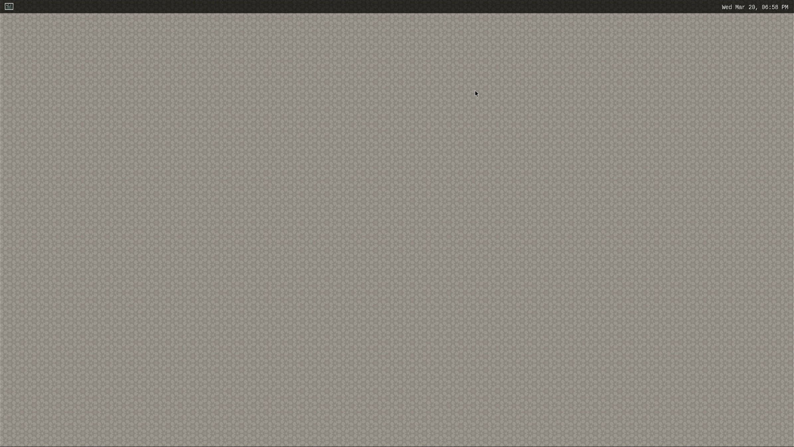

    The Wayland Desktop on Astra Machina

Clicking on the icon in the top left corner will open a terminal.

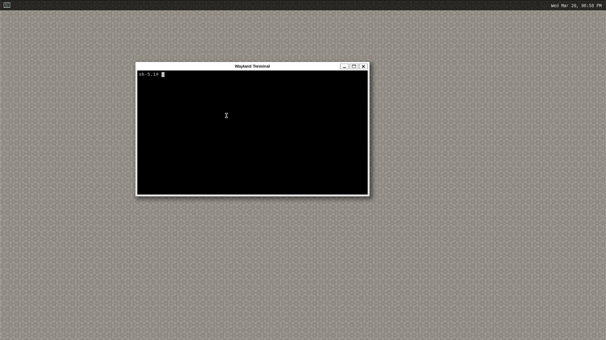

    The Wayland Desktop with a terminal open

The Shell with SSH
------------------

Astra Machina has ssh enabled by default. It will accept connections from ssh
clients over the network. Login with the username ``root``. No password is required::

    ssh root@10.10.10.100

.. note::

    In the examples above the Astra Machina's address is
    10.10.10.100. Please replace this IP with the IP address of your device.

.. _adb_shell_guide:

The Shell with ADB
------------------

Astra Machina supports Android Debug Bridge (ADB) over USB. ADB is used on Android devices and has been
ported to Astra Machina. Google provides extensive documentation on ADB `here <https://developer.android.com/tools/adb>`__.

To use ADB connect a USB cable from the host system to the USB Type-C USB 2.0 port on Astra Machina (next to the ethernet port).

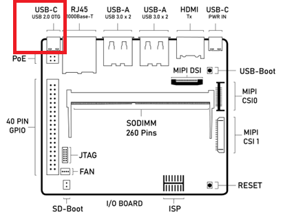

    Astra Machina Component Diagram with USB Type-C USB 2.0 port highlighted

Google provides versions of ADB for Mac, Linux, and Windows. Once ADB is installed run ``adb devices`` to see all ADB devices
connected to the host. Then run::

    adb shell

Or if there is more then one ADB device::

    adb -s SL16x0 shell

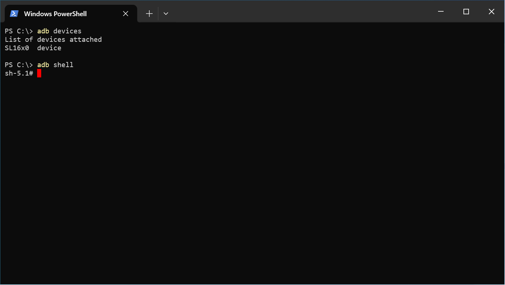

    Using ADB with Windows Powershell

The Serial Console
------------------

Astra Machina provides a serial console which displays bootloader
and OS messages to a terminal emulator running on the host system. These messages are
useful for determining the status of Astra Machina early in the boot process
or when a display is not connected. It can also provides useful information
during operation. The serial console is also needed during the software update process.

.. _setup_serial_console:

Setting up the Serial Console
^^^^^^^^^^^^^^^^^^^^^^^^^^^^^

The serial console on Astra Machina can be accessed by connecting a USB-TTL adaptor to
the RX, TX, and GND pins of the 40 pin GPIO connector. USB-TTL adaptors can either be a board
with jumper wires or an integrated USB cable with separated pins. 

=======    =============
USB TTL    Astra Machina
=======    =============
GND        GND (Pin 6)
RXD        TX  (Pin 8)
TXD        RX  (Pin 28)
=======    =============

.. note::

    SL2619 uses pin 28 for RX instead of pin 10 which is uses on SL1620, SL1640, and SL1680.

.. note::

    RX and TX pins operate at a typical voltage of 3.3V

The following USB-TTL adaptors are officially approved to work with Astra Machina:

`Adafruit USB to UART Debug / Console Cable (CP2102 Driver IC) <https://www.adafruit.com/product/954#technical-details>`_

    +----------------+---------------+-------------------------------------+------------------------------------+
    | Pin Function   | Color Code    | Astra SL261x 40-pin Connector       | Astra SL261x 40-pin Function       |
    +================+===============+=====================================+====================================+
    | 5V-Out         | Red           | NC                                  | NC                                 |
    +----------------+---------------+-------------------------------------+------------------------------------+
    | TX-Out         | Green         | Pin-28                              | UART0_Rx-In                        |
    +----------------+---------------+-------------------------------------+------------------------------------+
    | RX-In          | White         | Pin-8                               | UART0_Tx-Out                       |
    +----------------+---------------+-------------------------------------+------------------------------------+
    | GND            | Black         | Pin-6                               | GND                                |
    +----------------+---------------+-------------------------------------+------------------------------------+

`CenryKay USB to UART Debug / Console Cable (CH340G Driver IC)`

    +----------------+---------------+-------------------------------------+------------------------------------+
    | Pin Function   | Color Code    | Astra SL261x 40-pin Connector       | Astra SL261x 40-pin Function       |
    +================+===============+=====================================+====================================+
    | 5V-Out         | Red           | NC                                  | NC                                 |
    +----------------+---------------+-------------------------------------+------------------------------------+
    | TX-Out         | Green         | Pin-28                              | UART0_Rx-In                        |
    +----------------+---------------+-------------------------------------+------------------------------------+
    | RX-In          | White         | Pin-8                               | UART0_Tx-Out                       |
    +----------------+---------------+-------------------------------------+------------------------------------+
    | GND            | Black         | Pin-6                               | GND                                |
    +----------------+---------------+-------------------------------------+------------------------------------+

.. note::

    USB-TTL cables using PL2303 or FT232R driver ICs are not approved parts for use with Astra Machina.

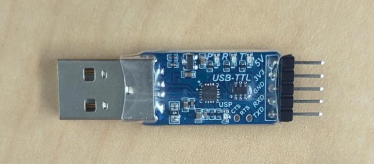

    Example USB TTL board

.. figure:: media/usb-ttl-cable.png

    Example USB TTL cable

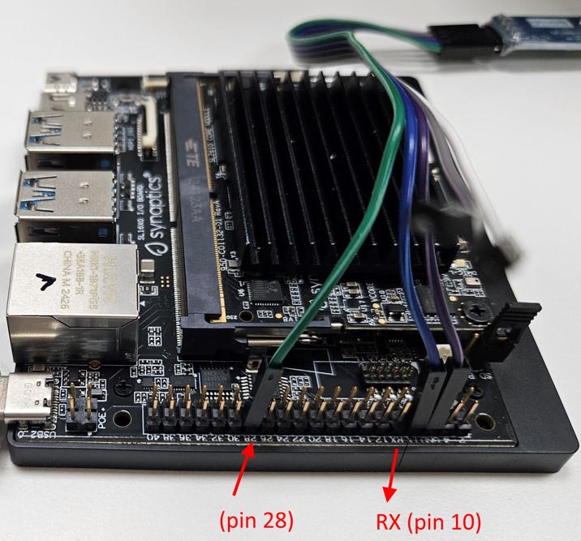

    UART pins on SL2619

Some USB-TTL adaptors require installing a driver on Windows and Mac hosts. Please check with the
adaptor's manufacturer for instructions on downloading and installing the driver.

The serial console can be accessed using a terminal emulator program such as `Putty <https://www.putty.org/>`__, HyperTerminal,
`Tera Term <https://teratermproject.github.io/index-en.html>`__, Screen, or Minicom.

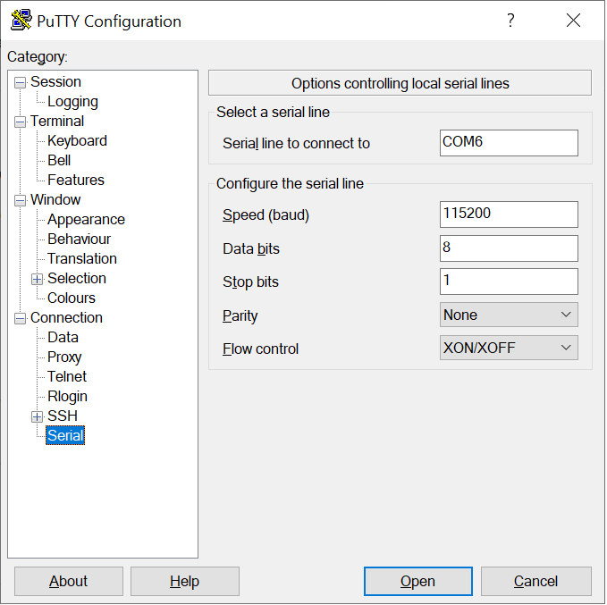

    Putty terminal emulator on Windows

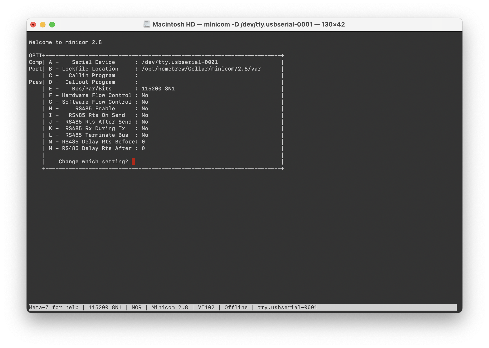

    Minicon terminal emulator on Mac OS

.. _linux_login:

Linux OS Login
^^^^^^^^^^^^^^

After Linux successfully boots, a login prompt will be displayed in the
serial console. To login use the username ``root``. No password is required.

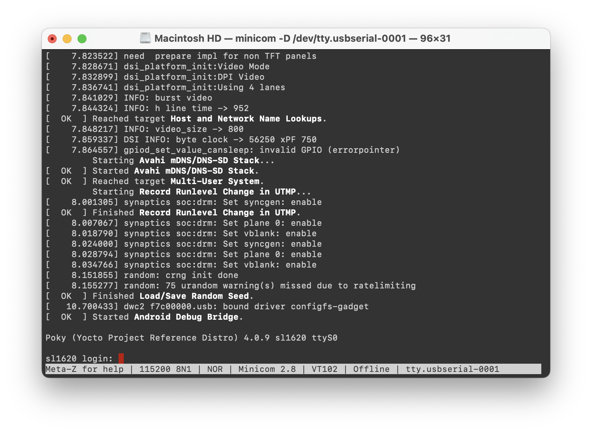

    Successful boot seen in Minicom

.. _multimedia:

Multimedia
==========

The Astra Machina contains hardware and software components which accelerate
the processing of multimedia workloads. The Linux BSP provides Gstreamer
plugins which allow users to develop programs which utilize these
multimedia components to improve multimedia performance. This section
provides an overview on how to use the Gstreamer command line interface
to build pipelines using these plugins. Information on the Gstreamer framework
can be found at https://gstreamer.freedesktop.org/.

Gstreamer Plugins
-----------------

Gstreamer uses plugin modules which are used to extend Gstreamer functionality.
The Astra Machina uses plugins to allow its hardware components to be used
in a Gstreamer pipeline. The tables below list plugins which are used by
the codecs supported by the Astra Machina.

Video Codecs
^^^^^^^^^^^^

**SL2619**

========= ================= ================== ==================
Codec     Parser Plugin     Decoder Plugin     Encoder Plugin
========= ================= ================== ==================
H.264     h264parse         avdec_h264         N/A
H.265     h265parse         avdec_h265         N/A
VP8       N/A               avdec_vp8          N/A
VP9       vp9parse          avdec_vp9          N/A
========= ================= ================== ==================

Audio Codecs
^^^^^^^^^^^^

========= ================= ================== ==================
Codec     Parser Plugin     Decoder Plugin     Encoder Plugin
========= ================= ================== ==================
AAC       aacparse          fdkaacdec          fdkaacenc
Vorbis    N/A               vorbisdec          vorbisenc
MPEG 2    mpegaudioparse    avdec_mp2float     avenc_mp2
MPEG 3    mpegaudioparse    avdec_mp3          N/A
AC3       N/A               avdec_ac3          avenc_ac3
OPUS      N/A               avdec_opus         avenc_opus
========= ================= ================== ==================

Plugin Information
""""""""""""""""""

Astra Machina includes the ``gst-inspect-1.0`` command which can be used to display information about the
plugins available on the system.

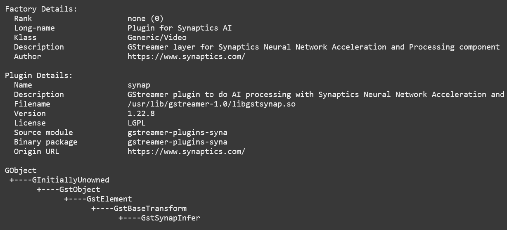

    Example output of ``gst-inspect-1.0 --no-colors synapinfer``

.. note::

    You may need the --no-colors option to disable colors if your terminal does not support colors.

Gstreamer Examples
------------------

The following examples use the gst-launch-1.0 command line program to
construct a pipeline and begin playing it. The gst-launch-1.0 command
takes in a list of element types separated by exclamation points.
Elements can also contain optional properties. (see `GStreamer documentation <https://gstreamer.freedesktop.org/documentation/tutorials/basic/gstreamer-tools.html?gi-language=c>`__ for more details).
The examples below will show the structure of the command with a brief description.
Followed by one or more examples.

Media Playback
^^^^^^^^^^^^^^

.. _audio_sinks:

Audio Sinks
"""""""""""

The following examples use the ALSA audio sink to output audio using the ALSA
audio API (for more details refer to the `Gstreamer documentation <https://gstreamer.freedesktop.org/documentation/alsa/alsasink.html?gi-language=c#alsasink>`__ for more details).
Hardware devices can be found in the file /proc/asound/pcm. Below is an example of the pcm devices on SL2619.

Example /proc/asound/pcm output from SL2619::

    root@sl2619:~# cat /proc/asound/pcm
    00-00: asoc-i2s1 snd-soc-dummy-dai-0 :  : playback 1 : capture 1
    00-01: asoc-i2s2 snd-soc-dummy-dai-1 :  : playback 1 : capture 1
    00-02: asoc-i2s3 snd-soc-dummy-dai-2 :  : playback 1 : capture 1

Video Sinks
"""""""""""

Gstreamer on Astra Machina supports three video sinks. The main video sink is the ``waylandsink`` which uses
the wayland protocol and compositor to display the video output.

.. note::

    ``kmssink`` and ``xvimagesink`` are not currently support on Scarthgap releases.

Wayland Sink
************

Many of the following examples use the Wayland video sink to create a window and
render the decoded frames (see `GStreamer documentation <https://gstreamer.freedesktop.org/documentation/waylandsink/index.html?gi-language=c#waylandsink>`__ for more details)

When using the Wayland sink, please make sure to set the
following variables in your environment. These variables may need to be
set when running commands from the serial console or a remote shell::

    export XDG_RUNTIME_DIR=/var/run/user/0
    export WAYLAND_DISPLAY=wayland-1

The ``XDG_RUNTIME_DIR`` variable specifies the directory which contains the
Wayland socket belonging to the user. The ``WAYLAND_DISPLAY`` variable
specifies which Wayland compositor to connect to.

.. note::

    The Wayland sink window can be moved using a mouse.

Audio Playback
^^^^^^^^^^^^^^

Playing audio files involves reading and parsing the encoded audio data,
decoding the data, and outputting it to the audio sink. Some data
formats and audio sinks may also need to convert and resample the data
before sending it to the audio sink::

    gst-launch-1.0 filesrc location=audio_file ! parser ! decoder ! [ convert ] ! [ resample ] ! audiosink

This example plays an MP3 file using the speakers of the attached HDMI
device::

    gst-launch-1.0 filesrc location=audio_file.mp3 ! mpegaudioparse ! avdec_mp3 ! audioconvert ! audioresample ! alsasink device=hw:0,7

Video Playback
^^^^^^^^^^^^^^

Playing a video file involves reading the file, demuxing a video stream,
parsing the encoded data, and decoding the data using the video decoder.
Finally, the decoded frames our output to the video sink::

    gst-launch-1.0 filesrc location=video_file ! demux ! queue ! parser ! decoder ! videosink

The following example plays the main video stream of an MP4 file and
displays the video using Wayland.

An example of a H265 encoded video file on SL2619::

    gst-launch-1.0 filesrc location=test_file.mp4 ! qtdemux name=demux demux.video_0 ! queue ! h264parse ! avdec_h264 ! waylandsink fullscreen=true

Audio / Video File Playback
^^^^^^^^^^^^^^^^^^^^^^^^^^^

Playing a file which contains both audio and video streams requires
creating a pipeline which parses and decodes both streams::

    gst-launch-1.0 filesrc location=video_file ! demux.video ! queue ! parser ! decoder ! videosink \
        demux.audio ! queue ! parser ! decoder ! [ convert ] ! [ resample ] ! audiosink

Play an MP4 file on SL2619 with a H26 encoded video stream and an AAC encoded
audio stream::

    gst-launch-1.0 filesrc location=little.mp4  ! qtdemux name=demux  \
        demux.video_0 ! queue ! h264parse ! avdec_h264 ! queue ! waylandsink fullscreen=true \
        demux.audio_0 ! queue ! aacparse ! fdkaacdec ! audioconvert ! alsasink device=hw:0,1

Recording
^^^^^^^^^

Audio Recording
"""""""""""""""

Recording audio involves reading data from a capture device like a
microphone, converting, encoding, and multiplexing the data before
writing it to an output file::

    gst-launch-1.0 alsasrc device=device ! [audio capabilities] ! queue ! convert ! encode ! mux ! filesink location=output file

The following example records audio from the ALSA capture device 1,0 (a USB microphone). It
then converts the raw data into a format which can encoded into the Vorbis
codec by the encoder. Once the data is encoded, it is then multiplexed into an Ogg
container and written to the file /tmp/alsasrc.ogg::

    gst-launch-1.0 alsasrc device=hw:1,0 ! queue ! audioconvert ! vorbisenc ! oggmux ! filesink location=/tmp/alsasrc.ogg

Cameras
^^^^^^^

Astra Machina supports USB (UVC) and image sensor cameras using the V4L2 driver stack.
This stack can be used with Gstreamer to construct pipelines using a camera.

.. note::

    Image sensor cameras are only supported on SL1680 using SL1680's ISP.

To display video captured from a camera to output it to the video sink::

    gst-launch-1.0 v4l2src device=/dev/videoX ! "video data,framerate,format,width,height" ! video sink

The following example reads captured data from the V4L2 device
/dev/video2 and applies the capabilities filter before sending the
output to the wayland sink::

    gst-launch-1.0 v4l2src device=/dev/video2 ! "video/x-raw,framerate=30/1,format=YUY2,width=640,height=480" ! waylandsink fullscreen=true

Image Sensor Cameras
""""""""""""""""""""

The SL261x platform supports a mini ISP which provides basic image processing capabilities such as debayering, color conversion, downscaling, cropping, and white balance.

Currently, there is no support for 3A functions — Auto Exposure (AE), Auto White Balance (AWB), or Auto Focus (AF). Users must manually configure exposure settings for each
sensor based on the testing environment. Without proper exposure configuration, the output image may appear dark.

The default white balance parameters are tuned for typical indoor (room) lighting conditions and may need adjustment depending on the current test environment.
These ISP settings are applicable only for specific supported sensors.

The mini ISP on SL261x is primarily designed to support AI use cases such as object detection and face detection. Therefore, the display output quality will not be
identical to the SL1680's full-featured ISP, which offers full image enhancement capabilities.

The device file number may vary depending on your configuration. You can use the ``v4l2-ctl`` command to find which device files are associated with each of the
ISP paths.

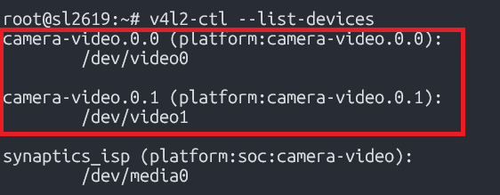

    ``v4l2-ctl --list-devices`` output with the ISP Path devices highlighted

The device name will be ``camera-video``. If an additional USB camera is connected, the device indices may change; otherwise, they default to ``video0`` and ``video1``.

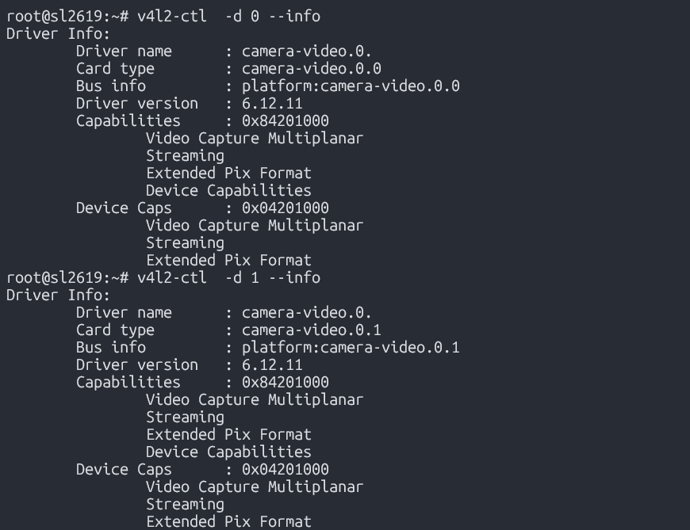

    ISP device capabilities

Configuring Exposure Settings for OV5647
****************************************

To set the exposure and gain settings, first find the corresponding V4L2 Sub Device using the ``media-ctl -p`` command.

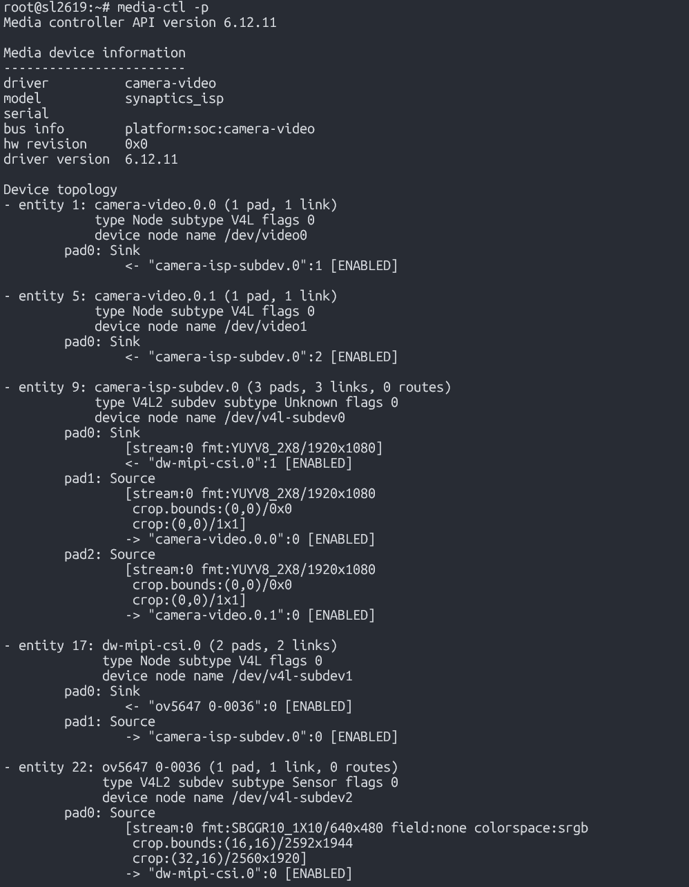

    Output of ``media-ctl -p``.

Use the output to determine the sub device needed to set the gain and exposure values.

::

    v4l2-ctl -d /dev/v4l-subdev2 --set-ctrl auto_exposure=1
    v4l2-ctl -d /dev/v4l-subdev2 --set-ctrl gain_automatic=0
    v4l2-ctl -d /dev/v4l-subdev2 --set-ctrl analogue_gain=128
    v4l2-ctl -d /dev/v4l-subdev2 --set-ctrl exposure=1011

Use the ``v4l2-ctl`` command with the ``list-ctrls`` option to view what controls are accessible.

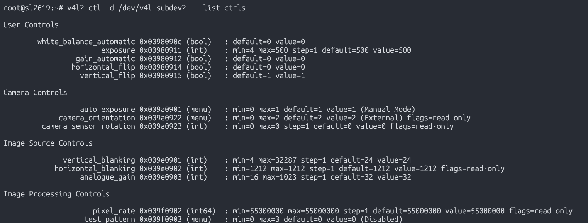

    Output of ``v4l2-ctl -d /dev/v4l-subdev2  --list-ctrls``.

Gstreamer Commands with Wayland Sink
************************************

+------------------+------------------------------------------------------------------------------------------------------+------------------------------------------------------+
| Format           | Command                                                                                              | Comments                                             |
+==================+======================================================================================================+======================================================+
| YUV420           | gst-launch-1.0 v4l2src device=/dev/video0 io-mode=2 ! 'video/x-raw, format=(string)NV12, \           |                                                      |
|                  |                                                                                                      |                                                      |
|                  | width=(int)1920, height=(int)1080, framerate=(fraction)30/1' ! waylandsink async=false               |                                                      |
|                  |                                                                                                      |                                                      |
|                  +------------------------------------------------------------------------------------------------------+------------------------------------------------------+
|                  | gst-launch-1.0 v4l2src device=/dev/video0 io-mode=2 ! 'video/x-raw, format=(string)NV12, \           |                                                      |
|                  |                                                                                                      |                                                      |
|                  | width=(int)1296, height=(int)972, framerate=(fraction)30/1' ! waylandsink  async=false               |                                                      |
|                  |                                                                                                      |                                                      |
|                  +------------------------------------------------------------------------------------------------------+------------------------------------------------------+
|                  | gst-launch-1.0 v4l2src device=/dev/video0 io-mode=2 ! 'video/x-raw, format=(string)NV12, \           |                                                      |
|                  |                                                                                                      |                                                      |
|                  | width=(int)640, height=(int)480, framerate=(fraction)60/1' ! waylandsink  async=false                |                                                      |
|                  |                                                                                                      |                                                      |
+------------------+------------------------------------------------------------------------------------------------------+------------------------------------------------------+
| RGB888           | gst-launch-1.0 v4l2src device=/dev/video0 io-mode=2 ! 'video/x-raw, format=(string)RGB, \            |                                                      |
|                  |                                                                                                      |                                                      |
|                  | width=(int)1920, height=(int)1080, framerate=(fraction)30/1' ! videoconvert ! waylandsink async=false|                                                      |
|                  |                                                                                                      |                                                      |
|                  +------------------------------------------------------------------------------------------------------+------------------------------------------------------+
|                  | gst-launch-1.0 v4l2src io-mode=2 ! 'video/x-raw,format=(string)RGB, width=(int)1920, \               | For reference only this will lead to                 |
|                  |                                                                                                      |                                                      |
|                  | height=(int)1080, framerate=(fraction)30/1' ! glupload ! glcolorconvert ! glimagesink                | frame drop since videoconvert is running in CPU      |
|                  |                                                                                                      |                                                      |
|                  |                                                                                                      | and glconvert has memory copy.                       |
|                  |                                                                                                      |                                                      |
|                  |                                                                                                      | For RGB check always filesink.                       |
|                  |                                                                                                      |                                                      |
+------------------+------------------------------------------------------------------------------------------------------+------------------------------------------------------+

Gstreamer Commands with File Sink
*********************************

+------------------+------------------------------------------------------------------------------------------------------+------------------------------------------------------+
| Format           | Command                                                                                              | Comments                                             |
+==================+======================================================================================================+======================================================+
| YUV420           | gst-launch-1.0 v4l2src device=/dev/video0 ! 'video/x-raw, format=(string)NV12, width=(int)1920, \    |                                                      |
|                  |                                                                                                      |                                                      |
|                  | height=(int)1080, framerate=(fraction)30/1' ! filesink location=/tmp/1.yuv                           |                                                      |
|                  |                                                                                                      |                                                      |
|                  +------------------------------------------------------------------------------------------------------+------------------------------------------------------+
|                  | gst-launch-1.0 v4l2src device=/dev/video0  ! 'video/x-raw, format=(string)NV12, width=(int)1296, \   |                                                      |
|                  |                                                                                                      |                                                      |
|                  | height=(int)972, framerate=(fraction)30/1' ! filesink location=/tmp/1.yuv                            |                                                      |
|                  |                                                                                                      |                                                      |
|                  +------------------------------------------------------------------------------------------------------+------------------------------------------------------+
|                  | gst-launch-1.0 v4l2src device=/dev/video0  ! 'video/x-raw, format=(string)NV12, width=(int)640, \    |                                                      |
|                  |                                                                                                      |                                                      |
|                  | height=(int)480, framerate=(fraction)60/1' ! filesink location=/tmp/1.yuv                            |                                                      |
|                  |                                                                                                      |                                                      |
+------------------+------------------------------------------------------------------------------------------------------+------------------------------------------------------+
| RGB888           | gst-launch-1.0 v4l2src device=/dev/video0  ! 'video/x-raw, format=(string)RGB, width=(int)1920, \    |                                                      |
|                  |                                                                                                      |                                                      |
|                  | height=(int)1080, framerate=(fraction)30/1' ! filesink location=/tmp/1.rgb                           |                                                      |
|                  |                                                                                                      |                                                      |
|                  +------------------------------------------------------------------------------------------------------+------------------------------------------------------+
|                  | gst-launch-1.0 v4l2src device=/dev/video0  ! 'video/x-raw, format=(string)RGB, width=(int)1296, \    |                                                      |
|                  |                                                                                                      |                                                      |
|                  | height=(int)972, framerate=(fraction)30/1' ! filesink location=/tmp/1.rgb                            |                                                      |
|                  |                                                                                                      |                                                      |
|                  +------------------------------------------------------------------------------------------------------+------------------------------------------------------+
|                  | gst-launch-1.0 v4l2src device=/dev/video0  ! 'video/x-raw, format=(string)RGB, width=(int)640, \     |                                                      |
|                  |                                                                                                      |                                                      |
|                  | height=(int)480, framerate=(fraction)60/1' ! filesink location=/tmp/1.rgb                            |                                                      |
|                  |                                                                                                      |                                                      |
+------------------+------------------------------------------------------------------------------------------------------+------------------------------------------------------+

RTSP Cameras
""""""""""""

Astra Machina supports RTSP cameras using the Gstreamer RTSP plugin. 

This example will receive a H.264 encoded camera stream and display it on SL2619 using software decoding. The rtspsrc
element connects to the camera over the network and sets the latency to 2000 milliseconds. The latency parameter along with the rtpjitterbuffer element will buffer the stream
to minimize network jitter. The rtph264depay element will depayload the H.264 stream. It's wait-for-keyframe option will wait for a keyframe before outputing
the stream to ensure synchoronization. Then the H.264 stream is parsed and decoded using the h264parse and avdec_h264 elements. The decoded video is then
displayed on the screen using the wayland sink::

    gst-launch-1.0 rtspsrc location="rtsp://<user>:<password>@<ip>/stream" latency=2000 ! rtpjitterbuffer ! rtph264depay wait-for-keyframe=true ! \
        video/x-h264, width=1920, height=1080 ! h264parse ! avdec_h264 ! videoscale ! video/x-raw,width=1920,height=1080 ! waylandsink

Gstreamer Playbin Plugin
^^^^^^^^^^^^^^^^^^^^^^^^

Astra Machina contains the Gstreamer playbin plugin. This plugin can
automatically determine what type of pipeline to construct based on
automatic file type recognition (see `Gstreamer documentation <https://gstreamer.freedesktop.org/documentation/playback/playbin.html?gi-language=c>`__). This simplifies pipeline creation.

Playbin will autodetect the media file located at the specified uri, and create a
pipeline for it. It will then display the video on the video sink and
render the audio on the audio sink. The video-sink and audio-sink
parameters are optional. If the parameters are not included, default video and
audio sinks will be used instead::

    gst-launch-1.0 playbin uri=file:///path/to/file video-sink="video sink" audio-sink="audio sink"

Using playbin the example in :ref:`audio_sinks` can be reduced to::

    gst-launch-1.0 playbin uri=file:///path/to/file video-sink="waylandsink fullscreen=true" audio-sink="alsasink device=hw:0,7"

Multimedia Demo Applications
----------------------------

We also provide two `demo QT applications <https://github.com/synaptics-astra/application-videosdk/tree/#release#/>`__ which demonstate the
Multimedia and AI capabilities of Astra Machina. The Syna Video Player app demonstates decoding and playing up to four video streams. The Syna AI
Player app demonstrates the AI capabilities of Astra Machina by performing object detection, face detection, and pose estimation examples.

The apps require the following environment variable to be set::

    export XDG_RUNTIME_DIR=/var/run/user/0
    export WESTON_DISABLE_GBM_MODIFIERS=true
    export WAYLAND_DISPLAY=wayland-1
    export QT_QPA_PLATFORM=wayland

.. _qml_customization:

Multimedia Demo Customization
^^^^^^^^^^^^^^^^^^^^^^^^^^^^^

Both applications use `QML <https://doc.qt.io/qt-6/qmlreference.html>`__ files for their configuration. This allows users to customize the applications.
Customizations include modifying what videos are used in the application. Since no sample video files are preinstalled on the Astra Machina image,
users will need to add their own video files to the application's QML files. The default QML files are preinstalled in /home/root/demos/qmls.

Syna Video Player
^^^^^^^^^^^^^^^^^

The Syna Video Player application demonstrates Astra Machina's ability to play and decode videos. It supports playing a single video, or playing up to four
videos in a grid.

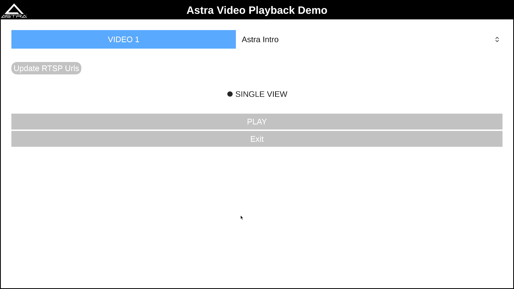

    The main screen of Syna Video Player

Run the Syna Video Player::

    root@sl2619:~# syna-video-player --mach sl2619 --mode ffmpeg

The Syna Video Player expects two paramaters, the machine type and the mode. The machine type is the version of Astra Machina which the application is running on.
The valid options are ``sl2619``. The mode specifies which mode of decoding should be used. The supported option for ``sl2619`` is ``ffmpeg``. When set to ``ffmpeg``
the Syna Video Player application will use the `ffmpeg library <https://ffmpeg.org/>`__ to perform decoding of the video stream in software.

Connectivity
============

Bluetooth and Wi-Fi are supported on Astra Machina through on-board chip
solutions and external hardware. The following table lists the various
on-board chips and external solutions:

============ =============== ===================== ========================================================
SL Processor Wireless Device Physical Interface    Software Information
                                                  
                             (M.2 PCIe / M.2 SDIO)
============ =============== ===================== ========================================================
SL2619       SYNA 4612       M.2 SDIO              - wpa_supplicant v2.11
                                                   - WIFI driver version: v101.10.478
============ =============== ===================== ========================================================

The Synaptics Astra Linux BSP contains all of the drivers and firmware required to use the 46xxx modules with SDIO interfaces.
Wireless network management is handled by the WPA Supplicant daemon which key negotiation with a WPA Authenticator. It supports WEP, WPA, WPA2, and WPA3
authentication standards. ( See `wpa_supplicant <https://wiki.archlinux.org/title/wpa_supplicant>`__ for more details)

Setting up Wifi with WPA Supplicant
------------------------------------
The following section describes how to setup Wifi on Astra Machina using WPA Supplicant.

Generate the WPA Pre-shared Key
^^^^^^^^^^^^^^^^^^^^^^^^^^^^^^^
Generating a pre-shared key from a passphrase avoids having to store the passphrase in the WPA Supplicant config file.

From the shell, use the wpa_passphrase command line tool to generate a WPA pre-shared key from a passphrase::

    root@sl2619:^# wpa_passphrase network_name 12345678
    network={
        ssid="network_name"
        psk=5ba83b0673ea069dafe5d5f1af8216771c13be6ad6f11dac9dc0e90b0c604981
    }

Bringing up the WLAN Interface
^^^^^^^^^^^^^^^^^^^^^^^^^^^^^^

Use ifconfig to instruct the kernel to bring up the wlan interface::

    ifconfig wlan0 up

Creating the WPA Supplicant Configuration File
^^^^^^^^^^^^^^^^^^^^^^^^^^^^^^^^^^^^^^^^^^^^^^

WPA Supplicant uses a config file to configure the Wifi connection. This configuration file is located in /etc/wpa_supplicant.

Create the /etc/wpa_supplicant directory::

    mkdir -p /etc/wpa_supplicant

Create the file /etc/wpa_supplicant/wpa_supplicant-wlan0.conf with options for your Wifi Network.

Contents of an example wpa_supplicant-wlan0.conf::

    ctrl_interface=/var/run/wpa_supplicant
    ctrl_interface_group=0
    update_config=1

    network={
        ssid="network_name"
        psk=5ba83b0673ea069dafe5d5f1af8216771c13be6ad6f11dac9dc0e90b0c604981
        key_mgmt=WPA-PSK
        scan_ssid=1
    }

Configure systemd-networkd
^^^^^^^^^^^^^^^^^^^^^^^^^^

The wlan interface needs to be enabled in the systemd-networkd system daemon configuration.

Create the new file /etc/systemd/network/25-wlan.network with the following contents::
 
    [Match]
    Name=wlan0

    [Network]
    DHCP=ipv4

Enable Wifi Services
^^^^^^^^^^^^^^^^^^^^
The network daemons need to be restarted to load the new configuration.

Restart network daemons::

    systemctl restart systemd-networkd.service
    systemctl restart wpa_supplicant@wlan0.service

Enable wpa_supplicant on boot up::

    systemctl enable wpa_supplicant@wlan0.service

Setup the Access Point (AP mode) with hostapd
---------------------------------------------
The Wifi interface can also be configured to act as an access point using `hostapd <https://w1.fi/hostapd/>`__.
Additional packages may need to be installed to support hostapd and iptables. Please see the Astra Yocto User Guide
for instructions on how to add the hostapd and iptables packages to your image.

Configure Networking to use hostapd
^^^^^^^^^^^^^^^^^^^^^^^^^^^^^^^^^^^

To configure the wlan device to use hostapd add the following entries to the /etc/network/interfaces file::

    auto wlan0
    iface wlan0 inet static
        address 192.168.10.1
        netmask 255.255.255.0
        post-up systemctl start hostapd
        pre-down systemctl stop hostapd

Configure systemd-networkd
^^^^^^^^^^^^^^^^^^^^^^^^^^

The wlan interface needs to be enabled in the systemd-networkd system daemon configuration.

Create the new file /etc/systemd/network/10-wlan0.network with the following contents::

    [Match]
    Name=wlan0

    [Network]
    Address=192.168.10.1/24
    DHCPServer=yes

    [DHCPServer]
    EmitDNS=yes

Configure hostapd
^^^^^^^^^^^^^^^^^

Create the file /etc/hostapd.conf with the ip, ssid, and passphrase of the Wifi network you are creating.

Example::

    own_ip_addr=192.168.10.1
    ssid=yocto640
    wpa=2
    wpa_passphrase=1234567890

Configuring IP Forwarding Firewall Rules
^^^^^^^^^^^^^^^^^^^^^^^^^^^^^^^^^^^^^^^^

IP Forwarding and NAT need to be configured to forward traffic coming from be new wireless network.

The following is an example of using iptables to forward traffic over the ethernet inferface using NAT. Add the new rules to /etc/iptables/iptables.rules
so that they can be loaded at boot::

    iptables –F
    iptables -F INPUT
    iptables -F OUTPUT
    iptables -F FORWARD
    iptables -t nat -F
    iptables -t mangle -F
    iptables -A INPUT -j ACCEPT
    iptables -A OUTPUT -j ACCEPT
    iptables -A FORWARD -j ACCEPT
    iptables -t nat -A POSTROUTING -o eth0 -j MASQUERADE
    iptables-save > /etc/iptables/iptables.rules

IP Forwarding is enabled by setting the following entries in /etc/sysctl.d/ip_forward.conf::

    net.ipv4.ip_forward = 1

Run the following command to enable ip forwarding::

    sysctl -p /etc/sysctl.d/ip_forward.conf

.. note::

    Be sure to connect an ethernet cable to Astra Machina so that traffic can be forwarded to the ethernet interface.

Enabling Services
^^^^^^^^^^^^^^^^^

Start hostapd and iptables::

    systemctl start hostapd.service
    systemctl start iptables.service

Enable hostapd and iptables on boot::

    systemctl enable hostapd.service
    systemctl enable iptables.service

Verify wlan0 Interface Configuration
^^^^^^^^^^^^^^^^^^^^^^^^^^^^^^^^^^^^

After enabling hostapd and iptables, use the ``ifconfig`` command to verify that ``wlan0`` is enabled.

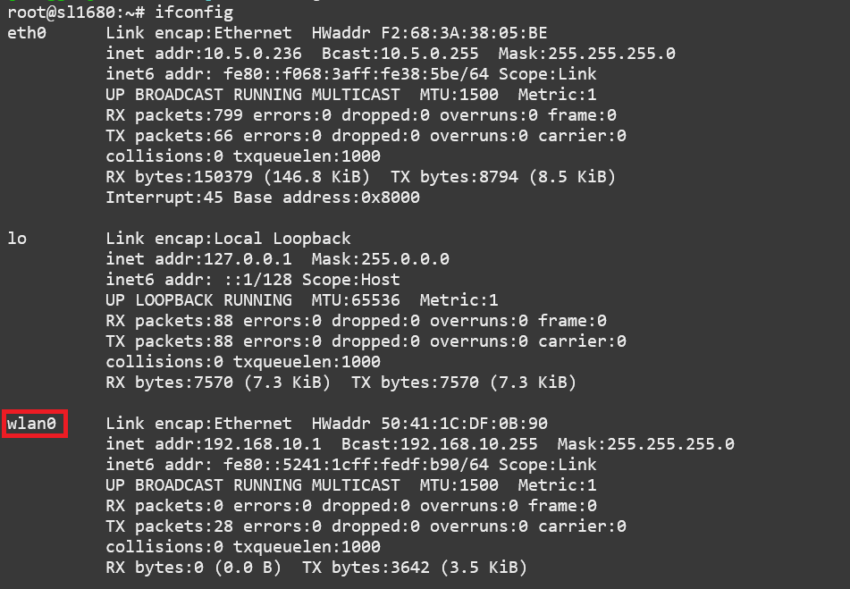

.. note::

    If ``wlan0`` does not appear in the ``ifconfig`` output then you may need to run the ``sync`` command and reboot. This will make
    sure that the configuration changes were applied.

Disabling Services
^^^^^^^^^^^^^^^^^^

Use the following commands to stop using the Wifi interface as an access point and disable hostapd::

    systemctl stop hostapd.service
    systemctl stop iptables.service
    systemctl disable hostapd.service
    systemctl disable iptables.service
    rm -rf /etc/systemd/network/10-wlan0.network

Performing throughput tests
---------------------------

Astra Machina provides the `iPerf2 <https://iperf.fr/>`__ tool for measuring network throughput. iPerf is a widely used tool for network
performance measurement and tuning. It uses a client / server model to measure the throughput between devices on a network. It supports
both TCP and UDP protocols. Full documentation on iPerf2 can be found on the `iPerf website <https://iperf.fr/iperf-doc.php#doc>`__.

TCP Traffic
^^^^^^^^^^^

The following example runs a TCP throughput test between the client and server using the default options. 
In this example the server has the IP address ``10.5.0.3``.

.. note::

    The server must be started before the client.

Client Side::

    $ iperf -c 10.5.0.3

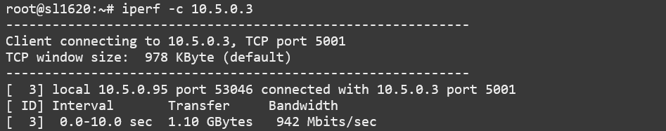

    ``iperf`` client running on SL1620 in TCP mode

Server side::

    $ iperf -s

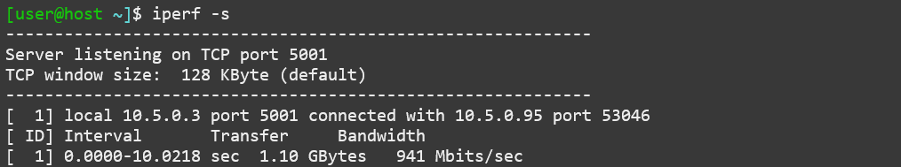

    ``iperf`` server running on SL1620 in TCP mode

    
UDP Traffic
^^^^^^^^^^^

The following example runs a UDP throughput test between the client and server using the default options. 
In this example the server has the IP address ``10.5.0.3``.

.. note::

    The server must be started before the client.

Client side::

    $ iperf -c 10.5.0.3 -u

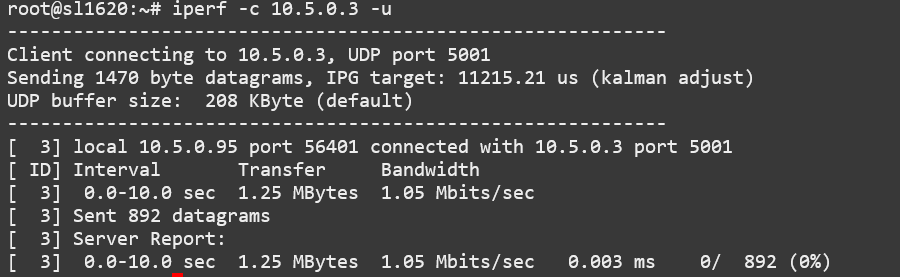

    ``iperf`` client running on SL1620 in UDP mode

Server side::

    $ iperf -s -u

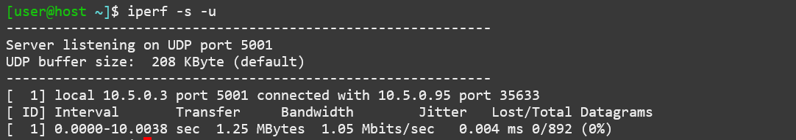

    ``iperf`` server running on SL1620 in UDP mode

Common iPerf Options
^^^^^^^^^^^^^^^^^^^^

The following options are commonly used with the `iperf` command to customize its behavior:

- ``-i``: Interval
    Specifies the interval (in seconds) between periodic bandwidth reports. For example, ``-i 1`` will print a report every second.

- ``-l``: Length
    Sets the length of the buffer to read or write. For example, ``-l 128K`` sets the buffer length to 128 kilobytes.

- ``-b``: Bandwidth
    Specifies the target bandwidth for UDP tests. For example, ``-b 10M`` sets the target bandwidth to 10 megabits per second.

- ``-w``: Window size
    Sets the TCP window size. For example, ``-w 256K`` sets the TCP window size to 256 kilobytes.

- ``-t``: Time
    Specifies the time (in seconds) to transmit for. For example, ``-t 60`` will run the test for 60 seconds.

This example is of a TCP throughput test with a 10 second interval between reports, a 128 kilobyte buffer, a 1000 megabit per
second target bandwidth, a 256 kilobyte TCP window size, and a 60 second test duration::

    $ iperf -c 10.5.0.3 -i 10 -l 128K -b 1000M -w 256K -t 60

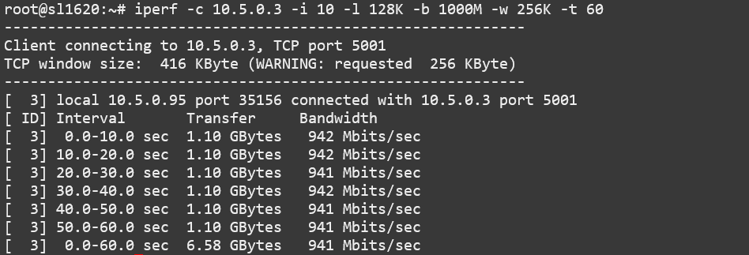

    ``iperf`` client running on SL1620 with custom options

Server side::

    $ iperf -s -i 10 -l 128K -b 1000M -w 256K -t 60

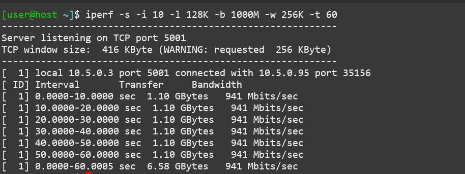

    ``iperf`` server running on SL1620 with custom options

Using the Bluetooth A2DP source role
------------------------------------

Searching and connecting to the headset
^^^^^^^^^^^^^^^^^^^^^^^^^^^^^^^^^^^^^^^
First you need to enter the Bluetooth console using the following command::

    root@sl1640:~# bluetoothctl
    [bluetooth]#

Once in the Bluetooth console you can run various commands to control the Bluetooth stack described in the following
paragraphs.

You can show information about the Bluetooth controller on the board with the ``show`` command::

    [bluetooth]# show
    Controller C0:F5:35:AA:7D:8F (public)
            Name: sl1640
            Alias: sl1640
            Class: 0x00000000
            Powered: no
            Discoverable: no
            DiscoverableTimeout: 0x000000b4
            Pairable: yes
            UUID: Audio Source              (0000110a-0000-1000-8000-00805f9b34fb)
            UUID: Generic Attribute Profile (00001801-0000-1000-8000-00805f9b34fb)
            UUID: Generic Access Profile    (00001800-0000-1000-8000-00805f9b34fb)
            UUID: PnP Information           (00001200-0000-1000-8000-00805f9b34fb)
            UUID: A/V Remote Control Target (0000110c-0000-1000-8000-00805f9b34fb)
            UUID: A/V Remote Control        (0000110e-0000-1000-8000-00805f9b34fb)
            UUID: Device Information        (0000180a-0000-1000-8000-00805f9b34fb)
            Modalias: usb:v1D6Bp0246d0541
            Discovering: no
            Roles: central
            Roles: peripheral
    Advertising Features:
            ActiveInstances: 0x00 (0)
            SupportedInstances: 0x06 (6)
            SupportedIncludes: tx-power
            SupportedIncludes: appearance
            SupportedIncludes: local-name
            SupportedSecondaryChannels: 1M
            SupportedSecondaryChannels: 2M
            SupportedSecondaryChannels: Coded

In order to connect to the headset you first need to power on the bluetooth controller::

    [bluetooth]# power on
    [CHG] Controller C0:F5:35:AA:7D:8F Class: 0x00080000
    Changing power on succeeded
    [CHG] Controller C0:F5:35:AA:7D:8F Powered: yes

You then need to set the controller in pairable mode::

    [bluetooth]# pairable on
    Changing pairable on succeeded

You can then search for the headset (make sure the headset is in discoverable mode)::

    [bluetooth]# scan on
    Discovery started
    [CHG] Controller C0:F5:35:AA:7D:8F Discovering: yes
    [NEW] Device 2D:9A:A9:4F:54:37 2D-9A-A9-4F-54-37
    [NEW] Device 4E:E7:B0:20:2A:11 4E-E7-B0-20-2A-11
    [NEW] Device 7F:84:A3:29:E9:E9 7F-84-A3-29-E9-E9
    [NEW] Device 6A:B0:95:7E:58:79 6A-B0-95-7E-58-79
    [NEW] Device 7E:4D:8F:C4:3B:6F 7E-4D-8F-C4-3B-6F
    [NEW] Device 40:93:CE:4D:F1:8E 40-93-CE-4D-F1-8E
    [NEW] Device 47:14:71:A3:79:A9 47-14-71-A3-79-A9
    [NEW] Device 67:62:9C:4B:F9:7D 67-62-9C-4B-F9-7D
    [NEW] Device 8C:F8:C5:BD:6F:1D DTKBTQ3
    [NEW] Device 0A:73:76:09:55:C0 BT208

This command returns the MAC address of all the devices that are currently discoverable. You need to identify the one
of the headset you want to pair.

After identifying the MAC address of the device you want to pair with, you can disable scanning.

::

    [bluetooth]# scan off
    Discovery stopped
    [CHG] Controller C0:F5:35:AA:7D:8F Discovering: no

Once you found the headset you can pair to it by using the ``pair`` command with the MAC address of the headset::

    [bluetooth]# pair 0A:73:76:09:55:C0
    Attempting to pair with 0A:73:76:09:55:C0
    [CHG] Device 0A:73:76:09:55:C0 Connected: yes
    [CHG] Device 0A:73:76:09:55:C0 Bonded: yes
    [CHG] Device 0A:73:76:09:55:C0 UUIDs: 00001108-0000-1000-8000-00805f9b34fb
    [CHG] Device 0A:73:76:09:55:C0 UUIDs: 0000110b-0000-1000-8000-00805f9b34fb
    [CHG] Device 0A:73:76:09:55:C0 UUIDs: 0000110c-0000-1000-8000-00805f9b34fb
    [CHG] Device 0A:73:76:09:55:C0 UUIDs: 0000110e-0000-1000-8000-00805f9b34fb
    [CHG] Device 0A:73:76:09:55:C0 UUIDs: 0000111e-0000-1000-8000-00805f9b34fb
    [CHG] Device 0A:73:76:09:55:C0 ServicesResolved: yes
    [CHG] Device 0A:73:76:09:55:C0 Paired: yes
    Pairing successful
    [CHG] Device 0A:73:76:09:55:C0 ServicesResolved: no
    [CHG] Device 0A:73:76:09:55:C0 Connected: no

The next step is to mark the device as trusted::

    [bluetooth]# trust 0A:73:76:09:55:C0
    [CHG] Device 0A:73:76:09:55:C0 Trusted: yes
    Changing 0A:73:76:09:55:C0 trust succeeded

The last step is to setup the connection with the headset::

    [bluetooth]# connect 0A:73:76:09:55:C0
    Attempting to connect to 0A:73:76:09:55:C0
    [CHG] Device 0A:73:76:09:55:C0 Connected: yes
    [NEW] Endpoint /org/bluez/hci0/dev_0A_73_76_09_55_C0/sep1
    [NEW] Transport /org/bluez/hci0/dev_0A_73_76_09_55_C0/sep1/fd0
    Connection successful
    [BT208]# [  286.922414] input: BT208 (AVRCP) as /devices/virtual/input/input1
    [CHG] Transport /org/bluez/hci0/dev_0A_73_76_09_55_C0/sep1/fd0 Volume: 0x0060 (96)
    [DEL] Device D4:D2:D6:4F:80:60 445HD_BT_60
    [CHG] Device 0A:73:76:09:55:C0 ServicesResolved: ye
    [BT208]#

If the connection was successful the console prompt will show the name of device we connected to.

We can now get the information about the device::

    [BT208]# info
    Device 0A:73:76:09:55:C0 (public)
            Name: BT208
            Alias: BT208
            Class: 0x00240404
            Icon: audio-headset
            Paired: yes
            Bonded: yes
            Trusted: yes
            Blocked: no
            Connected: yes
            LegacyPairing: no
            UUID: Headset                   (00001108-0000-1000-8000-00805f9b34fb)
            UUID: Audio Sink                (0000110b-0000-1000-8000-00805f9b34fb)
            UUID: A/V Remote Control Target (0000110c-0000-1000-8000-00805f9b34fb)
            UUID: A/V Remote Control        (0000110e-0000-1000-8000-00805f9b34fb)
            UUID: Handsfree                 (0000111e-0000-1000-8000-00805f9b34fb)
            RSSI: -69
            TxPower: 4

Playing music to the headset
^^^^^^^^^^^^^^^^^^^^^^^^^^^^

In order to test playback you need to upload a sound file (in ``.wav`` format)  to the board for instance using ``scp``.

The file can be played to the A2DP sink using the ``aplay`` command. The command takes as parameter the MAC address of the
headeset (in the example below ``0A:73:76:09:55:C0``) and the name of wave file (in the example below
``/home/root/example.wav``)::

    root@sl1640:~# aplay --verbose -D  bluealsa:DEV=0A:73:76:09:55:C0 -t wav /home/root/example.wav
    Playing WAVE '/home/root/example.wav' : Signed 16 bit Little Endian, Rate 48000 Hz, Stereo
    Plug PCM: BlueALSA PCM: /org/bluealsa/hci0/dev_0A_73_76_09_55_C0/a2dpsrc/sink
    BlueALSA BlueZ device: /org/bluez/hci0/dev_0A_73_76_09_55_C0
    BlueALSA Bluetooth codec: SBC
    Its setup is:
      stream       : PLAYBACK
      access       : RW_INTERLEAVED
      format       : S16_LE
      subformat    : STD
      channels     : 2
      rate         : 48000
      exact rate   : 48000 (48000/1)
      msbits       : 16
      buffer_size  : 24000
      period_size  : 6000
      period_time  : 125000
      tstamp_mode  : NONE
      tstamp_type  : GETTIMEOFDAY
      period_step  : 1
      avail_min    : 6000
      period_event : 0
      start_threshold  : 24000
      stop_threshold   : 24000
      silence_threshold: 0
      silence_size : 0
      boundary     : 6755399441055744000

The Linux Boot Process
======================

Before the Linux Kernel begins executing on Astra Machina, low level
firmware and software initializes the hardware and prepares the system for boot.
This section provides an overview of the software components which prepare the
system for booting the Linux Kernel.

Software Overview
-----------------

Astra Machina uses a multistage boot process. This
section gives a brief description of each component.

Preboot Firmware
^^^^^^^^^^^^^^^^

The Preboot firmware is a collection of low level firmware which
initializes specific hardware components and loads the software which
runs in the Arm TrustZone environment. Once the Preboot firmware
completes, execution will be transferred to the bootloader. The Preboot
firmware is provided as binary images which are written to the boot
device.

.. _bootloader_overview:

Bootloader
^^^^^^^^^^

Astra Machina uses the Synaptics U-Boot (SU-Boot) bootloader to do additional
hardware initialization and to boot the Linux Kernel. SU-Boot is based on the
open source U-Boot project. (`U-Boot Documentation <https://docs.u-boot.org/en/latest/>`__)

.. _linux_kernel_and_devicetree_overview:

Linux Kernel and Devicetree
^^^^^^^^^^^^^^^^^^^^^^^^^^^

Astra Machina primarily run OSes which use the Linux
Kernel. The Linux Kernel provides the environment in which applications
run and it manages resources such as CPU, memory, and devices.
Generally, the Linux Kernel will be built as part of the Yocto build
process described in the Astra Yocto User Guide.

The Linux Kernel uses Device Tree data structures to describe the
hardware components and their configurations on the system. The device
tree source files are in the Linux Kernel source tree under that path
``arch/arm64/boot/dts/synaptics/``. These files are maintained in the `Astra Linux Kernel Main repository <https://github.com/synaptics-astra/linux_6_12-main>`__.
This directory also includes device tree overlays which can be used to
modify the device tree without having to recompile the entire devicetree.

Root File System
^^^^^^^^^^^^^^^^

The root file system (rootfs) contains all the user space binaries and
libraries needed to execute programs in the Linux OS along with system
configuration files. The prebuilt images use Yocto to build the rootfs.
Instructions on how to build and configure a rootfs using Yocto can be
found in the :doc:`/yocto`.

.. _uboot:

U-Boot
------

As mentioned above, Astra Machina uses U-Boot as its bootloader. There
are three types of U-Boot which are used with Astra Machina. In addition
to SU-Boot, there are SPI U-Boot and USB U-Boot variants which are used to
flash or recover a device.

=========== ===========================================================
image type  image usage
=========== ===========================================================
SPI SU-Boot burn eMMC image via USB drive
SU-Boot     burn eMMC image via USB drive, Booting Linux
=========== ===========================================================

USB SU-Boot and SPI SU-Boot are used to boot a device which does not have
an image written to the eMMC or to do a update which overwrites all of
the contents of the eMMC.

SPI SU-Boot is similar to USB SU-Boot except that SU-Boot runs from
SPI flash. The SPI flash may be located on the main board of Astra Machina or
it may be a located on a SPI daughter card which is plugged into the device.
Once SPI U-Boot is running on the board it can be used to write an image to the eMMC.

`Synaptics U-Boot Source Code <https://github.com/synaptics-astra/boot-u-boot_2019_10/tree/#release#>`__

.. note::

    Release v1.6 and later use Synaptics U-Boot for eMMC, SPI, and USB versions of U-Boot.

.. note::

    SL2619 does not currently support USB U-Boot.

.. _spi_sd_boot:

Booting from SPI
----------------

Astra Machina's I/O board has a jumper labeled ``SD_BOOT``. This jumper controls
whether the device boots from the eMMC or the internal SPI flash. If the jumper
is attached then the device will boot from the internal SPI flash. Remove the jumper
to boot from eMMC.

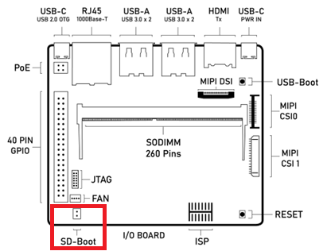

    Astra Machina Component Diagram with SD_BOOT-Boot jumper highlighted

Astra Machina's internal SPI flash comes preprogrammed with SPI U-Boot. When the
SD_BOOT-Boot jumper is connected the device will boot from the SD card inserted in the SD card slot.
If no SD card is inserted the SPI U-Boot will boot to the U-Boot prompt "=>". The U-Boot prompt
can be used to set variables, or flash the eMMC and internal SPI flash.

.. _uboot_prompt:

U-Boot Prompt with SU-Boot
--------------------------

When booting from the internal eMMC or from an SD card, SU-Boot will automatically load the Linux kernel.
However, this process can be interrupted by pressing any key in the serial console during the boot process.
If U-Boot detects a keypress then it will stop at the U-Boot prompt "=>". The U-Boot prompt can be used to
set variables, or flash the eMMC and internal SPI flash. By default the timeout in which U-Boot will wait
for input is set to 0, so key presses need to be sent before U-Boot starts.

.. _prepare_to_boot:

Updating Astra Software
=======================

On power on, Astra Machina will read the firmware, bootloader, and the
Linux Kernel from a boot device. The most common boot device is an eMMC
device on the board. This section will discuss how to write a boot image
to the eMMC and internal SPI flash.

The Astra System Image
----------------------

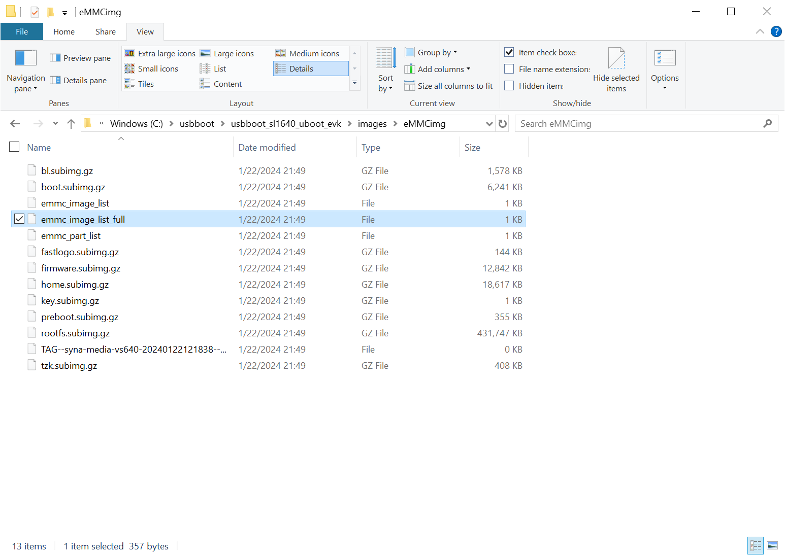

    A screenshot of the Astra image

The "Astra System Image" is a directory containing several subimg
files and emmc_part_list, emmc_image_list, and emmc_image_list_full. The
emmc_part_list describes the GUID Partition Table (GPT) which will be
used for the eMMC. The emmc_image_list\* files specify which sub image
files should be written to which partition on the eMMC.

Example SL1640 Partition Table:

================== =================================================================== ================== ===========================
Partition name     Contents                                                            Can be removed     Accessed by
================== =================================================================== ================== ===========================
factory_setting    MAC address and other factory provisioned files, used by user space No                 Linux user space
key_a              AVB keys, user keys (A copy)                                        Yes                Early boot (boot partition)
tzk_a              TrustZone Kernel (A copy)                                           Yes                Early boot (boot partition)
key_b              AVB keys, user keys (B copy)                                        Yes                Early boot (boot partition)
tzk_b              TrustZone Kernel (B copy)                                           Yes                Early boot (boot partition)
bl_a               OEM Boot loader (A copy)                                            Yes                Early boot (boot partition)
bl_b               OEM Boot loader (B copy)                                            Yes                Early boot (boot partition)
boot_a             Linux Kernel, loaded by OEM bootloader (A copy)                     No                 OEM boot loader (bl_a)
boot_b             Linux Kernel, loaded by OEM bootloader (B copy)                     No                 OEM boot loader (bl_b)
firmware_a         GPU / DSP / SM firmwares, loaded by early boot, required (A copy)   Yes                Early boot (boot partition)
firmware_b         GPU / DSP / SM firmwares, loaded by early boot, required (B copy)   Yes                Early boot (boot partition)
rootfs_a           Root file system, used by Linux, can be changed (A copy)            No                 Linux (boot_a)
rootfs_b           Root file system, used by Linux, can be changed (B copy)            No                 Linux (boot_b)
fastlogo_a         Fast logo image, loaded by OEM bootloader, can be changed (A copy)  No                 OEM bootloader (bl_a)
fastlogo_b         Fast logo image, loaded by OEM bootloader, can be changed (B copy)  No                 OEM bootloader (bl_b)
devinfo            Device information (such as serial number, mac address ) required   Yes                Early boot (boot partition)
misc               Boot control settings, required                                     Yes                Early boot (boot partition)
home               Mounted in /home, can be customized                                 No                 Linux user space
================== =================================================================== ================== ===========================

.. _update_with_uboot:

Updating Images from U-Boot
---------------------------

In addition to updating Astra Machina using the USB interface, you can also update directly from U-Boot. Astra
Machina contains a version of U-Boot written to the eMMC and to an internal SPI flash chip located on the core
module. Both instances of U-Boot allows doing image updates without using a USB host system. However, they do
require a USB-TTL cable to access the serial console. Images can be loaded using an external USB drive.

.. note::

    The version of U-Boot written to the eMMC is updated along with the system images when doing an eMMC update. The
    version of U-Boot written to the internal SPI flash is independent of the eMMC image.
    Please check the release notes to confirm that you have a compatible version of U-Boot installed
    before updating the eMMC image. :doc:`../release_notes/#release#`

Setting up the U-Boot Environment
^^^^^^^^^^^^^^^^^^^^^^^^^^^^^^^^^

Booting from U-Boot does not require any additional software on the host besides the software for using the
serial console as described in the :ref:`setup_serial_console` section above.

Hardware Setup
""""""""""""""

To access the U-Boot prompt, you will need to connect the USB cable for the
serial port as described in the :ref:`setup_serial_console` section above.
This will allow you to see console messages during the flashing process and input commands to the U-Boot
prompt. You will also need a USB drive or Ethernet cable depending on where the eMMC or SPI image files are located.
The USB drive can be inserted into any of the 4 USB Type-A USB 3.0 ports or the USB Type-C USB 2.0 port (may require
USB Type-C to USB Type-A adaptor).

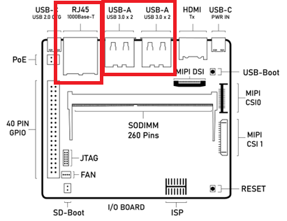

    Astra Machina Component Diagram with USB and Ethernet ports highlighted

Loading U-Boot from the eMMC
^^^^^^^^^^^^^^^^^^^^^^^^^^^^

The eMMC version of U-Boot is used to boot the OS during the normal boot up process. To access the U-Boot prompt you
will need to interrupt the standard boot process by typing keys into the serial console during boot. U-Boot will detect
the key presses and stop at the U-Boot prompt. :ref:`uboot_prompt`

Loading U-Boot from internal SPI flash
^^^^^^^^^^^^^^^^^^^^^^^^^^^^^^^^^^^^^^

To load U-Boot from the internal SPI flash, insert the the SD_BOOT jumper as described in :ref:`spi_sd_boot`.

.. note::

    Make sure that the ``SD_BOOT`` jumper is not attached when booting from eMMC. Otherwise,
    the device will boot from internal SPI flash or an SD Card.

.. _flashing_from_usb_drive:

Flashing Images from a USB Drive
^^^^^^^^^^^^^^^^^^^^^^^^^^^^^^^^

To flash an Astra system image from an external USB drive simply copy the image
directory to the USB drive. The USB drive will need a partition with a 
Fat32 formatted file system and enough capacity to fit the Astra system image.

Write the image to eMMC using the command::

    => usb2emmc eMMCimg

The parameter eMMCimg is the name of the image directory on the USB drive.

.. _flash_internal_spi:

Updating Internal SPI Flash Images using U-Boot
-----------------------------------------------

The internal SPI flash on Astra Machina can also be updated using the methods described above.
You can find the latest versions of the SPI images on `GitHub <https://github.com/synaptics-astra/spi-u-boot>`__.

Flashing Image from an External USB Drive
^^^^^^^^^^^^^^^^^^^^^^^^^^^^^^^^^^^^^^^^^

To update the internal SPI flash image using an external USB drive, simply copy the image to the drive.
The USB drive will need a partition with a Fat32 formatted file system.

Write the image to SPI flash using the following commands::

    => usb start; fatload usb 0 0x10000000 u-boot-astra-v1.0.0.sl261x.rdk.spi.bin;
    => sf probe
    => sf erase 0 0x200000
    => sf write 0x10000000 0x0 0x200000

