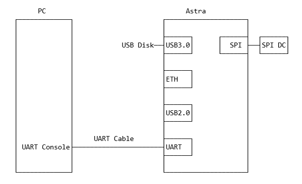
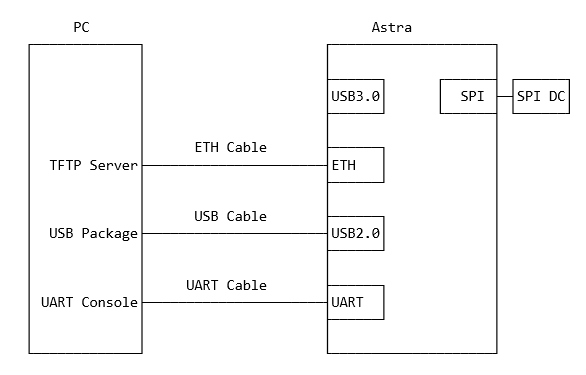
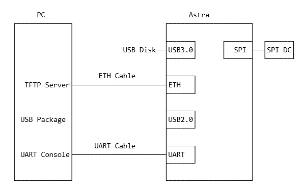

**********************
Astra Linux User Guide
**********************

Overview
========

This document describes the Synaptics Astra Linux OS environment and
Board Support Package (BSP). It provides information on the components
which make up the BSP and how to interface with them.

Supported Hardware
------------------

The following Reference Kits and platforms are covered by this guide:

-  SL1620 RDK Board

-  SL1640 RDK Board

-  SL1680 RDK Board

References
----------

-  SyNAP User Guide

Introduction
============

The Synaptics Linux Board Support Package (BSP) contains the software
and firmware required to operate the Astra SL16xx SoCs. It contains the
components needed to boot OSes and interface with the hardware. This
guide provides a description of these software components and information
on how to interface with them. This document is useful for users who
want to evaluate the Astra SL16xx class of SoCs and build products used
these processors.

This document covers the components which are used by the Linux OS. For
specific information on how to setup the build environment and build a
Yocto based image which run the on the SL16xx RDK boards please see the
`Astra Yocto User Guide <https://synaptics-astra.github.io/doc/yocto.html>`__.

Specific information about the RDK hardware can be found in the SL16xx
RDK User Guides.

Setting up the Terminal
=======================

The SL16xx RDK boards provide a serial console which displays bootloader
and OS messages to a console running on the host PC. These messages are
useful to determining the status of the board early in the boot process
or when a display is not connected. It also provides useful information
during operation.

Please see the SL16xx RDK User Guide for instructions on connecting the
USB cable to the RDK / debug board. Windows and Mac host PCs will
require an additional driver to interface for the USB to UART chip on
the RDK / debug board. Please download the appropriate driver for your
host from `Silicon Labs CP210x USB to UART Bridge VCP
Drivers <https://www.silabs.com/developers/usb-to-uart-bridge-vcp-drivers?tab=downloads>`__
page. Linux hosts generally have support for this chip enabled by
default.

Once the driver is installed the serial console can be
accessed using a serial communications program like Putty, HyperTerminal,
Tera Term, Screen, or minicom.

.. figure:: media/putty.png

    Putty terminal emulator

Booting Linux
=============

Before the Linux Kernel begins executing on the Synaptics Astra
Processor, low level firmware and software initializes the hardware and
prepares the system for boot. This chapter provides an overview of the
software components which prepare the system for booting the Linux Kernel. It
will also describe how to prepare a boot device from which the software
will be loaded.

Software Overview
-----------------

The Synaptics Astra Processor uses a multistage boot process. This
section gives a brief description of each component.

Preboot Firmware
^^^^^^^^^^^^^^^^

The Preboot firmware is a collection of low level firmware which
initializes specific hardware components and loads the software which
runs in the Arm TrustZone environment. Once the Preboot firmware
completes, execution will be transferred to the bootloader. The Preboot
firmware is provided as binary images which are written to the boot
device.

Bootloader
^^^^^^^^^^

The Synaptics Astra Processors use the Synaptics U-Boot (SUBoot)
bootloader to do additional hardware initialization and to boot the
Linux Kernel. SUBoot is based on the open source U-Boot project. (`U-Boot Documentation <https://docs.u-boot.org/en/latest/>`__)

Linux Kernel and Device Tree
^^^^^^^^^^^^^^^^^^^^^^^^^^^^

Synaptics Astra Processor primarily run OSes which use the Linux
Kernel. The Linux Kernel provides the environment in which applications
run and it manages resources such as CPU, memory, and devices.
Generally, the Linux Kernel will be built as part of the Yocto build
process described in the Astra Yocto User Guide.

The Linux kernel uses Device Tree data structures to describe the
hardware components and their configurations on the system. The device
tree source files are in the Linux Kernel source tree under that path
``arch/arm64/boot/dts/synaptics/``. These files are maintained in the `Astra Linux Kenel Overlay repository <https://github.com/synaptics-astra/linux_5_15-overlay>`__

Root File System
^^^^^^^^^^^^^^^^

The root file system (rootfs) contains all the user space binaries and
libraries needed to execute programs in the Linux OS along with system
configuration files. The prebuilt images use Yocto to build the rootfs.
Instructions on how to build and configure a rootfs using Yocto can be
found in the Astra Yocto User Guide.

U-Boot
------

As mentioned in Section 4.1.2 the Synaptics Astra Processor uses U-Boot
as its bootloader. There are three types of U-Boot which are used with
the processor. In addition to SUBoot there are SPI U-Boot and USB U-Boot
variants which are used to flash or recover a board.

========== ================================================
image type image usage
========== ================================================
SPI U-Boot burn eMMC image via TFTP/USB host
USB U-Boot burn eMMC image via TFTP/USB slave
SUBoot     burn eMMC image via TFTP/USB host, Booting Linux
========== ================================================

USB U-Boot and SPI U-Boot are used to boot a board which does not have
an image written to the eMMC or to do a update which overwrites all of
the contents of the eMMC.

USB U-Boot allows the board to receive a copy of the USB version of
U-Boot over the USB interface. The host PC runs the usbboot tool
to transfer the USB U-Boot image to the board and execute it. Once USB U-Boot
is running on the board it can be used to write an image to the eMMC.

SPI U-Boot is similar to USB U-Boot except that U-Boot runs from
SPI flash. The SPI flash may be located on the main board of the RDK or
it may be a located on a SPI duagher card which is pluged into the board.
Once SPI U-Boot is running on the board it can be used to write an image to the eMMC.

.. _prepare_to_boot:

Preparing the Boot Device
-------------------------

On power on the Synaptics Astra Processor will read the firmware, the
bootloader, and the Linux Kernel from a boot device. The most common
boot device is an eMMC device on the board. This section will discuss
how to write a boot image to the eMMC.

Setting up the USB Boot Environment
^^^^^^^^^^^^^^^^^^^^^^^^^^^^^^^^^^^

Booting from USB requires the usbboot software tool to the installed on
a host PC along with the Synaptics WinUSB Driver on Windows. It also
requires setting up the serial console as described in the 
``Setting up a Terminal`` section above. This section covers how to configure
the PC and prepare for USB booting.

Hardware Setup
""""""""""""""

To run usbboot you will need to connect the USB cable for the serial
port as described in the ``Setting up a Terminal`` section above.
This will allow you to see console messages during the flashing process.
You will also need to connect a USB cable from the host PC to the micro USB 2.0 port of the board.

    Hardware setup for USB boot

Installing the WinUSB Driver on Windows
"""""""""""""""""""""""""""""""""""""""

Windows requires a special USB kernel driver to communicate with the
Astra board over USB. Please download the driver from
`GitHub <https://github.com/synaptics-astra/usb-tool>`__. Linux and Mac hosts
can access the Astra board from userspace and do not need any additional
kernel drivers.

After downloading and decompressing the USB Boot software package, right
click on the ``SYNA_WinUSB.inf`` file in the ``Synaptics_WinUSB_Driver``
directory. Select "Install" from the drop down menu.

.. figure:: media/install_driver_win.png

    Install the driver

After installing the driver, the Astra board will show up in
the Windows Device Manager as the "Synaptics IoT: Tools package USB
Driver for Synaptics Processors" when operating in USB Boot mode.

.. figure:: media/devices_win.png

    Devices listed by the operating system after installing the driver

Running the USBBoot Tool
""""""""""""""""""""""""

Also included in the Synaptics usb-tool package is the usbboot userspace
tool. This is the tool which communicates with the Astra board over USB.
Each Astra RDK board will have its own usbboot directory. Included in each
directory will be the ``usbboot.exe`` binary, the ``run.bat`` script, support
DLLs, and an images directory which contains all of the images needed to
boot the board. This include images which contain the USB U-Boot
bootloader. To run the tool simply double click on the run.bat file. This
script will execute the binary using the specific options required for
your RDK board.

.. figure:: media/usb_user_tool_win.png

    Directory containing the USBBoot tool on Windows

After running the ``run.bat`` file two windows will open. The main window
will show the status of the flash process and the second window is a
telnet session which may be used to send command (otherwise the serial
console will be used to send commands).

.. figure:: media/usbtool_output_win.png

    Output of the usbtool program on Windows

Booting using USBBoot
"""""""""""""""""""""

Once the usbboot environment has been setup and the usbboot tool is
running on the host PC, the Astra board will need to be placed into USB
Boot mode. To do that press and hold the "USB-Boot" button on the
RDK board. Then press and release the "Reset" button. Be sure to hold
the "USB-Boot" button long enough so that the board can reset and detect
that the button is pressed. After booting into USB Boot mode the U-Boot
prompt "=>" will be displayed in the serial console or telnet session.

.. figure:: media/usb_boot_output_win.png

    Output of the usbboot tool and the serial console after successful boot

Setting up the SPI Boot Environment
^^^^^^^^^^^^^^^^^^^^^^^^^^^^^^^^^^^

Booting from SPI does not require any additional software on the host
besides the software for using the serial console as described in the
``Setting up a Terminal`` section above.

Hardware Setup
""""""""""""""
For SPI boot, you will need to connect the USB cable for the
serial port as described in the ``Setting up a Terminal`` section above.
This will allow you to see console messages during the flashing process.
You will also need a USB Disk or Ethernet cable depending on where the eMMC
image files are located.

If your board does not have SPI flash integrated onto the main board, then connect 
the external SPI daughter card before powering on the board. The SPI daughter card
is labeled ``SPI DC`` in the figure below.

    Hardware setup to perfom SPI boot

Booting using SPI Boot
""""""""""""""""""""""

If the SPI flash contains a valid SPI U-Boot image then the board will boot from SPI.

Booting using SUBoot
""""""""""""""""""""

SUBoot is the standard bootloader stored in the eMMC. By default, the
board will boot from the eMMC if there are valid images stored in the
eMMC. SUBoot can also be used to update the eMMC from the U-Boot prompt.
To access the U-Boot prompt type any character into the serial console
before then message "Hit any key to stop autoboot: 0". This will
interrupt the normal boot process and allow inputting of U-Boot
commands.

    Hardware setup for updating images with SUBoot

Flashing Images from USB Host
^^^^^^^^^^^^^^^^^^^^^^^^^^^^^

Flashing eMMC Image
"""""""""""""""""""

    Directory with files used to flash the eMMC image

When booting from USB, the usbboot tool allows transferring
the eMMC image directly over the USB interface. To flash the eMMC using
USB, first copy the directory containing the image files to the "images"
directory in the usbboot tool directory for your Astra RDK board.

Write the image to the eMMC using the command::

    => l2emmc eMMCimg

The parameter eMMCimg is the name of the image directory under the usbboot
tool's images directory.

Flashing Image to SPI Flash
^^^^^^^^^^^^^^^^^^^^^^^^^^^

.. figure:: media/spi_flash_snapshot.png

    Directory with files used to flash the SPI flash

USBBoot can also be used to program the SPI flash. To program the SPI
flash, copy the SPI image file to the "images" directory in the usbboot
tool's directory for your Astra RDK board.

Write the image to the SPI flash using the commands::

    => usbload spi_uboot_en.bin 0x10000000
    => spinit; erase f0000000 f02fffff; cp.b 0x10000000 0xf0000000 0x300000;

.. note::
    Connect the external SPI daughter card after the U-Boot prompt is displayed (if applicable).

Flashing Images from External Storage
^^^^^^^^^^^^^^^^^^^^^^^^^^^^^^^^^^^^^

SPI U-Boot and SUBoot allow flashing images which are stored on external
storage. Astra platforms support reading an image from an external USB
device plugged directly into the Astra RDK or by using the ethernet port
to download the image from a TFTP server.

Flashing Images from a USB Drive
^^^^^^^^^^^^^^^^^^^^^^^^^^^^^^^^

To flash an Astra image from an external USB drive simply copy the image
directory to the USB drive. The USB drive will need a partition witha a 
Fat32 formatted file system with enough capacity to fit the Astra image.
Insert the USB drive into either the USB 3.0 or USB 2.0 ports on the board
and boot to the U-Boot prompt. All three U-Boot types support flashing from an
external USB drive.

Write the image to eMMC using the command::

    => usb2emmc eMMCimg

Write the SPI image to the SPI flash using the command::

    => usb start; fatload usb 0 0x10000000 spi_uboot_en.bin;
    => spinit; erase f0000000 f02fffff; cp.b 0x10000000 0xf0000000 0x300000;

.. note::
    Connect the external SPI daughter card after the U-Boot prompt is displayed (if applicable).

Flashing Images from a TFTP Server
^^^^^^^^^^^^^^^^^^^^^^^^^^^^^^^^^^

To flash an Astra image from a TFTP server you will first need to
connect the Astra board to a local network using the ethernet port. Copy the
Astra image to the TFTP server so that it can be accessed by the board
over the network. Once the board is connected to the network, boot to
the U-Boot prompt. All three U-Boot types support flashing from a TFTP
server.

Initialize networking and request an IP address from a DHCP server on the local network::

    => net_init; dhcp; setenv serverip 10.10.10.10;
    
Write the image to eMMC from the TFTP server using the command::

    => tftp2emmc eMMCimg

Write the SPI image to the SPI flash from the TFTP server using the
command::

    => net_init; dhcp; setenv serverip 10.10.10.10;
    => tftp2emmc eMMCimg

.. note::

    In the examples above the TFTP server's address is
    10.10.10.10. Please replace this IP with the IP address of the server
    hosting TFTP.

    Hardware setup for USB boot and a TFTP server

    Hardware setup for SPI boot and a TFTP server

The Astra Image
---------------

.. figure:: media/astra_image.png

    A screenshot of the Astra image

The "Astra Image" is a directory containing several subimg
files and emmc_part_list, emmc_image_list, and emmc_image_list_full. The
emmc_part_list describes the GUID Partition Table (GPT) which will be
used for the eMMC. The emmc_image_list\* files specify which sub image
files should be written to which partition on the eMMC.

Example SL1640 Partition Table:

================== ================================================================== ================== ===========================
Partition name     Contents                                                           Can be removed     Accessed by
================== ================================================================== ================== ===========================
factory_setting    MAC address and other factory provisioned files, used by userspace No                 Linux Userspace
key_a              AVB keys, user keys (A copy)                                       Yes                Early boot (boot partition)
tzk_a              TrustZone Kernel (A copy)                                          Yes                Early boot (boot partition)
key_b              AVB keys, user keys (B copy)                                       Yes                Early boot (boot partition)
tzk_b              TrustZone Kernel (B copy)                                          Yes                Early boot (boot partition)
bl_a               OEM Boot loader (A copy)                                           Yes                Early boot (boot partition)
bl_b               OEM Boot loader (B copy)                                           Yes                Early boot (boot partition)
boot_a             Linux Kernel, loaded by OEM bootloader (A copy)                    No                 OEM boot loader (bl_a)
boot_b             Linux Kernel, loaded by OEM bootloader (B copy)                    No                 OEM boot loader (bl_b)
firmware_a         GPU / DSP / SM firmwares, loaded by early boot, required (A copy)  Yes                Early boot (boot partition)
firmware_b         GPU / DSP / SM firmwares, loaded by early boot, required (B copy)  Yes                Early boot (boot partition)
rootfs_a           Root file system, used by Linux, can be changed (A copy)           No                 Linux (boot_a)
rootfs_b           Root file system, used by Linux, can be changed (B copy)           No                 Linux (boot_b)
fastlogo_a         Fast logo image, loaded by OEM bootloader, can be changed (A copy) No                 OEM bootloader (bl_a)
fastlogo_b         Fast logo image, loaded by OEM bootloader, can be changed (B copy) No                 OEM bootloader (bl_b)
devinfo            Device information (such as serial number, mac address ) required  Yes                Early boot (boot partition)
misc               Boot control settings, required                                    Yes                Early boot (boot partition)
home               Mounted in /home, can be customized                                No                 Linux Userspace
================== ================================================================== ================== ===========================

Booting Linux
-------------

By default, the Astra board will boot into linux if a valid image has
been written to the eMMC when the board is powered on. After writing an
image to the eMMC, issue the reset command in U-Boot. Press the "Reset"
button on the board, or power cycle the board to boot into Linux.

U-Boot reset command::

    => reset

.. _linux_login:

Linux OS Login
--------------

After Linux successfully boots a login prompt will be displayed in the
serial console. To login use the username ‘root'. The default password
is empty.

.. figure:: media/successful_boot_win.png

    Successful boot seen in Putty

.. _multimedia:

Multimedia
==========

The Synaptics Astra SoCs contain hardware and software components which accelerate
the processing of multimedia workloads. The Linux BSP provides Gstreamer
plugins which allow users to develop programs which utilize these
multimedia components to improve multimedia performance. This chapter
provides an overview on how to use the Gstreamer command line interface
to build pipelines using these plugins. More in depth information on how
to use Gstreamer on Astra processors can be found in the Astra
Gstreamer User Guide. Information on the Gstreamer framework can be
found at https://gstreamer.freedesktop.org/.

Gstreamer Plugins
-----------------

Gstreamer uses plugin modules which are used to extend Gstreamer functionality.
The Astra platform uses plugins to allow its hardware components to be used
in a Gstreamer pipeline. The tables below list plugins which are used by
the codecs support by the Astra platform.

Video Codes
^^^^^^^^^^^

========= ================= ================== ==================
Codec     Parser Plugin     Decoder Plugin     Encoder Plugin
========= ================= ================== ==================
H.264     h264parse         v4l2h264dec        v4l2h264enc
H.265     h265parse         v4l2h265dec        None
VP8       N/A               v4l2vp8dec         v4l2vp8enc
VP9       vp9parse          v4l2vp9dec         None
AV1       av1parse          v4l2av1dec         None
========= ================= ================== ==================

Audio Codecs
^^^^^^^^^^^^

========= ================= ================== ==================
Codec     Parser Plugin     Decoder Plugin     Encoder Plugin
========= ================= ================== ==================
AAC       aacparse          fdkaacdec          fdkaacenc
Vorbis    N/A               vorbisdec          vorbisenc
========= ================= ================== ==================

Gstreamer Examples
------------------

To run the following Gstreamer examples please make sure to set the
following variables in your environment. These variables may need to be
set when running commands from the serial console or a remote shell::

    export XDG_RUNTIME_DIR=/var/run/user/0
    export WAYLAND_DISPLAY=wayland-1

The ``XDG_RUNTIME_DIR`` variable specifies the directory which contains the
wayland socket belonging to the user. The ``WAYLAND_DISPLAY`` variable
specifies which Wayland compositor to connect to.

The following examples use the gst-launch-1.0 command line program to
construct a pipeline and begin playing it. The gst-launch-1.0 command
takes in a list of element types separated by exclamation points.
Elements can also contain optional properties. (see `GStreamer documentation <https://gstreamer.freedesktop.org/documentation/tutorials/basic/gstreamer-tools.html?gi-language=c>`__ for more details).
The examples below will show the structure of the command with a brief description.
Followed by one or more examples.

Media Playback
^^^^^^^^^^^^^^

.. _audio_sinks:

Audio Sinks
"""""""""""

The following examples use the ALSA audio sink to output audio using the ALSA
audio API (for more details refer to the `Gstreamer documentation <https://gstreamer.freedesktop.org/documentation/alsa/alsasink.html?gi-language=c#alsasink>`__ for more details).
The examples use the device hw:0,9 which corresponds to
the HDMI output device. Hardware devices can be found in the file
/proc/asound/pcm. Below is an example of the pcm devices on an SL1680
board. Device 0-9 corresponds to the HDMI device and will be used in the
examples below.

Example /proc/asound/pcm output from SL1680::

    root@sl1680:~# cat /proc/asound/pcm
    00-00: soc-i2so1 snd-soc-dummy-dai-0 :  : playback 1
    00-01: soc-spdifo snd-soc-dummy-dai-1 :  : playback 1
    00-02: soc-dmic snd-soc-dummy-dai-2 :  : capture 1
    00-03: soc-i2si2 snd-soc-dummy-dai-3 :  : capture 1
    00-04: soc-i2si3 snd-soc-dummy-dai-4 :  : capture 1
    00-05: soc-i2s-pri-lpbk snd-soc-dummy-dai-5 :  : capture 1
    00-06: soc-i2s-hdmi-lpbk snd-soc-dummy-dai-6 :  : capture 1
    00-07: soc-spdifi snd-soc-dummy-dai-7 :  : capture 1
    00-08: soc-i2s-earc snd-soc-dummy-dai-8 :  : capture 1
    00-09: soc-hdmio snd-soc-dummy-dai-9 :  : playback 1
    01-00: USB Audio : USB Audio : capture 1

Video Sinks
"""""""""""

The following examples use the Wayland video sink to create a window and
render the decoded frames (see `GStreamer documentation <https://gstreamer.freedesktop.org/documentation/waylandsink/index.html?gi-language=c#waylandsink>`__ for more details)

Audio playback
^^^^^^^^^^^^^^

Playing audio files involves reading and parsing the encoded audio data,
decoding the data, and outputting it to the audio sink. Some data
formats and audio sinks may also need to convert and resample the data
before sending it to the audio sink::

    gst-launch-1.0 filesrc location=audio_file ! parser ! decoder ! [ convert ] ! [ resample ] ! audiosink

This example plays an MP3 file using the speakers of the attached HDMI
device::

    gst-launch-1.0 filesrc location=audio_file.mp3 ! mpegaudioparse ! mpg123audiodec ! audioconvert ! audioresample ! alsasink device=hw:0,9

Video playback
^^^^^^^^^^^^^^

Playing a video file involves reading the file, demuxing a video stream,
parsing the encoded data, and decoding the data using the video decoder.
Finally the decodef frames our output to the video sink::

    gst-launch-1.0 filesrc location=video_file ! demux ! queue ! parser ! decoder ! videosink

The following example plays the main video stream of an MP4 file and
displays the video using Wayland. In this example the video is encoded
with H265::

    gst-launch-1.0 filesrc location=test_file.mp4 ! qtdemux name=demux demux.video_0 ! queue ! h265parse ! v4l2h265dec ! waylandsink fullscreen=true

A similar example, but with a file using AV1 encoding::

    gst-launch-1.0 filesrc location=test_file.mp4 ! qtdemux name=demux demux.video_0 ! queue ! av1parse ! v4l2av1dec ! waylandsink fullscreen=true

Audio / Video file playback
^^^^^^^^^^^^^^^^^^^^^^^^^^^

Playing a file which contains both audio and video streams requires
creating a pipeline which parses and decodes both streams::

    gst-launch-1.0 filesrc location=test_file.mp4 ! qtdemux name=demux demux.video_0 ! queue ! av1parse ! v4l2av1dec ! waylandsink fullscreen=true

Play an MP4 file with a H265 encoded video stream end an AAC encoded
audio stream::

    gst-launch-1.0 filesrc location=test_file.mp4  ! qtdemux name=demux \
        demux.video_0 ! queue ! h265parse ! v4l2h265dec ! queue ! waylandsink fullscreen=true \
        demux.audio_0 ! queue ! aacparse ! fdkaacdec ! audioconvert ! alsasink device=hw:0,9

Recording
^^^^^^^^^

Audio recording
"""""""""""""""

Recording audio involves reading data from a capture device like a
microphone, converting, encoding, and multiplexing the data before
writing it to an output file::

    gst-launch-1.0 -v alsasrc device=device ! queue ! convert ! encode ! mux ! filesink location=output file

The following example records audio from the ALSA capture device 0,2. It
then converts the raw data into a format which can encoded by the Vorbis
encoder. Once the data is encoded it is then multiplexed into an Ogg
container file and written to the file /tmp/alsasrc.ogg::

    gst-launch-1.0 -v alsasrc device=hw:0,2 ! queue ! audioconvert ! vorbisenc ! oggmux ! filesink location=/tmp/alsasrc.ogg

Camera
^^^^^^

Astra platforms support USB (UVC) cameras with the V4L2 driver stack.
This stack can be used with Gstreamer to construct pipelines using a
camera.

To display video captured from a camera to output it to the video sink::

    gst-launch-1.0 v4l2src device=/dev/videoX ! "video data,framerate,format,width,height" ! video sink

The following example reads captured data from the V4L2 device
/dev/video2 and applies the capabilities filter before sending the
output to the wayland sink::

    gst-launch-1.0 v4l2src device=/dev/video2 ! "video/x-raw,framerate=30/1,format=YUY2,width=640,height=480" ! waylandsink fullscreen=true

Gstreamer Playbin Plugin
^^^^^^^^^^^^^^^^^^^^^^^^

Astra platforms contain the Gstreamer playbin plugin. This plugin can
automatically determine what type of pipeline to construct based on
automatic file type recognition (see `Gstreamer documentation <https://gstreamer.freedesktop.org/documentation/playback/playbin.html?gi-language=c>`__). This simplifies pipeline creation.

Playbin will autodetect the media file located at the specified uri and create a
pipeline for it. It will then display the video on the video sink and
render the audio on the audio sink. The video-sink and audio-sink
parameters are optional. I they are not included the default video and
audio sinks will be used instead::

    gst-launch-1.0 playbin uri=file:///path/to/file video-sink="video sink" audio-sink="audio sink"

Using playbin the example in :ref:`audio_sinks` can be reduced to::

    gst-launch-1.0 playbin uri=file:///path/to/file video-sink="waylandsink fullscreen=true" audio-sink="alsasink device=hw:0,9"

GStreamer SyNAP Plugin
^^^^^^^^^^^^^^^^^^^^^^

The Astra platform provides a Gstreamer plugin which allows adding ML processing to Gstreamer pipelines.
This plugin uses the SyNAP framework to interface with the hardware accelerators to improve the performance
of ML processing. For information on SyNAP see :ref:`synap` below.

The SyNAP plugin works as a Gstreamer appsrc and appsink. It takes samples from the pipeline and uses the SyNAP
framework to perform classification or detection on the frame using a neural network. It then outputs the results in
as JSON formatted data.

We provide a `sample application <https://github.com/synaptics-astra/application-gstreamer-plugins-syna/tree/v#release#/examples/gst-ai>`__
which plays a video while simultaneously performing image classification on the video frames and then overlaying labels of the
classification results onto the video output. A prebuilt version of the application is included in the Astra image.

Run the example application using the following command::

    gst-ai --appmode=IC --input=test_file.mp4 --output=screen --paramfile=/usr/share/gst-ai/ic.json

Connectivity
============

Bluetooth and Wi-Fi are supported on Astra platforms through on-board chip
solutions and external hardware. The following table lists the various
on-board chips and external solutions:

============ =============== ===================== ========================================================
SL Processor Wireless Device Physical Interface    Software Information
                                                  
                             (M.2 PCIe / M.2 SDIO)
============ =============== ===================== ========================================================
SL1620       SYNA 43456      M.2 SDIO              - wpa_supplicant v3.0 enterprise (excluding 192bit mode)
                                                  
                                                   - WIFI driver version:
SL1620       SYNA 43711      M.2 SDIO              - wpa_supplicant v3.0 enterprise (excluding 192bit mode)
                                                  
                                                   - WIFI driver version:
SL1640       SYNA 43752      M.2 PCIe              - wpa_supplicant v2.10
                                                  
                                                   - WIFI driver version: v101.10.478
SL1640       SYNA 43756E     M.2 PCIe             
SL1680       SYNA 43752      M.2 PCIe             
SL1680       SYNA 43756E     M.2 PCIe             
============ =============== ===================== ========================================================

The Synaptics Astra Linux BSP contains all of the drivers and firmware required to use the 43xxx modules with both PCIe and SDIO interfaces.
Wireless network management is handled by the WPA Supplicant daemon which key negotiation with a WPA Authenticator. It supports WEP, WPA, WPA2, and WPA3
authentication standards. ( See `wpa_supplicant <https://wiki.archlinux.org/title/wpa_supplicant>`__ for more details)

Setting up Wifi with WPA Supplicant
------------------------------------
The following setcion describes how to setup Wifi on the Astra platform using WPA Supplicant.

Generate the WPA Prehared key
^^^^^^^^^^^^^^^^^^^^^^^^^^^^^
Generating a preshared key from a passphrase avoids having to store the passphrase in the WPA Supplicant config file.

From the shell, use the wpa_passphrase command line tool to generate a WPA preshared key from a passphrase::

    root@sl1680:^# wpa_passphrase network_name 12345678
    network={
        ssid="network_name"
        psk=5ba83b0673ea069dafe5d5f1af8216771c13be6ad6f11dac9dc0e90b0c604981
    }

Bringing up the wlan interface
^^^^^^^^^^^^^^^^^^^^^^^^^^^^^^

Use ifconfig to instruct the kernel to bring up the wlan interface::

    ifconfig wlan0 up

Creating the WPA Supplicant Configuration File
^^^^^^^^^^^^^^^^^^^^^^^^^^^^^^^^^^^^^^^^^^^^^^

WPA Supplicant uses a config file to configure the Wifi connection. This configuration file is located in /etc/wpa_supplicant.

Create the /etc/wpa_supplicant directory::

    mkdir -p /etc/wpa_supplicant

Create the file /etc/wpa_supplicant/wpa_supplicant-wlan0.conf with options for your Wifi Network.

Contents of an example wpa_supplicant-wlan0.conf::

    ctrl_interface=/var/run/wpa_supplicant
    ctrl_interface_group=0
    update_config=1

    network={
        ssid="network_name"
        psk=5ba83b0673ea069dafe5d5f1af8216771c13be6ad6f11dac9dc0e90b0c604981
        key_mgmt=WPA-PSK
        scan_ssid=1
    }

Configure systemd-networkd
^^^^^^^^^^^^^^^^^^^^^^^^^^

The wlan interface needs to be enabled in the systemd-networkd system daemon configuration.

Create the new file /etc/systemd/network/25-wlan.network with the following contents::
 
    [Match]
    Name=wlan0

    [Network]
    DHCP=ipv4

Enable Wifi Services
^^^^^^^^^^^^^^^^^^^^
The network daemons need to be restarted to load the new configuration.

Restart network daemons::

    systemctl restart systemd-networkd.service
    systemctl restart wpa_supplicant@wlan0.service

Enable wpa_supplicant on boot up::

    systemctl enable wpa_supplicant@wlan0.service

.. _synap:

Machine Learning with SyNAP
===========================

The Synaptics Astra platform provides the SyNAP framwork, which supports the execution of neural networks on the 
platforms hardware accelerators. This framework allows users to run programs which take advantage of the Neural Prococessing Unit (NPU)
and Graphics Processing Unit (GPU) to accelerate the excecution of neural networks. (see the `SyNAP documentation <https://synaptics-synap.github.io/doc/v/3.0.0/>`__ for more details.)
