****************************
Astra Yocto Linux User Guide
****************************

Overview
========

This document describes the Synaptics Astra Linux OS environment and
Board Support Package (BSP). It provides information on the components
which make up the BSP and how to interface with them.

Supported Hardware
------------------

The following Reference Kits and platforms are covered by this guide:

-  Astra Machina (Foundation) SL1620

-  Astra Machina (Foundation) SL1640

-  Astra Machina (Foundation) SL1680

References
----------

-  `SyNAP User Guide <https://synaptics-synap.github.io/doc/v/latest/>`__

Introduction
============

The Synaptics Linux Board Support Package (BSP) contains the software
and firmware required to operate Astra Machina. It contains the
components needed to boot OSes and interface with the hardware. This
guide provides a description of these software components and information
on how to interface with them. This document is useful for users who
want to evaluate Astra Machina and build products using these processors.

This document covers the components which are used by the Linux OS. For
instructions on setting up the build environment and creating a Yocto-based
image for Astra Machina, please see the :doc:`/yocto`.

Specific information about the Astra Machina hardware can be found on the :doc:`/hw/index` page
and source code repositories can be found on the `Synaptics Astra GitHub page <https://github.com/synaptics-astra>`__.

Interfacing with Astra Machina
==============================

Several methods exist for interfacing with Astra Machina, including using a graphical desktop
on an external display. Additionally, Shell access is available through SSH, ADB, and the serial console.

The Graphical Desktop
---------------------

Astra Machina's graphical desktop is enabled by default. It can be displayed on an external display connected
to the HDMI port or a MIPI display. Input can be provided by connecting a standard HID USB keyboard and mouse.
The Wayland / Weston display server is used by default, but Astra Machina can be configured to use X11 instead
when building a custom image. :doc:`/yocto`

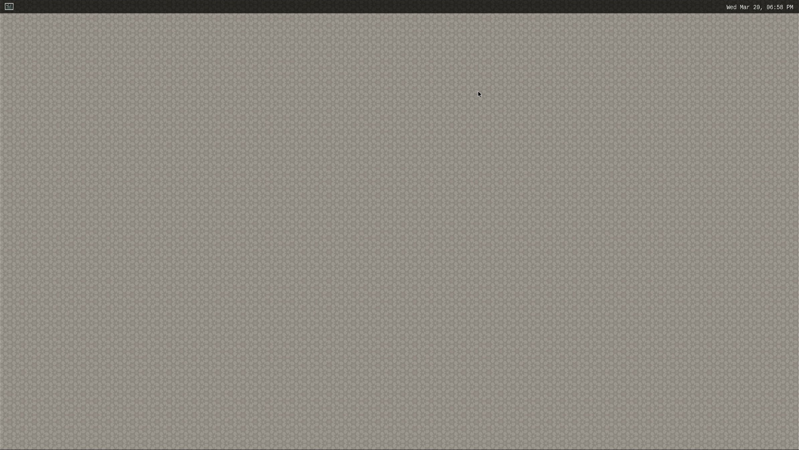

    The Wayland Desktop on Astra Machina

Clicking on the icon in the top left corner will open a terminal.

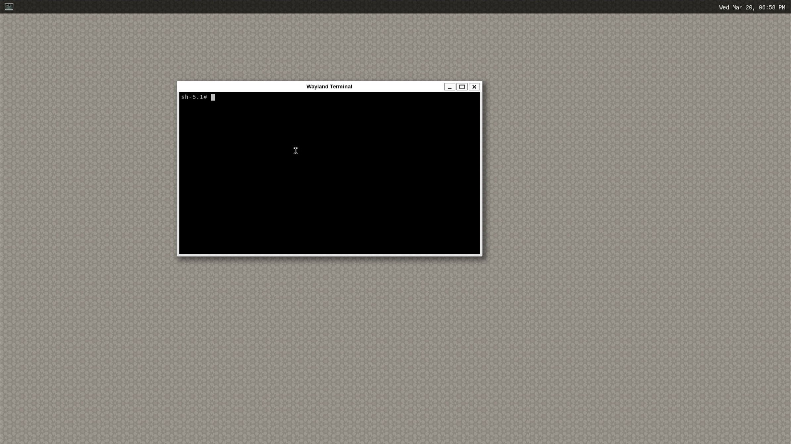

    The Wayland Desktop with a terminal open

X11 Support
^^^^^^^^^^^

X11 supports two desktop environments. By default, SL1680 is configured to use `XFCE4 <https://www.xfce.org/>`__ and SL1620 / SL1640
use `Matchbox <https://layers.openembedded.org/layerindex/recipe/300718/>`__.

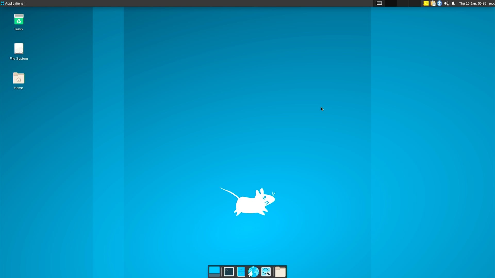

    The XFCE4 Desktop Environment on SL1680

.. figure:: media/sl1680-xfce4-windows.jpg

    The XFCE4 Desktop Environment with a terminal and file manager on SL1680

    The Matchbox Desktop Environment on SL1640

    The Matchbox Desktop Environment with a terminal open on SL1640

.. note::

    On SL1620, the output mode has to be set explicitly to avoid scaling issues::

        export DISPLAY=:0
        xrandr -s 800x480

.. note::

    PulseAudio is not configured so X11 media players like ``Parole`` will not have
    working audio.

Dual Displays
^^^^^^^^^^^^^

SL1620 and SL1680 support dual display configurations. SL1620 supports a TFT display plus an HDMI display
(via onboard DSI to MIPI converter on REV D boards). SL1620 can also be configured to use a MIPI panel instead
of HDMI by enabling a device tree overlay. Astra Machina include device tree overlays for the Waveshare panel
``myna2-ws-panel-overlay.dtbo`` and the Haier panel ``myna2-haier-panel-overlay.dtbo``.

SL1680 supports an HDMI display plus a MIPI DSI. By default, the Waveshare panel is enabled as the secondary display.
But, Astra Machina supports using the Haier panel by enabling the ``dolphin-haier-panel-overlay.dtbo`` device tree overlay.
Both displays can be configured to run Weston, KMS, or a combination of Weston + KMS.

.. note::

    Mirroring of display output is not supported, except on SL1620 with X11 and the Matchbox Windows Manager.

.. note::

    Dual Display is supported with X11 with SL1620 (screen replication) and SL1680.

The Shell with SSH
------------------

Astra Machina has ssh enabled by default. It will accept connections from ssh
clients over the network. Login with the username ``root``. No password is required::

    ssh root@10.10.10.100

.. note::

    In the examples above the Astra Machina's address is
    10.10.10.100. Please replace this IP with the IP address of your device.

.. _adb_shell_guide:

The Shell with ADB
------------------

Astra Machina supports Android Debug Bridge (ADB) over USB. ADB is used on Android devices and has been
ported to Astra Machina. Google provides extensive documentation on ADB `here <https://developer.android.com/tools/adb>`__.

To use ADB connect a USB cable from the host system to the USB Type-C USB 2.0 port on Astra Machina (next to the ethernet port).

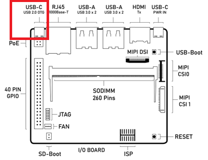

    Astra Machina Component Diagram with USB Type-C USB 2.0 port highlighted

Google provides versions of ADB for Mac, Linux, and Windows. Once ADB is installed run ``adb devices`` to see all ADB devices
connected to the host. Then run::

    adb shell

Or if there is more then one ADB device::

    adb -s SL16x0 shell

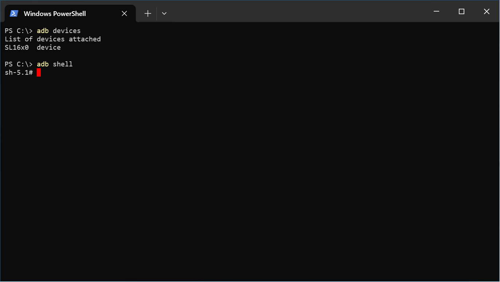

    Using ADB with Windows Powershell

The Serial Console
------------------

Astra Machina provides a serial console which displays bootloader
and OS messages to a terminal emulator running on the host system. These messages are
useful for determining the status of Astra Machina early in the boot process
or when a display is not connected. It can also provides useful information
during operation. The serial console is also needed during the software update process.

.. _setup_serial_console:

Setting up the Serial Console
^^^^^^^^^^^^^^^^^^^^^^^^^^^^^

The serial console on Astra Machina can be accessed by connecting a USB-TTL adaptor to
the RX, TX, and GND pins of the 40 pin GPIO connector. USB-TTL adaptors can either be a board
with jumper wires or an integrated USB cable with separated pins. 

=======    =============
USB TTL    Astra Machina
=======    =============
GND        GND (Pin 6)
RXD        TX  (Pin 8)
TXD        RX  (Pin 10)
=======    =============

.. note::

    RX and TX pins operate at a typical voltage of 3.3V

The following USB-TTL adaptors are officially approved to work with Astra Machina:

`Adafruit USB to UART Debug / Console Cable (CP2102 Driver IC) <https://www.adafruit.com/product/954#technical-details>`_

    +----------------+---------------+-------------------------------------+------------------------------------+
    | Pin Function   | Color Code    | Astra SL16x0 40-pin Connector       | Astra SL16x0 40-pin Function       |
    +================+===============+=====================================+====================================+
    | 5V-Out         | Red           | NC                                  | NC                                 |
    +----------------+---------------+-------------------------------------+------------------------------------+
    | TX-Out         | Green         | Pin-10                              | UART0_Rx-In                        |
    +----------------+---------------+-------------------------------------+------------------------------------+
    | RX-In          | White         | Pin-8                               | UART0_Tx-Out                       |
    +----------------+---------------+-------------------------------------+------------------------------------+
    | GND            | Black         | Pin-6                               | GND                                |
    +----------------+---------------+-------------------------------------+------------------------------------+

`CenryKay USB to UART Debug / Console Cable (CH340G Driver IC)`

    +----------------+---------------+-------------------------------------+------------------------------------+
    | Pin Function   | Color Code    | Astra SL16x0 40-pin Connector       | Astra SL16x0 40-pin Function       |
    +================+===============+=====================================+====================================+
    | 5V-Out         | Red           | NC                                  | NC                                 |
    +----------------+---------------+-------------------------------------+------------------------------------+
    | TX-Out         | Green         | Pin-10                              | UART0_Rx-In                        |
    +----------------+---------------+-------------------------------------+------------------------------------+
    | RX-In          | White         | Pin-8                               | UART0_Tx-Out                       |
    +----------------+---------------+-------------------------------------+------------------------------------+
    | GND            | Black         | Pin-6                               | GND                                |
    +----------------+---------------+-------------------------------------+------------------------------------+

.. note::

    USB-TTL cables using PL2303 or FT232R driver ICs are not approved parts for use with Astra Machina.

.. figure:: media/usb-ttl-board.png

    Example USB TTL board

.. figure:: media/usb-ttl-cable.png

    Example USB TTL cable

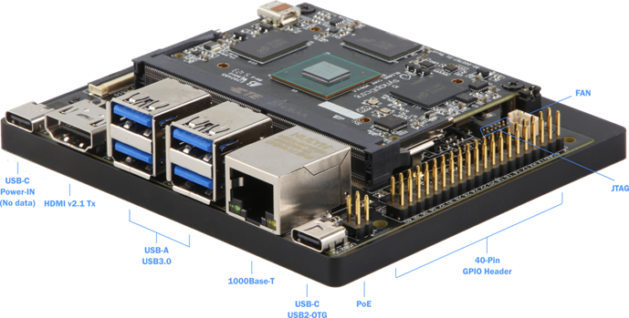

    Astra Machina with 40 GPIO Header labeled

.. figure:: media/40-pin-connector.png

    Astra Machina's 40 Pin GPIO Header pinout

Some USB-TTL adaptors require installing a driver on Windows and Mac hosts. Please check with the
adaptor's manufacturer for instructions on downloading and installing the driver.

The serial console can be accessed using a terminal emulator program such as `Putty <https://www.putty.org/>`__, HyperTerminal,
`Tera Term <https://teratermproject.github.io/index-en.html>`__, Screen, or Minicom.

.. figure:: media/putty.png

    Putty terminal emulator on Windows

.. figure:: media/configure-minicom.png

    Minicon terminal emulator on Mac OS

.. _linux_login:

Linux OS Login
^^^^^^^^^^^^^^

After Linux successfully boots, a login prompt will be displayed in the
serial console. To login use the username ``root``. No password is required.

.. figure:: media/login-prompt.png

    Successful boot seen in Minicom

.. _multimedia:

Multimedia
==========

The Astra Machina contains hardware and software components which accelerate
the processing of multimedia workloads. The Linux BSP provides Gstreamer
plugins which allow users to develop programs which utilize these
multimedia components to improve multimedia performance. This section
provides an overview on how to use the Gstreamer command line interface
to build pipelines using these plugins. Information on the Gstreamer framework
can be found at https://gstreamer.freedesktop.org/.

Gstreamer Plugins
-----------------

Gstreamer uses plugin modules which are used to extend Gstreamer functionality.
The Astra Machina uses plugins to allow its hardware components to be used
in a Gstreamer pipeline. The tables below list plugins which are used by
the codecs supported by the Astra Machina.

Video Codecs
^^^^^^^^^^^^

**SL1620**

========= ================= ================== ==================
Codec     Parser Plugin     Decoder Plugin     Encoder Plugin
========= ================= ================== ==================
H.264     h264parse         avdec_h264         N/A
H.265     h265parse         avdec_h265         N/A
VP8       N/A               avdec_vp8          N/A
VP9       vp9parse          avdec_vp9          N/A
========= ================= ================== ==================

**SL1640 / SL1680**

========= ================= ================== ==================
Codec     Parser Plugin     Decoder Plugin     Encoder Plugin
========= ================= ================== ==================
H.264     h264parse         v4l2h264dec        v4l2h264enc
H.265     h265parse         v4l2h265dec        N/A
VP8       N/A               v4l2vp8dec         v4l2vp8enc
VP9       vp9parse          v4l2vp9dec         N/A
AV1       av1parse          v4l2av1dec         N/A
========= ================= ================== ==================

Audio Codecs
^^^^^^^^^^^^

========= ================= ================== ==================
Codec     Parser Plugin     Decoder Plugin     Encoder Plugin
========= ================= ================== ==================
AAC       aacparse          fdkaacdec          fdkaacenc
Vorbis    N/A               vorbisdec          vorbisenc
MPEG 2    mpegaudioparse    avdec_mp2float     avenc_mp2
MPEG 3    mpegaudioparse    avdec_mp3          N/A
AC3       N/A               avdec_ac3          avenc_ac3
OPUS      N/A               avdec_opus         avenc_opus
========= ================= ================== ==================

Plugin Information
""""""""""""""""""

Astra Machina includes the ``gst-inspect-1.0`` command which can be used to display information about the
plugins available on the system.

.. figure:: media/gst-inspect-synainfer.png

    Example output of ``gst-inspect-1.0 --no-colors synapinfer``

.. note::

    You may need the --no-colors option to disable colors if your terminal does not support colors.

Gstreamer Examples
------------------

The following examples use the gst-launch-1.0 command line program to
construct a pipeline and begin playing it. The gst-launch-1.0 command
takes in a list of element types separated by exclamation points.
Elements can also contain optional properties. (see `GStreamer documentation <https://gstreamer.freedesktop.org/documentation/tutorials/basic/gstreamer-tools.html?gi-language=c>`__ for more details).
The examples below will show the structure of the command with a brief description.
Followed by one or more examples.

Media Playback
^^^^^^^^^^^^^^

.. _audio_sinks:

Audio Sinks
"""""""""""

The following examples use the ALSA audio sink to output audio using the ALSA
audio API (for more details refer to the `Gstreamer documentation <https://gstreamer.freedesktop.org/documentation/alsa/alsasink.html?gi-language=c#alsasink>`__ for more details).
The examples use the device hw:0,7 which corresponds to
the HDMI output device on SL1680. Hardware devices can be found in the file
/proc/asound/pcm. Below is an example of the pcm devices on SL1680.
Device 0-7 corresponds to the HDMI device and will be used in the
examples below.

Example /proc/asound/pcm output from SL1680::

    root@sl1680:~# cat /proc/asound/pcm
    00-00: soc-i2so1 snd-soc-dummy-dai-0 :  : playback 1
    00-01: soc-i2so3 snd-soc-dummy-dai-1 :  : playback 1
    00-02: soc-dmic snd-soc-dummy-dai-2 :  : capture 1
    00-03: soc-i2si2 snd-soc-dummy-dai-3 :  : capture 1
    00-04: btsco-in snd-soc-dummy-dai-4 :  : capture 1
    00-05: soc-i2s-pri-lpbk snd-soc-dummy-dai-5 :  : capture 1
    00-06: soc-i2s-hdmi-lpbk snd-soc-dummy-dai-6 :  : capture 1
    00-07: soc-hdmio snd-soc-dummy-dai-7 :  : playback 1
    00-08: soc-hdmii snd-soc-dummy-dai-8 :  : capture 1

.. note::

    Only SL1620 has an onboard DMIC. SL1640 and SL1680 show an entry for ``soc-dmic``,
    but there is no physical hardware on these modules.

Video Sinks
"""""""""""

Gstreamer on Astra Machina supports three video sinks. The main video sink is the ``waylandsink`` which uses
the wayland protocol and compositor to display the video output. Astra Machina also supports the DRM KMS
sink which displays video frames directly to a Linux DRM device using the ``kmssink``. The ``xvimagesink``
is supported when Astra Machina is running an image with the X11 based display server.

Wayland Sink
************

Many of the following examples use the Wayland video sink to create a window and
render the decoded frames (see `GStreamer documentation <https://gstreamer.freedesktop.org/documentation/waylandsink/index.html?gi-language=c#waylandsink>`__ for more details)

When using the Wayland sink, please make sure to set the
following variables in your environment. These variables may need to be
set when running commands from the serial console or a remote shell::

    export XDG_RUNTIME_DIR=/var/run/user/0
    export WAYLAND_DISPLAY=wayland-1

The ``XDG_RUNTIME_DIR`` variable specifies the directory which contains the
Wayland socket belonging to the user. The ``WAYLAND_DISPLAY`` variable
specifies which Wayland compositor to connect to.

.. note::

    The Wayland sink window can be moved using a mouse. On dual display configurations the
    window can be moved to either display. This feature was added in v1.1.0.

KMS Sink
********

The KMS sink supports displaying video without the need to run a windowing system like Wayland, since it can interface
directly with Linux DRM devices. (see `GStreamer documentation <https://gstreamer.freedesktop.org/documentation/kms/index.html?gi-language=c>`__ for more details)

Before using ``kmssink`` be sure to disable the Wayland service if it is running::

    systemctl stop weston.service

You will also need to identify the plane id for the main plane and provide this id to the ``kmssink`` element. You can identify the plane id using the ``modetest`` command::

    modetest -M synaptics

Identify the plane id of the plane which supports ``formats: NV12 NV21 UYVY VYUY YUYV YVYU``.

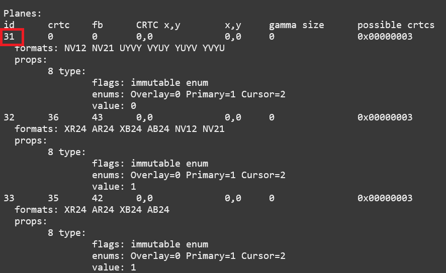

    Example of ``modetest`` output of the planes section on SL1680.

XvImageSink
***********

The XvImage sink supports displaying video using the X11 backend. In the following examples, replacing ``waylandsink`` with
``xvimagesink`` will allow the example to run on X (see `GStreamer documentation <https://gstreamer.freedesktop.org/documentation/xvimagesink/index.html?gi-language=c>`__ for more details).

Audio Playback
^^^^^^^^^^^^^^

Playing audio files involves reading and parsing the encoded audio data,
decoding the data, and outputting it to the audio sink. Some data
formats and audio sinks may also need to convert and resample the data
before sending it to the audio sink::

    gst-launch-1.0 filesrc location=audio_file ! parser ! decoder ! [ convert ] ! [ resample ] ! audiosink

This example plays an MP3 file using the speakers of the attached HDMI
device::

    gst-launch-1.0 filesrc location=audio_file.mp3 ! mpegaudioparse ! avdec_mp3 ! audioconvert ! audioresample ! alsasink device=hw:0,7

Video Playback
^^^^^^^^^^^^^^

Playing a video file involves reading the file, demuxing a video stream,
parsing the encoded data, and decoding the data using the video decoder.
Finally, the decoded frames our output to the video sink::

    gst-launch-1.0 filesrc location=video_file ! demux ! queue ! parser ! decoder ! videosink

The following example plays the main video stream of an MP4 file and
displays the video using Wayland.

An example of a H265 encoded video file on SL1640 / SL1680::

    gst-launch-1.0 filesrc location=test_file.mp4 ! qtdemux name=demux demux.video_0 ! queue ! h265parse ! v4l2h265dec ! waylandsink fullscreen=true

An example of a H265 encoded video file on SL1640 / SL1680 using ``xvimagesink``::

    gst-launch-1.0 filesrc location=test_file.mp4 ! qtdemux name=demux demux.video_0 ! queue ! h265parse ! v4l2h265dec ! xvimagesink

An example of a H265 encoded video file on SL1620::

    gst-launch-1.0 filesrc location=test_file.mp4 ! qtdemux name=demux demux.video_0 ! queue ! h265parse ! avdec_h265 ! waylandsink fullscreen=true

A similar example, but with a file using AV1 encoding on SL1640 / SL1680::

    gst-launch-1.0 filesrc location=test_file.mp4 ! qtdemux name=demux demux.video_0 ! queue ! av1parse ! v4l2av1dec ! waylandsink fullscreen=true

An example of a H265 encoded video file on SL1640 / SL1680 using kmssink::

    gst-launch-1.0 filesrc location=test_file.mp4 ! qtdemux name=demux demux.video_0 ! queue ! h265parse ! v4l2h265dec ! kmssink driver-name=synaptics plane-id=31

Audio / Video File Playback
^^^^^^^^^^^^^^^^^^^^^^^^^^^

Playing a file which contains both audio and video streams requires
creating a pipeline which parses and decodes both streams::

    gst-launch-1.0 filesrc location=video_file ! demux.video ! queue ! parser ! decoder ! videosink \
        demux.audio ! queue ! parser ! decoder ! [ convert ] ! [ resample ] ! audiosink

Play an MP4 file on SL1640 / SL1680 with a H265 encoded video stream and an AAC encoded
audio stream::

    gst-launch-1.0 filesrc location=test_file.mp4  ! qtdemux name=demux \
        demux.video_0 ! queue ! h265parse ! v4l2h265dec ! queue ! waylandsink fullscreen=true \
        demux.audio_0 ! queue ! aacparse ! fdkaacdec ! audioconvert ! alsasink device=hw:0,7

Play an MP4 file on SL1620 with a H265 encoded video stream and an AAC encoded
audio stream::

    gst-launch-1.0 filesrc location=little.mp4  ! qtdemux name=demux  \
        demux.video_0 ! queue ! h265parse ! avdec_h265 ! queue ! waylandsink fullscreen=true \
        demux.audio_0 ! queue ! aacparse ! fdkaacdec ! audioconvert ! alsasink device=hw:0,1

Play an MP4 file on SL1640 / SL1680 with a H265 encoded video stream and an AAC encoded
audio stream with ``xvimagesink``::

    gst-launch-1.0 filesrc location=test_file.mp4  ! qtdemux name=demux \
        demux.video_0 ! queue ! h265parse ! v4l2h265dec ! queue ! xvimagesink \
        demux.audio_0 ! queue ! aacparse ! fdkaacdec ! audioconvert ! alsasink device=hw:0,7

Play an MP4 file on SL1620 with a H265 encoded video stream and an AAC encoded
audio stream with ``xvimagesink``::

    gst-launch-1.0 filesrc location=little.mp4  ! qtdemux name=demux  \
        demux.video_0 ! queue ! h265parse ! avdec_h265 ! queue ! xvimagesink \
        demux.audio_0 ! queue ! aacparse ! fdkaacdec ! audioconvert ! alsasink device=hw:0,1

Recording
^^^^^^^^^

Audio Recording
"""""""""""""""

Recording audio involves reading data from a capture device like a
microphone, converting, encoding, and multiplexing the data before
writing it to an output file::

    gst-launch-1.0 alsasrc device=device ! [audio capabilities] ! queue ! convert ! encode ! mux ! filesink location=output file

The following example records audio from the ALSA capture device 1,0 (a USB microphone). It
then converts the raw data into a format which can encoded into the Vorbis
codec by the encoder. Once the data is encoded, it is then multiplexed into an Ogg
container and written to the file /tmp/alsasrc.ogg::

    gst-launch-1.0 alsasrc device=hw:1,0 ! queue ! audioconvert ! vorbisenc ! oggmux ! filesink location=/tmp/alsasrc.ogg

SL1620's core module has a built-in microphone (DMIC) which is typically enumerated as hw:0,3. This command records from the build-in mic::

    gst-launch-1.0 alsasrc device=hw:0,3 ! audio/x-raw,format=S32LE,rate=48000,channels=2 ! queue \
        ! audioconvert ! vorbisenc ! oggmux ! filesink location=/tmp/vorbis_audio.ogg

Cameras
^^^^^^^

Astra Machina supports USB (UVC) and image sensor cameras using the V4L2 driver stack.
This stack can be used with Gstreamer to construct pipelines using a camera.

.. note::

    Image sensor cameras are only supported on SL1680 using SL1680's ISP.

To display video captured from a camera to output it to the video sink::

    gst-launch-1.0 v4l2src device=/dev/videoX ! "video data,framerate,format,width,height" ! video sink

The following example reads captured data from the V4L2 device
/dev/video2 and applies the capabilities filter before sending the
output to the wayland sink::

    gst-launch-1.0 v4l2src device=/dev/video2 ! "video/x-raw,framerate=30/1,format=YUY2,width=640,height=480" ! waylandsink fullscreen=true

Image Sensor Cameras
""""""""""""""""""""

SL1680 includes an integrated ISP and supports connecting image sensor camera modules using the MIPI-CSI connectors. Gstreamer can use these
cameras using the V4L2 interface. The ISP supports 3 output paths, the main path supports outputing 4K resolution (if the sensor supports 4K), and the Secondary Paths
support 2K resolution. Each path has it's own video device file in /dev.

To display video from the ISP's Main Path::

    gst-launch-1.0 v4l2src device=/dev/video0 ! 'video/x-raw, format=(string)NV12, width=(int)640, height=(int)480, framerate=(fraction)60/1' ! waylandsink

To display video from the ISP's Secondary Path 1::

    gst-launch-1.0 v4l2src device=/dev/video1 ! 'video/x-raw, format=(string)NV12, width=(int)640, height=(int)480, framerate=(fraction)60/1' ! waylandsink

To display video from the ISP's Secondary Path 2::

    gst-launch-1.0 v4l2src device=/dev/video2 ! 'video/x-raw, format=(string)NV12, width=(int)640, height=(int)480, framerate=(fraction)60/1' ! waylandsink

The device file number may vary depending on your configuration. You can use the ``v4l2-ctl`` command to find which device files are associated with each of the
ISP paths.

    ``v4l2-ctl --list-devices`` output with the ISP Path devices highlighted

An additional video device is created to support Bayer RGB capture. This is the 4th video instance which advertises itself as only supporting Bayer RGB.
The other 3 video ports support NV12 / RGB only.

Multi Stream Support
********************

SL1680 supports up to three video streams to be enabled simultaneously (excluding the Bayer RGB video port - vvcam-video.0.3). Up to three different GStreamer pipelines can be
run at the same time to validate this feature. From the GStreamer command list below, any combination of up to 3 paths — Main, Self Path 1, and Self Path 2 can be run simultaneously.

::

    gst-launch-1.0 v4l2src device=/dev/video0 ! 'video/x-raw, format=(string)NV12, width=(int)640, height=(int)480, framerate=(fraction)60/1' ! waylandsink

    gst-launch-1.0 v4l2src device=/dev/video1 ! 'video/x-raw, format=(string)NV12, width=(int)640, height=(int)480, framerate=(fraction)60/1' ! waylandsink

    gst-launch-1.0 v4l2src device=/dev/video2 ! 'video/x-raw, format=(string)NV12, width=(int)640, height=(int)480, framerate=(fraction)60/1' ! waylandsink

.. note::

    Although multiple streams may appear as independent devices, all streams originate from a single instance. Once all streams are playing, any change
    made to an existing stream is treated as a new change. Hence, ensure that all sessions are closed one by one before starting the next set of multi
    or single streaming.

Dual Sensor Support
*******************

SL1680 supports dual sensor configuration with the OV5647 sensor module. Dual sensor support required enabling the ``dolphin-bothcsi-without-expander.dtbo``
overlay. (See :doc:`../subject/updating_isp_sensor_configuration`). Once the two sensors are connected and the overlay is enabled, ``v4l2-ctl`` will display a total of eight
``vvcam-video`` devices. Three NV12 / RGB devices plus one Bayer RGB device per sensor.

.. figure:: media/dual-sensor-isp-path-devices.png
    :scale: 75%

    ``v4l2-ctl --list-devices`` output with the dual sensor ISP Path devices highlighted

Similar to multi stream support, multiple Gstreamer pipelines can be used with both sensors simultaniously.

For example, these commands will display video from the main path of the sensor connected to CSI0 and video from the main path of the sensor connected to CSI1.

::

    gst-launch-1.0 v4l2src device=/dev/video3 ! 'video/x-raw, format=(string)NV12, width=(int)640, height=(int)480, framerate=(fraction)30/1' ! waylandsink

    gst-launch-1.0 v4l2src device=/dev/video7 ! 'video/x-raw, format=(string)NV12, width=(int)640, height=(int)480, framerate=(fraction)30/1' ! waylandsink

.. note::

    IMX258 and IMX415 sensors are not supported with the dual sensor configuration on Astra Machina boards. Both sensors
    require a GPIO expander whereas CSI1 is incompatible with the GPIO expander.

Dewarp Support
**************

SL1680 supports Dewarp lens distortion correction on the IMX258 and IMX415 sensors. Dewarp required enabling the ``dolphin-csi0-with-expander-dewarp-imx258.dtb``
or ``dolphin-csi0-with-expander-dewarp-imx415.dtb`` overlays. (See :ref:`enable_dewarp_dtbo`). Once the dewarp overlay is enabled, check for the existence of the
file ``/proc/syna-dewarp/dewarp_subdev0``. This file contains the path top the dewarp look up table (LUT).

::

    cat /proc/syna-dewarp/dewarp_subdev0

Output::

    lut       :/lib/firmware/isp/DEWARP_LUT.isp

This is default LUT and it is used for IMX285.

For IMX415, set the LUT to ``isp/DEWARP_LUT_IMX415.isp``

::

    echo "lut=isp/DEWARP_LUT_IMX415.isp" > /proc/syna-dewarp/dewarp_subdev0

Use the following Gstreamer pipeline to apply dewarp distortion correction to the image.

::

    gst-launch-1.0 v4l2src device=/dev/videoX extra-controls="c,dewarp_enable=1" ! \
        'video/x-raw, format=(string)NV12 , width=(int)3840, height=(int)2160, framerate=(fraction)30/1' \
        ! waylandsink fullscreen=true

Setting ``dewarp_enable`` to ``1`` enables correction. Setting it to ``0`` disables it.

.. note::

    Dewarp is only supported on ``SP1`` using 4K resolution.

MMU Support
***********

Currently V4l2 ISP supports MMU for NV12 formats in MP and SP2 path only. For RGB888 and Bayer RGB format, MMU support is not enabled yet.
SP1 path doesn't have MMU support due to HW limitation. By default, MMU support is enabled for NV12 format for MP / SP2 paths, otherwise
the MMU is automatically disabled if it is not supported. Users are not required to add any extra control commands for the MMU for the
default behavior.

The below table provides the default behavior whether MMU enable or disable depending upon the Camera Path and selected output format.

=========  ==============   ===============      ==================
Path       Format (NV12)    Format (BGB888)      Format (Bayer RGB)
=========  ==============   ===============      ==================
MP         Enabled          Disabled             Disabled
SP1        Disabled         Disabled             Disabled
SP2        Enabled          Disabled             Disabled
=========  ==============   ===============      ==================

To explicitly disable MMU support while using NV12 format, add the extra-controls option to the Gstreamer pipeline.

::

    gst-launch-1.0 v4l2src device=/dev/video2  extra-controls="c,mmu_enable=0" ! 'video/x-raw, \
        format=(string)NV12, width=(int)640, height=(int)480, framerate=(fraction)60/1' ! waylandsink

.. note::

    When using ``filesink``, the user needs to disable the MMU for paths where the MMU is enabled by default. MMU mode
    requires the stride value be correctlt aligned. Unfortunately, Gstreamers filesink element ignores this value. The only
    workaround is for the user to disable MMU for paths where the MMU is enabled by default.

RTSP Cameras
""""""""""""

Astra Machina supports RTSP cameras using the Gstreamer RTSP plugin. 

This example will receive a H.264 encoded camera stream and display it on SL1640 and SL1680 using hardware decoding. The rtspsrc
element connects to the camera over the network and sets the latency to 2000 milliseconds. The latency parameter along with the rtpjitterbuffer element will buffer the stream
to minimize network jitter. The rtph264depay element will depayload the H.264 stream. It's wait-for-keyframe option will wait for a keyframe before outputing
the stream to ensure synchoronization. Then the H.264 stream is parsed and decoded using the h264parse and v4l2h264dec elements. The decoded video is then
displayed on the screen using the wayland sink::

    gst-launch-1.0 rtspsrc location="rtsp://<user>:<password>@<ip>/stream" latency=2000 ! rtpjitterbuffer ! rtph264depay wait-for-keyframe=true ! \
        video/x-h264, width=1920, height=1080 ! h264parse ! v4l2h264dec ! videoscale ! video/x-raw,width=1920,height=1080 ! waylandsink

This example uses software decoding and works on SL1620, SL1640, and SL1680::

    gst-launch-1.0 rtspsrc location="rtsp://<user>:<password>@<ip>/stream" latency=2000 ! rtpjitterbuffer ! rtph264depay wait-for-keyframe=true ! \
        video/x-h264, width=1920, height=1080 ! h264parse ! avdec_h264 ! videoscale ! video/x-raw,width=1920,height=1080 ! waylandsink

Multiple RTSP streams can be displayed simultaneously. This example will decode and display 4 1080p RTSP streams using the glvideomixer element::

    gst-launch-1.0 glvideomixer name=comp \
        sink_0::alpha=1 sink_0::xpos=0 sink_0::ypos=0 sink_0::width=960 sink_0::height=540 \
        sink_1::alpha=1 sink_1::xpos=960 sink_1::ypos=0 sink_1::width=960 sink_1::height=540 \
        sink_2::alpha=1 sink_2::xpos=0 sink_2::ypos=540 sink_2::width=960 sink_2::height=540 \
        sink_3::alpha=1 sink_3::xpos=960 sink_3::ypos=540 sink_3::width=960 sink_3::height=540 \
        ! queue2 ! videoconvert ! "video/x-raw, width=(int)1920, height=(int)1080, interlace-mode=(string)progressive, pixel-aspect-ratio=(fraction)1/1" ! waylandsink \
        rtspsrc location="rtsp://<user>:<password>@<ip>/stream1" latency=2000  ! rtpjitterbuffer ! rtph264depay wait-for-keyframe=true ! video/x-h264, width=1920, height=1080 !  h264parse ! v4l2h264dec ! comp.sink_0 \
        rtspsrc location="rtsp://<user>:<password>@<ip>/stream2" latency=2000  ! rtpjitterbuffer ! rtph264depay wait-for-keyframe=true ! video/x-h264, width=1920, height=1080 !  h264parse ! v4l2h264dec ! comp.sink_1 \
        rtspsrc location="rtsp://<user>:<password>@<ip>/stream3" latency=2000  ! rtpjitterbuffer ! rtph264depay wait-for-keyframe=true ! video/x-h264, width=1920, height=1080 !  h264parse ! v4l2h264dec ! comp.sink_2 \
        rtspsrc location="rtsp://<user>:<password>@<ip>/stream4" latency=2000  ! rtpjitterbuffer ! rtph264depay wait-for-keyframe=true ! video/x-h264, width=1920, height=1080 !  h264parse ! v4l2h264dec ! comp.sink_3

HDMI-RX
^^^^^^^

SL1680 supports HDMI input streams from external devices (HDMI-RX) using the micro HDMI port on core module. Gstreamer can use the V4L2 interface to process and display
the video and audio streams received from the external HDMI device.

    SL1680 with the HDMI-RX micro HDMI port outlined in red.

HDMI-RX supports the following video formats typical of PC video sources and V4L2 video sources.

Supported Formats
"""""""""""""""""

Typical PC Video Formats
************************

======   ================    ==========
Format   Bits per Channel    Resolution
======   ================    ==========
RGB      8, 10, 12 bits      4K60
YUV422   8, 10, 12 bits      4K60
YUV444   8, 10, 12 bits      4K60
======   ================    ==========

V4L2 Video Formats
******************

======   ==========
Format   Resolution
======   ==========
NV12     4K60
UYVY     4K60
======   ==========

Audio Formats
*************

======== =========== =========
Channels Sample Rate Bit Depth
======== =========== =========
2        48kHz       32 bit
======== =========== =========

The V4L2 device file number may vary depending on your configuration. You can use the ``v4l2-ctl`` command to find which device files are associated the HDMI-RX device.

.. figure:: media/hdmi-rx-device.png
    :scale: 75%

    V4L2 HDMI-RX video device file

Use the ``arecord`` command to determine which ALSA capture device is associated with HDMI-RX.

.. figure:: media/hdmi-rx-audio-capture-device.png

    ALSA HDMI-RX audio capture device

Use the ``aplay`` command to determine which ALSA playback device to use to play the captured audio. The following examples will use the speakers associated with the HDMI sink.

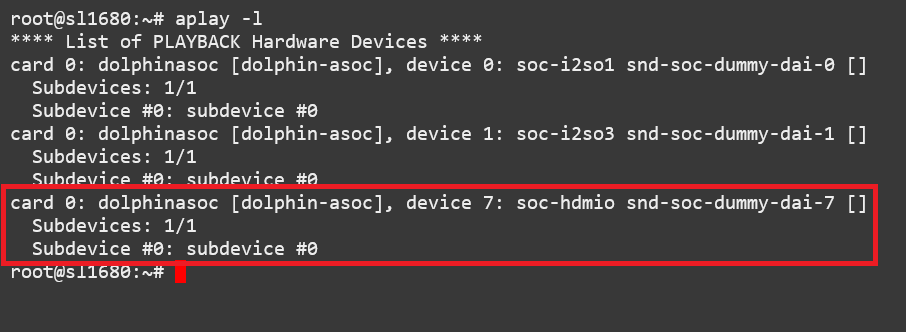

    HDMI audio output device

This example displays a 2K30 stream from an external HDMI device using ``waylandsink``::

    gst-launch-1.0 v4l2src device=/dev/video6 ! video/x-raw,width=1920,height=1080,fps=30,format=NV12 ! waylandsink fullscreen=true

This example displays a 4K30 stream from an external HDMI device using ``waylandsink``::

    gst-launch-1.0 v4l2src device=/dev/video6 ! video/x-raw,width=3840,height=2160,fps=30,format=NV12 ! waylandsink fullscreen=true

This example displays a 4K30 stream from an external HDMI device using ``kmssink``::

    gst-launch-1.0 v4l2src device=/dev/video6 ! video/x-raw,width=3840,height=2160,fps=30,format=NV12 !  kmssink driver-name=synaptics plane-id=31

This example displays a 4K30 stream with text overylay using ``waylandsink``::

    gst-launch-1.0 v4l2src device=/dev/video6 ! video/x-raw,width=3840,height=2160,fps=30,format=NV12 ! textoverlay text="Sample Text" ! clockoverlay ! waylandsink fullscreen=true

This example starts a 2K30 stream using ``waylandsink``, then creates a 48K, S32_LE, 2 Channel audio pipeline. The audio will be played on the speakers of the HDMI sink device::

    gst-launch-1.0 v4l2src device=/dev/video6 ! video/x-raw,width=1920,height=1080,fps=30,format=NV12 ! waylandsink fullscreen=true &
    gst-launch-1.0 alsasrc device=hw:0,8 ! queue ! audio/x-raw,format=S32LE,rate=48000,channels=2 ! alsasink device=hw:0,7 sync=false

.. note::

    FPS is set by the source device and should be configured on the source before starting the pipeline.

.. note::

    ``kmssink`` does not support 4K60 output.

Gstreamer Playbin Plugin
^^^^^^^^^^^^^^^^^^^^^^^^

Astra Machina contains the Gstreamer playbin plugin. This plugin can
automatically determine what type of pipeline to construct based on
automatic file type recognition (see `Gstreamer documentation <https://gstreamer.freedesktop.org/documentation/playback/playbin.html?gi-language=c>`__). This simplifies pipeline creation.

Playbin will autodetect the media file located at the specified uri, and create a
pipeline for it. It will then display the video on the video sink and
render the audio on the audio sink. The video-sink and audio-sink
parameters are optional. If the parameters are not included, default video and
audio sinks will be used instead::

    gst-launch-1.0 playbin uri=file:///path/to/file video-sink="video sink" audio-sink="audio sink"

Using playbin the example in :ref:`audio_sinks` can be reduced to::

    gst-launch-1.0 playbin uri=file:///path/to/file video-sink="waylandsink fullscreen=true" audio-sink="alsasink device=hw:0,7"

GStreamer SyNAP Plugin
^^^^^^^^^^^^^^^^^^^^^^

Astra Machina provides the Synaptics Gstreamer Plugins for AI (gstsynap) which allow adding ML processing to Gstreamer pipelines.
These plugins use the SyNAP framework to interface with the hardware accelerators to improve the performance
of ML processing. For information on SyNAP see :ref:`synap` below.

The Synaptics Gstreamer Plugins for AI consist of two plugins. The gstsynapinfer plugin, which uses SyNAP to handle AI inferencing
and the gstsynapoverlay plugin which outputs the results from gstsynapinfer and overlays then on top of the source data.

The gstsynapinfer plugin can operate it two modes. The first mode outputs structured data which is then used by gstsynapoverlay. This
supports common use cases such as drawing bounding boxes or overlaying text without having to write additional code. Here are several
examples using gstsynapinfer to do the inferencing and gstsynapoverlay overlaying the results. These examples show inferencing running on
a local file and an external USB camera.

Example of Object Detection with YOLOv8 (USB Camera Source)::

    gst-launch-1.0 v4l2src device=/dev/videoX ! video/x-raw,framerate=30/1,format=YUY2,width=640,height=480 ! videoconvert ! \
        tee name=t_data t_data. ! queue ! synapoverlay name=overlay label=/usr/share/synap/models/object_detection/coco/info.json \
        ! videoconvert ! waylandsink t_data. ! queue ! videoconvert ! videoscale ! video/x-raw,width=640,height=384,format=RGB  ! \
        synapinfer model=/usr/share/synap/models/object_detection/coco/model/yolov8s-640x384/model.synap mode=detector frameinterval=3 \
        ! overlay.inference_sink

Example of Object Detection with YOLOv8 (Video)::

    gst-launch-1.0 filesrc location=video_file.mp4 ! qtdemux name=demux demux.video_0 ! queue ! h264parse ! avdec_h264 ! videoconvert ! \
        tee name=t_data t_data. ! queue ! synapoverlay name=overlay label=/usr/share/synap/models/object_detection/coco/info.json ! \
        videoconvert ! waylandsink t_data. ! queue ! videoconvert ! videoscale ! video/x-raw,width=640,height=384,format=RGB  ! \
        synapinfer model=/usr/share/synap/models/object_detection/coco/model/yolov8s-640x384/model.synap mode=detector frameinterval=3 \
        ! overlay.inference_sink

Example of Object Detection with YOLOv8 (RTSP Stream)::

    gst-launch-1.0 rtspsrc location="rtsp://<user>:<password>@<ip>/stream" latency=2000 ! rtpjitterbuffer ! rtph264depay wait-for-keyframe=true ! \
        video/x-h264, width=1920, height=1080 ! h264parse ! avdec_h264 ! videoconvert ! \
        tee name=t_data t_data. ! queue ! synapoverlay name=overlay label=/usr/share/synap/models/object_detection/coco/info.json ! \
        videoconvert ! waylandsink t_data. ! queue ! videoconvert ! videoscale ! video/x-raw,width=640,height=384,format=RGB  ! \
        synapinfer model=/usr/share/synap/models/object_detection/coco/model/yolov8s-640x384/model.synap mode=detector frameinterval=3 \
        ! overlay.inference_sink

Example of Face Detection with YOLOv5 (USB Camera Source)::

    gst-launch-1.0 v4l2src device=/dev/videoX ! video/x-raw,framerate=30/1,format=YUY2,width=640,height=480 ! videoconvert ! \
        tee name=t_data t_data. ! queue ! synapoverlay name=overlay ! videoconvert ! waylandsink t_data. ! queue ! videoconvert ! \
        videoscale ! video/x-raw,width=480,height=352,format=RGB  ! \
        synapinfer model=/usr/share/synap/models/object_detection/face/model/yolov5s_face_640x480_onnx_mq/model.synap mode=detector \
        frameinterval=3 ! overlay.inference_sink

Example of Face Detection with YOLOv5 (RTSP Stream)::

    gst-launch-1.0 rtspsrc location="rtsp://<user>:<password>@<ip>/stream" latency=2000 ! rtpjitterbuffer ! rtph264depay wait-for-keyframe=true ! \
        video/x-h264, width=1920, height=1080 ! h264parse ! avdec_h264 ! videoconvert ! \
        tee name=t_data t_data. ! queue ! synapoverlay name=overlay ! videoconvert ! waylandsink t_data. ! queue ! videoconvert ! \
        videoscale ! video/x-raw,width=480,height=352,format=RGB  ! \
        synapinfer model=/usr/share/synap/models/object_detection/face/model/yolov5s_face_640x480_onnx_mq/model.synap mode=detector \
        frameinterval=3 ! overlay.inference_sink

Example of Pose Estimation with YOLOv8 (USB Camera Source)::

     gst-launch-1.0 v4l2src device=/dev/videoX ! video/x-raw,framerate=30/1,format=YUY2,width=640,height=480 ! synavideoconvertscale !  \
        tee name=t_data t_data. ! queue ! synapoverlay name=overlay ! synavideoconvertscale ! waylandsink t_data. ! queue ! synavideoconvertscale \
        ! video/x-raw,width=640,height=352,format=RGB  ! synapinfer model=/usr/share/synap/models/object_detection/body_pose/model/yolov8s-pose/model.synap \
        mode=detector frameinterval=3 ! overlay.inference_sink

Example of Pose Estimation with YOLOv8 (Video)::

    gst-launch-1.0 filesrc location=fitness.mp4 ! qtdemux name=demux demux.video_0 ! queue ! h264parse ! avdec_h264 ! synavideoconvertscale ! \
        tee name=t_data t_data. ! queue ! synapoverlay name=overlay ! synavideoconvertscale ! waylandsink t_data. ! queue ! synavideoconvertscale \
        ! video/x-raw,width=640,height=352,format=RGB  ! synapinfer model=/usr/share/synap/models/object_detection/body_pose/model/yolov8s-pose/model.synap \
        mode=detector frameinterval=3 ! overlay.inference_sink

Example of Pose Estimation with YOLOv8 (RTSP Stream)::

    gst-launch-1.0 rtspsrc location="rtsp://<user>:<password>@<ip>/stream" latency=2000 ! rtpjitterbuffer ! rtph264depay wait-for-keyframe=true ! \
        video/x-h264, width=1920, height=1080 ! h264parse ! avdec_h264 ! synavideoconvertscale ! \
        tee name=t_data t_data. ! queue ! synapoverlay name=overlay ! synavideoconvertscale ! waylandsink t_data. ! queue ! synavideoconvertscale \
        ! video/x-raw,width=640,height=352,format=RGB  ! synapinfer model=/usr/share/synap/models/object_detection/body_pose/model/yolov8s-pose/model.synap \
        mode=detector frameinterval=3 ! overlay.inference_sink

.. note::

    Replace /dev/videoX with the device file associated with your external USB camera.

.. note::

    The above examples use software decoding to decode video files and RTSP streams. SL1640 and SL1680 also support
    hardware decoding which can be enabled by changing the avdec_h264 element to v4l2h264dec.

In gstsynapinfer's second mode, inference results are output as a JSON string. This allows an application to handle the overlay directly
or do additional processing on the results.

We provide a `sample application <https://github.com/synaptics-astra/application-gstreamer-plugins-syna/tree/#release#/tests/examples/gst-ai>`__
which makes use of gstsynapinfer's second mode. The app plays a video while simultaneously performing image classification on the video frames,
and then overlaying labels of the results onto the video. A prebuilt version of the application is included in the Astra system image.

Run the example application using the following command::

    gst-ai --appmode=IC --input=test_file.mp4 --output=screen --paramfile=/usr/share/gst-ai/ic.json

The gst-ai program uses a JSON parameter file to set additional configuration options. These options include decode mode, model, model meta-data,
count, confidence threshold, and post processing mode. The Astra Machina image provides a default JSON file for image classification at
/usr/share/gst-ai/ic.json. The supported decode modes (decmode) are ``ffmpeg`` and ``v4l2``. When set to ``ffmpeg`` the gst-ai program will use the
`ffmpeg library <https://ffmpeg.org/>`__ to perform decoding of the video stream in software. When ``v4l2`` is set then gst-ai will use the V4L2 APIs
to perform decoding of the video stream using hardware acceleration.

In release v1.6 image classification can also be run using the following command::

    gst-launch-1.0 filesrc location=Animals.mp4 ! qtdemux name=demux demux.video_0 ! queue ! h264parse ! v4l2h264dec ! tee name=t_data t_data. ! queue \
        ! synavideoconvertscale ! video/x-raw,width=224,height=224,format=RGB ! \
        synapinfer model=/usr/share/synap/models/image_classification/imagenet/model/mobilenet_v2_1.0_224_quant/model.synap mode=classifier frameinterval=3 \
        ! overlay.inference_sink t_data. ! queue ! synavideoconvertscale ! video/x-raw,format=BGRA ! \
        synapoverlay name=overlay label=/usr/share/synap/models/image_classification/imagenet/info.json ! waylandsink

.. note::

    SL1620 requires decmode to be set to ffmpeg since it does not support V4L2 decoding.

Super Resolution
""""""""""""""""

Astra Machina SL1680 provides several Super Resolution models can be used to upscale video. SL1680 has models based on QDEO and FAST.
The models are located in ``/usr/share/synap/models/image_processing/super_resolution/model``.

+--------------+---------------------------------+
| QDEO         | sr_qdeo_y_uv_640x360_1920x1080  |
|              +---------------------------------+
|              | sr_qdeo_y_uv_960x540_3840x2160  |
|              +---------------------------------+
|              | sr_qdeo_y_uv_1280x720_3840x2160 |
|              +---------------------------------+
|              | sr_qdeo_y_uv_1920x1080_3840x2160|
+--------------+---------------------------------+
| FAST         | sr_fast_y_uv_960x540_3840x2160  |
|              +---------------------------------+
|              | sr_fast_y_uv_1280x720_3840x2160 |
|              +---------------------------------+
|              | sr_fast_y_uv_1920x1080_3840x2160|
+--------------+---------------------------------+

The following examples show how to upscale video using gstreamer and the Super Resolution models.

QDEO
****

sr_qdeo_y_uv_640x360_1920x1080 (NV12)::

    gst-launch-1.0 v4l2src device=/dev/video8 ! video/x-raw,framerate=30/1,format=NV12,width=640,height=360 !\
        synapimageproc model=sr_qdeo_y_uv_640x360_1920x1080/model.synap ! waylandsink

sr_qdeo_y_uv_640x360_1920x1080 (I420)::

    gst-launch-1.0 v4l2src device=/dev/video8 ! image/jpeg,framerate=30/1,format=MJPEG,width=640,height=360 !\
        jpegdec  ! synapimageproc model=sr_qdeo_y_uv_640x360_1920x1080/model.synap ! waylandsink

sr_qdeo_y_uv_1280x720_3840x2160 (NV12)::

    gst-launch-1.0 v4l2src device=/dev/video8 ! video/x-raw,framerate=30/1,format=NV12,width=1280,height=720 !\
        synapimageproc model=sr_qdeo_y_uv_1280x720_3840x2160/model.synap ! waylandsink

sr_qdeo_y_uv_1280x720_3840x2160 (I420)::

    gst-launch-1.0 v4l2src device=/dev/video8 ! image/jpeg,framerate=30/1,format=MJPEG,width=1280,height=720 !\
        jpegdec ! synapimageproc model=sr_qdeo_y_uv_1280x720_3840x2160/model.synap ! waylandsink

sr_qdeo_y_uv_1920x1080_3840x2160 (NV12)::

    gst-launch-1.0 v4l2src device=/dev/video8 ! video/x-raw,framerate=30/1,format=NV12,width=1920,height=1080 !\
        synapimageproc model=sr_qdeo_y_uv_1920x1080_3840x2160/model.synap ! waylandsink

sr_qdeo_y_uv_1920x1080_3840x2160 (I420)::

    gst-launch-1.0 v4l2src device=/dev/video8 ! image/jpeg,framerate=30/1,format=MJPEG,width=1920,height=1080 !\
        jpegdec ! synapimageproc model=sr_qdeo_y_uv_1920x1080_3840x2160/model.synap ! waylandsink

FAST
****

sr_fast_y_uv_1280x720_3840x2160 (NV12)::

    gst-launch-1.0 v4l2src device=/dev/video8 ! video/x-raw,framerate=30/1,format=NV12,width=1280,height=720 !\
        synapimageproc model=sr_fast_y_uv_1280x720_3840x2160/model.synap ! waylandsink

sr_fast_y_uv_1280x720_3840x2160 (I420)::

    gst-launch-1.0 v4l2src device=/dev/video8 ! image/jpeg,framerate=30/1,format=MJPEG,width=1280,height=720 !\
        jpegdec ! synapimageproc model=sr_fast_y_uv_1280x720_3840x2160/model.synap ! waylandsink

sr_fast_y_uv_1920x1080_3840x2160 (NV12)::

    gst-launch-1.0 v4l2src device=/dev/video8 ! video/x-raw,framerate=30/1,format=NV12,width=1920,height=1080 !\
        synapimageproc model=sr_fast_y_uv_1920x1080_3840x2160/model.synap !  waylandsink

sr_fast_y_uv_1920x1080_3840x2160 (I420)::

     gst-launch-1.0 v4l2src device=/dev/video8 ! image/jpeg,framerate=30/1,format=MJPEG,width=1920,height=1080 !\
        jpegdec ! synapimageproc model=sr_fast_y_uv_1920x1080_3840x2160/model.synap !  waylandsink

.. note::

    When using an ISP camera, be sure to add ``extra-controls="c,mmu_enable=0"`` to disable MMU. ::

        gst-launch-1.0 v4l2src device=/dev/video0 extra-controls="c,mmu_enable=0" ! 'video/x-raw, format=(string)NV12, \
            width=(int)1920, height=(int)1080, framerate=(fraction)30/1' ! \
            synapimageproc model=sr_fast_y_uv_1920x1080_3840x2160/model.synap ! waylandsink

.. note::

    By default, the UI is 2K. When upscaling 4K content to 4K you will need to set the UI to be 4K. Move the file
    ``/etc/modprobe.d/syna_drm.conf`` out of ``/etc/modprobe.d`` to prevent it from setting the UI resolution.

Multimedia Demo Applications
----------------------------

We also provide two `demo QT applications <https://github.com/synaptics-astra/application-videosdk/tree/#release#/>`__ which demonstate the
Multimedia and AI capabilities of Astra Machina. The Syna Video Player app demonstates decoding and playing up to four video streams. The Syna AI
Player app demonstrates the AI capabilities of Astra Machina by performing object detection, face detection, and pose estimation examples.

The apps require the following environment variable to be set::

    export XDG_RUNTIME_DIR=/var/run/user/0
    export WESTON_DISABLE_GBM_MODIFIERS=true
    export WAYLAND_DISPLAY=wayland-1
    export QT_QPA_PLATFORM=wayland

.. _qml_customization:

Multimedia Demo Customization
^^^^^^^^^^^^^^^^^^^^^^^^^^^^^

Both applications use `QML <https://doc.qt.io/qt-6/qmlreference.html>`__ files for their configuration. This allows users to customize the applications.
Customizations include modifying what videos are used in the application. Since no sample video files are preinstalled on the Astra Machina image,
users will need to add their own video files to the application's QML files. The default QML files are preinstalled in /home/root/demos/qmls.

Syna Video Player
^^^^^^^^^^^^^^^^^

The Syna Video Player application demonstrates Astra Machina's ability to play and decode videos. It supports playing a single video, or playing up to four
videos in a grid.

.. figure:: media/sl1680-syna-video-player.jpg

    The main screen of Syna Video Player

Run the Syna Video Player::

    root@sl1680:~# syna-video-player --mach sl1680 --mode ffmpeg

The Syna Video Player expects two paramaters, the machine type and the mode. The machine type is the version of Astra Machina which the application is running on.
The valid options are ``sl1620``, ``sl1640`` and ``sl1680``. The mode specifies which mode of decoding should be used. The options are ``ffmpeg`` and ``v4l2``.
When set to ``ffmpeg`` the Syna Video Player application will use the `ffmpeg library <https://ffmpeg.org/>`__ to perform decoding of the video stream in software.
When ``v4l2`` is set then Syna Video Player will use the V4L2 APIs to perform decoding of the video stream using hardware acceleration.

.. note::

    SL1620 requires mode to be set to ffmpeg since it does not support V4L2 decoding.

The information on the video files is defined in the QML files in /home/root/demos/qmls/. Please update the video names and path in these files so that Syna Video Player
can locate the videos installed on your system. The video information is set in the file ``<mach>-<mode>.qml``. For example, to update the video files on SL1680 in ffmpeg mode,
modify ``/home/root/demos/qmls/sl1680-ffmpeg.qml``.

Syna AI Player
^^^^^^^^^^^^^^

The Syna AI Player application uses the above gstreamer pipelines to show object detection, face detection, and pose estimation. It also supports Multi AI view which
does object detection, face detection, and pose estimation simultaniously while playing a video.

    The main screen of Syna AI Player

Run the Syna AI Player::

    root@sl1680:~# syna-ai-player --mach sl1680

The Syna AI Player expects the machine type parameter. The machine type is the version of Astra Machina which the app is running on.
The valid options are ``sl1620``, ``sl1640`` and ``sl1680``.

The information on the video file used in the Multi View window is defined in the QML files in /home/root/demos/qmls/. Please update the video name and path in this file so that Syna AI Player
can locate the video installed on your system. The video information is set in the file ``/home/root/demos/qmls/panels/MultiAi.qml``.

.. note::

    Multi AI mode by default, requires 3 seperate cameras. One of which needs to be a USB 3.0 device.

Multiview Customization
"""""""""""""""""""""""

Modifying the QML files also allows running custom Gstreamer pipelines. Changing the command paramters in the GridItem section will change the pipelines displayed in the MulitAI panels.
The following example will display 4 RTSP streams running 3 separate AI models::

    GridLayout {
        width: ma.width * 0.9
        anchors.top: header.bottom
        anchors.centerIn: parent

        GridItem {
            type: 2
            image: "qrc:/res/images/multiicon.png"
            title:  qsTr("Multi-AI")
            command1: "rtspsrc location=\"rtsp://<user>:<password>@<ip>/stream1\" latency=2000 ! rtpjitterbuffer ! rtph264depay wait-for-keyframe=true ! video/x-h264, width=1920, height=1080  ! h264parse ! v4l2h264dec ! tee name=t_data t_data. ! queue ! v4l2convert extra-controls=\"c,io_mmu_capture_buffer=0,io_mmu_output_buffer=0\" ! video/x-raw, width=640, height=384, format=NV12  ! glupload ! glcolorconvert ! video/x-raw\(memory:GLMemory\), format=RGB ! gldownload ! synapinfer model=/usr/share/synap/models/object_detection/coco/model/yolov8s-640x384/model.synap mode=detector frameinterval=3 ! overlay.inference_sink t_data. ! queue ! glupload ! glcolorconvert ! video/x-raw\(memory:GLMemory\), format=BGRA ! gldownload ! synapoverlay name=overlay label=/usr/share/synap/models/object_detection/coco/info.json ! waylandsink"
            command2: "rtspsrc location=\"rtsp://<user>:<password>@<ip>/stream2\" latency=2000 ! rtpjitterbuffer ! rtph264depay wait-for-keyframe=true ! video/x-h264, width=1920, height=1080  ! h264parse ! v4l2h264dec ! tee name=t_data t_data. ! queue ! v4l2convert extra-controls=\"c,io_mmu_capture_buffer=0,io_mmu_output_buffer=0\" ! video/x-raw, width=480, height=352, format=NV12 ! glupload ! glcolorconvert ! video/x-raw\(memory:GLMemory\), format=RGB ! gldownload ! synapinfer model=/usr/share/synap/models/object_detection/face/model/yolov5s_face_640x480_onnx_mq/model.synap mode=detector frameinterval=3 ! overlay.inference_sink t_data. ! queue ! glupload ! glcolorconvert ! video/x-raw\(memory:GLMemory\), format=BGRA ! gldownload ! synapoverlay name=overlay ! waylandsink"
            command3: "rtspsrc location=\"rtsp://<user>:<password>@<ip>/stream3\" latency=2000 ! rtpjitterbuffer ! rtph264depay wait-for-keyframe=true ! video/x-h264, width=1920, height=1080  ! h264parse ! v4l2h264dec ! tee name=t_data t_data. ! queue ! v4l2convert extra-controls=\"c,io_mmu_capture_buffer=0,io_mmu_output_buffer=0\" ! video/x-raw, width=640, height=352, format=NV12 ! glupload ! glcolorconvert ! video/x-raw\(memory:GLMemory\), format=RGB ! gldownload ! synapinfer model=/usr/share/synap/models/object_detection/body_pose/model/yolov8s-pose/model.synap mode=detector frameinterval=3 ! overlay.inference_sink t_data. ! queue ! glupload ! glcolorconvert ! video/x-raw\(memory:GLMemory\), format=BGRA ! gldownload ! synapoverlay name=overlay ! waylandsink"
            command4: "rtspsrc location=\"rtsp://<user>:<password>@<ip>/stream4\" latency=2000 ! rtpjitterbuffer ! rtph264depay wait-for-keyframe=true ! video/x-h264, width=1920, height=1080  ! h264parse ! v4l2h264dec ! tee name=t_data t_data. ! queue ! v4l2convert extra-controls=\"c,io_mmu_capture_buffer=0,io_mmu_output_buffer=0\" ! video/x-raw, width=640, height=384, format=NV12 ! glupload ! glcolorconvert ! video/x-raw\(memory:GLMemory\), format=RGB ! gldownload ! synapinfer model=/usr/share/synap/models/object_detection/coco/model/yolov8s-640x384/model.synap mode=detector frameinterval=3 ! overlay.inference_sink t_data. ! queue ! glupload ! glcolorconvert ! video/x-raw\(memory:GLMemory\), format=BGRA ! gldownload ! synapoverlay name=overlay label=/usr/share/synap/models/object_detection/coco/info.json ! waylandsink"
        }
    }

.. note::

    Only SL1680 support Multiview.

.. _synap:

Machine Learning with SyNAP
===========================

Astra Machina uses the SyNAP framework for execution of neural networks using the platform's hardware accelerators.
This framework allows users to run programs which take advantage of the Neural Processing Unit (NPU)
and Graphics Processing Unit (GPU) to accelerate the execution of neural networks. (see the `SyNAP documentation <https://synaptics-synap.github.io/doc/v/latest/>`__ for more details.)

Connectivity
============

Bluetooth and Wi-Fi are supported on Astra Machina through on-board chip
solutions and external hardware. The following table lists the various
on-board chips and external solutions:

============ =============== ===================== ========================================================
SL Processor Wireless Device Physical Interface    Software Information
                                                  
                             (M.2 PCIe / M.2 SDIO)
============ =============== ===================== ========================================================
SL1620       SYNA 43711      M.2 SDIO              - wpa_supplicant v2.11
                                                   - WIFI driver version: v101.10.478
SL1640       SYNA 43752      M.2 PCIe              - wpa_supplicant v2.11
                                                   - WIFI driver version: v101.10.478
SL1680       SYNA 43752      M.2 PCIe              - wpa_supplicant v2.11
                                                   - WIFI driver version: v101.10.478
============ =============== ===================== ========================================================

The Synaptics Astra Linux BSP contains all of the drivers and firmware required to use the 43xxx modules with both PCIe and SDIO interfaces.
Wireless network management is handled by the WPA Supplicant daemon which key negotiation with a WPA Authenticator. It supports WEP, WPA, WPA2, and WPA3
authentication standards. ( See `wpa_supplicant <https://wiki.archlinux.org/title/wpa_supplicant>`__ for more details)

.. note::

    SL1640 and SL1680 can be configured to use the SYNA 43711 module with SDIO.
    See :doc:`../subject/enable_sdio_wifi`

Setting up Wifi with WPA Supplicant
------------------------------------
The following section describes how to setup Wifi on Astra Machina using WPA Supplicant.

Generate the WPA Pre-shared Key
^^^^^^^^^^^^^^^^^^^^^^^^^^^^^^^
Generating a pre-shared key from a passphrase avoids having to store the passphrase in the WPA Supplicant config file.

From the shell, use the wpa_passphrase command line tool to generate a WPA pre-shared key from a passphrase::

    root@sl1680:^# wpa_passphrase network_name 12345678
    network={
        ssid="network_name"
        psk=5ba83b0673ea069dafe5d5f1af8216771c13be6ad6f11dac9dc0e90b0c604981
    }

Bringing up the WLAN Interface
^^^^^^^^^^^^^^^^^^^^^^^^^^^^^^

Use ifconfig to instruct the kernel to bring up the wlan interface::

    ifconfig wlan0 up

Creating the WPA Supplicant Configuration File
^^^^^^^^^^^^^^^^^^^^^^^^^^^^^^^^^^^^^^^^^^^^^^

WPA Supplicant uses a config file to configure the Wifi connection. This configuration file is located in /etc/wpa_supplicant.

Create the /etc/wpa_supplicant directory::

    mkdir -p /etc/wpa_supplicant

Create the file /etc/wpa_supplicant/wpa_supplicant-wlan0.conf with options for your Wifi Network.

Contents of an example wpa_supplicant-wlan0.conf::

    ctrl_interface=/var/run/wpa_supplicant
    ctrl_interface_group=0
    update_config=1

    network={
        ssid="network_name"
        psk=5ba83b0673ea069dafe5d5f1af8216771c13be6ad6f11dac9dc0e90b0c604981
        key_mgmt=WPA-PSK
        scan_ssid=1
    }

Configure systemd-networkd
^^^^^^^^^^^^^^^^^^^^^^^^^^

The wlan interface needs to be enabled in the systemd-networkd system daemon configuration.

Create the new file /etc/systemd/network/25-wlan.network with the following contents::
 
    [Match]
    Name=wlan0

    [Network]
    DHCP=ipv4

Enable Wifi Services
^^^^^^^^^^^^^^^^^^^^
The network daemons need to be restarted to load the new configuration.

Restart network daemons::

    systemctl restart systemd-networkd.service
    systemctl restart wpa_supplicant@wlan0.service

Enable wpa_supplicant on boot up::

    systemctl enable wpa_supplicant@wlan0.service

Setup the Access Point (AP mode) with hostapd
---------------------------------------------
The Wifi interface can also be configured to act as an access point using `hostapd <https://w1.fi/hostapd/>`__.
Additional packages may need to be installed to support hostapd and iptables. Please see the Astra Yocto User Guide
for instructions on how to add the hostapd and iptables packages to your image.

Configure Networking to use hostapd
^^^^^^^^^^^^^^^^^^^^^^^^^^^^^^^^^^^

To configure the wlan device to use hostapd add the following entries to the /etc/network/interfaces file::

    auto wlan0
    iface wlan0 inet static
        address 192.168.10.1
        netmask 255.255.255.0
        post-up systemctl start hostapd
        pre-down systemctl stop hostapd

Configure systemd-networkd
^^^^^^^^^^^^^^^^^^^^^^^^^^

The wlan interface needs to be enabled in the systemd-networkd system daemon configuration.

Create the new file /etc/systemd/network/10-wlan0.network with the following contents::

    [Match]
    Name=wlan0

    [Network]
    Address=192.168.10.1/24
    DHCPServer=yes

    [DHCPServer]
    EmitDNS=yes

Configure hostapd
^^^^^^^^^^^^^^^^^

Create the file /etc/hostapd.conf with the ip, ssid, and passphrase of the Wifi network you are creating.

Example::

    own_ip_addr=192.168.10.1
    ssid=yocto640
    wpa=2
    wpa_passphrase=1234567890

Configuring IP Forwarding Firewall Rules
^^^^^^^^^^^^^^^^^^^^^^^^^^^^^^^^^^^^^^^^

IP Forwarding and NAT need to be configured to forward traffic coming from be new wireless network.

The following is an example of using iptables to forward traffic over the ethernet inferface using NAT. Add the new rules to /etc/iptables/iptables.rules
so that they can be loaded at boot::

    iptables –F
    iptables -F INPUT
    iptables -F OUTPUT
    iptables -F FORWARD
    iptables -t nat -F
    iptables -t mangle -F
    iptables -A INPUT -j ACCEPT
    iptables -A OUTPUT -j ACCEPT
    iptables -A FORWARD -j ACCEPT
    iptables -t nat -A POSTROUTING -o eth0 -j MASQUERADE
    iptables-save > /etc/iptables/iptables.rules

IP Forwarding is enabled by setting the following entries in /etc/sysctl.d/ip_forward.conf::

    net.ipv4.ip_forward = 1

Run the following command to enable ip forwarding::

    sysctl -p /etc/sysctl.d/ip_forward.conf

.. note::

    Be sure to connect an ethernet cable to Astra Machina so that traffic can be forwarded to the ethernet interface.

Enabling Services
^^^^^^^^^^^^^^^^^

Start hostapd and iptables::

    systemctl start hostapd.service
    systemctl start iptables.service

Enable hostapd and iptables on boot::

    systemctl enable hostapd.service
    systemctl enable iptables.service

Verify wlan0 Interface Configuration
^^^^^^^^^^^^^^^^^^^^^^^^^^^^^^^^^^^^

After enabling hostapd and iptables, use the ``ifconfig`` command to verify that ``wlan0`` is enabled.

.. figure:: media/hostapd-wlan0.png

.. note::

    If ``wlan0`` does not appear in the ``ifconfig`` output then you may need to run the ``sync`` command and reboot. This will make
    sure that the configuration changes were applied.

Disabling Services
^^^^^^^^^^^^^^^^^^

Use the following commands to stop using the Wifi interface as an access point and disable hostapd::

    systemctl stop hostapd.service
    systemctl stop iptables.service
    systemctl disable hostapd.service
    systemctl disable iptables.service
    rm -rf /etc/systemd/network/10-wlan0.network

Performing throughput tests
---------------------------

Astra Machina provides the `iPerf2 <https://iperf.fr/>`__ tool for measuring network throughput. iPerf is a widely used tool for network
performance measurement and tuning. It uses a client / server model to measure the throughput between devices on a network. It supports
both TCP and UDP protocols. Full documentation on iPerf2 can be found on the `iPerf website <https://iperf.fr/iperf-doc.php#doc>`__.

TCP Traffic
^^^^^^^^^^^

The following example runs a TCP throughput test between the client and server using the default options. 
In this example the server has the IP address ``10.5.0.3``.

.. note::

    The server must be started before the client.

Client Side::

    $ iperf -c 10.5.0.3

.. figure:: media/iperf-tcp-client.png

    ``iperf`` client running on SL1620 in TCP mode

Server side::

    $ iperf -s

    ``iperf`` server running on SL1620 in TCP mode

    
UDP Traffic
^^^^^^^^^^^

The following example runs a UDP throughput test between the client and server using the default options. 
In this example the server has the IP address ``10.5.0.3``.

.. note::

    The server must be started before the client.

Client side::

    $ iperf -c 10.5.0.3 -u

.. figure:: media/iperf-udp-client.png

    ``iperf`` client running on SL1620 in UDP mode

Server side::

    $ iperf -s -u

.. figure:: media/iperf-udp-server.png

    ``iperf`` server running on SL1620 in UDP mode

Common iPerf Options
^^^^^^^^^^^^^^^^^^^^

The following options are commonly used with the `iperf` command to customize its behavior:

- ``-i``: Interval
    Specifies the interval (in seconds) between periodic bandwidth reports. For example, ``-i 1`` will print a report every second.

- ``-l``: Length
    Sets the length of the buffer to read or write. For example, ``-l 128K`` sets the buffer length to 128 kilobytes.

- ``-b``: Bandwidth
    Specifies the target bandwidth for UDP tests. For example, ``-b 10M`` sets the target bandwidth to 10 megabits per second.

- ``-w``: Window size
    Sets the TCP window size. For example, ``-w 256K`` sets the TCP window size to 256 kilobytes.

- ``-t``: Time
    Specifies the time (in seconds) to transmit for. For example, ``-t 60`` will run the test for 60 seconds.

This example is of a TCP throughput test with a 10 second interval between reports, a 128 kilobyte buffer, a 1000 megabit per
second target bandwidth, a 256 kilobyte TCP window size, and a 60 second test duration::

    $ iperf -c 10.5.0.3 -i 10 -l 128K -b 1000M -w 256K -t 60

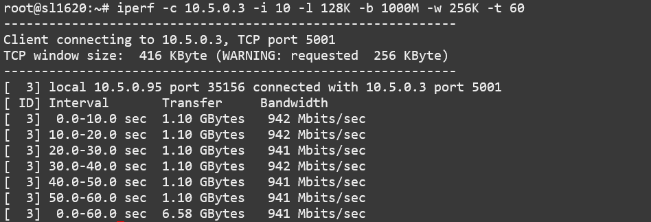

    ``iperf`` client running on SL1620 with custom options

Server side::

    $ iperf -s -i 10 -l 128K -b 1000M -w 256K -t 60

.. figure:: media/iperf-tcp-server-custom-options.png

    ``iperf`` server running on SL1620 with custom options

Using the Bluetooth A2DP source role
------------------------------------

Searching and connecting to the headset
^^^^^^^^^^^^^^^^^^^^^^^^^^^^^^^^^^^^^^^
First you need to enter the Bluetooth console using the following command::

    root@sl1640:~# bluetoothctl
    [bluetooth]#

Once in the Bluetooth console you can run various commands to control the Bluetooth stack described in the following
paragraphs.

You can show information about the Bluetooth controller on the board with the ``show`` command::

    [bluetooth]# show
    Controller C0:F5:35:AA:7D:8F (public)
            Name: sl1640
            Alias: sl1640
            Class: 0x00000000
            Powered: no
            Discoverable: no
            DiscoverableTimeout: 0x000000b4
            Pairable: yes
            UUID: Audio Source              (0000110a-0000-1000-8000-00805f9b34fb)
            UUID: Generic Attribute Profile (00001801-0000-1000-8000-00805f9b34fb)
            UUID: Generic Access Profile    (00001800-0000-1000-8000-00805f9b34fb)
            UUID: PnP Information           (00001200-0000-1000-8000-00805f9b34fb)
            UUID: A/V Remote Control Target (0000110c-0000-1000-8000-00805f9b34fb)
            UUID: A/V Remote Control        (0000110e-0000-1000-8000-00805f9b34fb)
            UUID: Device Information        (0000180a-0000-1000-8000-00805f9b34fb)
            Modalias: usb:v1D6Bp0246d0541
            Discovering: no
            Roles: central
            Roles: peripheral
    Advertising Features:
            ActiveInstances: 0x00 (0)
            SupportedInstances: 0x06 (6)
            SupportedIncludes: tx-power
            SupportedIncludes: appearance
            SupportedIncludes: local-name
            SupportedSecondaryChannels: 1M
            SupportedSecondaryChannels: 2M
            SupportedSecondaryChannels: Coded

In order to connect to the headset you first need to power on the bluetooth controller::

    [bluetooth]# power on
    [CHG] Controller C0:F5:35:AA:7D:8F Class: 0x00080000
    Changing power on succeeded
    [CHG] Controller C0:F5:35:AA:7D:8F Powered: yes

You then need to set the controller in pairable mode::

    [bluetooth]# pairable on
    Changing pairable on succeeded

You can then search for the headset (make sure the headset is in discoverable mode)::

    [bluetooth]# scan on
    Discovery started
    [CHG] Controller C0:F5:35:AA:7D:8F Discovering: yes
    [NEW] Device 2D:9A:A9:4F:54:37 2D-9A-A9-4F-54-37
    [NEW] Device 4E:E7:B0:20:2A:11 4E-E7-B0-20-2A-11
    [NEW] Device 7F:84:A3:29:E9:E9 7F-84-A3-29-E9-E9
    [NEW] Device 6A:B0:95:7E:58:79 6A-B0-95-7E-58-79
    [NEW] Device 7E:4D:8F:C4:3B:6F 7E-4D-8F-C4-3B-6F
    [NEW] Device 40:93:CE:4D:F1:8E 40-93-CE-4D-F1-8E
    [NEW] Device 47:14:71:A3:79:A9 47-14-71-A3-79-A9
    [NEW] Device 67:62:9C:4B:F9:7D 67-62-9C-4B-F9-7D
    [NEW] Device 8C:F8:C5:BD:6F:1D DTKBTQ3
    [NEW] Device 0A:73:76:09:55:C0 BT208

This command returns the MAC address of all the devices that are currently discoverable. You need to identify the one
of the headset you want to pair.

After identifying the MAC address of the device you want to pair with, you can disable scanning.

::

    [bluetooth]# scan off
    Discovery stopped
    [CHG] Controller C0:F5:35:AA:7D:8F Discovering: no

Once you found the headset you can pair to it by using the ``pair`` command with the MAC address of the headset::

    [bluetooth]# pair 0A:73:76:09:55:C0
    Attempting to pair with 0A:73:76:09:55:C0
    [CHG] Device 0A:73:76:09:55:C0 Connected: yes
    [CHG] Device 0A:73:76:09:55:C0 Bonded: yes
    [CHG] Device 0A:73:76:09:55:C0 UUIDs: 00001108-0000-1000-8000-00805f9b34fb
    [CHG] Device 0A:73:76:09:55:C0 UUIDs: 0000110b-0000-1000-8000-00805f9b34fb
    [CHG] Device 0A:73:76:09:55:C0 UUIDs: 0000110c-0000-1000-8000-00805f9b34fb
    [CHG] Device 0A:73:76:09:55:C0 UUIDs: 0000110e-0000-1000-8000-00805f9b34fb
    [CHG] Device 0A:73:76:09:55:C0 UUIDs: 0000111e-0000-1000-8000-00805f9b34fb
    [CHG] Device 0A:73:76:09:55:C0 ServicesResolved: yes
    [CHG] Device 0A:73:76:09:55:C0 Paired: yes
    Pairing successful
    [CHG] Device 0A:73:76:09:55:C0 ServicesResolved: no
    [CHG] Device 0A:73:76:09:55:C0 Connected: no

The next step is to mark the device as trusted::

    [bluetooth]# trust 0A:73:76:09:55:C0
    [CHG] Device 0A:73:76:09:55:C0 Trusted: yes
    Changing 0A:73:76:09:55:C0 trust succeeded

The last step is to setup the connection with the headset::

    [bluetooth]# connect 0A:73:76:09:55:C0
    Attempting to connect to 0A:73:76:09:55:C0
    [CHG] Device 0A:73:76:09:55:C0 Connected: yes
    [NEW] Endpoint /org/bluez/hci0/dev_0A_73_76_09_55_C0/sep1
    [NEW] Transport /org/bluez/hci0/dev_0A_73_76_09_55_C0/sep1/fd0
    Connection successful
    [BT208]# [  286.922414] input: BT208 (AVRCP) as /devices/virtual/input/input1
    [CHG] Transport /org/bluez/hci0/dev_0A_73_76_09_55_C0/sep1/fd0 Volume: 0x0060 (96)
    [DEL] Device D4:D2:D6:4F:80:60 445HD_BT_60
    [CHG] Device 0A:73:76:09:55:C0 ServicesResolved: ye
    [BT208]#

If the connection was successful the console prompt will show the name of device we connected to.

We can now get the information about the device::

    [BT208]# info
    Device 0A:73:76:09:55:C0 (public)
            Name: BT208
            Alias: BT208
            Class: 0x00240404
            Icon: audio-headset
            Paired: yes
            Bonded: yes
            Trusted: yes
            Blocked: no
            Connected: yes
            LegacyPairing: no
            UUID: Headset                   (00001108-0000-1000-8000-00805f9b34fb)
            UUID: Audio Sink                (0000110b-0000-1000-8000-00805f9b34fb)
            UUID: A/V Remote Control Target (0000110c-0000-1000-8000-00805f9b34fb)
            UUID: A/V Remote Control        (0000110e-0000-1000-8000-00805f9b34fb)
            UUID: Handsfree                 (0000111e-0000-1000-8000-00805f9b34fb)
            RSSI: -69
            TxPower: 4

Playing music to the headset
^^^^^^^^^^^^^^^^^^^^^^^^^^^^

In order to test playback you need to upload a sound file (in ``.wav`` format)  to the board for instance using ``scp``.

The file can be played to the A2DP sink using the ``aplay`` command. The command takes as parameter the MAC address of the
headeset (in the example below ``0A:73:76:09:55:C0``) and the name of wave file (in the example below
``/home/root/example.wav``)::

    root@sl1640:~# aplay --verbose -D  bluealsa:DEV=0A:73:76:09:55:C0 -t wav /home/root/example.wav
    Playing WAVE '/home/root/example.wav' : Signed 16 bit Little Endian, Rate 48000 Hz, Stereo
    Plug PCM: BlueALSA PCM: /org/bluealsa/hci0/dev_0A_73_76_09_55_C0/a2dpsrc/sink
    BlueALSA BlueZ device: /org/bluez/hci0/dev_0A_73_76_09_55_C0
    BlueALSA Bluetooth codec: SBC
    Its setup is:
      stream       : PLAYBACK
      access       : RW_INTERLEAVED
      format       : S16_LE
      subformat    : STD
      channels     : 2
      rate         : 48000
      exact rate   : 48000 (48000/1)
      msbits       : 16
      buffer_size  : 24000
      period_size  : 6000
      period_time  : 125000
      tstamp_mode  : NONE
      tstamp_type  : GETTIMEOFDAY
      period_step  : 1
      avail_min    : 6000
      period_event : 0
      start_threshold  : 24000
      stop_threshold   : 24000
      silence_threshold: 0
      silence_size : 0
      boundary     : 6755399441055744000

The Linux Boot Process
======================

Before the Linux Kernel begins executing on Astra Machina, low level
firmware and software initializes the hardware and prepares the system for boot.
This section provides an overview of the software components which prepare the
system for booting the Linux Kernel.

Software Overview
-----------------

Astra Machina uses a multistage boot process. This
section gives a brief description of each component.

Preboot Firmware
^^^^^^^^^^^^^^^^

The Preboot firmware is a collection of low level firmware which
initializes specific hardware components and loads the software which
runs in the Arm TrustZone environment. Once the Preboot firmware
completes, execution will be transferred to the bootloader. The Preboot
firmware is provided as binary images which are written to the boot
device.

.. _bootloader_overview:

Bootloader
^^^^^^^^^^

Astra Machina uses the Synaptics U-Boot (SU-Boot) bootloader to do additional
hardware initialization and to boot the Linux Kernel. SU-Boot is based on the
open source U-Boot project. (`U-Boot Documentation <https://docs.u-boot.org/en/latest/>`__)

.. _linux_kernel_and_devicetree_overview:

Linux Kernel and Devicetree
^^^^^^^^^^^^^^^^^^^^^^^^^^^

Astra Machina primarily run OSes which use the Linux
Kernel. The Linux Kernel provides the environment in which applications
run and it manages resources such as CPU, memory, and devices.
Generally, the Linux Kernel will be built as part of the Yocto build
process described in the Astra Yocto User Guide.

The Linux Kernel uses Device Tree data structures to describe the
hardware components and their configurations on the system. The device
tree source files are in the Linux Kernel source tree under that path
``arch/arm64/boot/dts/synaptics/``. These files are maintained in the `Astra Linux Kernel Overlay repository <https://github.com/synaptics-astra/linux_5_15-overlay>`__.
This directory also includes device tree overlays which can be used to
modify the device tree without having to recompile the entire devicetree.

.. _devicetree_overlays:

Devicetree Overlays
"""""""""""""""""""

Setting the devicetree overlay requires booting into U-Boot and setting
the ``dtbo`` variable to the required devicetree overlay. See :ref:`uboot_prompt` for instructions on getting to the
U-Boot prompt.

Once at the U-Boot prompt run the following commands to enable the Devicetree Overlay.

Set the ``dtbo`` variables::

    => setenv dtbo dolphin-haier-panel-overlay.dtbo

The ``dtbo`` variable also supports setting multiple overlays using a comma seperated list::

    => setenv dtbo dolphin-bothcsi-without-expander.dtbo, dolphin-haier-panel-overlay.dtbo

Save the environment to the eMMC so that the new variable will persist across reboots.

::

    => saveenv
    Saving Environment to MMC... Writing to redundant MMC(0)... OK

Optionally, confirm that the variable was correctly set.

::

    => printenv
    altbootcmd=if test ${boot_slot}  = 1; then bootslot set b; bootcount reset;bootcount reset; run bootcmd; else bootslot set a; bootcount reset; bootcount reset; run bootcmd;  fi
    autoload=n
    baudrate=115200
    bootcmd=bootmmc
    bootcount=1
    bootdelay=0
    bootlimit=3
    dtbo=dolphin-haier-panel-overlay.dtbo
    fdtcontroladdr=2172e190
    preboot=show_logo;
    upgrade_available=0
    ver=U-Boot 2019.10 (Nov 21 2024 - 14:01:42 +0000)
    Environment size: 407/65531 bytesboo

Finally, boot with the new overlay applied.

::

    => boot

.. note::

    Support for devicetree overlays was added in release v1.5.

.. note::

    Support for multiple devicetree overlays was added in release v1.7.

Root File System
^^^^^^^^^^^^^^^^

The root file system (rootfs) contains all the user space binaries and
libraries needed to execute programs in the Linux OS along with system
configuration files. The prebuilt images use Yocto to build the rootfs.
Instructions on how to build and configure a rootfs using Yocto can be
found in the :doc:`/yocto`.

.. _uboot:

U-Boot
------

As mentioned above, Astra Machina uses U-Boot as its bootloader. There
are three types of U-Boot which are used with Astra Machina. In addition
to SU-Boot, there are SPI U-Boot and USB U-Boot variants which are used to
flash or recover a device.

=========== ===========================================================
image type  image usage
=========== ===========================================================
SPI SU-Boot burn eMMC image via TFTP server or USB drive
USB SU-Boot burn eMMC image via TFTP server of USB host
SU-Boot     burn eMMC image via TFTP server or USB drive, Booting Linux
=========== ===========================================================

USB SU-Boot and SPI SU-Boot are used to boot a device which does not have
an image written to the eMMC or to do a update which overwrites all of
the contents of the eMMC.

USB SU-Boot allows the board to receive a copy of the USB version of
SU-Boot over the USB interface. The host system runs the usb_boot tool
to transfer the USB SU-Boot image to the board and execute it. Once USB SU-Boot
is running on the board it can be used to write an image to the eMMC.

SPI SU-Boot is similar to USB SU-Boot except that SU-Boot runs from
SPI flash. The SPI flash may be located on the main board of Astra Machina or
it may be a located on a SPI daughter card which is plugged into the device.
Once SPI U-Boot is running on the board it can be used to write an image to the eMMC.

`Synaptics U-Boot Source Code <https://github.com/synaptics-astra/boot-u-boot_2019_10/tree/#release#>`__

.. note::

    Release v1.6 and later use Synaptics U-Boot for eMMC, SPI, and USB versions of U-Boot.

.. _spi_sd_boot:

Booting from SPI and SD Cards
-----------------------------

Astra Machina's I/O board has a jumper labeled ``SD_BOOT``. This jumper controls
whether the device boots from the eMMC or the internal SPI flash. If the jumper
is attached then the device will boot from the internal SPI flash. Remove the jumper
to boot from eMMC.

    Astra Machina Component Diagram with SD_BOOT-Boot jumper highlighted

Astra Machina's internal SPI flash comes preprogrammed with SPI U-Boot. When the
SD_BOOT-Boot jumper is connected the device will boot from the SD card inserted in the SD card slot.
If no SD card is inserted the SPI U-Boot will boot to the U-Boot prompt "=>". The U-Boot prompt
can be used to set variables, or flash the eMMC and internal SPI flash.

.. note::

    Booting from SD cards is not supported on SL1620

Generating Bootable SD Card Images
^^^^^^^^^^^^^^^^^^^^^^^^^^^^^^^^^^

Creating a bootable SD card requires converting an existing image into a format suitable for writing
to the SD card. You can convert either prebuilt release images or an image you built yourself.
Run the ``gen_sd.sh`` script from within the image directory. You can find the ``gen_sd.sh`` script
on `GitHub <https://github.com/synaptics-astra/build/blob/#release#/tools/bin/gen_sd.sh>`__.
Click the "Download Raw File" to download the script. The script runs in a Linux environment with the
``mkfs.ext4``, ``gzip``, ``gdisk``, and ``sgdisk`` utilties installed.

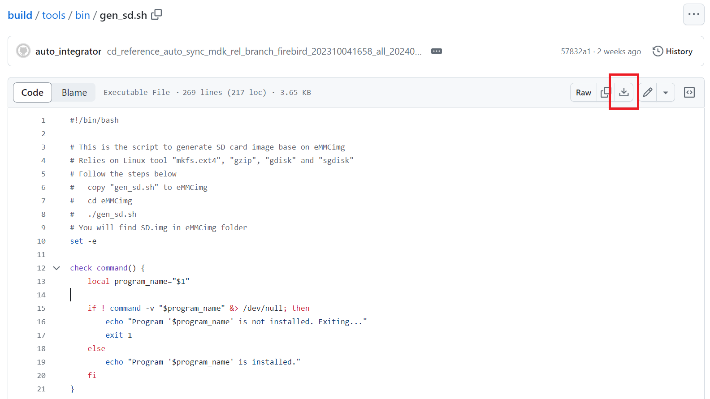

    Downloading gen_sd.sh from GitHub

    Running gen_sd.sh from within the prebuilt V1.0.0 eMMCimg directory

During the conversion ``gen_sd.sh`` will create the new file ``SD.img``. This is the new image file which
will be written to the SD card.

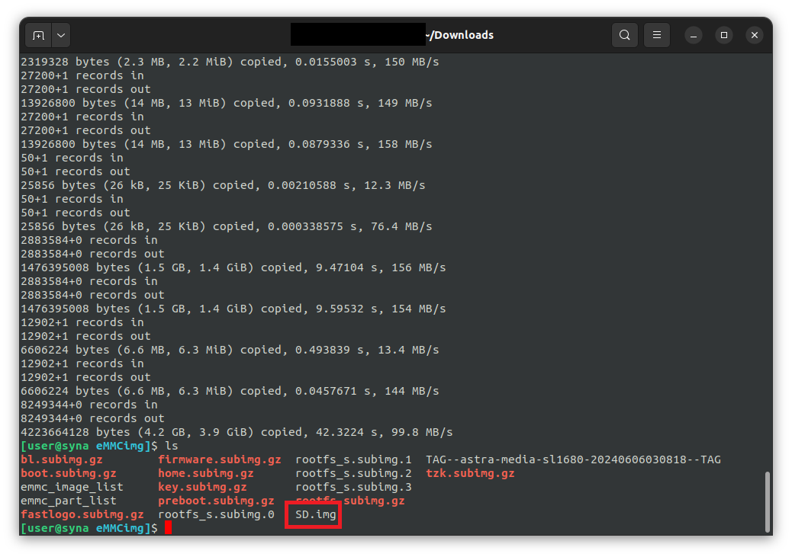

    After gen_sd.sh completed

Writing Bootable Images to the SD Card
^^^^^^^^^^^^^^^^^^^^^^^^^^^^^^^^^^^^^^

The ``SD.img`` file is written to the SD card using the `Balena Etcher <https://etcher.balena.io/>`__ tool.
Begin by downloading and installing the tool. Then run the tool and follow the steps in the UI to select the image and target device.
Finally, click the flash button to begin the process.

..  figure:: media/balena_etcher.png

    The start screen of Balena Etcher

    Balena Etcher after selecting the image file and target device

After the flashing process completes, the SD card will now be ready to boot Astra Machina.

.. figure:: media/balena_etcher_complete.png

    Balena Etcher after successfully flashinge image to the SD card

.. _uboot_prompt:

U-Boot Prompt with SU-Boot
--------------------------

When booting from the internal eMMC or from an SD card, SU-Boot will automatically load the Linux kernel.
However, this process can be interrupted by pressing any key in the serial console during the boot process.
If U-Boot detects a keypress then it will stop at the U-Boot prompt "=>". The U-Boot prompt can be used to
set variables, or flash the eMMC and internal SPI flash. By default the timeout in which U-Boot will wait
for input is set to 0, so key presses need to be sent before U-Boot starts.

.. _prepare_to_boot:

Updating Astra Software
=======================

On power on, Astra Machina will read the firmware, bootloader, and the
Linux Kernel from a boot device. The most common boot device is an eMMC
device on the board. This section will discuss how to write a boot image
to the eMMC and internal SPI flash.

The Astra System Image
----------------------

.. figure:: media/astra_image.png

    A screenshot of the Astra image

The "Astra System Image" is a directory containing several subimg
files and emmc_part_list, emmc_image_list, and emmc_image_list_full. The
emmc_part_list describes the GUID Partition Table (GPT) which will be
used for the eMMC. The emmc_image_list\* files specify which sub image
files should be written to which partition on the eMMC.

Example SL1640 Partition Table:

================== =================================================================== ================== ===========================
Partition name     Contents                                                            Can be removed     Accessed by
================== =================================================================== ================== ===========================
factory_setting    MAC address and other factory provisioned files, used by user space No                 Linux user space
key_a              AVB keys, user keys (A copy)                                        Yes                Early boot (boot partition)
tzk_a              TrustZone Kernel (A copy)                                           Yes                Early boot (boot partition)
key_b              AVB keys, user keys (B copy)                                        Yes                Early boot (boot partition)
tzk_b              TrustZone Kernel (B copy)                                           Yes                Early boot (boot partition)
bl_a               OEM Boot loader (A copy)                                            Yes                Early boot (boot partition)
bl_b               OEM Boot loader (B copy)                                            Yes                Early boot (boot partition)
boot_a             Linux Kernel, loaded by OEM bootloader (A copy)                     No                 OEM boot loader (bl_a)
boot_b             Linux Kernel, loaded by OEM bootloader (B copy)                     No                 OEM boot loader (bl_b)
firmware_a         GPU / DSP / SM firmwares, loaded by early boot, required (A copy)   Yes                Early boot (boot partition)
firmware_b         GPU / DSP / SM firmwares, loaded by early boot, required (B copy)   Yes                Early boot (boot partition)
rootfs_a           Root file system, used by Linux, can be changed (A copy)            No                 Linux (boot_a)
rootfs_b           Root file system, used by Linux, can be changed (B copy)            No                 Linux (boot_b)
fastlogo_a         Fast logo image, loaded by OEM bootloader, can be changed (A copy)  No                 OEM bootloader (bl_a)
fastlogo_b         Fast logo image, loaded by OEM bootloader, can be changed (B copy)  No                 OEM bootloader (bl_b)
devinfo            Device information (such as serial number, mac address ) required   Yes                Early boot (boot partition)
misc               Boot control settings, required                                     Yes                Early boot (boot partition)
home               Mounted in /home, can be customized                                 No                 Linux user space
================== =================================================================== ================== ===========================

.. _firmware_update_usb:

Updating Software Images using USB
----------------------------------

Astra Machina supports updating software images using USB.

.. _usb_boot_setup:

Setting up the USB Boot Environment
^^^^^^^^^^^^^^^^^^^^^^^^^^^^^^^^^^^

Booting from USB requires the ``astra-update`` software tool to be the installed on
a host system. Windows, Mac, and Linux hosts are supported. Windows systems
also require the Synaptics WinUSB Driver. Mac and Linux systems do not require
any additional drivers. This section covers how to configure the host system
and prepare for USB booting.

Hardware Setup
""""""""""""""

To run usb_boot you will also need to connect a USB cable from the host
system to the USB Type-C USB 2.0 port on Astra Machina (next to the ethernet port).

    Astra Machina Component Diagram with USB Type-C USB 2.0 port highlighted

Installing the WinUSB Driver (Windows Only)
^^^^^^^^^^^^^^^^^^^^^^^^^^^^^^^^^^^^^^^^^^^

Windows requires a special USB kernel driver to communicate with
Astra Machina over USB. Please download the driver from
`GitHub <https://github.com/synaptics-astra/usb-tool>`__. Linux and Mac hosts
can access the Astra board from user space and do not need any additional
kernel drivers.

After downloading and decompressing the USB Boot software package, right
click on the ``SYNA_WinUSB.inf`` file in the ``Synaptics_WinUSB_Driver``
directory. Select "Install" from the drop down menu.

.. note::

    Installing the Windows driver requires an account with administative privileges. Please contact
    your System Administrator if you do not have sufficient privileges. Or update using U-Boot :ref:`update_with_uboot`

.. figure:: media/install_driver_win.png

    Install the driver

After installing the driver, the Astra Machina will show up in
the Windows Device Manager as the "Synaptics IoT: Tools package USB
Driver for Synaptics Processors" when operating in USB Boot mode.

    Devices listed by the operating system after installing the driver

.. note::

    Astra Machina will not show up in the Window's Device Manager or be seen by the tool until putting the
    device into USB Boot Mode. Hold down the USB_BOOT and press the RESET button as described below.

Running Astra Update
^^^^^^^^^^^^^^^^^^^^

Astra Update can be downloaded from `GitHub <https://github.com/synaptics-astra/usb-tool>`__.
The tool is included in the same repository as the WinUSB driver.

Before running the tool, copy the image to the ``usb-tool`` directory.
    * Pre-built eMMC images are available from the `Astra SDK Releases <https://github.com/synaptics-astra/sdk/releases>`__ page.
    * SPI images can be downloaded from the `SPI U-Boot Releases <https://github.com/synaptics-astra/spi-u-boot/releases>`__ page.

To update the eMMC:
    1. Place the eMMC image in the ``usb-tool`` directory (named ``eMMCimg`` for pre-built or ``SYNAIMG`` for custom builds).
    2. Run the ``update_emmc`` script to begin the update.

To update internal SPI Flash:
    1. Place the SPI image in the ``usb-tool`` directory (named ``sl1620`` / ``sl1640`` / ``sl1680`` depending on the device).
    2. Run the ``update_spi`` script to begin the update.

.. note::

    Please check the release notes to confirm that you have a compatible version of ``astra-update``.
    :doc:`../release_notes/#release#`

    usb-tool directory on Windows

After running ``update_emmc.bat``, a window will open showing the status of the flash process.

.. figure:: media/astra-update-emmc.png

    Output of the ``astra-update`` tool on Windows

.. figure:: media/astra-update-spi-start.png

    Output of the ``astra-update`` tool preparing to update SPI Flash

Once the ``astra-update`` tool is running on the host system, Astra Machina will need to be placed into USB
Boot mode. To do this, press and hold the "USB_BOOT" button on the I/O board. Then press and release the
"RESET" button. Be sure to hold the "USB_BOOT" button long enough so that the board can reset and detect
that the "USB_BOOT" button is pressed. After booting into USB Boot mode, U-Boot will automatically flash
the eMMC image from the host onto Astra Machina. The board will automatically reboot when the update is complete.

.. figure:: media/usb-boot-and-reset.png

    Astra Machina Component Diagram with USB_BOOT and RESET buttons highlighted

.. figure:: media/astra-update-emmc-complete.png

    Output of the ``astra-update`` tool after a successful update

.. note::

    Make sure that the ``SD_BOOT`` jumper is not attached when booting from eMMC. Otherwise,
    the device will boot from internal SPI flash or an SD Card. See :ref:`spi_sd_boot`.

Running Astra Update on Mac OS and Linux
""""""""""""""""""""""""""""""""""""""""

On Mac OS, right click on the usb-tool directory. From the drop down select ``Services -> New Terminal at Folder``.

.. figure:: media/mac-open-terminal.png

    Opening a Terminal for ``astra-update`` on Mac

This will open a terminal inside of the selected usb_boot directory. From there run the ``update_emmc.sh`` script to
run the tool. You may be prompted for your password since the script internally calls sudo. The tool
requires additional permissions to interface with USB devices and access system resources.

.. figure:: media/mac-run-astra-update.png

    Output of ``astra-update`` on Mac

.. note::

    Some versions of Mac OS may be configured to block apps from "unverified developers". If you encounter
    this error please go to System Preference -> Security & Privacy -> General to enable executing apps from
    unverified developers.

On Linux, right click on the usb-tool directory. From the drop down select  ``Open in Terminal``.

.. figure:: media/linux-open-terminal.png

    Opening a Terminal for ``astra-update`` on Linux

This will open a terminal inside of the usb-tool directory. From there run the ``update_emmc.sh`` script to
run the tool. You may be prompted for your password since the script internally calls sudo. The tool
requires additional permissions to interface with USB devices and access system resources.

.. figure:: media/linux-run-astra-update.png

    Output of ``astra-update`` on Linux

.. note::

    Astra Update no longer requires a USB-TTL board or cable to run commands at the U-Boot prompt.

.. _update_with_uboot:

Updating Images from U-Boot
---------------------------

In addition to updating Astra Machina using the USB interface, you can also update directly from U-Boot. Astra
Machina contains a version of U-Boot written to the eMMC and to an internal SPI flash chip located on the core
module. Both instances of U-Boot allows doing image updates without using a USB host system. However, they do
require a USB-TTL cable to access the serial console. Images can be loaded using an external USB drive or
downloaded from a TFTP server on a local network.

.. note::

    The version of U-Boot written to the eMMC is updated along with the system images when doing an eMMC update. The
    version of U-Boot written to the internal SPI flash is independent of the eMMC image.
    Please check the release notes to confirm that you have a compatible version of U-Boot installed
    before updating the eMMC image. :doc:`../release_notes/#release#`

Setting up the U-Boot Environment
^^^^^^^^^^^^^^^^^^^^^^^^^^^^^^^^^

Booting from U-Boot does not require any additional software on the host besides the software for using the
serial console as described in the :ref:`setup_serial_console` section above.

Hardware Setup
""""""""""""""

To access the U-Boot prompt, you will need to connect the USB cable for the
serial port as described in the :ref:`setup_serial_console` section above.
This will allow you to see console messages during the flashing process and input commands to the U-Boot
prompt. You will also need a USB drive or Ethernet cable depending on where the eMMC or SPI image files are located.
The USB drive can be inserted into any of the 4 USB Type-A USB 3.0 ports or the USB Type-C USB 2.0 port (may require
USB Type-C to USB Type-A adaptor).

.. figure:: media/usb-and-ethernet-ports.png

    Astra Machina Component Diagram with USB and Ethernet ports highlighted

Loading U-Boot from the eMMC
^^^^^^^^^^^^^^^^^^^^^^^^^^^^

The eMMC version of U-Boot is used to boot the OS during the normal boot up process. To access the U-Boot prompt you
will need to interrupt the standard boot process by typing keys into the serial console during boot. U-Boot will detect
the key presses and stop at the U-Boot prompt. :ref:`uboot_prompt`

Loading U-Boot from internal SPI flash
^^^^^^^^^^^^^^^^^^^^^^^^^^^^^^^^^^^^^^

To load U-Boot from the internal SPI flash, insert the the SD_BOOT jumper as described in :ref:`spi_sd_boot`.

.. note::

    Make sure that the ``SD_BOOT`` jumper is not attached when booting from eMMC. Otherwise,
    the device will boot from internal SPI flash or an SD Card.

.. _flashing_from_usb_drive:

Flashing Images from a USB Drive
^^^^^^^^^^^^^^^^^^^^^^^^^^^^^^^^

To flash an Astra system image from an external USB drive simply copy the image
directory to the USB drive. The USB drive will need a partition with a 
Fat32 formatted file system and enough capacity to fit the Astra system image.

Write the image to eMMC using the command::

    => usb2emmc eMMCimg

The parameter eMMCimg is the name of the image directory on the USB drive.

Flashing Images from a TFTP Server
^^^^^^^^^^^^^^^^^^^^^^^^^^^^^^^^^^

To flash an Astra system image from a TFTP server you will first need to
connect Astra Machina to a local network using the ethernet port. Copy the
Astra image to the TFTP server so that it can be accessed by the device
over the network. Once the device is connected to the network, boot to
the U-Boot prompt.

Initialize networking and request an IP address from a DHCP server on the local network::

    => net_init; dhcp;
    => setenv serverip 10.10.10.10;
    
Write the image to eMMC from the TFTP server using the command::

    => tftp2emmc eMMCimg

The parameter eMMCimg is the name of the image directory on the TFTP server.

.. note::

    SPI U-Boot initializes the network and requests an IP automatically.
    The ``net_init`` and ``dhcp`` commands not needed when using SPI U-Boot.

.. note::

    In the examples above the TFTP server's address is
    10.10.10.10. Please replace this IP with the IP address of the server
    hosting TFTP.

.. _flash_internal_spi:

Updating Internal SPI Flash Images using U-Boot
-----------------------------------------------

The internal SPI flash on Astra Machina can also be updated using the methods described above.
You can find the latest versions of the SPI images on `GitHub <https://github.com/synaptics-astra/spi-u-boot>`__.

Flashing Image from an External USB Drive
^^^^^^^^^^^^^^^^^^^^^^^^^^^^^^^^^^^^^^^^^

To update the internal SPI flash image using an external USB drive, simply copy the image to the drive.
The USB drive will need a partition with a Fat32 formatted file system.

Write the image to SPI flash using the following commands::

    => usb start; fatload usb 0 0x10000000 u-boot-astra-v1.1.1.sl1680.rdk.spi.bin;
    => spinit;
    => erase f0000000 f01fffff; cp.b 0x10000000 0xf0000000 0x200000;

An optional backup copy of the SPI flash image can be installed using the command::

    => erase f0200000 f03fffff; cp.b 0x10000000 0xf0200000 0x200000;

Flashing Image from TFTP Server
^^^^^^^^^^^^^^^^^^^^^^^^^^^^^^^

To update the internal SPI flash image by downloading it from a TFTP server, simply copy the image to
the TFTP server.

Write the SPI image to the SPI flash from the TFTP server using the command::

    => net_init; dhcp;
    => setenv serverip 10.10.10.10;
    => tftpboot 0x10000000 u-boot-astra-v1.1.1.sl1680.rdk.spi.bin;
    => spinit;
    => erase f0000000 f01fffff; cp.b 0x10000000 0xf0000000 0x200000;

An optional backup copy of the SPI flash image can be installed using the command::

    => erase f0200000 f03fffff; cp.b 0x10000000 0xf0200000 0x200000;

.. note::

    SPI U-Boot initializes the network and requests an IP automatically.
    The ``net_init`` and ``dhcp`` commands not needed when using SPI U-Boot.

.. note::

    In the examples above the TFTP server's address is
    10.10.10.10. Please replace this IP with the IP address of the server
    hosting TFTP.

