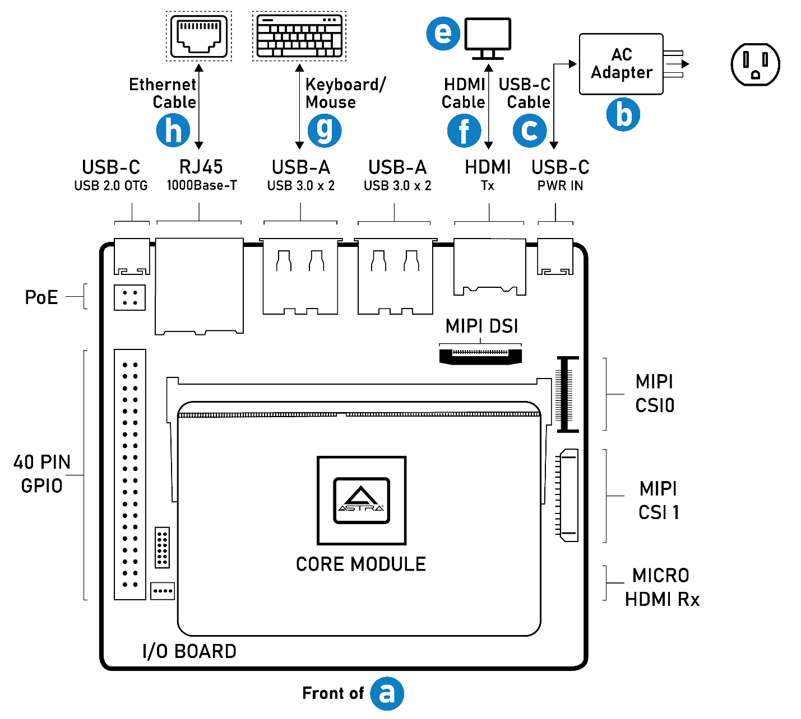
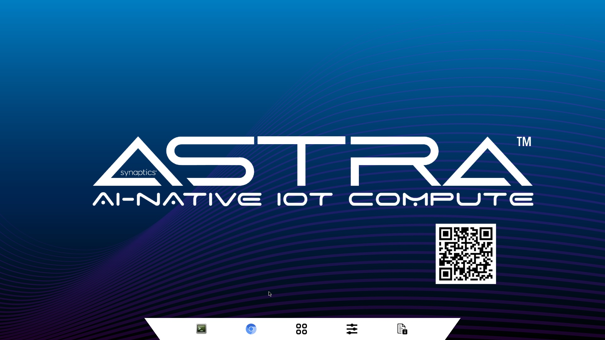

Setting up the hardware
=======================

The Astra Machina Foundation Series of evaluation-ready kits
enable easy and rapid prototyping for the Synaptics SL-Series of
embedded Linux and Android processors. A modular
design incorporates swappable core compute modules, a common I/O board,
and daughter cards for connectivity, debug, and flexible I/O options.
This page lists the simple steps to power on and boot up the system
and applies to all SL-Series core modules: SL1680, SL1640, and SL1620.

    Core module connections

Included in the box
-------------------

a. Astra Machina Foundation Series system with core module, I/O board,
   and daughter card for Wi-Fi/BT connectivity

b. AC power adapter (USB Power Delivery)

c. USB-C cable (USB-C plugs on both ends)

d. AC plug adapter (IEC Type A receptacle/Type C plug, used only if applicable)

Additional items needed
-----------------------

e. A display monitor with an HDMI port

f. An HDMI cable (standard HDMI Type A plugs on both ends)

.. note::
    Ethernet or network connection is not needed for the first boot.

Making the connections
----------------------

1. Plug AC adapter **[b]** to an AC outlet (with **[d]** if applicable).

2. Connect display monitor **[e]** to the Astra Machina **[a]** with
   HDMI cable **[f]**.

3. [Optional] Connect Ethernet cable **[h]** to Astra Machina board
   **[a]**.

4. [Optional] Connect USB Keyboard and/or Mouse **[g]** to Astra Machina
   board **[a]**.

5. Connect AC adapter **[b]** and Astra Machina board **[a]** using
   USB-C cable **[c]**.

First boot
----------

-  Once powered on, the Astra Machina board will complete its first boot
   to the Start-up screen as shown in :ref:`welcome_picture`. A green LED next to
   PWR_IN will grow but not flicker.

.. _welcome_picture:

   Startup screen

.. note::

    A Linux distribution built from Yocto by Synaptics is preloaded to
    the on-board eMMC storage device.

Network connectivity and applications
-------------------------------------

-  Plug Ethernet cable **[h]** to the RJ45 port of the Astra Machina for
   internet connection.

-  Explore pre-loaded applications

-  Linux terminal from Wayland Desktop

-  Built-in Chromium browser

-  Media and AI sample applications

Additional documentation and resources
--------------------------------------

For more information on Astra SDK, Astra Machina board, and SyNAP AI
Toolkit, scan the QR codes presented on the Start-up screen or the
packaging box. You can find detailed information on the following:

-  :doc:`/linux/index`  for details on the board support package
   (BSP), image flashing and upgrades, Wireless setup, and so on.

-  :doc:`/hw/index` for hardware specification, features, and
   interfaces.

-  :doc:`/yocto` for building SDK image from source code packages.

-  Support requests and more.

