Using the Built-in Applications
===============================

Astra Machina comes preinstalled with several applications which showcase the capabilities of the platform.

As shown in the :doc:`hw_setup` guide, Astra Machina starts up with the welcome screen. The welcome screen is a
customized Weston desktop.

.. figure:: ./media/welcome_screen.jpg

   The Welcome Screen

At the bottom is a quick access panel with icons which will launch the three applications.

- Terminal
- Chromium Browser
- SynaExplorer
- Settings
- About

Terminal
--------

A standard Linux terminal can be launched by clicking the terminal icon on the quick access panel.

.. figure:: media/terminal.jpg

Chromium Browser
----------------

Chromium can be launched by clicking the Chromium icon in the quick access panel.

.. figure:: media/chromium.jpg

SynaExplorer
------------

The SynaExplorer app demonstrates the capabilities of the Astra platform. It showcases multimedia and AI inferencing using files,
USB cameras, and RTSP camera streams. AI inferencing is done using YOLO v5 and v8 models.

Open the SynaExplorer app by clicking the icon with the four squares in the quick access panel.

.. figure:: media/syna-explorer-icon.jpg

    SynaExplorer icon highlighted in quick access panel

The app opens to the landing page, with demo category buttons on the left and a "Getting Started" pane on the right.
The pane displays a thumbnail of the Astra intro video, which plays when clicked. The app uses Gstreamer to handle
video and audio playback of the video file.

.. figure:: media/syna-explorer-getting-started.jpg

    Getting Started pane on SL1640

The video will play continuously until the "Close" button in the lower right hand corner is clicked. This will return the user
to the main page.

.. figure:: media/getting-started-video-close-button-crop.jpg

    Highlighted Close button during video playback

Video
^^^^^

The second button on the left is the "Video" button, which opens the "Video" pane. This pane has a button for the "Video Player"
demo. On SL1640 and SL1680 there will also be a button for the "Video Mixer" demo.

.. figure:: media/syna-explorer-video-pane-sl1680.jpg

    Screenshot of the "Video" pane on SL1640.

Syna Video Player
"""""""""""""""""

The "Video Player" demonstrates video playback from multiple sources.
- File source - Astra video files (1080p30)
- USB camera source
- RTSP camera source

.. figure:: media/syna-video-player-main.jpg

    Video Player on SL1640

Use the dropdown to the right of the "Video 1" label to select a source.

.. figure:: media/syna-video-player-source-dropdown.jpg

    Video Player on dropdown menu on SL1640

Use the "Update RTSP Urls" windows to set the RTSP URL when using a RTSP camera as the source. After entering the RTSP URL, press OK button.

.. figure:: media/syna-video-player-rtsp.jpg

    Update RTSP Urls window on SL1640

Multi View
**********

SL1680 supports playback of four streams at once. In the Syna Video Player app, the UI shows four video
stream options and a "Quad View" setting. To play all streams, select one stream from each dropdown menus
and choose the "Quad View" option.

.. figure:: media/syna-video-player-multiview.jpg

    Video Player on SL1680 with Quad View support

.. note::

    Support for 4 USB cameras require that at least 2 of the camera use USB 3.0.

.. note::

    Synaptics has tested 4 USB cameras using 2 Logitech Brio 4K Ultra USB 3.0 cameras along with 2 Logitech
    C920 HD Pro USB 2.0 cameras.

On SL1680 the RTSP URL window will allow 4 RTSP camera URLs to be set.

.. figure:: media/syna-video-player-multiview-rtsp.jpg

    Update RTSP Urls window on SL1680 with Quad View support

.. note::

    Synaptics has verified using 4 1080p15 RTSP streams with Quad View.

Video Mixer
"""""""""""

SL1640 and Sl1680 support the "Video Mixer" demo. This demo uses an OpenGL based mixer to composite 9 streams and outputs
them to the display. SL1640 supports 9 640x480p streams while SL1680 supports 9 1280x720p streams.

.. figure:: media/syna-explorer-gl-mixer.jpg

    Video Mixer on SL1680

Graphics
^^^^^^^^

The third button on the left is the "Graphics" button, which opens the "Graphics" pane. This pane contains three demos which
showcase the graphics capability of Astra Machina. These demos are stock QT examples which are included as part of the QT 5
environment. These demos are `Textures <https://doc.qt.io/qt-5/qtopengl-textures-example.html>`__, 
`Animated Tiles <https://doc.qt.io/qt-5/qtwidgets-animation-animatedtiles-example.html>`__, and
`FingerPaint <https://doc.qt.io/qt-5/qtwidgets-touch-fingerpaint-example.html>`__.

.. figure:: media/syna-explorer-graphics.jpg

    Graphics pane on SL1680

.. note::

    The FingerPaint application is intended to be used with displays with a touch panel.

Syna AI
^^^^^^^

The fourth button on the left is the "AI" button, which opens the "AI" pane. This pane contains a button to launch the "AI Player" app, which includes two sets of usecases. Video Usecases and Audio Usecases

.. figure:: media/syna-explorer-ai-pane.jpg

    AI pane on SL1680

Video Usecases
""""""""""""""

This includes object detection, pose estimation, and face detection examples. There is also an example which does object detection using a USB camera and encodes then streams the output over UDP. SL1680 supports Multi-AI which supports doing AI inferencing on four streams and outputting the result to the display. SL1680 supports AI inferencing on muxed stream of 3x3 tiles composed from 4 USB camera streams and outputting the result to the display.

Object Detection
****************

The object detection example uses a YOLOv8 model to detect object from a 1080p25 file source or a USB camera at 640x480 resolution.

.. figure:: media/syna-ai-player-object-detection.jpg 
    
    The Object Detection Window on SL1680

.. figure:: media/syna-ai-player-object-detection-output.jpg
    
    Object Detection output from the default 1080p25 file

Pose Estimation
***************

The pose estimation example uses a YOLOv8 model to do pose estimation on a 1080p25 file source or a USB camera at 640x480 resolution.

.. figure:: media/syna-ai-player-pose-estimation.jpg 
    
    The Pose Estimation Window on SL1680

.. figure:: media/syna-ai-player-pose-estimation-output.jpg
    
    Pose Estimation output from the default 1080p25 file

Face Detection
**************

The face detection example uses a YOLOv5 model to detect faces using a USB camera at 640x480 resolution.

.. figure:: media/syna-ai-player-face-detection.jpg 
    
    The Face Detection Window on SL1680

Multi-AI
********

SL1680 Multi-AI supports 3 different demos:

1) USB Camera: 4 different AI inferencing of four camera streams and displaying the output. The streams
can be from four USB cameras at 640x480 resolution.

2) AI on Muxed 9x480p: Single AI inferencing of muxed stream of multiple cameras and displaying the output.
The streams can be from four USB cameras at 640x480 resolution. In this example, total 9 streams of 640x480p 
(some are duplicated) from 4 diferent USB cameras are tiles into single frame using GPU and object detection
is performed on the muxed frame and then displayed with bounding box and label.

3) RTSP Camera: AI inferencing of four RTSP camera streams and displaying the output. The streams are from four
RTSP camera at 1080p15. RTSP streams can be configured using the "Update RTSP Urls" window. In this example, person
detection is performed on all four streams.

.. figure:: media/syna-ai-player-multi-ai.jpg

    Multi-AI pane on SL1680

.. note::

    Support for 4 USB cameras require that at least 2 of the camera use USB 3.0.

.. note::

    Synaptics has tested 4 USB cameras using 2 Logitech Brio 4K Ultra USB 3.0 cameras along with 2 Logitech
    C920 HD Pro USB 2.0 cameras.

.. note::

    Synaptics has verified using 4 1080p15 RTSP streams with Quad View.

AI + Encoding
*************

The AI + Encoding example showcases Astra Machina's ability to create a pipeline which performs Decoding + AI + Encoding + Streaming.
The input source is a USB camera at 640x480 resolution and the output is streamed over the network using UDP. A host can then connect
the the stream using Gstreamer to view the output. Output is also output to the display.

.. figure:: media/syna-ai-player-ai-encoding.jpg

    AI + Encoding pane on SL1680

A window will open when the camera button is clicked. The window will ask for the IP address of the host which will be receiving the
stream. Enter the IP address and click "OK".

.. figure:: media/syna-ai-player-ai-encoding-host.jpg

    Host IP window on SL1680

The host receiving the stream will need Gstreamer installed to receive it. They run ``gst-launch-1.0`` to view the stream.

For example, run this command on Window::

    gst-launch-1.0.exe udpsrc port=8003 ! "application/x-rtp, media=video, clock-rate=90000, \
        encodingname=H264, payload=96" ! queue ! rtph264depay ! h264parse ! avdec_h264 ! d3dvideosink

or, run this command on Linux::

    gst-launch-1.0 udpsrc port=8003 ! "application/x-rtp, media=video, clock-rate=90000,encodingname=H264, \
        payload=96" ! queue ! rtph264depay ! h264parse ! avdec_h264 ! autovideosink

Super Resolution
****************

Super Resolution (SR) is a technique used in image processing and computer vision to enhance the resolution of an image or video. This application showcases the chip capability in enhancing camera and file inputs to higher resolution using AI-powered super resolution.

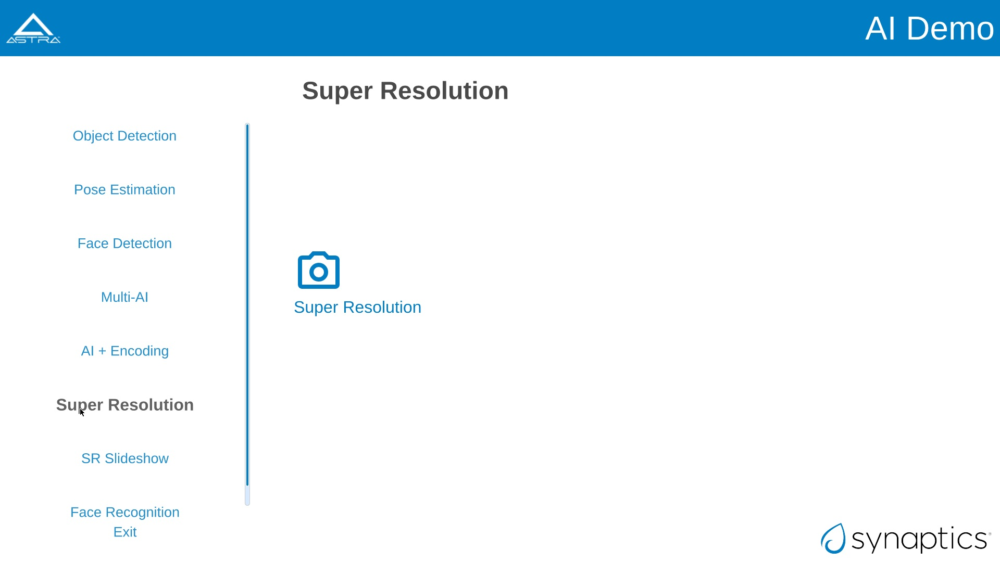

    Super Resolution pane on SL1680

.. note::

	For SR, the application needs to run in 4K resolution. When launching the application, a popup will appear prompting you to switch to 4K. Upon clicking 'OK', the system will reboot and switch to 4K mode, after which the application can be run. Other applications run in 2K resolution by default. When you attempt to launch them, a popup will appear asking to switch back to 2K. Clicking 'OK' will reboot the system and revert to 2K mode.
	

For USB Camera case, it will list all the connected devices information, and user can select from the drop-down menu. Choose input and output resolution from the drop-down menu. And select model type (Fast or Qdeo) and save the configuration.

For File source case, select the file source option from the input configuration dialog box and click on "Save."

.. note::
	Please note that video files with only the input resolutions 640x360, 960x540 and 1280x720 are supported. 

Use the button on the right top corner to enable/disable Super Resolution. By-default Super Resolution is enabled.

SR Slideshow
************

The goal of SR is to generate a high-resolution (HR) image or video from one or more low-resolution (LR) images or videos. This application displays original and enhanced images side-by-side in a slideshow format.

.. note::

	For SR, the application needs to run in 4K resolution. When launching the application, a popup will appear prompting you to switch to 4K. Upon clicking 'OK', the system will reboot and switch to 4K mode, after which the application can be run. Other applications run in 2K resolution by default. When you attempt to launch them, a popup will appear asking to switch back to 2K. Clicking 'OK' will reboot the system and revert to 2K mode.

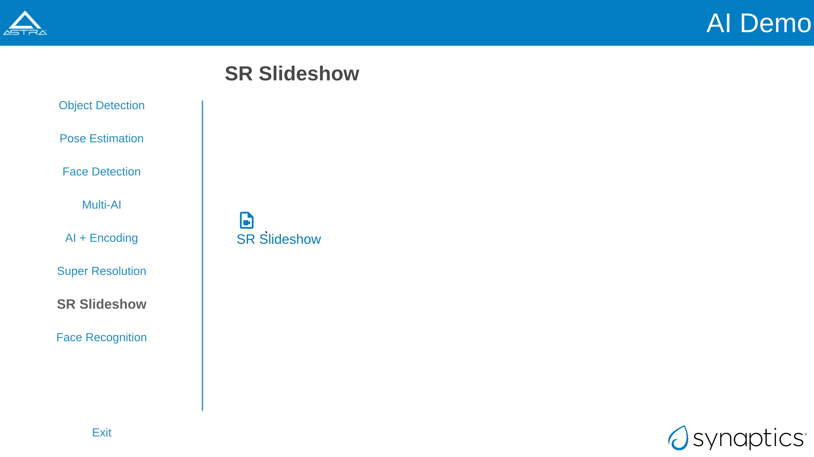

    Super Resolution slideshow pane on SL1680

This application uses a set of images to run super-resolution. It displays both normal and super-res enhanced image.

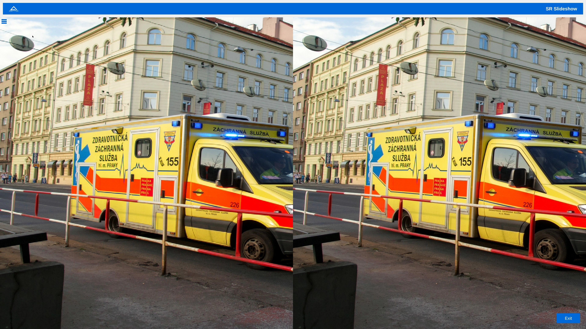

    Super Resolution slideshow example

There's option to Play Default and Play User Files. Please note that only PNG files with a resolution of 1280x720 and bit depth of 24 bits are supported.

After selecting the desired files, click on "Play User Files" to begin playback of the added files. Also the added files can be removed by Remove Files option.

In the center, you will find the Play button, which will simply start the application with the default files.

Face Recognition
****************
This application is for real time face recognition and identification. 

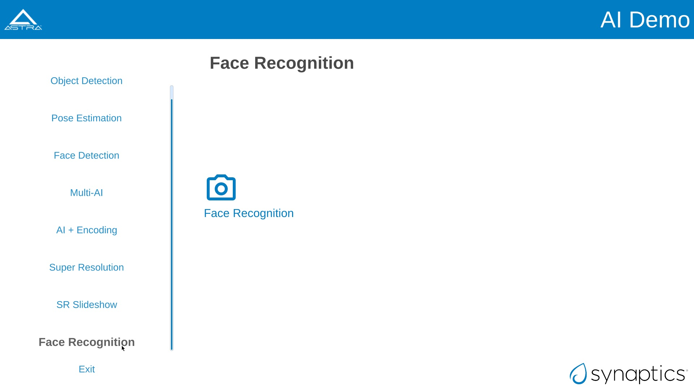

    Face Recognition pane on SL1680

Upon initiation of the camera feed via the Play function, the system will detect new faces. For each new detection, a preview image will be displayed, prompting the user to provide a name. This name is then saved to the local database. For faces already present in the database, the corresponding name will be automatically displayed above the bounding box. All face identification data is stored locally in the face_id_data.yml file, located at /home/root/demo/configs.

.. note::

	The current application iteration processes only the largest detected face within the frame for recognition purposes.

Audio Usecases
^^^^^^^^^^^^^^^
Audio Usecases button opens Audio Classification application. Audio classification is run with YAMNet tflite model. YAMNet is an audio event classifier that takes an audio waveform as input and makes independent predictions for each of the 521 audio events.

.. note::
	For this use case, the USB camera's microphone is required. It must be connected for testing.

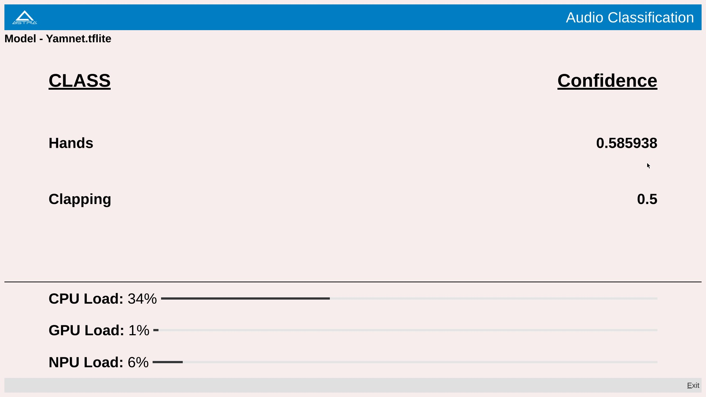

    Audio Classification pane on SL1680

Capability Demo
^^^^^^^^^^^^^^^

The fifth button on the left is the "Capability Demo" button, which opens the "Capability Demos" pane. This pane contains a button to launch the
"Best Case" app, which demonstrates the capability of the platform.

.. figure:: media/syna-capability-demo-pane.jpg

    Capability Demo pane on SL1680

Best Case
"""""""""

The example demonstrates one of the best use case which the platform can support.

.. note::

    This example doesn't define the limit for individual IP block. Refer datasheet for checking complete capabilities of individual IP block.

This Best Case demo app demonstrates the capability of the platform running multiple things concurrently as mentioned below:

SL1680:
1. Multiple decoding: 4 Streams of 1920x1080@25 & 4 streams of 1280x720@25
2. USB camera streaming and preview of 640x480@30
3. Mixing of streams mentioned in #1 & #2 and rendering to display
4. HDMI-RX stream receiving from Laptop (up to 4K60) and rendering to display

SL1640:
1. Multiple decoding: 9 streams of 640x480@25
2. Mixing of streams mentioned in #1 and rendering to display

SL1620:
1. Multiple decoding: 2 streams of 640x480@30 using FFMpeg SW
2. Mixing of streams mentioned in #1 and rendering to display

A window will open where selection of different H.264 video files can be made. Number of selection depends on platform capability.

.. figure:: media/syna-best-case-sl1680.jpg

    Best case on SL1680

Click on left side buttons, to select a file. A file explorer will open which will allow to navigate and select a file.

.. figure:: media/syna-best-case-file-select.jpg

    Best case H.264 file selection

Click on "SAVE SETTINGS" button to save selections. Click on "PLAY" button to start.

Camera Config
^^^^^^^^^^^^^

The sixth button on the left is the "Camera Config" button. This pane contains options to configure camera settings for different SynaExplorer demo applications.

.. note::

    Defaults will be used if settings is not used to configure.

.. figure:: media/camera-config-pane.jpg

    Camera Config pane on SL1680

First section is for configuring the priority for the USB camera format selection. Click on the right side highlighted buttons to raise or
lower the priority of specific format. Once done click on "Save Priorities" button.

.. figure:: media/settings-priorities-crop.jpg

    USB camera format priority settings on SL1680

Second section is for configuring the RTSP URLs. After entering the RTSP URLs, click on "Save URLs" button. RTSP URLs can be verified by
clicking on "Validate URLs" button to check if they are alive and reachable. Also it shows streaming media information.

.. figure:: media/settings-rtsp-urls-crop.jpg

    RTSP URLs settings on SL1680

.. figure:: media/settings-rtsp-urls-validate-crop.jpg

    RTSP URLs Validation on SL1680

ISP Camera
^^^^^^^^^^
The last pane on Applications is ISP Camera.
.. note::

    ISP camera is available only in sl1680.

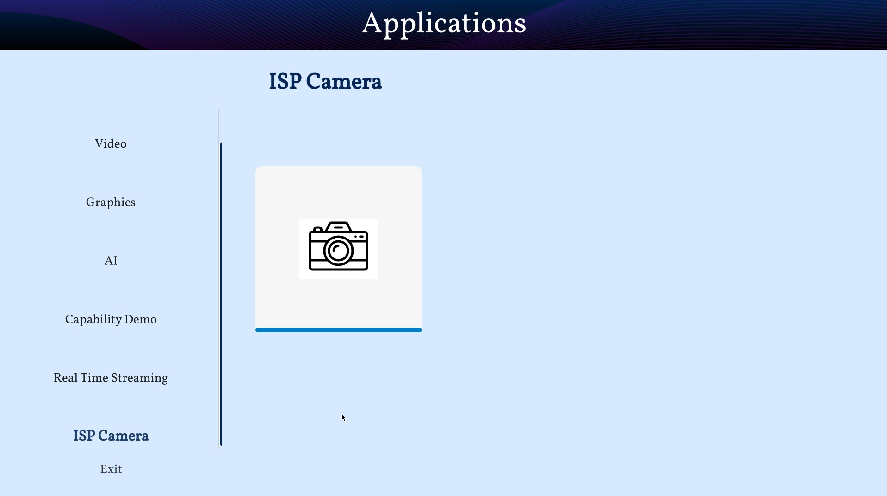

    ISP camera pane on SL1680

Settings
--------

Settings can be launched by clicking the Settings icon in the quick access panel. Settings app helps to configure different modules like Display.

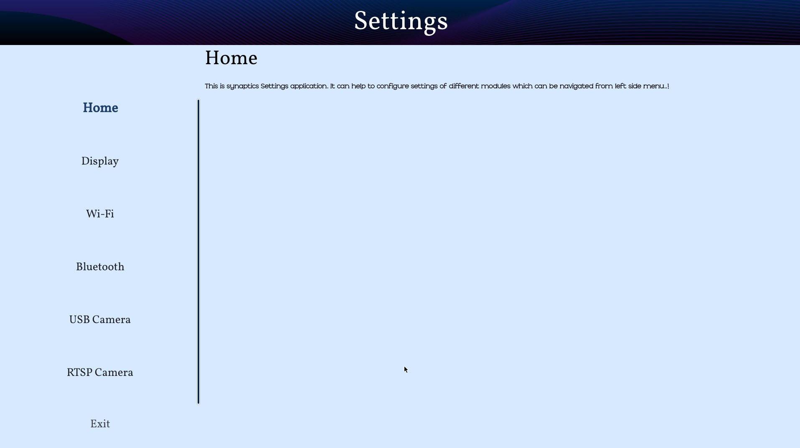

Display Config
^^^^^^^^^^^^^^

Display config allows to select MIPI panel for given platform. You can select a panel from auto filled dropdown menu and click on "Save Panel" button. It will popup a messege to reboot a board. On reboot your new panel will be configured.

.. figure:: media/settings-display-config.jpg

	Display config pane on SL1680

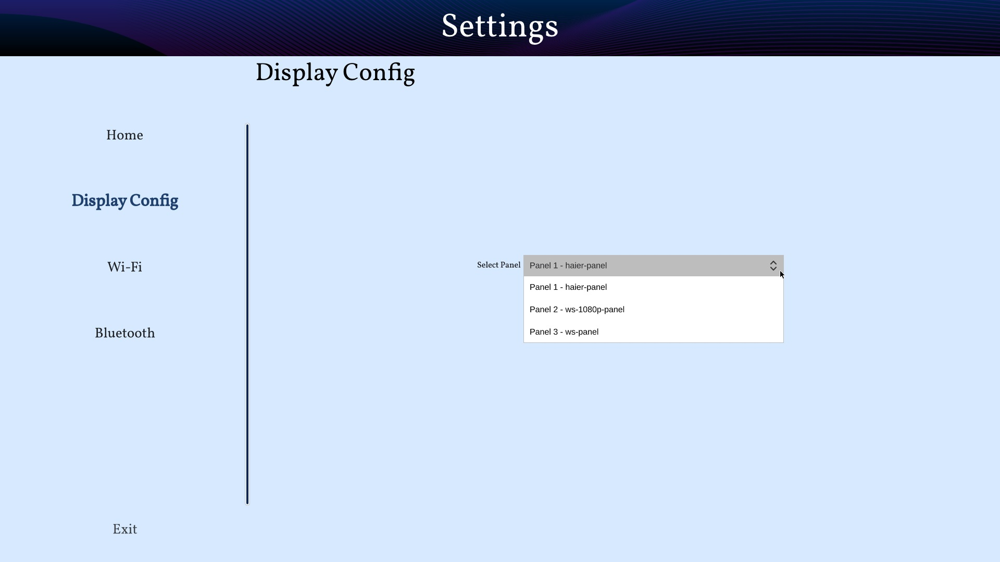

	Display config dropdown on SL1680

"Reset to Default" button configures the default display. "Print Panel Info" button gives currently configured panel information.

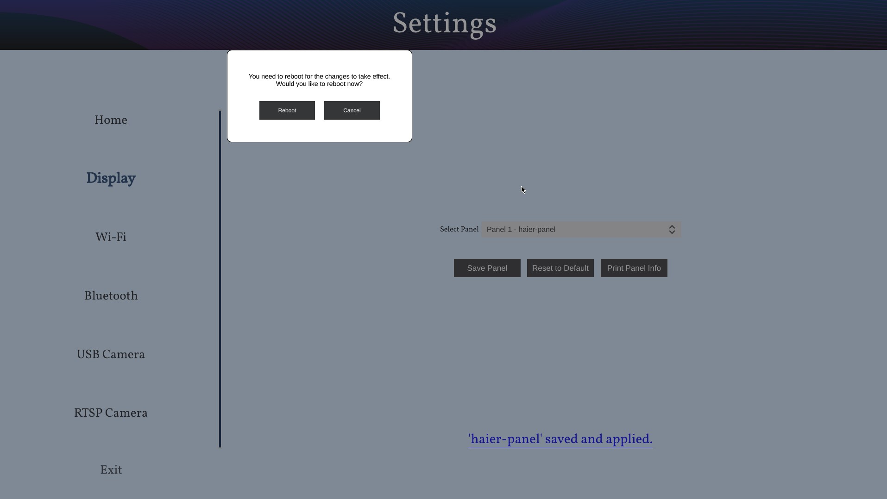

.. note::

    Before clicking on "Save Panel" or "Reset to Default" button, ensure that the required display panel is connected.

.. note::

    Before running display settings, it is required to save uboot environment once to have persistent configuration for display.
    Interrupt a boot process on start, to stop in uboot console (See :ref:`uboot_prompt`). Enter "saveenv" command to save uboot environment. Reboot a system.

WiFi
^^^^

Wifi settings allows you to connect to the available wifi network options.

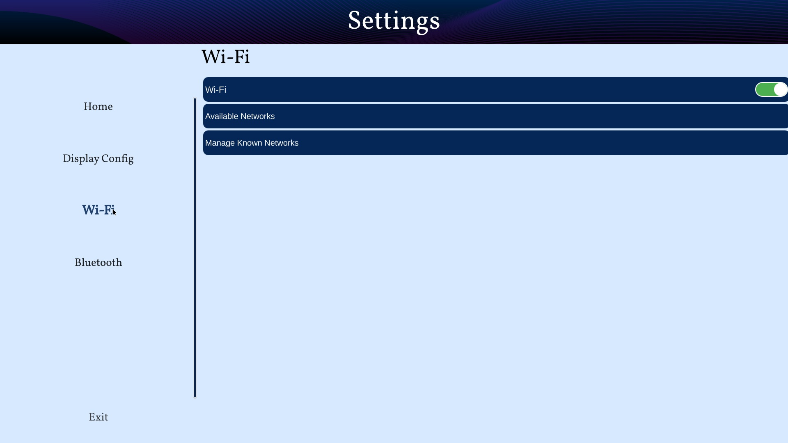

	Wifi pane on SL1680

Bluetooth
^^^^^^^^^

Bluetooth settings allows you to connect to the available bluetooth network options.

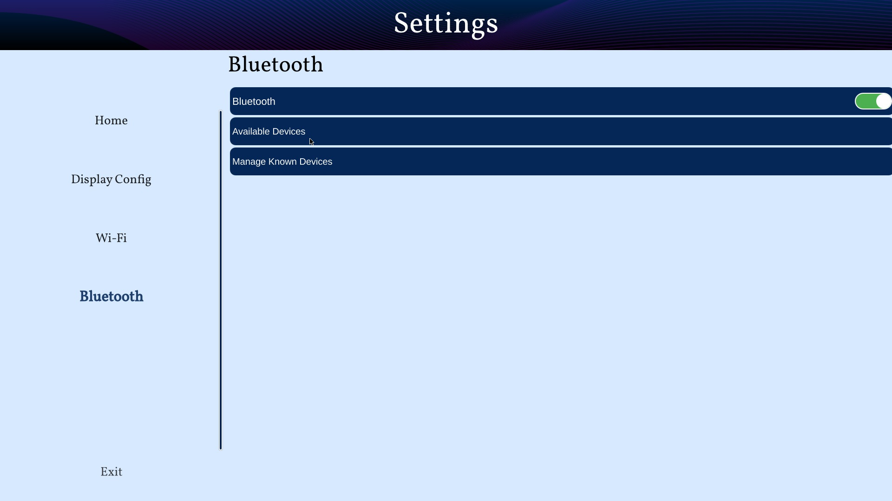

	Bluetooth pane on SL1680

About
-----

About can be launched by clicking the About icon in the quick access panel. About helps to identify software version, hw revisions, linux build
versions. It also provides some information on useful applications and internet links to resources.

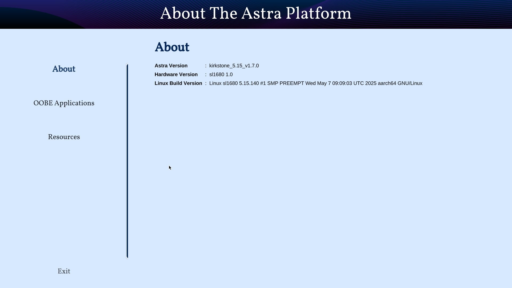

