Using the Built-in Applications
===============================

Astra Machina comes preinstalled with several applications which showcase the capabilities of the platform.

Astra Machina starts up with the welcome screen. The welcome screen is a
customized Weston desktop.

   The Welcome Screen

At the bottom is a quick access panel with icons which will launch the three applications.

- Terminal
- Chromium Browser
- SynaExplorer
- Settings
- About

How to Use Audio
----------------

.. note::

    Currently, only 3.5mm playback works. For microphone use, follow these
    steps:

Connect the USB headset.

Enable audio by configuring the USB headset as the default device.
Update ``/etc/asound.conf`` as follows (run ``arecord -l`` to find the card
  number):

::

    pcm.!default {
        type hw
        card <number>
        device <number>
    }

    ctl.!default {
        type hw
        card <number>
    }

To enable USB Audio for Chromium (Microphone Use cases only):

1. Follow the same steps as above.

2. Then, perform the following steps:

::

   vi /etc/xdg/weston/weston.ini

Remove **--alsa-output-device=hw:0,1** from the following file section:

::

[launcher]

    icon=/usr/share/syna-weston-desktop/browser.png
    path=XDG_RUNTIME_DIR=/var/run/user/0 WAYLAND_DISPLAY=wayland-1
    QT_QPA_PLATFORM=wayland CHROME_USER_DATA_DIR=/home/root/chromium_data/
    /usr/bin/chromium --no-sandbox --alsa-output-device=hw:0,1
    --restore-last-session
    displayname=Chromium

::

    systemctl restart weston

Terminal
--------

A standard Linux terminal can be launched by clicking the terminal icon on the quick access panel.

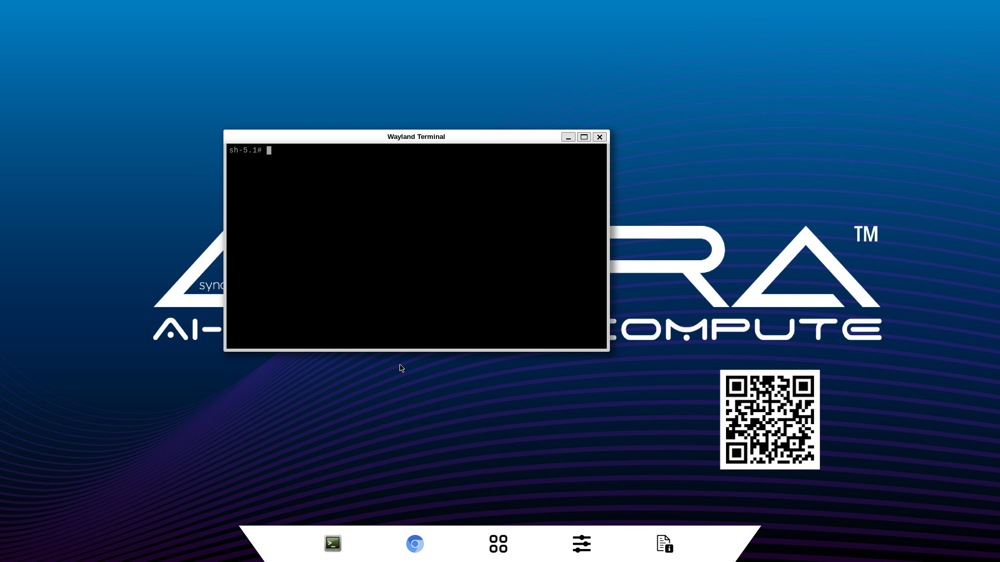

Chromium Browser
----------------

Chromium can be launched by clicking the Chromium icon in the quick access panel.

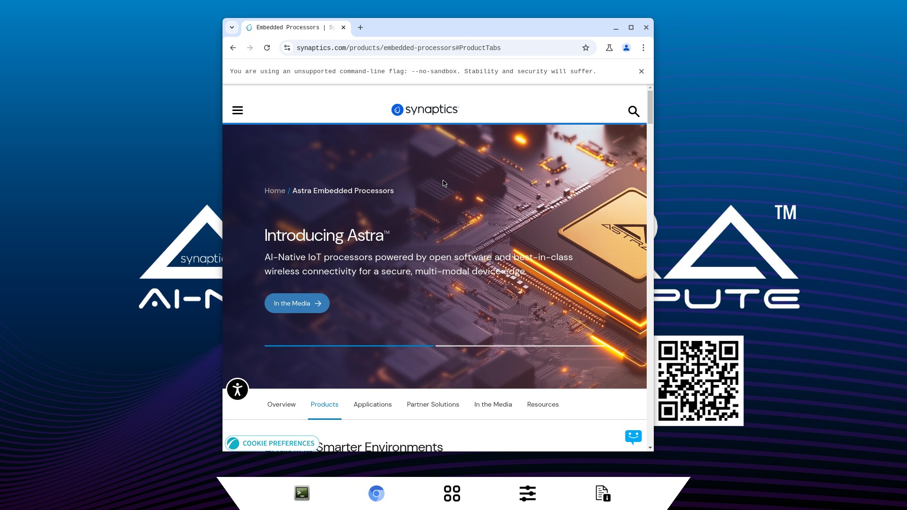

YouTube Playback:

-  Open Chromium and search for a YouTube video to stream
-  set playback to 480p

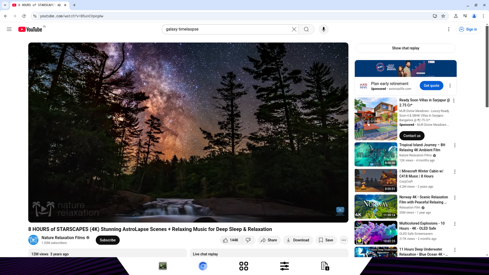

SynaExplorer
------------

The SynaExplorer app demonstrates the capabilities of the Astra platform. It showcases multimedia using files,
USB cameras, and RTSP camera streams.

Open the SynaExplorer app by clicking the icon with the four squares in the quick access panel.

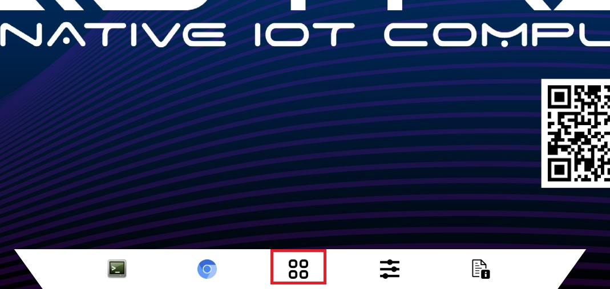

    SynaExplorer icon highlighted in quick access panel

The app opens to the landing page, with demo category buttons on the left and a "Getting Started" pane on the right.
The pane displays a thumbnail of the Astra intro video, which plays when clicked. The app uses Gstreamer to handle
video and audio playback of the video file.

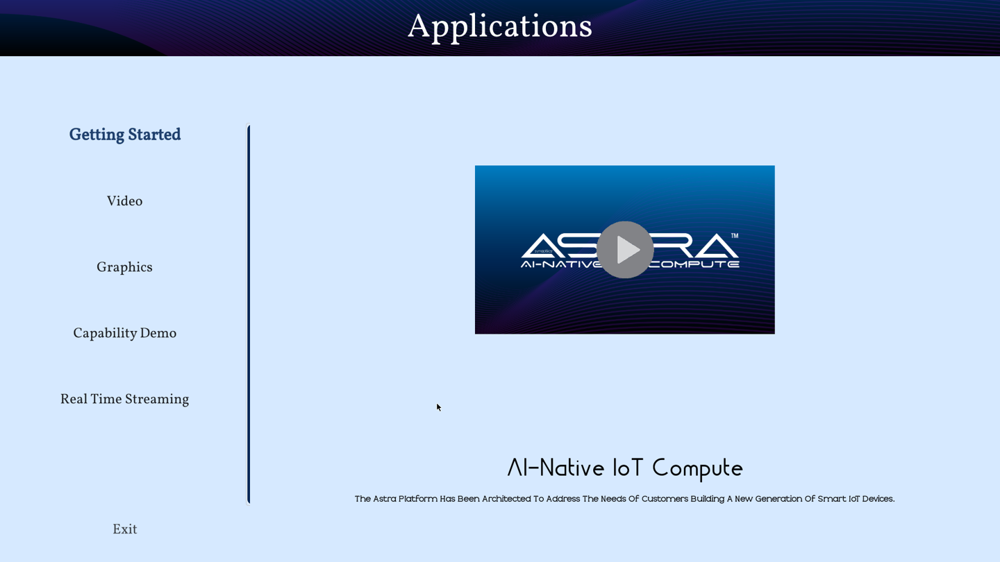

    Getting Started pane on SL2619

The video will play continuously until the "Close" button in the lower right hand corner of footer is clicked. This will return the user to the main page.

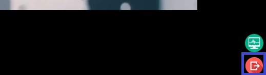

    Highlighted Close button during video playback

This footer also has an option to display real-time resource usage information such as CPU and Memory consumption during runtime. To enable this, you can click on the "Show stats" button on the lower right hand corner.

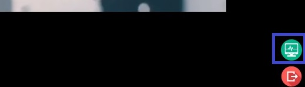

    Highlighted Show Stats button during video playback

It appears as a horizontal panel at the bottom of the screen, occupying approximately 8–10% of the total display area. It remains persistently visible unless manually hidden or disabled for all the demos.

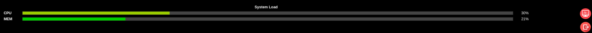

	System Load Status on Footer

.. note::
	The CPU stats shown in %CPU is the CPU used at the current moment by the entire usecase as a % of the current CPU freq which is configured as schedutil mode (which is dynamic in nature) by default. To see accurate %CPU usage, CPUfreq should be kept in performance (or fixed userdefined) mode.

Video
^^^^^

The second button on the left is the "Video" button, which opens the "Video" pane. This pane has a button for the "Video Player"
demo.

.. figure:: media/sl2619-syna-explorer-video-pane.png

    Screenshot of the "Video" pane on SL2619.

Syna Video Player
"""""""""""""""""

The "Video Player" demonstrates video playback from multiple sources.
- File source - Astra video files (1080p30)
- USB camera source
- RTSP camera source

.. figure:: media/syna-video-player-main.jpg

    Video Player on SL2619

Use the dropdown to the right of the "Video 1" label to select a source.

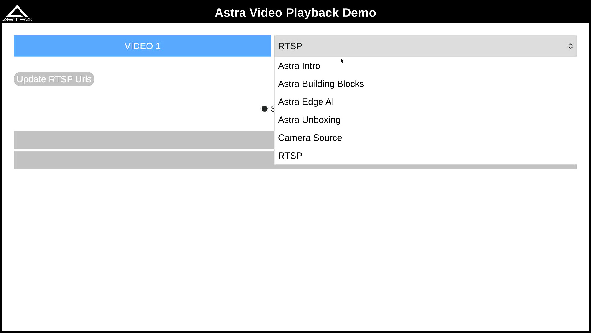

    Video Player on dropdown menu on SL2619

Use the "Update RTSP Urls" windows to set the RTSP URL when using a RTSP camera as the source. After entering the RTSP URL, press OK button.

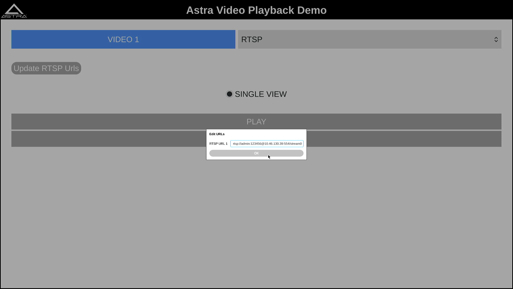

    Update RTSP Urls window on SL2619

Graphics
^^^^^^^^

The third button on the left is the "Graphics" button, which opens the "Graphics" pane. This pane contains three demos which
showcase the graphics capability of Astra Machina. These demos are stock QT examples which are included as part of the QT 5
environment. These demos are `Textures <https://doc.qt.io/qt-5/qtopengl-textures-example.html>`__, 
`Animated Tiles <https://doc.qt.io/qt-5/qtwidgets-animation-animatedtiles-example.html>`__, and
`FingerPaint <https://doc.qt.io/qt-5/qtwidgets-touch-fingerpaint-example.html>`__.

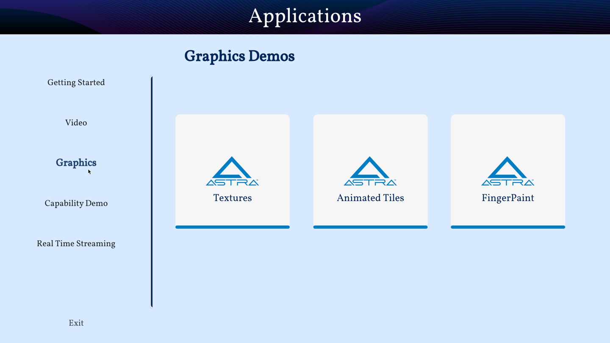

    Graphics pane on SL2619

.. note::

    The FingerPaint application is intended to be used with displays with a touch panel.

.. _SynaAI-label:

Capability Demo
^^^^^^^^^^^^^^^

The fifth button on the left is the "Capability Demo" button, which opens the "Capability Demos" pane. This pane contains a button to launch the
"Best Case" app, which demonstrates the capability of the platform.

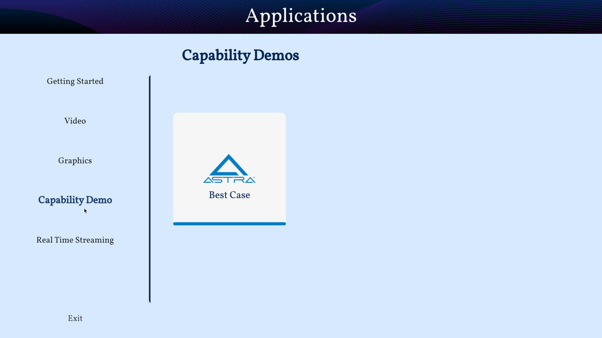

    Capability Demo pane on SL1680

Best Case
"""""""""

The example demonstrates one of the best use case which the platform can support.

Multiple decoding: streams of 640x360@30 using FFMpeg SW Mixing of streams and rendering to display.

A window will open where selection of different H.264 video files can be made. Number of selection depends on platform capability.

Click on left side buttons, to select a file. A file explorer will open which will allow to navigate and select a file.

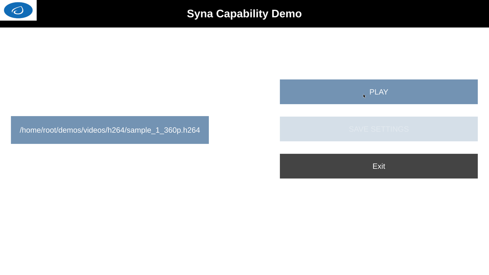

    Best case H.264 file selection

Click on "SAVE SETTINGS" button to save selections. Click on "PLAY" button to start.

Real Time Streaming
^^^^^^^^^^^^^^^^^^^
The sixth button on the left is the "Real Time Streaming" button. This pane contains syna players. One is Syna Gst WebRTC, Seamless Real-Time Communication with GStreamer's WebRTC Sink and the other one is Syna Dash Player, Adaptive MPD Player with Smooth Resolution Switching.

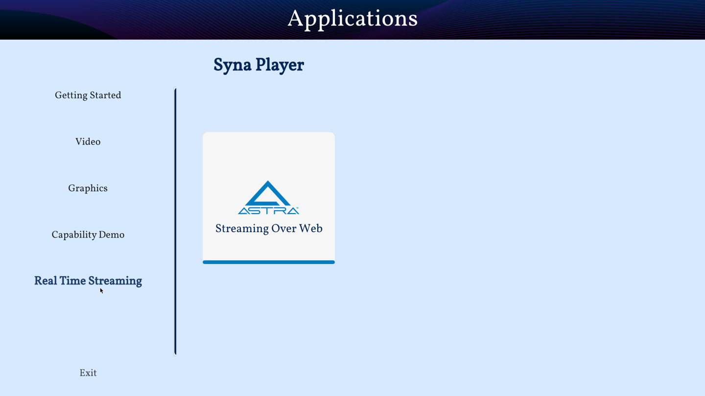

	Real Time Streaming Pane

Syna Gst WebRTC
"""""""""""""""
Astra transforms real-time communication by utilizing GStreamer's WebRTC sink for fast audio and video streaming. Built on the GStreamer framework, Astra provides developers with a seamless, scalable solution for modern communication needs

The WebRTC GStreamer plugin (webrtcsink) enables real-time peer-to-peer media streaming using WebRTC technology. This plugin allows GStreamer applications to transmit and receive audio and video streams over WebRTC, including essential features like built-in signaling, ICE (Interactive Connectivity Establishment), STUN/TURN, and data channels.

When users click on the “Streaming on Web” section, they will see the UI shown below, from the drop-down menu, user can choose Camera, FileSrc or AI Demos as Input.

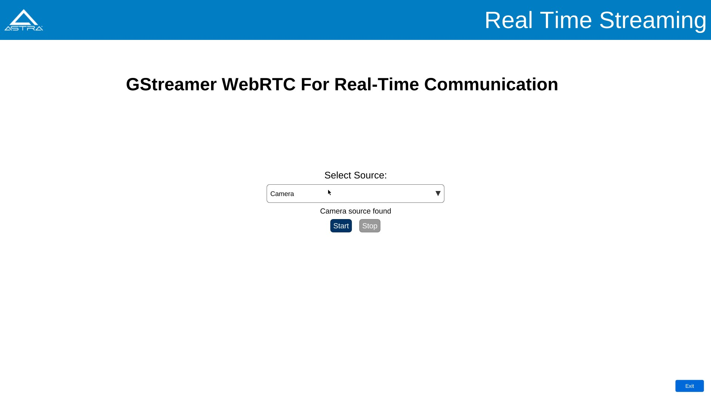

	UI for streaming on web

Steps for using Camera as an Input
**********************************
a.	Ensure a camera device is connected to the board before using this feature.
b.	Click the “Start” button after selecting the source. A message will appear, displaying the IP address and port number to watch the stream in any local browser. See the example image below:

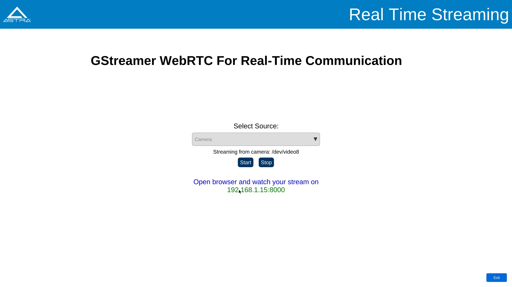

	Streaming on web with camera

c.	The stream will stop when the user clicks the “Stop” button or exits the app.
d.	After opening the IP address with the port number in a browser, a link will appear in the top left corner of the webpage. Click on that link to view the stream. Below is an example of how the user will see the stream in their local browser:

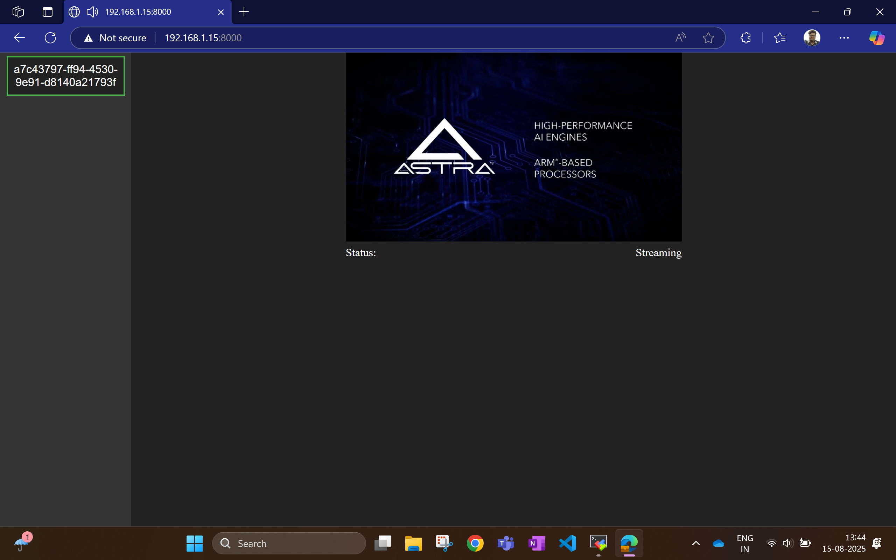

	User streaming on the local browser

Steps for using FileSrc as an Input
***********************************
a.	This option lets users stream local video files present on the system.
b.	Selecting this option opens a file explorer for users to choose a video file, as shown in the image below:

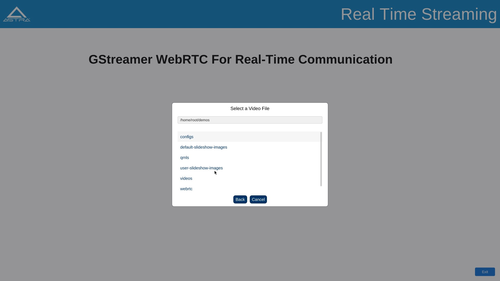

	Streaming on web with FileSrc

c.	After selecting a file, users must click the “Start” button to begin streaming.
d.	Streaming stops when users click the “Stop” button, end the stream, or exit the app.

Settings
--------

Settings can be launched by clicking the Settings icon in the quick access panel. Settings app helps to configure different modules like Display.

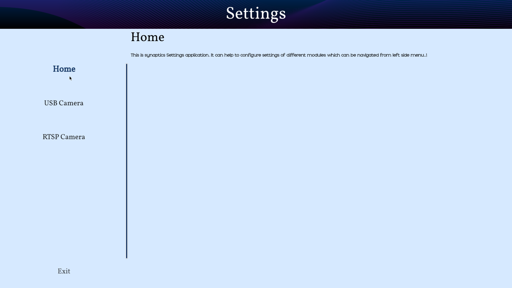

USB Camera
^^^^^^^^^^
This section is for configuring the priority for the USB camera format selection. Click on the right side highlighted buttons to raise or lower the priority of specific format. Once done click on "Save Priorities" button.

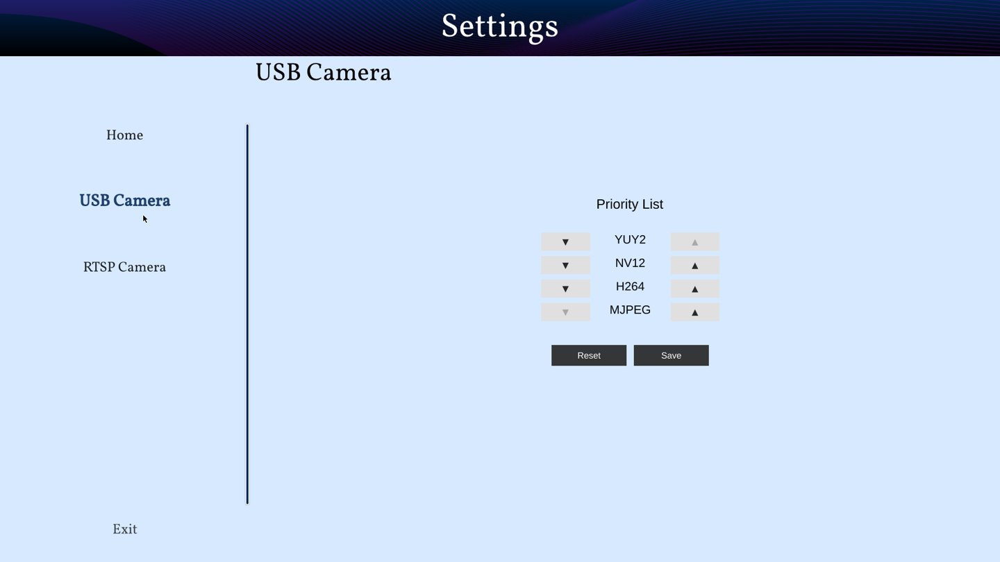

    USB camera format priority settings on SL2619

RTSP Camera
^^^^^^^^^^^
This section is for configuring the RTSP URLs. After entering the RTSP URLs, click on "Save URLs" button. RTSP URLs can be verified by clicking on "Validate URLs" button to check if they are alive and reachable. Also it shows streaming media information.

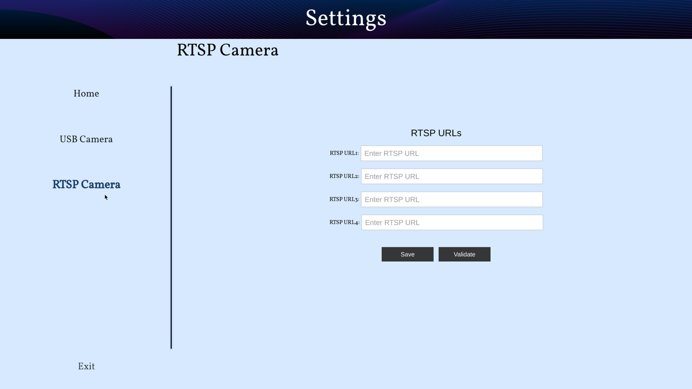

    RTSP URLs settings on SL2619

About
-----

About can be launched by clicking the About icon in the quick access panel. About helps to identify software version, hw revisions, linux build
versions. It also provides some information on useful applications and internet links to resources.

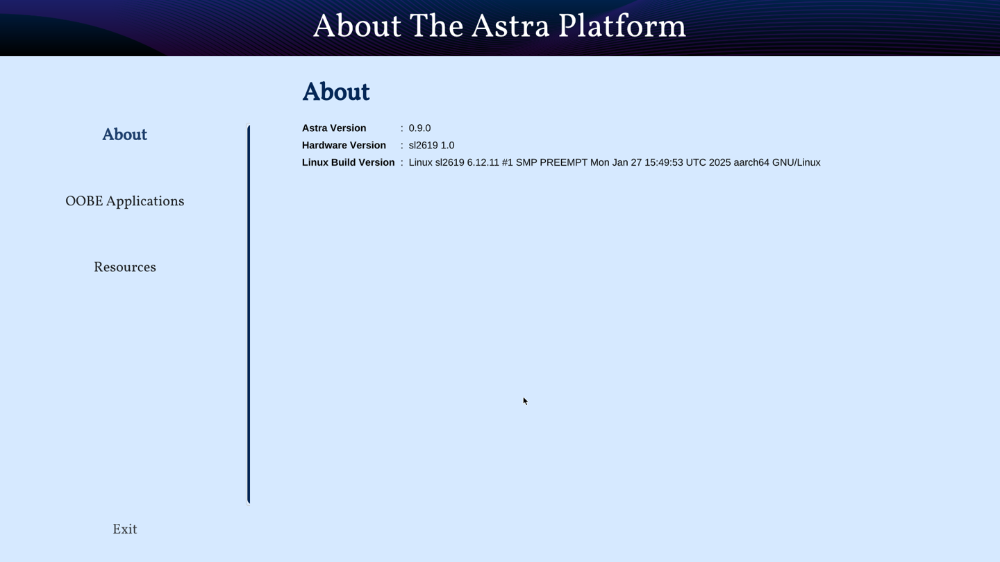

Users can access the OOBE applications from the panel.

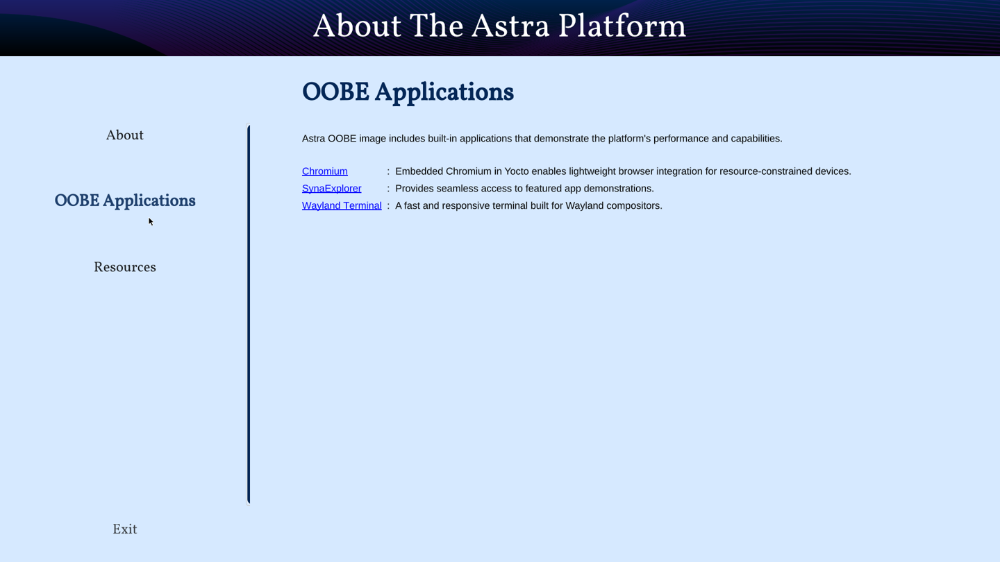