Using the Built-in Applications
===============================

Astra Machina comes preinstalled with several applications which showcase the capabilities of the platform.

As shown in the :doc:`hw_setup` guide, Astra Machina starts up with the welcome screen. The welcome screen is a
customized Weston desktop.

.. figure:: ./media/welcome_screen.jpg

   The Welcome Screen

At the bottom is a quick access panel with icons which will launch the three applications.

- Terminal
- Chromium Browser
- SynaExplorer
- Settings
- About

Terminal
--------

A standard Linux terminal can be launched by clicking the terminal icon on the quick access panel.

Chromium Browser
----------------

Chromium can be launched by clicking the Chromium icon in the quick access panel.

.. figure:: media/chromium.jpg

SynaExplorer
------------

The SynaExplorer app demonstrates the capabilities of the Astra platform. It showcases multimedia and AI inferencing using files,
USB cameras, and RTSP camera streams. AI inferencing is done using YOLO v5 and v8 models.

Open the SynaExplorer app by clicking the icon with the four squares in the quick access panel.

    SynaExplorer icon highlighted in quick access panel

The app opens to the landing page, with demo category buttons on the left and a "Getting Started" pane on the right.
The pane displays a thumbnail of the Astra intro video, which plays when clicked. The app uses Gstreamer to handle
video and audio playback of the video file.

.. figure:: media/syna-explorer-getting-started.jpg

    Getting Started pane on SL1640

The video will play continuously until the "Close" button in the lower right hand corner of footer is clicked. This will return the user to the main page.

    Highlighted Close button during video playback

This footer also have an option to display real-time resource usage information such as CPU, GPU, NPU, and Memory consumption during runtime. To enable this, you can click on the "Show stats" button on the lower right hand corner.

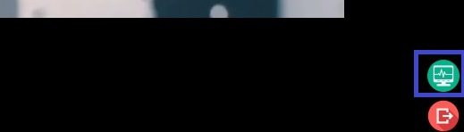

    Highlighted Show Stats button during video playback

It appears as a horizontal panel at the bottom of the screen, occupying approximately 8–10% of the total display area. It remains persistently visible unless manually hidden or disabled for all the demos.

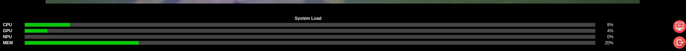

	System Load Status on Footer

.. note::
	The CPU stats shown in %CPU is the CPU used at the current moment by the entire usecase as a % of the current CPU freq which is configured as schedutil mode (which is dynamic in nature) by default. To see accurate %CPU usage, CPUfreq should be kept in performance (or fixed userdefined) mode.

Video
^^^^^

The second button on the left is the "Video" button, which opens the "Video" pane. This pane has a button for the "Video Player"
demo. On SL1640 and SL1680 there will also be a button for the "Video Mixer" demo.

.. figure:: media/syna-explorer-video-pane-sl1680.jpg

    Screenshot of the "Video" pane on SL1640.

Syna Video Player
"""""""""""""""""

The "Video Player" demonstrates video playback from multiple sources.
- File source - Astra video files (1080p30)
- USB camera source
- RTSP camera source

    Video Player on SL1640

Use the dropdown to the right of the "Video 1" label to select a source.

    Video Player on dropdown menu on SL1640

Use the "Update RTSP Urls" windows to set the RTSP URL when using a RTSP camera as the source. After entering the RTSP URL, press OK button.

    Update RTSP Urls window on SL1640

Multi View
**********

SL1680 supports playback of four streams at once. In the Syna Video Player app, the UI shows four video
stream options and a "Quad View" setting. To play all streams, select one stream from each dropdown menus
and choose the "Quad View" option.

.. figure:: media/syna-video-player-multiview.jpg

    Video Player on SL1680 with Quad View support

.. note::

    Support for 4 USB cameras require that at least 2 of the camera use USB 3.0.

.. note::

    Synaptics has tested 4 USB cameras using 2 Logitech Brio 4K Ultra USB 3.0 cameras along with 2 Logitech
    C920 HD Pro USB 2.0 cameras.

On SL1680 the RTSP URL window will allow 4 RTSP camera URLs to be set.

.. figure:: media/syna-video-player-multiview-rtsp.jpg

    Update RTSP Urls window on SL1680 with Quad View support

.. note::

    Synaptics has verified using 4 1080p15 RTSP streams with Quad View.

Video Mixer
"""""""""""

SL1640 and Sl1680 support the "Video Mixer" demo. This demo uses an OpenGL based mixer to composite 9 streams and outputs
them to the display. SL1640 supports 9 640x480p streams while SL1680 supports 9 1280x720p streams.

.. figure:: media/syna-explorer-gl-mixer.jpg

    Video Mixer on SL1680

Graphics
^^^^^^^^

The third button on the left is the "Graphics" button, which opens the "Graphics" pane. This pane contains three demos which
showcase the graphics capability of Astra Machina. These demos are stock QT examples which are included as part of the QT 5
environment. These demos are `Textures <https://doc.qt.io/qt-5/qtopengl-textures-example.html>`__, 
`Animated Tiles <https://doc.qt.io/qt-5/qtwidgets-animation-animatedtiles-example.html>`__, and
`FingerPaint <https://doc.qt.io/qt-5/qtwidgets-touch-fingerpaint-example.html>`__.

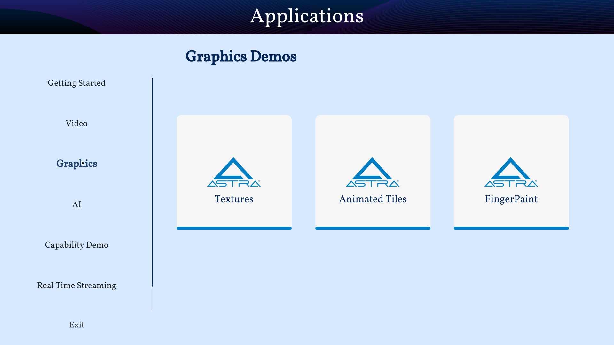

    Graphics pane on SL1680

.. note::

    The FingerPaint application is intended to be used with displays with a touch panel.

.. _SynaAI-label:

Syna AI
^^^^^^^

The fourth button on the left is the "AI" button, which opens the "AI" pane. This pane contains a button to launch the "AI Player" app, which includes two sets of usecases. Video Usecases and Audio Usecases

.. figure:: media/syna-explorer-ai-pane.jpg

    AI pane on SL1680

.. _VideoUsecases-label:

Video Usecases
""""""""""""""

This includes object detection, pose estimation, and face detection examples. There is also an example which does object detection using a USB camera and encodes then streams the output over UDP. SL1680 supports Multi-AI which supports doing AI inferencing on four streams and outputting the result to the display. SL1680 supports AI inferencing on muxed stream of 3x3 tiles composed from 4 USB camera streams and outputting the result to the display.

Object Detection
****************

The object detection example uses a YOLOv8 model to detect object from a 1080p25 file source or a USB camera at 640x480 resolution.

.. figure:: media/syna-ai-player-object-detection.jpg 
    
    The Object Detection Window on SL1680

    
    Object Detection output from the default 1080p25 file

Pose Estimation
***************

The pose estimation example uses a YOLOv8 model to do pose estimation on a 1080p25 file source or a USB camera at 640x480 resolution.

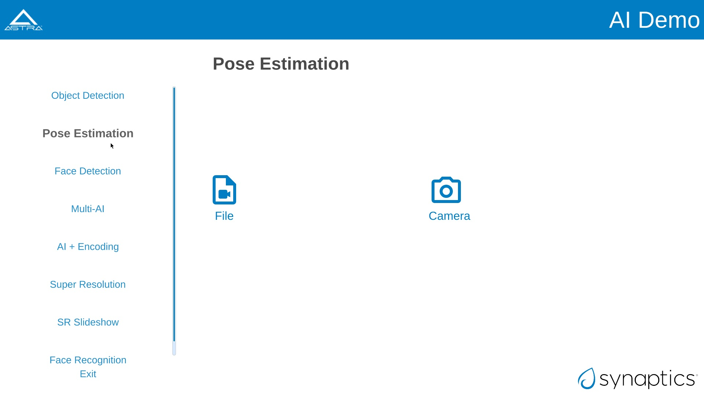
    
    The Pose Estimation Window on SL1680

    
    Pose Estimation output from the default 1080p25 file

Face Detection
**************

The face detection example uses a YOLOv5 model to detect faces using a USB camera at 640x480 resolution.

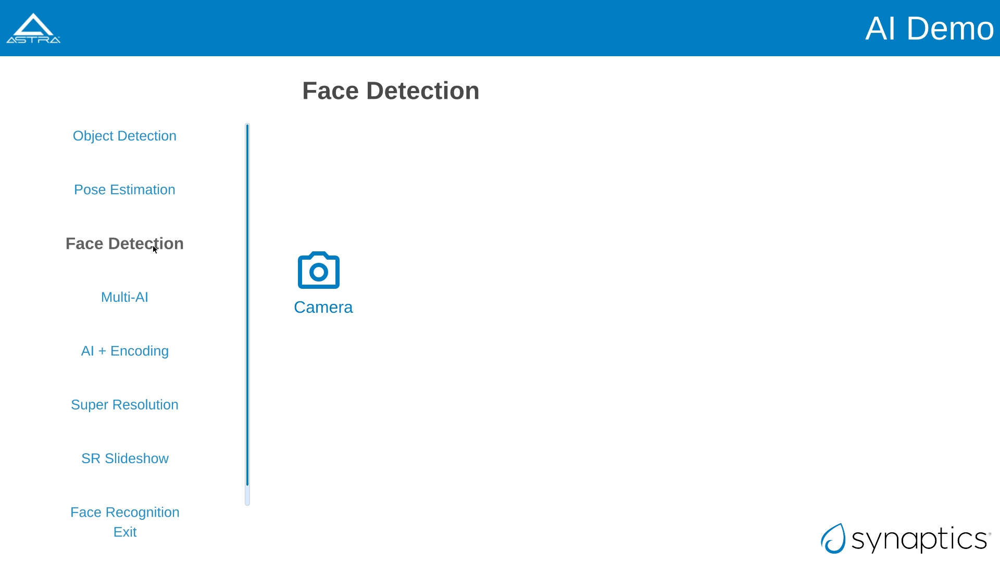
    
    The Face Detection Window on SL1680

Multi-AI
********

SL1680 Multi-AI supports 3 different demos:

1) USB Camera: 4 different AI inferencing of four camera streams and displaying the output. The streams
can be from four USB cameras at 640x480 resolution.

2) AI on Muxed 9x480p: Single AI inferencing of muxed stream of multiple cameras and displaying the output.
The streams can be from four USB cameras at 640x480 resolution. In this example, total 9 streams of 640x480p 
(some are duplicated) from 4 diferent USB cameras are tiles into single frame using GPU and object detection
is performed on the muxed frame and then displayed with bounding box and label.

3) RTSP Camera: AI inferencing of four RTSP camera streams and displaying the output. The streams are from four
RTSP camera at 1080p15. RTSP streams can be configured using the "Update RTSP Urls" window. In this example, person
detection is performed on all four streams.

    Multi-AI pane on SL1680

.. note::

    Support for 4 USB cameras require that at least 2 of the camera use USB 3.0.

.. note::

    Synaptics has tested 4 USB cameras using 2 Logitech Brio 4K Ultra USB 3.0 cameras along with 2 Logitech
    C920 HD Pro USB 2.0 cameras.

.. note::

    Synaptics has verified using 4 1080p15 RTSP streams with Quad View.

AI + Encoding
*************

The AI + Encoding example showcases Astra Machina's ability to create a pipeline which performs Decoding + AI + Encoding + Streaming.
The input source is a USB camera at 640x480 resolution and the output is streamed over the network using UDP. A host can then connect
the the stream using Gstreamer to view the output. Output is also output to the display.

.. figure:: media/syna-ai-player-ai-encoding.jpg

    AI + Encoding pane on SL1680

A window will open when the camera button is clicked. The window will ask for the IP address of the host which will be receiving the
stream. Enter the IP address and click "OK".

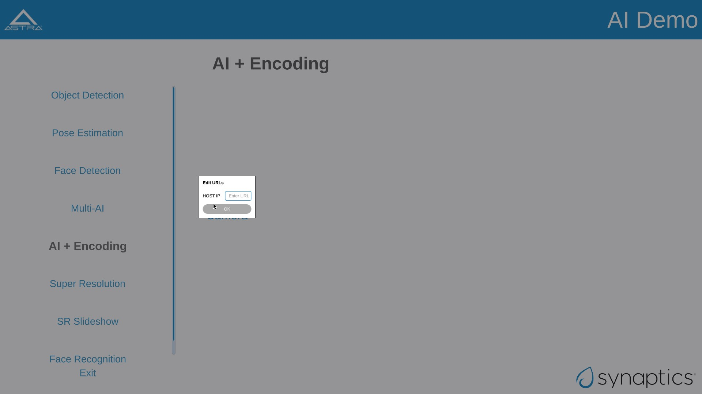

    Host IP window on SL1680

The host receiving the stream will need Gstreamer installed to receive it. They run ``gst-launch-1.0`` to view the stream.

For example, run this command on Window::

    gst-launch-1.0.exe udpsrc port=8003 ! "application/x-rtp, media=video, clock-rate=90000, \
        encodingname=H264, payload=96" ! queue ! rtph264depay ! h264parse ! avdec_h264 ! d3dvideosink

or, run this command on Linux::

    gst-launch-1.0 udpsrc port=8003 ! "application/x-rtp, media=video, clock-rate=90000,encodingname=H264, \
        payload=96" ! queue ! rtph264depay ! h264parse ! avdec_h264 ! autovideosink

Super Resolution
****************

Super Resolution (SR) is a technique used in image processing and computer vision to enhance the resolution of an image or video. This application showcases the chip capability in enhancing camera and file inputs to higher resolution using AI-powered super resolution.

    Super Resolution pane on SL1680

.. note::

	For SR, the application needs to run in 4K resolution. When launching the application, a popup will appear prompting you to switch to 4K. Upon clicking 'OK', the system will reboot and switch to 4K mode, after which the application can be run. Other applications run in 2K resolution by default. When you attempt to launch them, a popup will appear asking to switch back to 2K. Clicking 'OK' will reboot the system and revert to 2K mode.
	

For USB Camera case, it will list all the connected devices information, and user can select from the drop-down menu. Choose input and output resolution from the drop-down menu. And select model type (Fast or Qdeo) and save the configuration.

For File source case, select the file source option from the input configuration dialog box and click on "Save."

.. note::
	Please note that video files with only the input resolutions 640x360, 960x540 and 1280x720 are supported. 

Use the button on the right top corner to enable/disable Super Resolution. By-default Super Resolution is enabled.

SR Slideshow
************

The goal of SR is to generate a high-resolution (HR) image or video from one or more low-resolution (LR) images or videos. This application displays original and enhanced images side-by-side in a slideshow format.

.. note::

	For SR, the application needs to run in 4K resolution. When launching the application, a popup will appear prompting you to switch to 4K. Upon clicking 'OK', the system will reboot and switch to 4K mode, after which the application can be run. Other applications run in 2K resolution by default. When you attempt to launch them, a popup will appear asking to switch back to 2K. Clicking 'OK' will reboot the system and revert to 2K mode.

    Super Resolution slideshow pane on SL1680

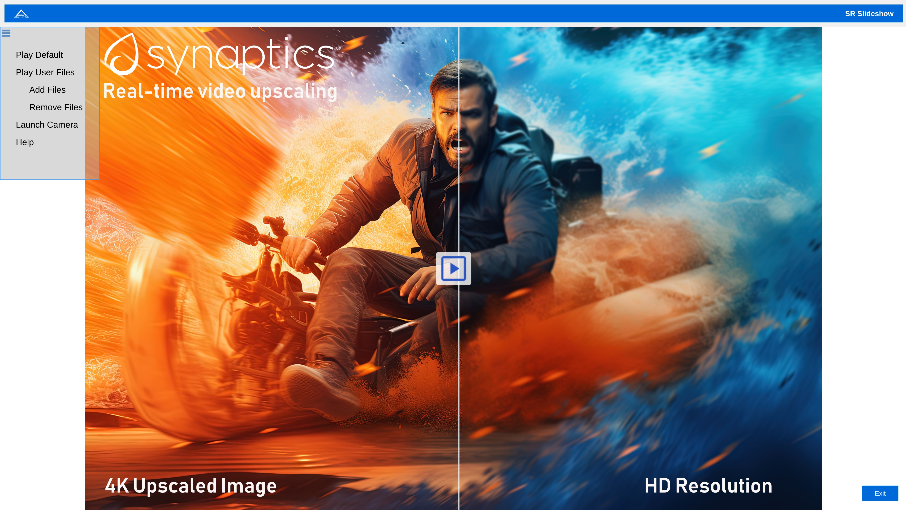

    Super Resolution slideshow main menu on SL1680

It displays both normal and super-res enhanced image.User can choose either a set of files or camera as a source.

    Super Resolution slideshow example

There's option to Play Default and Play User Files. Please note that only PNG files with a resolution of 1280x720 and bit depth of 24 bits are supported.

After selecting the desired files, click on "Play User Files" to begin playback of the added files. Also the added files can be removed by Remove Files option.

In the center, you will find the Play button, which will simply start the application with the default files.

USB camera capture support allows users to capture images using a USB camera that records at 720p and superscales the output to 4K.

To utilize this feature, users must connect the camera and click the Launch Camera Button, which opens the camera interface. Upon clicking the capture image button, a confirmation dialog appears, allowing users to view the captured 720p image on the left and the 4K image on the right, with an option to stop playback. Additionally, users can exit the camera preview by clicking the Exit Camera Button.

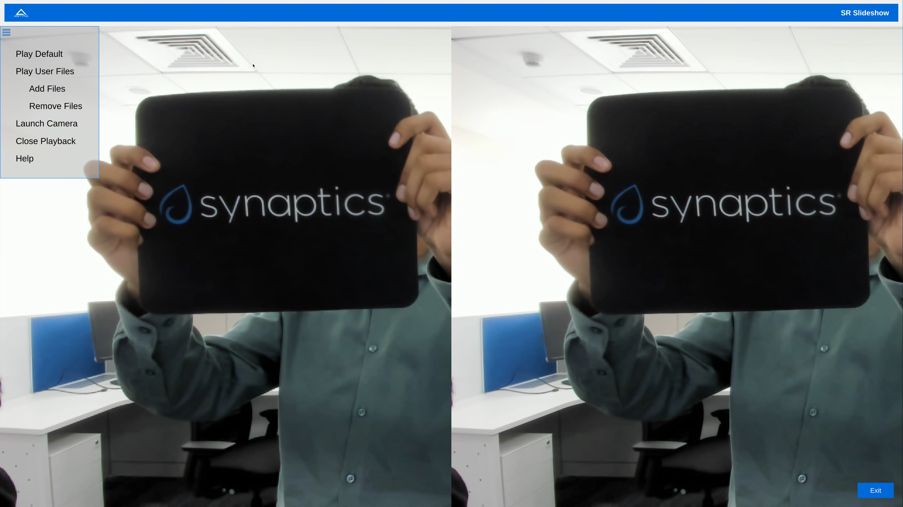

    Super Resolution slideshow camera example

Face Recognition
****************
This application is for real time face recognition and identification. 

    Face Recognition pane on SL1680

Upon initiation of the camera feed via the Play function, the system will detect new faces. By using the Preview button, toggle the visibility of the preview panel. This panel displays detected faces. 

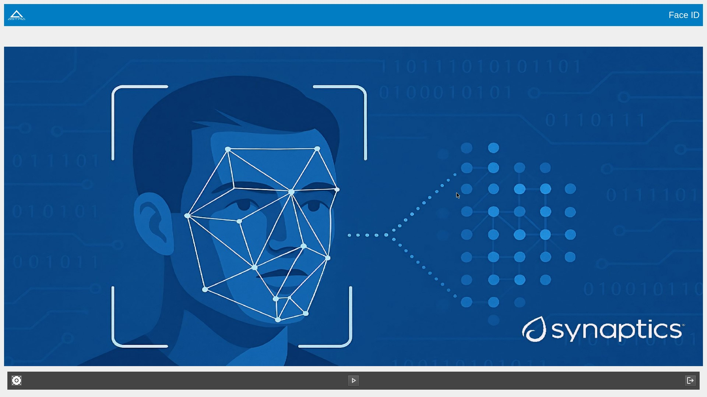

    Face Recognition Main Page on SL1680

Users can confirm desired faces by clicking the Yes button on Preview panel, and enter names in the provided text boxes, then finalize the process with the Ok button. To avoid displaying unwanted faces, click the Cancel button. 

.. figure:: media/syna-ai-player-face-recognition-example.jpg

    Face Recognition Example on SL1680

For faces already present in the database, the corresponding name will be automatically displayed above the bounding box. All face identification data is stored locally in the face_id_data.yml file, located at /home/root/demo/configs.

Audio Usecases
^^^^^^^^^^^^^^^
Audio Usecases button opens Audio Classification application. Audio classification is run with YAMNet tflite model. YAMNet is an audio event classifier that takes an audio waveform as input and makes independent predictions for each of the 521 audio events.

.. note::
	For this use case, the USB camera's microphone is required. It must be connected for testing.

    Audio Classification pane on SL1680

Capability Demo
^^^^^^^^^^^^^^^

The fifth button on the left is the "Capability Demo" button, which opens the "Capability Demos" pane. This pane contains a button to launch the
"Best Case" app, which demonstrates the capability of the platform.

.. figure:: media/syna-capability-demo-pane.jpg

    Capability Demo pane on SL1680

Best Case
"""""""""

The example demonstrates one of the best use case which the platform can support.

.. note::

    This example doesn't define the limit for individual IP block. Refer datasheet for checking complete capabilities of individual IP block.

This Best Case demo app demonstrates the capability of the platform running multiple things concurrently as mentioned below:

SL1680:
1. Multiple decoding: 4 Streams of 1920x1080@25 & 4 streams of 1280x720@25
2. USB camera streaming and preview of 640x480@30
3. Mixing of streams mentioned in #1 & #2 and rendering to display
4. HDMI-RX stream receiving from Laptop (up to 4K60) and rendering to display

SL1640:
1. Multiple decoding: 9 streams of 640x480@25
2. Mixing of streams mentioned in #1 and rendering to display

SL1620:
1. Multiple decoding: 2 streams of 640x480@30 using FFMpeg SW
2. Mixing of streams mentioned in #1 and rendering to display

A window will open where selection of different H.264 video files can be made. Number of selection depends on platform capability.

    Best case on SL1680

Click on left side buttons, to select a file. A file explorer will open which will allow to navigate and select a file.

    Best case H.264 file selection

Click on "SAVE SETTINGS" button to save selections. Click on "PLAY" button to start.

Real Time Streaming
^^^^^^^^^^^^^^^^^^^
The sixth button on the left is the "Real Time Streaming" button. This pane contains syna players. One is Syna Gst WebRTC, Seamless Real-Time Communication with GStreamer's WebRTC Sink and the other one is Syna Dash Player, Adaptive MPD Player with Smooth Resolution Switching.

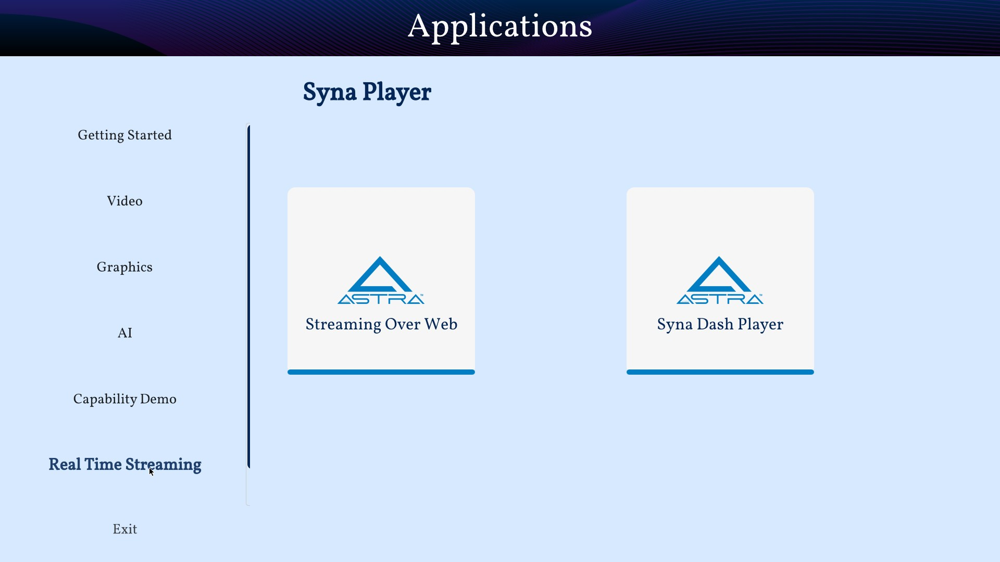

	Real Time Streaming Pane

Syna Gst WebRTC
"""""""""""""""
Astra transforms real-time communication by utilizing GStreamer's WebRTC sink for fast audio and video streaming. Built on the GStreamer framework, Astra provides developers with a seamless, scalable solution for modern communication needs

The WebRTC GStreamer plugin (webrtcsink) enables real-time peer-to-peer media streaming using WebRTC technology. This plugin allows GStreamer applications to transmit and receive audio and video streams over WebRTC, including essential features like built-in signaling, ICE (Interactive Connectivity Establishment), STUN/TURN, and data channels.

When users click on the “Streaming on Web” section, they will see the UI shown below, from the drop-down menu, user can choose Camera, FileSrc or AI Demos as Input.

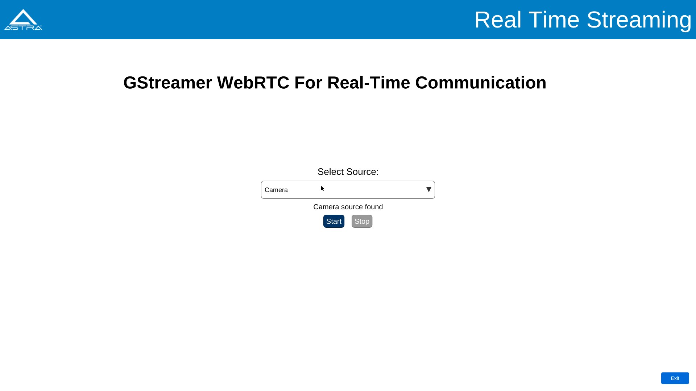

	UI for streaming on web

Steps for using Camera as an Input
**********************************
a.	Ensure a camera device is connected to the board before using this feature.
b.	Click the “Start” button after selecting the source. A message will appear, displaying the IP address and port number to watch the stream in any local browser. See the example image below:

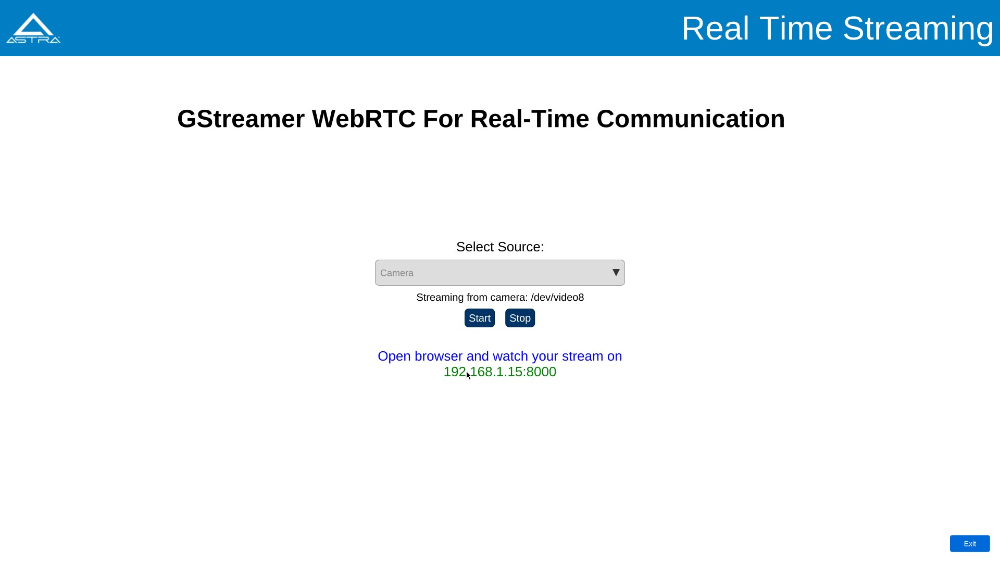

	Streaming on web with camera

c.	The stream will stop when the user clicks the “Stop” button or exits the app.
d.	After opening the IP address with the port number in a browser, a link will appear in the top left corner of the webpage. Click on that link to view the stream. Below is an example of how the user will see the stream in their local browser:

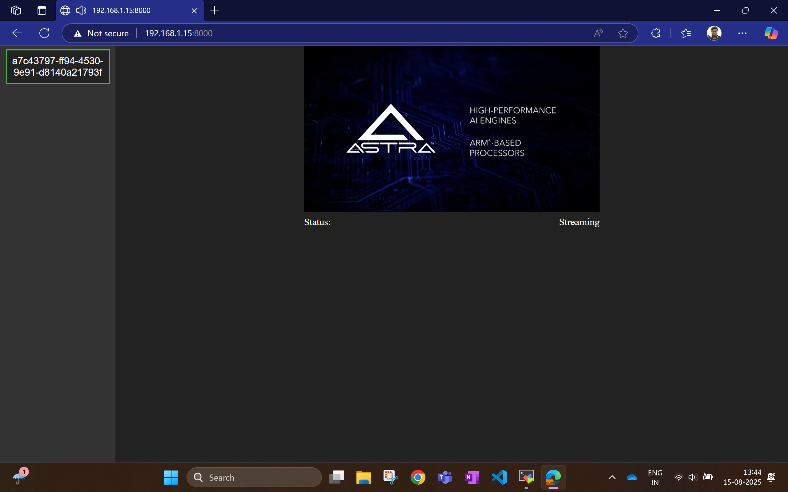

	User streaming on the local browser

Steps for using FileSrc as an Input
***********************************
a.	This option lets users stream local video files present on the system.
b.	Selecting this option opens a file explorer for users to choose a video file, as shown in the image below:

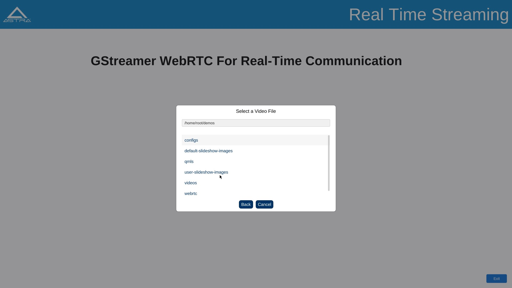

	Streaming on web with FileSrc

c.	After selecting a file, users must click the “Start” button to begin streaming.
d.	Streaming stops when users click the “Stop” button, end the stream, or exit the app.
 
Steps for using AI Demos as an Input
************************************
With this option, users can view AI-related demos that showcase Astra’s capabilities in processing complex tasks and multitasking. The demos include object detection, pose estimation, and face detection, as shown in the image below. For more details, please check the :ref:`VideoUsecases-label` from :ref:`SynaAI-label`.

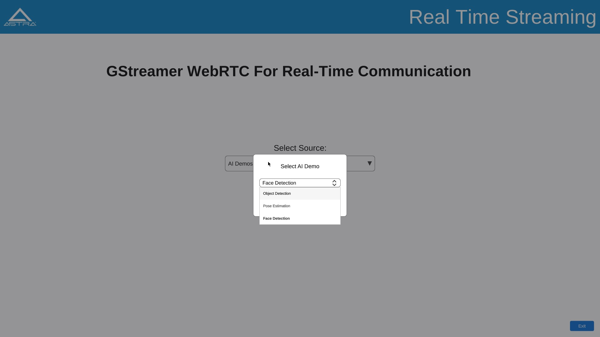

	AI Demos on GST WebRTC

Syna Dash Player
""""""""""""""""
This is a modern DASH player built to stream .mpd files with high efficiency. It supports real-time adaptive bitrate streaming using MPEG-DASH standards. The player automatically adjusts video resolution based on current network conditions. It ensures minimal buffering and seamless playback across all bandwidth levels. Ideal for testing, development, or deploying scalable streaming solutions.

When users click on the “Syna Dash Player” section, they will see the UI shown below. The user must first select the source using the input config button. Input can be FileSrc or URL. Once a source is selected, click the “Save” button. This action will open the explorer based on the input selection.

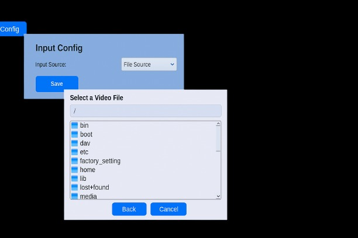

	Syna Dash Player input config menu on sl1680

Steps for Using Input as Filesrc
********************************

a.	This option allows users to stream local video files on the system.
b.	Selecting this option opens a file explorer for users to choose a video file to stream.
c.	After selecting the file, click the “Play” icon at the center bottom of the app to start streaming, as shown in the image below:

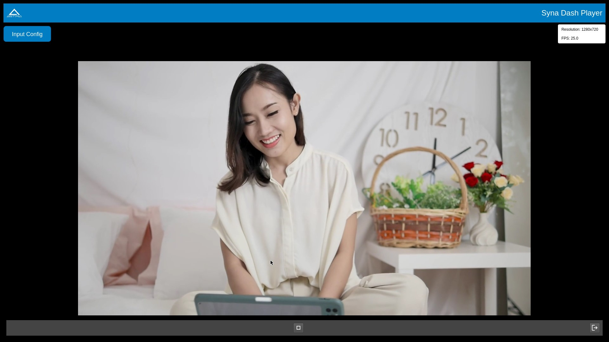

	Syna Dash Player Example with FileSrc

d.	The video will loop until the user clicks the “stop” icon, or exits the app.
e.	To change the stream, select the input configuration again. Click the “stop” button to halt the current stream, then click “play” to start the newly selected stream.

Steps for Using Input as URL
****************************

a.	Users can enter any URL containing mpd files to stream.
b.	Two sample URLs are provided to the user.
c.	Ensure an internet connection before using this feature.
d.	The video will pause when it reaches the end of stream (eos) or if the user clicks the “stop” icon, or exits the app. The image below shows how a .mpd file operates on the player.

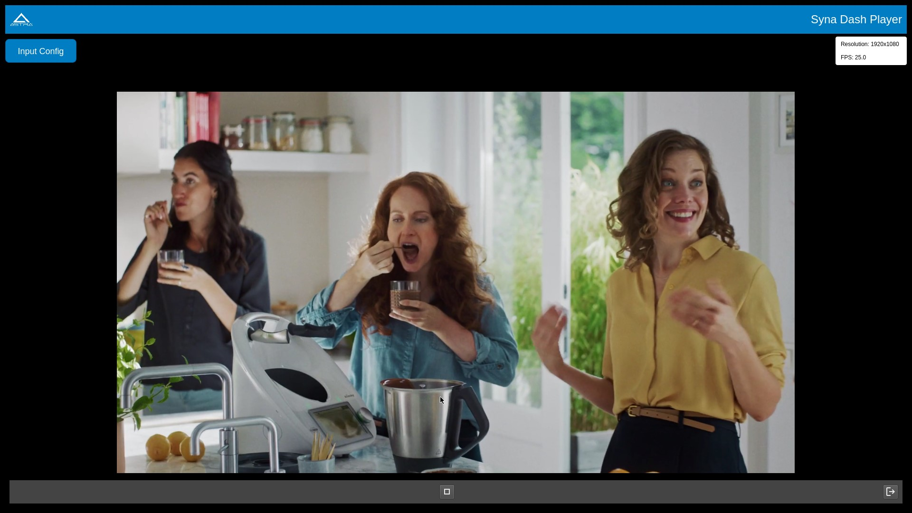

	Syna Dash Player Example with URL

e.	To change the stream, select the input configuration again. Click the “stop” button to halt the current stream, then click “play” to start the newly selected stream.

Current parameters (resolution and frames per second) will be displayed in the top right corner. These parameters will update in real-time according to the video being played. The display of these parameters plays a vital role that users might not notice changes in resolution because of the seamless transitions in the video that demonstrates our efficient hardware and software working in harmony. Consequently, displaying these parameters emphasizes the feature and its functionality.

.. note::
	The filesrc videos will play in a continuous loop, whereas the MPD files will stop the playback upon reaching the end of the stream (EOS).
.. note::
	The URL option in the input config won't work without an internet connection.
.. note::
	Max supported resolution is 720p.
 
ISP Camera
^^^^^^^^^^
The last pane on Applications is ISP Camera.

.. note::

    ISP camera is available only in sl1680.

    ISP camera pane on SL1680

Settings
--------

Settings can be launched by clicking the Settings icon in the quick access panel. Settings app helps to configure different modules like Display.

Display
^^^^^^^

Display config allows to select MIPI panel for given platform. You can select a panel from auto filled dropdown menu and click on "Save Panel" button. It will popup a messege to reboot a board. On reboot your new panel will be configured.

.. figure:: media/settings-display-config.jpg

	Display config pane on SL1680

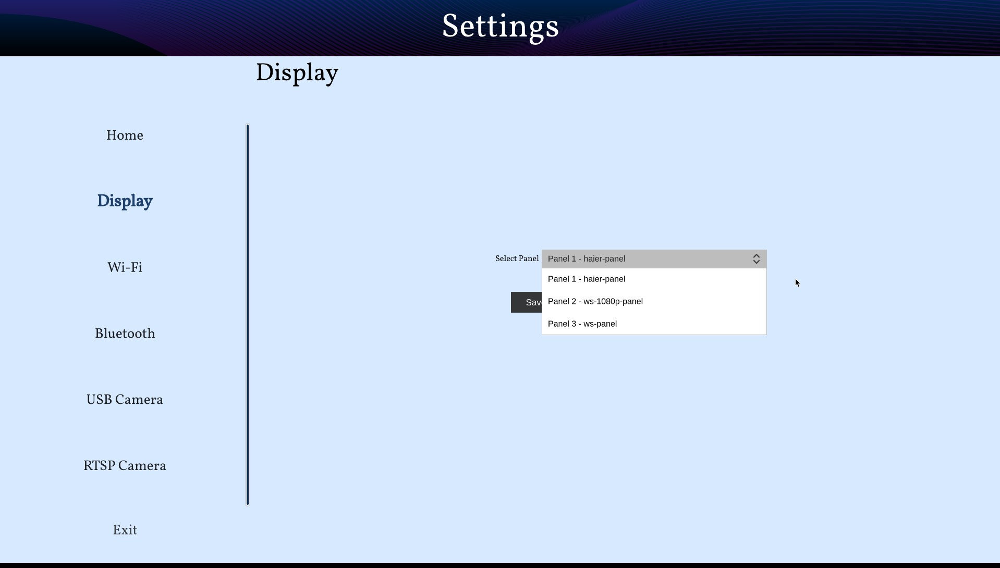

	Display config dropdown on SL1680

"Reset to Default" button configures the default display. "Print Panel Info" button gives currently configured panel information.

.. note::

    Before clicking on "Save Panel" or "Reset to Default" button, ensure that the required display panel is connected.

.. note::

    Before running display settings, it is required to save uboot environment once to have persistent configuration for display.
    Interrupt a boot process on start, to stop in uboot console (See :ref:`uboot_prompt`). Enter "saveenv" command to save uboot environment. Reboot a system.

USB Camera
^^^^^^^^^^
This section is for configuring the priority for the USB camera format selection. Click on the right side highlighted buttons to raise or lower the priority of specific format. Once done click on "Save Priorities" button.

.. figure:: media/settings-priorities-crop.jpg

    USB camera format priority settings on SL1680

RTSP Camera
^^^^^^^^^^^
This section is for configuring the RTSP URLs. After entering the RTSP URLs, click on "Save URLs" button. RTSP URLs can be verified by clicking on "Validate URLs" button to check if they are alive and reachable. Also it shows streaming media information.

    RTSP URLs settings on SL1680

.. figure:: media/settings-rtsp-urls-validate-crop.jpg

    RTSP URLs Validation on SL1680

WiFi
^^^^

Wifi settings allows you to connect to the available wifi network options.

	Wifi pane on SL1680

Bluetooth
^^^^^^^^^

Bluetooth settings allows you to connect to the available bluetooth network options.

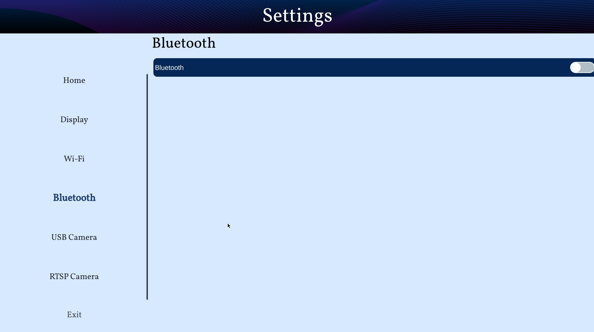

	Bluetooth pane on SL1680

About
-----

About can be launched by clicking the About icon in the quick access panel. About helps to identify software version, hw revisions, linux build
versions. It also provides some information on useful applications and internet links to resources.

