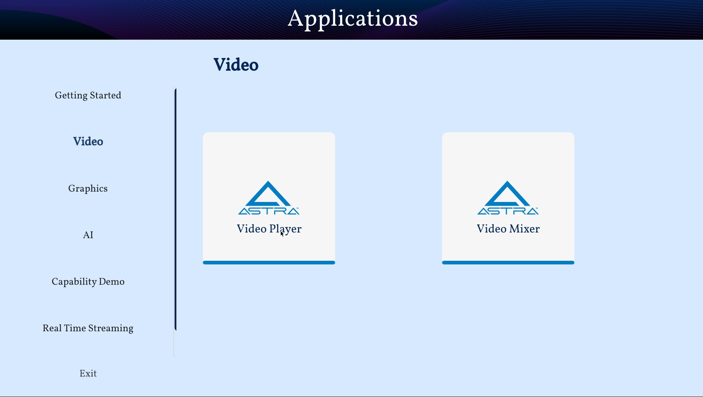

Using the Built-in Applications
===============================

Astra Machina comes preinstalled with several applications which showcase the capabilities of the platform.

As shown in the :doc:`hw_setup` guide, Astra Machina starts up with the welcome screen. The welcome screen is a
customized Weston desktop.

.. figure:: ./media/welcome_screen.jpg

   The Welcome Screen

At the bottom is a quick access panel with icons which will launch the three applications.

- Terminal
- Chromium Browser
- SynaExplorer

Terminal
--------

A standard Linux terminal can be launched by clicking the terminal icon on the quick access panel.

.. figure:: media/terminal.jpg

Chromium Browser
----------------

Chromium can be launched by clicking the Chromium icon in the quick access panel.

SynaExplorer
------------

The SynaExplorer app demonstrates the capabilities of the Astra platform. It showcases multimedia and AI inferencing using files,
USB cameras, and RTSP camera streams. AI inferencing is done using YOLO v5 and v8 models.

Open the SynaExplorer app by clicking the icon with the four squares in the quick access panel.

.. figure:: media/syna-explorer-icon.jpg

    SynaExplorer icon highlighted in quick access panel

The app opens to the landing page, with demo category buttons on the left and a "Getting Started" pane on the right.
The pane displays a thumbnail of the Astra intro video, which plays when clicked. The app uses Gstreamer to handle
video and audio playback of the video file.

    Getting Started pane on SL1640

The video will play continuously until the "Close" button in the lower right hand corner is clicked. This will return the user
to the main page.

.. figure:: media/getting-started-video-close-button-crop.jpg

    Highlighted Close button during video playback

Video
^^^^^

The second button on the left is the "Video" button, which opens the "Video" pane. This pane has a button for the "Video Player"
demo. On SL1640 and SL1680 there will also be a button for the "Video Mixer" demo.

    Screenshot of the "Video" pane on SL1640.

Syna Video Player
"""""""""""""""""

The "Video Player" demonstrates video playback from multiple sources.
- File source - Astra video files (1080p30)
- USB camera source
- RTSP camera source

.. figure:: media/syna-video-player-main.jpg

    Video Player on SL1640

Use the dropdown to the right of the "Video 1" label to select a source.

.. figure:: media/syna-video-player-source-dropdown.jpg

    Video Player on dropdown menu on SL1640

Use the "Update RTSP Urls" windows to set the RTSP URL when using a RTSP camera as the source. After entering the RTSP URL, press OK button.

.. figure:: media/syna-video-player-rtsp.jpg

    Update RTSP Urls window on SL1640

Multi View
**********

SL1680 supports playback of four streams at once. In the Syna Video Player app, the UI shows four video
stream options and a "Quad View" setting. To play all streams, select one stream from each dropdown menus
and choose the "Quad View" option.

    Video Player on SL1680 with Quad View support

.. note::

    Support for 4 USB cameras require that at least 2 of the camera use USB 3.0.

.. note::

    Synaptics has tested 4 USB cameras using 2 Logitech Brio 4K Ultra USB 3.0 cameras along with 2 Logitech
    C920 HD Pro USB 2.0 cameras.

On SL1680 the RTSP URL window will allow 4 RTSP camera URLs to be set.

.. figure:: media/syna-video-player-multiview-rtsp.jpg

    Update RTSP Urls window on SL1680 with Quad View support

.. note::

    Synaptics has verified using 4 1080p15 RTSP streams with Quad View.

Video Mixer
"""""""""""

SL1640 and Sl1680 support the "Video Mixer" demo. This demo uses an OpenGL based mixer to composite 9 streams and outputs
them to the display. SL1640 supports 9 640x480p streams while SL1680 supports 9 1280x720p streams.

    Video Mixer on SL1680

Graphics
^^^^^^^^

The third button on the left is the "Graphics" button, which opens the "Graphics" pane. This pane contains three demos which
showcase the graphics capability of Astra Machina. These demos are stock QT examples which are included as part of the QT 5
environment. These demos are `Textures <https://doc.qt.io/qt-5/qtopengl-textures-example.html>`__, 
`Animated Tiles <https://doc.qt.io/qt-5/qtwidgets-animation-animatedtiles-example.html>`__, and
`FingerPaint <https://doc.qt.io/qt-5/qtwidgets-touch-fingerpaint-example.html>`__.

.. figure:: media/syna-explorer-graphics.jpg

    Graphics pane on SL1640

.. note::

    The FingerPaint application is intended to be used with displays with a touch panel.

Syna AI
^^^^^^^

The fourth button on the left is the "AI" button, which opens the "AI" pane. This pane contains a button to launch the
"AI Player" app, which includes object detection, pose estimation, and face detection examples. There is also an example
which does object detection using a USB camera and encodes then streams the output over UDP. SL1680 supports Multi-AI
which supports doing AI inferencing on four streams and outputting the result to the display. SL1680 supports AI inferencing
on muxed stream of 3x3 tiles composed from 4 USB camera streams and outputting the result to the display. 

    AI pane on SL1640

Object Detection
""""""""""""""""

The object detection example uses a YOLOv8 model to detect object from a 1080p25 file source or a USB camera at 640x480 resolution.

.. figure:: media/syna-ai-player-object-detection.jpg 
    
    The Object Detection Window on SL1640

.. figure:: media/syna-ai-player-object-detection-output.jpg
    
    Object Detection output from the default 1080p25 file

Pose Estimation
"""""""""""""""

The pose estimation example uses a YOLOv8 model to do pose estimation on a 1080p25 file source or a USB camera at 640x480 resolution.

.. figure:: media/syna-ai-player-pose-estimation.jpg 
    
    The Pose Estimation Window on SL1640

.. figure:: media/syna-ai-player-pose-estimation-output.jpg
    
    Pose Estimation output from the default 1080p25 file

Face Detection
""""""""""""""

The face detection example uses a YOLOv5 model to detect faces using a USB camera at 640x480 resolution.

.. figure:: media/syna-ai-player-face-detection.jpg 
    
    The Face Detection Window on SL1640

Multi-AI
""""""""

SL1680 Multi-AI supports 3 different demos:

1) USB Camera: 4 different AI inferencing of four camera streams and displaying the output. The streams
can be from four USB cameras at 640x480 resolution.

2) AI on Muxed 9x480p: Single AI inferencing of muxed stream of multiple cameras and displaying the output.
The streams can be from four USB cameras at 640x480 resolution. In this example, total 9 streams of 640x480p 
(some are duplicated) from 4 diferent USB cameras are tiles into single frame using GPU and object detection
is performed on the muxed frame and then displayed with bounding box and label.

3) RTSP Camera: AI inferencing of four RTSP camera streams and displaying the output. The streams are from four
RTSP camera at 1080p15. RTSP streams can be configured using the "Update RTSP Urls" window. In this example, person
detection is performed on all four streams.

.. figure:: media/syna-ai-player-multi-ai.jpg

    Multi-AI pane on SL1680

.. note::

    Support for 4 USB cameras require that at least 2 of the camera use USB 3.0.

.. note::

    Synaptics has tested 4 USB cameras using 2 Logitech Brio 4K Ultra USB 3.0 cameras along with 2 Logitech
    C920 HD Pro USB 2.0 cameras.

.. note::

    Synaptics has verified using 4 1080p15 RTSP streams with Quad View.

AI + Encoding
"""""""""""""

The AI + Encoding example showcases Astra Machina's ability to create a pipeline which performs Decoding + AI + Encoding + Streaming.
The input source is a USB camera at 640x480 resolution and the output is streamed over the network using UDP. A host can then connect
the the stream using Gstreamer to view the output. Output is also output to the display.

    AI + Encoding pane on SL1640

A window will open when the camera button is clicked. The window will ask for the IP address of the host which will be receiving the
stream. Enter the IP address and click "OK".

.. figure:: media/syna-ai-player-ai-encoding-host.jpg

    Host IP window on SL1680

The host receiving the stream will need Gstreamer installed to receive it. They run ``gst-launch-1.0`` to view the stream.

For example, run this command on Window::

    gst-launch-1.0.exe udpsrc port=8003 ! "application/x-rtp, media=video, clock-rate=90000, \
        encodingname=H264, payload=96" ! queue ! rtph264depay ! h264parse ! avdec_h264 ! d3dvideosink

or, run this command on Linux::

    gst-launch-1.0 udpsrc port=8003 ! "application/x-rtp, media=video, clock-rate=90000,encodingname=H264, \
        payload=96" ! queue ! rtph264depay ! h264parse ! avdec_h264 ! autovideosink

Capability Demo
^^^^^^^^^^^^^^^

The fifth button on the left is the "Capability Demo" button, which opens the "Capability Demos" pane. This pane contains a button to launch the
"Best Case" app, which demonstrates the capability of the platform.

    Capability Demo pane on SL1640

Best Case
"""""""""

The example demonstrates one of the best usecase which platfrom can support.

.. note::

    This example doesn't define the limit for individual IP block. Refer datasheet for checking complete capabilities of individual IP block.

This Best Case demo app demonstrates the capability of platform running multiple things concurently as mentioned below:

SL1680:
1. Multiple decoding: 4 Streams of 1920x1080@25 & 4 streams of 1280x720@25
2. USB camera streaming and preview of 640x480@30
3. Mixing of streams mentioned in #1 & #2 and rendering to display
4. HDMI-RX stream receiving from Laptop (upto 4K60) and rendering to display

SL1640:
1. Multiple decoding: 9 streams of 640x480@25
2. Mixing of streams mentioned in #1 and rendering to display

SL1620:
1. Multiple decoding: 2 streams of 640x480@30 using FFMpeg SW
2. Mixing of streams mentioned in #1 and rendering to display

A window will open where selection of different H.264 video files can be made. Number of selection depends on platform capability.

.. figure:: media/syna-best-case-sl1680.jpg

    Best case on SL1680

Click on left side buttons, to select a file. A file explorer will open which will allow to navigate and select a file.

.. figure:: media/syna-best-case-file-select.jpg

    Best case H.264 file selection

Click on "SAVE SETTINGS" button to save selections. Click on "PLAY" button to start.

Settings
^^^^^^^^

The sixth button on the left is the "Settings" button, which opens the "Settings" pane. This pane contains options to configure global
settings for different SynaExplorer demo applications.

.. note::

    Defaults will be used if settings is not used to configure.

    Settings pane on SL1680

First section is for configuring the priority for the USB camera format selection. Click on the right side highlighted buttons to raise or
lower the priority of specific format. Once done click on "Save Priorities" button.

    USB camera format priority settings on SL1680

Second section is for configuring the RTSP URLs. After entering the RTSP URLs, click on "Save URLs" button. RTSP URLs can be verified by
clicking on "Validate URLs" button to check if they are alive and reachable. Also it shows streaming media information.

.. figure:: media/settings-rtsp-urls-crop.jpg

    RTSP URLs settings on SL1680

    RTSP URLs Validation on SL1680
