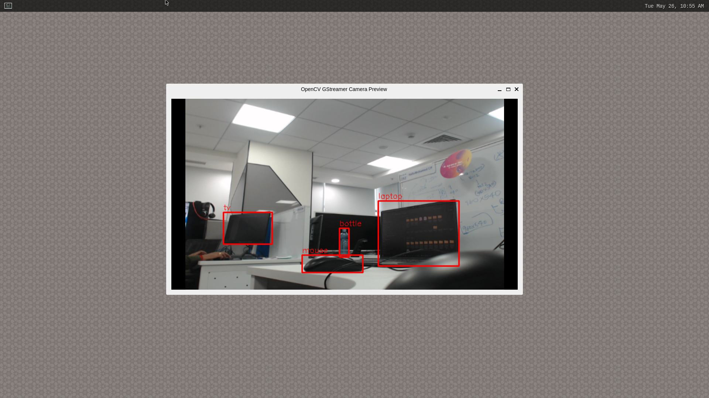
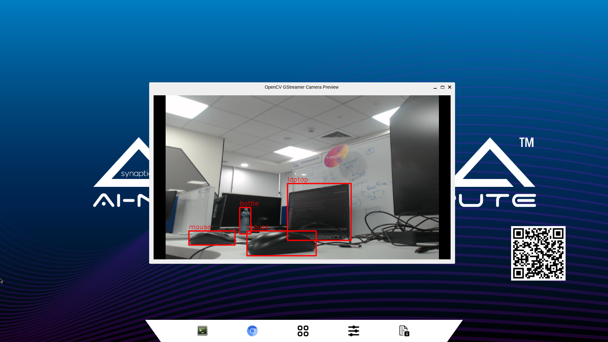
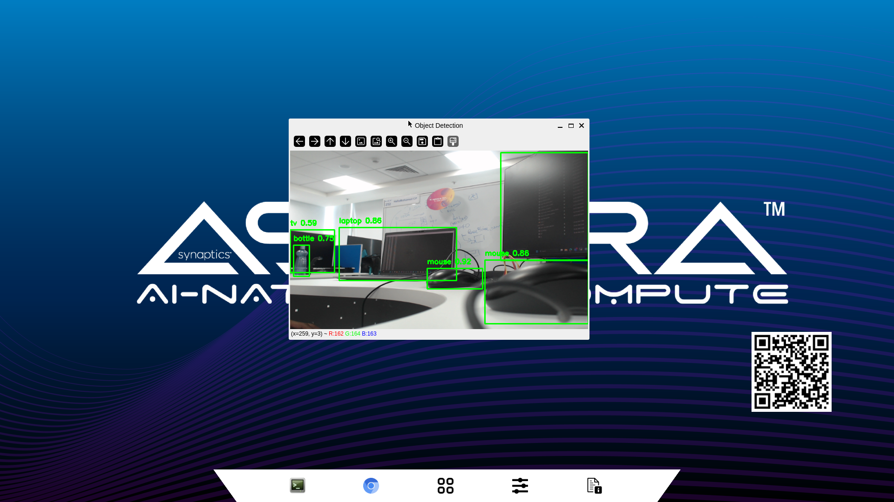

Object Detection using OpenCV
=============================

.. highlight:: console

The application demonstrates real-time object detection using a USB camera and is implemented in both C++ and Python.

Prerequisites
-------------

- Synaptics Astra SL1680 evaluation kit with either OOBE or Non-OOBE image installed
- USB camera connected to the board
- HDMI display (for viewing results)
- For Python implementation (Internet connectivity for initial setup)

Non-OOBE Implementation
-----------------------

The Non-OOBE image includes only the C++ implementation of the object detection application.

Using C++ Implementation
^^^^^^^^^^^^^^^^^^^^^^^^

1. Install a pre-built image and connect to the board as described :doc:`here <flash_image>`

2. Connect the USB camera to the board

3. Set the Wayland display environment variable::

      $ export WAYLAND_DISPLAY=wayland-1

4. Run the OpenCV object detection application::

      $ opencv-gst-od

   OpenCV Object Detection Application Running (C++) in Non-OOBE Image

The application will display the live camera feed with detected objects highlighted on the connected display.

OOBE Implementation
-------------------

The OOBE image includes both C++ and Python implementations of the object detection application.

Using C++ Implementation
^^^^^^^^^^^^^^^^^^^^^^^^

1. Install a pre-built image and connect to the board as described :doc:`here <flash_image>`

2. Connect the USB camera to the board

3. Set the Wayland display environment variable::

      $ export WAYLAND_DISPLAY=wayland-1

4. Run the OpenCV object detection application::

      $ opencv-gst-od

   OpenCV Object Detection Application Running (C++) in OOBE Image

Using Python Implementation
^^^^^^^^^^^^^^^^^^^^^^^^^^^^

The Python implementation provides an alternative way to run object detection. This implementation requires internet connectivity 
for initial setup.

1. Install a pre-built image and connect to the board as described :doc:`here <flash_image>`

2. Connect the USB camera to the board

3. Ensure the board has internet connectivity

4. Navigate to the demos directory::

      $ cd /home/root/demos/scripts/

5. Create and activate a Python virtual environment with system packages::

      $ python3 -m venv .venv --system-site-packages
      $ source .venv/bin/activate

6. Install the Synaptics Python package::

      $ pip3 install synap-python

7. Run the Python object detection application::

      $ python3 sl1680_od_cam.py

   OpenCV Object Detection Application Running (Python) in OOBE Image

.. note::

   The Python implementation requires internet connectivity during the initial setup to download the ``synap-python`` package 
   and any required dependencies. After setup, the application can run offline.

.. note::

   Make sure to activate the virtual environment (step 5) before running the Python application each time you want to use it.

Troubleshooting
---------------

Camera Not Detected
^^^^^^^^^^^^^^^^^^^

If the USB camera is not detected, ensure it is properly connected and recognized by the system::

Get list of video devices to verify the camera is detected:::

   $ v4l2-ctl --list-devices

No Display Output
^^^^^^^^^^^^^^^^^

If the video is not displaying, verify the Wayland display variable is set correctly::

   $ echo $WAYLAND_DISPLAY

It should output ``wayland-1``. If it's empty, set it again using::

   $ export WAYLAND_DISPLAY=wayland-1

Python Module Not Found
^^^^^^^^^^^^^^^^^^^^^^^

If you encounter module import errors when running the Python implementation, ensure the virtual environment is activated::

   $ source /home/root/demos/scripts/.venv/bin/activate

Then verify that ``synap-python`` is installed::

   $ pip3 list | grep synap-python
