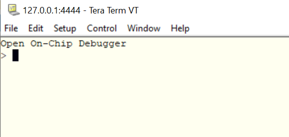
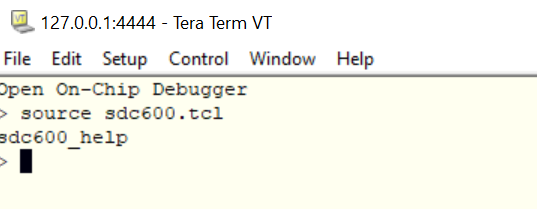
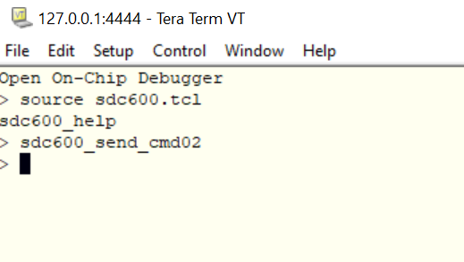
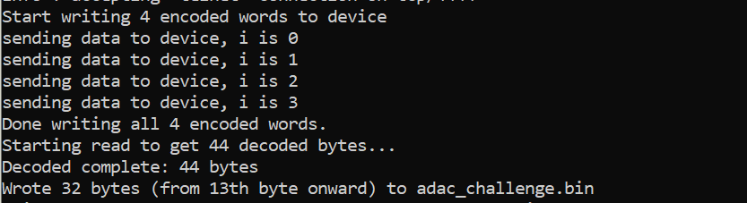
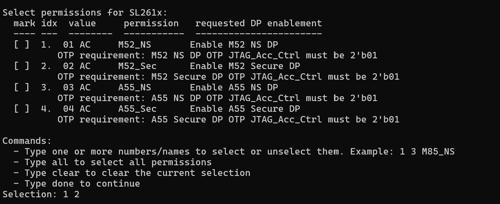
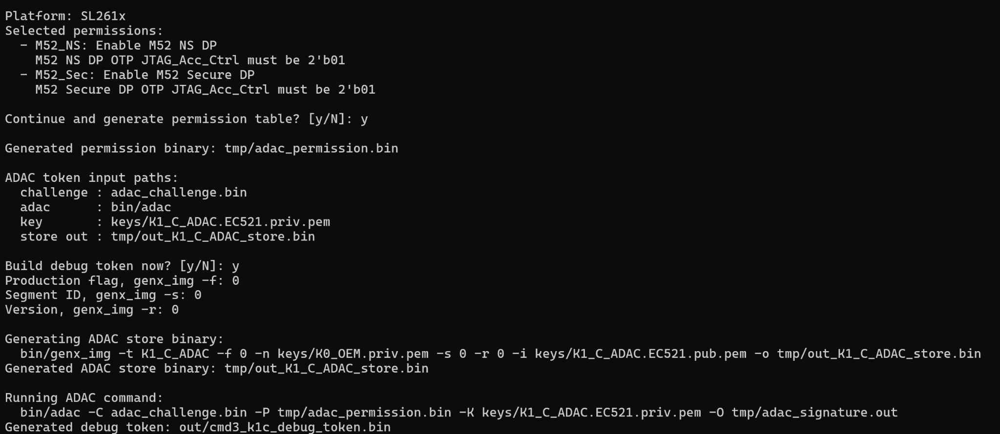
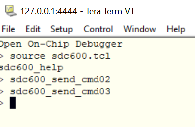
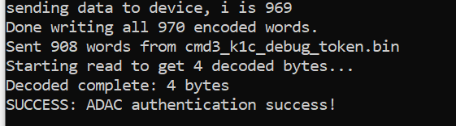
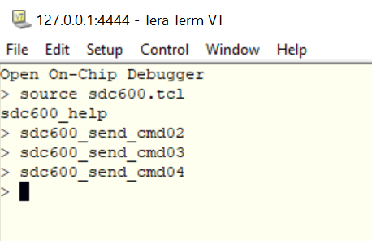
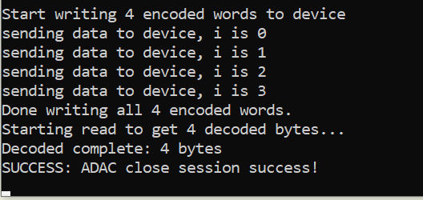

====================================================
SL261x Authenticated Debug Access Control User Guide
====================================================

This guide describes how to acquire an SL261x ADAC challenge through SDC-600,
generate the 16-byte permission table and signed debug token with
``adac_token_tool.py``, authenticate the selected debug ports, and close the
session.

1 Scope and Requirements
========================

The procedure in this document applies to SL261x. Download OpenOCD and prepare
the SL261x SDC-600 files as described in the requirements below.

.. important::

   A requested debug port can be enabled only when its OTP ``JTAG_Acc_Ctrl``
   value is programmed to ``2'b01``.

.. list-table:: Requirements
   :widths: 22 78
   :header-rows: 1

   * - Item
     - Requirement
   * - Debug probe
     - J-Link. Install the driver required by the selected probe.
   * - OpenOCD
     - Download and extract the OpenOCD package for your platform from the
       `xPack OpenOCD releases page <https://github.com/xpack-dev-tools/openocd-xpack/releases>`__.

       Copy the following files from the
       `Factory repository <https://github.com/synaptics-astra/factory/>`__
       at ``factory/scripts/klamath/sdc600/adac/OpenOCD`` into the root directory
       of the extracted OpenOCD package:

       * ``Klamath_Jlink.bat``
       * ``Klamath_Jlink.cfg``
       * ``sdc600.tcl``
       * ``telnet_localhost_4444.bat``
   * - Terminal
     - Tera Term, for connecting to ``localhost:4444``. Download it from the
       `Tera Term releases page <https://github.com/TeraTermProject/teraterm/releases>`__.
   * - Token tool
     - ``adac_token_tool.py`` and the ``bin`` and ``keys`` directories listed below. 
       Tools can be found in the: `Factory repository <https://github.com/synaptics-astra/factory/tree/#release#>`__  at ``factory/scripts/klamath/sdc600/adac/adac_token_tool``.
   * - OpenSSL
     - Required when the customer generates a new K1_C_ADAC EC P-521 key pair.
   * - Python
     - Run the tool with ``python3`` from the token tool root directory.

2 Prepare ADAC Keys and the Token Tool
======================================

2.1 Generate the Customer K1 C ADAC Key Pair
---------------------------------------------

The customer may generate their own K1_C_ADAC private and public key pair. Run
the following commands from the ``keys`` directory:

.. code-block:: console

   openssl ecparam -genkey -name secp521r1 -out K1_C_ADAC.EC521.priv.pem
   openssl ec -in K1_C_ADAC.EC521.priv.pem -pubout > K1_C_ADAC.EC521.pub.pem

These commands create a matching ``secp521r1`` private/public key pair. Keep
``K1_C_ADAC.EC521.priv.pem`` confidential and do not combine it with a public
key generated from a different private key.

2.2 MP Flow Key and Identity Requirements
-----------------------------------------

.. important::

   ``K0_OEM.priv.pem`` must be the same K0 OEM private key used by the
   customer's MP flow. Do not generate a replacement K0 key for this token
   build.

.. list-table:: MP flow inputs
   :widths: 38 62
   :header-rows: 1

   * - Input
     - Required Source or Value
   * - ``K1_C_ADAC.EC521.priv.pem``
     - Customer-generated K1_C_ADAC private key. Used to sign the ADAC
       challenge and permission table.
   * - ``K1_C_ADAC.EC521.pub.pem``
     - Public key generated from the matching K1_C_ADAC private key. Used as
       the ``genx_img`` key payload.
   * - ``K0_OEM.priv.pem``
     - The existing K0 OEM private key used in the MP flow. This key signs the
       K1_C_ADAC store image.
   * - Segment ID
     - Must exactly match the ``oem_segid`` value used in the MP flow.
   * - Version
     - Must exactly match the ``oem_version`` value used in the MP flow.
   * - Production flag
     - Set according to the target project's MP and security configuration.

The interactive example later in this guide shows ``0`` for the production
flag, Segment ID, and Version. Those values are examples only. The actual
Segment ID and Version must match the MP flow ``oem_segid`` and ``oem_version``
values.

2.3 Token Tool Directory
------------------------

Place the following files relative to ``adac_token_tool.py``:

.. list-table:: Token tool files
   :widths: 42 58
   :header-rows: 1

   * - Path
     - Purpose
   * - ``adac_challenge.bin``
     - Challenge generated by ``sdc600_send_cmd02``command and will be generated in OpenOCD directory. Copy the latest challenge here before building a token.
   * - ``bin/adac``
     - ADAC signature generation executable.
   * - ``bin/genx_img``
     - Generates the K1_C_ADAC store image.
   * - ``keys/K1_C_ADAC.EC521.priv.pem``
     - Customer K1_C_ADAC private key used by the ADAC signing command.
   * - ``keys/K1_C_ADAC.EC521.pub.pem``
     - Matching customer K1_C_ADAC public key used as the ``genx_img`` payload.
   * - ``keys/K0_OEM.priv.pem``
     - The K0 OEM private key from the MP flow, used by ``genx_img`` to sign
       the store image.

On Linux, make the bundled executables executable if necessary:

.. code-block:: console

   chmod +x bin/adac bin/genx_img

The tool creates ``tmp`` for intermediate files and ``out`` for the final
token. The directories are created automatically when required.

3 Start OpenOCD and Acquire a Challenge
=======================================

#. Connect a J-Link probe to the board.
#. Open the designated SDC-600 OpenOCD directory and start OpenOCD with the
   package-provided ``Klamath_Jlink.bat`` that matches the connected
   probe.
#. Verify that OpenOCD is listening for telnet connections on port 4444.
#. Connect the terminal client to ``localhost:4444`` by  ``telnet_localhost_4444.bat``. 
   Adjust the executable path in ``telnet_localhost_4444.bat`` if Tera Term is installed in a non-default location.

   OpenOCD telnet prompt

#. Load the SDC-600 command script:

   .. code-block:: console

      source sdc600.tcl

   Load the SDC-600 Tcl commands

#. Start authentication and request a fresh challenge:

   .. code-block:: console

      sdc600_send_cmd02

   Send the authentication start command

A successful command writes the challenge file and reports
``Wrote 32 bytes (from 13th byte onward) to adac_challenge.bin``.

   Successful challenge generation

Copy the newly generated ``adac_challenge.bin`` to the directory that contains
``adac_token_tool.py``. Do not reuse an old challenge from a previous
authentication session.

4 Generate the Permission Table and Debug Token
================================================

4.1 Interactive Operation
-------------------------

Run the tool from its root directory. Command-line parameters are not required:

.. code-block:: console

   python3 adac_token_tool.py

#. Select ``SL261x`` from the platform menu.
#. Select one or more permissions by entering their numbers or names. Entering
   an already selected item toggles it off. Use ``all`` to select every item,
   ``clear`` to clear the selection, and ``done`` to continue.

   SL261x interactive permission selection

#. Review the selected ports and enter ``y`` to generate the permission table.
#. The tool automatically writes the 16-byte table to
   ``tmp/adac_permission.bin``. No manual command or pre-generated permission
   file is required.
#. Enter ``y`` when prompted to build the debug token.
#. Enter the production flag requested by ``genx_img`` according to the target
   project's MP and security configuration.
#. Enter Segment ID using the same value as ``oem_segid`` in the MP flow.
#. Enter Version using the same value as ``oem_version`` in the MP flow.

   Permission generation, MP values, and debug token output

The ``genx_img`` command shown by the tool uses ``keys/K0_OEM.priv.pem`` to
sign a store containing ``keys/K1_C_ADAC.EC521.pub.pem``. The ADAC command then
uses ``keys/K1_C_ADAC.EC521.priv.pem`` to create the token signature.

4.2 SL261x Permission Values
----------------------------

.. list-table:: SL261x permission values
   :widths: 12 18 22 48
   :header-rows: 1

   * - Byte Index
     - Value
     - Permission
     - Requested Debug Port
   * - 1:0
     - ``0xAC01``
     - ``M52_NS``
     - Enable M52 NS DP
   * - 3:2
     - ``0xAC02``
     - ``M52_Sec``
     - Enable M52 Secure DP
   * - 5:4
     - ``0xAC03``
     - ``A55_NS``
     - Enable A55 NS DP
   * - 7:6
     - ``0xAC04``
     - ``A55_Sec``
     - Enable A55 Secure DP
   * - 15:8
     - RFU
     - NA
     - Not applicable

Each selected DP must have its corresponding OTP ``JTAG_Acc_Ctrl`` value
programmed to ``2'b01``. Unselected entries and RFU bytes remain zero in the
16-byte permission table. The 16-bit values are stored in little-endian order,
as shown in the interactive menu.

4.3 Generated Files
-------------------

.. list-table:: Generated files
   :widths: 42 58
   :header-rows: 1

   * - Output
     - Description
   * - ``tmp/adac_permission.bin``
     - Generated 16-byte permission table.
   * - ``tmp/out_K1_C_ADAC_store.bin``
     - K1_C_ADAC store. This file is regenerated every time a token is built.
   * - ``tmp/adac_signature.out``
     - ADAC signature output.
   * - ``out/cmd3_k1c_debug_token.bin``
     - Final token sent by ``sdc600_send_cmd03``.

Every token build regenerates ``tmp/out_K1_C_ADAC_store.bin``. Confirm the MP
flow K0 key, ``oem_segid``, and ``oem_version`` before using the generated
token.

4.4 Optional Command-Line Operation
-----------------------------------

Generate only the permission table while keeping the interactive menus:

.. code-block:: console

   python3 adac_token_tool.py --permission-only

Example of a non-interactive SL261x token build:

.. code-block:: console

   python3 adac_token_tool.py \
     --platform SL261x \
     --permissions M52_NS M52_Sec \
     --build-token \
     --store-production-flag <production_flag> \
     --store-seg-id <oem_segid> \
     --store-version <oem_version> \
     --yes

Display all supported options with:

.. code-block:: console

   python3 adac_token_tool.py --help

5 Authenticate the Debug Session
================================

#. Copy ``out/cmd3_k1c_debug_token.bin`` to the working directory used by the
   designated SDC-600 OpenOCD script.
#. In the same telnet session, send the authentication process command:

   .. code-block:: console

      sdc600_send_cmd03

   Send the authentication process command

A successful token verification reports
``SUCCESS: ADAC authentication success!``.

   Successful ADAC authentication

6 Close the Debug Session
=========================

#. When debug access is no longer needed, close the authenticated session:

   .. code-block:: console

      sdc600_send_cmd04

   Send the close-session command

A successful close reports ``SUCCESS: ADAC close session success!``.

   Successful ADAC session close

7 Command Sequence
==================

Always perform the commands and token generation in this order:

.. code-block:: console

   source sdc600.tcl
   sdc600_send_cmd02
   python3 adac_token_tool.py
   sdc600_send_cmd03
   sdc600_send_cmd04

The token must be generated from the challenge produced by the current
``cmd02`` session. Changing the order or reusing an old challenge can cause
authentication to fail.

8 Troubleshooting
=================

.. list-table:: Troubleshooting
   :widths: 32 68
   :header-rows: 1

   * - Symptom
     - Check
   * - OpenOCD cannot connect
     - Confirm the probe connection and select the J-Link launcher
       supplied with the designated SL261x OpenOCD package.
   * - ``cmd02`` reports an invalid command
     - Run ``source sdc600.tcl`` first and verify that the designated OpenOCD
       package is being used.
   * - ``adac_challenge.bin`` is missing
     - Run ``cmd02`` successfully, then copy the generated file into the token
       tool root directory.
   * - The token tool reports a missing file
     - Check the ``bin`` and ``keys`` paths in Section 2 and run ``chmod +x`` on
       the Linux executables.
   * - ``genx_img`` or store validation fails
     - Use the K0 OEM private key from the MP flow and confirm Segment ID and
       Version match ``oem_segid`` and ``oem_version``.
   * - ``cmd03`` verification fails
     - Use the fresh challenge, verify the matched K1_C_ADAC key pair, and
       confirm each requested DP has OTP ``JTAG_Acc_Ctrl`` programmed to
       ``2'b01``.
