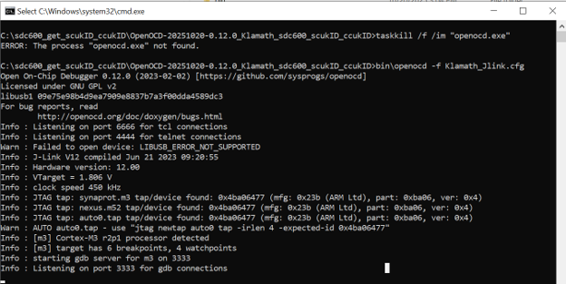
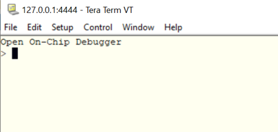
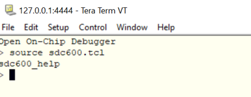
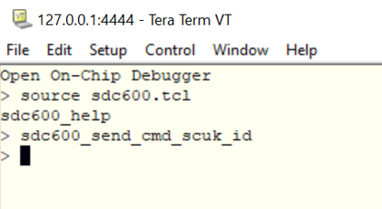
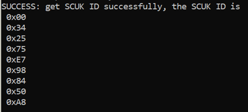
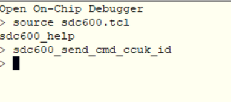
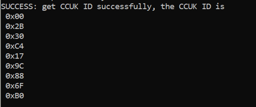

============================================
SDC600 Get SCUK-ID and CCUK-ID User Guide for SL261x
============================================

Description
===========
This user guide is used to get SCUK-ID and CCUK-ID.

Prerequisite
============
* SPK is running.

Release Package
===============
.. list-table:: Requirements
   :widths: 22 78
   :header-rows: 1

   * - Item
     - Requirement
   * - Debug probe
     - J-Link. Install the driver required by the selected probe.
   * - OpenOCD
     - Download and extract the OpenOCD package for your platform from the
       `xPack OpenOCD releases page <https://github.com/xpack-dev-tools/openocd-xpack/releases>`__.

       Copy the following files from the
       `Factory repository <https://github.com/synaptics-astra/factory/>`__
       at ``factory/scripts/klamath/sdc600/ccuk_scuk_id/OpenOCD`` into the root directory
       of the extracted OpenOCD package:

       * ``Klamath_Jlink.bat``
       * ``Klamath_Jlink.cfg``
       * ``sdc600.tcl``
       * ``telnet_localhost_4444.bat``
   * - Terminal
     - Tera Term, for connecting to ``localhost:4444``. Download it from the
       `Tera Term releases page <https://github.com/TeraTermProject/teraterm/releases>`__.

Preparation
===========
1. Install ``JLink driver`` in Windows.
2. Install ``Tera Term`` in Windows.
3. Create a folder in Windows, such as, ``C:\sdc600_get_scukID_ccukID``.
4. Download and extract the OpenOCD package into the folder created above.
5. Copy the four files listed in the OpenOCD requirement into the root directory of the extracted OpenOCD package.

.. note::
   For Windows, please use Windows 10 or higher.

Step-by-Step Instructions
=========================

1. Connected Jlink debugger to the board.
2. Boot up the system (TEE needs to be initialized for SDC600 interrupt to function).
3. Open the OpenOCD JTAG:
   
   * Open the root directory of the extracted OpenOCD package, where you copied ``Klamath_Jlink.bat``.
   * Click ``Klamath_Jlink.bat``
   

4. Click ``telnet_localhost_4444.bat``. Adjust the executable path in ``telnet_localhost_4444.bat`` if Tera Term is installed in a non-default location.

5. Input command ``source sdc600.tcl``.

6. Send ``sdc600_send_cmd_scuk_id`` to get scuk id.
   
   * The successful log is ``SUCCESS: get SCUK ID successfully, the SCUK ID is <ID_VALUE>``
   * If the log is ``ERROR: invalid command to get SCUK ID!``, it means the command is incorrect.
   

   

7. Send ``sdc600_send_cmd_ccuk_id`` to get ccuk id.
   
   * If successful, get log ``SUCCESS: get CCUK ID successfully, the CCUK ID is <ID_VALUE>``.
   * If the log is ``ERROR: invalid command to get CCUK ID!``, it means the command is incorrect.
   

   

