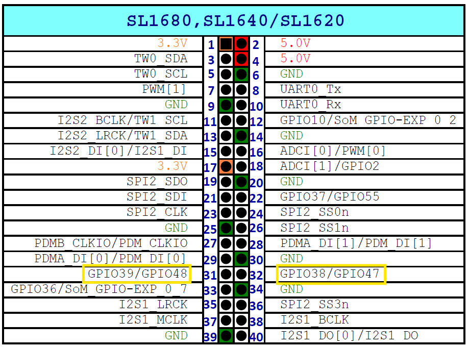

===================================
Controlling ALSA Volume using GPIOs
===================================

GPIOs can be used to control ALSA based volume controls which is useful for implementing volume buttons. This guide will
show an example of implementing GPIO based volume control for a USB device such as USB headphones.

Compatibility
-------------

Not all audio devices have ALSA volume controls. The following table describes which Devices
can be controlled using this method.

===============  ============================    ===========================================
Use Case         Applicable / Not Applicable     Remarks
===============  ============================    ===========================================
USB Headphones   Applicable
ALSA device      Not Applicable                  There is no codec support on Astra Machina,

                                                 so master volume control at ALSA level

                                                 is not present.

Bluetooth Audio  Not Applicable                  For Bluetooth volume control is handled in

                                                 software level. There is no volume control

                                                 in ALSA level
===============  ============================    ===========================================

Example
-------

By default the kernel device tree files ``dolphin-rdk.dts``, ``platypus-rdk.dts``, and ``myna2-rdk.dts`` map GPIOs to Volume Up and
Volume Down key presses. In this example we use the ``volume_update.sh`` to listen for these key press events and then to set the ALSA
volume control accordingly.

GPIO Mappings

=======  ========================   ==========================
SoC      Volume Up GPIO (pin 32)     Volume Down GPIO (pin 31)
=======  ========================   ==========================
SL1620    GPIO47                    GPIO48
SL1640    GPIO38                    GPIO39
SL1680    GPIO38                    GPIO39
=======  ========================   ==========================

    Pinout of SL1620 / SL1640 / SL1680 Volume Up and Down GPIOs

Here is the ``volume_update.sh`` script::

    #!/bin/bash
    EVENT_DEVICE="/dev/input/event0"
    # Check if exactly 2 arguments are passed
    if [ "$#" -ne 2 ]; then
        echo "Usage: $0 <sound_card_number> <mixer_control>"
        echo "Example: $0 0 Master Volume"
        exit 1
    fi
    SOUND_CARD="$1"
    MIXER_CONTROL="$2"
    # Function to adjust volume
    adjust_volume() {
        case "$1" in
            KEY_VOLUMEUP)
                amixer -c $SOUND_CARD set "$MIXER_CONTROL" 5%+ ;;
            KEY_VOLUMEDOWN)
                amixer -c $SOUND_CARD set "$MIXER_CONTROL" 5%- ;;
        esac
    }
    # Check if evtest is installed
    if ! command -v evtest &>/dev/null; then
        echo "Error: evtest is not installed. Please enable in yocto build"
        exit 1
    fi
    # Listen for key events
    evtest --grab "$EVENT_DEVICE" | while read -r line; do
        if [[ "$line" =~ Event:.+KEY_VOLUMEUP ]]; then
            adjust_volume "KEY_VOLUMEUP"
        elif [[ "$line" =~ Event:.+KEY_VOLUMEDOWN ]]; then
            adjust_volume "KEY_VOLUMEDOWN"
        fi
    done

The script takes the Sound Card Number and the Mixer control as parameters. To find the Sound Card Number,
run ``cat /proc/asound/pcm`` and look for the number on the left for the audio device which you are contolling.

::

    root@sl1680:~#  cat /proc/asound/pcm
    00-00: soc-i2so1 snd-soc-dummy-dai-0 :  : playback 1
    00-01: soc-i2so3 snd-soc-dummy-dai-1 :  : playback 1
    00-02: soc-dmic snd-soc-dummy-dai-2 :  : capture 1
    00-03: soc-i2si2 snd-soc-dummy-dai-3 :  : capture 1
    00-04: btsco-in snd-soc-dummy-dai-4 :  : capture 1
    00-05: soc-i2s-pri-lpbk snd-soc-dummy-dai-5 :  : capture 1
    00-06: soc-i2s-hdmi-lpbk snd-soc-dummy-dai-6 :  : capture 1
    00-07: soc-hdmio snd-soc-dummy-dai-7 :  : playback 1
    00-08: soc-hdmii snd-soc-dummy-dai-8 :  : capture 1
    01-00: USB Audio : USB Audio : playback 1 : capture 1

In this example, we are controlling the volume of the USB Audio device. We see that the Sound Card Number is 1.

Then we need to find the ``amixer`` control name for volume adjustment. Run ``amixer -c 1 contents``.

::

    root@sl1680:~# root@sl1680:~# amixer -c 1 contents
    numid=7,iface=MIXER,name='Mic Capture Switch'
    ; type=BOOLEAN,access=rw------,values=1
    : values=on
    numid=8,iface=MIXER,name='Mic Capture Volume'
    ; type=INTEGER,access=rw---R--,values=1,min=0,max=8,step=0
    : values=6
    | dBminmax-min=-10.00dB,max=6.00dB
    numid=3,iface=MIXER,name='Sidetone Playback Switch'
    ; type=BOOLEAN,access=rw------,values=1
    : values=off
    numid=4,iface=MIXER,name='Sidetone Playback Volume'
    ; type=INTEGER,access=rw---R--,values=1,min=0,max=5,step=0
    : values=3
    | dBminmax-min=-24.00dB,max=-9.00dB
    numid=5,iface=MIXER,name='Speaker Playback Switch'
    ; type=BOOLEAN,access=rw------,values=1
    : values=on
    numid=6,iface=MIXER,name='Speaker Playback Volume'
    ; type=INTEGER,access=rw---R--,values=1,min=0,max=30,step=0
    : values=14
    | dBminmax-min=-48.00dB,max=12.00dB
    numid=1,iface=PCM,name='Capture Channel Map'
    ; type=INTEGER,access=r----R--,values=1,min=0,max=36,step=0
    : values=0
    | container
        | chmap-fixed=MONO
    numid=2,iface=PCM,name='Playback Channel Map'
    ; type=INTEGER,access=r----R--,values=2,min=0,max=36,step=0
    : values=0,0
    | container
        | chmap-fixed=FL,FR
        numid=7,iface=MIXER,name='Mic Capture Switch'
        ; type=BOOLEAN,access=rw------,values=1
        : values=on
        numid=8,iface=MIXER,name='Mic Capture Volume'
        ; type=INTEGER,access=rw---R--,values=1,min=0,max=8,step=0
        : values=6
        | dBminmax-min=-10.00dB,max=6.00dB
        numid=3,iface=MIXER,name='Sidetone Playback Switch'
        ; type=BOOLEAN,access=rw------,values=1
        : values=off
        numid=4,iface=MIXER,name='Sidetone Playback Volume'
        ; type=INTEGER,access=rw---R--,values=1,min=0,max=5,step=0
        : values=3
        | dBminmax-min=-24.00dB,max=-9.00dB
        numid=5,iface=MIXER,name='Speaker Playback Switch'
        ; type=BOOLEAN,access=rw------,values=1
        : values=on
        numid=6,iface=MIXER,name='Speaker Playback Volume'
        ; type=INTEGER,access=rw---R--,values=1,min=0,max=30,step=0
        : values=14
        | dBminmax-min=-48.00dB,max=12.00dB
        numid=1,iface=PCM,name='Capture Channel Map'
        ; type=INTEGER,access=r----R--,values=1,min=0,max=36,step=0
        : values=0
        | container
            | chmap-fixed=MONO
        numid=2,iface=PCM,name='Playback Channel Map'
        ; type=INTEGER,access=r----R--,values=2,min=0,max=36,step=0
        : values=0,0
        | container
            | chmap-fixed=FL,FR

Based on this output, we can see that the volume adjustment amixer control name is “Speaker Playback Volume“.

Now, run the script with these values::

    ./volume_update.sh 1 "Speaker Playback Volume" &

Now play audio, for example::

    aplay -D "hw:1,0" ./My_love_48K_s16le.wav &

Now toggling pin 31 and pin32 will adjust the volume.

    * Toggling between 3.3V and GND in pin 32 for volume up
    * Toggle between 3.3V and GND in pin 31 for volume down