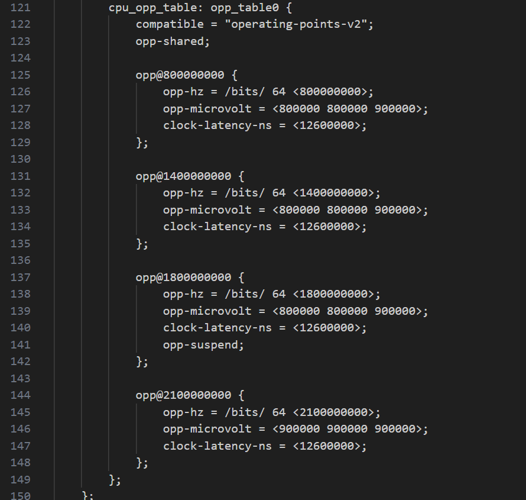

=======================================
Dynamic Voltage and Frequency Switching
=======================================

Astra Machina supports Dynamic Voltage and Frequency Switching using the Linux Kernel's CPUFreq and DevFreq subsystems. This allows
the system to adjust VCPU and VCORE clock frequencies and voltages based on system performance. VCPU is the power supplied to the
CPU cores and VCORE is the power supplied to the GPU, DDR, NPU, and other modules.

+-----------------+----------+----------+----------+
|                 |  SL1620  |  SL1640  |  SL1680  |
+-----------------+----------+----------+----------+
| VCPU (CPUFreq)  |    Y     |    Y     |     Y    |
+-----------------+----------+----------+----------+
| VCORE (DevFreq) |    N     |    Y     |    N     |
+-----------------+----------+----------+----------+

*DVFS Support Table*

Clock frequencies and voltage configurations are defined in the Operating Performance Points (OPP) table in device tree. The ``opp_table0``
is defined in ``dolphin.dtsi``, ``platypus.dtsi``, and ``myna2.dtsi`` for VCPU. The ``vcore_opp_table`` is defined in ``platypus.dtsi`` for VCORE.

    SL1680 OPP table defined in dolphin.dtsi

.. figure:: media/sl1640-vcore-opp-table.png

    SL1640 VCORE OPP table defined in platypus.dtsi

CPUFreq sysfs Interface
-----------------------

The Linux CPUFreq subsystem provides a sysfs interface for viewing and setting frequencies and governor policies at ``/sys/devices/system/cpu/cpufreq/policy0``.

    SL1640 CPUFreq sysfs files

More information at `CPUFreq Linux Kernel Documentation <https://www.kernel.org/doc/html/v5.15/admin-guide/pm/cpufreq.html>`__.

DevFreq sysfs Interface
-----------------------

The Linux DevFreq subsystem also provides a sysfs interface similar to the one provided by CPUFreq at ``:/sys/class/devfreq/soc:dvfs``. 

    SL1640 DevFreq sysfs files

More information at `DevFreq Linux Kernel Documentation <https://www.kernel.org/doc/Documentation/ABI/testing/sysfs-class-devfreq>`__.

Checking Regulator Voltage
--------------------------

The voltages being supplied to VCPU and VCORE can be viewed using the regulator sysfs interface located at ``/sys/class/regulator``.

.. figure:: media/sl1640-regulators.png

    SL1640 output from sysfs regulator interface