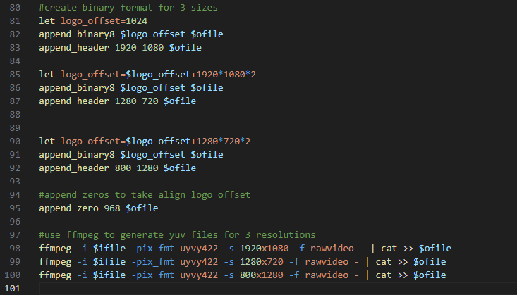

======================================================
FastLogo Sub-Image(fastlogo.subimg.gz) File Generation
======================================================

Introduction
============

The scope of the document is to provide information and instructions for generating a fastlogo sub-image(fastlogo.subimg.gz) file from a given PNG or JPEG file.

fastlogo.subimg.gz file layout
==============================

The ``fastlogo.subimg.gz`` is a compressed file consisting of two sections: a header and the logo/image data. The first 1 KB of the file is the header, which contains information about the logo/image, such as version, the number of logos/images, and specific details for each logo/image, including offset, width, height, and size. The logo/image data is stored immediately after the header

Below Layout gives a brief on the partition.
The diagram below illustrates the high-level structure of the ``fastlogo.subimg.gz`` file.

Customization of fastlogo.subimg.gz
===================================

|
| The script for generating fastlogo.subimg.gz is located at the path below in sdk codebase.

|    - YUV422 fastlogo generation script - ``<sdk_path>/build/tools/bin/create_fastlogo.sh``
|    - RGB24 fastlogo generation script - ``<sdk_path>/build/tools/bin/create_fastlogo_rgb24.sh``

Data format for fastlogo.subimg.gz logo/image across different platforms
^^^^^^^^^^^^^^^^^^^^^^^^^^^^^^^^^^^^^^^^^^^^^^^^^^^^^^^^^^^^^^^^^^^^^^^^

If customization is required, the above fastlogo.subimg.gz file must be modified/generated with the custom logo using provided reference script and then update accordingly.

| **Fastlogo input of different platforms:**
| -  SL1680/SL1640: logo/image should be in YUV422 video format.
| -  SL1620: logo/image should be in RGB24 graphics format.

SL1640/SL1680: fastlogo.subimg.gz generation in YUV422 Video format
^^^^^^^^^^^^^^^^^^^^^^^^^^^^^^^^^^^^^^^^^^^^^^^^^^^^^^^^^^^^^^^^^^^

The default script, create_fastlogo.sh, generates three images with resolutions of 1920x1080, 1280x720, and 800x1280 in YUV422 video format. To adjust the resolution, please refer to the image below, focusing on the lines that start with 'append_header' and 'ffmpeg' where the resolution is specified.

**append_header**: Adds header information for the logo image, such as width, height, and stride. Adjust the width and height according to the desired display resolution

::

   let logo_offset=1024
   append_binary8 $logo_offset $ofile
   append_header 1920 1080 $ofile

**ffmpeg**: This script uses ffmpeg to convert JPG/PNG files to YUV422 format. Adjust/Modify the width and height according to the required display resolution.

::

   ffmpeg -i $ifile -pix_fmt uyvy422 -s 1920x1080 -f rawvideo - | cat >> $ofile

SL1620: FastLogo Sub-Image(fastlogo.subimg.gz) File Generation in RGB24 Graphics format
^^^^^^^^^^^^^^^^^^^^^^^^^^^^^^^^^^^^^^^^^^^^^^^^^^^^^^^^^^^^^^^^^^^^^^^^^^^^^^^^^^^^^^^

The default script, create_fastlogo_rgb24.sh, generates three images with resolutions of 800x1280, and 800x480 in RGB24 graphics format. To adjust the resolution, please refer to the image below, focusing on the lines that start with 'append_header' and 'ffmpeg' where the resolution is specified.

**append_header**: Adds header information for the logo image, such as width, height, and stride. Adjust the width and height according to the desired display resolution

**ffmpeg**: This script uses ffmpeg to convert JPG/PNG files to RGB24 format. Adjust/Modify the width and height according to the required display resolution.

::

   let logo_offset=1024
   append_binary8 $logo_offset $ofile
   append_header 800 1280 $ofile

::

   ffmpeg -i $ifile -pix_fmt rgb24 -s 800x1280 -f rawvideo -vf transpose=2 - | cat >> $ofile

Steps to generate fastlogo.subimg.gz
====================================

The fastlogo.subimg.gz file containing the "Astra reference logo" can be found in the following location.

::

   <SDK_PATH>/configs/product/<profile>

fastlogo.subimg.gz file generation script parameters
^^^^^^^^^^^^^^^^^^^^^^^^^^^^^^^^^^^^^^^^^^^^^^^^^^^^

**SL1620**: Generate RGB24 logo subimage

::

   create_fastlogo_rgb24.sh -i <input Jpeg/PNG file> -o fastlogo.subimg

**SL1640/SL1680**: Generate YUV422 logo subimage

::

   create_fastlogo.sh -i <input Jpeg/PNG file> -o fastlogo.subimg

Steps to get the display of the custom fastlogo
-----------------------------------------------

| - The above command/script generates the fastlogo.subimg.gz file.
| - Copy the generated fastlogo.subimg.gz in above step to ``<sdk_path>/configs/product/``
| - Build the image.
| - The generated ``fastlogo.subimg.gz`` in the ``eMMCimg`` directory will contain the custom fastlogo.
