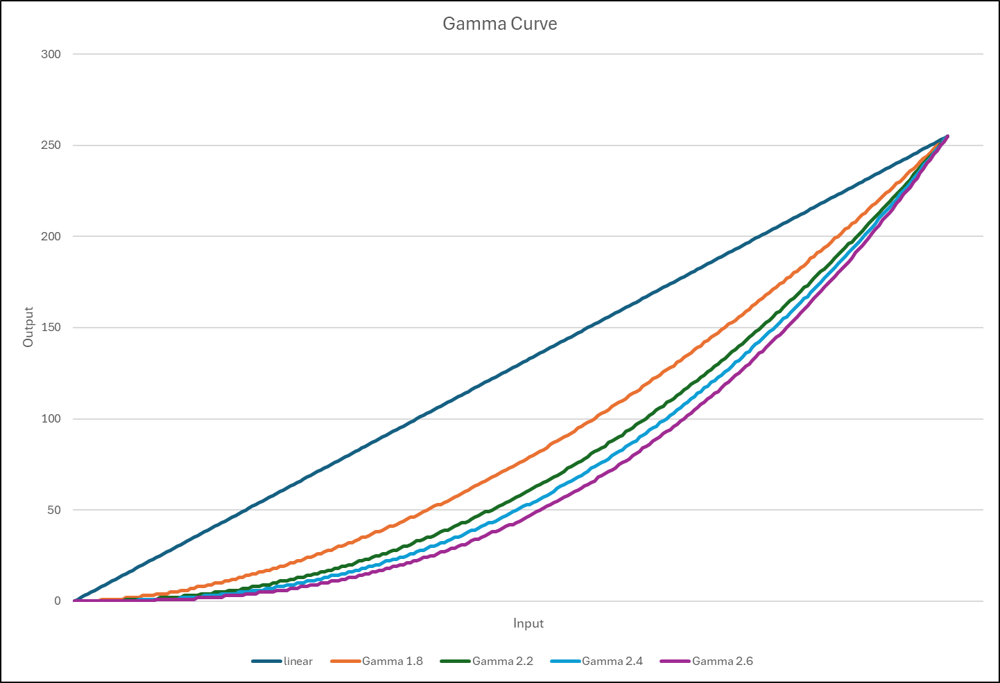
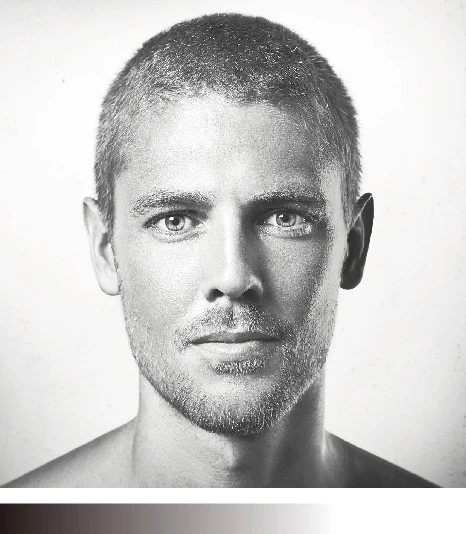

==========================================================
Controlling Display Gamma on the Synaptics DRM Driver
==========================================================

``gamma_set`` is a userspace application to display BMP images and
control gamma correction on DRM CRTCs using the Synaptics display
driver.

Features
========

* Loads and displays BMP images (24-bit and 32-bit)
* Direct CRTC gamma control with specified CRTC ID
* Interactive gamma value switching (``-i`` option)
* Dynamic gamma table generation
* Dumps gamma tables with formula (``-d`` option)
* BMP images are centered on the display

Gamma Formula
=============

The gamma lookup table is generated using::

    output = 255 * (input / 255) ^ gamma

Where:

* ``input`` = 0, 1, 2, ..., 255
* ``gamma`` = 1.8, 2.2, 2.4, 2.6

Supported Gamma Values
======================

+--------+----------------------------+
| Value  | Effect                     |
+========+============================+
| 0      | Clear gamma (disable)      |
+--------+----------------------------+
| 1.8    | Lighter image              |
+--------+----------------------------+
| 2.2    | Standard (sRGB)            |
+--------+----------------------------+
| 2.4    | Slightly darker            |
+--------+----------------------------+
| 2.6    | Darker image               |
+--------+----------------------------+

.. note::

   Gamma change is applicable only for **SL1620** and **SL26XX** series
   platforms.

Source Code
===========

https://github.com/synaptics-astra/application/blob/#release#/display/gamma_set.c

Compilation
===========

1. Setup Cross-Compilation Environment
--------------------------------------

::

    . /data/jjogj/repos/snapshots/poly/toolchain/syna_image/poky_voip/environment-setup-cortexa55-poky-linux

2. Compile
----------

::

    $CC gamma_set.c -o gamma_set -ldrm -lm \
        -I /data/jjogj/repos/snapshots/poly/toolchain/syna_image/poky_voip/sysroots/cortexa55-poky-linux/usr/include/drm/

.. note::

   ``-lm`` is required for math functions (``pow``, ``round``).

Usage
=====

::

    gamma_set [-d] [-b <bmp_file>] [-i] <crtc_id> <gamma>

    Arguments:
      crtc_id         DRM CRTC identifier (e.g., 36)
      gamma           Gamma value: 0 (clear), 1.8, 2.2, 2.4, 2.6

    Options:
      -d              Dump all gamma tables before applying
      -b <bmp_file>   Display BMP file on CRTC before applying gamma
      -i              Interactive mode for changing gamma continuously

Examples
========

::

    # Set gamma 2.2 on CRTC 36 (exits immediately)
    gamma_set 36 2.2

    # Dump tables, then set gamma
    gamma_set -d 36 2.2

    # Interactive mode on CRTC 36
    gamma_set -i 36 2.2

    # Display BMP and set gamma (waits for 'q' to quit)
    gamma_set -b image.bmp 36 2.2

    # Dump tables, display BMP, set gamma
    gamma_set -d -b image.bmp 36 2.2

    # Display BMP with interactive gamma switching
    gamma_set -b image.bmp -i 36 2.2

Execution
=========

Prerequisites
-------------

* The application requires DRM master access (run as **root**)
* Stop any display server that may hold DRM master (for ``-b`` mode)
* For BMP mode: BMP image must be smaller than or equal to the display
  resolution

Mode 1: Direct CRTC Gamma Mode
------------------------------

Set gamma directly on a CRTC. Exits immediately after applying::

    ./gamma_set 36 2.2

Output::

    Gamma 2.2 applied

Mode 2: BMP Display Mode
------------------------

Display a BMP image and apply gamma. Waits for ``q`` to quit::

    # Stop weston if running
    systemctl stop weston

    # Run gamma_set with BMP
    ./gamma_set -b /usr/share/grey.bmp 36 2.2

Output::

    Loading BMP: /usr/share/grey.bmp
    BMP loaded: 1920x1080
    CRTC 36 current mode: 1920x1080
    Found display: connector 33, CRTC 36, 1920x1080@60Hz
    BMP displayed on CRTC 36
    Gamma 2.2 applied
    Press 'q' to quit: q

Mode 3: Interactive Mode
------------------------

Change gamma values interactively without restarting::

    ./gamma_set -i 36 2.2

Output::

    Gamma 2.2 applied

    Interactive mode. Available gamma values: 0 (clear), 1.8, 2.2, 2.4, 2.6
    Press 'q' to quit (or enter gamma value): 1.8
    Gamma 1.8 applied
    Press 'q' to quit (or enter gamma value): 0
    Gamma cleared
    Press 'q' to quit (or enter gamma value): q

Mode 4: BMP with Interactive Mode
---------------------------------

Display a BMP and interactively change gamma::

    ./gamma_set -b image.bmp -i 36 2.2

Mode 5: With ``modetest``
-------------------------

Use ``modetest`` to hold the display active while ``gamma_set``
controls gamma.

Terminal 1 -- Start display with ``modetest``::

    systemctl stop weston
    modetest -M synaptics -s 33@36:#0 -d

Terminal 2 -- Set gamma::

    ./gamma_set 36 2.2
    ./gamma_set 36 1.8
    ./gamma_set 36 0

.. note::

   The CRTC ID and connector ID can be found using::

       modetest -M synaptics

Mode 6: Dump Gamma Tables
-------------------------

::

    ./gamma_set -d 36 2.2

Output (truncated)::

    Gamma Table Generation Formula:
    ================================

      output = 255 * (input / 255) ^ gamma

      where: input = 0, 1, 2, ..., 255
             gamma = 1.8, 2.2, 2.4, 2.6

    Gamma 1.8:  output = 255 * (input/255)^1.8
    ---------
      0,  0,  0,  0,  0,  0,  0,  0,  1,  1,  1,  1,  1,  1,  1,  2
      ...

    Gamma 2.2 applied

Expected Results
================

+--------+----------------------------------------+
| Gamma  | Visual Effect                          |
+========+========================================+
| 1.8    | Image appears lighter / washed out     |
+--------+----------------------------------------+
| 2.2    | Standard appearance                    |
+--------+----------------------------------------+
| 2.4    | Image appears darker                   |
+--------+----------------------------------------+
| 2.6    | Image appears significantly darker     |
+--------+----------------------------------------+
| 0      | Gamma disabled (linear)                |
+--------+----------------------------------------+

BMP Image Support
=================

* Supported formats: **24-bit and 32-bit BMP**
* BMP must be smaller than or equal to the display resolution
* Images smaller than the display are centered on screen
* Images larger than the display will cause an error::

    Error: BMP image (2560x1440) is larger than display (1920x1080)

Display Support
===============

* Works with any connected display resolution
* Automatically selects the preferred mode from EDID
* Falls back to the first available mode if no preferred mode is
  reported

Error Messages
==============

+--------------------------------------------------+--------------------------------------------------+
| Error                                            | Cause                                            |
+==================================================+==================================================+
| ``Failed to load BMP``                           | Invalid or unsupported BMP file                  |
+--------------------------------------------------+--------------------------------------------------+
| ``BMP image (WxH) is larger than display (WxH)`` | BMP resolution exceeds display                   |
+--------------------------------------------------+--------------------------------------------------+
| ``No connector found for CRTC``                  | No display connected to specified CRTC           |
+--------------------------------------------------+--------------------------------------------------+
| ``Invalid gamma value``                          | Gamma value not in the supported list            |
+--------------------------------------------------+--------------------------------------------------+
| ``GAMMA_LUT property not found for CRTC``        | Driver does not support GAMMA_LUT on this CRTC   |
+--------------------------------------------------+--------------------------------------------------+

Notes
=====

* Direct mode (``gamma_set 36 2.2``) exits immediately after applying
  gamma.
* BMP mode (``-b``) waits for ``q`` to quit, keeping the display
  active.
* Interactive mode (``-i``) allows changing gamma values without
  restarting.
* Options can be combined: ``-d -b image.bmp -i``.
* Gamma changes take effect immediately during the next vertical
  blanking interval.
* Use ``modetest -M synaptics`` to find connector and CRTC IDs.

Gamma Curve
===========

The formula below is used to calculate the gamma table; these values
are used to plot the gamma curve::

    output = 255 * (input / 255) ^ gamma

    where: input = 0, 1, 2, ..., 255
           gamma = 1.8, 2.2, 2.4, 2.6

Example 1
---------

.. figure:: media/person_g0.jfif

    Gamma disable

.. figure:: media/person_g1.8.jfif

    Gamma 1.8
    
.. figure:: media/person_g2.2.jfif

    Gamma 2.2
    
.. figure:: media/person_g2.4.jfif

    Gamma 2.4
    
.. figure:: media/person_g2.6.jfif

    Gamma 2.6

Example 2
---------

.. figure:: media/lighthouse_g0.jfif

    Gamma disable

.. figure:: media/lighthouse_g1.8.jfif

    Gamma 1.8

.. figure:: media/lighthouse_g2.2.jfif

    Gamma 2.2

.. figure:: media/lighthouse_g2.4.jfif

    Gamma 2.4
    
.. figure:: media/lighthouse_g2.6.jfif

    Gamma 2.6.

Please find the attached original test images

