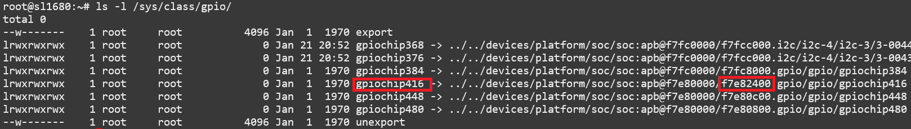

======================
GPIOs on Astra Machina
======================

Astra Machina integrates many GPIOs to support its various functionalities. This guide will cover how to use GPIOs with Astra Machina and
configure their functionality.

On Astra Machina:

- All of the GPIOs are multiplexed and can be configured for different functionality.
- All GPIOs can be assigned interrupts. However, GPO (output only pins) cannot.

Specific details on GPIOs can be found in the :doc:`../hw/index`.

Accessing GPIOs from Userspace
==============================

GPIOs can be accessed and configured using the GPIO sysfs interface ``/sys/class/gpio``. GPIOs can be exported to userspace and their
direction and value can be viewed or set. 

For example, to export GPIO[36] on SL1680 run the command::

    root@sl1680:~# echo 484 > /sys/class/gpio/export

GPIO[36] is located on the 40 pin connectors on SL1640 and SL1680. GPIO[36] maps to GPIO number 484 based on the instruction in :ref:`gpio_mapping`.

Once the GPIO has been exported, the value and direction can be viewed and set::

    root@sl1680:~# cd /sys/class/gpio/
    root@sl1680:/sys/class/gpio/gpio484# cat direction
    in
    root@sl1680:/sys/class/gpio/gpio484# cat value
    0

By default, GPIO[36] is set to input with the value 0. To changes these value, write to the corresponding sysfs file::

    root@sl1680:/sys/class/gpio/gpio484# echo "out" > direction
    root@sl1680:/sys/class/gpio/gpio484# cat direction
    out
    root@sl1680:/sys/class/gpio/gpio484# echo 1 > value
    root@sl1680:/sys/class/gpio/gpio484# cat value
    1

Changing the Function of GPIOs
==============================

GPIOs which are assigned to other functionality can be reconfigured to function as generic GPIOs. This is done by updating
the device tree entries in the Linux Kernel. This requires modifying the ``linux-syna`` package using ``devtool``::

    devtool modify linux-syna

Modify the platform dts file located in ``build-sl1680/workspace/sources/linux-syna/arch/arm64/boot/dts/synaptics``.

+-----------------+---------------+------------------+-----------------+
|                 | SL1620        | SL1640           | SL1680          |
+-----------------+---------------+------------------+-----------------+
| DTS             | myna2-rdk.dts | platypus-rdk.dts | dolphin-rdk.dts |
+-----------------+---------------+------------------+-----------------+

First, identify where the GPIOs are currently configured in the dts file and disable them. Then reassign them to function as GPIOs.

The following example will reassign GPIO[12] and GPIO[13] to function as GPIOs in SL1620.

.. figure:: media/sl1620-i2c-dts-section.png

.. figure:: media/sl1620-lcdc-dts-section.png

Build the image with the updated device tree entries::

   devtool build linux-syna
   devtool build-image astra-media

.. _gpio_mapping:

GPIO Mappings
=============

Userspace GPIO IDs are assigned based on the gpiochip number which is assigned dynamically. Changes in the device configuration, such as
updating the device tree (DTS), can cause the gpiochip number to change. Therefore, userspace GPIO IDs need to be calculated using the
current gpiochip number assigned to the GPIO port.

GPIOs 0 - 31:

.. math::

    \text{GPIO ID} = \text{gpiochip#} + \text{GPIO#}

GPIOs 32 - 63:

.. math::

    \text{GPIO ID} = \text{gpiochip#} + (\text{GPIO#} - 32)

GPIOs 64 - 95:

.. math::

    \text{GPIO ID} = \text{gpiochip#} + (\text{GPIO#} - 64)

To do this calculation start by identifying the gpiochip number for the controller on which the GPIO is attached. The address will match
the GPIO ports in the tables below. Find which gpiochip is associated with which GPIO port by running ``ls -l /sys/class/gpio``. The symlink
will contain the GPIO port address of the port associated with the gpiochip.

    gpiochip numbers on SL1680

The following examples show how to calculate GPIO IDs for various GPIOs. Using the gpiochip number associated with the GPIO port.

Calculate GPIO[5]:

.. math::

    \text{GPIO[5]} = 416 + 5 = 421

Calculate GPIO[46]:

.. math::

    \text{GPIO[46]} = 448 + (46 - 32) = 462

Calculate GPIO[80]:

.. math::

    \text{GPIO[80]} = 480 + (80 - 64) = 496

SL1620
------

=================   ========   ========
GPIO Port           Address    GPIOs
=================   ========   ========
gpio\@0800          f7e80800   0 to 31
gpio\@0c00          f7e80c00   32 to 63
gpio\@1000          f7e81000   64 to 95
=================   ========   ========

SL1640 / SL1680
---------------

=================   ========   ========
GPIO Port           Address    GPIOs
=================   ========   ========
gpio\@2400          f7e82400   0 to 31
gpio\@0800          f7e80800   32 to 63
gpio\@0c00          f7e80c00   64 to 95
=================   ========   ========
