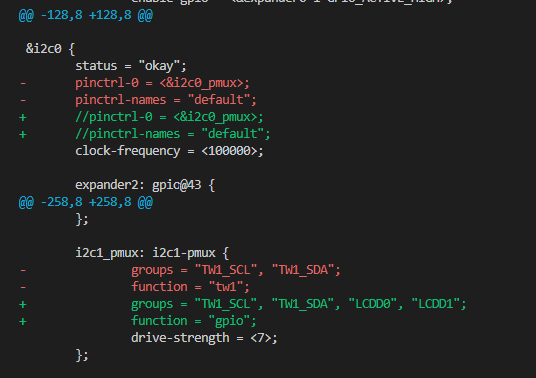
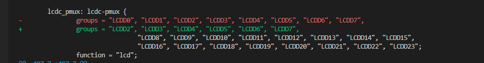
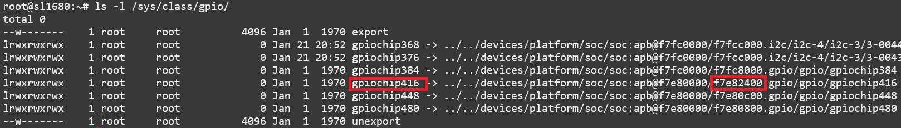

======================
GPIOs on Astra Machina
======================

Astra Machina integrates many GPIOs to support its various functionalities. This guide will cover how to use GPIOs with Astra Machina and
configure their functionality.

On Astra Machina:

- All of the GPIOs are multiplexed and can be configured for different functionality.
- All GPIOs can be assigned interrupts. However, GPO (output only pins) cannot.

Specific details on GPIOs can be found in the :doc:`../hw/index`.

Accessing GPIOs from Userspace
==============================

GPIOs can be accessed and configured using the ``libgpiod`` tools. These tools interface with the kernel's character device interface ``/dev/gpiochipN``
instead of the deprecated sysfs interface.

To identify available GPIO chips and lines, use:

::

    root@sl1680:~# gpiodetect
    root@sl1680:~# gpioinfo

GPIOs are accessed by chip and line offset, rather than the legacy global GPIO number.

For example, GPIO[36] on the SL1680 corresponds to line offset 4 on its GPIO controller (see :ref:`gpio_mapping`).

To read the value of GPIO[36]:

::

    root@sl1680:~# gpioget -c gpiochip1 4
    "4"=active

To configure GPIO[36] as an output and set it high. The command will hold the line high until it exits.

::

    root@sl1680:~# gpioset -c gpiochip1 4=1

To set GPIO[36] low. The command will hold the line low until it exits.

::

    root@sl1680:~# gpioset -c gpiochip1 4=0

The ``libgpiod`` tools support input and output. The ``gpioget`` program requests the line as an input whereas
``gpioset`` requests the line as an output. The line is released automatically when the command exits.

.. note::

    Unlike the legacy sysfs interface, the GPIO value is only driven while the
    process holds the line. When ``gpioset`` exits, the line is released and its
    state is no longer guaranteed.

Changing the Function of GPIOs
==============================

GPIOs which are assigned to other functionality can be reconfigured to function as generic GPIOs. This is done by updating
the device tree entries in the Linux Kernel. This requires modifying the ``linux-syna`` package using ``devtool``::

    devtool modify linux-syna

Modify the platform dts file located in ``build-sl1680/workspace/sources/linux-syna/arch/arm64/boot/dts/synaptics``.

+-----------------+---------------+------------------+-----------------+-----------------+
|                 | SL1620        | SL1640           | SL1680          | SL261x          |
+-----------------+---------------+------------------+-----------------+-----------------+
| DTS             | myna2-rdk.dts | platypus-rdk.dts | dolphin-rdk.dts | sl261*-rdk.dts  |
+-----------------+---------------+------------------+-----------------+-----------------+

First, identify where the GPIOs are currently configured in the dts file and disable them. Then reassign them to function as GPIOs.

The following example will reassign GPIO[12] and GPIO[13] to function as GPIOs in SL1620.

Build the image with the updated device tree entries::

   devtool build linux-syna
   devtool build-image astra-media

.. _gpio_mapping:

GPIO Mappings
=============

Userspace GPIO IDs are assigned based on the gpiochip number which is assigned dynamically. Changes in the device configuration, such as
updating the device tree (DTS), can cause the gpiochip number to change. Therefore, userspace GPIO IDs need to be calculated using the
current gpiochip number assigned to the GPIO port.

GPIOs 0 - 31:

.. math::

    \text{GPIO ID} = \text{gpiochip#} + \text{GPIO#}

GPIOs 32 - 63:

.. math::

    \text{GPIO ID} = \text{gpiochip#} + (\text{GPIO#} - 32)

GPIOs 64 - 95:

.. math::

    \text{GPIO ID} = \text{gpiochip#} + (\text{GPIO#} - 64)

To do this calculation start by identifying the gpiochip number for the controller on which the GPIO is attached. The address will match
the GPIO ports in the tables below. Find which gpiochip is associated with which GPIO port by running ``ls -l /sys/class/gpio``. The symlink
will contain the GPIO port address of the port associated with the gpiochip.

    gpiochip numbers on SL1680

The following examples show how to calculate GPIO IDs for various GPIOs. Using the gpiochip number associated with the GPIO port.

Calculate GPIO[5]:

.. math::

    \text{GPIO[5]} = 416 + 5 = 421

Calculate GPIO[46]:

.. math::

    \text{GPIO[46]} = 480 + (46 - 32) = 494

Calculate GPIO[80]:

.. math::

    \text{GPIO[80]} = 448 + (80 - 64) = 464

SL1620
------

=================   ========   ========
GPIO Port           Address    GPIOs
=================   ========   ========
gpio\@0800          f7e80800   0 to 31
gpio\@0c00          f7e80c00   32 to 63
gpio\@1000          f7e81000   64 to 95
=================   ========   ========

SL1640 / SL1680
---------------

=================   ========   ========
GPIO Port           Address    GPIOs
=================   ========   ========
gpio\@2400          f7e82400   0 to 31
gpio\@0800          f7e80800   32 to 63
gpio\@0c00          f7e80c00   64 to 95
=================   ========   ========

SL261x
------

=================   ========   ========
GPIO Port           Address    GPIOs
=================   ========   ========
gpio\@7000          f7f07000   0 to 31
gpio\@e000          f7f0e000   32 to 63
gpio\@8000          e5038000   64 to 79
gpio\@9000          e5039000   80 to 87
gpio\@a000          e503a000   88 to 95
=================   ========   ========

.. note::

    Mappings may change if based on modifications to devicetree. The tables above are for reference only
    and my not be accurate for all configurations.