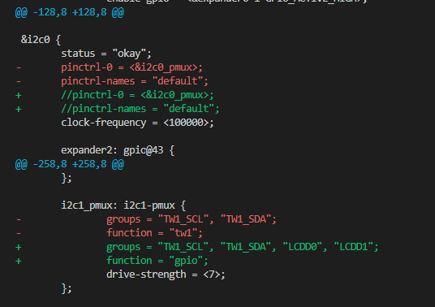

======================
GPIOs on Astra Machina
======================

Astra Machina integrates many GPIOs to support its various functionalities. This guide will cover how to use GPIOs with Astra Machina and
configure their functionality.

On Astra Machina:

- All of the GPIOs are multiplexed and can be configured for different functionality.
- All GPIOs can be assigned interrupts. However, GPO (output only pins) cannot.

Specific details on GPIOs can be found in the :doc:`../hw/index`.

Accessing GPIOs from Userspace
==============================

GPIOs can be accessed and configured using the GPIO sysfs interface ``/sys/class/gpio``. GPIOs can be exported to userspace and their
direction and value can be viewed or set. 

For example, to export GPIO[36] on SL1680 run the command::

    root@sl1680:~# echo 484 > /sys/class/gpio/export

GPIO[36] is located on the 40 pin connectors on SL1640 and SL1680. GPIO[36] maps to GPIO number 484 based on the table below :ref:`mapping_table`.

Once the GPIO has been exported, the value and direction can be viewed and set::

    root@sl1680:~# cd /sys/class/gpio/
    root@sl1680:/sys/class/gpio/gpio484# cat direction
    in
    root@sl1680:/sys/class/gpio/gpio484# cat value
    0

By default, GPIO[36] is set to input with the value 0. To changes these value, write to the corresponding sysfs file::

    root@sl1680:/sys/class/gpio/gpio484# echo "out" > direction
    root@sl1680:/sys/class/gpio/gpio484# cat direction
    out
    root@sl1680:/sys/class/gpio/gpio484# echo 1 > value
    root@sl1680:/sys/class/gpio/gpio484# cat value
    1

Changing the Function of GPIOs
==============================

GPIOs which are assigned to other functionality can be reconfigured to function as generic GPIOs. This is done by updating
the device tree entries in the Linux Kernel. This requires modifying the ``linux-syna`` package using ``devtool``::

    devtool modify linux-syna

Modify the platform dts file located in ``build-sl1680/workspace/sources/linux-syna/arch/arm64/boot/dts/synaptics``.

+-----------------+---------------+------------------+-----------------+
|                 | SL1620        | SL1640           | SL1680          |
+-----------------+---------------+------------------+-----------------+
| DTS             | myna2-rdk.dst | platypus-rdk.dts | dolphin-rdk.dst |
+-----------------+---------------+------------------+-----------------+

First, identify where the GPIOs are currently configured in the dts file and disable them. Then reassign them to function as GPIOs.

The following example will reassign GPIO[12] and GPIO[13] to function as GPIOs in SL1620.

.. figure:: media/sl1620-lcdc-dts-section.png

Build the image with the updated device tree entries::

   devtool build linux-syna
   devtool build-image astra-media

.. _mapping_table:

GPIO Mappings
=============

SL1620
------

====   ===========   =========   =====
GPIO   GPIO Number   GPIO Chip   Port
====   ===========   =========   =====
0      480           0           A
1      481           0           A
2      482           0           A
3      483           0           A
4      484           0           A
5      485           0           A
6      486           0           A
7      487           0           A
8      488           0           A
9      489           0           A
10     490           0           A
11     491           0           A
12     492           0           A
13     493           0           A
14     494           0           A
15     495           0           A
16     496           0           A
17     497           0           A
18     498           0           A
19     499           0           A
20     500           0           A
21     501           0           A
22     502           0           A
23     503           0           A
24     504           0           A
25     505           0           A
26     506           0           A
27     507           0           A
28     508           0           A
29     509           0           A
30     510           0           A
31     511           2           B
32     416           2           B
33     417           2           B
34     418           2           B
35     419           2           B
36     420           2           B
37     421           2           B
38     422           2           B
39     423           2           B
40     424           2           B
41     425           2           B
42     426           2           B
43     427           2           B
44     428           2           B
45     429           2           B
46     430           2           B
47     431           2           B
48     432           2           B
49     433           2           B
50     434           2           B
51     435           2           B
52     436           2           B
53     437           2           B
54     438           2           B
55     439           2           B
56     440           2           B
57     441           2           B
58     442           2           B
59     443           2           B
60     444           2           B
61     445           2           B
62     446           2           B
63     447           2           B
64     448           3           C
65     449           3           C
66     450           3           C
67     451           3           C
68     452           3           C
69     453           3           C
70     454           3           C
71     455           3           C
====   ===========   =========   =====

SL1640 / SL1680
---------------

====   ===========   =========   =====
GPIO   GPIO Number   GPIO Chip   Port
====   ===========   =========   =====
0      416           2           A
1      417           2           A
2      418           2           A
3      419           2           A
4      420           2           A
5      421           2           A
6      422           2           A
7      423           2           A
8      424           2           A
9      425           2           A
10     426           2           A
11     427           2           A
12     428           2           A
13     429           2           A
14     430           2           A
15     431           2           A
16     432           2           A
17     433           2           A
18     434           2           A
19     435           2           A
20     436           2           A
21     437           2           A
22     438           2           A
23     439           2           A
24     440           2           A
25     441           2           A
26     442           2           A
27     443           2           A
28     444           2           A
29     445           2           A
30     446           2           A
31     447           2           A
32     480           0           B
33     481           0           B
34     482           0           B
35     483           0           B
36     484           0           B
37     485           0           B
38     486           0           B
39     487           0           B
40     488           0           B
41     489           0           B
42     490           0           B
43     491           0           B
44     492           0           B
45     493           0           B
46     494           0           B
47     495           0           B
48     496           0           B
49     497           0           B
50     498           0           B
51     499           0           B
52     500           0           B
53     501           0           B
54     502           0           B
55     503           0           B
====   ===========   =========   =====
