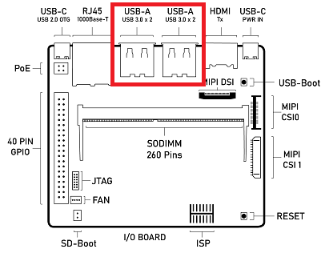
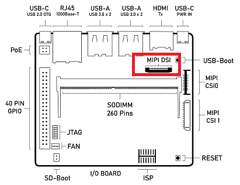

===================================
Haier Panel Configuration Guide
===================================

Introduction
============

This document provides steps on how to enable the Haier reference panel on SL16XX platforms.

.. note::

    The Haier reference panel was the default output for SL1620 up until v1.3. Follow these instructions
    to switch back to MIPI output with the Haier panel.

Connection
==========

1. Connect the USB cable on the Haier panel's adapter board to the USB ports on the SL16XX I/O board.
    This provides power to the panel.

    SL16XX I/O board with USB ports highlighted

2. Connect the 22 pin DSI cable to the MIPI DSI connector on the SL16XX I/O board.

    SL16XX I/O board with MIPI DSI port highlighted

.. figure:: media/haier-mipi-adapter-board.jpg

    Picture of the Haier MIPI Panel adapter board connected to the MIPI DSI port on the SL16XX I/O board.

Software Configuration
======================

The panel needs to be enabled by modifying the Synaptics DRM DSI configuration in the kernels device tree. This requires modifying the
``linux-syna`` package using ``devtool``::

    devtool modify linux-syna

Modify the platform dts file located in ``build-sl1680/workspace/sources/linux-syna/arch/arm64/boot/dts/synaptics``.

+-----------------+---------------+------------------+-----------------+
|                 | SL1620        | SL1640           | SL1680          |
+-----------------+---------------+------------------+-----------------+
| DTS             | myna2-rdk.dst | platypus-rdk.dts | dolphin-rdk.dst |
+-----------------+---------------+------------------+-----------------+

Replace the ``dsi_panel`` entry in the ``drm`` section with::

    dsi_panel {
		status= "okay";

		ACTIVE_WIDTH = <800>;
		HFP = <60>;
		HSYNCWIDTH = <32>;
		HBP = <60>;
		ACTIVE_HEIGHT = <1280>;
		VFP = <16>;
		VSYNCWIDTH = <2>;
		VBP = <14>;
		FREQ = <75000>;
		bits_per_pixel = <24>;
		busformat = <0>;

		HTOTAL = <952>;
		Lanes = /bits/ 8 <4>;
		Vid_mode = /bits/ 8 <2>;
		virtual_chan = /bits/ 8 <0>;
		Clk_Lane_Polarity = /bits/ 8 <0>;
		Data_Lane_Polarity = /bits/ 8 <0>;
		Recv_ack = /bits/ 8 <0>;
		Loosely_18 = /bits/ 8 <0>;
		H_polarity = /bits/ 8 <1>;
		V_Polarity = /bits/ 8 <1>;
		Data_Polarity = /bits/ 8 <1>;
		Eotp_tx = /bits/ 8 <1>;
		Eotp_rx = /bits/ 8 <0>;
		non-Continuous_clk = /bits/ 8 <1>;
		dpi_lp_cmd =  /bits/ 8 <1>;
		Color_coding = /bits/ 8 <5>;
		Chunks = <0>;
		Null_Pkt = <0>;
		Byte_clk = <56250>;

		/*  COMMAND= Command for initialisation
		 *  Format - <CMD> <Payloadlength-n> <BYTE1> <...> <BYTEn>
		 *  Long write Ex: 39 04 FF 98 81 03

		 *  Delay in micro seconds Command format: 0xFF <4BYTE delay>
		 *  Delay for 100ms(100000us => 0x000186A0)
		 *  	- FF A0 86 01 00
		 */
		command = /bits/ 8 <0x39 0x04 0xFF 0x98 0x81 0x03
			0x15 0x02 0x01 0x00
			0x15 0x02 0x02 0x00
			0x15 0x02 0x03 0x73
			0x15 0x02 0x04 0xD7
			0x15 0x02 0x05 0x00
			0x15 0x02 0x06 0x08
			0x15 0x02 0x07 0x11
			0x15 0x02 0x08 0x00
			0x15 0x02 0x09 0x3F
			0x15 0x02 0x0a 0x00
			0x15 0x02 0x0b 0x00
			0x15 0x02 0x0c 0x00
			0x15 0x02 0x0d 0x00
			0x15 0x02 0x0e 0x00
			0x15 0x02 0x0f 0x3F
			0x15 0x02 0x10 0x3F
			0x15 0x02 0x11 0x00
			0x15 0x02 0x12 0x00
			0x15 0x02 0x13 0x00
			0x15 0x02 0x14 0x00
			0x15 0x02 0x15 0x00
			0x15 0x02 0x16 0x00
			0x15 0x02 0x17 0x00
			0x15 0x02 0x18 0x00
			0x15 0x02 0x19 0x00
			0x15 0x02 0x1a 0x00
			0x15 0x02 0x1b 0x00
			0x15 0x02 0x1c 0x00
			0x15 0x02 0x1d 0x00
			0x15 0x02 0x1e 0x40
			0x15 0x02 0x1f 0x80
			0x15 0x02 0x20 0x06
			0x15 0x02 0x21 0x01
			0x15 0x02 0x22 0x00
			0x15 0x02 0x23 0x00
			0x15 0x02 0x24 0x00
			0x15 0x02 0x25 0x00
			0x15 0x02 0x26 0x00
			0x15 0x02 0x27 0x00
			0x15 0x02 0x28 0x33
			0x15 0x02 0x29 0x33
			0x15 0x02 0x2a 0x00
			0x15 0x02 0x2b 0x00
			0x15 0x02 0x2c 0x00
			0x15 0x02 0x2d 0x00
			0x15 0x02 0x2e 0x00
			0x15 0x02 0x2f 0x00
			0x15 0x02 0x30 0x00
			0x15 0x02 0x31 0x00
			0x15 0x02 0x32 0x00
			0x15 0x02 0x33 0x00
			0x15 0x02 0x34 0x00
			0x15 0x02 0x35 0x00
			0x15 0x02 0x36 0x00
			0x15 0x02 0x37 0x00
			0x15 0x02 0x38 0x00
			0x15 0x02 0x39 0x00
			0x15 0x02 0x3a 0x00
			0x15 0x02 0x3b 0x00
			0x15 0x02 0x3c 0x00
			0x15 0x02 0x3d 0x00
			0x15 0x02 0x3e 0x00
			0x15 0x02 0x3f 0x00
			0x15 0x02 0x40 0x00
			0x15 0x02 0x41 0x00
			0x15 0x02 0x42 0x00
			0x15 0x02 0x43 0x00
			0x15 0x02 0x44 0x00
			0x15 0x02 0x50 0x01
			0x15 0x02 0x51 0x23
			0x15 0x02 0x52 0x44
			0x15 0x02 0x53 0x67
			0x15 0x02 0x54 0x89
			0x15 0x02 0x55 0xab
			0x15 0x02 0x56 0x01
			0x15 0x02 0x57 0x23
			0x15 0x02 0x58 0x45
			0x15 0x02 0x59 0x67
			0x15 0x02 0x5a 0x89
			0x15 0x02 0x5b 0xab
			0x15 0x02 0x5c 0xcd
			0x15 0x02 0x5d 0xef
			0x15 0x02 0x5e 0x00
			0x15 0x02 0x5f 0x0C
			0x15 0x02 0x60 0x0C
			0x15 0x02 0x61 0x0F
			0x15 0x02 0x62 0x0F
			0x15 0x02 0x63 0x0E
			0x15 0x02 0x64 0x0E
			0x15 0x02 0x65 0x06
			0x15 0x02 0x66 0x07
			0x15 0x02 0x67 0x0D
			0x15 0x02 0x68 0x02
			0x15 0x02 0x69 0x02
			0x15 0x02 0x6a 0x02
			0x15 0x02 0x6b 0x02
			0x15 0x02 0x6c 0x02
			0x15 0x02 0x6d 0x02
			0x15 0x02 0x6e 0x0D
			0x15 0x02 0x6f 0x02
			0x15 0x02 0x70 0x02
			0x15 0x02 0x71 0x05
			0x15 0x02 0x72 0x01
			0x15 0x02 0x73 0x08
			0x15 0x02 0x74 0x00
			0x15 0x02 0x75 0x0C
			0x15 0x02 0x76 0x0C
			0x15 0x02 0x77 0x0F
			0x15 0x02 0x78 0x0F
			0x15 0x02 0x79 0x0E
			0x15 0x02 0x7a 0x0E
			0x15 0x02 0x7b 0x06
			0x15 0x02 0x7c 0x07
			0x15 0x02 0x7d 0x0D
			0x15 0x02 0x7e 0x02
			0x15 0x02 0x7f 0x02
			0x15 0x02 0x80 0x02
			0x15 0x02 0x81 0x02
			0x15 0x02 0x82 0x02
			0x15 0x02 0x83 0x02
			0x15 0x02 0x84 0x0D
			0x15 0x02 0x85 0x02
			0x15 0x02 0x86 0x02
			0x15 0x02 0x87 0x05
			0x15 0x02 0x88 0x01
			0x15 0x02 0x89 0x08
			0x15 0x02 0x8A 0x00
			0x39 0x04 0xFF 0x98 0x81 0x04
			0x15 0x02 0x6E 0x3B
			0x15 0x02 0x6F 0x57
			0x15 0x02 0x3A 0xA4
			0x15 0x02 0x35 0x17
			0x15 0x02 0x8D 0x1F
			0x15 0x02 0x87 0xBA
			0x15 0x02 0xB2 0xD1
			0x15 0x02 0x88 0x0B
			0x15 0x02 0x38 0x01
			0x15 0x02 0x39 0x00
			0x15 0x02 0xB5 0x07
			0x15 0x02 0x31 0x75
			0x39 0x04 0xFF 0x98 0x81 0x01
			0x15 0x02 0x22 0x0A
			0x15 0x02 0x31 0x09
			0x15 0x02 0x50 0x86
			0x15 0x02 0x51 0x82
			0x15 0x02 0x60 0x27
			0x15 0x02 0x62 0x20
			0x15 0x02 0xA0 0x00
			0x15 0x02 0xA1 0x12
			0x15 0x02 0xA2 0x21
			0x15 0x02 0xA3 0x12
			0x15 0x02 0xA4 0x15
			0x15 0x02 0xA5 0x27
			0x15 0x02 0xA6 0x1C
			0x15 0x02 0xA7 0x1E
			0x15 0x02 0xA8 0x7D
			0x15 0x02 0xA9 0x1C
			0x15 0x02 0xAA 0x2B
			0x15 0x02 0xAB 0x6C
			0x15 0x02 0xAC 0x1B
			0x15 0x02 0xAD 0x19
			0x15 0x02 0xAE 0x4D
			0x15 0x02 0xAF 0x29
			0x15 0x02 0xB0 0x2A
			0x15 0x02 0xB1 0x4D
			0x15 0x02 0xB2 0x5A
			0x15 0x02 0xB3 0x23
			0x15 0x02 0xC0 0x00
			0x15 0x02 0xC1 0x14
			0x15 0x02 0xC2 0x21
			0x15 0x02 0xC3 0x11
			0x15 0x02 0xC4 0x16
			0x15 0x02 0xC5 0x28
			0x15 0x02 0xC6 0x1C
			0x15 0x02 0xC7 0x1D
			0x15 0x02 0xC8 0x7B
			0x15 0x02 0xC9 0x1D
			0x15 0x02 0xCA 0x29
			0x15 0x02 0xCB 0x6B
			0x15 0x02 0xCC 0x19
			0x15 0x02 0xCD 0x18
			0x15 0x02 0xCE 0x4B
			0x15 0x02 0xCF 0x21
			0x15 0x02 0xD0 0x29
			0x15 0x02 0xD1 0x4D
			0x15 0x02 0xD2 0x5B
			0x15 0x02 0xD3 0x23
			0x39 0x04 0xFF 0x98 0x81 0x00
			0x05 0x01 0x11
			0xFF 0xC0 0xD4 0x01 0x00
			0x05 0x01 0x29
			0xFF 0x10 0x27 0x00 0x00>;
	};

Build the image with the updated device tree entries::

   devtool build linux-syna
   devtool build-image astra-media