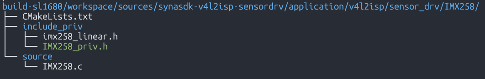
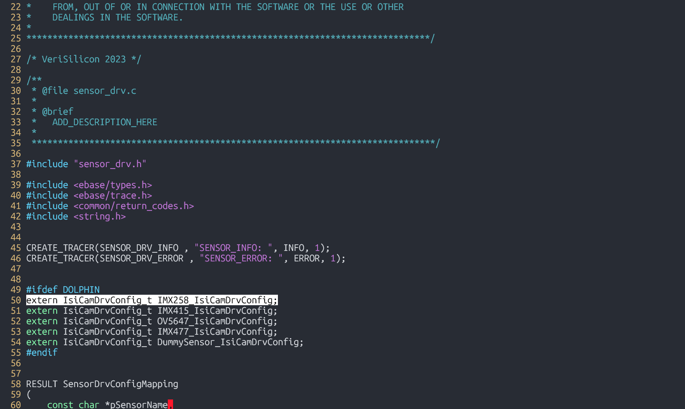
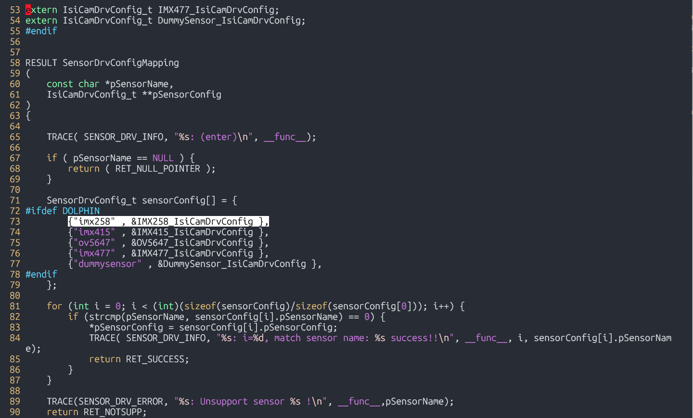
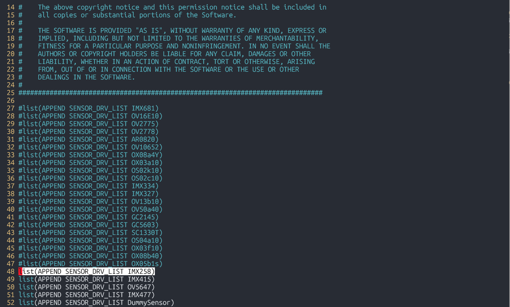
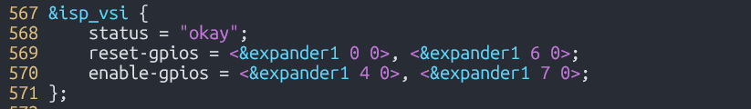
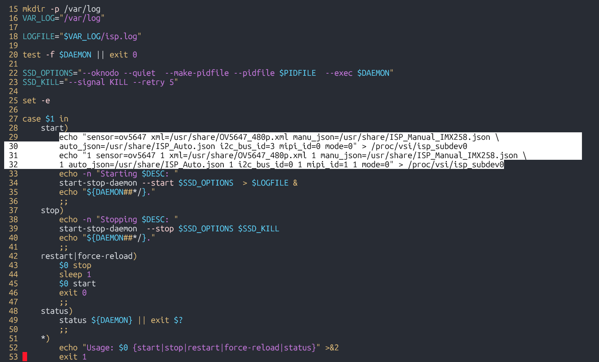

=============================
ISP Sensor Integration Guide
=============================

Introduction
============

This document provides steps to add a new sensor driver to the SL1680. The sensor driver shall be implemented as per Application Programming Interface (API) of the Verisilicon ISP Independent Sensor Interface (ISI) framework. For more details, refer to ISI documentation.

Configuration
======================
Adding a new sensor includes creating necessary directories, adding source and header files, configuring CMake, and updating configuration files. This requires modifying the
``synasdk-v4l2isp-sensordrv`` and ``linux-syna`` packages using ``devtool``::

   devtool modify synasdk-v4l2isp-sensordrv
   devtool modify linux-syna

**Step 1: Create a new directory for the sensor**
Create the new sensor directory with folder structure as shown below. Implementation follows the guideline provided by ISI documentation

**Step 2: Add new sensor to list**
In ``build-sl1680/workspace/sources/synasdk-v4l2isp-sensordrv/sensor_drv.c``, include the extern declaration for the new sensor and add the sensor to the driver list.

**Step 3: Add new sensor to compilation**
Append the new sensor to ‘SENSOR_DRV_LIST’ in ``build-sl1680/workspace/sources/synasdk-v4l2isp-sensordrv/sensor_drv_config.cmake``

**Step 4: Edit kernel DTS file**
Edit ``build-sl1680/workspace/sources/linux-syna/arch/arm64/boot/dts/synaptics/dolphin-rdk.dts`` to configure sensor related enable/reset GPIOs.

**Step 5: Edit runtime configuration**
Edit ``meta-synaptics/recipes-devtools/synasdk/files/isp_media_server.sh`` with sensor name, calibration and tuning JSON files, I2C Bus ID, MIPI index (0/1) and mode (resolution index) selecting required configuration from the list defined in the sensor driver file.

**Step 6: Build new image containing these modifications**

::

   devtool build synasdk-v4l2isp-sensordrv
   devtool build linux-syna
   devtool build-image astra-media