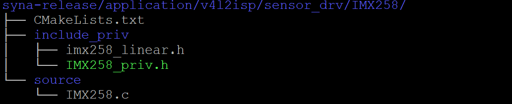
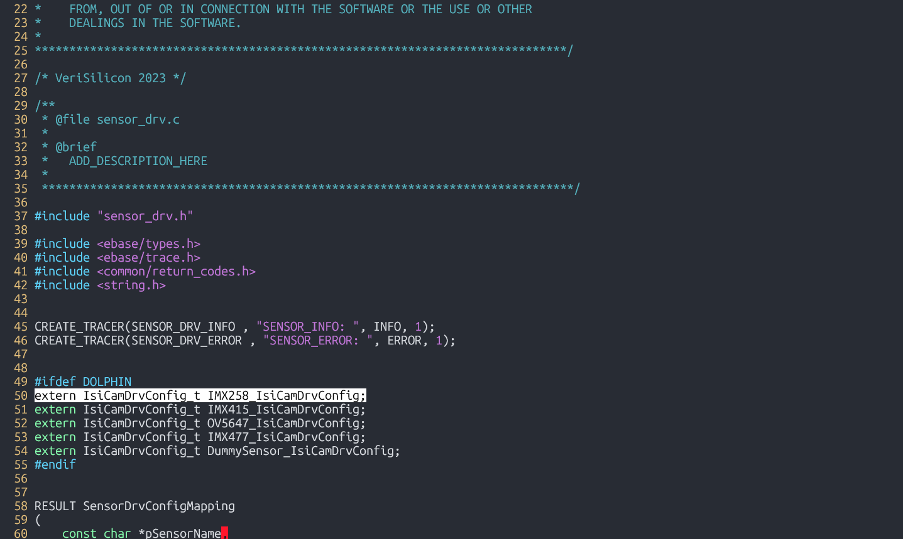
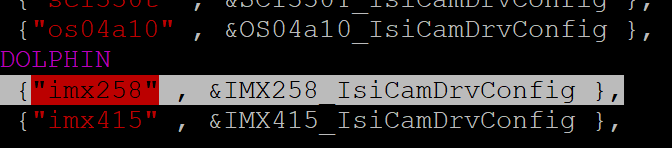
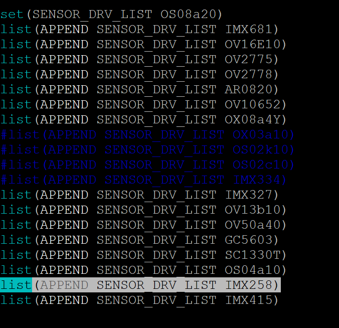
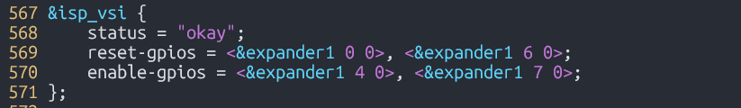
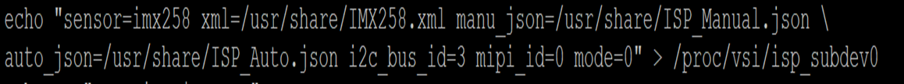
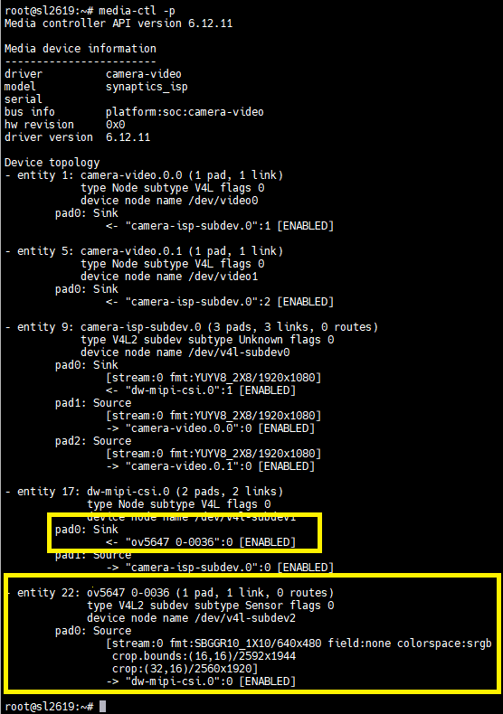

=============================
ISP Sensor Integration Guide
=============================

Introduction
============

This document explains how to add a new sensor driver to the SL1680 and SL2610 platforms. Since the integration process differs between the two, refer to the appropriate section below.

:ref:`sensor_sl1680`

:ref:`sensor_sl2610`

.. _sensor_sl1680:

Sensor Integration on SL1680
----------------------------
The sensor driver shall be implemented as per Application Programming Interface (API) of the Verisilicon ISP Independent Sensor Interface (ISI) framework. For more details, refer to ISI documentation.

Configuration
======================
Adding a new sensor includes creating necessary directories, adding source and header files, configuring CMake, and updating configuration files. This requires modifying the
``synasdk-v4l2isp-sensordrv`` and ``linux-syna`` packages using ``devtool``::

   devtool modify synasdk-v4l2isp-sensordrv
   devtool modify linux-syna

**Step 1: Create a new directory for the sensor**
Create the new sensor directory with folder structure as shown below. Implementation follows the guideline provided by ISI documentation

**Step 2: Add new sensor to list**
In ``build-sl1680/workspace/sources/synasdk-v4l2isp-sensordrv/application/v4l2isp/sensor_drv/sensor_drv.c``, include the extern declaration for the new sensor and add the sensor to the driver list.

**Step 3: Add new sensor to compilation**
Append the new sensor to ‘SENSOR_DRV_LIST’ in ``build-sl1680/workspace/sources/synasdk-v4l2isp-sensordrv/application/v4l2isp/sensor_drv/sensor_drv_config.cmake``

**Step 4: Edit kernel DTS file**
Edit ``build-sl1680/workspace/sources/linux-syna/arch/arm64/boot/dts/synaptics/dolphin-rdk.dts`` or sensor specific device tree overlay, to configure sensor related enable/reset GPIOs.

**Step 5: Edit runtime configuration**
Edit ``meta-synaptics/recipes-devtools/synasdk/files/isp_media_server.sh`` with sensor name, calibration and tuning JSON files, I2C Bus ID, MIPI index (0/1) and mode (resolution index) selecting required configuration from the list defined in the sensor driver file.

**Step 6: Build new image containing these modifications**

::

   devtool build synasdk-v4l2isp-sensordrv
   devtool build linux-syna
   devtool build-image astra-media

.. _sensor_sl2610:

Sensor Integration on SL2610
----------------------------
Any **CSI-compatible sensor** that already includes a **V4L2 subdevice driver** can be integrated directly.
If a V4L2 subdevice driver is not available, you can refer to the *ov5647.c* implementation from the Linux mainline kernel as a guide to create one.

Make sure to enable the sensor driver as a **module** in the ``sl261x_defconfig``

Device Tree Changes
======================
``sl2619-rdk.dts`` file should be changed to match the new sensor specific data. CSI is connected to I2C-0. Therefore, change the  ``i2c0``  device tree node, as explained below.

::

    &i2c0 {
        cam_node: ov5647@36 {
            compatible = "ovti,ov5647";
            reg = <0x36>;
            status = "okay";

            pwdn-gpios = <&expander1 4 GPIO_ACTIVE_LOW>;
            clocks = <&osc>;

            port {
                cam_endpoint: endpoint {
                    clock-lanes = <0>;
                    data-lanes = <1 2>;
                    clock-noncontinuous;
                    remote-endpoint = <&csi_input>;
                };
            };
        };
    };

Update the ``cam_node`` to use the new sensor's ``compatible`` string and ``reg`` value (I2C slave address). Also adjust the ``clocks`` property to reflect the correct clock source for the sensor.

The ``port`` node defines the data path. The ``remote-endpoint`` specifies that sensor data enters the CSI driver through the ``csi_input`` port of the CSI node. This does not need to be modified.

However, properties such as ``clock-lanes``, ``data-lanes``, and ``clock-noncontinuous`` may need to be updated depending on the sensor, as these values vary between different devices.

Expected Result
---------------

Correct sensor integration is confirmed if the ``media-ctl -p`` command shows an entry similar to this:

