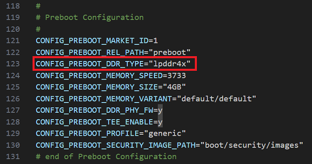
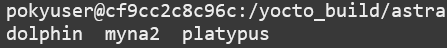
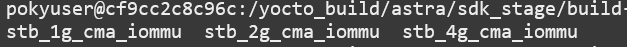
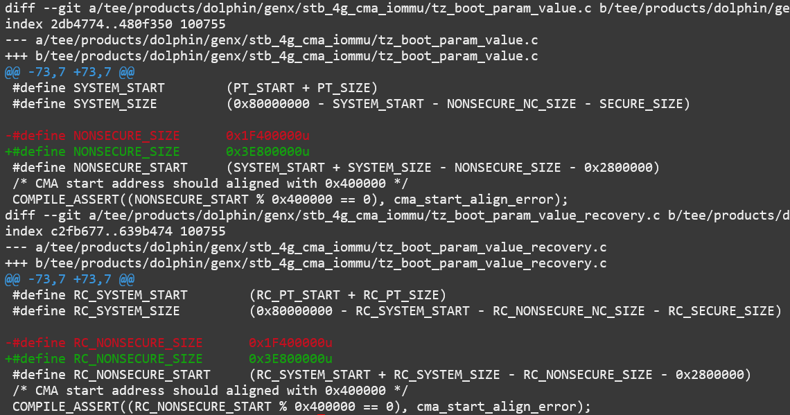

============================================
Memory Layout Customization on Astra Machina
============================================

Astra Machina uses DRAM for several components in the SoC. The DRAM is divided up into several sections
depending on what it is used for. These sections include System memory, NonSecure (CMA), NonSecure (non-cached),
and Secure memory. System memory is the memory available to the Linux kernel. Included in System memory
is the NonSecure section which is used by the kernel for CMA. Secure memory is reserved for when the SoC
is operating secure environments such as TrustZone, and is not accessible to Linux. The NonSecure
(non-cached) section is reserved for SoC components which require non-cached memory.

Memory Layouts
--------------

Astra Machina supports predefined memory layouts for various DDR configurations. The default configuration
can be changed based on the amount of DDR in the system.

======== ============== ================
Chip     Default Memory Supported Memory
======== ============== ================
SL1620   2GB            1GB / 2GB / 4GB
SL1640   2GB            2GB / 4GB
SL1680   4GB            2GB / 4GB
======== ============== ================

Below are the memory layouts for all available DDR sizes.

SL1620 Memory Layout
^^^^^^^^^^^^^^^^^^^^

+-------------------+------------------------+----------------------------+
| Memory Size       | Memory Section         | Size                       |
+-------------------+------------------------+----------------------------+
| 1 GB DDR          | NonSecure (CMA)        | 64MB                       |
|                   +------------------------+----------------------------+
|                   | System                 | 930MB                      |
|                   +------------------------+----------------------------+
|                   | NonSecure (Non-cached) | 4MB                        |
|                   +------------------------+----------------------------+
|                   | Secure                 | 16MB                       |
+-------------------+------------------------+----------------------------+
| 2 GB DDR          | NonSecure (CMA)        | 512MB                      |
|                   +------------------------+----------------------------+
|                   | System                 | 1.950GB                    |
|                   +------------------------+----------------------------+
|                   | NonSecure (Non-cached) | 8MB                        |
|                   +------------------------+----------------------------+
|                   | Secure                 | 16MB                       |
+-------------------+------------------------+----------------------------+
| 4 GB DDR          | NonSecure (CMA)        | 64MB                       |
|                   +------------------------+----------------------------+
|                   | System                 | 3.482GB                    |
|                   +------------------------+----------------------------+
|                   | NonSecure (Non-cached) | 8MB                        |
|                   +------------------------+----------------------------+
|                   | Secure                 | 16MB                       |
+-------------------+------------------------+----------------------------+

SL1640 Memory Layout
^^^^^^^^^^^^^^^^^^^^

+-------------------+------------------------+----------------------------+
| Memory Size       | Memory Section         | Size                       |
+-------------------+------------------------+----------------------------+
| 2 GB DDR          | NonSecure (CMA)        | 260MB                      |
|                   +------------------------+----------------------------+
|                   | System                 | 1.948GB                    |
|                   +------------------------+----------------------------+
|                   | NonSecure (Non-cached) | 8MB                        |
|                   +------------------------+----------------------------+
|                   | Secure                 | 16MB                       |
+-------------------+------------------------+----------------------------+
| 4 GB DDR          | NonSecure (CMA)        | 500MB                      |
|                   +------------------------+----------------------------+
|                   | System                 | 3.482GB                    |
|                   +------------------------+----------------------------+
|                   | NonSecure (Non-cached) | 8MB                        |
|                   +------------------------+----------------------------+
|                   | Secure                 | 16MB                       |
+-------------------+------------------------+----------------------------+

SL1680 Memory Layout
^^^^^^^^^^^^^^^^^^^^

+-------------------+------------------------+----------------------------+
| Memory Size       | Memory Section         | Size                       |
+-------------------+------------------------+----------------------------+
| 2 GB DDR          | NonSecure (CMA)        | 260MB                      |
|                   +------------------------+----------------------------+
|                   | System                 | 1.948GB                    |
|                   +------------------------+----------------------------+
|                   | NonSecure (Non-cached) | 8MB                        |
|                   +------------------------+----------------------------+
|                   | Secure                 | 16MB                       |
+-------------------+------------------------+----------------------------+
| 4 GB DDR          | NonSecure (CMA)        | 500MB                      |
|                   +------------------------+----------------------------+
|                   | System                 | 3.482GB                    |
|                   +------------------------+----------------------------+
|                   | NonSecure (Non-cached) | 8MB                        |
|                   +------------------------+----------------------------+
|                   | Secure                 | 16MB                       |
+-------------------+------------------------+----------------------------+

.. note::

    NonSecure (CMA) memory sections can be used as system memory when CMA is not needed. System
    memory's size includes the size of the NonSecure (CMA) section.

Changing Memory Parameters
--------------------------

The memory parameters are set in the configuration file included in the ``synasdk-config-native`` package. Use the ``devtool`` utility to
modify the config file::

    devtool modify synasdk-config-native

The ``devtool`` utility will create the ``build-sl1680/workspace/sources/synasdk-config-native/configs/product`` directory which will contain the source for
the config package. In the product directory is a subdirectory containing a config file for each of the  platforms. Edit the config file for the platform which
you are building for.

Changing the Memory Layout
^^^^^^^^^^^^^^^^^^^^^^^^^^

To change the memory layout, set the ``CONFIG_TZK_MEM_LAYOUT`` parameter to the layout which matches the DDR on your board. The supported memory layouts are listed
below in the ``CONFIG_TZK_SUPPORTED_MEM_LAYOUT`` parameter.

For example, to change the memory layout for SL1620, edit ``sl1620_poky_aarch64_rdk/sl1620_poky_aarch64_rdk_defconfig``.

.. figure:: media/sl1620-config-mem-layout.png

For SL1640 ``sl1640_poky_aarch64_rdk/sl1640_poky_aarch64_rdk_defconfig`` and SL1680 ``sl1680_poky_aarch64_rdk/sl1680_poky_aarch64_rdk_defconfig``

.. figure:: media/sl1680-config-mem-layout.png

Changing the Preboot Memory Size
^^^^^^^^^^^^^^^^^^^^^^^^^^^^^^^^

The ``CONFIG_PREBOOT_MEMORY_SIZE`` parameter sets the memory size which the preboot firmware will use. Set this parameter to the size of the DDR being used.

To change the preboot memory size, set ``CONFIG_PREBOOT_MEMORY_SIZE`` parameter. For example, to change the memory layout for SL1620,
edit ``sl1620_poky_aarch64_rdk/sl1620_poky_aarch64_rdk_defconfig``.

For SL1640 ``sl1640_poky_aarch64_rdk/sl1640_poky_aarch64_rdk_defconfig`` and SL1680 ``sl1680_poky_aarch64_rdk/sl1680_poky_aarch64_rdk_defconfig``

Changing the DDR Type
^^^^^^^^^^^^^^^^^^^^^

The default DDR type can also be changed in the config file. To change the preboot DDR type, set ``CONFIG_PREBOOT_DDR_TYPE`` parameter. For example, to change the memory layout for SL1620,
edit ``sl1620_poky_aarch64_rdk/sl1620_poky_aarch64_rdk_defconfig``.

For SL1640 ``sl1640_poky_aarch64_rdk/sl1640_poky_aarch64_rdk_defconfig`` and SL1680 ``sl1680_poky_aarch64_rdk/sl1680_poky_aarch64_rdk_defconfig``

`Supported DDR types for SL1620 <https://github.com/synaptics-astra/boot-preboot-prebuilts/tree/v#release#/myna2/A0/generic/hwinit>`__

`Supported DDR types for SL1640 <https://github.com/synaptics-astra/boot-preboot-prebuilts/tree/v#release#/platypus/A0/generic/hwinit>`__

`Supported DDR types for SL1680 <https://github.com/synaptics-astra/boot-preboot-prebuilts/tree/v#release#/dolphin/A0/generic/hwinit>`__

Finally, build an image with the modified memory layout::

    devtool build synasdk-config-native
    devtool build-image astra-media

Modifying U-Boot
^^^^^^^^^^^^^^^^

By default, U-Boot uses a default memory layout of 2GB. Using the 1GB memory layout on SL1620 requires modifying U-Boot. Since SL1640 and SL1680
do not support a 1GB memory layout, no modification is required on these platforms.

Use the ``devtool`` utility to checkout the U-Boot source code. However, the syna-u-boot recipe is not fully compatible with ``devtool``. As a
result, some changes to the recipe and build steps are required. First, remove the ``file://0001-Force-gcc-as-HOSTCC.patch`` patch from the ``SRC_URI``
entry in ``meta-synaptics/recipes-bsp/syna-bootloader/syna-u-boot_git.bb``::

    diff --git a/recipes-bsp/syna-bootloader/syna-u-boot_git.bb b/recipes-bsp/syna-bootloader/syna-u-boot_git.bb
    index 6a0fe87..0521d1e 100644
    --- a/recipes-bsp/syna-bootloader/syna-u-boot_git.bb
    +++ b/recipes-bsp/syna-bootloader/syna-u-boot_git.bb
    @@ -35,7 +35,6 @@ SRC_URI = " \
        ${SYNA_SRC_BOOT} \
        ${SYNA_SRC_UBOOT} \
        ${SYNA_SRC_EXTERNAL} \
    -    file://0001-Force-gcc-as-HOSTCC.patch \
    "

    SRCREV_uboot = "${SYNA_SRCREV_UBOOT}"

Next, use the ``devtool`` utility to modify the source code.::

    devtool modify syna-u-boot

The U-Boot source code has now been checkout out under ``build-sl1620/workspace/sources/syna-u-boot``. Manually,
apply the patch which was removed from the recipe::

    cd build-sl1620/workspace/sources/syna-u-boot
    git apply ../../../../meta-synaptics/recipes-bsp/syna-bootloader/syna-u-boot/0001-Force-gcc-as-HOSTCC.patch

Change the memory size to 1GB in ``build-sl1620/workspace/sources/syna-u-boot/boot/u-boot_2019_10/arch/arm/dts/myna2-rdk.dts``::

    diff --git a/arch/arm/dts/myna2-rdk.dts b/arch/arm/dts/myna2-rdk.dts
    index d6a160450e..36464c9202 100644
    --- a/arch/arm/dts/myna2-rdk.dts
    +++ b/arch/arm/dts/myna2-rdk.dts
    @@ -33,7 +33,7 @@

        memory {
            device_type = "memory";
    -		reg = <0 0 0 0x80000000>;
    +		reg = <0 0 0 0x40000000>;
        };

        chosen {

Set the malloc length in ``build-sl1620/workspace/sources/syna-u-boot/boot/u-boot_2019_10/include/configs/myna2.h`` to 500MB. 500MB is the recommended
value for the 1GB profile.::

    diff --git a/include/configs/myna2.h b/include/configs/myna2.h
    index e7750403c2..ee714094e0 100644
    --- a/include/configs/myna2.h
    +++ b/include/configs/myna2.h
    @@ -47,7 +47,7 @@
    #define CONFIG_SYS_AUTOLOAD		"n"			/* disable autoload image via tftp after dhcp */

    //max malloc length
    -#define CONFIG_SYS_MALLOC_LEN		(1450 << 20)
    +#define CONFIG_SYS_MALLOC_LEN		(500 << 20)

    //#define CONFIG_SYS_MALLOC_F_LEN		(4 << 20) /* Serial is required before relocation */

Build the modified ``syna-u-boot`` package using ``bitbake``::

    bitbake -f syna-u-boot -c compile

After rebuilding the modified package, build an image which contains the u-boot modifications using bitbake.::

    bitbake -f astra-media -c compile
    bitbake -f astra-media

Modifying the Memory Layout
---------------------------

The memory sections within a memory layout can also be modified. The amount of memory reserved for secure memory and CMA can be optimized for
specific use cases. The memory layout is defined in OP-TEE and can be modified by editing the ``synasdk-tee-bootparam-native`` package.

.. note::

    Memory layouts cannot be modified in previous releases. Before v1.3.0, OP-TEE required Synaptics to sign the OP-TEE image.
    Release v1.3.0 and later, no longer require Synaptics to sign OP-TEE.

To update the memory layout in the ``synasdk-tee-bootparam-native`` package::

    devtool modify synasdk-tee-bootparam-native

The ``devtool`` utility will create the ``build-sl1680/workspace/sources/synasdk-tee-bootparam-native/tee/tee/products/`` directory. This directory contains
three directories for each of the platforms. These directories include dolphin (sl1680), platypus (sl1640), and myna2 (sl1620). Each platform specific directory
contains directories for each of the supported DDR sizes.

    Chip Specific directories in synasdk-tee-bootparam-native

    SL1640 layout directories

.. figure:: media/tee-platypus-2gb-layout.png

    SL1640 2GB memory layout files

The memory layout directory contains two files which need to be updated in order to change the memory section size. The files ``tz_boot_param_value.c``and
``tz_boot_param_value_recovery.c``. Macros define the sizes of the memory sections in the ``tz_boot_param_value*.c`` files. Update
the values to change the size of the memory sections.

.. note::

    Memory section changes should be made to both ``tz_boot_param_value.c`` and ``tz_boot_param_value_recovery.c``.

.. figure:: media/sl1680-boot-param.png

Here is an example of resizing SL1680's CMA section to 1GB.

    Modifications made to SL1680's 4GB memory layout to double the CMA section

Finally, build an image with the modified memory sections::

    devtool build synasdk-tee-bootparam-native
    devtool build-image astra-media