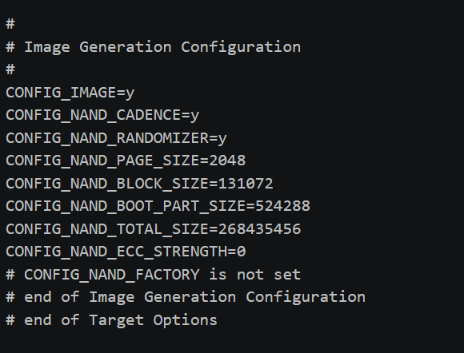
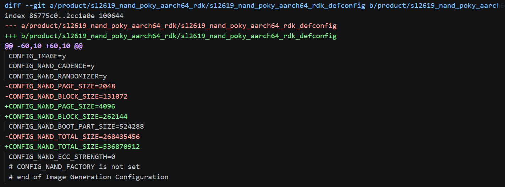
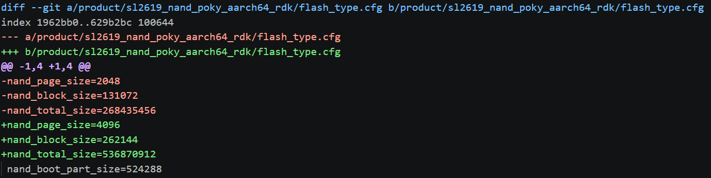
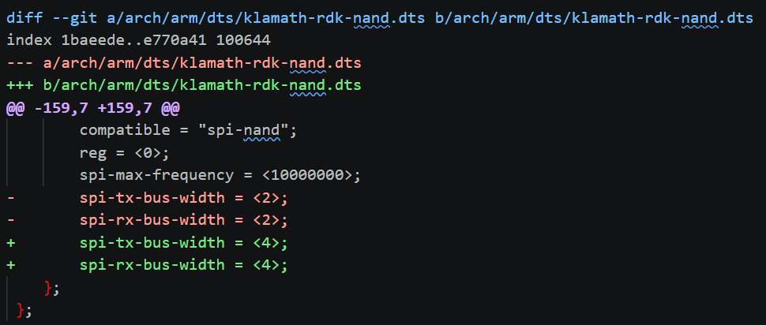
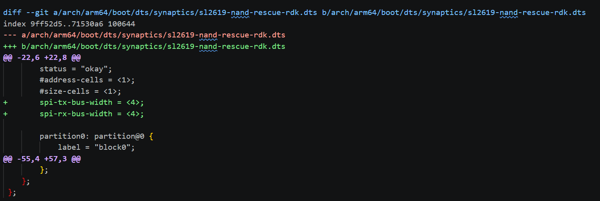

==================
NAND Customization
==================

Astra supports using NAND for the main internal storage with SL2610. The machine types ``sl2611nand``, ``sl2615nand``, and ``sl2619nand`` are configured to use a default 256MB SPI NAND (2K page size).
However, other NAND configurations can be used. This guide details how to modify the SDK to use different NAND configurations.

Changing the NAND Configuration
===============================

The NAND configuration is included in the `synasdk-config-native`` package. Use the ``devtool`` utility to
modify the config file::

    devtool modify synasdk-config-native

The ``devtool`` utility will create the ``build-sl2619nand/workspace/sources/synasdk-config-native/configs/product`` directory which will contain the source for
the config package. In the product directory is a subdirectory containing a config file for each of the  platforms. Modify the files
based on the sections below.

Changing the NAND Size
----------------------

The NAND configuration is defined in the ``Image Generation Configuration`` of the profile ``defconfig`` file.

    Image Generation Configuration section of the defconfig

Update the sizes for your specific NAND. For example, switching to a 512MB (4K) NAND wou

    Patch updating sizes in ``sl2619_nand_poky_aarch64_rdk_defconfig``.

Changing Partition Sizes
------------------------

The NAND partition layout is set in the ``nand.pt`` file.

    Updating the NAND Flash Type Configuration

Changing the Flash Type Configuration
-------------------------------------

The Flash Type configuration is stored in ``flash_type.cfg`` file.

    Updating the NAND Flash Type Configuration

Changing the NAND Width
-----------------------

Updating the NAND Width in U-Boot
^^^^^^^^^^^^^^^^^^^^^^^^^^^^^^^^^

The NAND width is configured in the Linux and U-Boot devicetree . The default width is ``2``
for a Dual SPI Configuration. Update the dts file widths to ``4`` for Quad SPI Configuration.

The NAND U-Boot devicetree is included in the ``syna-u-boot`` package. Use the ``devtool`` utility to
modify the config file::

    devtool modify syna-u-boot

The ``devtool`` utility will create the ``build-sl2619nand/workspace/sources/syna-u-boot/boot/u-boot`` directory which will contain the source for

Modify the ``spi-tx-bus-width`` and ``spi-rx-bus-width`` in ``arch/arm/dts/klamath-rdk-nand.dts``.

    Updating the NAND Width in Device Tree

Updating the NAND Width in Linux
^^^^^^^^^^^^^^^^^^^^^^^^^^^^^^^^

The NAND Linux devicetree is included in the ``linux-syna`` package. Use the ``devtool`` utility to
modify the config file::

    devtool modify linux-syna

The ``devtool`` utility will create the ``build-sl2619nand/workspace/sources/linux-syna`` directory which will contain the source for

Modify the ``spi-tx-bus-width`` and ``spi-rx-bus-width`` in ``arch/arm64/boot/dts/synaptics/sl2619-nand-rescue-rdk.dts``.

    Updating the NAND Width in Device Tree

Building the Updated Image
==========================

Finally, build an image with the modified NAND configuration::

    bitbake -f synasdk-config-native
    bitbake -f syna-u-boot -c compile
    bitbake -f linux-syna -c compile
    bitbake -f astra-media -c compile
    bitbake -f astra-media

The custom NAND image will be output to ``/path/to/workspace/sdk/build-sl2619nand/tmp/sl2619nand/deploy/images/sl2619nand/SYNAIMG/uNAND_full.img`` or something
similar based on the name of the machine type.

USB Boot with NAND support
==========================

You will also need to build a USB boot image with support for your NAND device in order to flash your
custom NAND image over USB.

Building a custom USB boot image with NAND support
--------------------------------------------------

Please follow the instructions in :ref:`building_custom_usb_boot_images` and
apply the appropriate NAND configuration.

The custom USB NAND image will be output to ``/path/to/workspace/sdk/build-sl2619usb/tmp/sl2619usb/deploy/images/sl2619usb/SYNAIMG`` or something
similar based on the name of the machine type.

Flashing the NAND image
-----------------------

Flashing the NAND image over USB uses the ``astra-boot`` tool which is part of the ``usb-tool`` / ``astra-update`` package. Information
on downloading the tool can be found in the user guide at :ref:`firmware_update_usb`.

Flashing the NAND image also requires a serial console to input commands at the U-Boot prompt. The user guide also has instructions
for setting up the serial console at :ref:`setup_serial_console`.

Unlike flashing eMMC or SPI images, flashing the NAND image requires booting over USB using the ``astra-boot`` tool.

First copy the USB boot image generated in the previous section to the ``usb-tool`` directory.

Second copy the ``uNAND_full.img`` to the USB boot ``SYNAIMG`` directory. ``astra-boot`` will load the image from this directory.

Finally, boot the device using ``astra-boot``.

::

    ./bin/linux/astra-boot -k SYNAIMG

::

    .\bin\win\astra-boot.exe -k SYNAIMG

The device will boot to the U-Boot prompt (``=>``). At the U-Boot prompt enter the following commands.

::

    usbload uNAND_full.img 0x10000000
    m2nand 0x10000000

This will load the ``uNAND_full.img`` image to address ``0x10000000`` and then program it to the NAND. U-Boot will
return to the prompt when the operation is complete. Then you may reboot the device.