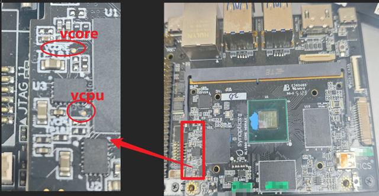

===========================
Configuring PMIC for PVComp
===========================

Astra SDK scarthgap_6.12_v2.2 adds support for configuring Power-Voltage Compensation (PVComp) based on the PMIC
and Leakage ID. PVComp will adjust the voltages on VCORE and VCPU accordingly. PVComp is implemented in the miniloader
for all PMICs supported by our QVL list. The PMIC must be set in the Astra SDK config when building custom boards. This
guide covers configuring the PMIC and validating the PVComp functionality.

Validating PVComp from Serial Console Logs
==========================================

The Astra Machina RDK board will print the following when the configured PMIC is detected.

::

    Miniloader: tz loader! boot_type(0)
    PMIC: Try...
    PMIC: VCORE tps6287x (ID: 0x0a), VCPU tps6287x (ID: 0x0a) I2C PMIC detected
    set Vcpu from 800000uv to 815000uv
    set Vcore from 800000uv to 825000uv

Then set VCORE and VCPU based on the Leakage ID.

::

    RKEK_ID (byte[0:7]) = 0000000000000000
    ULT (byte[0:7])     = 4316ebb236e191b5
    Leakage ID = 1609
    SOCTSEN ID = 105

If the configured PMIC is not detected then the output will look like:

::

    PMIC: Try...
    PMIC: Invalid magic number 0x00000000, expected 0x504d4943
    PMIC: unknown PMIC model
    PMIC: Try again...

Configuring PMIC in Astra SDK configuration
===========================================

The PMIC is configured in the Astra SDK configution file for the board. Set ``CONFIG_PMIC_MODE_I2C`` to ``y`` and
set ``CONFIG_VCORE_PMIC_MODEL`` and ``CONFIG_VCPU_PMIC_MODEL`` to the name of the PMIC from the QVL being used.

::

    #
    # Preboot Configuration
    #
    # CONFIG_PREBOOT_MEMORY_MULTIPLE is not set
    CONFIG_PMIC_MODE_I2C=y
    # CONFIG_PMIC_MODE_PWM is not set
    CONFIG_VCORE_PMIC_MODEL="tps6287x"
    CONFIG_VCPU_PMIC_MODEL="tps6287x"
    # end of Preboot Configuration

.. note:: 
    
    Valid PMIC models are ``m88pg86x``, ``sy8824b``, ``ncp6335d``, ``mp886x``, ``sy8827n``,
    ``hl7593wl06``, ``tps62868``, ``rt5739``, ``fp6359`` and ``tps6287x``.

Validating Functionality
========================

In addition to the log statements, you can also validate the change using a digital multimeter to measure the voltage using the
voltage measurement points.

Start by setting the voltage to the maximum value. Run the following command from the Linux prompt.

::

    MAX=$(cat /sys/devices/system/cpu/cpu0/cpufreq/cpuinfo_max_freq)
    echo $MAX > /sys/devices/system/cpu/cpu0/cpufreq/scaling_min_freq
    echo $MAX > /sys/devices/system/cpu/cpu0/cpufreq/scaling_min_freq

Observe that the voltage reading on the multimeter shows the maximum voltages.

Next, reboot the system and observe the voltages when the miniloader sets the voltages based on the leakage ID. The voltages should change accordingly.

::

    PMIC: Try...
    PMIC: VCORE tps6287x (ID: 0x0a), VCPU tps6287x (ID: 0x0a) I2C PMIC detected
    set Vcpu from 900000uv to 750000uv
    Vcore is 850000uV, default setting by hardware.

    Voltage Measurement Points on SL1680