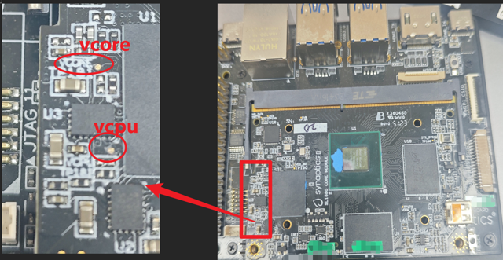

===================================================
PMIC PV Compensation Configuration in Preboot Guide
===================================================

This document provides a guide for configuring the Power Management
Integrated Circuit (PMIC) in the VSSDK environment. This guide only
supports SL16xx chips. The PMIC configuration defines how the system
regulates CORE and CPU voltages during Preboot.

**Audience:** Customers and integrators who need to configure PMIC
behavior in Preboot without modifying source code.

PMIC mode selection
===================

The first step is to select the PMIC control interface supported by the
hardware design. In the product defconfig, enable one of the following
modes.

+--------------------------------+-------------------------------------+
| **Macro**                      | **Description**                     |
+================================+=====================================+
| CONFIG_PMIC_IF_I2C=y           | Controls the PMIC through the I2C   |
|                                | bus using model-specific drivers.   |
+--------------------------------+-------------------------------------+
| CONFIG_PMIC_IF_PWM=y           | Controls regulator voltage through  |
|                                | PWM duty cycle.                     |
+--------------------------------+-------------------------------------+
| └─CON                          | For PWM mode, uses the SM Timer     |
| FIG_PMIC_PWM_BACKEND_SMTIMER=y | block to generate PWM.              |
+--------------------------------+-------------------------------------+
| └                              | For PWM mode, uses the SOC PWM      |
| ─CONFIG_PMIC_PWM_BACKEND_PWM=y | controller, also referred to as     |
|                                | Typical PWM.                        |
+--------------------------------+-------------------------------------+
| CONFIG_PMIC_IF_AUTO=y          | Auto-detection mode. Identifies     |
|                                | several possible I2C PMICs based on |
|                                | GPIO strap pins.                    |
+--------------------------------+-------------------------------------+

Detailed configuration modes
============================

I2C PMIC mode
-------------

Use this mode when the PMIC is regulated through I2C commands, for
example tps62868 or sy8827n.

Key parameters
~~~~~~~~~~~~~~

-  ``CONFIG_VCORE_PMIC_MODEL``: Model name of the PMIC supplying VCORE. It
   must match an entry in pmic_models. Here is the candidate PMICs:

::

    ( ) None
    ( ) m88pg86x
    ( ) sy8824b
    ( ) ncp6335d
    ( ) mp886x
    ( ) sy8827n
    ( ) hl7593wl06
    ( ) tps62868
    ( ) rt5739
    ( ) pwm_pmic
    (X) tps6287x
    ( ) rt5733
    ( ) smtimer

-  ``CONFIG_VCPU_PMIC_MODEL``: Model name for VCPU. This may be empty if
   VCORE and VCPU share the same rail. Candidate PMICs: same as above.

-  ``CONFIG_VCORE_PMIC_I2CCH``: Display name of the I2C bus. Here is the
   candidate I2C bus:

::

    ( ) NONE
    ( ) TW0
    ( ) TW1
    ( ) TW1A
    ( ) TW1B
    (X) TW2
    ( ) TW2A
    ( ) TW2B
    ( ) TW3
    ( ) TW3A
    ( ) TW3B

-  ``CONFIG_VCORE_PMIC_I2CCH_NUM``: Numeric I2C bus index, usually
   auto-generated from the bus name.

Example
~~~~~~~

::

    CONFIG_PMIC_IF_I2C=y
    CONFIG_VCORE_PMIC_MODEL="tps62868"
    CONFIG_VCPU_PMIC_MODEL=""
    CONFIG_VCORE_PMIC_I2CCH="TW2"
    CONFIG_VCORE_PMIC_I2CCH_NUM=4

PWM PMIC mode
-------------

Use this mode when the regulator output voltage is controlled by the
duty cycle of a PWM signal.

In PWM PMIC mode, Preboot converts the target voltage into a PWM duty
value by linear interpolation between two calibration points:
``(VOLT_MIN_UV, DUTY_AT_VOLT_MIN)`` and ``(VOLT_MAX_UV, DUTY_AT_VOLT_MAX)``.

The PWM signal is typically filtered by an RC low-pass filter and then
connected into the buck regulator feedback network. Because of this, the
voltage-to-duty relationship is board-specific and depends on the
schematic, resistor values, PWM polarity, and component tolerances.

PWM backend selection
~~~~~~~~~~~~~~~~~~~~~

When ``CONFIG_PMIC_IF_PWM=y`` is selected, one PWM backend must also be
selected.

+---------------------------------------+---------------------------+----------+
| **Backend macro**                     | **Description**           | **Co     |
|                                       |                           | ntroller |
|                                       |                           | clock**  |
+=======================================+===========================+==========+
| ``CONFIG_PMIC_PWM_BACKEND_PWM=y``     | Uses the SOC PWM          | 100 MHz  |
|                                       | controller, also referred |          |
|                                       | to as Typical PWM.        |          |
+---------------------------------------+---------------------------+----------+
| ``CONFIG_PMIC_PWM_BACKEND_SMTIMER=y`` | Uses the SM Timer block   | 25 MHz   |
|                                       | in PWM mode.              |          |
+---------------------------------------+---------------------------+----------+

PWM controller clock and output frequency
~~~~~~~~~~~~~~~~~~~~~~~~~~~~~~~~~~~~~~~~~

For SL1680, SL1640, and SL1620, the PWM controller clock frequencies are
as follows.

+------------+---------------------------+---------------------------------+
| **Chip**   | **SOC PWM controller      | **SM Timer PWM clock**          |
|            | clock**                   |                                 |
+============+===========================+=================================+
| SL1680     | 100 MHz                   | 25 MHz                          |
|            |                           |                                 |
+------------+---------------------------+---------------------------------+
| SL1640     | 100 MHz                   | 25 MHz                          |
|            |                           |                                 |
+------------+---------------------------+---------------------------------+
| SL1620     | 100 MHz                   | --(No SM Timer PWM in SL1620)   |
|            |                           |                                 |
+------------+---------------------------+---------------------------------+

.. note::

    **Important:** These are the input clocks of the PWM generators, not the
    final PWM output frequency seen on the pin.

The actual PWM output frequency is configured by
``CONFIG_VCORE_PWM_FREQ_HZ`` and ``CONFIG_VCPU_PWM_FREQ_HZ``.

::

    SOC PWM:
        controller clock = 100 MHz
        CONFIG_VCORE_PWM_FREQ_HZ = 100000 (typical PWM output frequency = 100kHz)
        terminal count = 100000000 / 100000 = 1000

    SM Timer PWM:
        controller clock = 25 MHz
        CONFIG_VCORE_PWM_FREQ_HZ = 100000 (typical PWM output frequency = 100kHz)
        terminal count = 25000000 / 100000 = 250
        actual PWM output frequency = 100 kHz

Both backends can generate the same output frequency, but their
duty-cycle resolution is different because their controller clocks are
different.

+--------------+--------------+------------------------+--------------+
| **Backend**  | **Controller | **Terminal count at    | **Duty       |
|              | clock**      | 100 kHz**              | resolution** |
+==============+==============+========================+==============+
| SOC PWM      | 100 MHz      | 1000                   | 1 / 1000     |
+--------------+--------------+------------------------+--------------+
| SM Timer PWM | 25 MHz       | 250                    | 1 / 250      |
+--------------+--------------+------------------------+--------------+

.. note:: 
    
    **Recommendation:** For regulator control, SOC PWM is preferred when
    available because it provides better duty-cycle resolution. SM Timer PWM
    should be used only when the board routes the regulator control signal
    to an SM Timer output pin.

.. _key-parameters-1:

Key parameters
~~~~~~~~~~~~~~

+---------------------------------------+---------------------------------------+
| **Parameter**                         | **Description**                       |
+=======================================+=======================================+
| ``CONFIG_VCORE_PWM_GPIO``\*           | GPIO pin number used for the VCORE    |
|                                       | PWM signal.                           |
+---------------------------------------+---------------------------------------+
| ``CONFIG_VCPU_PWM_GPIO``              | GPIO pin number used for the VCPU PWM |
|                                       | signal. Leave empty or set to none if |
|                                       | unused.                               |
+---------------------------------------+---------------------------------------+
| ``CONFIG_VCORE_PWM_FREQ_HZ``          | Desired PWM output frequency in       |
|                                       | Hertz. A typical value is 100000 for  |
|                                       | 100 kHz.                              |
+---------------------------------------+---------------------------------------+
| ``CONFIG_VCPU_PWM_FREQ_HZ``           | Desired PWM output frequency in       |
|                                       | Hertz. A typical value is 100000 for  |
|                                       | 100 kHz.                              |
+---------------------------------------+---------------------------------------+
| ``CONFIG_VCORE_PWM_POLARITY``         | PWM polarity for VCORE. 0 means       |
|                                       | normal or non-inverted. 1 means       |
|                                       | inverted.                             |
+---------------------------------------+---------------------------------------+
| ``CONFIG_VCPU_PWM_POLARITY``          | PWM polarity for VCPU. 0 means normal |
|                                       | or non-inverted. 1 means inverted.    |
+---------------------------------------+---------------------------------------+
| ``CONFIG_VCORE_PWM_VOLT_MIN_UV``      | Minimum VCORE output voltage in       |
|                                       | microvolts.                           |
+---------------------------------------+---------------------------------------+
| ``CONFIG_VCORE_PWM_VOLT_MAX_UV``      | Maximum VCORE output voltage in       |
|                                       | microvolts.                           |
+---------------------------------------+---------------------------------------+
| ``CONFIG_VCPU_PWM_VOLT_MIN_UV``       | Minimum VCPU output voltage in        |
|                                       | microvolts.                           |
+---------------------------------------+---------------------------------------+
| ``CONFIG_VCPU_PWM_VOLT_MAX_UV``       | Maximum VCPU output voltage in        |
|                                       | microvolts.                           |
+---------------------------------------+---------------------------------------+
| ``CONFIG_VCORE_PWM_DUTY_AT_VOLT_MIN`` | Duty value corresponding to           |
|                                       | ``CONFIG_VCORE_PWM_VOLT_MIN_UV``.     |
+---------------------------------------+---------------------------------------+
| ``CONFIG_VCORE_PWM_DUTY_AT_VOLT_MAX`` | Duty value corresponding to           |
|                                       | ``CONFIG_VCORE_PWM_VOLT_MAX_UV``.     |
+---------------------------------------+---------------------------------------+
| ``CONFIG_VCPU_PWM_DUTY_AT_VOLT_MIN``  | Duty value corresponding to           |
|                                       | ``CONFIG_VCPU_PWM_VOLT_MIN_UV``.      |
+---------------------------------------+---------------------------------------+
| ``CONFIG_VCPU_PWM_DUTY_AT_VOLT_MAX``  | Duty value corresponding to           |
|                                       | ``CONFIG_VCPU_PWM_VOLT_MAX_UV``.      |
+---------------------------------------+---------------------------------------+

CONFIG\_*_PWM_GPIO Configuration Rules:

Since a PWM channel can be mapped to different pads, the unique GPIO
number identifies the pin connected to the PMIC PWM signal and
determines the PWM channel configuration. Refer to the board schematic
and PMIC datasheet for the PWM GPIO connection.

::

    - SoC GPIO:
        Enter the GPIO number directly.

    - SM GPIO:
        Set bit[31:30] to 2'b10 and place the SM GPIO number
        in bits[29:0].

    - GPIO-X:
        Set bit[31:30] to 2'b01 and place the GPIO_X number
        in bits[29:0].

    Examples:
    SoC GPIO 15:
        0xf

    SM GPIO 3:
        0x80000003

       
    GPIO_X10:
        0x4000000A

.. note::
    
    **Matched parameters:** ``PWM_POLARITY``, ``DUTY_AT_VOLT_MIN``, and
    ``DUTY_AT_VOLT_MAX`` must be treated as a matched set. If polarity changes,
    both duty endpoints must be re-measured. Besides, the duty endpoints
    must be measured and should be matched to ``VOLT_MIN_UV`` and ``VOLT_MAX_UV``

.. _example-1:

Example
~~~~~~~

**SL1620 SBC board** with only one VCORE power rail

::

    PMIC Control Interface (PWM) --->
    PWM Backend (PWM Controller) --->
    (0x2b) GPIO used to identify VCORE TYPICAL PWM PIN
    (0xff) GPIO used to identify VCPU TYPICAL PWM PIN
    (100000) VCORE PWM Frequency (Hz)
    (0) VCORE PWM Polarity
    (700000) VCORE PWM Voltage Min (uV)
    (990000) VCORE PWM Voltage Max (uV)
    (958) VCORE PWM Duty Cycle at Volt Min
    (0) VCORE PWM Duty Cycle at Volt Max
    (100000) VCPU PWM Frequency (Hz)
    (0) VCPU PWM Polarity
    (700000) VCPU PWM Voltage Min (uV)
    (990000) VCPU PWM Voltage Max (uV)
    (958) VCPU PWM Duty Cycle at Volt Min
    (0) VCPU PWM Duty Cycle at Volt Max

SM Timer PWM mode
-----------------

SM Timer PWM mode is a backend of PWM PMIC mode. It uses the SM Timer
block to generate a PWM waveform.

Use this backend only when the board routes the PMIC control signal to
an SM Timer output pin.

::

    CONFIG_PMIC_IF_PWM=y
    CONFIG_PMIC_PWM_BACKEND_SMTIMER=y

For SL1680 and SL1640, the SM Timer PWM controller clock is **25 MHz**.
SL1620 has no SM Timer PWM controller.

The PWM output frequency is still configured by ``CONFIG_VCORE_PWM_FREQ_HZ``
and ``CONFIG_VCPU_PWM_FREQ_HZ``.

::

    CONFIG_VCORE_PWM_FREQ_HZ = 100000

    SM Timer terminal count:
        25000000 / 100000 = 250

    PWM output frequency:
        25 MHz / 250 = 100 kHz

Compared with SOC PWM, SM Timer PWM has lower duty resolution at the
same output frequency.

::

    SOC PWM at 100 kHz:
        100 MHz / 100 kHz = 1000 steps

    SM Timer PWM at 100 kHz:
        25 MHz / 100 kHz = 250 steps

.. note::
    
    **Recommendation:** If both routing options are available, SOC PWM is
    recommended for PMIC voltage control.

The remaining voltage, duty, and polarity parameters are the same as in
the PWM PMIC mode section above.

.. _example-2:

Example
~~~~~~~

**Example board** configuration\ **:**

::

    PMIC Control Interface (PWM) --->
    PWM Backend (SM Timer Controller) --->
    (100000) VCORE PWM Frequency (Hz)
    (0) VCORE PWM Polarity
    (780000) VCORE PWM Voltage Min (uV)
    (1000000) VCORE PWM Voltage Max (uV)
    (250) VCORE PWM Duty Cycle at Volt Min
    (0) VCORE PWM Duty Cycle at Volt Max
    (100000) VCPU PWM Frequency (Hz)
    (0) VCPU PWM Polarity
    (791000) VCPU PWM Voltage Min (uV)
    (1000000) VCPU PWM Voltage Max (uV)
    (250) VCPU PWM Duty Cycle at Volt Min
    (5) VCPU PWM Duty Cycle at Volt Max
    (0x8000000E) GPIO used to identify VCORE SMTIMER PWM PIN
    (0x8000000F) GPIO used to identify VCPU SMTIMER PWM PIN

Auto-detection mode (only support I2C PMIC models)
--------------------------------------------------

Use this mode when a single PCB design may be populated with different
PMIC models. The system reads two GPIO pins to determine which PMIC
model is present.

GPIO state mapping
~~~~~~~~~~~~~~~~~~

-  ``GPIO_H=0, GPIO_L=0`` → Model 0

-  ``GPIO_H=0, GPIO_L=1`` → Model 1

-  ``GPIO_H=1, GPIO_L=0`` → Model 2

-  ``GPIO_H=1, GPIO_L=1`` → Model 3

.. _key-parameters-2:

Key parameters
~~~~~~~~~~~~~~

-  ``CONFIG_VCORE_PMIC_GPIOH``: GPIO index for the high-bit strap. The
   configuration rule refers to ``CONFIG\_*_PWM_GPIO`` Configuration Rules.

-  ``CONFIG_VCORE_PMIC_GPIOL``: GPIO index for the low-bit strap. Same
   configuration rule as above.

-  ``CONFIG_VCORE_PMIC_MODEL_0`` to ``CONFIG_VCORE_PMIC_MODEL_3``: Model names
   for each strap combination. Fill in these parameters for the
   supported PMIC models:

::

    m88pg86x,sy8824b,ncp6335d,mp886x,sy8827n,hl7593wl06,tps62868,rt5739,tps6287x,rt5733

.. _example-3:

Example
~~~~~~~

::

    CONFIG_PMIC_IF_AUTO=y
    CONFIG_VCORE_PMIC_GPIOH=0xA
    CONFIG_VCORE_PMIC_GPIOL=0xB
    CONFIG_VCORE_PMIC_MODEL_0="tps62868"
    CONFIG_VCORE_PMIC_MODEL_1="sy8827n"
    CONFIG_VCORE_PMIC_MODEL_2="none"
    CONFIG_VCORE_PMIC_MODEL_3="none"
    CONFIG_VCORE_PMIC_I2CCH="TW2"
    CONFIG_VCORE_PMIC_I2CCH_NUM=4

How to apply and verify
=======================

Applying configuration
----------------------

1. Begin modifying the configuration recipe:

::

    devtool modify synasdk-config-native

1. Edit the product ``defconfig`` file, for example
   ``build-sl2619/workspace/sources/synasdk-config-native/configs/product/sl2619_poky_aarch64_rdk/sl2619_poky_aarch64_rdk_defconfig``.

2. Run the configuration command.

::

    devtool build synasdk-config-native

Building
--------

Trigger a rebuild of the Preboot components.

::

    devtool build synasdk-preboot

Run ``devtool build-image astra-media`` to build the complete image containing this change.

Verification
------------

Check the build log for the following indicators.

-  **I2C success:** messages indicating PMIC configuration binary
   generation for I2C mode completed successfully.

-  **PWM success:** messages indicating PMIC configuration binary
   generation for PWM mode, including configured PWM frequency values.

-  **Artifact check:** confirm that
   ``build-sl2619/tmp/work/sl2619-poky-linux/synasdk-preboot/scarthgap_6.12_v2.4.0+git/synasdk-preboot-scarthgap_6.12_v2.5.0+git/target/preboot/intermediate/release/pmic_config.bin``
   has been generated.

Best practices and troubleshooting
==================================

1. **Avoid parameter misalignment:** If an error such as Unknown option
   '1' appears, ensure optional parameters are not left in an unexpected
   empty state. Use default values where appropriate.

2. **Number base:** Pay attention to whether each value should be
   entered in hexadecimal or decimal format. Check the corresponding
   help text before configuring the value.

3. **Voltage units:** Always use microvolts for voltage settings. For
   example, 0.9 V must be written as ``900000``.

4. **VCPU versus VCORE:** If the board uses a shared rail for both VCORE
   and VCPU, leave the VCPU-specific fields empty or keep them same with
   VCORE or just keep the default value.

5. **Consistency with Linux:** If Linux later controls the same PWM
   regulator, keep PWM polarity, frequency, and duty mapping consistent
   with the Linux device tree to avoid voltage glitches during handoff.

Test on board
=============

1. The boot log may appear as shown below, and use a digital multimeter
   to measure the corresponding voltage.

::

    set Vcpu from XXXuv to XXXuv
    or
    set Vcore from XXXuv to XXXuv
    or
    Vcore is XXXuV, default setting by hardware.
    or
    Vcpu is XXXuV, default setting by hardware.
    or
    skip vcpu pv_comp !!!!

2. To clearly observe the voltage changes, follow the steps below:

a. Boot into the Linux kernel and set the CPU voltage to the highest level.

::

    MAX=$(cat /sys/devices/system/cpu/cpu0/cpufreq/cpuinfo_max_freq)
    echo $MAX > /sys/devices/system/cpu/cpu0/cpufreq/scaling_min_freq

b. Reboot the system. During boot, the boot log will show the CPU
voltage changing from the highest default voltage to the voltage
determined by the leakage ID. Use a digital multimeter to measure the
voltage at the corresponding stages.

The voltage measurement point is illustrated in the figure below. On the
SL1680 RDK board, the silkscreen marking is located in the red
rectangle. The same silkscreen marking can also be found on SL1640 and
SL1620.

Quick reference
===============

+-----------------------------------------------------------+-----------+
| **Topic**                                                 | **Value** |
+===========================================================+===========+
| SOC PWM controller clock on SL1680 / SL1640 / SL1620      | 100 MHz   |
+-----------------------------------------------------------+-----------+
| SM Timer PWM controller clock on SL1680 / SL1640          | 25 MHz    |
+-----------------------------------------------------------+-----------+
| Typical recommended PWM output frequency                  | 100 kHz   |
+-----------------------------------------------------------+-----------+
