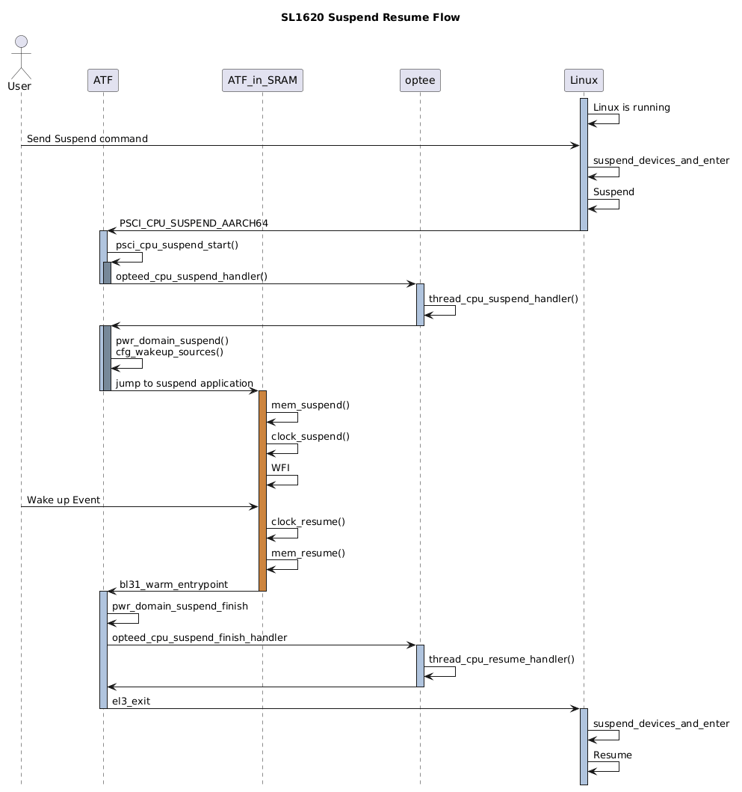
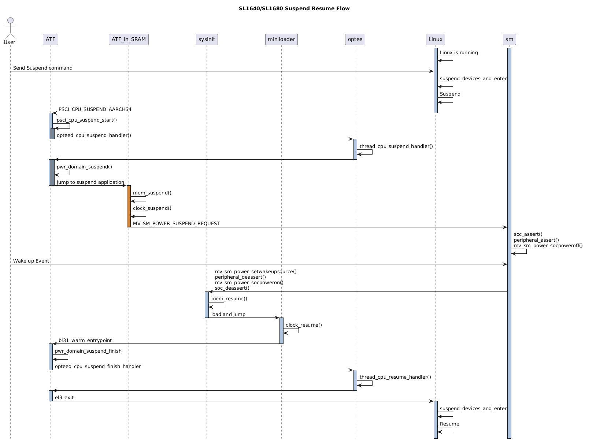
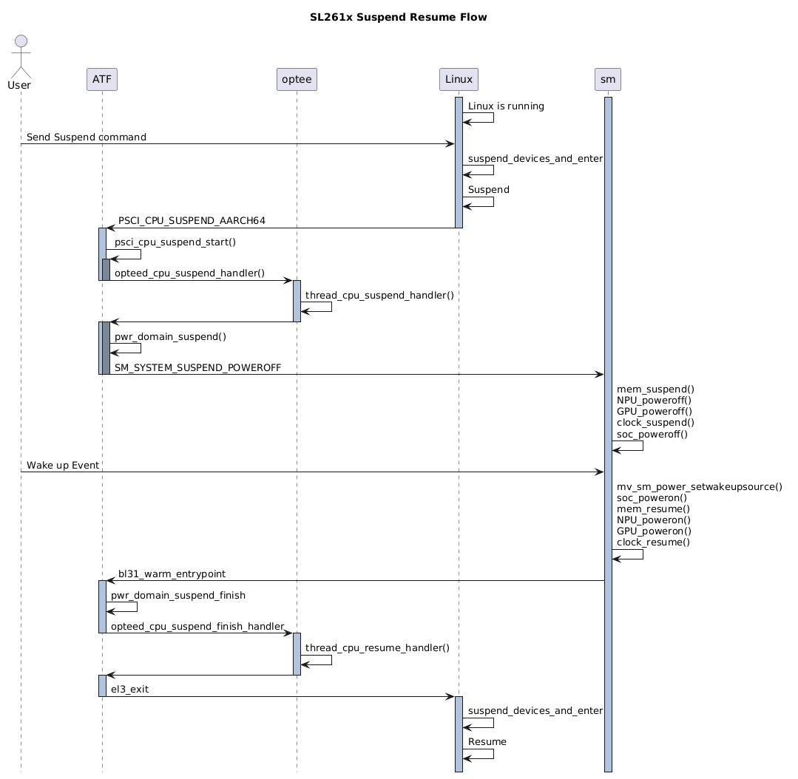
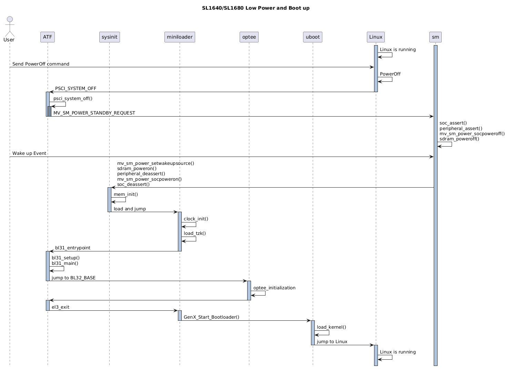
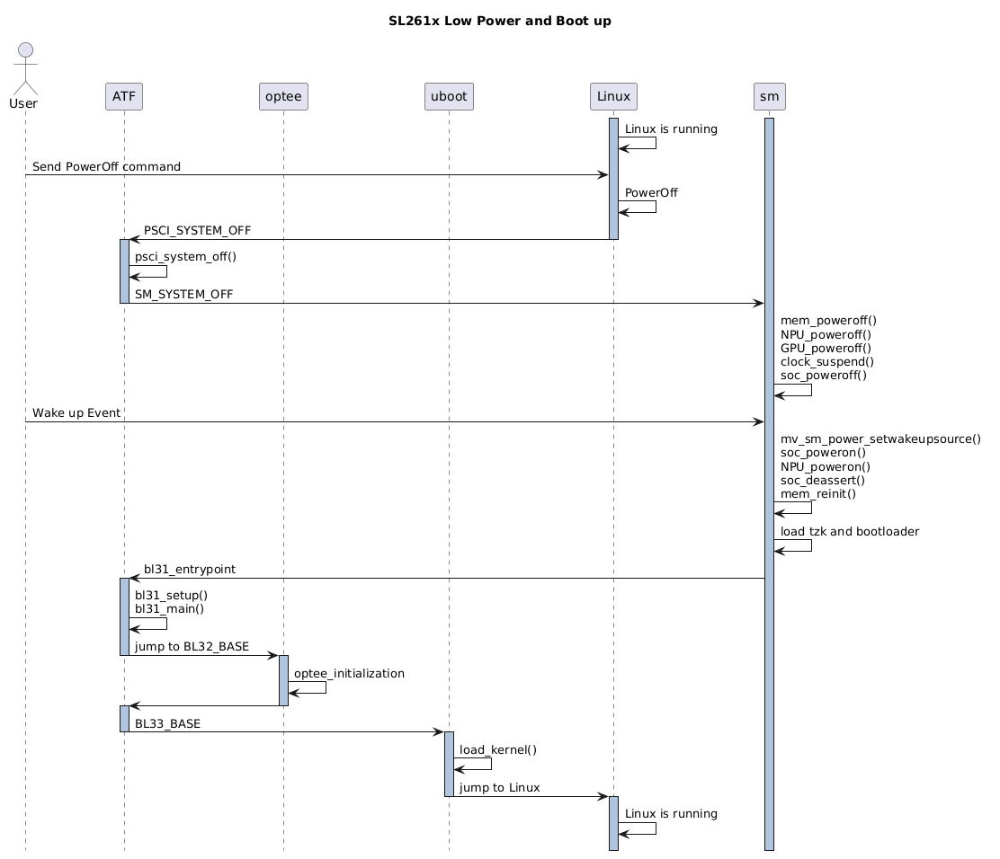
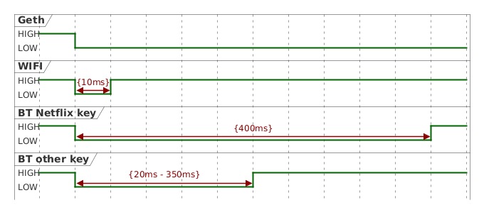

Power Mode User Guide
=====================

.. note::

   SL2610 Power Modes are implemented in the M52 firmware and are currently released as a binary.
   This guide applies to SL1620, SL1640, and SL1680.

Overview
--------

Astra Machina supports two types of power modes, as follows.

-  Suspend Mode

   -  System state is stored in RAM
   -  Most hardware is powered off except RAM and the AON domain
   -  Can resume very fast

-  Low Power Mode

   -  System is fully turned off
   -  Only AON domain is alive

====== ============ ==============
\      Suspend Mode Low Power Mode
====== ============ ==============
SL1620 ✔            ✖
SL1640 ✔            ✔
SL1680 ✔            ✔
SL261x ✔            ✔
====== ============ ==============

Power Flow
----------

The commands below are used to enter power flow.

1. Suspend

      "systemctl suspend" or "echo mem > /sys/power/state"

2. Low Power

      "shutdown -h now"

The following diagrams show the power flow of Astra platforms.

Suspend and Resume
~~~~~~~~~~~~~~~~~~

   alt text

.. note::
   
   Under Suspend mode of SL1620, VCPU domain remains alive and
   primary CPU is in WFI state while other CPUs are powered off.

   alt text

.. note::

   The System Manager of SL1640/SL1680 is limited to access the
   resources of SoC power domain.

   alt text

.. note::

   The System Manager on SL261x has full access permission to SoC
   side.

Low Power and Boot-Up
~~~~~~~~~~~~~~~~~~~~~

SL1620 does not support Low Power mode because it does not include
System Manager on SL1620.

   alt text

   alt text

The boot-up from Low Power mode is almost the same as cold boot.

Configurations and Settings
---------------------------

To support power mode, each module needs to set the appropriate
configurations.

Linux Kernel Configurations
~~~~~~~~~~~~~~~~~~~~~~~~~~~

Linux Kernel 6.12 as an example, below options are needed to enable the
power mode.

-  Core Power Management (MANDATORY)

   -  CONFIG_PM=y
   -  CONFIG_PM_SLEEP=y
   -  CONFIG_SUSPEND=y
   -  CONFIG_SUSPEND_FREEZER=y

-  ARM64 Architecture Support

   -  CONFIG_ARM64=y
   -  CONFIG_ARCH_SUSPEND_POSSIBLE=y
   -  CONFIG_ARCH_SUSPEND_NONZERO_CPU=y

-  PSCI

   -  CONFIG_ARM_PSCI_FW=y
   -  CONFIG_ARM_PSCI_CPUIDLE=y
   -  CONFIG_ARM_PSCI_CPUIDLE_DOMAIN=y

-  CPU Idle Framework

   -  CONFIG_CPU_IDLE=y
   -  CONFIG_CPU_IDLE_MULTIPLE_DRIVERS=y
   -  CONFIG_DT_IDLE_STATES=y

-  Device Tree Support

   -  CONFIG_OF=y
   -  CONFIG_OF_SLEEP=y

Here is the power mode behavior on ARM64 defined in device tree.

::

   psci {  
       compatible = "arm,psci-1.0";  
       method = "smc";  
   };

   cpus {  
       cpu@0 {  
           enable-method = "psci";  
       };
   };

   idle-states {  
       entry-method = "psci";  
   };

ATF (Arm Trusted Firmware)
~~~~~~~~~~~~~~~~~~~~~~~~~~

Both Suspend-to-RAM and Low Power require the cooperation of Arm Trusted
Firmware.

1. | PSCI version >= 1.0 is recommended.
   | The version of ATF in ASTRA release 2.3.0 is v2.7.0. It supports
     PSCI version 1.1.

   `DEN0022C_Power_State_Coordination_Interface.pdf <https://developer.arm.com/documentation/den0022/c/DEN0022C_Power_State_Coordination_Interface.pdf>`__

2. Implement vendor specific PSCI operations.

   To support power modes, ASTRA Machina implements below functions.

   ::

      const plat_psci_ops_t berlin_plat_psci_ops = {  
          .cpu_standby         = berlin_cpu_standby,  
          .pwr_domain_on           = berlin_pwr_domain_on,  
          .pwr_domain_off          = berlin_pwr_domain_off,  
          .pwr_domain_suspend      = berlin_pwr_domain_suspend,  
          .pwr_domain_on_finish        = berlin_pwr_domain_on_finish,  
          .pwr_domain_suspend_finish   = berlin_pwr_domain_suspend_finish,  
          .pwr_domain_pwr_down_wfi = berlin_pwr_domain_pwr_down_wfi,  
          .system_off          = berlin_system_off,  
          .system_reset            = berlin_system_reset,  
          .system_reset2           = berlin_system_reset2,  
          .validate_power_state        = berlin_validate_power_state,  
          .validate_ns_entrypoint      = berlin_validate_ns_entrypoint,  
          .get_sys_suspend_power_state = berlin_get_sys_suspend_power_state,  
      };

System Manager
~~~~~~~~~~~~~~

The System Manager resides in the AON domain and it is responsible for
the power management of SoC. It uses GPIO or PMIC to control the on/off
of power.

**Table of Power Control**

+---------+------------------+------------------+--------------------+
| Power   | SL1640           | SL1680           | SL261x             |
| Domain  |                  |                  |                    |
+=========+==================+==================+====================+
| VCORE   | EXPANDE          | EXPANDE          | S                  |
|         | R.SM-TW3.GPIO0_0 | R.SM-TW3.GPIO0_0 | Y8827N.SM_TW2.0x60 |
+---------+------------------+------------------+--------------------+
| VCPU    | EXPANDE          | EXPANDE          | ✖                  |
|         | R.SM-TW3.GPIO0_0 | R.SM-TW3.GPIO0_1 |                    |
+---------+------------------+------------------+--------------------+
| VDDM    | EXPANDE          | EXPANDE          | EXP.SM-TW0.GPIO0_2 |
|         | R.SM-TW3.GPIO0_2 | R.SM-TW3.GPIO0_2 |                    |
+---------+------------------+------------------+--------------------+
| V       | EXPANDE          | EXPANDE          | EXP.SM-TW0.GPIO0_3 |
| DDM_LPQ | R.SM-TW3.GPIO0_3 | R.SM-TW3.GPIO0_3 |                    |
+---------+------------------+------------------+--------------------+
| Stan    | EXPANDE          | EXPANDE          | EXP.SM-TW0.GPIO0_4 |
| d-By_En | R.SM-TW3.GPIO0_4 | R.SM-TW3.GPIO0_4 |                    |
+---------+------------------+------------------+--------------------+
| NPU     | Not Control by   | Not Control by   | Reg.R              |
|         | SM               | SM               | A_Gbl_npu_pwr_ctrl |
+---------+------------------+------------------+--------------------+
| GPU     | Not Control by   | Not Control by   | Reg.RA_            |
|         | SM               | SM               | Gbl_gfx3D_pwr_ctrl |
+---------+------------------+------------------+--------------------+

Power Measurement
-----------------

This section focuses on power measurement in Suspend and Low Power
modes.

To quick check if the power domain is powered off or on, Astra Machina
platforms provides short and voltage check points. Please refer to the
part of "Short and voltage check points" in `Astra Machina Eval
Platform <https://synaptics-astra.github.io/doc/v/latest/hw/index.html>`__.

Here shows the diagram of SL261x.

.. figure:: https://synaptics-astra.github.io/doc/v/latest/_images/image192.png
   :alt: alt text

   alt text

To get the accurate power data, please use Power Meter.

For SL261x, software provides a way to calculate the power under Suspend
and Low Power. Here are the steps.

1. "systemctl suspend" or "echo mem > /sys/power/state" to suspend
2. Wait for about 10 second
3. Press 'p'

Example output:

   | 0356393760:[0][INF][SYS ]:System Power status (100 samples)
   | 0356396764:[0][INF][GENR]: PWR_3V3 PWR_1V8 VCORE_SOC VDDM_1V2
     VDDM_2V5 VCORE_SM Total Power
   | 0356396764:[0][INF][GENR]: 134.27 31.85 0.00 24.16 10.02 19.65
     219.95(mW)

By the way, Kernel also implement a feature to measure power at runtime.
`Power Measurements with Astra
Machina <https://synaptics-astra.github.io/doc/v/latest/subject/power_measurement.html>`__

Wake-Up
-------

Wake Up Source
~~~~~~~~~~~~~~

ASTRA Machina supports several wake up sources relies on the design of
the board. Here lists several possible sources.

UART
~~~~

UART wake up is enabled by default and the wake up keys are 'W', 'w' and
space.

CEC
^^^

CEC wake up is supported in Android case. Here lists the wake events.

1. CEC_MSG_OPCODE_IMAGE_VIEW_ON
2. CEC_MSG_OPCODE_TEXT_VIEW_ON
3. CEC_MSG_OPCODE_USER_CONTROL_PRESSED
4. CEC_MSG_OPCODE_ACTIVE_SOURCE
5. CEC_MSG_OPCODE_SET_STREAM_PATH
6. CEC_VEND_CMD_BUDDY_LAUNCH_SPECIFIC_APP
7. CEC_MSG_OPCODE_DECK_CONTROL

WOL
^^^

On SL1640, it use a built-in 10/100 FE-PHY. An interrupt will be
triggered and send to Cortex CM3 NVIC controller. System Manager will
receive and handle the event and boot SoC.

For Geth, if WOL package is received, it will toggle a SM GPIO. System
Manager shall handle the GPIO signal and wake up SoC.

WIFI
^^^^

The wake up signal of WIFI is also connected to a SM GPIO.

BT
^^

BT uses the same way as WIFI. Toggling a GPIO to inform System Manager.

.. note::

   Due to lack available GPIOs, Geth/WIFI/BT may share one or two
   GPIOs. To distinguish different wake up source, the different waveform
   is required. For BT, it also requires to distinguish Netflix key and
   other keys per Android's demand.

Here is a possible implementation.

   alt text

Wake Up Configuration
~~~~~~~~~~~~~~~~~~~~~

SL1620
^^^^^^

CPU state is WFI on SL1620 Suspend Mode. Interrupt events are needed to
wake up the system. It can be set by a SMCCC in u-boot or Linux.

Here is the example of u-boot.

::

   #define SYNA_SIP_SMC32_WAKEUP_CONFIG    0x82000002  
   #define SYNA_SIP_SMC64_WAKEUP_CONFIG    0xC2000002

   unsigned long call_syna_sip(unsigned long id, unsigned long reg0, unsigned long reg1, unsigned long reg2)  
   {  
       struct pt_regs regs;  
       regs.regs[0] = id;  
       regs.regs[1] = reg0;  
       regs.regs[2] = reg1;  
       regs.regs[3] = reg2;

       smc_call(&regs);

       return regs.regs[0];  
   }

   call_syna_sip(SYNA_SIP_SMC64_WAKEUP_CONFIG, CONFIG_SYS_WAKEUP_INTR1, 0, 0);  
   call_syna_sip(SYNA_SIP_SMC64_WAKEUP_CONFIG, CONFIG_SYS_WAKEUP_INTR2, 0, 0);

SL1640/SL1680
^^^^^^^^^^^^^

1. | WOL (only available on SL1640)
   | Add "CFLAGS += -DWOLENABLE" in platform.mk.

2. | CEC
   | Set CONFIG_SM_CEC=y in the profile of a project.

3. | GPIO
   | Geth, WIFI/BT wake up are all implemented through GPIO.
   | Set GPIO mode in the Linux Kernel ``dolphin-rdk.dts`` in the ``linux-syna`` package.
   | https://github.com/synaptics-astra/linux_6_12-main/blob/#release#/arch/arm64/boot/dts/synaptics/dolphin-rdk.dts

   ::

      eth_phy_pmux: eth_phy-pmux {
         groups = "SM_TDI";
         function = "gpio";
      };

   | An example of SL1680.

   The configuration can be added to the ``platform_customization.c`` in the ``synasdk-sm`` package.
   https://github.com/synaptics-astra/boot/blob/#release#/bootloader/sm_cm3/syna/customization/dolphin/dolphin-rdk/platform_customization.c

   This example is for dolphin (SL1680). Use platypus for SL1640.

   ::

      DECLARE_GPIO_ISR(SM_GPIO_PORT_WIFIBT, EDGE_SENSITIVE, FALLING_EDGE, sm_gpio_isr);  
      #ifndef WIFIBT_GAP_MIN  
      #define WIFIBT_GAP_MIN  10  
      #define WIFIBT_GAP_MAX  125  
      #define ETH_GAP_MAX     512  
      #endif

      #ifndef BTKEY_NETFLIX_GAP_MIN  
      #define BTKEY_NETFLIX_GAP_MIN 395  
      #define BTKEY_NETFLIX_GAP_MAX 415  
      #endif

      /* wifi */  
      DECLARE_GPIO_WAKEUP(wifi, SM_GPIO_PORT_WIFIBT, 0, (WIFIBT_GAP_MIN *2), MV_SM_WAKEUP_SOURCE_WIFI, 0, 0); 

      /* bt (not netflix key) */  
      DECLARE_GPIO_WAKEUP(bt_otherkey, SM_GPIO_PORT_WIFIBT, (WIFIBT_GAP_MIN *2), BTKEY_NETFLIX_GAP_MIN, MV_SM_WAKEUP_SOURCE_BT, 1, KEY_OTHERS);

      /* bt (netflix key) */  
      DECLARE_GPIO_WAKEUP(bt_netflixkey, SM_GPIO_PORT_WIFIBT, BTKEY_NETFLIX_GAP_MIN, BTKEY_NETFLIX_GAP_MAX, MV_SM_WAKEUP_SOURCE_BT, 1, KEY_NETFLIX);

      /* geth */  
      DECLARE_GPIO_WAKEUP(geth, SM_GPIO_PORT_GEPHY, BTKEY_NETFLIX_GAP_MAX, DEFAULT_THOLD, MV_SM_WAKEUP_SOURCE_WOL, 0, 0);
