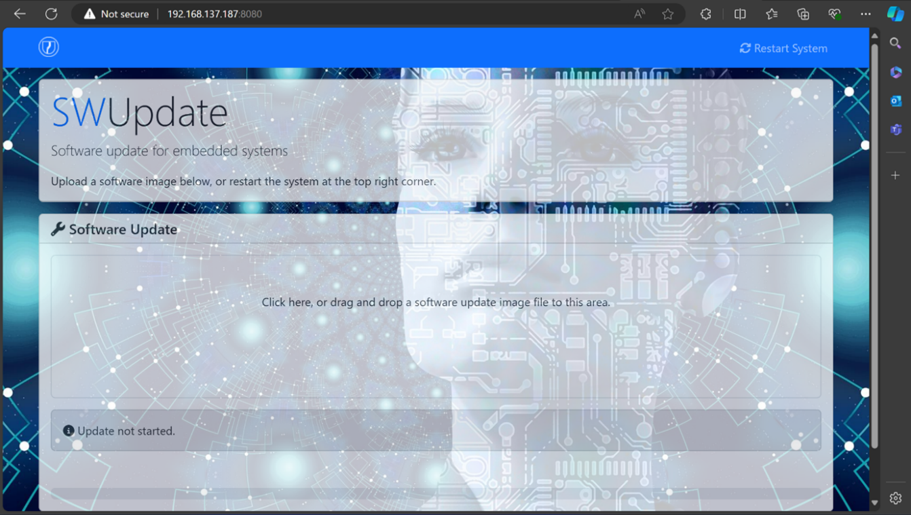
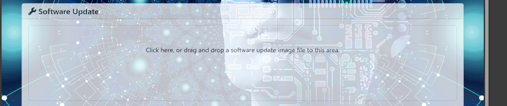

======================
Rescue Mode User Guide
======================

Introduction
============

**Rescue Mode** is a minimal initramfs, standalone Linux environment
designed to help recover a device when the main operating system becomes
unbootable or corrupted. It typically resides in a separate partition,
runs on RAM and operates independently of the primary root filesystem.

In embedded systems, especially those deployed in remote or inaccessible
locations, physical access for recovery (via USB or SD card) is often
impractical. Rescue Mode addresses this challenge by providing a
reliable fallback mechanism. It enables the device to boot into a
lightweight recovery system—usually based on initramfs—that can perform
critical recovery operations over available interfaces like Ethernet.

.. note::

   Rescue mode is supported only on single-copy partition layout.

Enabling Rescue Mode in the Yocto
=================================

-  Set ``ENABLE_RESCUE_MODE = "1"`` in the local.conf located in the
   ``build-<machine>/conf/`` directory. (By default, this value is set to
   "0").

-  Now, build the image using the following BitBake command (This is the
   same procedure used to build the standard Astra SDK)

::

   bitbake astra-media

-  After the build completes, the SDK will include rescue images
   (SYNAIMG) in a **single-copy format**.

-  Also, the ``sl1640_single_copy.swu`` file and its **certificate**
   will be generated in the RESCUE_OTA directory in deploy directory:
   ``build-sl1640/tmp/deploy/images/sl1640/RESCUE_OTA/``

-  Flash the SDK onto the device using the same procedure as for the
   normal SDK.

Adding Packages and Files to Rescue Initramfs Image (if required)
-----------------------------------------------------------------

- If additional packages need to be included in the rescue initramfs image, this
can be done by adding the corresponding recipe to the IMAGE_INSTALL variable in the
file ``recipes-rescue/astra-rescue/swupdate-image.bbappend``, located in the ``meta-synaptics`` directory.

- If a package named ``new-recipe`` needs to be added, follow the example below

::

   IMAGE_INSTALL += "kernel-module-stmmac \
      kernel-module-stmmac-platform \
      kernel-module-dwmac-generic \
      kernel-module-libphy \
      kernel-module-of-mdio \
      kernel-module-phylink \
      kernel-modules \
      openssh \
      openssh-sshd \
      openssh-scp \
      util-linux-lsblk \
      util-linux \
      udev \
      udev-extraconf \
      swupdate-progress \
      libubootenv \
      libubootenv-bin \
      chrony \
      rescue-support \
      new-recipe \  <- new package should be added here.
   "

Booting to Rescue Mode
======================

Initial flashing and boot
-------------------------

-  During the **first boot**, the rescue images will be automatically
   copied to the **rescue partition**: ``/dev/mmcblk0p2``.

-  To verify that the rescue partition exists, run the command: ``lsblk``

-  Execute ``saveenv`` in the u-boot console. This step is required
   because SWUpdate depends on saved environment variables.

.. note::

   Ensure the device is connected to Ethernet before booting to rescue mode. This allows it to:

   •	Automatically obtain an IP address via udhcpc.

   •	Synchronize date and time via chrony.

   If Ethernet is not connected during booting to rescue mode, you can manually assign an IP address after booting to rescue mode using::

      udhcpc -i eth0

Booting into Rescue Mode
------------------------

-  To initiate rescue mode:

   1. Short **PIN 31** and **PIN 32** on the 40-pin header of the Astra
      board.

   2. Press the **Reset** button.

   3. Alternatively, we can boot the rescue mode by executing the
      command ``run rescue_boot`` in uboot console without above step 1 and 2.

-  This triggers a reboot into rescue mode by loading the **initramfs**
   image located on ``/dev/mmcblk0p2``.

To verify that the device has booted into the Rescue image, the
following logs will appear in the serial console at the end of the boot
sequence::

   [rescue] Bringing up eth0...
   [    3.488566] stmmaceth f7b60000.ethernet eth0: PHY [stmmac-0:00] driver [SP Fast Ethernet] (irq=59)
   [    3.499667] stmmaceth f7b60000.ethernet eth0: Register MEM_TYPE_PAGE_POOL RxQ-0
   [    3.517606] dwmac1000: Master AXI performs any burst length
   [    3.523197] stmmaceth f7b60000.ethernet eth0: No Safety Features support found
   [    3.530425] stmmaceth f7b60000.ethernet eth0: No MAC Management Counters available
   [    3.537993] stmmaceth f7b60000.ethernet eth0: PTP not supported by HW
   [    3.544940] stmmaceth f7b60000.ethernet eth0: configuring for phy/mii link mode
   [rescue] Starting DHCP...
   [    5.416818] stmmaceth f7b60000.ethernet eth0: Link is Up - 100Mbps/Full - flow control off
   [    5.425121] IPv6: ADDRCONF(NETDEV_CHANGE): eth0: link becomes ready
   INIT: Entering runlevel: 5
   [   22.119243] random: crng init done
   Starting OpenBSD Secure Shell server: sshd
   generating ssh RSA host key...
   generating ssh ECDSA host key...
   generating ssh ED25519 host key...
   done.
   Starting chronyd: done
   Poky (Yocto Project Reference Distro) 4.0.17 sl1640 ttyS0
   sl1640 login: root
   root@sl1640:~

.. note::

   Disconnect the short between PIN 31 and PIN 32 to boot into the normal SDK.

Running the SWUpdate in Rescue Mode
===================================

.. note::

   Execute ``saveenv`` in the u-boot console before booting the rescue mode. This step is required
   because SWUpdate depends on saved environment variables. 

Using the Root File System
--------------------------

To start the SWUpdate, execute the following command::

   update -i <filename> -k <key/cert>

.. note::

   Place the single copy ``sl1640_single_copy.swu`` package and its corresponding cert/key in the local space (``/home/root/``).

   **According to the customer’s requirement, the device in Rescue mode will support only Ethernet (no USB or SPI),
   and therefore ADB will not be available. The OTA SWU package must be copied to the root directory over Ethernet
   using the scp command.**

For example: If the ``sl1640_single_copy.swu`` file and ``mycert.cert.pem`` are
placed on ``/home/root`` on the device, run the command::

   update -i sl1640_single_copy.swu -k mycert.cert.pem

**Make sure PIN 31 and PIN 32 are disconnected (not shorted) to allow
the device to boot into the normal recovered SDK**

Using the Mongoose Webserver
----------------------------

To start the embedded web server, ``document-root (-r)`` and ``port (-p)``
are the mandatory parameters. Execute the following command::

   update -w "-r /www -p 8080" -k <key/cert>

.. note::

   The ``www`` web folder will be located on the root directory of the device by default.
   The corresponding key/cert should be stored in the device's local space.

The default port for the web server is 8080. To access it, open any web
browser and navigate to the following URL: **<device_ip>:8080.** The
following image displays the user interface of the hosted web server.

   Mongoose web server hosted on port 8080 of the device's IP address

Click the file upload box (click here) on the hosted web page, which
will open a dialog box allowing you to select the sl1640_single_copy.swu
image from your system.

The following image shows the file upload box on the hosted web page:

   File upload box in Mongoose webserver
