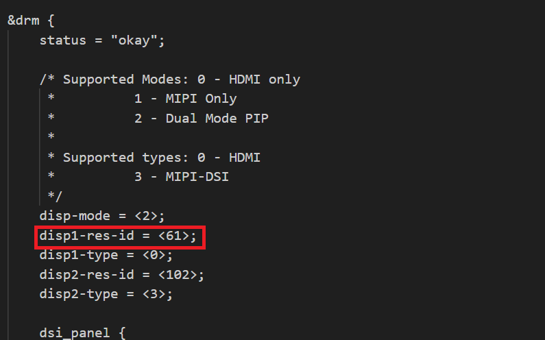

===================================================
Setting HDMI Output Resolution on SL1640 and SL1680
===================================================

SL1640 and SL1680 set the HDMI-TX (Output) resolution using
the Linux Kernel Devicetree. Changing the resolution requires
updating the devicetree and rebuilding the image.

Updating the Devicetree
=======================

This requires modifying the ``linux-syna`` package using ``devtool``::

    devtool modify linux-syna

Updating the DTS File
---------------------

Modify the platform dts file located in ``build-sl1680/workspace/sources/linux-syna/arch/arm64/boot/dts/synaptics``.

+-----------------+------------------+-----------------+
|                 | SL1640           | SL1680          |
+-----------------+------------------+-----------------+
| DTS             | platypus-rdk.dts | dolphin-rdk.dts |
+-----------------+------------------+-----------------+

Modify the ``disp1-res-id`` entry in the ``drm`` section. The default value is ``61`` which sets the resolution to 4K30. To
set the resolution to 1080P change the value to ``24``. All other values can be found in 
`vpp_defines.h <https://github.com/synaptics-astra/linux_5_15-overlay/blob/#release#/drivers/soc/berlin/modules/avio/vpp/ca/include/vpp_defines.h>`__.

Build the Updated Image
-----------------------

Build the image with the updated device tree entries::

   devtool build linux-syna
   devtool build-image astra-media

Updating ``syna_drm.conf``
==========================

The file ``/etc/modprobe.d/syna_drm.conf`` can override the setting in devicetree. Be sure to update ``syna_drm.conf`` to match the resolution set
in devicetree by setting the ``syna_drm hdmi_preferred_mode`` option.

::

    options syna_drm hdmi_preferred_mode=1920x1080

