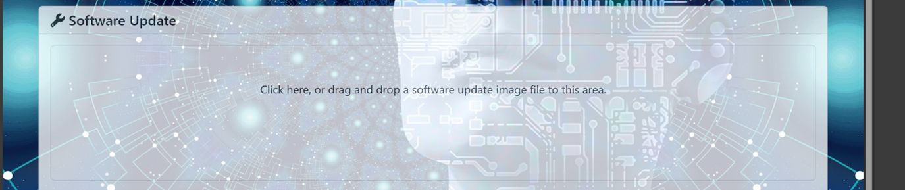

===================
SWUpdate User Guide
===================

Prerequisite
============

When a new SDK is flashed onto the device, it is essential to save both the primary and redundant environment variables to the eMMC storage only once (this step is not needed after it is done).

**Steps:**

1. Reboot the device and continuously press any key during the boot process to enter the U-Boot menu (eMMC boot/U-Boot window).
2. Use the command ``saveenv`` twice to save the primary and redundant environment variables to the eMMC storage.

Running the swupdate
====================

Via USB/root file system
-------------------------

To start the SWUpdate, execute the following command:

.. code:: bash

   update -i <filename> -k <key/cert>

.. Note:: Place the .swu package and its corresponding cert/key in the local space (/home/root/) and mention the .swu image and key/cert with the correct relative path in the command. Alternatively, if the .swu file and its corresponding cert/key are stored on a USB drive, execute the above command in the desired directory located on the USB drive.

For example:
If the ``test.swu`` file and ``mycert.cert.pem`` are placed on ``/home/root`` on the device, run the command:

.. code:: bash

   update -i test.swu -k mycert.cert.pem

Via Mongoose webserver
-----------------------

To start the embedded web server, "document-root (-r)" and "port (-p)" are the mandatory parameters. Execute the following command:

.. code:: bash

   update -w "-r /etc/www -p 8080" -k <key/cert>

.. note::
   The **www** web folder will be located on the /etc directory of the device by default. 
   The corresponding key/cert should be stored in the device's local space.

The default port for the web server is 8080. To access it, open any web browser and navigate to the following URL: ``<device_ip>:8080``.

The following image displays the user interface of the hosted web server on the URL: ``<device_ip>:8080``.

.. image:: media/web_server_ui.png
   :alt: User Interface of the Web Server

Click the file upload box (``click here``) on the hosted web page, which will open a dialog box allowing you to select the .swu image from your system.

The following image shows the file upload box on the hosted web page:

Expected results
================

Success case
-------------

- The user will observe the update progress bar, which will display the logs **SUCCESS!** and **DONE**, indicating that the device has successfully rebooted into the updated partition.
- The user can also verify the successful update by checking the ustate environment variable using the **fw_printenv** command
- The environment variable **ustate** sets to **1**, if the update is successful.

Failure case
-------------

- If the update fails, then the error log will prompt during the update and the update will be stopped.
- The environment variable **ustate** is set to **7**, and **recovery_status** is set to **"in_progress"** if the update fails or is interrupted by external factors, such as a power outage or a corrupted image.
- If the device fails to boot the updated partition due to a crash caused by the new image, it will automatically revert to the stable alternate partition after several boot attempts.