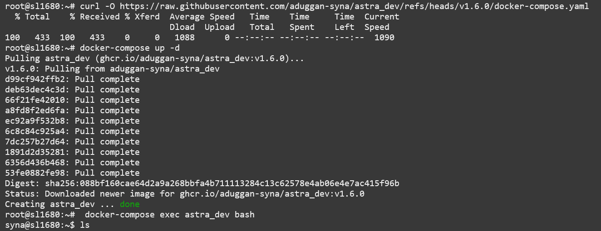
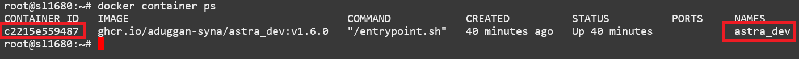
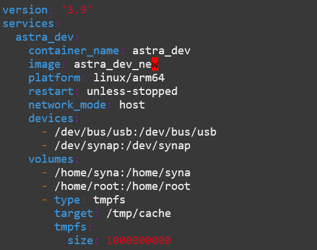

=============================
Ubuntu-based Docker Container
=============================

Astra Machina supports a Ubuntu-based development environment using Docker. This provides the flexibility of Ubuntu
in a container while maintaining the benefits using Yocto as the host OS. The container also has access to the NPU hardware for
prototyping AI applications.

.. note::

    Currently, docker is only enabled on the SL1680 OOBE image. OOBE Images with less then 4GB RAM
    are not supported.

Installing and Running the Astra Dev Docker Image
=================================================

A prebuilt version of the Astra Dev Docker Image is hosted on GitHub. To get started, download the ``docker-compose.yaml`` file.

::

    curl -O https://raw.githubusercontent.com/aduggan-syna/astra_dev/refs/heads/v#release#/docker-compose.yaml

Start the container using the ``docker-compose up`` command. This will download the image from GitHub and start a container using the parameters specified
in the ``docker-compose.yaml`` file. This includes mapping the ``/home/syna`` directory into the container. It also maps hardware devices such as the NPU
into the container so that apps in the container can benefit from hardware acceleration of AI workflows.

::
    
    docker-compose up -d

Access a shell inside the container using the ``exec`` command.

::

    docker-compose exec astra_dev bash

The container has a default user ``syna`` with the home directory ``/home/syna``.
The home directory is mapped from the host so files stored there can also be accessed from the host. The default user, ``syna``, also has ``sudo`` privileges
enabled. Run ``sudo`` for any operations which require root privileges. For example, you can run ``sudo apt install ...`` to install additional packages.

    Output of docker-compose

Saving State
============

Installing packages in a docker container will not update the docker image. Any new packages will not persist after shutting down the container.
To save changes you can use the ``commit`` command to create a new image which contains your modifications.

To save state, start be identifying the container containing the updates.

::

    docker container ps

Commit the new image.

::

    docker commit astra_dev astra_dev_new

.. note::

    The container ID can also be used instead of the container name.

Update the ``docker-compose.yaml`` ``image`` entry to use the newly created image.

Stopping the Astra Dev Container
================================

When done with the container it can be shutdown with the done command.

::

    docker-compose down

Building the Image
==================

The prebuilt docker image was created using the scripts in https://github.com/aduggan-syna/astra_dev/tree/v#release#. The
``build.sh`` copies files from the host rootfs so that they can be installed into the image, and accessed from inside of the
container.

Next, modify the ``Dockerfile`` if you want to add additional packages or perform additional setup. Once complete, run the ``build.sh``
command to build the image.

::

    build.sh

Next modify the image name in ``docker-compose.yaml`` to use the locally created image instead of the version hosted on GitHub.
Then start the container as usual.

::

    docker-compose up -d

.. note::

    Astra Dev uses files from the host rootfs to interface with hardware components such as the NPU. Astra Dev images
    have version numbers which match Astra SDK release versions. Using a version of Astra Dev which does not match
    the Astra SDK release version could result in compatibility issues.