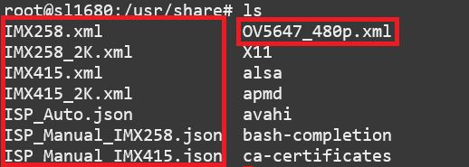

=====================================
Updating the ISP Sensor Configuration
=====================================

SL1680 supports multiple camera sensors. By default, SL1680 is configured to use the OV5647 module with port CSI0. But, the software can be configured to use any of the
supported sensor modules. Some configurations require setting a device tree overlay to function correctly.

.. note::

    Starting with release v1.5, the default sensor is now the OV5647 module.

Supported Camera Modules
========================

+--------+------------------------------------------------------------------------------------------+-----------------+----------------------------------------------------------+----------------------------------------------------+
| Sensor | Module                                                                                   | Resolution      | Interface (Device Tree Overlay if Required)              | Notes                                              |
+========+==========================================================================================+=================+==========================================================+====================================================+
| IMX258 | Synaptics IMX258 Camera Module                                                           | 3840x2160 30fps | MIPI-CSI 0 w/ dolphin-csi0-with-expander.dtbo            | Synaptics SL1680 MIPI CSI Adaptor Board Required   |
|        |                                                                                          | (mode 0)        |                                                          |                                                    |
|        |                                                                                          |                 | Dewarp w/ dolphin-csi0-with-expander-dewarp-imx258.dtb   |                                                    |                                                    |
|        |                                                                                          | 1920x1080 30fps |                                                          |                                                    |
|        |                                                                                          | (mode 1)        |                                                          |                                                    |
|        |                                                                                          |                 |                                                          |                                                    |
+--------+------------------------------------------------------------------------------------------+-----------------+----------------------------------------------------------+----------------------------------------------------+
| IMX415 | Synaptics IMX415 Camera Module                                                           | 3840x2160 30fps | MIPI-CSI 0 w/ dolphin-csi0-with-expander.dtbo            | Synaptics SL1680 MIPI CSI Adaptor Board Required   |
|        |                                                                                          | (mode 0)        |                                                          |                                                    |
|        |                                                                                          |                 | Dewarp w/ dolphin-csi0-with-expander-dewarp-imx415.dtbo  |                                                    |                                                    |
|        |                                                                                          | 1920x1080 30fps |                                                          |                                                    |
|        |                                                                                          | (mode 1)        |                                                          |                                                    |
|        |                                                                                          |                 |                                                          |                                                    |
+--------+------------------------------------------------------------------------------------------+-----------------+----------------------------------------------------------+----------------------------------------------------+
| OV5647 | `Arducam 5MP OV5647 Camera Module                                                        | 640x480 60fps   | MIPI-CSI0                                                |                                                    |
|        | <https://www.arducam.com/product/arducam-ov5647-standard-raspberry-pi-camera-b0033/>`__  | (mode 0)        |                                                          |                                                    |
|        |                                                                                          |                 +----------------------------------------------------------+                                                    |
|        |                                                                                          | 1920x1080 30fps | MIPI-CSI 1 w/ dolphin-csi1-without-expander.dtbo         |                                                    |
|        |                                                                                          | (mode 1)        +----------------------------------------------------------+                                                    |
|        |                                                                                          |                 | Dual CSI0/1 w/ dolphin-bothcsi-without-expander.dtbo     |                                                    |
+--------+------------------------------------------------------------------------------------------+-----------------+----------------------------------------------------------+----------------------------------------------------+
| IMX477 | `Raspberry Pi High Quality Camera                                                        | 3840x2160 30fps | MIPI-CSI0                                                | Single Sensor Support Only                         |
|        | <https://www.raspberrypi.com/products/raspberry-pi-high-quality-camera/>`__              | (mode 0)        +----------------------------------------------------------+                                                    |
|        |                                                                                          |                 |  MIPI-CSI 1 w/ dolphin-csi1-without-expander.dtbo        | 3840x2160 30fps output is non-calibrated           |
+--------+------------------------------------------------------------------------------------------+-----------------+----------------------------------------------------------+----------------------------------------------------+

 .. _changing_sensor_module:

Changing the Camera Sensor Module
=================================

The file ``/proc/vsi/isp_subdev0`` is used to display the sensor configuration properties and to update the sensor configuration.

Current Sensor Configuration
----------------------------

The current sensor configuration can be viewed by read from the ``/proc/vsi/isp_subdev0`` file.

.. figure:: media/sl1680-isp-sensor-configuration.png

    Reading the current sensor configuration

Configuring a New Module
------------------------

To change the sensor configuration, update the ``/usr/sbin/isp_media_server.sh`` script. Change the line which writes
the sensor config to ``/proc/vsi/isp_subdev0``. Update the sensor name, xml, and json files for the new sensor.

.. figure:: media/isp_media_server_script.png

Each camera sensor module contains one or more XML configuration files located in ``/usr/share``.

    List of sensor config files

Then restart the isp_media_server service to apply the update.

::

    systemctl restart isp_media_server

.. note::

    To apply these changes to an image, modify the ``meta-synaptics/recipes-devtools/synasdk/files/isp_media_server.sh``
    script as described below.

Changing Sensor Configurations
------------------------------

The default sensor configuration is for the OV5647 at 640x480 resolution. To use a different resolution or sensor modify the ``isp_media_server.sh``
script. This can be done at build time by applying a patch or by modifying the script on the board at runtime.

Configuration for OV5647 with 2K resolution::

    diff --git a/recipes-devtools/synasdk/files/isp_media_server.sh b/recipes-devtools/synasdk/files/isp_media_server.sh
    index 4f603fb..30b13cb 100644
    --- a/recipes-devtools/synasdk/files/isp_media_server.sh
    +++ b/recipes-devtools/synasdk/files/isp_media_server.sh
    @@ -26,10 +26,10 @@ set -e

    case $1 in
        start)
    -        echo "sensor=ov5647 xml=/usr/share/OV5647_480p.xml manu_json=/usr/share/ISP_Manual_IMX258.json \
    -        auto_json=/usr/share/ISP_Auto.json i2c_bus_id=3 mipi_id=0 mode=0" > /proc/vsi/isp_subdev0
    +        echo "sensor=ov5647 xml=/usr/share/OV5647_2k.xml manu_json=/usr/share/ISP_Manual_OV5647_2k.json \
    +        auto_json=/usr/share/ISP_Auto_OV5647_2k.json i2c_bus_id=3 mipi_id=0 mode=1 csi_clock_rate=300000000" > /proc/vsi/isp_subdev0
            echo "1 sensor=ov5647 1 xml=/usr/share/OV5647_480p.xml 1 manu_json=/usr/share/ISP_Manual_IMX258.json \
    -        1 auto_json=/usr/share/ISP_Auto.json 1 i2c_bus_id=0 1 mipi_id=1 1 mode=0" > /proc/vsi/isp_subdev0
    +        1 auto_json=/usr/share/ISP_Auto.json 1 i2c_bus_id=0 1 mipi_id=1 1 mode=1 csi_clock_rate=300000000" > /proc/vsi/isp_subdev0
            echo -n "Starting $DESC: "
            start-stop-daemon --start $SSD_OPTIONS  > $LOGFILE &
            echo "${DAEMON##*/}."

Configuration for IMX477::

    diff --git a/recipes-devtools/synasdk/files/isp_media_server.sh b/recipes-devtools/synasdk/files/isp_media_server.sh
    index 4f603fb..ff787a6 100644
    --- a/recipes-devtools/synasdk/files/isp_media_server.sh
    +++ b/recipes-devtools/synasdk/files/isp_media_server.sh
    @@ -26,9 +26,9 @@ set -e

    case $1 in
        start)
    -        echo "sensor=ov5647 xml=/usr/share/OV5647_480p.xml manu_json=/usr/share/ISP_Manual_IMX258.json \
    +        echo "sensor=imx477 xml=/usr/share/IMX477_3840x2160.xml manu_json=/usr/share/ISP_Manual_IMX477.json \
            auto_json=/usr/share/ISP_Auto.json i2c_bus_id=3 mipi_id=0 mode=0" > /proc/vsi/isp_subdev0
    -        echo "1 sensor=ov5647 1 xml=/usr/share/OV5647_480p.xml 1 manu_json=/usr/share/ISP_Manual_IMX258.json \
    +        echo "1 sensor=imx477 1 xml=/usr/share/IMX477_3840x2160.xml 1 manu_json=/usr/share/ISP_Manual_IMX477.json \
            1 auto_json=/usr/share/ISP_Auto.json 1 i2c_bus_id=0 1 mipi_id=1 1 mode=0" > /proc/vsi/isp_subdev0
            echo -n "Starting $DESC: "
            start-stop-daemon --start $SSD_OPTIONS  > $LOGFILE &

Configuration for IMX258::

    diff --git a/recipes-devtools/synasdk/files/isp_media_server.sh b/recipes-devtools/synasdk/files/isp_media_server.sh
    index 4f603fb..c5cd9b1 100644
    --- a/recipes-devtools/synasdk/files/isp_media_server.sh
    +++ b/recipes-devtools/synasdk/files/isp_media_server.sh
    @@ -26,7 +26,7 @@ set -e

    case $1 in
        start)
    -        echo "sensor=ov5647 xml=/usr/share/OV5647_480p.xml manu_json=/usr/share/ISP_Manual_IMX258.json \
    +        echo "sensor=imx258 xml=/usr/share/IMX258.xml manu_json=/usr/share/ISP_Manual_IMX258.json \
            auto_json=/usr/share/ISP_Auto.json i2c_bus_id=3 mipi_id=0 mode=0" > /proc/vsi/isp_subdev0
            echo "1 sensor=ov5647 1 xml=/usr/share/OV5647_480p.xml 1 manu_json=/usr/share/ISP_Manual_IMX258.json \
            1 auto_json=/usr/share/ISP_Auto.json 1 i2c_bus_id=0 1 mipi_id=1 1 mode=0" > /proc/vsi/isp_subdev0

Configuration for IMX415::

    diff --git a/recipes-devtools/synasdk/files/isp_media_server.sh b/recipes-devtools/synasdk/files/isp_media_server.sh
    index 4f603fb..c5cd9b1 100644
    --- a/recipes-devtools/synasdk/files/isp_media_server.sh
    +++ b/recipes-devtools/synasdk/files/isp_media_server.sh
    @@ -26,7 +26,7 @@ set -e

    case $1 in
        start)
    -        echo "sensor=ov5647 xml=/usr/share/OV5647_480p.xml manu_json=/usr/share/ISP_Manual_IMX258.json \
    +        echo "sensor=imx415 xml=/usr/share/IMX415.xml manu_json=/usr/share/ISP_Manual_IMX415.json \
            auto_json=/usr/share/ISP_Auto.json i2c_bus_id=3 mipi_id=0 mode=0" > /proc/vsi/isp_subdev0
            echo "1 sensor=ov5647 1 xml=/usr/share/OV5647_480p.xml 1 manu_json=/usr/share/ISP_Manual_IMX258.json \
            1 auto_json=/usr/share/ISP_Auto.json 1 i2c_bus_id=0 1 mipi_id=1 1 mode=0" > /proc/vsi/isp_subdev0

Updating Device Tree Overlay
^^^^^^^^^^^^^^^^^^^^^^^^^^^^

See :ref:`devicetree_overlays` for details on how to enable the devicetree overlays.

Using the OV5647 and IMX477 Sensors
-----------------------------------

Astra Machina SL1680 supports using the OV5647 and IMX477 sensors on either the CSI0 (22-pin), or the CSI1 (15-pin) connector, or both simultaneously (OV5647 only).
Connecting a single sensor to CSI0 is the default configuration. Connecting a single sensor to CSI1 requires enabling the
``dolphin-csi1-without-expander.dtbo`` overlay. Using two OV5647 sensors simultaneously requires enabling the ``dolphin-bothcsi-without-expander.dtbo``
overlay.

.. note::

    Release v1.4 adds support for using an OV5647 sensor on CSI1. Previous versions only support using OV5647 on CSI0.

.. note::

    Release v1.5 adds support for using CSI0 and CSI1 simultaneously with two OV5647 sensors.

.. note::

    Release v1.7 adds support for a single IMX447 sensors on either CSI0 or CSI1.

Enabling the IMX258 and IMX415 Sensors
--------------------------------------

Astra Machina SL1680 supports the IMX258 and IMX415 sensors connected to CSI0. These sensors use a GPIO expander which requires the ``dolphin-csi0-with-expander.dtbo``
overlay.

.. note::

    Using the IMX258 and IMX415 on CSI1 is not supported on Synaptics Astra Machina boards since CSI1
    is not compatible with the GPIO expander.

.. _enable_dewarp_dtbo::

Enabling Dewarp with the IMX258 and IMX415 Sensors
^^^^^^^^^^^^^^^^^^^^^^^^^^^^^^^^^^^^^^^^^^^^^^^^^^

Astra Machina SL1680 supports using Dewarp lens distortion correction on the IMX258 and IMX415 sensors. Enabling dewarp requires using the ``dolphin-csi0-with-expander-dewarp-imx258.dtb``
and ``dolphin-csi0-with-expander-dewarp-imx415.dtb`` overlays instead of ``dolphin-csi0-with-expander.dtbo``.

Dual Sensor Support
===================

In Dual sensor mode, MCM (Multi Contexts Management) Module handles switching between sensor configurations and reading data
from CSI. This is as opposed to Single Camera mode where the ISP will read directly from CSI. MCM Buffers are allocated internally
which will use IOMMU Memory. The ``isp_video_test`` tool supports dumping these raw MCM Buffer. See :ref:`isp_video_test`.

Dual sensor mode has the following requirements:

* Use RPI camera sensors (OV5647 , IMX477(future) for dual sensor playback 
* Both camera sensors must of same type and configured with similar settings.
* With this feature, both CSI0 and CSI1 video pipelines can run simultaneously. 
* Currently, only the dual sensor configuration without an expander (OV5647) is supported.

Dual sensor mode also requires the ``dolphin-bothcsi-without-expander.dtbo`` devicetree overlay to be loaded. 

Once the system is configured and both sensors are connected, run the following command to verify the configuration. The Following
shows both sensors are configured.

::

    root@sl1680:~# cat /proc/vsi/isp_subdev0
    /******sensor configuration******/
    isp0 port0:
    sensor   : ov5647
    mode     : 0
    xml      : /usr/share/OV5647_480p.xml
    manu_json: /usr/share/ISP_Manual_IMX258.json
    auto_json: /usr/share/ISP_Auto.json
    i2c_bus_id: 3
    mipi_id   : 0
    *********************************
    isp0 port1:
    sensor   : ov5647
    mode     : 0
    xml      : /usr/share/OV5647_480p.xml
    manu_json: /usr/share/ISP_Manual_IMX258.json
    auto_json: /usr/share/ISP_Auto.json
    i2c_bus_id: 0
    mipi_id   : 1
    *********************************

Next, iterate through the /dev/videoX device to find out the exact video device for CSI0 and CSI1 MP/SP1/SP2.
Find CSI0-MP device with the name : vvcam-video.0.0. In the below example, /dev/video3 is CSI0-MP path.

::

    root@sl1680:~# v4l2-ctl -d 3 --info
    Driver Info:
            Driver name      : vvcam-video.0.0
            Card type        : vvcam-video.0.0
            Bus info         : platform:vvcam-video.0.0
            Driver version   : 5.15.140
            Capabilities     : 0x84201000
                    Video Capture Multiplanar
                    Streaming
                    Extended Pix Format
                    Device Capabilities
            Device Caps      : 0x04201000
                    Video Capture Multiplanar
                    Streaming
                    Extended Pix Format
    Media Driver Info:
            Driver name      : vvcam-video
            Model            : verisilicon_media
            Serial           :
            Bus info         :
            Media version    : 5.15.140
            Hardware revision: 0x00000000 (0)
            Driver version   : 5.15.140
    Interface Info:
            ID               : 0x03000003
            Type             : V4L Video
    Entity Info:
            ID               : 0x00000001 (1)
            Name             : vvcam-video.0.0
            Function         : V4L2 I/O
            Pad 0x01000002   : 0: Sink

Find CSI1-MP device with the name : vvcam-video.0.4. In the below example, /dev/video7 is CSI1-MP path.

::

    root@sl1680:~# v4l2-ctl -d 7 --info
    Driver Info:
            Driver name      : vvcam-video.0.4
            Card type        : vvcam-video.0.4
            Bus info         : platform:vvcam-video.0.4
            Driver version   : 5.15.140
            Capabilities     : 0x84201000
                    Video Capture Multiplanar
                    Streaming
                    Extended Pix Format
                    Device Capabilities
            Device Caps      : 0x04201000
                    Video Capture Multiplanar
                    Streaming
                    Extended Pix Format
    Media Driver Info:
            Driver name      : vvcam-video
            Model            : verisilicon_media
            Serial           :
            Bus info         :
            Media version    : 5.15.140
            Hardware revision: 0x00000000 (0)
            Driver version   : 5.15.140
    Interface Info:
            ID               : 0x03000013
            Type             : V4L Video
    Entity Info:
            ID               : 0x00000011 (17)
            Name             : vvcam-video.0.4
            Function         : V4L2 I/O
            Pad 0x01000012   : 0: Sink

You can now run two independent GStreamer pipelines from two separate terminals, one for each path. This will enable two video streams to run simultaneously on Wayland.

Terminal 1::

    gst-launch-1.0 v4l2src device=/dev/video3 ! 'video/x-raw, format=(string)NV12, width=(int)640, height=(int)480, framerate=(fraction)30/1' ! waylandsink

Terminal 2::

    gst-launch-1.0 v4l2src device=/dev/video7 ! 'video/x-raw, format=(string)NV12, width=(int)640, height=(int)480, framerate=(fraction)30/1' ! waylandsink

.. _isp_video_test::

ISP Video Test Tool
===================

Release v1.7.0 adds the ``isp_video_test`` tool which allows testing the ISP and setting advanced settings. For example, is
supports dumping raw MCM buffers. This feature is not supported by Gstreamer's ``filesink`` since it uses IOMMU memory.

Execute the following command to start the video test application:

::

    isp_video_test

Usage
-----

::

    isp_video_test  -w 1920 -h 1080 -f NV12 -m 0 -t 3 -u 0 -d 4 -r 0 -p /path_to_store_file

*Options*
    * -w Image width
    * -h Image height
    * -f Image format NV12, NM12, RAW, RGB24, BGR24, YUV3
    * -m Sensor mode index
    * -t Display type:
        * 0: DRM-KMS
        * 2: File
        * 3: Wayland
    * -d Video device ID
    * -u IOMMU:
        * 1: Enable
        * 0: Disable
    * -r Sensor Direct Output:
        * 1: Enable
        * 0: Disable
    * -p  Path to store the output file. If not specified, PWD will be used.

Supported Video types
^^^^^^^^^^^^^^^^^^^^^

+-----------------+-------------------------------------------------+------------------------------------------+----------------------------------------------+
| Display Type    | NV12                                            | RGB                                      | Bayer                                        |
+=================+========================+========================+================+=========================+======================+=======================+
|                 | IOMMU                  | non-IOMMU              | IOMMU          | non-IOMMU               | IOMMU                | non-IOMMU             |
|-----------------+------------------------+------------------------+----------------+-------------------------+----------------------+-----------------------+
| File            | ``-f NM12 -t 2 -u 1``  | ``-f NV12 -t 2 -u 0``  | Not Supported  | ``-f BGR24 -t 2 -u 0``  |  ``-f RAW-t 2 -u 1`` | ``-f RAW-t 2 -u 0``   |
|                 |                        |                        |                |                         |                      |                       |
|                 |                        |                        |                | ``-f RGB24 -t 2 -u 0``  |                      |                       |
|                 |                        |                        |                |                         |                      |                       |
+-----------------+------------------------+------------------------+----------------+-------------------------+----------------------+-----------------------+
| DRM-KMS         | ``-f NM12 -t 0 -u 1``  | ``-f NV12 -t 0 -u 0``  | Not Supported  | ``-f BGR24 -t 0 -u 0``  | Not Supported        | Not Supported         |
|                 |                        |                        |                |                         |                      |                       |
|                 |                        |                        |                | ``-f RGB24 -t 0 -u 0``  |                      |                       |
|                 |                        |                        |                |                         |                      |                       |
+-----------------+------------------------+------------------------+----------------+-------------------------+----------------------+-----------------------+
| Wayland         | ``-f NM12 -t 3 -u 1``  | ``-f NV12 -t 3 -u 0``  | Not Supported  | Not Supported           | Not Supported        | Not Supported         |
+-----------------+------------------------+------------------------+----------------+-------------------------+----------------------+-----------------------+

Output to File
^^^^^^^^^^^^^^

NV12
""""

NV12 with IOMMU enabled.

::

    isp_video_test -w 1920 -h 1080 -f NV12 -m 0 -t 2 -u 1 -d 3

*Output File:* Video_NV12M_1920_1080.yuv

NV12 with IOMMU disabled.

::

    isp_video_test -w 1920 -h 1080 -f NV12 -m 0 -t 2 -u 0 -d 3

*Output File:* Video_NV12M_1920_1080.yuv

RGB
"""

RGB with IOMMU disabled (IOMMU is not supported for RGB).

BGR24:::

    isp_video_test -w 1920 -h 1080 -f BGR24 -m 0 -t 2 -u 0 -d 4

*Output File:* Video_BGR24_1920_1080.bgr

RGB24:::

    isp_video_test -w 1920 -h 1080 -f RGB24 -m 0 -t 2 -u 0 -d 4

*Output File:* Video_RGB24_1920_1080.rgb

RAW
"""

Currently, there is no IOMMU support for ISP’s RAW/Bayer output. However, if Dual sensor mode is enabled, sensor RAW output can be
directly dumped using the -r option. Below Example 1 and 2 show the commands for dumping ISP’s RAW output.

::

    isp_video_test -w 1920 -h 1080 -f RAW -m 0 -t 2 -u 0 -d 4

Example-1, write to ``/tmp``::

    isp_video_test -w 1920 -h 1080 -f RAW -m 0 -t 2 -u 0 -d 4 -p /tmp

Example-2. write to a USB drive mounted at ``/media/usb1``::

    isp_video_test -w 1920 -h 1080 -f RAW -m 0 -t 2 -u 0 -d 4 -p /media/usb1

YUV3 (Sensor Direct Output)
""""""""""""""""""""""""""""

YUV3 with IOMMU enabled::

    isp_video_test -w 1920 -h 1080 -f YUV3 -m 0 -t 2 -u 1 -r 1 -d 3

*Output File:* Video_YUV3_1920_1080.yuv

YUV3 with IOMMU disabled::

    isp_video_test -w 1920 -h 1080 -f YUV3 -m 0 -t 2 -u 0 -r 1 -d 3

*Output File:* Video_YUV3_1920_1080.yuv

Output to DRM-KMS Display
^^^^^^^^^^^^^^^^^^^^^^^^^

To use DRM-KMS display, first stop Weston:::

    systemctl stop weston

NV12
""""

NV12 with IOMMU enabled.

::

    isp_video_test -w 1920 -h 1080 -f NM12 -m 0 -t 0 -u 1 -d 3

*Expected Output:* 1920x1080 video played on HDMI display.

NV12 with IOMMU disabled.

::

    isp_video_test -w 1920 -h 1080 -f NV12 -m 0 -t 0 -u 0 -d 3

*Expected Output:* 1920x1080 video played on HDMI display.

RGB
"""

RGB with IOMMU disabled (IOMMU is not supported for RGB).

BGR24:::

    isp_video_test -w 1920 -h 1080 -f BGR24 -m 0 -t 0 -u 0 -d 4

RGB24:::

    isp_video_test -w 1920 -h 1080 -f RGB24 -m 0 -t 0 -u 0 -d 4

Output to Wayland Display
^^^^^^^^^^^^^^^^^^^^^^^^^

NV12 with IOMMU enabled.

::

    isp_video_test -w 1920 -h 1080 -f NM12 -m 0 -t 3 -u 1 -d 3

*Expected Output:* 1920x1080 video played on HDMI display.

NV12 with IOMMU disabled.

::

    isp_video_test -w 1920 -h 1080 -f NV12 -m 0 -t 3 -u 0 -d 3

*Expected Output:* 1920x1080 video played on HDMI display.

Bayer RGB Support
=================

An additional video device is created to support Bayer RGB capture. This is done as 4th video instance which advertise only Bayer RGB support.
The other 3 video ports support NV12/RGB only.

Bayer Formats Supported by Sensor:

====  ============  ================= ========
Sl    Sensor Name   Bayer Format      Bits
====  ============  ================= ========
1     IMX258        RGGB              10
2     IMX415        GBRG              12/10
3     OV5647        GRBG              10
4     IMX477        RGGB              10
====  ============  ================= ========

Below is the example to find the fourth video (0 to 3)::

    root@sl1680:~# v4l2-ctl -d 7  --info
    Driver Info:
            Driver name      : vvcam-video.0.3
            Card type        : vvcam-video.0.3
            Bus info         : platform:vvcam-video.0.3
            Driver version   : 5.15.140
            Capabilities     : 0x84201000
                    Video Capture Multiplanar
                    Streaming
                    Extended Pix Format
                    Device Capabilities
            Device Caps      : 0x04201000
                    Video Capture Multiplanar
                    Streaming
                    Extended Pix Format
    Media Driver Info:
            Driver name      : vvcam-video
            Model            : verisilicon_media
            Serial           :
            Bus info         :
            Media version    : 5.15.140
            Hardware revision: 0x00000000 (0)
            Driver version   : 5.15.140
    Interface Info:
            ID               : 0x0300000f
            Type             : V4L Video
    Entity Info:
            ID               : 0x0000000d (13)
            Name             : vvcam-video.0.3
            Function         : V4L2 I/O
            Pad 0x0100000e   : 0: Sink
            Link 0x02000044: from remote pad 0x1000026 of entity 'vvcam-isp-subdev.0' (V4L2 I/O): Data, Enabled

To confirm it supports only Bayer RGB below command will help::

    root@sl1680:~# v4l2-ctl -d /dev/video7 --list-formats
    ioctl: VIDIOC_ENUM_FMT
            Type: Video Capture Multiplanar

            [0]: 'BA10' (10-bit Bayer GRGR/BGBG)
            [1]: 'GB10' (10-bit Bayer GBGB/RGRG)
            [2]: 'BG10' (10-bit Bayer BGBG/GRGR)
            [3]: 'BA10' (10-bit Bayer GRGR/BGBG)
            [4]: 'RG12' (12-bit Bayer RGRG/GBGB)
            [5]: 'GB12' (12-bit Bayer GBGB/RGRG)
            [6]: 'BG12' (12-bit Bayer BGBG/GRGR)
            [7]: 'BA12' (12-bit Bayer GRGR/BGBG)

Non-Bayer Inputs Support
========================

On SL1680, the ISP can handle the capture of non-Bayer inputs. Either from a sensor or HDMI2CSI. Using the HDMI2CSI configuration requires an HDMI-to-CSI interface board.

The setup captures video from a laptop display (1920x1080) and processes it through a custom HDMI-to-CSI interface and ISP for display or file storage.

1. HDMI2CSI Input:
    * The laptop sends video via HDMI at a resolution of 1920x1080.
    * The *HDMI2CSI custom board* converts this input to YUV422 format over CSI .

2. CSI & IPI Processing:
    * The *CSI2 receiver* captures the YUV422 data and forwards it to the MCM block.
    * While transferring to MCM, expands the YUV422 into YUV444 format, resulting in a frame resolution of 5760x1080 (since each pixel now contains separate Y, U, and V components: 1920 × 3 = 5760). Same for RGB888 input as well.

3. MCM Interface Handling:
    * MCM captures the non bayer frames to memory. 
    * Each YUV pixel component (Y, U, V) is treated as a RAW8 pixel (8-bit raw data), and the full YUV444 frame is passed through MCM as RAW8 format with resolution 5760x1080.
    * This enables the system to transfer YUV444 data through an unsupported path by disguising it as raw data.

4. Application Layer:
    * The application reads the RAW8 stream assuming it represents YUV444 interleaved data.
    * The data is then either displayed using Waylandsink (using GST pipeline) or written to a file (using “isp_video_test” application) in YUV24 (24-bit YUV 4:4:4) format.

Configuration Summary
---------------------

* HDMI2CSI Board:
    * Input: HDMI
    * CSI Output Format: YUV422

* MCM Configuration:
    * Format: RAW8
    * Width: width x 3 = 5760
    * Size: width × height × 3 = 5760 × 1080

Application:
    * Reads RAW8 as YUV444 interleaved
    * Outputs to display or file

Running in HDMI2CSI mode
------------------------

1. Switch the DTBO to ``dolphin-csi0-with-expander-csi1-without-expander.dtbo``. See :ref:`devicetree_overlays` for details on how to enable the devicetree overlays.

2. Switch to the HDMI2CSI driver using the command line. Or update ``isp_media_server.sh`` with the values below.

::

    echo "sensor=dummysensor xml=/usr/share/IMX258_2K.xml" > /proc/vsi/isp_subdev0
    echo "manu_json=/usr/share/ISP_Manual_IMX258.json" > /proc/vsi/isp_subdev0
    echo "auto_json=/usr/share/ISP_Auto.json" > /proc/vsi/isp_subdev0
    echo "mode=0" > /proc/vsi/isp_subdev0
    cat /proc/vsi/isp_subdev0

3. Now run the Gstreamer command:

::

    gst-launch-1.0 v4l2src device=/dev/video7 extra-controls="c,sensor_out_enable=1" ! 'video/x-raw, format=(string)v308, width=(int)1920, height=(int)1080' ! videoconvert ! waylandsink

..note::

    Ensure to use RAW path (vvcam-video.0.3) for the test.