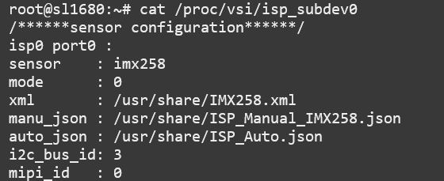

=====================================
Updating the ISP Sensor Configuration
=====================================

SL1680 supports multiple camera sensors. By default, SL1680 is configured to use the IMX258 module. But, the software can be configured to use any of the
supported sensor modules. 

Supported Camera Modules
------------------------

=======  =======================================================================================   ==========  ======================================= ================
Sensor   Module                                                                                    Interface   Adapter Board                           DTS Change
=======  =======================================================================================   ==========  ======================================= ================
IMX258   Synaptics IMX258 Camera Module                                                            MIPI-CSI 0  Synaptics SL1680 MIPI CSI Adaptor Board No
IMX415   Synaptics IMX415 Camera Module                                                            MIPI-CSI 0  Synaptics SL1680 MIPI CSI Adaptor Board No
OV5647   `Arducam 5MP OV5647 Camera Module
         <https://www.arducam.com/product/arducam-ov5647-standard-raspberry-pi-camera-b0033/>`__   MIPI-CSI 0  None                                    Yes
=======  =======================================================================================   ==========  ======================================= ================

Changing the Camera Sensor Module
---------------------------------

The file ``/proc/vsi/isp_subdev0`` is used to display the sensor configuration properties and to update the sensor configuration.

Current Sensor Configuration
^^^^^^^^^^^^^^^^^^^^^^^^^^^^

The current sensor configuration can be viewed by read from the ``/proc/vsi/isp_subdev0`` file.

    Reading the current sensor configuration

Configuring a New Module
^^^^^^^^^^^^^^^^^^^^^^^^

To change the sensor write a string to ``/proc/vsi/isp_subdev0`` which contains the sensor name
and XML configuration file::

    echo "sensor=imx415 xml=/usr/share/IMX415.xml" > /proc/vsi/isp_subdev0

Each camera sensor module contains one or more XML configuration files located in ``/usr/share``.

    List of sensor config files

Updating Kernel DTS for the OV5647
----------------------------------

Using the OV5647 camera module also requires an update to the kernel's device tree. This requires modifying the
``linux-syna`` package using ``devtool``::

    devtool modify linux-syna

Modify the ``dolphin-rdk.dts`` file located in ``build-sl1680/workspace/sources/linux-syna/arch/arm64/boot/dts/synaptics``.

::

    diff --git a/arch/arm64/boot/dts/synaptics/dolphin-rdk.dts b/arch/arm64/boot/dts/synaptics/dolphin-rdk.dts
    index ee1fbb6..3bcdea7 100644
    --- a/arch/arm64/boot/dts/synaptics/dolphin-rdk.dts
    +++ b/arch/arm64/boot/dts/synaptics/dolphin-rdk.dts
    @@ -158,14 +158,6 @@
                                    #gpio-cells = <2>;
                            };

    -                       expander2: gpio@49 {
    -                               compatible = "ti,pca9536";
    -                               reg = <0x49>;
    -                               gpio-controller;
    -                               #gpio-cells = <2>;
    -                               reset-gpios = <&expander1 4 GPIO_ACTIVE_LOW>;
    -                       };
    -
                            rtc0: rtc@68 {
                                    compatible = "dallas,ds1339";
                                    wakeup-source;
    @@ -540,8 +532,8 @@

    &isp_vsi {
            status = "okay";
    -       enable-gpio = <&expander2 1 GPIO_ACTIVE_HIGH>;
    -       reset-gpio = <&expander2 0 GPIO_ACTIVE_HIGH>;
    +       enable-gpio = <&expander1 0 GPIO_ACTIVE_HIGH>;
    +       reset-gpio = <&expander1 4 GPIO_ACTIVE_HIGH>;
    };

    &isp_vsi_video {

Build the image with the updated device tree entries::

   devtool build linux-syna
   devtool build-image astra-media