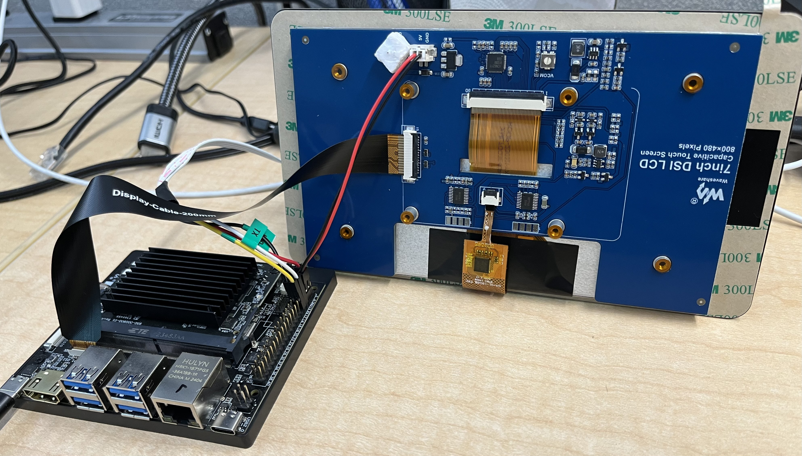

===================================
Waveshare Panel Configuration Guide
===================================

Introduction
============

Overview
--------

The scope of the document is to enable Waveshare panel on SL16xx platform. It provide details about the hardware connection required between the Waveshare panel and SL16xx platform and the software configuration changes required in device tree files (.dts extension).

Connection
==========

1. Connect the 5V and Ground of the waveshare panel to the 40 pin 
   connector. 5V to the Pin4 and Ground to Pin6 (GND).

   **Refer the connection below:**
    
.. figure:: SL16xx_waveshare_5v_connection.png

2. Connect the 15-22 pin DSI cable as shown in the below connection.

Software Configuration
======================
Power, backlight and DRM timing configuration need to be updated/added in the device tree file (.dts extension) as follows

**Regulator Configuration for power & backlight:**
::

	&i2c0 {
		status = "okay";
		pinctrl-names = "default";
		pinctrl-0 = <&i2c0_pmux>;
		/* Bridge chip supports data rate < 400kbps, so update the frequency accordingly */
		**clock-frequency = <100000>;**

		. . . .
		. . . .	

		rpi_panel_regulator: rpi_panel_regulator@45 {
			compatible = "raspberrypi,7inch-touchscreen-panel-regulator";
			reg = <0x45>;
			gpio-controller;
			#gpio-cells = <2>;
		};
	}

Syna DRM DSI configuration:
	Update the dsi_panel node configuration for the timing, power supply and Backlight.
	::

		dsi_panel {
			status= "okay";

			power-supply= <&rpi_panel_regulator>;
			backlight = <&rpi_panel_regulator>;

			NO_OF_RESID =  <1>;
			DSI_RES =  <102>;
			ACTIVE_WIDTH = <800>;
			HFP = <70>;
			HSYNCWIDTH = <20>;
			HBP = <26>;
			ACTIVE_HEIGHT = <480>;
			VFP = <7>;
			VSYNCWIDTH = <2>;
			VBP = <21>;
			FREQ = <28030>;
			TYPE = <1>;
			SCAN = <0>;
			FRAME_RATE = <9>;
			FLAG_3D = <0>;
			FREQ = <28030>;
			PTS_PER_4 = <6000>;

			bits_per_pixel = <24>;
			busformat = <0>;

			VB_MIN =  /bits/ 8 <6>;
			HB_MIN =  /bits/ 8 <30>;
			V_OFF = /bits/ 8 <6>;
			H_OFF = /bits/ 8 <20>;
			HB_VOP_OFF = /bits/ 8 <8>;
			VB_VOP_OFF = /bits/ 8 <3>;
			HB_BE = /bits/ 8 <7>;
			VB_BE = /bits/ 8 <2>;
			VB_FP = /bits/ 8 <2>;
			HB_FP = /bits/ 8 <10>;
			PIXEL_CLOCK = <28030>;

			HTOTAL = <916>;
			Lanes = /bits/ 8 <1>;
			Vid_mode = /bits/ 8 <2>;
			virtual_chan = /bits/ 8 <0>;
			Clk_Lane_Polarity = /bits/ 8 <0>;
			Data_Lane_Polarity = /bits/ 8 <0>;
			Recv_ack = /bits/ 8 <0>;
			Loosely_18 = /bits/ 8 <0>;
			H_polarity = /bits/ 8 <1>;
			V_Polarity = /bits/ 8 <1>;
			Data_Polarity = /bits/ 8 <1>;
			Eotp_tx = /bits/ 8 <1>;
			Eotp_rx = /bits/ 8 <0>;
			non-Continuous_clk = /bits/ 8 <0>;
			dpi_lp_cmd =  /bits/ 8 <1>;
			Color_coding = /bits/ 8 <5>;
			Chunks = <0>;
			Null_Pkt = <0>;
			Byte_clk = <84090>;

			/*  COMMAND= Command for initialization
			*  Format - <CMD> <Payloadlength-n> <BYTE1> <...> <BYTEn>
			*  Long write Ex: 39 04 FF 98 81 03

			*  Delay in micro seconds Command format: 0xFF <4BYTE delay>
			*  Delay for 100ms(100000us => 0x000186A0)
			*  	- FF A0 86 01 00
			*/
			command = /bits/ 8 <0x29  0x06 0x10  0x02  0x03  0x00  0x00 0x00
			0x29  0x06 0x64  0x01  0x0C  0x00  0x00 0x00
			0x29  0x06 0x68  0x01  0x0C  0x00  0x00 0x00
			0x29  0x06 0x44  0x01  0x00  0x00  0x00 0x00
			0x29  0x06 0x48  0x01  0x00  0x00  0x00 0x00
			0x29  0x06 0x14  0x01  0x15  0x00  0x00 0x00
			0x29  0x06 0x50  0x04  0x60  0x00  0x00 0x00
			0x29  0x06 0x20  0x04  0x52  0x01  0x10 0x00
			0x29  0x06 0x28  0x04  0x20  0x03  0x69 0x00
			0x29  0x06 0x2C  0x04  0x02  0x00  0x15 0x00
			0x29  0x06 0x30  0x04  0xe0  0x01  0x07 0x00
			0x29  0x06 0x34  0x04  0x0f  0x04  0x00 0x00
			0x29  0x06 0x64  0x04  0x0f  0x04  0x00 0x00
			0x29  0x06 0x04  0x01  0x01  0x00  0x00 0x00
			0x29  0x06 0x04  0x02  0x01  0x00  0x00 0x00
			0xFF 0xC0 0xD4 0x01 0x00
			0xFF 0x10 0x27 0x00 0x00>;
		};
