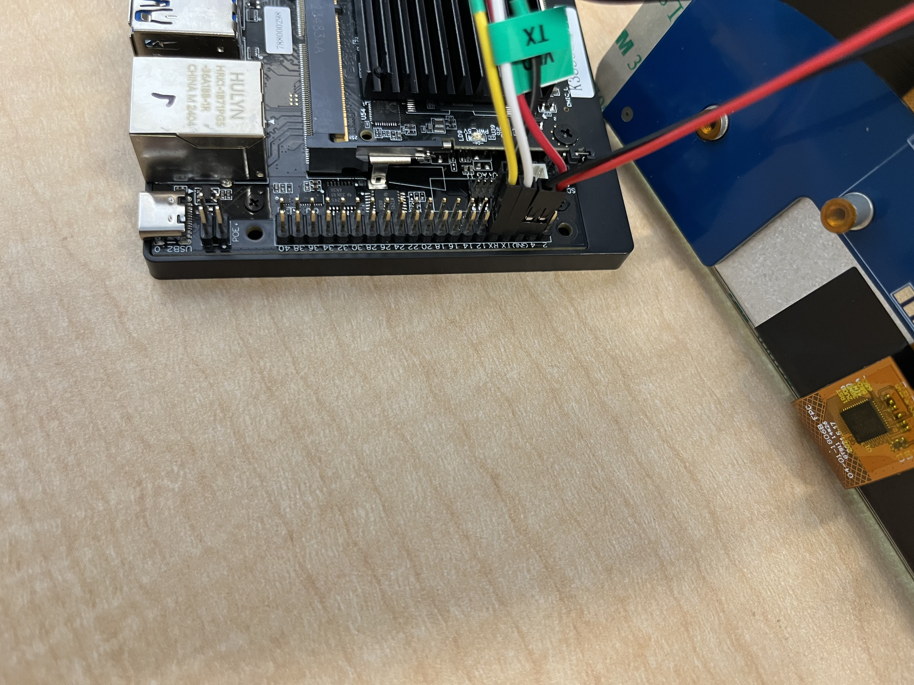

===================================
Waveshare Panel Configuration Guide
===================================

Introduction
============

Overview
--------

The scope of the document is to enable Waveshare panel on SL16xx platform. It provide details about the hardware connection required between Waveshare panels
and SL16xx platform and the software configuration changes required in device tree files (.dts extension). Astra Machina supports the 7" and 13.3" panels.

Connection
==========

1. Connect the 5V and Ground of the waveshare panel to the 40 pin 
   connector. 5V to the Pin4 and Ground to Pin6 (GND).

   **Refer the connection below:**
    

2. Connect the 15-22 pin DSI cable as shown in the below connection.

.. figure:: media/SL16xx_waveshare_dsi_cable_connection.png

Software Configuration
======================
The Waveshare panel can be enabled by setting the ``dtbo`` variable, in U-Boot, to the correct device tree overlay.

+-----------------+-----------------------------------+--------------------------------------+-------------------------------------+
|                 | SL1620                            | SL1640                               | SL1680                              |
+-----------------+-----------------------------------+--------------------------------------+-------------------------------------+
| 7" Panel        | myna2-ws-panel-overlay.dtbo       | platypus-ws-panel-overlay.dtbo       | dolphin-ws-panel-overlay.dtbo       |
+-----------------+-----------------------------------+--------------------------------------+-------------------------------------+
| 13.3" Panel     | myna2-ws-1080p-panel-overlay.dtbo | platypus-ws-1080p-panel-overlay.dtbo | dolphin-ws-1080p-panel-overlay.dtbo |
+-----------------+-----------------------------------+--------------------------------------+-------------------------------------+

Setting the device tree overlay requires booting into U-Boot and setting
the ``dtbo`` variable to the required device tree overlay. See :ref:`uboot_prompt` for instructions on getting to the
U-Boot prompt.

Once at the U-Boot prompt run the following commands to enable the Device Tree Overlay.

Set the ``dtbo`` variables::

    => setenv dtbo myna2-ws-panel-overlay.dtbo

Save the environment to the eMMC so that the new variable will persist across reboots.

::

    => saveenv
    Saving Environment to MMC... Writing to redundant MMC(0)... OK

Optionally, confirm that the variable was correctly set.

::

    => printenv
    altbootcmd=if test ${boot_slot}  = 1; then bootslot set b; bootcount reset;bootcount reset; run bootcmd; else bootslot set a; bootcount reset; bootcount reset; run bootcmd;  fi
    autoload=n
    baudrate=115200
    bootcmd=bootmmc
    bootcount=1
    bootdelay=0
    bootlimit=3
    dtbo=myna2-ws-panel-overlay.dtbo
    fdtcontroladdr=2172e190
    preboot=show_logo;
    upgrade_available=0
    ver=U-Boot 2019.10 (Nov 21 2024 - 14:01:42 +0000)
    Environment size: 407/65531 bytesboo

Finally, boot with the new overlay applied.

::

    => boot