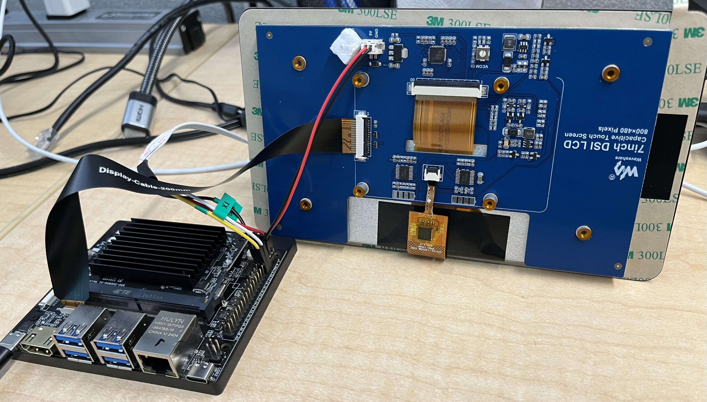

===================================
Waveshare Panel Configuration Guide
===================================

Introduction
============

Overview
--------

The scope of the document is to enable Waveshare panel on SL16xx platform. It provide details about the hardware connection required between Waveshare panels
and SL16xx platform and the software configuration changes required in device tree files (.dts extension). Astra Machina supports the 7" and 13.3" panels.

Connection
==========

1. Connect the 5V and Ground of the waveshare panel to the 40 pin 
   connector. 5V to the Pin4 and Ground to Pin6 (GND).

   **Refer the connection below:**
    

2. Connect the 15-22 pin DSI cable as shown in the below connection.

Software Configuration
======================
The Waveshare panel can be enabled by setting the ``dtbo`` variable, in U-Boot, to the correct device tree overlay.

+-----------------+-----------------------------------+--------------------------------------+-------------------------------------+
|                 | SL1620                            | SL1640                               | SL1680                              |
+-----------------+-----------------------------------+--------------------------------------+-------------------------------------+
| 7" Panel        | myna2-ws-panel-overlay.dtbo       | platypus-ws-panel-overlay.dtbo       | dolphin-ws-panel-overlay.dtbo       |
+-----------------+-----------------------------------+--------------------------------------+-------------------------------------+
| 13.3" Panel     | myna2-ws-1080p-panel-overlay.dtbo | platypus-ws-1080p-panel-overlay.dtbo | dolphin-ws-1080p-panel-overlay.dtbo |
+-----------------+-----------------------------------+--------------------------------------+-------------------------------------+

See :ref:`devicetree_overlays` for details on how to enable the devicetree overlays.