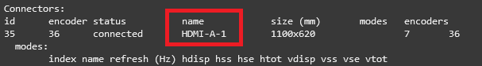

===================================================
Setting the Weston Default Display for Applications
===================================================

In dual display setups, it can be useful to set which display new applications (Weston Clients) should open in.
Astra Machina supports specifying which display should be the default. This is done by setting the
default display name in a file and setting the ``SHELL_OVERRIDE_DISPLAY_WINDOW`` parameter in ``/etc/default/weston``,
to the path of that file.

Identify then name of the display by looking at the 'Connectors' section using the command::

    modetest -M synaptics

Create a file in any location on the board which holds the name of the display. In this example we are using ``DSI-1``::

    echo "DSI-1" > /home/root/def_disp

Set the ``SHELL_OVERRIDE_DISPLAY_WINDOW`` parameter in ``/etc/default/weston``::

     SHELL_OVERRIDE_DISPLAY_WINDOW=/home/root/def_disp

Restart the Weston service to allow the change to take affect.
::

    systemctl restart weston

New applications will now open in the display named in ``/home/root/def_disp``. To change the default display, simply update this
file and restart Weston.