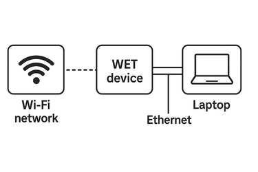

================================================
Wireless Ethernet Bridge Mode (WET Bridge Mode)
================================================

WET Bridge Mode allows Astra Machina to connect to a WiFi Network and
then bridge the WiFI connection to wired ethernet devices connected to the
ethernet port.

To Enable WET Bridge Mode
=========================

1. Flash the platform with the WET enable image.

2. Once bootup, create the WPA_Supplicant configuration file as shown
   below.

**wpa_supplicant.conf** for connecting to an WPA-PSK Wi-Fi network:

::

   cat <<EOF > /etc/wpa_supplicant.conf
   ctrl_interface=/var/run/wpa_supplicant
   ctrl_interface_group=0
   update_config=1
   network={
      ssid="Guest"
      psk="0807-2520"
      key_mgmt=WPA-PSK
      proto=WPA2
      pairwise=CCMP TKIP
      group=CCMP TKIP
      scan_ssid=1
   }
   EOF

**wpa_supplicant.conf** for connecting to an open Wi-Fi network:

::

   cat <<EOF > /etc/wpa_supplicant.conf
   ctrl_interface=/var/run/wpa_supplicant
   ctrl_interface_group=0
   update_config=1
   network={
      ssid="open-AP"
      key_mgmt=NONE
   }
   EOF

3. To establish a connection, plug the Ethernet cable into both the
   platform and the laptop. The resulting connection will appear as
   follows:

4. Run the attached script to create the WET bridge.

::

   set -x
   iface=wlan0
   briface=br0
   ethiface=eth0
   ifcmd=ifconfig
   iwcmd=iw
   brcmd=brctl
   ipcmd=ip
   wlcmd=wl.wet
   dhdcmd=dhd.wet

   $ifcmd $briface down
   $brcmd delif $briface $ethiface
   $brcmd delif $briface $iface
   $brcmd delbr $briface

   sleep 1

   $ifcmd $iface up
   $wlcmd mpc 0
   $wlcmd PM 0
   $wlcmd up

   wpa_supplicant -B -Dnl80211 -i wlan0 -c /etc/wpa_supplicant.conf
   sleep 10

   $wlcmd status
   sleep 2

   $iwcmd dev $iface set 4addr on
   $brcmd addbr $briface
   $brcmd addif $briface $ethiface
   $brcmd addif $briface $iface
   $brcmd show
   sleep 2

   kill $(ps | grep udhcpc | grep $iface | awk 'FNR == 1 {print $1}') > /dev/null 2>&1
   kill $(ps | grep udhcpc | grep $briface | awk 'FNR == 1 {print $1}') > /dev/null 2>&1
   sleep 1

   mac=$($wlcmd cur_etheraddr | awk '{print $2}')
   echo mac $mac
   $dhdcmd -i $iface wet 1
   $dhdcmd -i $iface wet_host_mac $mac
   sleep 1

   #dhclient -v $briface
   udhcpc -i $briface -b

   ipv4=$($ipcmd -4 addr show $briface | awk -F '[ /\t]+' '$2=="inet"{print $3; exit}')
   echo ipv4 $ipv4

   $dhdcmd -i $iface wet_host_ipv4 $ipv4

5. Laptop should able to get the IP and able to browse internet.
